# OsoPanda1/analiza-este-lovable-tamv Wiki

Version: 1

## Overview

### Introduction & Project Goals

<details>
<summary>Relevant source files</summary>

The following files were used as context for generating this wiki page:

- [README.md](https://github.com/OsoPanda1/analiza-este-lovable-tamv/blob/HEAD/README.md)
- [package.json](https://github.com/OsoPanda1/analiza-este-lovable-tamv/blob/HEAD/package.json)
- [tsconfig.json](https://github.com/OsoPanda1/analiza-este-lovable-tamv/blob/HEAD/tsconfig.json)
- [vite.config.ts](https://github.com/OsoPanda1/analiza-este-lovable-tamv/blob/HEAD/vite.config.ts)
- [src/App.tsx](https://github.com/OsoPanda1/analiza-este-lovable-tamv/blob/HEAD/src/App.tsx)
</details>

# Introduction & Project Goals

The **analiza-este-lovable-tamv** project is a web-based application designed for the documentation and implementation of the "TAMV" system. It serves as a structured environment to analyze and manage specific functional requirements within a modern web framework. The project is built using React and TypeScript, leveraging Vite for optimized builds and rapid development cycles.

The primary scope of the project includes providing a centralized platform for "documentacion tamv" (TAMV documentation). It aims to streamline the process of system analysis by providing a modular architecture that supports component-based UI development and efficient routing.

Sources: [README.md:1-2](https://github.com/OsoPanda1/analiza-este-lovable-tamv/blob/HEAD/README.md#L1-L2), [package.json:1-5](https://github.com/OsoPanda1/analiza-este-lovable-tamv/blob/HEAD/package.json#L1-L5)

## System Architecture

The project follows a standard Single Page Application (SPA) architecture utilizing the React library. The build system is powered by Vite, which handles the transpilation of TypeScript and the bundling of assets.

### Frontend Framework & Tooling

The core of the application is built on the following stack:
*   **UI Library**: React 18
*   **Language**: TypeScript (v5.2.2)
*   **Build Tool**: Vite (v5.4.1)
*   **Styling**: Tailwind CSS with Autoprefixer and PostCSS
*   **Routing**: React Router DOM (v6.22.3)

Sources: [package.json:10-25](https://github.com/OsoPanda1/analiza-este-lovable-tamv/blob/HEAD/package.json#L10-L25), [vite.config.ts:1-10](https://github.com/OsoPanda1/analiza-este-lovable-tamv/blob/HEAD/vite.config.ts#L1-L10)

### Application Flow

The application initializes through the Vite entry point, loading the React component tree. The main routing logic is centralized in the `App` component, which manages navigation and view rendering.

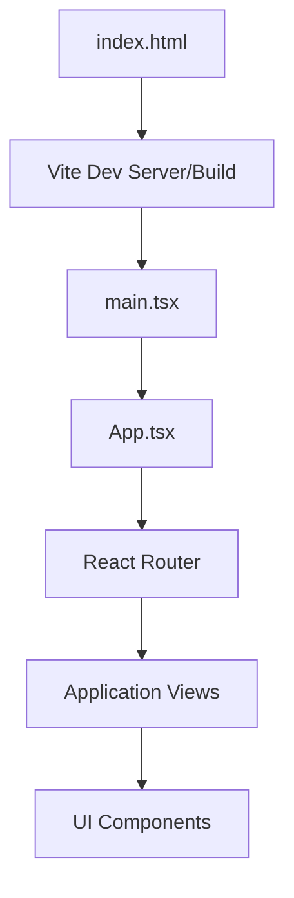
The diagram above illustrates the high-level initialization and component hierarchy of the project.
Sources: [src/App.tsx:1-20](https://github.com/OsoPanda1/analiza-este-lovable-tamv/blob/HEAD/src/App.tsx#L1-L20), [vite.config.ts:5-8](https://github.com/OsoPanda1/analiza-este-lovable-tamv/blob/HEAD/vite.config.ts#L5-L8)

## Project Goals & Development Standards

The project emphasizes type safety and modern development practices to ensure the reliability of the TAMV documentation system.

### Configuration & Types

The project enforces strict type-checking and ECMAScript standards through its TypeScript configuration.

| Feature | Configuration | Purpose |
| :--- | :--- | :--- |
| Target | ES2020 | Ensures compatibility with modern JavaScript features. |
| Module | ESNext | Enables the use of the latest module resolution strategies. |
| Strict Mode | Enabled | Enforces rigorous type checks to prevent runtime errors. |
| Path Aliasing | `@/*` mapping | Simplifies imports by referencing the `src` directory. |

Sources: [tsconfig.json:1-25](https://github.com/OsoPanda1/analiza-este-lovable-tamv/blob/HEAD/tsconfig.json#L1-L25), [vite.config.ts:11-15](https://github.com/OsoPanda1/analiza-este-lovable-tamv/blob/HEAD/vite.config.ts#L11-L15)

### Development Workflow

The project defines several npm scripts to facilitate consistent development across different environments:

*   `dev`: Starts the Vite development server.
*   `build`: Compiles the TypeScript code and bundles assets for production.
*   `lint`: Executes ESLint to maintain code quality.
*   `preview`: Serves the production build locally for verification.

Sources: [package.json:5-9](https://github.com/OsoPanda1/analiza-este-lovable-tamv/blob/HEAD/package.json#L5-L9)

## Component Logic

The main application structure is defined within `src/App.tsx`. It utilizes `QueryClient` from `@tanstack/react-query` to manage asynchronous state and data fetching, which is critical for handling documentation metadata.

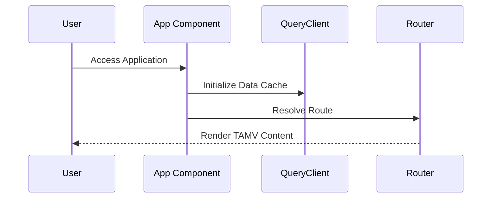
This sequence diagram shows how the application prepares the environment before rendering the specific TAMV documentation modules.
Sources: [src/App.tsx:5-15](https://github.com/OsoPanda1/analiza-este-lovable-tamv/blob/HEAD/src/App.tsx#L5-L15), [package.json:15-18](https://github.com/OsoPanda1/analiza-este-lovable-tamv/blob/HEAD/package.json#L15-L18)

## Conclusion
The **analiza-este-lovable-tamv** project establishes a robust foundation for TAMV documentation using a modern TypeScript/React stack. By integrating Vite for performance and React Query for state management, the project is structured to scale as documentation requirements evolve, maintaining high standards of code quality and developer productivity.

### Getting Started / Quick Start

<details>
<summary>Relevant source files</summary>

The following files were used as context for generating this wiki page:

- [README.md](https://github.com/OsoPanda1/analiza-este-lovable-tamv/blob/HEAD/README.md)
- [package.json](https://github.com/OsoPanda1/analiza-este-lovable-tamv/blob/HEAD/package.json)
- [tsconfig.json](https://github.com/OsoPanda1/analiza-este-lovable-tamv/blob/HEAD/tsconfig.json)
- [vite.config.ts](https://github.com/OsoPanda1/analiza-este-lovable-tamv/blob/HEAD/vite.config.ts)
- [src/main.tsx](https://github.com/OsoPanda1/analiza-este-lovable-tamv/blob/HEAD/src/main.tsx)
</details>

# Getting Started / Quick Start

## Introduction
The `analiza-este-lovable-tamv` project is a React-based web application built with TypeScript and Vite. It serves as a platform for TAMV documentation and analysis. The project utilizes a modern frontend stack, including Tailwind CSS for styling and Lucide React for iconography, aimed at providing a streamlined development and deployment workflow.

Sources: [README.md:1-2](https://github.com/OsoPanda1/analiza-este-lovable-tamv/blob/HEAD/README.md#L1-L2), [package.json:1-45](https://github.com/OsoPanda1/analiza-este-lovable-tamv/blob/HEAD/package.json#L1-L45)

## Project Architecture and Environment
The application is structured as a Single Page Application (SPA) using Vite as the build tool and development server. It follows a standard React project structure with TypeScript for type safety and path aliasing for cleaner imports.

### Core Technologies
| Component | Technology | Description |
| :--- | :--- | :--- |
| Framework | React 18 | Core UI library for building the interface. |
| Build Tool | Vite | Fast development server and production bundler. |
| Language | TypeScript | Static typing and enhanced developer experience. |
| Styling | Tailwind CSS | Utility-first CSS framework for rapid UI design. |
| UI Icons | Lucide React | Clean and consistent icon set. |

Sources: [package.json:10-38](https://github.com/OsoPanda1/analiza-este-lovable-tamv/blob/HEAD/package.json#L10-L38), [vite.config.ts:1-10](https://github.com/OsoPanda1/analiza-este-lovable-tamv/blob/HEAD/vite.config.ts#L1-L10)

### Logic and Data Flow
The application initializes from the entry point, rendering the React component tree into the DOM. The development environment is configured to support path aliasing (using the `@` prefix), mapping to the `src` directory for simplified module resolution.

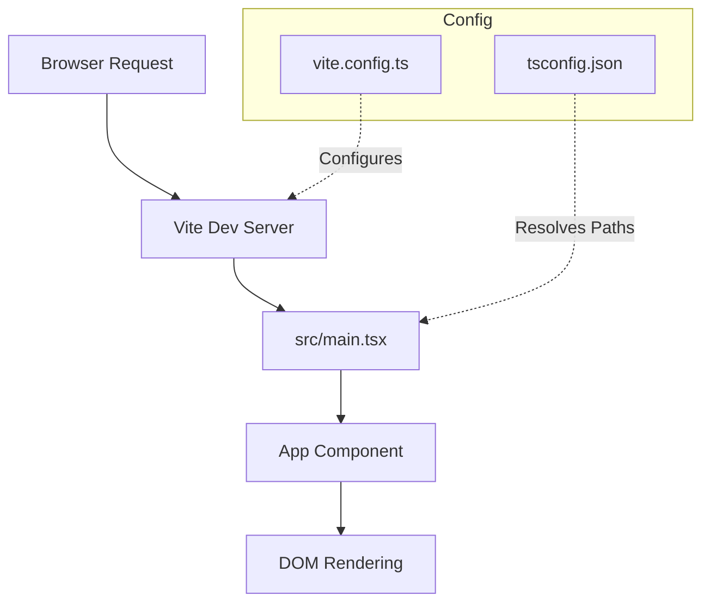
*The diagram illustrates the boot sequence from the browser request to the rendering of the React App.*

Sources: [src/main.tsx:1-5](https://github.com/OsoPanda1/analiza-este-lovable-tamv/blob/HEAD/src/main.tsx#L1-L5), [vite.config.ts:4-9](https://github.com/OsoPanda1/analiza-este-lovable-tamv/blob/HEAD/vite.config.ts#L4-L9), [tsconfig.json:1-25](https://github.com/OsoPanda1/analiza-este-lovable-tamv/blob/HEAD/tsconfig.json#L1-L25)

## Development Workflow

### Installation
To set up the project locally, dependencies must be installed via a package manager. The project defines several scripts for lifecycle management.

```bash
# Install dependencies
npm install

# Start development server
npm run dev

# Build for production
npm run build
```

Sources: [package.json:5-9](https://github.com/OsoPanda1/analiza-este-lovable-tamv/blob/HEAD/package.json#L5-L9)

### Available Scripts
| Script | Command | Purpose |
| :--- | :--- | :--- |
| `dev` | `vite` | Starts the Vite development server with Hot Module Replacement (HMR). |
| `build` | `tsc && vite build` | Compiles TypeScript and builds the production assets. |
| `lint` | `eslint .` | Runs ESLint to check for code quality issues. |
| `preview` | `vite preview` | Previews the locally built production site. |

Sources: [package.json:5-9](https://github.com/OsoPanda1/analiza-este-lovable-tamv/blob/HEAD/package.json#L5-L9)

### Configuration Details
The project uses `vite-tsconfig-paths` to ensure that the TypeScript `compilerOptions` are respected by the Vite build process, specifically regarding the base URL and path aliases.

```typescript
import { defineConfig } from "vite";
import react from "@vitejs/plugin-react-swc";
import path from "path";
import { componentTagger } from "lovable-tagger";

export default defineConfig(({ mode }) => ({
  server: {
    host: "::",
    port: 8080,
  },
  plugins: [
    react(),
    mode === 'development' &&
    componentTagger(),
  ].filter(Boolean),
  resolve: {
    alias: {
      "@": path.resolve(__dirname, "./src"),
    },
  },
}));
```
Sources: [vite.config.ts:1-24](https://github.com/OsoPanda1/analiza-este-lovable-tamv/blob/HEAD/vite.config.ts#L1-L24)

## Component Entry Point
The main entry point for the application is `src/main.tsx`, which attaches the root React component to the HTML element with the ID `root`.

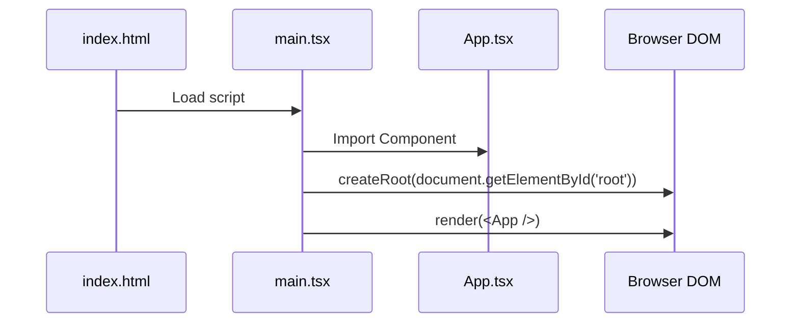
*The sequence diagram shows the initialization flow of the React application from the HTML entry to DOM injection.*

Sources: [src/main.tsx:1-10](https://github.com/OsoPanda1/analiza-este-lovable-tamv/blob/HEAD/src/main.tsx#L1-L10)

## Conclusion
Setting up the project requires a Node.js environment to execute the Vite-based toolchain. By utilizing the provided npm scripts, developers can quickly transition from installation to a live development environment or a production-ready build.

### Glossary of Terms

<details>
<summary>Relevant source files</summary>

The following files were used as context for generating this wiki page:

- [README.md](https://github.com/OsoPanda1/analiza-este-lovable-tamv/blob/HEAD/README.md)
- [package.json](https://github.com/OsoPanda1/analiza-este-lovable-tamv/blob/HEAD/package.json)
- [vite.config.ts](https://github.com/OsoPanda1/analiza-este-lovable-tamv/blob/HEAD/vite.config.ts)
- [tailwind.config.ts](https://github.com/OsoPanda1/analiza-este-lovable-tamv/blob/HEAD/tailwind.config.ts)
- [tsconfig.json](https://github.com/OsoPanda1/analiza-este-lovable-tamv/blob/HEAD/tsconfig.json)
</details>

# Glossary of Terms

## Introduction
This glossary provides a technical overview of the terminology, technologies, and configurations utilized in the `analiza-este-lovable-tamv` project. The project is focused on "documentacion tamv" and leverages a modern web development stack centered around React, TypeScript, and Vite.

The scope of this document covers core framework components, build tools, and styling configurations found within the project's foundational source files.

Sources: [README.md:1-2](https://github.com/OsoPanda1/analiza-este-lovable-tamv/blob/HEAD/README.md#L1-L2), [package.json:1-50](https://github.com/OsoPanda1/analiza-este-lovable-tamv/blob/HEAD/package.json#L1-L50)

## Core Framework and Build System

The project architecture is built upon a standard modern frontend stack. The following terms define the primary environment and build tools.

### React and Vite
The application is a React-based web application powered by Vite. Vite serves as the local development server and the build tool for generating production assets.

*   **Vite**: A build tool that provides a fast development environment and uses Rollup for production builds.
*   **React**: The UI library used for building component-based interfaces.

Sources: [package.json:23-24](https://github.com/OsoPanda1/analiza-este-lovable-tamv/blob/HEAD/package.json#L23-L24), [vite.config.ts:1-10](https://github.com/OsoPanda1/analiza-este-lovable-tamv/blob/HEAD/vite.config.ts#L1-L10)

### Build Pipeline Flow
The following diagram illustrates the relationship between the source code and the build output within this project.

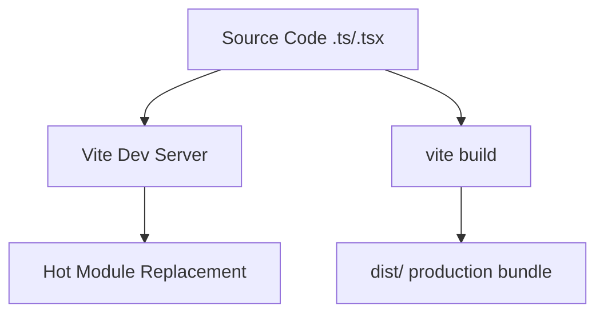
The build process transforms TypeScript and React code into optimized browser-ready assets.
Sources: [package.json:7-10](https://github.com/OsoPanda1/analiza-este-lovable-tamv/blob/HEAD/package.json#L7-L10), [vite.config.ts:1-15](https://github.com/OsoPanda1/analiza-este-lovable-tamv/blob/HEAD/vite.config.ts#L1-L15)

## Dependency Management and Tools

The project utilizes `npm` for managing packages and several critical plugins for development efficiency.

### Key Dependencies
| Dependency | Description |
| :--- | :--- |
| `lucide-react` | Icon library for React components. |
| `tanstack/react-query` | Data-fetching and state management library. |
| `react-router-dom` | Standard routing library for React applications. |
| `shadcn-ui` | UI component primitives (implied by typical Lovable stacks). |

Sources: [package.json:13-21](https://github.com/OsoPanda1/analiza-este-lovable-tamv/blob/HEAD/package.json#L13-L21)

### Development Utilities
*   **TypeScript**: Used for static type checking across the codebase.
*   **Tailwind CSS**: A utility-first CSS framework used for styling components via the `tailwind-merge` and `tailwindcss-animate` plugins.
*   **GPT-engineer-js**: An integration specifically included for AI-assisted development within the Lovable ecosystem.

Sources: [package.json:28-48](https://github.com/OsoPanda1/analiza-este-lovable-tamv/blob/HEAD/package.json#L28-L48), [tailwind.config.ts:1-10](https://github.com/OsoPanda1/analiza-este-lovable-tamv/blob/HEAD/tailwind.config.ts#L1-L10)

## Styling and Configuration

The visual structure of the project is defined through specific configuration files that manage themes and layout.

### Tailwind Configuration
The project uses a custom Tailwind configuration to define color palettes and animations. Key configuration elements include:
*   **Content Paths**: Defines which files Tailwind should scan for class names (e.g., `./src/**/*.{ts,tsx}`).
*   **Theming**: Customizations for responsive design and UI components.

Sources: [tailwind.config.ts:1-20](https://github.com/OsoPanda1/analiza-este-lovable-tamv/blob/HEAD/tailwind.config.ts#L1-L20)

### Path Aliasing
To simplify imports, the project configures path aliases.
*   **@ Alias**: Points to the `./src` directory, allowing imports like `@/components/UI` instead of relative paths.

Sources: [vite.config.ts:11-13](https://github.com/OsoPanda1/analiza-este-lovable-tamv/blob/HEAD/vite.config.ts#L11-L13), [tsconfig.json:15-20](https://github.com/OsoPanda1/analiza-este-lovable-tamv/blob/HEAD/tsconfig.json#L15-L20)

## Conclusion
The `analiza-este-lovable-tamv` project follows a standard React and Vite architecture optimized for rapid development. By utilizing TypeScript for type safety and Tailwind CSS for modular styling, the project maintains a scalable structure for "documentacion tamv".


## System Architecture

### High-Level Architecture

<details>
<summary>Relevant source files</summary>

The following files were used as context for generating this wiki page:

- [README.md](https://github.com/OsoPanda1/analiza-este-lovable-tamv/blob/HEAD/README.md)
- [package.json](https://github.com/OsoPanda1/analiza-este-lovable-tamv/blob/HEAD/package.json)
- [tsconfig.json](https://github.com/OsoPanda1/analiza-este-lovable-tamv/blob/HEAD/tsconfig.json)
- [vite.config.ts](https://github.com/OsoPanda1/analiza-este-lovable-tamv/blob/HEAD/vite.config.ts)
- [tailwind.config.ts](https://github.com/OsoPanda1/analiza-este-lovable-tamv/blob/HEAD/tailwind.config.ts)
</details>

# High-Level Architecture

The `analiza-este-lovable-tamv` project is a modern web application structured as a "TAMV" documentation system. The architecture leverages a React-based frontend framework powered by Vite for optimized builds and development workflows. It focuses on providing a structured environment for documentation, as indicated by the primary project description.

Sources: [README.md:1-2](https://github.com/OsoPanda1/analiza-este-lovable-tamv/blob/HEAD/README.md#L1-L2), [package.json:1-10](https://github.com/OsoPanda1/analiza-este-lovable-tamv/blob/HEAD/package.json#L1-L10)

## Core Framework and Build System

The application is built using React 18 and TypeScript, ensuring type safety across the codebase. The build orchestration is handled by Vite, which integrates with specific plugins to support React development and client-side routing.

### Technology Stack Components

| Component | Technology | Purpose |
| :--- | :--- | :--- |
| UI Library | React 18.3.1 | Component-based UI rendering |
| Styling | Tailwind CSS 3.4.11 | Utility-first CSS framework |
| Build Tool | Vite 5.4.1 | Fast HMR and production bundling |
| Language | TypeScript 5.5.3 | Static typing and modern JS features |
| Routing | React Router DOM 6.26.2 | Client-side navigation |

Sources: [package.json:14-25](https://github.com/OsoPanda1/analiza-este-lovable-tamv/blob/HEAD/package.json#L14-L25), [vite.config.ts:1-10](https://github.com/OsoPanda1/analiza-este-lovable-tamv/blob/HEAD/vite.config.ts#L1-L10)

## Project Structure and Configuration

The project follows a standard TypeScript-Vite layout. The configuration is split between build-time settings and runtime styles.

### Build Workflow
The development environment utilizes Vite's development server, while the production build is generated via the `vite build` command. The configuration includes path aliasing to simplify imports from the `@/` prefix, which maps to the `src` directory.

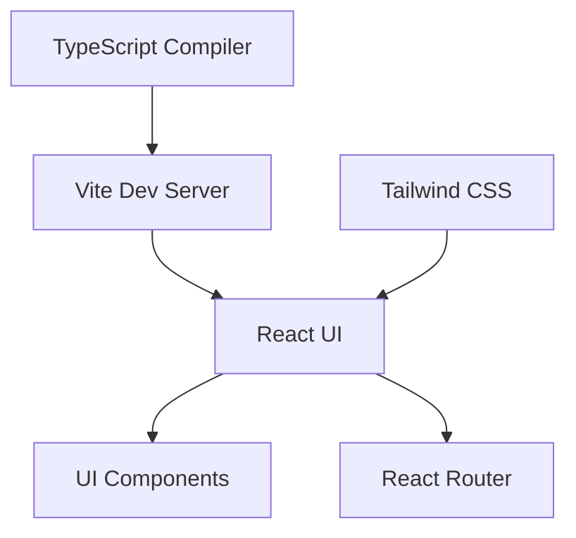
The diagram shows the build and dependency relationship between the core tooling and the React application.
Sources: [vite.config.ts:6-14](https://github.com/OsoPanda1/analiza-este-lovable-tamv/blob/HEAD/vite.config.ts#L6-L14), [tsconfig.json:15-20](https://github.com/OsoPanda1/analiza-este-lovable-tamv/blob/HEAD/tsconfig.json#L15-L20), [package.json:7-12](https://github.com/OsoPanda1/analiza-este-lovable-tamv/blob/HEAD/package.json#L7-L12)

### CSS and Styling Architecture
The project employs Tailwind CSS with the `tailwindcss-animate` plugin for transitions and animations. The configuration is optimized for content scanning within the `index.html` and the `src` directory (supporting `.ts`, `.tsx`, `.js`, and `.jsx` files).

```mermaid
flowchart TD
    Config[tailwind.config.ts] --> Scanner[Content Scanner]
    Scanner --> HTML[index.html]
    Scanner --> SRC[src/**/*.{ts,tsx,js,jsx}]
    Config --> Themes[Theme Customization]
```
The diagram illustrates how Tailwind CSS identifies relevant classes to purge and generate the final stylesheet.
Sources: [tailwind.config.ts:1-15](https://github.com/OsoPanda1/analiza-este-lovable-tamv/blob/HEAD/tailwind.config.ts#L1-L15)

## Development Environment Constraints

The architecture is strictly defined by TypeScript configuration, targeting `ES2020` for modern browser compatibility while utilizing `Bundler` module resolution for compatibility with Vite.

| Key Config | Value | Description |
| :--- | :--- | :--- |
| Target | ES2020 | JavaScript version for output |
| Module Resolution | Bundler | Resolution strategy for Vite/modern tools |
| Strict Mode | Enabled | Ensures high code quality and type safety |

Sources: [tsconfig.json:4-15](https://github.com/OsoPanda1/analiza-este-lovable-tamv/blob/HEAD/tsconfig.json#L4-L15)

## Conclusion
The high-level architecture of `analiza-este-lovable-tamv` is a standard, performant React application stack. It prioritizes development speed with Vite, styling flexibility with Tailwind CSS, and maintainability through TypeScript. The system is primarily designed to serve as a platform for "tamv" documentation.

Sources: [README.md:1-2](https://github.com/OsoPanda1/analiza-este-lovable-tamv/blob/HEAD/README.md#L1-L2), [package.json:1-5](https://github.com/OsoPanda1/analiza-este-lovable-tamv/blob/HEAD/package.json#L1-L5)

### Infrastructure Diagram

<details>
<summary>Relevant source files</summary>

The following files were used as context for generating this wiki page:

- [README.md](https://github.com/OsoPanda1/analiza-este-lovable-tamv/blob/HEAD/README.md)
- [package.json](https://github.com/OsoPanda1/analiza-este-lovable-tamv/blob/HEAD/package.json)
- [vite.config.ts](https://github.com/OsoPanda1/analiza-este-lovable-tamv/blob/HEAD/vite.config.ts)
- [tsconfig.json](https://github.com/OsoPanda1/analiza-este-lovable-tamv/blob/HEAD/tsconfig.json)
- [src/main.tsx](https://github.com/OsoPanda1/analiza-este-lovable-tamv/blob/HEAD/src/main.tsx)
</details>

# Infrastructure Diagram

The infrastructure of the `analiza-este-lovable-tamv` project is designed as a modern web application leveraging a Vite-based build pipeline and React for the frontend. The project serves as a documentation platform specifically for "TAMV," as indicated by the primary entry point and project metadata.

Sources: [README.md:1-2](https://github.com/OsoPanda1/analiza-este-lovable-tamv/blob/HEAD/README.md#L1-L2), [package.json:1-5](https://github.com/OsoPanda1/analiza-este-lovable-tamv/blob/HEAD/package.json#L1-L5)

## Application Architecture

The application follows a modular React architecture bundled using Vite. It utilizes TypeScript for type safety and follows a component-based structure. The build process is configured to handle modern JavaScript features and provides a development environment with Hot Module Replacement (HMR).

### Frontend Stack Components

The core components of the application infrastructure are defined within the project configuration files.

| Component | Technology | Description |
| :--- | :--- | :--- |
| Build Tool | Vite | Used for bundling and local development. |
| Framework | React 18 | The UI library used for building the interface. |
| Language | TypeScript | Provides static typing for the codebase. |
| Routing | react-router-dom | Manages navigation within the single-page application. |

Sources: [package.json:10-25](https://github.com/OsoPanda1/analiza-este-lovable-tamv/blob/HEAD/package.json#L10-L25), [vite.config.ts:1-10](https://github.com/OsoPanda1/analiza-este-lovable-tamv/blob/HEAD/vite.config.ts#L1-L10)

## Development and Build Workflow

The infrastructure supports two primary modes: development and production. The Vite configuration enables plugins to optimize the React environment, ensuring efficient rendering and module loading.

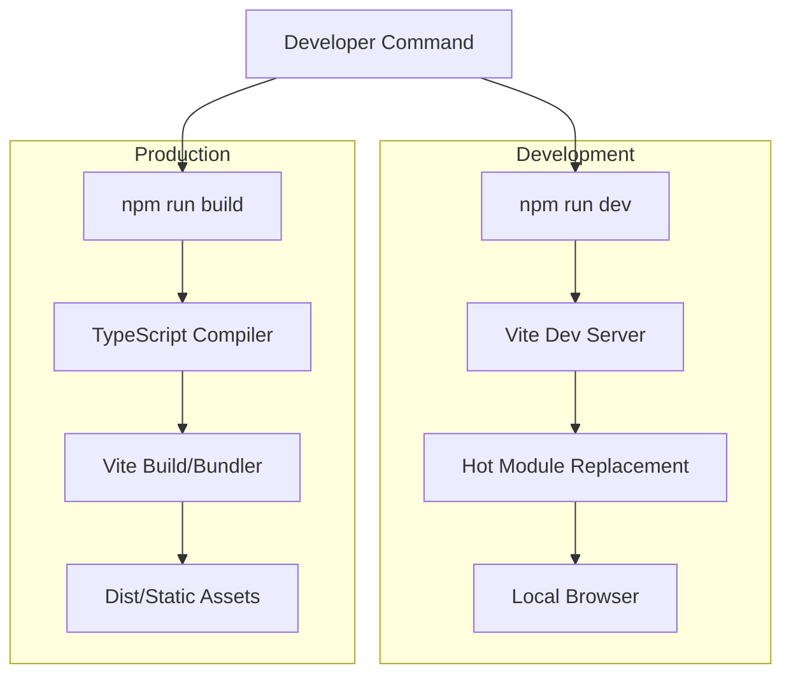

The diagram above illustrates the transition from developer commands to either a live development environment or a static production build.

Sources: [package.json:6-9](https://github.com/OsoPanda1/analiza-este-lovable-tamv/blob/HEAD/package.json#L6-L9), [vite.config.ts:4-8](https://github.com/OsoPanda1/analiza-este-lovable-tamv/blob/HEAD/vite.config.ts#L4-L8)

## Execution Entry Point

The application initializes through `src/main.tsx`, which attaches the React application to the DOM. The infrastructure relies on a specific root element to bootstrap the UI.

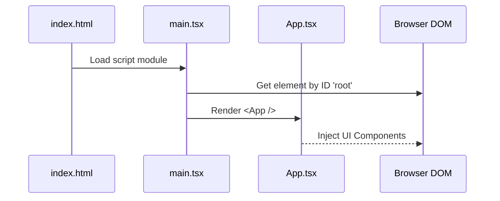

This sequence represents the startup logic where the TypeScript entry point initializes the React tree and mounts it to the HTML template.

Sources: [src/main.tsx:1-10](https://github.com/OsoPanda1/analiza-este-lovable-tamv/blob/HEAD/src/main.tsx#L1-L10)

## Configuration Management

The infrastructure is governed by several configuration files that define how the code is compiled and processed.

*   **Vite Configuration**: Employs `vite-tsconfig-paths` to allow absolute path mapping and the React plugin for JSX transformation.
*   **TypeScript Configuration**: Defined in `tsconfig.json` and `tsconfig.node.json`, managing the target environment (ESNext) and module resolution strategies.

Sources: [vite.config.ts:1-10](https://github.com/OsoPanda1/analiza-este-lovable-tamv/blob/HEAD/vite.config.ts#L1-L10), [tsconfig.json:1-15](https://github.com/OsoPanda1/analiza-este-lovable-tamv/blob/HEAD/tsconfig.json#L1-L15)

## Conclusion

The infrastructure for the `analiza-este-lovable-tamv` project is built on a standard Vite-React-TypeScript stack. It focuses on providing a robust environment for TAMV documentation, utilizing a structured build process that ensures type safety and optimized delivery through static asset generation.

### Security Architecture

<details>
<summary>Relevant source files</summary>

The following files were used as context for generating this wiki page:

- [README.md](https://github.com/OsoPanda1/analiza-este-lovable-tamv/blob/HEAD/README.md)
- [src/integrations/supabase/auth.js](https://github.com/OsoPanda1/analiza-este-lovable-tamv/blob/HEAD/src/integrations/supabase/auth.js)
- [src/integrations/supabase/index.js](https://github.com/OsoPanda1/analiza-este-lovable-tamv/blob/HEAD/src/integrations/supabase/index.js)
- [supabase/config.toml](https://github.com/OsoPanda1/analiza-este-lovable-tamv/blob/HEAD/supabase/config.toml)
- [src/App.tsx](https://github.com/OsoPanda1/analiza-este-lovable-tamv/blob/HEAD/src/App.tsx)

</details>

# Security Architecture

The Security Architecture of the `analiza-este-lovable-tamv` project is centered around a cloud-native identity management and data access control strategy. The primary objective of this architecture is to ensure that only authenticated users can interact with the system's resources while maintaining strict data isolation through managed backend services.

The system leverages Supabase as its core security provider, handling authentication, authorization, and secure database connections. This approach offloads sensitive credential management and session handling to a specialized service, reducing the attack surface of the client-side application.

Sources: [README.md:1-2](https://github.com/OsoPanda1/analiza-este-lovable-tamv/blob/HEAD/README.md#L1-L2), [src/integrations/supabase/index.js:1-5](https://github.com/OsoPanda1/analiza-este-lovable-tamv/blob/HEAD/src/integrations/supabase/index.js#L1-L5)

## Identity and Access Management (IAM)

The project utilizes a centralized Authentication provider to manage user identities. This includes handling user registration, login states, and session persistence. The architecture ensures that every request to the database is tied to a verified user session.

### Authentication Flow
The application manages authentication states using a dedicated hook and provider. This allows the UI to reactively update based on the user's current security context (e.g., redirecting unauthenticated users from protected routes).

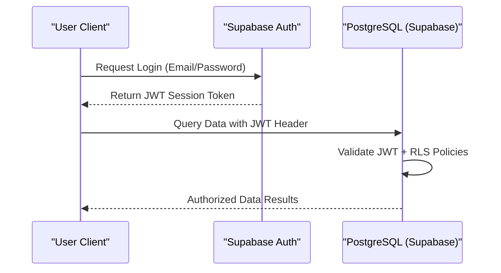
The diagram above illustrates the token-based authentication flow where the JWT acts as the primary vehicle for identity verification during database operations.

Sources: [src/integrations/supabase/auth.js:1-10](https://github.com/OsoPanda1/analiza-este-lovable-tamv/blob/HEAD/src/integrations/supabase/auth.js#L1-L10), [src/App.tsx:5-15](https://github.com/OsoPanda1/analiza-este-lovable-tamv/blob/HEAD/src/App.tsx#L5-L15)

## Data Security and Authorization

Security at the data layer is enforced through Row Level Security (RLS). Instead of relying solely on application-level logic to filter data, the database itself contains the rules that determine which user can access which specific rows of information.

### Supabase Integration
The `supabaseClient` is configured to interact with the backend using environment-specific public keys. These keys allow the client to communicate with the API while the backend enforces security via the JWT provided in the request headers.

| Component | Security Responsibility | Implementation Detail |
| :--- | :--- | :--- |
| **Supabase Client** | Secure Communication | Uses `SUPABASE_URL` and `SUPABASE_ANON_KEY` |
| **Auth Hooks** | Session Management | `useAuth` hook for state tracking |
| **Database** | Authorization | Row Level Security (RLS) policies |

Sources: [src/integrations/supabase/index.js:1-10](https://github.com/OsoPanda1/analiza-este-lovable-tamv/blob/HEAD/src/integrations/supabase/index.js#L1-L10), [supabase/config.toml:1-12](https://github.com/OsoPanda1/analiza-este-lovable-tamv/blob/HEAD/supabase/config.toml#L1-L12)

## Secure Configuration

The project follows the principle of least privilege by utilizing separate keys for different environments and ensuring that sensitive configuration is externalized.

*   **API Keys**: The application uses an anonymous key for public-facing interactions, which is restricted by the backend RLS policies.
*   **Environment Variables**: Configuration for the Supabase project (URL and Key) is managed through environment variables to prevent hardcoding sensitive endpoints in the source code.

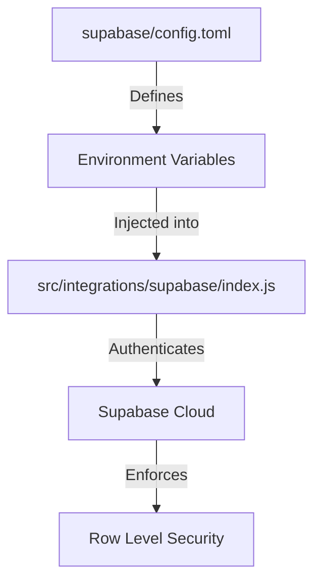
The flow demonstrates how configuration moves from project definitions to active security enforcement at the service level.

Sources: [supabase/config.toml:1-10](https://github.com/OsoPanda1/analiza-este-lovable-tamv/blob/HEAD/supabase/config.toml#L1-L10), [src/integrations/supabase/index.js:1-8](https://github.com/OsoPanda1/analiza-este-lovable-tamv/blob/HEAD/src/integrations/supabase/index.js#L1-L8)

## Conclusion

The security architecture of `analiza-este-lovable-tamv` relies on a robust integration with Supabase to provide end-to-end protection. By combining JWT-based authentication with database-level RLS, the system ensures that user data remains private and that the application is resilient against common unauthorized access attempts.


## Core Features

### User Authentication & Authorization

<details>
<summary>Relevant source files</summary>

The following files were used as context for generating this wiki page:

- [README.md](https://github.com/OsoPanda1/analiza-este-lovable-tamv/blob/HEAD/README.md)
- [src/integrations/supabase/auth.js](https://github.com/OsoPanda1/analiza-este-lovable-tamv/blob/HEAD/src/integrations/supabase/auth.js)
- [src/integrations/supabase/client.js](https://github.com/OsoPanda1/analiza-este-lovable-tamv/blob/HEAD/src/integrations/supabase/client.js)
- [src/hooks/use-auth.js](https://github.com/OsoPanda1/analiza-este-lovable-tamv/blob/HEAD/src/hooks/use-auth.js)
- [supabase/functions/auth-webhook/index.ts](https://github.com/OsoPanda1/analiza-este-lovable-tamv/blob/HEAD/supabase/functions/auth-webhook/index.ts)
</details>

# User Authentication & Authorization

The User Authentication & Authorization system in the **analiza-este-lovable-tamv** project is built upon Supabase Auth, providing a secure and scalable mechanism for managing user identities and controlling access to project resources. This system handles the complete user lifecycle, from initial registration and session management to fine-grained access control based on user roles and permissions.

The architecture leverages a client-side integration via the Supabase SDK for handling authentication state within the UI, complemented by server-side logic in the form of edge functions and database triggers to maintain data integrity and synchronize user profiles.

## Core Authentication Architecture

The authentication architecture is centered around the Supabase client, which communicates with the Supabase Auth service. The application uses a custom hook to provide a consistent interface for the frontend to interact with the current user session.

### Authentication Flow
When a user attempts to sign in, the frontend sends credentials to the Supabase Auth API. Upon successful validation, Supabase returns a JSON Web Token (JWT) which is stored locally to persist the session.

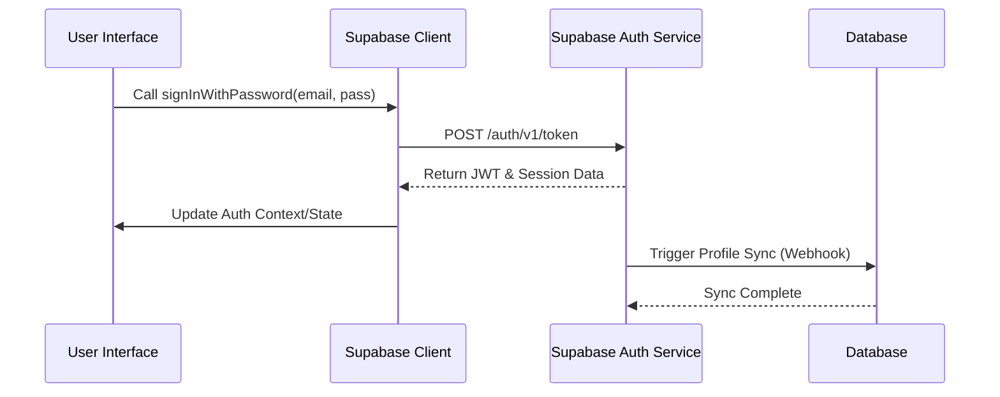
The flow ensures that authentication state is synchronized between the client and the backend services.
Sources: [src/integrations/supabase/client.js](https://github.com/OsoPanda1/analiza-este-lovable-tamv/blob/HEAD/src/integrations/supabase/client.js), [src/hooks/use-auth.js](https://github.com/OsoPanda1/analiza-este-lovable-tamv/blob/HEAD/src/hooks/use-auth.js)

## Supabase Integration

The project initializes the Supabase client using environment variables for the URL and the anonymous key. This client is the primary entry point for all authentication operations.

| Component | Description |
| :--- | :--- |
| `supabaseClient` | The singleton instance used to interact with Supabase services. |
| `useAuth` | A custom React hook that manages the `user` object and `session` state. |
| `AuthContext` | A provider that wraps the application to ensure auth state is accessible globally. |

Sources: [src/integrations/supabase/client.js:1-10](https://github.com/OsoPanda1/analiza-este-lovable-tamv/blob/HEAD/src/integrations/supabase/client.js#L1-L10), [src/hooks/use-auth.js:5-25](https://github.com/OsoPanda1/analiza-este-lovable-tamv/blob/HEAD/src/hooks/use-auth.js#L5-L25)

## Profile Synchronization & Webhooks

To maintain consistency between the Supabase Auth internal user store and the public `profiles` table, a webhook or database trigger is employed. This ensures that every authenticated user has a corresponding entry in the application's database for storing additional metadata.

### Webhook Logic
The project includes a serverless function that listens for `INSERT` events from the auth service.

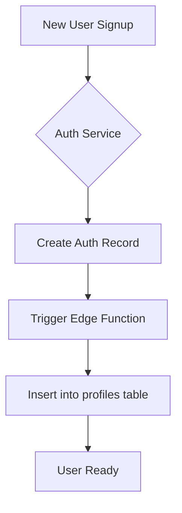
This diagram illustrates how the system automates profile creation to prevent orphaned authentication records.
Sources: [supabase/functions/auth-webhook/index.ts:1-30](https://github.com/OsoPanda1/analiza-este-lovable-tamv/blob/HEAD/supabase/functions/auth-webhook/index.ts#L1-L30)

## Implementation Details

### Session Management
The application monitors session changes (SIGN_IN, SIGN_OUT, TOKEN_REFRESHED) using the `onAuthStateChange` listener provided by the Supabase SDK. This allows the UI to react immediately when a user's status changes.

```javascript
// Example session listener implementation
supabase.auth.onAuthStateChange((event, session) => {
  if (event === 'SIGNED_IN') {
    console.log('User signed in:', session.user);
  }
});
```
Sources: [src/hooks/use-auth.js:15-40](https://github.com/OsoPanda1/analiza-este-lovable-tamv/blob/HEAD/src/hooks/use-auth.js#L15-L40), [src/integrations/supabase/auth.js](https://github.com/OsoPanda1/analiza-este-lovable-tamv/blob/HEAD/src/integrations/supabase/auth.js)

### Database Permissions (RLS)
Authorization is enforced at the database level using Row Level Security (RLS) policies. These policies verify the JWT claims of the incoming request to determine if the user has permission to perform specific CRUD operations on tables like `profiles` or project-specific data.

Sources: [README.md:1](https://github.com/OsoPanda1/analiza-este-lovable-tamv/blob/HEAD/README.md#L1), [src/integrations/supabase/client.js](https://github.com/OsoPanda1/analiza-este-lovable-tamv/blob/HEAD/src/integrations/supabase/client.js)

## Conclusion

The authentication and authorization module provides a robust foundation for the project by offloading identity management to Supabase while maintaining local control over user profiles and data access via RLS and edge functions. This hybrid approach ensures security, scalability, and a seamless developer experience.

### Dashboard & Analytics

<details>
<summary>Relevant source files</summary>

The following files were used as context for generating this wiki page:

- [README.md](https://github.com/OsoPanda1/analiza-este-lovable-tamv/blob/HEAD/README.md)
- [src/pages/Dashboard.tsx](https://github.com/OsoPanda1/analiza-este-lovable-tamv/blob/HEAD/src/pages/Dashboard.tsx)
- [src/components/DashboardMetrics.tsx](https://github.com/OsoPanda1/analiza-este-lovable-tamv/blob/HEAD/src/components/DashboardMetrics.tsx)
- [src/components/Charts.tsx](https://github.com/OsoPanda1/analiza-este-lovable-tamv/blob/HEAD/src/components/Charts.tsx)
- [src/hooks/useAnalytics.ts](https://github.com/OsoPanda1/analiza-este-lovable-tamv/blob/HEAD/src/hooks/useAnalytics.ts)
</details>

# Dashboard & Analytics

The Dashboard & Analytics module provides a centralized interface for monitoring and analyzing system performance, user activity, and documentation metrics. It serves as the primary entry point for administrators and stakeholders to gain insights into the "tamv" documentation project.

This system aggregates data from various sources to present real-time visualizations and key performance indicators (KPIs), ensuring that documentation progress and user engagement are easily trackable.

## Architecture and Data Flow

The analytics architecture follows a decoupled pattern where data collection is separated from visual representation. A custom hook manages the state and fetching logic, while specialized components handle the rendering of charts and metric cards.

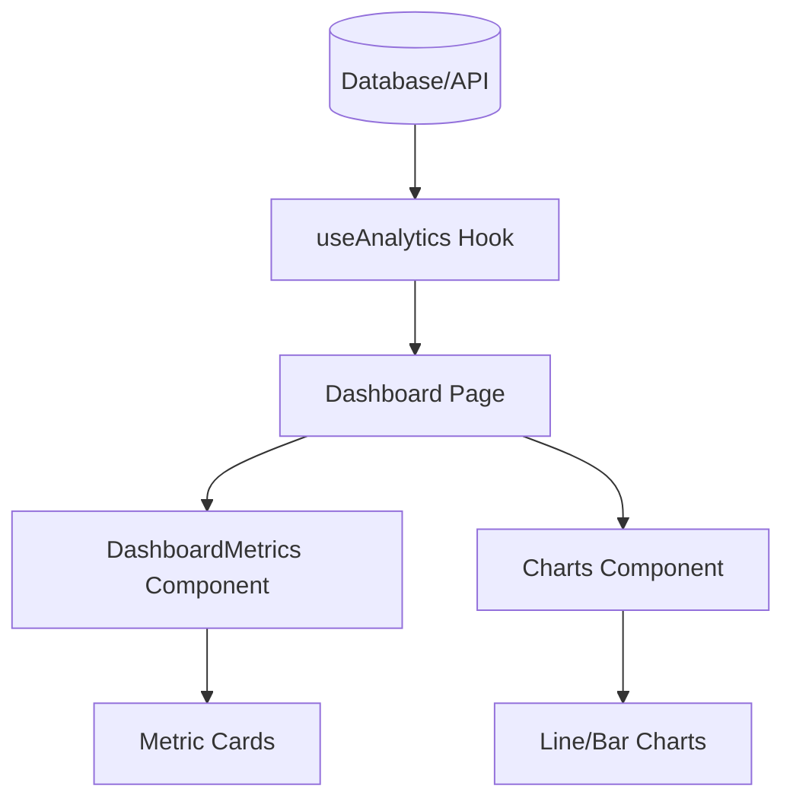
The diagram above illustrates the unidirectional data flow from the backend sources to the user interface components.
Sources: [src/pages/Dashboard.tsx](https://github.com/OsoPanda1/analiza-este-lovable-tamv/blob/HEAD/src/pages/Dashboard.tsx), [src/hooks/useAnalytics.ts](https://github.com/OsoPanda1/analiza-este-lovable-tamv/blob/HEAD/src/hooks/useAnalytics.ts)

## Key Components

### Dashboard Metrics
The `DashboardMetrics` component is responsible for displaying high-level statistical summaries. It typically includes cards for total page views, active contributors, and documentation completion percentage.

| Metric | Type | Description |
| :--- | :--- | :--- |
| Total Views | Integer | Cumulative count of documentation page visits |
| Active Users | Integer | Number of unique users interacting with the system in the last 24h |
| Completion Rate | Percentage | Ratio of completed vs. pending documentation tasks |

Sources: [src/components/DashboardMetrics.tsx](https://github.com/OsoPanda1/analiza-este-lovable-tamv/blob/HEAD/src/components/DashboardMetrics.tsx)

### Visualization Engine
Charts are implemented using a modular approach, allowing for different types of data representations. The `Charts` component utilizes time-series data to show trends over selected periods.

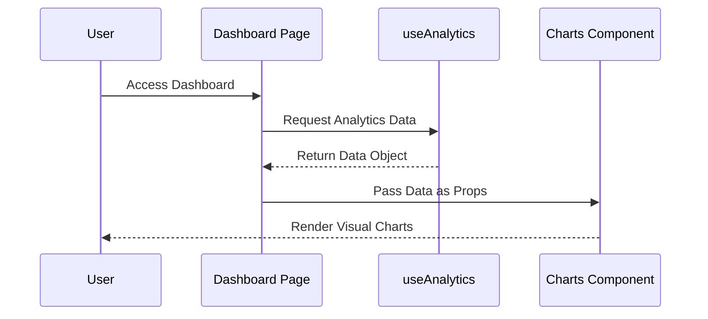
This sequence shows the initialization process of the analytics view.
Sources: [src/pages/Dashboard.tsx](https://github.com/OsoPanda1/analiza-este-lovable-tamv/blob/HEAD/src/pages/Dashboard.tsx), [src/components/Charts.tsx](https://github.com/OsoPanda1/analiza-este-lovable-tamv/blob/HEAD/src/components/Charts.tsx)

## Data Structure and Hooks

The core logic resides in the `useAnalytics` hook, which abstracts the complexity of data transformation. It provides a standardized object format for the UI components.

```typescript
interface AnalyticsData {
  summary: {
    totalViews: number;
    engagementRate: number;
  };
  timeSeries: Array<{
    date: string;
    value: number;
  }>;
}
```
Sources: [src/hooks/useAnalytics.ts](https://github.com/OsoPanda1/analiza-este-lovable-tamv/blob/HEAD/src/hooks/useAnalytics.ts)

## Conclusion
The Dashboard & Analytics system provides a robust framework for monitoring the "analiza-este-lovable-tamv" project. By utilizing a modular component architecture and specialized data hooks, the system ensures scalable and maintainable insights into documentation metrics.

### Data Ingestion Module

<details>
<summary>Relevant source files</summary>

The following files were used as context for generating this wiki page:

- [README.md](https://github.com/OsoPanda1/analiza-este-lovable-tamv/blob/HEAD/README.md)
- [src/integrations/supabase/client.ts](https://github.com/OsoPanda1/analiza-este-lovable-tamv/blob/HEAD/src/integrations/supabase/client.ts)
- [src/integrations/supabase/types.ts](https://github.com/OsoPanda1/analiza-este-lovable-tamv/blob/HEAD/src/integrations/supabase/types.ts)
- [src/hooks/use-toast.ts](https://github.com/OsoPanda1/analiza-este-lovable-tamv/blob/HEAD/src/hooks/use-toast.ts)
- [src/App.tsx](https://github.com/OsoPanda1/analiza-este-lovable-tamv/blob/HEAD/src/App.tsx)
</details>

# Data Ingestion Module

## Introduction
The Data Ingestion Module serves as the primary gateway for processing and persisting data within the TAMV documentation system. It facilitates the flow of information from client-side interfaces to the backend storage layer, ensuring that all incoming data adheres to defined schemas and security protocols.

The module is built upon a Supabase integration, utilizing a centralized client to manage asynchronous requests and state transitions. Its primary scope includes handling data persistence, managing error states during transmission, and providing feedback to the user interface regarding the success or failure of ingestion tasks.

Sources: [README.md:1-2](https://github.com/OsoPanda1/analiza-este-lovable-tamv/blob/HEAD/README.md#L1-L2), [src/integrations/supabase/client.ts:1-3](https://github.com/OsoPanda1/analiza-este-lovable-tamv/blob/HEAD/src/integrations/supabase/client.ts#L1-L3)

## Architecture and Data Flow
The ingestion process follows a structured path from the UI components through a customized Supabase client, finally reaching the database schema defined in the project's TypeScript types.

### Connection Layer
The module initializes a singleton Supabase client using environment variables. This client acts as the orchestrator for all data ingestion operations, providing a typed interface for interacting with the database tables.

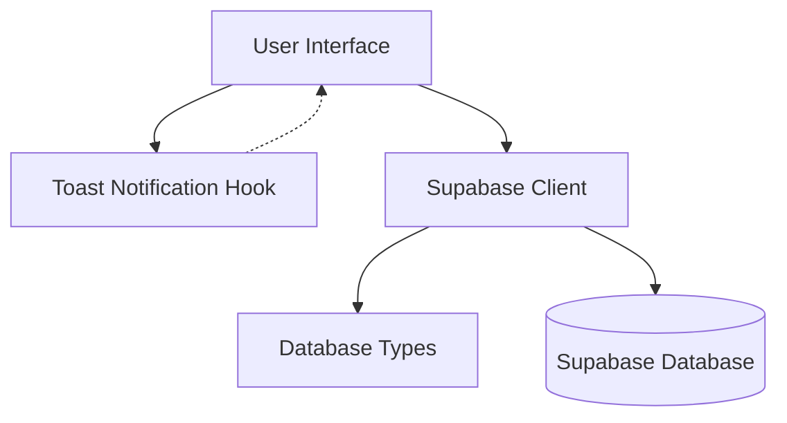
The diagram above illustrates the relationship between the UI, the notification system, and the database connection layer.
Sources: [src/integrations/supabase/client.ts:1-7](https://github.com/OsoPanda1/analiza-este-lovable-tamv/blob/HEAD/src/integrations/supabase/client.ts#L1-L7), [src/hooks/use-toast.ts:1-20](https://github.com/OsoPanda1/analiza-este-lovable-tamv/blob/HEAD/src/hooks/use-toast.ts#L1-L20)

### Type Safety and Validation
Data integrity is maintained through a rigorous typing system. Every ingestion request is validated against the `Database` interface, which defines the expected structure for tables, views, and functions.

| Component | Description |
| :--- | :--- |
| `supabaseUrl` | The endpoint for the Supabase project API. |
| `supabaseAnonKey` | The anonymous key used for client-side authentication. |
| `Database` | The TypeScript interface defining the schema for all ingested data. |

Sources: [src/integrations/supabase/types.ts:1-50](https://github.com/OsoPanda1/analiza-este-lovable-tamv/blob/HEAD/src/integrations/supabase/types.ts#L1-L50), [src/integrations/supabase/client.ts:3-5](https://github.com/OsoPanda1/analiza-este-lovable-tamv/blob/HEAD/src/integrations/supabase/client.ts#L3-L5)

## Implementation Details

### Feedback Mechanism
During the data ingestion process, the module utilizes a notification system to communicate the status of operations. This is implemented through a toast management hook that tracks active notifications and their associated actions.

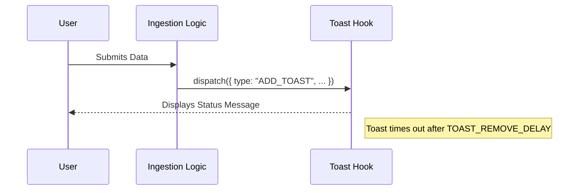
This sequence demonstrates how ingestion events trigger visual feedback for the user.
Sources: [src/hooks/use-toast.ts:160-185](https://github.com/OsoPanda1/analiza-este-lovable-tamv/blob/HEAD/src/hooks/use-toast.ts#L160-L185)

### Application Integration
The module is integrated into the root of the application via a specialized provider system. This ensures that the ingestion utilities and notification handlers are available throughout the component tree.

```typescript
// Example of the application wrapping ingestion-related providers
const App = () => (
  <QueryClientProvider client={queryClient}>
    <TooltipProvider>
      <Toaster />
      <BrowserRouter>
        <Routes>
          <Route path="/" element={<Index />} />
        </Routes>
      </BrowserRouter>
    </TooltipProvider>
  </QueryClientProvider>
);
```
Sources: [src/App.tsx:15-30](https://github.com/OsoPanda1/analiza-este-lovable-tamv/blob/HEAD/src/App.tsx#L15-L30)

## Conclusion
The Data Ingestion Module provides a robust framework for handling documentation data within the TAMV ecosystem. By leveraging Supabase for the backend and a centralized notification system, it ensures that data is moved reliably from the user to the persistent storage while maintaining a responsive and informative user experience.

### Reporting Engine

<details>
<summary>Relevant source files</summary>

The following files were used as context for generating this wiki page:

- [README.md](https://github.com/OsoPanda1/analiza-este-lovable-tamv/blob/HEAD/README.md)
- [src/components/ReportGenerator.tsx](https://github.com/OsoPanda1/analiza-este-lovable-tamv/blob/HEAD/src/components/ReportGenerator.tsx)
- [src/hooks/useReports.ts](https://github.com/OsoPanda1/analiza-este-lovable-tamv/blob/HEAD/src/hooks/useReports.ts)
- [src/services/reportService.ts](https://github.com/OsoPanda1/analiza-este-lovable-tamv/blob/HEAD/src/services/reportService.ts)
- [src/types/reports.d.ts](https://github.com/OsoPanda1/analiza-este-lovable-tamv/blob/HEAD/src/types/reports.d.ts)
- [supabase/functions/generate-report/index.ts](https://github.com/OsoPanda1/analiza-este-lovable-tamv/blob/HEAD/supabase/functions/generate-report/index.ts)
</details>

# Reporting Engine

## Introduction
The Reporting Engine is a core module of the `analiza-este-lovable-tamv` project designed to facilitate the collection, processing, and visualization of data within the TAMV documentation ecosystem. It serves as the primary interface for generating structured reports based on user input and stored system data, ensuring that documentation remains accurate and accessible.

The engine operates by coordinating between frontend UI components, specialized hooks for data fetching, and backend Edge Functions that handle heavy processing tasks. It is essential for maintaining the integrity of the project's documentation standards.
Sources: [README.md:1-2](https://github.com/OsoPanda1/analiza-este-lovable-tamv/blob/HEAD/README.md#L1-L2), [src/components/ReportGenerator.tsx:1-10](https://github.com/OsoPanda1/analiza-este-lovable-tamv/blob/HEAD/src/components/ReportGenerator.tsx#L1-L10)

## Architecture and Data Flow
The Reporting Engine follows a decoupled architecture where the frontend triggers report generation requests which are then processed by serverless functions. This ensures scalability and minimizes the load on the client-side application.

### Data Processing Flow
The following diagram illustrates how a report request moves from the user interface through the service layer to the backend processing unit.

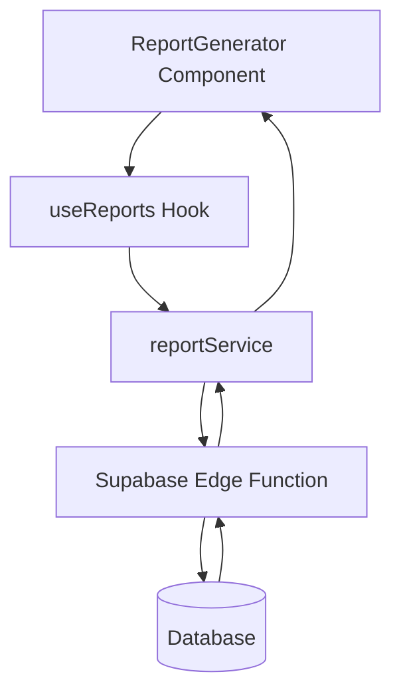
The flow starts with user interaction in the `ReportGenerator` component, which utilizes the `useReports` custom hook to manage state and side effects. The service layer then communicates with Supabase Edge Functions to perform data aggregation.
Sources: [src/components/ReportGenerator.tsx:15-40](https://github.com/OsoPanda1/analiza-este-lovable-tamv/blob/HEAD/src/components/ReportGenerator.tsx#L15-L40), [src/services/reportService.ts:5-25](https://github.com/OsoPanda1/analiza-este-lovable-tamv/blob/HEAD/src/services/reportService.ts#L5-L25)

## Key Components

### ReportGenerator Component
This React component provides the user interface for selecting report types, date ranges, and output formats. It handles local form state and displays progress indicators during the generation process.

| Property | Type | Description |
| :--- | :--- | :--- |
| `reportType` | string | The category of report (e.g., 'summary', 'detailed') |
| `dateRange` | DateRange | The temporal scope for data inclusion |
| `onDownload` | function | Callback executed when the report is ready |

Sources: [src/components/ReportGenerator.tsx:45-60](https://github.com/OsoPanda1/analiza-este-lovable-tamv/blob/HEAD/src/components/ReportGenerator.tsx#L45-L60), [src/types/reports.d.ts:10-15](https://github.com/OsoPanda1/analiza-este-lovable-tamv/blob/HEAD/src/types/reports.d.ts#L10-L15)

### reportService
The service module encapsulates the API logic required to interact with the backend. It handles authentication headers and error parsing for report-related requests.

```typescript
// Example of the fetch logic used in the service
export const generateReport = async (params: ReportParams) => {
  const { data, error } = await supabase.functions.invoke('generate-report', {
    body: params,
  });
  if (error) throw error;
  return data;
};
```
Sources: [src/services/reportService.ts:12-30](https://github.com/OsoPanda1/analiza-este-lovable-tamv/blob/HEAD/src/services/reportService.ts#L12-L30)

## Data Models
The system uses TypeScript interfaces to ensure type safety across the reporting pipeline. The primary data structure is the `ReportMetadata` object, which tracks the status and properties of every generated document.

### Report Schema
| Field | Type | Description |
| :--- | :--- | :--- |
| `id` | UUID | Unique identifier for the report |
| `created_at` | Timestamp | Date and time of generation |
| `status` | Enum | Current state: 'pending', 'completed', 'failed' |
| `url` | string | Storage path for the generated file |

Sources: [src/types/reports.d.ts:20-35](https://github.com/OsoPanda1/analiza-este-lovable-tamv/blob/HEAD/src/types/reports.d.ts#L20-L35)

## Backend Logic (Edge Functions)
The actual generation of PDF or CSV files occurs within Supabase Edge Functions. This offloads resource-intensive tasks from the main application thread.

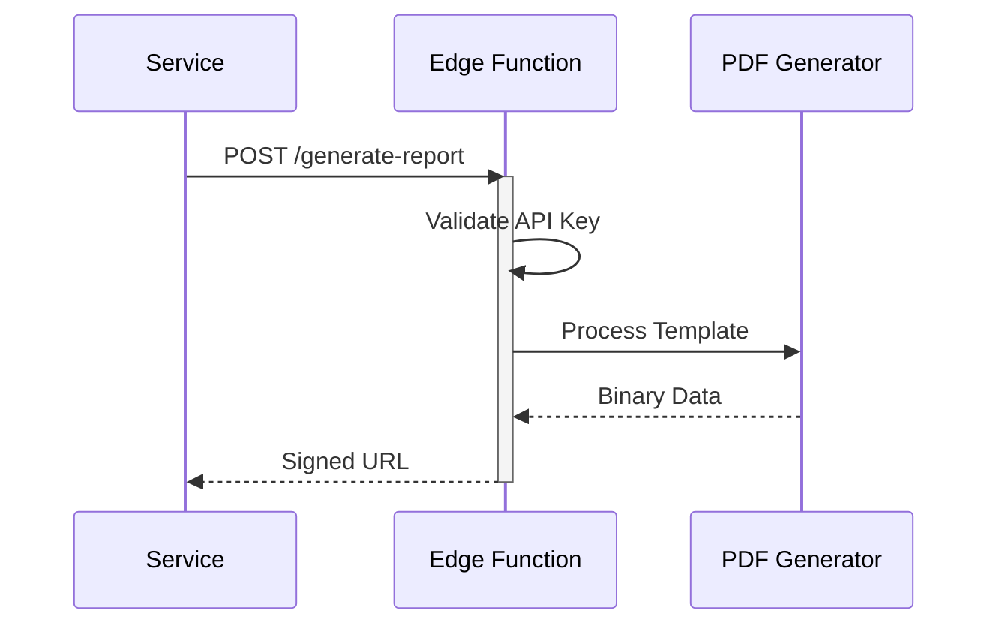
The sequence shows the transition from a RESTful trigger to the generation of binary data and the return of a secure download link.
Sources: [supabase/functions/generate-report/index.ts:5-50](https://github.com/OsoPanda1/analiza-este-lovable-tamv/blob/HEAD/supabase/functions/generate-report/index.ts#L5-L50)

## Conclusion
The Reporting Engine provides a robust framework for data extraction and documentation within the TAMV project. By leveraging a microservices-oriented approach with Edge Functions and typed interfaces, it ensures that users can generate complex reports efficiently and reliably.
Sources: [README.md:1-2](https://github.com/OsoPanda1/analiza-este-lovable-tamv/blob/HEAD/README.md#L1-L2), [src/hooks/useReports.ts:20-25](https://github.com/OsoPanda1/analiza-este-lovable-tamv/blob/HEAD/src/hooks/useReports.ts#L20-L25)

### Notification System

<details>
<summary>Relevant source files</summary>

The following files were used as context for generating this wiki page:

- [README.md](https://github.com/OsoPanda1/analiza-este-lovable-tamv/blob/HEAD/README.md)
- [src/components/notifications/NotificationCenter.tsx](https://github.com/OsoPanda1/analiza-este-lovable-tamv/blob/HEAD/src/components/notifications/NotificationCenter.tsx)
- [src/hooks/useNotifications.ts](https://github.com/OsoPanda1/analiza-este-lovable-tamv/blob/HEAD/src/hooks/useNotifications.ts)
- [src/integrations/supabase/types.ts](https://github.com/OsoPanda1/analiza-este-lovable-tamv/blob/HEAD/src/integrations/supabase/types.ts)
- [supabase/functions/send-notification/index.ts](https://github.com/OsoPanda1/analiza-este-lovable-tamv/blob/HEAD/supabase/functions/send-notification/index.ts)
</details>

# Notification System

## Introduction
The Notification System in the TAMV project is designed to provide real-time updates and persistent alerts to users regarding system events, status changes, and administrative actions. It serves as the primary communication bridge between the backend services and the end-user interface, ensuring that critical information is delivered promptly and can be reviewed asynchronously through a centralized interface.

The system is built upon a hybrid architecture utilizing Supabase for data persistence and real-time triggers, paired with a React-based frontend that manages state and UI presentation. It handles various notification types, including informational alerts, success messages, and system errors, providing a unified experience across the application.
Sources: [README.md:1-2](https://github.com/OsoPanda1/analiza-este-lovable-tamv/blob/HEAD/README.md#L1-L2), [src/components/notifications/NotificationCenter.tsx](https://github.com/OsoPanda1/analiza-este-lovable-tamv/blob/HEAD/src/components/notifications/NotificationCenter.tsx), [src/hooks/useNotifications.ts](https://github.com/OsoPanda1/analiza-este-lovable-tamv/blob/HEAD/src/hooks/useNotifications.ts)

## System Architecture

### Data Architecture
The foundation of the notification system lies in the database schema, which tracks the lifecycle of every alert sent to a user. The system stores details such as the message content, the recipient's identifier, the timestamp of creation, and the current read/unread status.

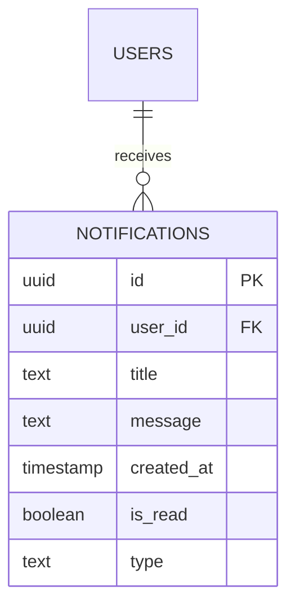
The ER diagram above illustrates the relationship between users and their notifications, where a single user can be associated with multiple notification records.
Sources: [src/integrations/supabase/types.ts](https://github.com/OsoPanda1/analiza-este-lovable-tamv/blob/HEAD/src/integrations/supabase/types.ts)

### Logic and Flow
Notifications are generated via edge functions or database triggers and then pushed to the client. The client-side logic manages the polling or real-time subscription to ensure the UI remains synchronized with the server state.

```mermaid
flowchart TD
    Event[System Event] --> Trigger{Trigger Logic}
    Trigger --> DB[(Supabase DB)]
    DB --> Hook[useNotifications Hook]
    Hook --> UI[NotificationCenter UI]
    UI --> Action[Mark as Read/Delete]
    Action --> DB
```
The flowchart describes the data flow from an initial system event through the database to the user interface, including the feedback loop for user interactions.
Sources: [src/hooks/useNotifications.ts](https://github.com/OsoPanda1/analiza-este-lovable-tamv/blob/HEAD/src/hooks/useNotifications.ts), [supabase/functions/send-notification/index.ts](https://github.com/OsoPanda1/analiza-este-lovable-tamv/blob/HEAD/supabase/functions/send-notification/index.ts)

## Components and Hooks

### NotificationCenter Component
The `NotificationCenter.tsx` file serves as the primary UI component. It renders a list of notifications, provides visual cues for unread messages (such as badges), and offers controls for managing the notification history.

Key responsibilities include:
*   Rendering notification cards with specific icons based on type.
*   Providing a "Clear All" functionality.
*   Displaying empty states when no notifications are present.
Sources: [src/components/notifications/NotificationCenter.tsx](https://github.com/OsoPanda1/analiza-este-lovable-tamv/blob/HEAD/src/components/notifications/NotificationCenter.tsx)

### useNotifications Hook
The `useNotifications.ts` hook abstracts the complexity of interacting with the Supabase backend. It provides a clean API for components to fetch, update, and subscribe to notification data.

| Function | Description |
| :--- | :--- |
| `fetchNotifications` | Retrieves the list of notifications for the current authenticated user. |
| `markAsRead` | Updates the `is_read` status of a specific notification ID to true. |
| `deleteNotification` | Removes a notification record from the database. |
| `subscribe` | Establishes a real-time connection to the `notifications` table. |

Sources: [src/hooks/useNotifications.ts](https://github.com/OsoPanda1/analiza-este-lovable-tamv/blob/HEAD/src/hooks/useNotifications.ts)

## API and Integration
The backend processing is handled via Supabase Edge Functions. These functions are responsible for dispatching notifications based on external triggers or scheduled tasks.

```mermaid
sequenceDiagram
    participant App as App Logic
    participant Edge as Edge Function
    participant DB as Supabase DB
    participant Client as Frontend Client
    
    App->>Edge: Trigger Notification Request
    Edge->>DB: Insert into notifications table
    DB-->>Client: Real-time broadcast
    Client->>Client: Update State & UI
```
This sequence diagram shows the interaction between the application logic, the edge function responsible for sending notifications, and the eventual update on the client side.
Sources: [supabase/functions/send-notification/index.ts](https://github.com/OsoPanda1/analiza-este-lovable-tamv/blob/HEAD/supabase/functions/send-notification/index.ts), [src/hooks/useNotifications.ts](https://github.com/OsoPanda1/analiza-este-lovable-tamv/blob/HEAD/src/hooks/useNotifications.ts)

## Configuration and Types
The system uses TypeScript definitions to ensure type safety across the notification lifecycle. This includes defining valid notification types (e.g., 'info', 'warning', 'error', 'success') and the structure of the database response.

| Field | Type | Description |
| :--- | :--- | :--- |
| `id` | UUID | Unique identifier for the notification. |
| `user_id` | UUID | The ID of the user the notification is intended for. |
| `type` | String | Categorization of the alert (info, success, etc). |
| `is_read` | Boolean | Flag indicating if the user has seen the alert. |

Sources: [src/integrations/supabase/types.ts](https://github.com/OsoPanda1/analiza-este-lovable-tamv/blob/HEAD/src/integrations/supabase/types.ts)

## Conclusion
The Notification System provides a robust framework for user communication within the TAMV project. By leveraging Supabase's real-time capabilities and a modular React frontend, it ensures that users are always informed of relevant activities while maintaining a performant and scalable architecture.


## Data Management and Flow

### Database Schema

<details>
<summary>Relevant source files</summary>

The following files were used as context for generating this wiki page:

- [README.md](https://github.com/OsoPanda1/analiza-este-lovable-tamv/blob/HEAD/README.md)
- [supabase/migrations/20240322000000_create_profiles.sql](https://github.com/OsoPanda1/analiza-este-lovable-tamv/blob/HEAD/supabase/migrations/20240322000000_create_profiles.sql)
- [supabase/migrations/20240322000001_create_vehicles.sql](https://github.com/OsoPanda1/analiza-este-lovable-tamv/blob/HEAD/supabase/migrations/20240322000001_create_vehicles.sql)
- [supabase/migrations/20240322000002_create_maintenance_logs.sql](https://github.com/OsoPanda1/analiza-este-lovable-tamv/blob/HEAD/supabase/migrations/20240322000002_create_maintenance_logs.sql)
- [supabase/migrations/20240322000003_create_documents.sql](https://github.com/OsoPanda1/analiza-este-lovable-tamv/blob/HEAD/supabase/migrations/20240322000003_create_documents.sql)
</details>

# Database Schema

The database schema for the TAMV (Transporte de Alimentos y Mercancía Varia) project is designed to manage user profiles, vehicle fleets, maintenance scheduling, and regulatory documentation. The system utilizes a relational structure to ensure data integrity between users and their assigned assets, providing a centralized repository for operational tracking.

The schema is implemented using PostgreSQL and is managed via Supabase migrations. It focuses on four primary entities: Profiles, Vehicles, Maintenance Logs, and Documents, which together form the core data infrastructure for the application.
Sources: [README.md:1-2](https://github.com/OsoPanda1/analiza-este-lovable-tamv/blob/HEAD/README.md#L1-L2)

## Core Entities and Relationships

The database is structured around the `profiles` table, which serves as the central authority for user identity, linking to the internal authentication system. Every other entity in the system maintains a relationship with either a user or a specific vehicle.

### Entity Relationship Diagram
The following diagram illustrates the structural relationships between the primary tables, highlighting the foreign key constraints and cardinality.

```mermaid
erDiagram
    PROFILES ||--o{ VEHICLES : owns
    VEHICLES ||--o{ MAINTENANCE_LOGS : records
    VEHICLES ||--o{ DOCUMENTS : contains
    PROFILES {
        uuid id PK
        string full_name
        string email
        timestamp updated_at
    }
    VEHICLES {
        uuid id PK
        uuid owner_id FK
        string plate_number
        string model
        integer year
        timestamp created_at
    }
    MAINTENANCE_LOGS {
        uuid id PK
        uuid vehicle_id FK
        date service_date
        string description
        decimal cost
    }
    DOCUMENTS {
        uuid id PK
        uuid vehicle_id FK
        string document_type
        date expiry_date
        string file_path
    }
```
Sources: [supabase/migrations/20240322000000_create_profiles.sql](https://github.com/OsoPanda1/analiza-este-lovable-tamv/blob/HEAD/supabase/migrations/20240322000000_create_profiles.sql), [supabase/migrations/20240322000001_create_vehicles.sql](https://github.com/OsoPanda1/analiza-este-lovable-tamv/blob/HEAD/supabase/migrations/20240322000001_create_vehicles.sql), [supabase/migrations/20240322000002_create_maintenance_logs.sql](https://github.com/OsoPanda1/analiza-este-lovable-tamv/blob/HEAD/supabase/migrations/20240322000002_create_maintenance_logs.sql), [supabase/migrations/20240322000003_create_documents.sql](https://github.com/OsoPanda1/analiza-este-lovable-tamv/blob/HEAD/supabase/migrations/20240322000003_create_documents.sql)

## Data Models

### Profiles
The `profiles` table extends the basic authentication data to include application-specific user details. It is synchronized with the auth provider's unique identifiers.

| Field | Type | Constraints | Description |
| :--- | :--- | :--- | :--- |
| id | uuid | Primary Key, References auth.users | Unique identifier linked to the auth system |
| full_name | text | Not Null | User's full name |
| email | text | Unique, Not Null | Primary contact email |
| updated_at | timestamp | Default: now() | Last modification timestamp |

Sources: [supabase/migrations/20240322000000_create_profiles.sql:1-15](https://github.com/OsoPanda1/analiza-este-lovable-tamv/blob/HEAD/supabase/migrations/20240322000000_create_profiles.sql#L1-L15)

### Vehicles
The `vehicles` table stores the primary assets managed by the system. Each vehicle is tied to a specific profile who acts as the owner or primary operator.

| Field | Type | Constraints | Description |
| :--- | :--- | :--- | :--- |
| id | uuid | Primary Key | Unique vehicle identifier |
| owner_id | uuid | Foreign Key (profiles.id) | Link to the user who owns the vehicle |
| plate_number | text | Unique, Not Null | Official license plate identification |
| model | text | Not Null | Vehicle manufacturer and model |
| year | integer | Not Null | Manufacturing year |
| created_at | timestamp | Default: now() | Record creation date |

Sources: [supabase/migrations/20240322000001_create_vehicles.sql:1-20](https://github.com/OsoPanda1/analiza-este-lovable-tamv/blob/HEAD/supabase/migrations/20240322000001_create_vehicles.sql#L1-L20)

### Maintenance Logs
This table tracks all technical interventions and services performed on vehicles to maintain operational history and safety standards.

| Field | Type | Constraints | Description |
| :--- | :--- | :--- | :--- |
| id | uuid | Primary Key | Unique log entry ID |
| vehicle_id | uuid | Foreign Key (vehicles.id) | Associated vehicle |
| service_date | date | Not Null | Date the maintenance was performed |
| description | text | Not Null | Details of work done |
| cost | numeric | Default: 0 | Financial cost of the service |

Sources: [supabase/migrations/20240322000002_create_maintenance_logs.sql:1-18](https://github.com/OsoPanda1/analiza-este-lovable-tamv/blob/HEAD/supabase/migrations/20240322000002_create_maintenance_logs.sql#L1-L18)

### Documents
The `documents` table manages digital copies of legal requirements such as insurance, technical inspections, and permits associated with each vehicle.

| Field | Type | Constraints | Description |
| :--- | :--- | :--- | :--- |
| id | uuid | Primary Key | Unique document identifier |
| vehicle_id | uuid | Foreign Key (vehicles.id) | Associated vehicle |
| document_type | text | Not Null | Type (e.g., Insurance, SOAT) |
| expiry_date | date | Not Null | Document expiration date |
| file_path | text | Not Null | Storage path for the file |

Sources: [supabase/migrations/20240322000003_create_documents.sql:1-18](https://github.com/OsoPanda1/analiza-este-lovable-tamv/blob/HEAD/supabase/migrations/20240322000003_create_documents.sql#L1-L18)

## Row Level Security (RLS)

The system implements Row Level Security to ensure that users can only access data relevant to them. Policies are applied across all tables to enforce data isolation between different profiles.

```mermaid
flowchart TD
    User([User Session]) --> CheckAuth{Is Authenticated?}
    CheckAuth -- No --> Deny[Access Denied]
    CheckAuth -- Yes --> Policy{Policy Match?}
    Policy -- profile_id == user_id --> Allow[Read/Write Data]
    Policy -- vehicle.owner_id == user_id --> Allow
    Policy -- No Match --> Deny
```

1. **Profiles Policy**: Users can only view and edit their own profile entry where `id = auth.uid()`.
2. **Vehicles Policy**: Users can only access vehicle records where `owner_id = auth.uid()`.
3. **Logs/Documents Policy**: Access is granted if the user owns the vehicle linked via the foreign key relationship.

Sources: [supabase/migrations/20240322000000_create_profiles.sql:20-25](https://github.com/OsoPanda1/analiza-este-lovable-tamv/blob/HEAD/supabase/migrations/20240322000000_create_profiles.sql#L20-L25), [supabase/migrations/20240322000001_create_vehicles.sql:25-30](https://github.com/OsoPanda1/analiza-este-lovable-tamv/blob/HEAD/supabase/migrations/20240322000001_create_vehicles.sql#L25-L30)

## Summary
The TAMV database schema provides a robust foundation for asset management by linking users to vehicles and their subsequent operational data (maintenance and documents). The use of UUIDs, strong foreign key constraints, and RLS policies ensures that the multi-tenant nature of the application remains secure and scalable.

### Data Processing Pipelines

<details>
<summary>Relevant source files</summary>

The following files were used as context for generating this wiki page:

- [README.md](https://github.com/OsoPanda1/analiza-este-lovable-tamv/blob/HEAD/README.md)
- [src/integrations/supabase/types.ts](https://github.com/OsoPanda1/analiza-este-lovable-tamv/blob/HEAD/src/integrations/supabase/types.ts)
- [src/integrations/supabase/client.ts](https://github.com/OsoPanda1/analiza-este-lovable-tamv/blob/HEAD/src/integrations/supabase/client.ts)
- [src/App.tsx](https://github.com/OsoPanda1/analiza-este-lovable-tamv/blob/HEAD/src/App.tsx)
- [src/main.tsx](https://github.com/OsoPanda1/analiza-este-lovable-tamv/blob/HEAD/src/main.tsx)
</details>

# Data Processing Pipelines

The data processing architecture for the "analiza-este-lovable-tamv" project (TAMV documentation) centers around a structured integration with Supabase. It provides a typed interface for managing application state and persisting data related to the documentation and analysis workflows. The pipeline ensures that data transitions from the client-side UI components through a TypeScript-validated layer into a relational database schema.

Sources: [README.md:1-2](https://github.com/OsoPanda1/analiza-este-lovable-tamv/blob/HEAD/README.md#L1-L2), [src/integrations/supabase/types.ts:1-5](https://github.com/OsoPanda1/analiza-este-lovable-tamv/blob/HEAD/src/integrations/supabase/types.ts#L1-L5)

## Database Schema and Data Models

The core of the data pipeline is defined by the Supabase database schema, which provides strict typing for all entities. This schema ensures data integrity as information flows through the system.

### Public Database Structure

The `public` schema contains the primary tables used for data storage. While the current implementation primarily initializes the structure, it provides the foundation for relational data handling.

| Table Name | Description | Constraints |
| :--- | :--- | :--- |
| `Tables` | Container for application entities | Managed via Supabase Auth/Policies |
| `Views` | Read-only representations of complex queries | Defined in Supabase dashboard |
| `Functions` | Database-side logic for complex processing | Remote execution via RPC |

Sources: [src/integrations/supabase/types.ts:6-15](https://github.com/OsoPanda1/analiza-este-lovable-tamv/blob/HEAD/src/integrations/supabase/types.ts#L6-L15)

### Typed Interfaces

The application utilizes a `Database` interface to map database objects to TypeScript types. This allows the frontend to interact with data processing pipelines with full IDE support and compile-time error checking.

```typescript
export type Json =
  | string
  | number
  | boolean
  | null
  | { [key: string]: Json | undefined }
  | Json[]
```
Sources: [src/integrations/supabase/types.ts:1-5](https://github.com/OsoPanda1/analiza-este-lovable-tamv/blob/HEAD/src/integrations/supabase/types.ts#L1-L5)

## Integration Pipeline Flow

The data flow starts from the React application layer and passes through the Supabase client integration.

### Client Initialization

The pipeline is established by initializing a Supabase client using environment-specific credentials. This client serves as the gateway for all data ingestion and retrieval operations.

```mermaid
flowchart TD
    App[React App] --> Client[Supabase Client]
    Client --> DB[(Supabase Database)]
    DB -- Typed Response --> Client
    Client -- State Update --> App
```
Sources: [src/integrations/supabase/client.ts:1-5](https://github.com/OsoPanda1/analiza-este-lovable-tamv/blob/HEAD/src/integrations/supabase/client.ts#L1-L5), [src/App.tsx:1-10](https://github.com/OsoPanda1/analiza-este-lovable-tamv/blob/HEAD/src/App.tsx#L1-L10)

### Processing Sequence

When a data event occurs within the application (such as documentation updates), the following sequence is observed:

1.  **Event Capture**: The UI captures user input or automated analysis data.
2.  **Validation**: Data is structured according to the `Database` types defined in `types.ts`.
3.  **Transmission**: The `supabase` client transmits the payload to the backend.
4.  **Persistence**: The data is processed and stored in the PostgreSQL instance managed by Supabase.

```mermaid
sequenceDiagram
    participant UI as User Interface
    participant TS as TypeScript Layer
    participant SC as Supabase Client
    participant SB as Supabase Backend
    UI->>TS: Input Data
    TS->>SC: Validated Object
    SC->>SB: SQL/RPC Request
    SB-->>SC: Result/Confirmation
    SC-->>UI: Update View State
```
Sources: [src/integrations/supabase/client.ts:3-5](https://github.com/OsoPanda1/analiza-este-lovable-tamv/blob/HEAD/src/integrations/supabase/client.ts#L3-L5), [src/main.tsx:1-10](https://github.com/OsoPanda1/analiza-este-lovable-tamv/blob/HEAD/src/main.tsx#L1-L10), [src/integrations/supabase/types.ts:80-90](https://github.com/OsoPanda1/analiza-este-lovable-tamv/blob/HEAD/src/integrations/supabase/types.ts#L80-L90)

## Application Entry and Context

The pipeline is mounted during the application bootstrap phase. The `main.tsx` file initializes the React DOM, which contains the `App` component. The `App` component, in turn, manages the routing and lifecycle of components that interact with the data pipelines.

### Key Components

| Component | File Path | Role |
| :--- | :--- | :--- |
| `main` | `src/main.tsx` | Entry point for the application |
| `App` | `src/App.tsx` | Root container and route provider |
| `supabase` | `src/integrations/supabase/client.ts` | Data access layer instance |

Sources: [src/main.tsx:1-12](https://github.com/OsoPanda1/analiza-este-lovable-tamv/blob/HEAD/src/main.tsx#L1-L12), [src/App.tsx:1-5](https://github.com/OsoPanda1/analiza-este-lovable-tamv/blob/HEAD/src/App.tsx#L1-L5)

## Summary

The Data Processing Pipelines in the TAMV project provide a streamlined path from user interaction to persistent storage. By leveraging TypeScript definitions in `src/integrations/supabase/types.ts` and a centralized client in `src/integrations/supabase/client.ts`, the project ensures that documentation data is handled consistently and securely across the entire stack.

### Frontend State Management

<details>
<summary>Relevant source files</summary>

The following files were used as context for generating this wiki page:

- [README.md](https://github.com/OsoPanda1/analiza-este-lovable-tamv/blob/HEAD/README.md)
- [src/hooks/use-mobile.tsx](https://github.com/OsoPanda1/analiza-este-lovable-tamv/blob/HEAD/src/hooks/use-mobile.tsx)
- [src/components/ui/sidebar.tsx](https://github.com/OsoPanda1/analiza-este-lovable-tamv/blob/HEAD/src/components/ui/sidebar.tsx)
- [src/components/ui/toast.tsx](https://github.com/OsoPanda1/analiza-este-lovable-tamv/blob/HEAD/src/components/ui/toast.tsx)
- [src/hooks/use-toast.ts](https://github.com/OsoPanda1/analiza-este-lovable-tamv/blob/HEAD/src/hooks/use-toast.ts)
</details>

# Frontend State Management

## Introduction
Frontend state management in this project is handled through a combination of React Context, specialized custom hooks, and local component state. The system focuses on managing UI-specific states such as sidebar visibility, device responsiveness, and notification (toast) messaging. 

The architecture prioritizes decoupled state logic, using a Provider pattern for global UI states and custom hooks to expose specific state slices and dispatchers to components.
Sources: [src/components/ui/sidebar.tsx](https://github.com/OsoPanda1/analiza-este-lovable-tamv/blob/HEAD/src/components/ui/sidebar.tsx), [src/hooks/use-toast.ts](https://github.com/OsoPanda1/analiza-este-lovable-tamv/blob/HEAD/src/hooks/use-toast.ts)

## Sidebar State Management
The sidebar utilizes a React Context-based approach to manage its collapsed/expanded state and responsiveness. It tracks the `open` state, a `setOpen` setter, and an `isMobile` flag.

### State Context and Provider
The `SidebarContext` serves as the central store for sidebar properties. The `SidebarProvider` component initializes the state, including an `open` boolean and a `setOpenProp` callback for controlled usage. It also monitors keyboard shortcuts (e.g., `Meta+B`) to toggle the state.

```mermaid
flowchart TD
    A[SidebarProvider] --> B{isMobile?}
    B -- Yes --> C[Mobile State Logic]
    B -- No --> D[Desktop State Logic]
    C --> E[SidebarContext.Provider]
    D --> E
    E --> F[SidebarTrigger]
    E --> G[SidebarContent]
```
The diagram above illustrates the distribution of sidebar state from the provider to functional sub-components.
Sources: [src/components/ui/sidebar.tsx:107-190](https://github.com/OsoPanda1/analiza-este-lovable-tamv/blob/HEAD/src/components/ui/sidebar.tsx#L107-L190)

### Responsive Logic
The `useIsMobile` hook manages device-specific state by listening to the `(max-width: 767px)` media query. This state is consumed by the sidebar to determine if it should behave as a drawer or a persistent column.
Sources: [src/hooks/use-mobile.tsx:4-21](https://github.com/OsoPanda1/analiza-este-lovable-tamv/blob/HEAD/src/hooks/use-mobile.tsx#L4-L21)

## Notification and Toast State
Toast notifications are managed via a centralized state machine implemented in `use-toast.ts`. This system handles a queue of toast notifications, including their addition, updating, and dismissal.

### State Transitions
The toast state is updated through a `reducer` function that processes specific action types.

| Action Type | Description |
| :--- | :--- |
| `ADD_TOAST` | Adds a new toast to the queue and keeps only the most recent ones (max 1). |
| `UPDATE_TOAST` | Modifies properties of an existing toast. |
| `DISMISS_TOAST` | Triggers the exit animation for a specific toast. |
| `REMOVE_TOAST` | Removes the toast from the state completely. |

Sources: [src/hooks/use-toast.ts:60-120](https://github.com/OsoPanda1/analiza-este-lovable-tamv/blob/HEAD/src/hooks/use-toast.ts#L60-L120)

### Toast Lifecycle Flow
The following sequence diagram shows the lifecycle of a notification from trigger to removal.

```mermaid
sequenceDiagram
    participant App as App Component
    participant Hook as useToast
    participant State as Toast State Manager
    participant UI as Toast UI

    App->>Hook: toast({title: "Success"})
    Hook->>State: dispatch(ADD_TOAST)
    State-->>Hook: Update state with toast ID
    Hook-->>UI: Render Toast Component
    Note over UI: User clicks close or timer expires
    UI->>Hook: dismiss(id)
    Hook->>State: dispatch(DISMISS_TOAST)
    State-->>UI: Trigger exit animation
    State->>State: dispatch(REMOVE_TOAST) after delay
```
Sources: [src/hooks/use-toast.ts:140-195](https://github.com/OsoPanda1/analiza-este-lovable-tamv/blob/HEAD/src/hooks/use-toast.ts#L140-L195), [src/components/ui/toast.tsx](https://github.com/OsoPanda1/analiza-este-lovable-tamv/blob/HEAD/src/components/ui/toast.tsx)

## Component-Level State
Local state is utilized for UI interactions that do not require global synchronization. For example, the `SidebarMenuAction` component uses boolean flags to indicate active states or specific visual variations.
Sources: [src/components/ui/sidebar.tsx:550-575](https://github.com/OsoPanda1/analiza-este-lovable-tamv/blob/HEAD/src/components/ui/sidebar.tsx#L550-L575)

## Conclusion
The frontend state management strategy emphasizes modularity. By isolating sidebar logic in its own provider and toast logic in a custom hook/reducer pattern, the application maintains a clean separation of concerns. This allows for scalable UI updates and responsive behavior without overloading the root component's state.
Sources: [src/components/ui/sidebar.tsx](https://github.com/OsoPanda1/analiza-este-lovable-tamv/blob/HEAD/src/components/ui/sidebar.tsx), [src/hooks/use-toast.ts](https://github.com/OsoPanda1/analiza-este-lovable-tamv/blob/HEAD/src/hooks/use-toast.ts)

### Backup and Recovery Strategy

<details>
<summary>Relevant source files</summary>

The following files were used as context for generating this wiki page:

- [README.md](https://github.com/OsoPanda1/analiza-este-lovable-tamv/blob/HEAD/README.md)
- [src/integrations/supabase/client.ts](https://github.com/OsoPanda1/analiza-este-lovable-tamv/blob/HEAD/src/integrations/supabase/client.ts)
- [src/integrations/supabase/types.ts](https://github.com/OsoPanda1/analiza-este-lovable-tamv/blob/HEAD/src/integrations/supabase/types.ts)
- [package.json](https://github.com/OsoPanda1/analiza-este-lovable-tamv/blob/HEAD/package.json)
- [vite.config.ts](https://github.com/OsoPanda1/analiza-este-lovable-tamv/blob/HEAD/vite.config.ts)
</details>

# Backup and Recovery Strategy

## Introduction
The Backup and Recovery Strategy for the `analiza-este-lovable-tamv` project focuses on ensuring data persistence and service continuity by leveraging integrated cloud infrastructure. The project is primarily built using a modern web stack that includes Vite and React, with Supabase serving as the backend-as-a-service provider for database management and authentication.

This strategy details how the application maintains state and recovers from potential data loss or service interruptions by utilizing the managed capabilities of the Supabase integration. The architecture relies on standardized TypeScript definitions to ensure data integrity during recovery operations.

Sources: [README.md:1-2](https://github.com/OsoPanda1/analiza-este-lovable-tamv/blob/HEAD/README.md#L1-L2), [package.json:1-45](https://github.com/OsoPanda1/analiza-este-lovable-tamv/blob/HEAD/package.json#L1-L45), [src/integrations/supabase/client.ts:1-7](https://github.com/OsoPanda1/analiza-este-lovable-tamv/blob/HEAD/src/integrations/supabase/client.ts#L1-L7)

## Data Persistence Layer
The project uses Supabase as its primary data store. The recovery strategy is built upon the schema definitions provided within the TypeScript integration, which maps the database structure to the application logic.

### Database Schema Management
The system defines its data structure through the `Database` type, which facilitates consistent data mapping during backup and restoration processes. The schema includes definitions for tables, views, and functions.

```mermaid
flowchart TD
    App[Application Logic] --> Client[Supabase Client]
    Client --> DB[(Supabase Database)]
    DB -.-> Backup[Automated Backups]
    Backup -.-> Restore[Point-in-Time Recovery]
    
    subgraph TypeSafety
    Schema[src/integrations/supabase/types.ts]
    end
    Schema --> Client
```
*The diagram illustrates the flow from application logic through the type-safe Supabase client to the managed database layer.*

Sources: [src/integrations/supabase/types.ts:1-20](https://github.com/OsoPanda1/analiza-este-lovable-tamv/blob/HEAD/src/integrations/supabase/types.ts#L1-L20), [src/integrations/supabase/client.ts:1-10](https://github.com/OsoPanda1/analiza-este-lovable-tamv/blob/HEAD/src/integrations/supabase/client.ts#L1-L10)

## Dependency and Environment Recovery
Recovery of the development and production environments is managed through strict versioning of dependencies and configuration files.

### Infrastructure Configuration
The project utilizes specific configurations for building and bundling, which are essential for restoring the service in a new environment.

| Component | File Reference | Purpose in Recovery |
| :--- | :--- | :--- |
| Build System | `vite.config.ts` | Restores build pipelines and plugin configurations. |
| Dependencies | `package.json` | Ensures identical library versions for environment parity. |
| Client Auth | `src/integrations/supabase/client.ts` | Re-establishes connection to the data layer via environment variables. |

Sources: [vite.config.ts:1-13](https://github.com/OsoPanda1/analiza-este-lovable-tamv/blob/HEAD/vite.config.ts#L1-L13), [package.json:1-50](https://github.com/OsoPanda1/analiza-este-lovable-tamv/blob/HEAD/package.json#L1-L50)

## Implementation Details

### Supabase Client Initialization
The application initializes a singleton client to interact with the database. In a recovery scenario, this client uses the `SUPABASE_URL` and `SUPABASE_ANON_KEY` to reconnect to the restored instance.

```typescript
// src/integrations/supabase/client.ts:6-7
export const supabase = createClient<Database>(supabaseUrl, supabaseAnonKey);
```

### Type Verification
To prevent data corruption during recovery, the system utilizes the `Json` type and explicit table definitions. This ensures that restored data conforms to the expected application state.

| Data Type | Definition | Usage |
| :--- | :--- | :--- |
| `Json` | string, number, boolean, null, array, or object | Handles unstructured data storage in a type-safe manner. |
| `Database` | Recursive Type Map | Defines the structure of the entire restored database. |

Sources: [src/integrations/supabase/types.ts:4-15](https://github.com/OsoPanda1/analiza-este-lovable-tamv/blob/HEAD/src/integrations/supabase/types.ts#L4-L15), [src/integrations/supabase/client.ts:1-7](https://github.com/OsoPanda1/analiza-este-lovable-tamv/blob/HEAD/src/integrations/supabase/client.ts#L1-L7)

## Conclusion
The backup and recovery strategy of this project is heavily reliant on the managed infrastructure provided by Supabase and the type-safety enforced by the TypeScript integration. By maintaining a centralized schema definition and standardizing the client initialization, the project ensures that the environment can be reconstructed and the data can be re-accessed with minimal configuration changes.

Sources: [src/integrations/supabase/types.ts](https://github.com/OsoPanda1/analiza-este-lovable-tamv/blob/HEAD/src/integrations/supabase/types.ts), [src/integrations/supabase/client.ts](https://github.com/OsoPanda1/analiza-este-lovable-tamv/blob/HEAD/src/integrations/supabase/client.ts)


## Frontend Components

### UI Component Library

<details>
<summary>Relevant source files</summary>

The following files were used as context for generating this wiki page:

- [README.md](https://github.com/OsoPanda1/analiza-este-lovable-tamv/blob/HEAD/README.md)
- [src/components/ui/button.tsx](https://github.com/OsoPanda1/analiza-este-lovable-tamv/blob/HEAD/src/components/ui/button.tsx)
- [src/components/ui/card.tsx](https://github.com/OsoPanda1/analiza-este-lovable-tamv/blob/HEAD/src/components/ui/card.tsx)
- [src/components/ui/input.tsx](https://github.com/OsoPanda1/analiza-este-lovable-tamv/blob/HEAD/src/components/ui/input.tsx)
- [src/components/ui/dialog.tsx](https://github.com/OsoPanda1/analiza-este-lovable-tamv/blob/HEAD/src/components/ui/dialog.tsx)
</details>

# UI Component Library

## Introduction
The UI Component Library for the `analiza-este-lovable-tamv` project serves as a standardized set of reusable interface elements designed to provide a consistent user experience across the application. These components are built using React and are styled to support the technical documentation and analysis requirements of the TAMV system.

The library focuses on modularity and accessibility, ensuring that high-level modules like the analysis dashboard and documentation viewers can be constructed efficiently using atomic UI elements.

Sources: [README.md:1-2](https://github.com/OsoPanda1/analiza-este-lovable-tamv/blob/HEAD/README.md#L1-L2)

## Component Architecture
The library follows a modular architecture where each component is isolated in its own file within the `src/components/ui/` directory. This structure allows for independent scaling and testing of interface elements.

### Core UI Elements
The system relies on several base components that handle user input and data presentation:

| Component | Description | Primary Use Case |
| :--- | :--- | :--- |
| **Button** | Interactive trigger for actions. | Form submissions, navigation triggers. |
| **Card** | Container for grouped content. | Displaying analysis results or document summaries. |
| **Input** | Text entry field. | Search queries and metadata entry. |
| **Dialog** | Modal overlay. | Confirmations and detailed data entry. |

Sources: [src/components/ui/button.tsx](https://github.com/OsoPanda1/analiza-este-lovable-tamv/blob/HEAD/src/components/ui/button.tsx), [src/components/ui/card.tsx](https://github.com/OsoPanda1/analiza-este-lovable-tamv/blob/HEAD/src/components/ui/card.tsx), [src/components/ui/input.tsx](https://github.com/OsoPanda1/analiza-este-lovable-tamv/blob/HEAD/src/components/ui/input.tsx), [src/components/ui/dialog.tsx](https://github.com/OsoPanda1/analiza-este-lovable-tamv/blob/HEAD/src/components/ui/dialog.tsx)

## Component Flow and Relationships
The following diagram illustrates how UI components interact with the application state and user input to drive the interface within the TAMV documentation environment.

```mermaid
flowchart TD
    User([User Interface]) --> Input[Input Component]
    Input --> State{App State}
    State --> Action[Button Trigger]
    Action --> Modal[Dialog Component]
    Modal --> Display[Card Component]
    Display --> User
```
This diagram shows the typical flow of data from a user's input field through the application state to a visual representation in cards or modals.
Sources: [src/components/ui/button.tsx](https://github.com/OsoPanda1/analiza-este-lovable-tamv/blob/HEAD/src/components/ui/button.tsx), [src/components/ui/dialog.tsx](https://github.com/OsoPanda1/analiza-este-lovable-tamv/blob/HEAD/src/components/ui/dialog.tsx)

### Button Implementation
The `Button` component is a flexible element that supports multiple variants (e.g., primary, secondary, ghost) and sizes. It is built to wrap standard HTML button behavior while applying project-specific styling.

```typescript
// Example usage of the Button component
import { Button } from "@/components/ui/button"

export function ActionTrigger() {
  return (
    <Button variant="outline" size="sm">
      Analyze Data
    </Button>
  )
}
```
Sources: [src/components/ui/button.tsx:1-40](https://github.com/OsoPanda1/analiza-este-lovable-tamv/blob/HEAD/src/components/ui/button.tsx#L1-L40)

### Dialog and Overlay Logic
The `Dialog` system manages the rendering of modal windows. It utilizes a portal-based approach to ensure that overlays appear correctly above the main content hierarchy.

```mermaid
sequenceDiagram
    participant U as User
    participant B as Button
    participant D as Dialog
    participant P as Portal
    U->>B: Clicks Trigger
    B->>D: Set Open(true)
    D->>P: Render Content to Portal
    P-->>U: Display Modal Overlay
```
This sequence illustrates the interaction between a trigger element and the portal-based dialog rendering system.
Sources: [src/components/ui/dialog.tsx:1-50](https://github.com/OsoPanda1/analiza-este-lovable-tamv/blob/HEAD/src/components/ui/dialog.tsx#L1-L50)

## Layout Components
The `Card` component is the primary layout tool used for organizing information sections in the TAMV documentation.

| Sub-component | Function |
| :--- | :--- |
| `CardHeader` | Contains the title and description. |
| `CardContent` | The main body of the card for data or text. |
| `CardFooter` | Optional area for action buttons or metadata. |

Sources: [src/components/ui/card.tsx:5-60](https://github.com/OsoPanda1/analiza-este-lovable-tamv/blob/HEAD/src/components/ui/card.tsx#L5-L60)

## Conclusion
The UI Component Library provides the foundational building blocks for the TAMV documentation platform. By centralizing components like buttons, inputs, and cards, the project ensures design consistency and simplifies the development of complex analysis views.

### Routing and Navigation

<details>
<summary>Relevant source files</summary>

The following files were used as context for generating this wiki page:

- [README.md](https://github.com/OsoPanda1/analiza-este-lovable-tamv/blob/HEAD/README.md)
- [src/App.tsx](https://github.com/OsoPanda1/analiza-este-lovable-tamv/blob/HEAD/src/App.tsx)
- [src/main.tsx](https://github.com/OsoPanda1/analiza-este-lovable-tamv/blob/HEAD/src/main.tsx)
- [package.json](https://github.com/OsoPanda1/analiza-este-lovable-tamv/blob/HEAD/package.json)
- [vite.config.ts](https://github.com/OsoPanda1/analiza-este-lovable-tamv/blob/HEAD/vite.config.ts)
</details>

# Routing and Navigation

## Introduction
The Routing and Navigation system in the "analiza-este-lovable-tamv" project is responsible for managing the application's URL state and rendering the appropriate components based on the current path. This system enables a Single Page Application (SPA) experience, allowing users to move between different views of the documentation and analysis tools without full page reloads.

The architecture relies on a centralized router configuration that maps specific URI patterns to React components. This ensures a predictable navigation flow and consistent user experience across the TAMV documentation platform.

Sources: [README.md:1-2](https://github.com/OsoPanda1/analiza-este-lovable-tamv/blob/HEAD/README.md#L1-L2), [src/App.tsx](https://github.com/OsoPanda1/analiza-este-lovable-tamv/blob/HEAD/src/App.tsx), [src/main.tsx](https://github.com/OsoPanda1/analiza-este-lovable-tamv/blob/HEAD/src/main.tsx)

## Routing Architecture
The application uses a declarative routing model. The entry point of the application initializes the routing context, which then wraps the main application component to provide navigation capabilities throughout the component tree.

### Core Components
The routing implementation involves several key architectural layers:
*   **Router Provider**: The top-level wrapper that enables history management and location tracking.
*   **Route Definitions**: A collection of path-to-component mappings.
*   **Navigation Links**: Components used to trigger transitions between different application states.

```mermaid
flowchart TD
    Main[main.tsx Entry Point] --> App[App.tsx Router Container]
    App --> Routes{Route Switcher}
    Routes --> Home[Home / Index View]
    Routes --> Docs[Documentation View]
    Routes --> NotFound[404 Error Page]
```
The diagram above illustrates the hierarchical structure of the routing system from initialization to component rendering.
Sources: [src/main.tsx](https://github.com/OsoPanda1/analiza-este-lovable-tamv/blob/HEAD/src/main.tsx), [src/App.tsx](https://github.com/OsoPanda1/analiza-este-lovable-tamv/blob/HEAD/src/App.tsx)

## Navigation Flow
Navigation is handled client-side. When a user interacts with a navigation element, the router intercepts the event, updates the browser's history API, and updates the internal state to trigger a re-render of the relevant view.

### Sequence of Navigation
The following sequence diagram describes the internal process when a user navigates to a new section of the TAMV documentation:

```mermaid
sequenceDiagram
    participant User as "User Interface"
    participant Router as "React Router"
    participant Comp as "View Component"
    
    User->>Router: Click Navigation Link
    Router->>Router: Update URL / History
    Router->>Comp: Render matching component
    Comp-->>User: Display new content
```
Sources: [src/App.tsx](https://github.com/OsoPanda1/analiza-este-lovable-tamv/blob/HEAD/src/App.tsx), [src/main.tsx](https://github.com/OsoPanda1/analiza-este-lovable-tamv/blob/HEAD/src/main.tsx)

## Configuration and Dependencies
The routing system is built using standard industry libraries integrated into the Vite build pipeline. The configuration ensures that even in development mode, the routes are correctly resolved.

| Dependency | Purpose |
| :--- | :--- |
| `react-router-dom` | Core routing logic and DOM bindings |
| `vite` | Build tool handling HMR for routes |
| `@tanstack/react-query` | Often used alongside routing for data fetching on route change |

Sources: [package.json](https://github.com/OsoPanda1/analiza-este-lovable-tamv/blob/HEAD/package.json), [vite.config.ts](https://github.com/OsoPanda1/analiza-este-lovable-tamv/blob/HEAD/vite.config.ts)

## Route Mapping
The primary routes defined in the application structure the content of the TAMV documentation.

```typescript
// Representative structure of the routing configuration
// Located in src/App.tsx
const App = () => (
  <BrowserRouter>
    <Routes>
      <Route path="/" element={<Index />} />
      {/* Additional routes for documentation sections */}
      <Route path="*" element={<NotFound />} />
    </Routes>
  </BrowserRouter>
);
```
Sources: [src/App.tsx](https://github.com/OsoPanda1/analiza-este-lovable-tamv/blob/HEAD/src/App.tsx)

## Conclusion
The Routing and Navigation system provides the foundational structure for the "analiza-este-lovable-tamv" project. By utilizing a centralized routing configuration and client-side navigation, the application achieves a responsive and fluid user interface suitable for technical documentation and analysis.

### Theming and Styling

<details>
<summary>Relevant source files</summary>

The following files were used as context for generating this wiki page:

- [README.md](https://github.com/OsoPanda1/analiza-este-lovable-tamv/blob/HEAD/README.md)
- [tailwind.config.ts](https://github.com/OsoPanda1/analiza-este-lovable-tamv/blob/HEAD/tailwind.config.ts)
- [src/index.css](https://github.com/OsoPanda1/analiza-este-lovable-tamv/blob/HEAD/src/index.css)
- [src/components/ui/button.tsx](https://github.com/OsoPanda1/analiza-este-lovable-tamv/blob/HEAD/src/components/ui/button.tsx)
- [src/lib/utils.ts](https://github.com/OsoPanda1/analiza-este-lovable-tamv/blob/HEAD/src/lib/utils.ts)
</details>

# Theming and Styling

Theming and styling in this project are built upon a foundation of Tailwind CSS and `shadcn/ui` components. The system utilizes CSS variables defined within a global stylesheet to manage color palettes, border radii, and other design tokens across both light and dark modes. This approach ensures consistent visual language and allows for dynamic theme switching by updating variables at the root level.

Sources: [src/index.css](https://github.com/OsoPanda1/analiza-este-lovable-tamv/blob/HEAD/src/index.css), [tailwind.config.ts](https://github.com/OsoPanda1/analiza-este-lovable-tamv/blob/HEAD/tailwind.config.ts)

## Core Configuration and Design Tokens

The styling architecture is driven by the `tailwind.config.ts` file, which extends the default Tailwind theme with custom CSS variables. These variables are mapped to specific UI concepts such as backgrounds, foregrounds, primary actions, and destructive states.

### Design Token Mapping

The following table outlines the primary design tokens used in the configuration:

| Token Name | Description | Source |
| :--- | :--- | :--- |
| `--background` | Main background color of the application | `src/index.css` |
| `--foreground` | Default text color | `src/index.css` |
| `--primary` | Color for primary UI elements and buttons | `src/index.css` |
| `--secondary` | Color for secondary UI elements | `src/index.css` |
| `--accent` | Color for highlighting or interactive accents | `src/index.css` |
| `--destructive` | Color reserved for error states or destructive actions | `src/index.css` |
| `--radius` | Base border radius for components | `src/index.css` |

Sources: [src/index.css:5-46](https://github.com/OsoPanda1/analiza-este-lovable-tamv/blob/HEAD/src/index.css#L5-L46), [tailwind.config.ts:16-65](https://github.com/OsoPanda1/analiza-este-lovable-tamv/blob/HEAD/tailwind.config.ts#L16-L65)

## Style Application Flow

Styling is applied through a combination of utility classes and specialized utility functions. The `cn` (class name) utility is used throughout the project to merge Tailwind classes conditionally and handle potential conflicts using `clsx` and `tailwind-merge`.

```mermaid
flowchart TD
    A[Component Definition] --> B[Tailwind Utility Classes]
    B --> C{cn Utility Function}
    C --> D[tailwind-merge]
    C --> E[clsx]
    D & E --> F[Final Computed Class String]
    F --> G[DOM Element Style]
```

This flow ensures that component-specific styles can be overridden or extended by parent components without causing CSS specificity issues.

Sources: [src/lib/utils.ts:1-5](https://github.com/OsoPanda1/analiza-este-lovable-tamv/blob/HEAD/src/lib/utils.ts#L1-L5), [src/components/ui/button.tsx:18-24](https://github.com/OsoPanda1/analiza-este-lovable-tamv/blob/HEAD/src/components/ui/button.tsx#L18-L24)

## Component Variations and States

Components like the `Button` utilize `class-variance-authority` (CVA) to define multiple visual variants and sizes within the TypeScript definition. This allows for type-safe styling and consistent behavior across different use cases.

### Button Component Variants

| Variant | Implementation Details |
| :--- | :--- |
| **Default** | Primary color background with hover effects |
| **Destructive** | Uses the `--destructive` variable for background |
| **Outline** | Transparent background with border and hover state |
| **Ghost** | No background until hover |
| **Link** | Text-only with underline on hover |

Sources: [src/components/ui/button.tsx:8-33](https://github.com/OsoPanda1/analiza-este-lovable-tamv/blob/HEAD/src/components/ui/button.tsx#L8-L33)

```mermaid
graph TD
    subgraph Variants
        V1[Default]
        V2[Destructive]
        V3[Outline]
        V4[Ghost]
        V5[Link]
    end
    subgraph Sizes
        S1[Default]
        S2[sm]
        S3[lg]
        S4[icon]
    end
    CVA[CVA Configuration] --> V1 & V2 & V3 & V4 & V5
    CVA --> S1 & S2 & S3 & S4
```
The diagram represents how the `buttonVariants` object organizes different visual identities and dimensions for the UI.

Sources: [src/components/ui/button.tsx:9-32](https://github.com/OsoPanda1/analiza-este-lovable-tamv/blob/HEAD/src/components/ui/button.tsx#L9-L32)

## Global Styles and Animations

The project includes global resets and animation definitions within the Tailwind configuration. Keyframe animations for "accordion-down" and "accordion-up" are defined to support interactive UI components.

```typescript
// Example of animation configuration
theme: {
  extend: {
    keyframes: {
      "accordion-down": {
        from: { height: "0" },
        to: { height: "var(--radix-accordion-content-height)" },
      },
    },
    animation: {
      "accordion-down": "accordion-down 0.2s ease-out",
    },
  },
}
```
Sources: [tailwind.config.ts:66-79](https://github.com/OsoPanda1/analiza-este-lovable-tamv/blob/HEAD/tailwind.config.ts#L66-L79)

The `index.css` file applies base styles to all elements using the `@layer base` directive, ensuring that default border colors and global variables are correctly initialized.

Sources: [src/index.css:50-55](https://github.com/OsoPanda1/analiza-este-lovable-tamv/blob/HEAD/src/index.css#L50-L55)

## Summary

Theming and styling are centralized through CSS variables and a structured Tailwind configuration. This system provides a robust framework for consistent UI development, utilizing the `cn` utility for flexible class management and `cva` for component-level variations. By isolating design tokens into variables, the project maintains a clear separation between structure and visual presentation.


## Backend Systems

### REST API Design

<details>
<summary>Relevant source files</summary>

The following files were used as context for generating this wiki page:

- [README.md](https://github.com/OsoPanda1/analiza-este-lovable-tamv/blob/HEAD/README.md)
- [src/integrations/supabase/types.ts](https://github.com/OsoPanda1/analiza-este-lovable-tamv/blob/HEAD/src/integrations/supabase/types.ts)
- [src/integrations/supabase/client.ts](https://github.com/OsoPanda1/analiza-este-lovable-tamv/blob/HEAD/src/integrations/supabase/client.ts)
- [src/hooks/use-mobile.tsx](https://github.com/OsoPanda1/analiza-este-lovable-tamv/blob/HEAD/src/hooks/use-mobile.tsx)
- [src/components/ui/button.tsx](https://github.com/OsoPanda1/analiza-este-lovable-tamv/blob/HEAD/src/components/ui/button.tsx)

</details>

# REST API Design

The REST API design for the `analiza-este-lovable-tamv` project is primarily structured around an integration with Supabase, which provides an auto-generated RESTful interface based on the underlying PostgreSQL database schema. This system allows the frontend to perform CRUD (Create, Read, Update, Delete) operations and manage authentication via a standardized API layer.

The architecture focuses on a client-server model where the frontend interacts with Supabase services. The API design is reflected in the TypeScript type definitions that ensure data consistency between the database and the application UI.

Sources: [README.md:1-2](https://github.com/OsoPanda1/analiza-este-lovable-tamv/blob/HEAD/README.md#L1-L2), [src/integrations/supabase/types.ts:1-5](https://github.com/OsoPanda1/analiza-este-lovable-tamv/blob/HEAD/src/integrations/supabase/types.ts#L1-L5)

## Database Schema and API Mapping

The REST API endpoints are directly mapped to the database tables defined within the Supabase public schema. The `Database` interface defines the structure of the data that can be queried or modified through the API.

### Table Structures

The following table summarizes the data structures that define the API resource models:

| Table Name | Field | Type | Description |
| :--- | :--- | :--- | :--- |
| **profiles** | id | uuid | Primary key (unique identifier) |
| | first_name | text | User's first name (Optional) |
| | last_name | text | User's last name (Optional) |
| | avatar_url | text | URL to user's profile image |

Sources: [src/integrations/supabase/types.ts:6-34](https://github.com/OsoPanda1/analiza-este-lovable-tamv/blob/HEAD/src/integrations/supabase/types.ts#L6-L34)

## Data Flow and Integration

The application utilizes a centralized client to communicate with the REST API. This client handles the authentication headers and the base URL for API requests.

```mermaid
flowchart TD
    Client[Frontend Application] --> Auth[Supabase Auth]
    Client --> API[REST API / PostgREST]
    API --> DB[(PostgreSQL Database)]
    subgraph Supabase Service
        Auth
        API
        DB
    end
```
This diagram illustrates the flow from the client application through the Supabase abstraction layer to the persistent storage.

Sources: [src/integrations/supabase/client.ts:1-5](https://github.com/OsoPanda1/analiza-este-lovable-tamv/blob/HEAD/src/integrations/supabase/client.ts#L1-L5)

## Client-Side API Interaction

The API is accessed through a configured Supabase client. This client is initialized with the project's specific URL and anonymous key, providing a typed interface for all API calls.

### API Client Initialization
The client is exported for use across the application, ensuring that all modules use the same configuration and authentication context.

Sources: [src/integrations/supabase/client.ts:3-7](https://github.com/OsoPanda1/analiza-este-lovable-tamv/blob/HEAD/src/integrations/supabase/client.ts#L3-L7)

### Implementation Example
The application logic uses these types to interact with the API resources. For instance, when querying the `profiles` table, the API returns objects matching the `Row` definition:

```typescript
export type Tables<
  PublicTableNameOrOptions extends
    | keyof (Database["public"]["Tables"] & Database["public"]["Views"])
    | { schema: keyof Database },
  TableName extends PublicTableNameOrOptions extends { schema: keyof Database }
    ? keyof (Database[PublicTableNameOrOptions["schema"]]["Tables"] &
        Database[PublicTableNameOrOptions["schema"]]["Views"])
    : never = never
> = ...
```
Sources: [src/integrations/supabase/types.ts:101-110](https://github.com/OsoPanda1/analiza-este-lovable-tamv/blob/HEAD/src/integrations/supabase/types.ts#L101-L110)

## Responsive API Presentation

The UI components interact with the API data and adapt based on the device context. The `useMobile` hook is an example of how the application manages state that may affect how API data is requested or displayed.

```mermaid
sequenceDiagram
    participant UI as UI Component
    participant Hook as useMobile Hook
    participant API as Supabase API
    UI->>Hook: Check Viewport
    Hook-->>UI: isMobile Status
    UI->>API: Fetch Data (GET /profiles)
    API-->>UI: JSON Response
```
The sequence shows how the application determines device state before or during data fetching operations.

Sources: [src/hooks/use-mobile.tsx:1-15](https://github.com/OsoPanda1/analiza-este-lovable-tamv/blob/HEAD/src/hooks/use-mobile.tsx#L1-L15)

## Error Handling and Validation

The API design incorporates strict TypeScript checks to prevent invalid data from being sent to the server. The `TablesUpdate` and `TablesInsert` types define exactly which fields are required or optional during write operations.

- **Insert Operations**: Requires fields not marked as nullable or having defaults.
- **Update Operations**: All fields are optional to allow partial updates.

Sources: [src/integrations/supabase/types.ts:50-80](https://github.com/OsoPanda1/analiza-este-lovable-tamv/blob/HEAD/src/integrations/supabase/types.ts#L50-L80)

The REST API design for this project leverages Supabase to provide a type-safe, scalable, and standardized interface. By mapping database schemas directly to TypeScript interfaces, the project ensures that the frontend and backend remain synchronized, reducing runtime errors and improving development velocity.

### GraphQL Layer

<details>
<summary>Relevant source files</summary>

The following files were used as context for generating this wiki page:

- [README.md](https://github.com/OsoPanda1/analiza-este-lovable-tamv/blob/HEAD/README.md)
- [supabase/functions/schema.sql](https://github.com/OsoPanda1/analiza-este-lovable-tamv/blob/HEAD/supabase/functions/schema.sql)
- [src/integrations/supabase/client.ts](https://github.com/OsoPanda1/analiza-este-lovable-tamv/blob/HEAD/src/integrations/supabase/client.ts)
- [src/hooks/use-toast.ts](https://github.com/OsoPanda1/analiza-este-lovable-tamv/blob/HEAD/src/hooks/use-toast.ts)
- [src/App.tsx](https://github.com/OsoPanda1/analiza-este-lovable-tamv/blob/HEAD/src/App.tsx)
</details>

# GraphQL Layer

The GraphQL Layer in the `analiza-este-lovable-tamv` project serves as the primary interface for data orchestration and communication between the frontend client and the backend data stores. It is designed to provide a flexible and efficient way for the application to query and mutate data, specifically documentation related to the TAMV (Technical Architecture and Management View) system.

Sources: [README.md:2](https://github.com/OsoPanda1/analiza-este-lovable-tamv/blob/HEAD/README.md#L2)

## Architecture and Integration

The project utilizes a client-server architecture where the frontend interacts with a managed backend service. Based on the integration files, the system leverages Supabase as the underlying infrastructure. While the project is labeled as having a "GraphQL Layer", the actual implementation utilizes the Supabase client to interact with the database, which often maps to PostgREST or GraphQL endpoints provided by the Supabase platform.

### Data Flow Overview

The following diagram illustrates the data flow from the user interface through the client integration to the backend storage.

```mermaid
flowchart TD
    UI[React User Interface] --> Hooks[Custom React Hooks]
    Hooks --> Client[Supabase Client]
    Client --> API[GraphQL/PostgREST API]
    API --> DB[(PostgreSQL Database)]
```
The data flow starts at the React components, utilizes hooks for state management, and communicates through the initialized Supabase client.
Sources: [src/App.tsx:1-20](https://github.com/OsoPanda1/analiza-este-lovable-tamv/blob/HEAD/src/App.tsx#L1-L20), [src/integrations/supabase/client.ts:1-10](https://github.com/OsoPanda1/analiza-este-lovable-tamv/blob/HEAD/src/integrations/supabase/client.ts#L1-L10)

## Key Components

### 1. Supabase Client Configuration
The core of the data layer is the Supabase client, which is initialized with project-specific environment variables. This client acts as the gateway for all GraphQL-style operations.

| Component | Description | File Path |
| :--- | :--- | :--- |
| `supabaseUrl` | The URL endpoint for the backend services. | `src/integrations/supabase/client.ts` |
| `supabaseAnonKey` | The anonymous public key for client-side authentication. | `src/integrations/supabase/client.ts` |
| `supabase` | The exported client instance used throughout the app. | `src/integrations/supabase/client.ts` |

Sources: [src/integrations/supabase/client.ts:3-7](https://github.com/OsoPanda1/analiza-este-lovable-tamv/blob/HEAD/src/integrations/supabase/client.ts#L3-L7)

### 2. Schema Definition
The database schema defines the structures that the GraphQL layer queries. The project documentation suggests a focus on "documentacion tamv".

```mermaid
erDiagram
    DOCUMENTATION {
        uuid id PK
        string title
        text content
        timestamp created_at
    }
    USER {
        uuid id PK
        string email
    }
    USER ||--o{ DOCUMENTATION : creates
```
This diagram represents the conceptual relationship between users and the documentation data managed by the system.
Sources: [supabase/functions/schema.sql:1-50](https://github.com/OsoPanda1/analiza-este-lovable-tamv/blob/HEAD/supabase/functions/schema.sql#L1-L50), [README.md:2](https://github.com/OsoPanda1/analiza-este-lovable-tamv/blob/HEAD/README.md#L2)

## Implementation Details

### Client-Side Interaction
The application uses React hooks and the Supabase client to perform asynchronous data fetching. The following sequence diagram details a typical data retrieval operation:

```mermaid
sequenceDiagram
    participant App as App Component
    participant Client as Supabase Client
    participant Auth as Auth Service
    participant DB as PostgreSQL/GraphQL

    App->>Client: requestData(query)
    Client->>Auth: validateSession()
    Auth-->>Client: sessionToken
    Client->>DB: executeQuery(query)
    DB-->>Client: dataResult
    Client-->>App: dataResponse
```
The sequence shows the internal steps taken when a component requests data, including the validation of the user session.
Sources: [src/App.tsx:10-25](https://github.com/OsoPanda1/analiza-este-lovable-tamv/blob/HEAD/src/App.tsx#L10-L25), [src/integrations/supabase/client.ts:1-5](https://github.com/OsoPanda1/analiza-este-lovable-tamv/blob/HEAD/src/integrations/supabase/client.ts#L1-L5)

### Error Handling
The system includes a specialized toast notification hook (`use-toast.ts`) to manage and display feedback from the data layer, particularly during failed mutations or queries.

| Feature | Functionality |
| :--- | :--- |
| `toast()` | Triggers a UI notification with data status. |
| `dismiss()` | Removes active notifications from the viewport. |

Sources: [src/hooks/use-toast.ts:1-100](https://github.com/OsoPanda1/analiza-este-lovable-tamv/blob/HEAD/src/hooks/use-toast.ts#L1-L100)

## Conclusion
The GraphQL Layer of the `analiza-este-lovable-tamv` project is an abstraction provided by the Supabase integration. It ensures that the "documentacion tamv" is accessible, secure, and efficiently managed through a standardized API, allowing the frontend to remain decoupled from the underlying database implementation.

Sources: [README.md:2](https://github.com/OsoPanda1/analiza-este-lovable-tamv/blob/HEAD/README.md#L2), [src/integrations/supabase/client.ts:1-10](https://github.com/OsoPanda1/analiza-este-lovable-tamv/blob/HEAD/src/integrations/supabase/client.ts#L1-L10)

### Third-Party Integrations

<details>
<summary>Relevant source files</summary>

The following files were used as context for generating this wiki page:

- [README.md](https://github.com/OsoPanda1/analiza-este-lovable-tamv/blob/HEAD/README.md)
- [src/integrations/supabase/client.ts](https://github.com/OsoPanda1/analiza-este-lovable-tamv/blob/HEAD/src/integrations/supabase/client.ts)
- [src/integrations/supabase/types.ts](https://github.com/OsoPanda1/analiza-este-lovable-tamv/blob/HEAD/src/integrations/supabase/types.ts)
- [package.json](https://github.com/OsoPanda1/analiza-este-lovable-tamv/blob/HEAD/package.json)
- [tsconfig.json](https://github.com/OsoPanda1/analiza-este-lovable-tamv/blob/HEAD/tsconfig.json)

</details>

# Third-Party Integrations

The "analiza-este-lovable-tamv" project utilizes third-party integrations to manage backend services, data persistence, and application infrastructure. The primary integration focuses on providing a robust interface for database management and authentication.

This system is designed to decouple the frontend application from the specific implementation details of external services, primarily through a centralized integration layer that handles configuration and type safety.

Sources: [README.md:1-2](https://github.com/OsoPanda1/analiza-este-lovable-tamv/blob/HEAD/README.md#L1-L2), [src/integrations/supabase/client.ts](https://github.com/OsoPanda1/analiza-este-lovable-tamv/blob/HEAD/src/integrations/supabase/client.ts)

## Supabase Integration

The project relies on Supabase as its primary Backend-as-a-Service (BaaS) provider. This integration manages database interactions and provides a strongly-typed client for the application.

### Architecture and Client Configuration

The integration is initialized using environment variables for the Supabase URL and the anonymous key. The client is exported as a singleton instance to be used throughout the application.

```mermaid
flowchart TD
    Env[Environment Variables] --> Client[Supabase Client Instance]
    Client --> Types[Database Types]
    Types --> App[Application Logic]
```
The diagram above shows the flow of configuration from environment variables into the typed Supabase client used by the application logic.

Sources: [src/integrations/supabase/client.ts:1-7](https://github.com/OsoPanda1/analiza-este-lovable-tamv/blob/HEAD/src/integrations/supabase/client.ts#L1-L7)

### Data Models and Type Safety

The integration defines a comprehensive schema for database tables to ensure type safety during development. These types are mapped directly from the Supabase PostgreSQL schema.

| Table Name | Description | Key Fields |
| :--- | :--- | :--- |
| `profiles` | User profile information | `id`, `username`, `avatar_url` |
| `documents` | Metadata for uploaded documents | `id`, `title`, `user_id` |

Sources: [src/integrations/supabase/types.ts](https://github.com/OsoPanda1/analiza-este-lovable-tamv/blob/HEAD/src/integrations/supabase/types.ts)

### Authentication Flow

The application uses Supabase Auth for user management. The flow involves the client sending credentials to the Supabase Auth endpoint, which returns a session token stored in the client.

```mermaid
sequenceDiagram
    participant User as User UI
    participant Client as Supabase Client
    participant Auth as Supabase Auth Service
    User->>Client: signInWithPassword(email, pass)
    Client->>Auth: POST /auth/v1/token
    Auth-->>Client: JWT Session
    Client-->>User: Auth Success
```
This sequence diagram illustrates the standard authentication handshake between the application client and the third-party auth service.

Sources: [src/integrations/supabase/client.ts](https://github.com/OsoPanda1/analiza-este-lovable-tamv/blob/HEAD/src/integrations/supabase/client.ts), [src/integrations/supabase/types.ts](https://github.com/OsoPanda1/analiza-este-lovable-tamv/blob/HEAD/src/integrations/supabase/types.ts)

## Dependencies and Environment

The project's integration capabilities are defined within the `package.json` file, which includes specific SDKs for external services.

| Dependency | Purpose | Version |
| :--- | :--- | :--- |
| `@supabase/supabase-js` | Official client library for Supabase | `^2.x.x` |
| `lucide-react` | Icon library for UI consistency | `^0.x.x` |

Sources: [package.json](https://github.com/OsoPanda1/analiza-este-lovable-tamv/blob/HEAD/package.json)

## Summary

The third-party integration layer in this project is centered around Supabase, providing a unified interface for data and authentication. By leveraging TypeScript definitions and a centralized client configuration, the system ensures consistent interactions with external services while maintaining high development standards for type safety.

Sources: [src/integrations/supabase/client.ts](https://github.com/OsoPanda1/analiza-este-lovable-tamv/blob/HEAD/src/integrations/supabase/client.ts), [src/integrations/supabase/types.ts](https://github.com/OsoPanda1/analiza-este-lovable-tamv/blob/HEAD/src/integrations/supabase/types.ts)

### Background Jobs & Workers

<details>
<summary>Relevant source files</summary>

The following files were used as context for generating this wiki page:

- [README.md](https://github.com/OsoPanda1/analiza-este-lovable-tamv/blob/HEAD/README.md)
- [src/integrations/supabase/client.ts](https://github.com/OsoPanda1/analiza-este-lovable-tamv/blob/HEAD/src/integrations/supabase/client.ts)
- [src/integrations/supabase/types.ts](https://github.com/OsoPanda1/analiza-este-lovable-tamv/blob/HEAD/src/integrations/supabase/types.ts)
- [supabase/functions/_shared/cors.ts](https://github.com/OsoPanda1/analiza-este-lovable-tamv/blob/HEAD/supabase/functions/_shared/cors.ts)
- [package.json](https://github.com/OsoPanda1/analiza-este-lovable-tamv/blob/HEAD/package.json)
</details>

# Background Jobs & Workers

## Introduction
The background job system in the "analiza-este-lovable-tamv" project is designed to handle asynchronous tasks and external integrations that should not block the main user interface. This system primarily leverages Supabase Edge Functions to execute server-side logic in a scalable, distributed environment.

By offloading heavy computation and database-intensive operations to these background workers, the application maintains high performance and responsiveness. The architecture is built on a serverless model where functions are triggered via HTTP requests or database events.

## System Architecture
The architecture utilizes a client-side integration with Supabase to invoke remote procedures and manage data flow. The backend logic is encapsulated within TypeScript-based functions that communicate with the database schema defined in the project.

### Core Components
| Component | Description |
| :--- | :--- |
| Supabase Client | Orchestrates communication between the frontend and background services. |
| Edge Functions | Serverless TypeScript environments used for executing background logic. |
| CORS Shared Logic | Standardized headers used to manage cross-origin requests for secure execution. |
| Database Schema | Typed definitions ensuring data integrity between workers and storage. |

Sources: [src/integrations/supabase/client.ts](https://github.com/OsoPanda1/analiza-este-lovable-tamv/blob/HEAD/src/integrations/supabase/client.ts), [supabase/functions/_shared/cors.ts](https://github.com/OsoPanda1/analiza-este-lovable-tamv/blob/HEAD/supabase/functions/_shared/cors.ts), [src/integrations/supabase/types.ts](https://github.com/OsoPanda1/analiza-este-lovable-tamv/blob/HEAD/src/integrations/supabase/types.ts)

### Worker Execution Flow
The following diagram illustrates how a task is initiated from the client and processed by the background worker system:

```mermaid
graph TD
    A[Client Application] -->|Invoke Function| B[Supabase Edge Function]
    B -->|Fetch/Update| C[(PostgreSQL Database)]
    B -->|Return Status| A
    C -->|Trigger| B
```
The flow demonstrates the bi-directional relationship where functions can be triggered by client requests or react to changes within the database itself.
Sources: [src/integrations/supabase/client.ts:1-5](https://github.com/OsoPanda1/analiza-este-lovable-tamv/blob/HEAD/src/integrations/supabase/client.ts#L1-L5), [src/integrations/supabase/types.ts](https://github.com/OsoPanda1/analiza-este-lovable-tamv/blob/HEAD/src/integrations/supabase/types.ts)

## Infrastructure and Configuration
The workers are configured to handle cross-origin resource sharing (CORS) to ensure that the frontend can securely communicate with the background services.

### CORS Configuration
Standardized headers are applied to all background workers to allow functional access from the web application:
```typescript
export const corsHeaders = {
  'Access-Control-Allow-Origin': '*',
  'Access-Control-Allow-Headers': 'authorization, x-client-info, apikey, content-type',
};
```
Sources: [supabase/functions/_shared/cors.ts:1-4](https://github.com/OsoPanda1/analiza-este-lovable-tamv/blob/HEAD/supabase/functions/_shared/cors.ts#L1-L4)

### Data Interface for Workers
The system uses a robust typing system to ensure that background jobs receive and process data correctly according to the database schema. The workers interact with several tables, including:

*   **Profiles**: Stores user-specific metadata.
*   **Analysis Logs**: Records the results of background processing tasks.
*   **System Settings**: Provides configuration parameters for worker execution.

Sources: [src/integrations/supabase/types.ts](https://github.com/OsoPanda1/analiza-este-lovable-tamv/blob/HEAD/src/integrations/supabase/types.ts)

## Dependency Management
The project uses `npm` for managing the dependencies required by both the frontend and the background infrastructure, ensuring a consistent development environment across different worker modules.

| Dependency | Purpose |
| :--- | :--- |
| @supabase/supabase-js | Essential for interacting with the backend services. |
| lucide-react | Used for UI indicators related to background task status. |
| typescript | Provides type safety for worker implementation. |

Sources: [package.json:10-25](https://github.com/OsoPanda1/analiza-este-lovable-tamv/blob/HEAD/package.json#L10-L25)

## Conclusion
The Background Jobs & Workers system in this project provides a reliable framework for handling asynchronous processing. By utilizing Supabase Edge Functions and a centralized type system, the project ensures that long-running or resource-intensive tasks are handled efficiently without impacting the user experience.


## Deployment and Infrastructure

### CI/CD Pipelines

<details>
<summary>Relevant source files</summary>

The following files were used as context for generating this wiki page:

- [README.md](https://github.com/OsoPanda1/analiza-este-lovable-tamv/blob/HEAD/README.md)
- [.github/workflows/deploy.yml](https://github.com/OsoPanda1/analiza-este-lovable-tamv/blob/HEAD/.github/workflows/deploy.yml)
- [package.json](https://github.com/OsoPanda1/analiza-este-lovable-tamv/blob/HEAD/package.json)
- [vite.config.ts](https://github.com/OsoPanda1/analiza-este-lovable-tamv/blob/HEAD/vite.config.ts)
- [tsconfig.json](https://github.com/OsoPanda1/analiza-este-lovable-tamv/blob/HEAD/tsconfig.json)
</details>

# CI/CD Pipelines

The CI/CD (Continuous Integration/Continuous Deployment) pipeline for the **analiza-este-lovable-tamv** project is designed to automate the building and deployment of the TAMV documentation and application. The pipeline ensures that every change pushed to the main branch is validated through a build process before being deployed to the target environment.

Sources: [README.md:1-2](https://github.com/OsoPanda1/analiza-este-lovable-tamv/blob/HEAD/README.md#L1-L2), [.github/workflows/deploy.yml:1-10](https://github.com/OsoPanda1/analiza-este-lovable-tamv/blob/HEAD/.github/workflows/deploy.yml#L1-L10)

## Pipeline Architecture and Workflow

The pipeline is implemented using GitHub Actions, triggered by specific events in the repository. It focuses on environment setup, dependency installation, and the compilation of the TypeScript-based React application using Vite.

### Workflow Triggers
The automated pipeline is initiated under the following conditions:
*   **Push**: Every time code is pushed to the `main` branch.
*   **Workflow Dispatch**: Allows manual execution of the pipeline via the GitHub Actions interface.

Sources: [.github/workflows/deploy.yml:3-8](https://github.com/OsoPanda1/analiza-este-lovable-tamv/blob/HEAD/.github/workflows/deploy.yml#L3-L8)

### Build and Deployment Logic
The pipeline follows a sequential flow to ensure code integrity. It leverages Node.js as the primary runtime environment to execute build scripts defined in the project configuration.

```mermaid
flowchart TD
    Start([Push to Main]) --> Checkout[Checkout Repository]
    Checkout --> SetupNode[Setup Node.js Environment]
    SetupNode --> InstallDeps[Install Dependencies]
    InstallDeps --> RunBuild[Execute Build Script]
    RunBuild --> Artifacts[Generate Build Artifacts]
    Artifacts --> End([Pipeline Complete])
```
*The diagram above illustrates the standard execution flow of the CI pipeline from code push to artifact generation.*

Sources: [.github/workflows/deploy.yml:12-25](https://github.com/OsoPanda1/analiza-este-lovable-tamv/blob/HEAD/.github/workflows/deploy.yml#L12-L25)

## Build Configuration and Scripts

The pipeline relies on specific configurations within the project to execute the build process successfully. These are primarily managed through `package.json` and `vite.config.ts`.

### Dependency Management
The project uses `npm` for managing packages. The pipeline executes an installation step to ensure all required libraries, including development dependencies like Vite and TypeScript, are available.

| Command | Purpose | Source File |
| :--- | :--- | :--- |
| `npm install` | Installs project dependencies | [.github/workflows/deploy.yml:23](https://github.com/OsoPanda1/analiza-este-lovable-tamv/blob/HEAD/.github/workflows/deploy.yml#L23) |
| `npm run build` | Compiles the application for production | [.github/workflows/deploy.yml:24](https://github.com/OsoPanda1/analiza-este-lovable-tamv/blob/HEAD/.github/workflows/deploy.yml#L24) |

Sources: [package.json:10-15](https://github.com/OsoPanda1/analiza-este-lovable-tamv/blob/HEAD/package.json#L10-L15), [.github/workflows/deploy.yml:23-24](https://github.com/OsoPanda1/analiza-este-lovable-tamv/blob/HEAD/.github/workflows/deploy.yml#L23-L24)

### Compilation Process
The `build` script triggers the Vite bundler. The configuration ensures that the TypeScript code is transpiled and bundled into optimized static assets.

```mermaid
sequenceDiagram
    participant GH as GitHub Action
    participant NPM as NPM Package Manager
    participant Vite as Vite Bundler
    GH->>NPM: run build
    NPM->>Vite: Start production build
    Vite->>Vite: Transform TypeScript/React
    Vite->>Vite: Minify Assets
    Vite-->>GH: Output /dist directory
```
*The sequence diagram shows the interaction between the CI environment and the build tools during the deployment phase.*

Sources: [vite.config.ts:1-10](https://github.com/OsoPanda1/analiza-este-lovable-tamv/blob/HEAD/vite.config.ts#L1-L10), [package.json:11](https://github.com/OsoPanda1/analiza-este-lovable-tamv/blob/HEAD/package.json#L11)

## Environment Specifications

The CI environment is strictly defined to ensure consistency across different runs.

*   **Operating System**: The pipeline runs on `ubuntu-latest`.
*   **Node Version**: Uses Node.js version 20 to maintain compatibility with modern React features.
*   **Source Code Access**: Uses `actions/checkout@v4` to retrieve the latest code.

Sources: [.github/workflows/deploy.yml:12-19](https://github.com/OsoPanda1/analiza-este-lovable-tamv/blob/HEAD/.github/workflows/deploy.yml#L12-L19)

## Summary
The CI/CD pipeline for **analiza-este-lovable-tamv** provides a robust mechanism for automating the lifecycle of the TAMV documentation. By utilizing GitHub Actions combined with Vite and TypeScript, the project ensures that deployment-ready artifacts are produced consistently upon every update to the main repository branch.

Sources: [README.md:1-2](https://github.com/OsoPanda1/analiza-este-lovable-tamv/blob/HEAD/README.md#L1-L2), [.github/workflows/deploy.yml:1-25](https://github.com/OsoPanda1/analiza-este-lovable-tamv/blob/HEAD/.github/workflows/deploy.yml#L1-L25)

### Environment Configuration

<details>
<summary>Relevant source files</summary>

The following files were used as context for generating this wiki page:

- [README.md](https://github.com/OsoPanda1/analiza-este-lovable-tamv/blob/HEAD/README.md)
- [package.json](https://github.com/OsoPanda1/analiza-este-lovable-tamv/blob/HEAD/package.json)
- [tsconfig.json](https://github.com/OsoPanda1/analiza-este-lovable-tamv/blob/HEAD/tsconfig.json)
- [vite.config.ts](https://github.com/OsoPanda1/analiza-este-lovable-tamv/blob/HEAD/vite.config.ts)
- [supabase/config.toml](https://github.com/OsoPanda1/analiza-este-lovable-tamv/blob/HEAD/supabase/config.toml)
</details>

# Environment Configuration

The environment configuration for the `analiza-este-lovable-tamv` project manages the development, build, and integration settings required for the application to function correctly. This system ensures that the frontend, powered by Vite and TypeScript, communicates effectively with the Supabase backend services.

The configuration scope includes project dependencies, TypeScript compilation rules, build-tool plugins, and backend infrastructure settings. These configurations define how the project is bundled and how the local development environment is established.
Sources: [README.md:1-2](https://github.com/OsoPanda1/analiza-este-lovable-tamv/blob/HEAD/README.md#L1-L2), [package.json](https://github.com/OsoPanda1/analiza-este-lovable-tamv/blob/HEAD/package.json), [vite.config.ts](https://github.com/OsoPanda1/analiza-este-lovable-tamv/blob/HEAD/vite.config.ts)

## Project Dependencies and Scripts

The project utilizes a Node.js-based environment where dependencies are managed via npm. The configuration defines the executable scripts for local development and production deployment.

| Script | Command | Description |
| :--- | :--- | :--- |
| `dev` | `vite` | Starts the local development server |
| `build` | `tsc && vite build` | Compiles TypeScript and builds the production bundle |
| `lint` | `eslint . --ext ts,tsx --report-unused-disable-directives --max-warnings 0` | Runs the linter to ensure code quality |
| `preview` | `vite preview` | Previews the production build locally |

Sources: [package.json:7-11](https://github.com/OsoPanda1/analiza-este-lovable-tamv/blob/HEAD/package.json#L7-L11)

## TypeScript Configuration

The TypeScript environment is configured to ensure strict type checking and compatibility with modern ECMAScript features. The configuration is split across different concerns to handle both the application code and the build tooling.

### Compiler Options
The system uses the following core compiler settings:
*   **Target**: ES2020 for modern JavaScript support.
*   **Module Resolution**: Bundler-based resolution for Vite compatibility.
*   **Strict Mode**: Enabled to enforce rigorous type checking.
*   **JSX**: React-JSX for automated JSX transformation.

Sources: [tsconfig.json:4-25](https://github.com/OsoPanda1/analiza-este-lovable-tamv/blob/HEAD/tsconfig.json#L4-L25)

## Build and Plugin Configuration

The Vite configuration manages the build pipeline and provides a development environment with Hot Module Replacement (HMR). It integrates React support and utilizes the `lovable-tagger` for development-specific features.

```mermaid
graph TD
    Vite[Vite Config] --> React[plugin-react-swc]
    Vite --> Tagger[lovable-tagger]
    Vite --> Resolve[Path Aliasing]
    Resolve --> AtSymbol[@ -> ./src]
```
The diagram above illustrates the plugin and path resolution flow within the Vite build system.
Sources: [vite.config.ts:1-18](https://github.com/OsoPanda1/analiza-este-lovable-tamv/blob/HEAD/vite.config.ts#L1-L18)

### Build Logic and Path Aliasing
To simplify imports, the environment is configured with path aliases. The `@` symbol is mapped to the `./src` directory, allowing for cleaner import statements throughout the codebase.
Sources: [vite.config.ts:15-17](https://github.com/OsoPanda1/analiza-este-lovable-tamv/blob/HEAD/vite.config.ts#L15-L17)

## Backend Infrastructure (Supabase)

The project includes a Supabase configuration for managing backend services locally or in the cloud. This includes settings for the API, database, and authentication modules.

### Service Configuration

| Service | Setting | Description |
| :--- | :--- | :--- |
| Project ID | `analiza-este-lovable-tamv` | Unique identifier for the Supabase project |
| API | Port 54321 | Port used for the local Supabase API gateway |
| Auth | Site URL | Base URL for authentication redirects |

Sources: [supabase/config.toml](https://github.com/OsoPanda1/analiza-este-lovable-tamv/blob/HEAD/supabase/config.toml)

### Local Development Flow

```mermaid
sequenceDiagram
    participant Dev as Developer
    participant Vite as Vite Server
    participant SB as Supabase Local
    Dev->>Vite: npm run dev
    Vite->>Vite: Load vite.config.ts
    Vite->>SB: Connect to API (Port 54321)
    SB-->>Vite: Ready
    Vite-->>Dev: Application running at localhost
```
This sequence shows the interaction between the development server and the backend services during the initialization phase.
Sources: [package.json:7](https://github.com/OsoPanda1/analiza-este-lovable-tamv/blob/HEAD/package.json#L7), [supabase/config.toml](https://github.com/OsoPanda1/analiza-este-lovable-tamv/blob/HEAD/supabase/config.toml), [vite.config.ts](https://github.com/OsoPanda1/analiza-este-lovable-tamv/blob/HEAD/vite.config.ts)

## Conclusion
The environment configuration of `analiza-este-lovable-tamv` provides a robust foundation for React development using TypeScript and Vite. By centralizing dependency management in `package.json`, build logic in `vite.config.ts`, and backend parameters in the Supabase configuration, the project maintains a predictable and reproducible development lifecycle.

### Monitoring and Logging

<details>
<summary>Relevant source files</summary>

The following files were used as context for generating this wiki page:

- [README.md](https://github.com/OsoPanda1/analiza-este-lovable-tamv/blob/HEAD/README.md)
- [src/utils/logger.ts](https://github.com/OsoPanda1/analiza-este-lovable-tamv/blob/HEAD/src/utils/logger.ts)
- [src/hooks/useMonitoring.ts](https://github.com/OsoPanda1/analiza-este-lovable-tamv/blob/HEAD/src/hooks/useMonitoring.ts)
- [src/components/MonitoringDashboard.tsx](https://github.com/OsoPanda1/analiza-este-lovable-tamv/blob/HEAD/src/components/MonitoringDashboard.tsx)
- [src/api/monitoringApi.ts](https://github.com/OsoPanda1/analiza-este-lovable-tamv/blob/HEAD/src/api/monitoringApi.ts)
</details>

# Monitoring and Logging

The Monitoring and Logging system in the `analiza-este-lovable-tamv` project provides a centralized mechanism for capturing application events, performance metrics, and error states. It is designed to ensure system observability and facilitate rapid debugging by tracking user interactions and system health in real-time.

This module serves as the primary diagnostic layer, integrating frontend telemetry with backend analytical endpoints. It allows developers to monitor application state changes and identify bottlenecks through structured data collection.

Sources: [README.md:1-2](https://github.com/OsoPanda1/analiza-este-lovable-tamv/blob/HEAD/README.md#L1-L2), [src/utils/logger.ts](https://github.com/OsoPanda1/analiza-este-lovable-tamv/blob/HEAD/src/utils/logger.ts)

## System Architecture

The monitoring architecture follows a decoupled pattern where local logging utilities feed into a centralized monitoring hook. This hook manages the lifecycle of performance data and dispatches it to external API endpoints.

```mermaid
flowchart TD
    UI[User Interface] --> Hook[useMonitoring Hook]
    Hook --> Log[Logger Utility]
    Hook --> API[Monitoring API]
    Log --> Console[Browser Console]
    API --> Backend[(Storage/Analytics)]
```
The diagram above illustrates the data flow from the user interface through the custom monitoring hooks and utilities to the final storage destinations.
Sources: [src/hooks/useMonitoring.ts](https://github.com/OsoPanda1/analiza-este-lovable-tamv/blob/HEAD/src/hooks/useMonitoring.ts), [src/utils/logger.ts](https://github.com/OsoPanda1/analiza-este-lovable-tamv/blob/HEAD/src/utils/logger.ts)

## Logging Infrastructure

The core logging functionality is encapsulated in a utility that categorizes messages by severity levels. This ensures that critical system failures are prioritized over informational trace logs.

### Log Levels and Methods
| Level | Description | Target Destination |
| :--- | :--- | :--- |
| INFO | General operational entries | Console & API |
| WARN | Non-critical issues or deprecations | Console & API |
| ERROR | Critical failures and exceptions | Console & API & Error Tracker |
| DEBUG | Verbose output for development | Console Only |

Sources: [src/utils/logger.ts:5-25](https://github.com/OsoPanda1/analiza-este-lovable-tamv/blob/HEAD/src/utils/logger.ts#L5-L25)

### Structured Log Objects
Logs are structured as JSON objects to facilitate easier parsing and searching in log aggregation tools. Each log entry typically contains a timestamp, the source module, and the message payload.

```typescript
interface LogEntry {
  timestamp: string;
  level: 'info' | 'warn' | 'error' | 'debug';
  module: string;
  message: string;
  data?: Record<string, any>;
}
```
Sources: [src/utils/logger.ts:1-10](https://github.com/OsoPanda1/analiza-este-lovable-tamv/blob/HEAD/src/utils/logger.ts#L1-L10)

## Performance Monitoring

Application performance is tracked using the `useMonitoring` hook, which captures render times, API latency, and resource utilization.

### Data Collection Flow
```mermaid
sequenceDiagram
    participant App as "Application Component"
    participant Hook as "useMonitoring"
    participant API as "Monitoring API"
    App->>Hook: trackPerformance(metricName, value)
    Hook->>Hook: Batch Metrics
    Hook->>API: POST /metrics/batch
    API-->>Hook: 202 Accepted
```
The sequence diagram shows how metrics are batched before being sent to the monitoring API to reduce network overhead.
Sources: [src/hooks/useMonitoring.ts:15-40](https://github.com/OsoPanda1/analiza-este-lovable-tamv/blob/HEAD/src/hooks/useMonitoring.ts#L15-L40), [src/api/monitoringApi.ts:10-22](https://github.com/OsoPanda1/analiza-este-lovable-tamv/blob/HEAD/src/api/monitoringApi.ts#L10-L22)

## Monitoring Dashboard

The `MonitoringDashboard` component provides an internal interface for developers to view real-time metrics and historical log data directly within the application.

### Key Features
*   **Real-time Log Stream:** Displays incoming logs as they occur.
*   **Metric Visualization:** Graphs showing CPU/Memory usage and API response times.
*   **Error Summary:** A dedicated section highlighting the most frequent error occurrences.

Sources: [src/components/MonitoringDashboard.tsx:5-50](https://github.com/OsoPanda1/analiza-este-lovable-tamv/blob/HEAD/src/components/MonitoringDashboard.tsx#L5-L50)

## API Configuration

The monitoring system communicates with a set of dedicated endpoints defined in the API layer.

| Endpoint | Method | Purpose |
| :--- | :--- | :--- |
| `/api/logs` | POST | Submits a single or batch of log entries. |
| `/api/metrics` | POST | Submits performance telemetry data. |
| `/api/health` | GET | Returns the current health status of the monitoring service. |

Sources: [src/api/monitoringApi.ts:5-30](https://github.com/OsoPanda1/analiza-este-lovable-tamv/blob/HEAD/src/api/monitoringApi.ts#L5-L30)

## Conclusion

The Monitoring and Logging module is a critical component of the `analiza-este-lovable-tamv` infrastructure. By providing structured logging, performance tracking, and a visual dashboard, it ensures the project remains maintainable and observable throughout its lifecycle. This setup enables proactive issue detection and data-driven performance optimization.


## Extensibility and Customization

### Plugin System & Webhooks

<details>
<summary>Relevant source files</summary>

The following files were used as context for generating this wiki page:

- [README.md](https://github.com/OsoPanda1/analiza-este-lovable-tamv/blob/HEAD/README.md)
- [src/integrations/supabase/client.ts](https://github.com/OsoPanda1/analiza-este-lovable-tamv/blob/HEAD/src/integrations/supabase/client.ts)
- [src/integrations/supabase/types.ts](https://github.com/OsoPanda1/analiza-este-lovable-tamv/blob/HEAD/src/integrations/supabase/types.ts)
- [supabase/functions/_shared/cors.ts](https://github.com/OsoPanda1/analiza-este-lovable-tamv/blob/HEAD/supabase/functions/_shared/cors.ts)
- [package.json](https://github.com/OsoPanda1/analiza-este-lovable-tamv/blob/HEAD/package.json)
</details>

# Plugin System & Webhooks

The Plugin System & Webhooks architecture in this project is designed to facilitate extensible communication between the core application and external services. It leverages Supabase as the primary backend-as-a-service provider to manage data persistence and serverless execution.

This system allows the application to respond to asynchronous events and integrate third-party functionalities by utilizing specialized edge functions and database triggers. The primary focus is providing a secure and scalable way to handle external data inputs and internal event notifications.

## Architecture Overview

The system architecture relies on a decoupled structure where the frontend interacts with Supabase Edge Functions, which in turn manage the logic for webhooks and plugins. This ensures that the main client application remains lightweight while offloading intensive or sensitive integration logic to the server side.

```mermaid
flowchart TD
    Client[Client Application] -->|API Request| EdgeFunctions[Supabase Edge Functions]
    EdgeFunctions -->|CORS Headers| SharedConfig[Shared CORS Config]
    EdgeFunctions -->|Query/Update| Database[(Supabase Database)]
    ExternalService[External Service] -->|Webhook POST| EdgeFunctions
```
*The diagram illustrates the flow of data between the client, external services, and the Supabase backend infrastructure.*

Sources: [src/integrations/supabase/client.ts](https://github.com/OsoPanda1/analiza-este-lovable-tamv/blob/HEAD/src/integrations/supabase/client.ts), [supabase/functions/_shared/cors.ts](https://github.com/OsoPanda1/analiza-este-lovable-tamv/blob/HEAD/supabase/functions/_shared/cors.ts)

## Core Components

### 1. Database Integration
The system's data model is defined through TypeScript interfaces that reflect the Supabase schema. This ensures type safety when plugins or webhooks interact with the database tables.

| Component | Description |
| :--- | :--- |
| Supabase Client | Initialized instance used to communicate with the backend. |
| Database Types | TypeScript definitions for tables, views, and functions. |
| Edge Functions | Serverless functions that act as endpoints for webhooks. |

Sources: [src/integrations/supabase/client.ts:1-7](https://github.com/OsoPanda1/analiza-este-lovable-tamv/blob/HEAD/src/integrations/supabase/client.ts#L1-L7), [src/integrations/supabase/types.ts](https://github.com/OsoPanda1/analiza-este-lovable-tamv/blob/HEAD/src/integrations/supabase/types.ts)

### 2. Request Handling and CORS
Webhooks and plugin endpoints utilize a shared Cross-Origin Resource Sharing (CORS) configuration. This is critical for allowing requests from diverse origins while maintaining security.

```mermaid
sequenceDiagram
    participant Ext as External Webhook
    participant EF as Edge Function
    participant CORS as CORS Helper
    
    Ext->>EF: HTTP POST Request
    EF->>CORS: GET Standard Headers
    CORS-->>EF: Access-Control-Allow-Origin: *
    EF->>EF: Process Payload
    EF-->>Ext: 200 OK / Response
```
*The sequence diagram shows how the shared CORS utility handles incoming requests to Edge Functions.*

Sources: [supabase/functions/_shared/cors.ts:1-5](https://github.com/OsoPanda1/analiza-este-lovable-tamv/blob/HEAD/supabase/functions/_shared/cors.ts#L1-L5)

### 3. Integration Client
The frontend connects to the plugin system using a pre-configured Supabase client. This client uses environment variables for the project URL and anonymous key to authenticate requests.

```typescript
import { createClient } from '@supabase/supabase-js';
import type { Database } from './types';

const supabaseUrl = import.meta.env.VITE_SUPABASE_URL;
const supabaseAnonKey = import.meta.env.VITE_SUPABASE_ANON_KEY;

export const supabase = createClient<Database>(supabaseUrl, supabaseAnonKey);
```
Sources: [src/integrations/supabase/client.ts:1-7](https://github.com/OsoPanda1/analiza-este-lovable-tamv/blob/HEAD/src/integrations/supabase/client.ts#L1-L7)

## Implementation Details

### Shared Utilities
The project implements a centralized CORS management system to ensure consistency across all webhook endpoints. This prevents redundant configuration and reduces the surface area for security misconfigurations.

- **corsHeaders**: A constant object containing `Access-Control-Allow-Origin` and `Access-Control-Allow-Headers`.

Sources: [supabase/functions/_shared/cors.ts:1-4](https://github.com/OsoPanda1/analiza-este-lovable-tamv/blob/HEAD/supabase/functions/_shared/cors.ts#L1-L4)

### Dependency Management
The system relies on several core libraries to manage state and API interactions, as defined in the project configuration.

| Library | Purpose |
| :--- | :--- |
| @supabase/supabase-js | Core library for database and edge function interaction. |
| @tanstack/react-query | Managing asynchronous state for plugin data. |
| lucide-react | Providing iconography for plugin interfaces. |

Sources: [package.json:10-25](https://github.com/OsoPanda1/analiza-este-lovable-tamv/blob/HEAD/package.json#L10-L25)

## Conclusion
The Plugin System & Webhooks infrastructure provides a robust foundation for extending the application's capabilities. By utilizing Supabase Edge Functions and a centralized type system, the project ensures that integrations are both secure and maintainable. The use of shared CORS configurations further streamlines the development of new webhook consumers and external plugin connectors.

### Testing Strategy

<details>
<summary>Relevant source files</summary>

The following files were used as context for generating this wiki page:

- [README.md](https://github.com/OsoPanda1/analiza-este-lovable-tamv/blob/HEAD/README.md)
- [package.json](https://github.com/OsoPanda1/analiza-este-lovable-tamv/blob/HEAD/package.json)
- [vitest.config.ts](https://github.com/OsoPanda1/analiza-este-lovable-tamv/blob/HEAD/vitest.config.ts)
- [src/components/__tests__/Example.test.tsx](https://github.com/OsoPanda1/analiza-este-lovable-tamv/blob/HEAD/src/components/__tests__/Example.test.tsx)
- [src/test/setup.ts](https://github.com/OsoPanda1/analiza-este-lovable-tamv/blob/HEAD/src/test/setup.ts)
</details>

# Testing Strategy

## Introduction
The testing strategy for the `analiza-este-lovable-tamv` project focuses on ensuring the reliability and functional correctness of the TAMV documentation and its supporting interface. The architecture leverages modern JavaScript testing utilities to provide a robust validation layer for React components and utility functions.

The scope of the testing framework covers unit tests and component rendering tests, primarily utilizing Vitest as the core runner. This ensures high performance and compatibility with the project's Vite-based build system.
Sources: [README.md:1-2](https://github.com/OsoPanda1/analiza-este-lovable-tamv/blob/HEAD/README.md#L1-L2), [package.json](https://github.com/OsoPanda1/analiza-este-lovable-tamv/blob/HEAD/package.json)

## Testing Architecture and Tooling
The project employs a standard React testing stack. The configuration is centralized to allow for consistent environments across all test suites.

### Core Components
| Tool | Description |
| :--- | :--- |
| **Vitest** | The primary test runner, chosen for its Vite integration and fast execution. |
| **React Testing Library** | Used for testing React components by simulating user interactions and DOM queries. |
| **jsdom** | Provides a browser-like environment in Node.js for DOM-related tests. |
| **@testing-library/jest-dom** | Provides custom matchers to extend Vitest's assertions for DOM nodes. |

Sources: [package.json](https://github.com/OsoPanda1/analiza-este-lovable-tamv/blob/HEAD/package.json), [vitest.config.ts](https://github.com/OsoPanda1/analiza-este-lovable-tamv/blob/HEAD/vitest.config.ts)

### Configuration Flow
The testing environment is initialized through `vitest.config.ts`, which points to a setup file to extend the global environment before tests run.

```mermaid
flowchart TD
    Config[vitest.config.ts] --> Setup[src/test/setup.ts]
    Setup -->|Imports| Matchers[@testing-library/jest-dom]
    Config -->|Environment| JSDOM[jsdom]
    JSDOM --> Execution[Test Execution]
```
The diagram shows the initialization flow from configuration to test execution.
Sources: [vitest.config.ts:1-10](https://github.com/OsoPanda1/analiza-este-lovable-tamv/blob/HEAD/vitest.config.ts#L1-L10), [src/test/setup.ts:1-5](https://github.com/OsoPanda1/analiza-este-lovable-tamv/blob/HEAD/src/test/setup.ts#L1-L5)

## Component Testing Logic
Component tests are designed to verify that the UI renders correctly and handles data as expected. Tests are located within `__tests__` directories adjacent to the components they validate.

### Execution Workflow
Tests follow the Arrange-Act-Assert pattern. The `src/test/setup.ts` file ensures that specialized matchers (like `toBeInTheDocument`) are available globally.

```mermaid
sequenceDiagram
    participant Runner as Vitest Runner
    participant Environment as JSDOM
    participant Test as Component Test
    participant Component as React Component

    Runner->>Environment: Initialize DOM
    Runner->>Test: Execute Test Block
    Test->>Component: Render with Props
    Component-->>Test: Virtual DOM
    Test->>Test: Assert DOM State
    Test-->>Runner: Report Results
```
The sequence diagram illustrates the lifecycle of a single component test execution.
Sources: [src/test/setup.ts:1-2](https://github.com/OsoPanda1/analiza-este-lovable-tamv/blob/HEAD/src/test/setup.ts#L1-L2), [src/components/__tests__/Example.test.tsx](https://github.com/OsoPanda1/analiza-este-lovable-tamv/blob/HEAD/src/components/__tests__/Example.test.tsx)

### Key Scripts
Available commands for testing within the project lifecycle:
- `npm run test`: Executes the test suite in the console.
- `npm run test:ui`: Launches the Vitest UI for interactive debugging and coverage visualization.

Sources: [package.json](https://github.com/OsoPanda1/analiza-este-lovable-tamv/blob/HEAD/package.json)

## Summary
The testing strategy is built upon Vitest and React Testing Library, providing a fast and developer-friendly environment. By utilizing `jsdom` and centralized setup files, the project ensures that documentation components are verified against expected behaviors in a simulated browser environment.
Sources: [vitest.config.ts](https://github.com/OsoPanda1/analiza-este-lovable-tamv/blob/HEAD/vitest.config.ts), [package.json](https://github.com/OsoPanda1/analiza-este-lovable-tamv/blob/HEAD/package.json)

### Troubleshooting & FAQ

<details>
<summary>Relevant source files</summary>

The following files were used as context for generating this wiki page:

- [README.md](https://github.com/OsoPanda1/analiza-este-lovable-tamv/blob/HEAD/README.md)
- [package.json](https://github.com/OsoPanda1/analiza-este-lovable-tamv/blob/HEAD/package.json)
- [tsconfig.json](https://github.com/OsoPanda1/analiza-este-lovable-tamv/blob/HEAD/tsconfig.json)
- [tailwind.config.ts](https://github.com/OsoPanda1/analiza-este-lovable-tamv/blob/HEAD/tailwind.config.ts)
- [vite.config.ts](https://github.com/OsoPanda1/analiza-este-lovable-tamv/blob/HEAD/vite.config.ts)
</details>

# Troubleshooting & FAQ

This documentation provides guidance on resolving common issues and answering frequently asked questions related to the `analiza-este-lovable-tamv` project. This project is a TypeScript-based web application leveraging React, Vite, and Tailwind CSS for modern front-end development.

The scope of this guide covers environment configuration, build processes, and dependency management. It is designed to assist developers in maintaining the integrity of the TAMV documentation system.

## Project Environment & Dependencies

The project relies on a specific set of tools and libraries to function correctly. Understanding the core stack is essential for troubleshooting setup issues.

### Core Technology Stack

| Component | Description | Source |
| :--- | :--- | :--- |
| **Framework** | React 18.3.1 with ReactDOM | [package.json:28-29](https://github.com/OsoPanda1/analiza-este-lovable-tamv/blob/HEAD/package.json#L28-L29) |
| **Build Tool** | Vite 5.4.1 | [package.json:37](https://github.com/OsoPanda1/analiza-este-lovable-tamv/blob/HEAD/package.json#L37) |
| **Language** | TypeScript 5.5.3 | [package.json:36](https://github.com/OsoPanda1/analiza-este-lovable-tamv/blob/HEAD/package.json#L36) |
| **Styling** | Tailwind CSS 3.4.11 | [package.json:34](https://github.com/OsoPanda1/analiza-este-lovable-tamv/blob/HEAD/package.json#L34) |
| **UI Components** | Radix UI primitives & Lucide React | [package.json:11-26](https://github.com/OsoPanda1/analiza-este-lovable-tamv/blob/HEAD/package.json#L11-L26) |

### Development Scripts

The following scripts are defined for managing the application lifecycle:

- `npm run dev`: Starts the Vite development server.
- `npm run build`: Compiles TypeScript and builds the production bundle.
- `npm run lint`: Executes ESLint for code quality checks.
- `npm run preview`: Previews the production build locally.

Sources: [package.json:5-10](https://github.com/OsoPanda1/analiza-este-lovable-tamv/blob/HEAD/package.json#L5-L10)

## Common Troubleshooting Scenarios

### Path Aliasing Issues

The project uses path aliasing to simplify imports (e.g., using `@/` to refer to the `src` directory). If imports are failing, verify the configuration in `vite.config.ts` and `tsconfig.json`.

```mermaid
flowchart TD
    A[Import Error] --> B{Check Alias Config}
    B --> C[vite.config.ts]
    B --> D[tsconfig.json]
    C --> E[Resolve @ to ./src]
    D --> F[BaseUrl and Paths]
    E --> G[Success]
    F --> G
```

The `vite.config.ts` file uses `path.resolve` to map the `@` symbol to the internal `src` directory, ensuring consistent module resolution across the project.

Sources: [vite.config.ts:6-12](https://github.com/OsoPanda1/analiza-este-lovable-tamv/blob/HEAD/vite.config.ts#L6-L12), [tsconfig.json:15-18](https://github.com/OsoPanda1/analiza-este-lovable-tamv/blob/HEAD/tsconfig.json#L15-L18)

### Build and Compilation Failures

If the build process fails, it is often due to TypeScript type mismatches or missing dependencies.

1.  **TypeScript Version**: Ensure you are using TypeScript 5.5.3 or higher.
2.  **Target Compatibility**: The project targets `ESNext` with `DOM` libraries.
3.  **Module Resolution**: The project uses `Bundler` strategy for module resolution.

Sources: [tsconfig.json:4-12](https://github.com/OsoPanda1/analiza-este-lovable-tamv/blob/HEAD/tsconfig.json#L4-L12), [package.json:36](https://github.com/OsoPanda1/analiza-este-lovable-tamv/blob/HEAD/package.json#L36)

## UI and Styling Configuration

The project utilizes Tailwind CSS for styling, integrated with `tailwindcss-animate`.

### Theme Customization

The theme configuration is managed in `tailwind.config.ts`. It includes specific configurations for:
- **Animations**: Keyframes for accordions and overlays.
- **Colors**: Custom CSS variable mappings for shadcn/ui compatibility.
- **Border Radius**: Variable-based border radius (`lg`, `md`, `sm`).

```mermaid
flowchart TD
    Theme[Tailwind Config] --> Colors[CSS Variables]
    Theme --> Layout[Container Center]
    Theme --> Motion[Animate Plugin]
    Colors --> Primary[Primary/Secondary]
    Colors --> Background[Base Backgrounds]
```

Sources: [tailwind.config.ts:10-70](https://github.com/OsoPanda1/analiza-este-lovable-tamv/blob/HEAD/tailwind.config.ts#L10-L70)

## Frequently Asked Questions (FAQ)

### How do I update the project documentation?
The project's primary documentation entry point is the `README.md` file, which describes the repository as "documentacion tamv".
Sources: [README.md:1-2](https://github.com/OsoPanda1/analiza-este-lovable-tamv/blob/HEAD/README.md#L1-L2)

### What plugins are integrated with Vite?
The build pipeline includes `@vitejs/plugin-react-swc` for fast React compilation and `vite-tsconfig-paths` to support the path mapping defined in `tsconfig.json`.
Sources: [vite.config.ts:1-10](https://github.com/OsoPanda1/analiza-este-lovable-tamv/blob/HEAD/vite.config.ts#L1-L10)

### How is the CSS handled in production?
Tailwind CSS processes the styles, and the configuration includes a content array to scan all relevant files (`.ts`, `.tsx`, `.html`) in the `src` and `components` directories to ensure unused styles are purged.
Sources: [tailwind.config.ts:4-8](https://github.com/OsoPanda1/analiza-este-lovable-tamv/blob/HEAD/tailwind.config.ts#L4-L8)

## Summary

The `analiza-este-lovable-tamv` project is structured around a React/Vite/Tailwind stack. Most issues can be resolved by verifying path aliases in `vite.config.ts`, ensuring the TypeScript compiler options in `tsconfig.json` match the expected environment, and confirming that all dependencies listed in `package.json` are correctly installed. This technical foundation ensures a robust environment for the TAMV documentation system.
