# OsoPanda1/ecosistema-nextgen-tamv Wiki

Version: 2

## Overview

### Introduction to TAMV

<details>
<summary>Relevant source files</summary>

The following files were used as context for generating this wiki page:

- [TAMV-MASTER-DOCUMENTATION.md](https://github.com/OsoPanda1/ecosistema-nextgen-tamv/blob/7d85edce66bcb534ae1f4e98356f1cf1487b21cb/TAMV-MASTER-DOCUMENTATION.md)
- [ARCHIVE/tamv-docs-consolidated-2026-02-02/TAMV-OFFICIAL-SYSTEM-DESCRIPTION.md](https://github.com/OsoPanda1/ecosistema-nextgen-tamv/blob/7d85edce66bcb534ae1f4e98356f1cf1487b21cb/ARCHIVE/tamv-docs-consolidated-2026-02-13/TAMV-OFFICIAL-SYSTEM-DESCRIPTION.md)
- [ARCHIVE/remaining-docs-consolidated-2026-02-13/TAMV-BACKEND-COMPLETE.md](https://github.com/OsoPanda1/ecosistema-nextgen-tamv/blob/7d85edce66bcb534ae1f4e98356f1cf1487b21cb/ARCHIVE/remaining-docs-consolidated-2026-02-13/TAMV-BACKEND-COMPLETE.md)
- [ARCHIVE/remaining-docs-consolidated-2026-02-13/TAMV-COMPLETE-IMPLEMENTATION-PLAN.md](https://github.com/OsoPanda1/ecosistema-nextgen-tamv/blob/7d85edce66bcb534ae1f4e98356f1cf1487b21cb/ARCHIVE/remaining-docs-consolidated-2026-02-13/TAMV-COMPLETE-IMPLEMENTATION-PLAN.md)
- [ARCHIVE/remaining-docs-consolidated-2026-02-13/TAMV-UNIFICATION-STATUS.md](https://github.com/OsoPanda1/ecosistema-nextgen-tamv/blob/7d85edce66bcb534ae1f4e98356f1cf1487b21cb/ARCHIVE/remaining-docs-consolidated-2026-02-13/TAMV-UNIFICATION-STATUS.md)
- [ARCHIVE/remaining-docs-consolidated-2026-02-13/REPORTE-AVANCE-TECNICO-COMPLETO.md](https://github.com/OsoPanda1/ecosistema-nextgen-tamv/blob/7d85edce66bcb534ae1f4e98356f1cf1487b21cb/ARCHIVE/remaining-docs-consolidated-2026-02-13/REPORTE-AVANCE-TECNICO-COMPLETO.md)

</details>

# Introduction to TAMV

**TAMV (Territorio Autónomo de Memoria Viva)** is a distributed socio-technical infrastructure designed for digital autonomy. It functions as a multi-sided marketplace that integrates immersive XR experiences, ethical artificial intelligence (Isabella framework), federated blockchain (MSR - Memory, Sovereignty, Responsibility), and a decentralized creator economy. Unlike traditional platforms that extract value from users, TAMV is architected to redistribute value to creators and communities through transparent algorithms and cryptographic guarantees.

Sources: [TAMV-MASTER-DOCUMENTATION.md:16-25](https://github.com/OsoPanda1/ecosistema-nextgen-tamv/blob/7d85edce66bcb534ae1f4e98356f1cf1487b21cb/TAMV-MASTER-DOCUMENTATION.md#L16-L25), [ARCHIVE/tamv-docs-consolidated-2026-02-02/TAMV-OFFICIAL-SYSTEM-DESCRIPTION.md:12-16](https://github.com/OsoPanda1/ecosistema-nextgen-tamv/blob/7d85edce66bcb534ae1f4e98356f1cf1487b21cb/ARCHIVE/tamv-docs-consolidated-2026-02-02/TAMV-OFFICIAL-SYSTEM-DESCRIPTION.md#L12-L16)

## Core Principles and Classification

TAMV is classified as a technical infrastructure enabling "functional sovereignty" rather than state sovereignty. It operates based on three fundamental pillars:
*   **Memory Defense:** Immutable preservation of cultural and technical knowledge via MSR blockchain and distributed storage.
*   **Digital Sovereignty:** Absolute user control over data and economic decisions, facilitated by a federated architecture.
*   **Ethical Responsibility:** Transparent and auditable systems where AI decisions are supervised by humans.

Sources: [TAMV-MASTER-DOCUMENTATION.md:31-45](https://github.com/OsoPanda1/ecosistema-nextgen-tamv/blob/7d85edce66bcb534ae1f4e98356f1cf1487b21cb/TAMV-MASTER-DOCUMENTATION.md#L31-L45), [ARCHIVE/tamv-docs-consolidated-2026-02-02/TAMV-OFFICIAL-SYSTEM-DESCRIPTION.md:18-24](https://github.com/OsoPanda1/ecosistema-nextgen-tamv/blob/7d85edce66bcb534ae1f4e98356f1cf1487b21cb/ARCHIVE/tamv-docs-consolidated-2026-02-02/TAMV-OFFICIAL-SYSTEM-DESCRIPTION.md#L18-L24)

## Technical Architecture

The TAMV architecture is organized into **Seven Federated Layers**, ranging from the ontological definition of existence to an immutable civilizational registry.

### The Seven Federated Layers
The following diagram illustrates the vertical stack of the TAMV ecosystem:

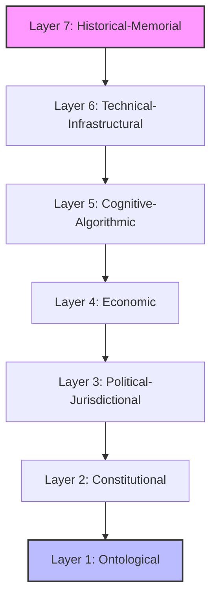
```mermaid
graph TD
    L7[Layer 7: Historical-Memorial] --> L6[Layer 6: Technical-Infrastructural]
    L6 --> L5[Layer 5: Cognitive-Algorithmic]
    L5 --> L4[Layer 4: Economic]
    L4 --> L3[Layer 3: Political-Jurisdictional]
    L3 --> L2[Layer 2: Constitutional]
    L2 --> L1[Layer 1: Ontological]
    
    style L7 fill:#f9f,stroke:#333,stroke-width:2px
    style L1 fill:#bbf,stroke:#333,stroke-width:2px
```
*The hierarchy shows the conceptual stack from fundamental existence (Layer 1) to the final registry of civilization (Layer 7).*

Sources: [TAMV-MASTER-DOCUMENTATION.md:52-70](https://github.com/OsoPanda1/ecosistema-nextgen-tamv/blob/7d85edce66bcb534ae1f4e98356f1cf1487b21cb/TAMV-MASTER-DOCUMENTATION.md#L52-L70)

### Technology Stack
TAMV utilizes a modern, decentralized stack to ensure scalability and security:

| Category | Technologies |
| :--- | :--- |
| **Infrastructure** | Docker, Kubernetes, Terraform, AWS ECS/ECR, Istio |
| **Databases** | PostgreSQL 15+, Redis, IPFS, pgvector |
| **Backend** | Node.js 18+ (TypeScript), Python 3.9+ (FastAPI), Express.js |
| **Blockchain** | Ethereum, Polygon, Solana, Custom MSR Chain |
| **AI Systems** | PyTorch, ONNX Runtime, MinkowskiEngine |
| **Frontend/XR** | React 18, Three.js, WebXR, Unity 3D, Unreal Engine 5 |

Sources: [TAMV-MASTER-DOCUMENTATION.md:73-104](https://github.com/OsoPanda1/ecosistema-nextgen-tamv/blob/7d85edce66bcb534ae1f4e98356f1cf1487b21cb/TAMV-MASTER-DOCUMENTATION.md#L73-L104), [ARCHIVE/tamv-docs-consolidated-2026-02-02/TAMV-OFFICIAL-SYSTEM-DESCRIPTION.md:74-90](https://github.com/OsoPanda1/ecosistema-nextgen-tamv/blob/7d85edce66bcb534ae1f4e98356f1cf1487b21cb/ARCHIVE/tamv-docs-consolidated-2026-02-02/TAMV-OFFICIAL-SYSTEM-DESCRIPTION.md#L74-L90)

## Microservices and API Structure

The system is built on a microservices architecture referred to as **QuantumPods**. These services handle specific domains of the ecosystem.

### Core Service Pods
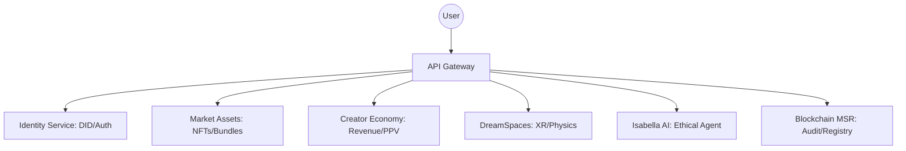
```mermaid
flowchart TD
    User((User)) --> Gateway[API Gateway]
    Gateway --> Identity[Identity Service: DID/Auth]
    Gateway --> Market[Market Assets: NFTs/Bundles]
    Gateway --> Creator[Creator Economy: Revenue/PPV]
    Gateway --> Dream[DreamSpaces: XR/Physics]
    Gateway --> Isabella[Isabella AI: Ethical Agent]
    Gateway --> MSR[Blockchain MSR: Audit/Registry]
```
*The service flow demonstrates how user requests are routed through a gateway to specialized functional pods.*

Sources: [TAMV-MASTER-DOCUMENTATION.md:107-128](https://github.com/OsoPanda1/ecosistema-nextgen-tamv/blob/7d85edce66bcb534ae1f4e98356f1cf1487b21cb/TAMV-MASTER-DOCUMENTATION.md#L107-L128), [ARCHIVE/remaining-docs-consolidated-2026-02-13/TAMV-BACKEND-COMPLETE.md:14-27](https://github.com/OsoPanda1/ecosistema-nextgen-tamv/blob/7d85edce66bcb534ae1f4e98356f1cf1487b21cb/ARCHIVE/remaining-docs-consolidated-2026-02-13/TAMV-BACKEND-COMPLETE.md#L14-L27)

### Backend Endpoint Implementation
The backend is implemented as a production-ready REST API. Key endpoints include:
*   **Auth:** `/api/v1/auth/register`, `/api/v1/auth/login`, `/api/v1/auth/refresh`
*   **Social:** `/api/v1/posts`, `/api/v1/feed`, `/api/v1/posts/:id/comments`
*   **AI/Isabella:** `/v1/chat/completions` (OpenAI compatible), `/v1/kernel/intent` (Ethical auditing)

Sources: [ARCHIVE/remaining-docs-consolidated-2026-02-13/TAMV-BACKEND-COMPLETE.md:65-90](https://github.com/OsoPanda1/ecosistema-nextgen-tamv/blob/7d85edce66bcb534ae1f4e98356f1cf1487b21cb/ARCHIVE/remaining-docs-consolidated-2026-02-13/TAMV-BACKEND-COMPLETE.md#L65-L90), [ARCHIVE/remaining-docs-consolidated-2026-02-13/REPORTE-AVANCE-TECNICO-COMPLETO.md:47-55](https://github.com/OsoPanda1/ecosistema-nextgen-tamv/blob/7d85edce66bcb534ae1f4e98356f1cf1487b21cb/ARCHIVE/remaining-docs-consolidated-2026-02-13/REPORTE-AVANCE-TECNICO-COMPLETO.md#L47-L55)

## AI Applications: The Isabella Framework

The **Isabella AI Framework** is a non-executive AI system, meaning it cannot take final binding actions without human validation. It is aligned with the EU AI Act for high-risk systems.

### Functional AI Modules
1.  **AI Study Helper:** Generates personalized study questions from text.
2.  **Pen2PDF:** Recognizes handwriting with 95%+ accuracy using CNN+RNN.
3.  **Isabella Chat:** Conversational agent with an ethical supervision layer.
4.  **Spatial AI:** Uses MinkowskiEngine for semantic segmentation of 3D spaces.

Sources: [TAMV-MASTER-DOCUMENTATION.md:210-258](https://github.com/OsoPanda1/ecosistema-nextgen-tamv/blob/7d85edce66bcb534ae1f4e98356f1cf1487b21cb/TAMV-MASTER-DOCUMENTATION.md#L210-L258), [ARCHIVE/tamv-docs-consolidated-2026-02-02/TAMV-OFFICIAL-SYSTEM-DESCRIPTION.md:28-46](https://github.com/OsoPanda1/ecosistema-nextgen-tamv/blob/7d85edce66bcb534ae1f4e98356f1cf1487b21cb/ARCHIVE/tamv-docs-consolidated-2026-02-02/TAMV-OFFICIAL-SYSTEM-DESCRIPTION.md#L28-L46)

### Ethical Auditing Logic
Isabella acts as a gatekeeper for user actions to ensure compliance with the DINN (Digital Integrity) rules.

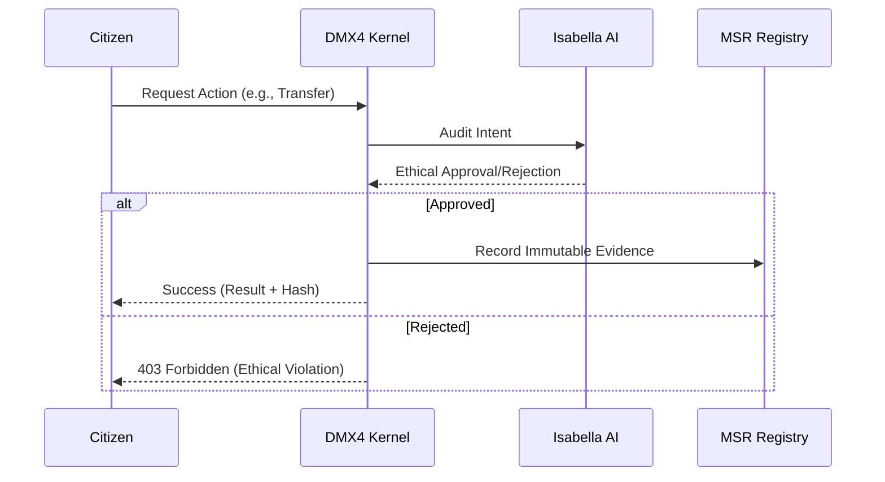
```mermaid
sequenceDiagram
    participant User as Citizen
    participant Kernel as DMX4 Kernel
    participant Isabella as Isabella AI
    participant BookPI as MSR Registry
    
    User->>Kernel: Request Action (e.g., Transfer)
    Kernel->>Isabella: Audit Intent
    Isabella-->>Kernel: Ethical Approval/Rejection
    alt Approved
        Kernel->>BookPI: Record Immutable Evidence
        Kernel-->>User: Success (Result + Hash)
    else Rejected
        Kernel-->>User: 403 Forbidden (Ethical Violation)
    end
```
*This sequence shows the mandatory ethical audit before any system execution.*

Sources: [ARCHIVE/remaining-docs-consolidated-2026-02-13/REPORTE-AVANCE-TECNICO-COMPLETO.md:215-245](https://github.com/OsoPanda1/ecosistema-nextgen-tamv/blob/7d85edce66bcb534ae1f4e98356f1cf1487b21cb/ARCHIVE/remaining-docs-consolidated-2026-02-13/REPORTE-AVANCE-TECNICO-COMPLETO.md#L215-L245)

## Economic and Security Frameworks

### Economic Model (TCEP)
TAMV uses a **Quantum-Split** revenue distribution model to ensure sustainability and community support:
*   **20% Fénix Protocol:** Community repair, scholarships, and social impact.
*   **30% Infrastructure:** Operations, maintenance, and development.
*   **50% Net Profit:** Distributed to creators and stakeholders.

Sources: [TAMV-MASTER-DOCUMENTATION.md:180-185](https://github.com/OsoPanda1/ecosistema-nextgen-tamv/blob/7d85edce66bcb534ae1f4e98356f1cf1487b21cb/TAMV-MASTER-DOCUMENTATION.md#L180-L185), [ARCHIVE/tamv-docs-consolidated-2026-02-02/TAMV-OFFICIAL-SYSTEM-DESCRIPTION.md:57-59](https://github.com/OsoPanda1/ecosistema-nextgen-tamv/blob/7d85edce66bcb534ae1f4e98356f1cf1487b21cb/ARCHIVE/tamv-docs-consolidated-2026-02-02/TAMV-OFFICIAL-SYSTEM-DESCRIPTION.md#L57-L59)

### TENOCHTITLAN Security System
The security framework, codenamed "Tenochtitlan," is designed for **Adaptive Adversarial Containment**. It uses a multi-layered approach:
*   **Anubis Sentinel:** Primary 4-layer encrypted system.
*   **Horus Sentinel:** Evolutionary 10-layer standby system.
*   **Dekateotl:** Supreme orchestration with 11 verification layers.
*   **Post-Quantum Cryptography:** Implementation of ML-KEM and ML-DSA algorithms.

Sources: [TAMV-MASTER-DOCUMENTATION.md:265-285](https://github.com/OsoPanda1/ecosistema-nextgen-tamv/blob/7d85edce66bcb534ae1f4e98356f1cf1487b21cb/TAMV-MASTER-DOCUMENTATION.md#L265-L285), [ARCHIVE/tamv-docs-consolidated-2026-02-02/TAMV-OFFICIAL-SYSTEM-DESCRIPTION.md:48-60](https://github.com/OsoPanda1/ecosistema-nextgen-tamv/blob/7d85edce66bcb534ae1f4e98356f1cf1487b21cb/ARCHIVE/tamv-docs-consolidated-2026-02-02/TAMV-OFFICIAL-SYSTEM-DESCRIPTION.md#L48-L60)

## Implementation and Deployment Status

As of February 2026, the project has achieved significant milestones in its unification and implementation:

| Metric | Status |
| :--- | :--- |
| **Backend Core** | 68% Complete (Production-ready core) |
| **Frontend Demo** | 80% Complete (React-based dashboard) |
| **Tests** | 65+ passing (Unit & Property-based) |
| **Security** | Adaptive Adversarial Containment active |

Sources: [ARCHIVE/remaining-docs-consolidated-2026-02-13/TAMV-UNIFICATION-STATUS.md:132-142](https://github.com/OsoPanda1/ecosistema-nextgen-tamv/blob/7d85edce66bcb534ae1f4e98356f1cf1487b21cb/ARCHIVE/remaining-docs-consolidated-2026-02-13/TAMV-UNIFICATION-STATUS.md#L132-L142), [ARCHIVE/remaining-docs-consolidated-2026-02-13/REPORTE-AVANCE-TECNICO-COMPLETO.md:113-125](https://github.com/OsoPanda1/ecosistema-nextgen-tamv/blob/7d85edce66bcb534ae1f4e98356f1cf1487b21cb/ARCHIVE/remaining-docs-consolidated-2026-02-13/REPORTE-AVANCE-TECNICO-COMPLETO.md#L113-L125)

The project has undergone a massive documentation consolidation, reducing 15+ duplicate files into a single master reference to improve maintainability and technical clarity.

Sources: [ARCHIVE/remaining-docs-consolidated-2026-02-13/TAMV-UNIFICATION-STATUS.md:11-35](https://github.com/OsoPanda1/ecosistema-nextgen-tamv/blob/7d85edce66bcb534ae1f4e98356f1cf1487b21cb/ARCHIVE/remaining-docs-consolidated-2026-02-13/TAMV-UNIFICATION-STATUS.md#L11-L35), [ARCHIVE/remaining-docs-consolidated-2026-02-13/REPORTE-AVANCE-TECNICO-COMPLETO.md:15-30](https://github.com/OsoPanda1/ecosistema-nextgen-tamv/blob/7d85edce66bcb534ae1f4e98356f1cf1487b21cb/ARCHIVE/remaining-docs-consolidated-2026-02-13/REPORTE-AVANCE-TECNICO-COMPLETO.md#L15-L30)

### Conclusion
TAMV represents an evolution in digital environments, shifting from extractive models to a sovereign, ethical infrastructure. By combining XR immersive capabilities with high-performance federated layers and post-quantum security, it provides a functional solution for digital autonomy that is technically auditable and legally compliant with modern AI and data regulations.

### Terminology & Core Concepts

<details>
<summary>Relevant source files</summary>

The following files were used as context for generating this wiki page:

- [TAMV-MASTER-DOCUMENTATION.md](https://github.com/OsoPanda1/ecosistema-nextgen-tamv/blob/7d85edce66bcb534ae1f4e98356f1cf1487b21cb/TAMV-MASTER-DOCUMENTATION.md)
- [ARCHIVE/tamv-docs-consolidated-2026-02-02/TAMV-OFFICIAL-SYSTEM-DESCRIPTION.md](https://github.com/OsoPanda1/ecosistema-nextgen-tamv/blob/7d85edce66bcb534ae1f4e98356f1cf1487b21cb/ARCHIVE/tamv-docs-consolidated-2026-02-02/TAMV-OFFICIAL-SYSTEM-DESCRIPTION.md)
- [ARCHIVE/remaining-docs-consolidated-2026-02-13/REPORTE-AVANCE-TECNICO-COMPLETO.md](https://github.com/OsoPanda1/ecosistema-nextgen-tamv/blob/7d85edce66bcb534ae1f4e98356f1cf1487b21cb/ARCHIVE/remaining-docs-consolidated-2026-02-13/REPORTE-AVANCE-TECNICO-COMPLETO.md)
- [ARCHIVE/remaining-docs-consolidated-2026-02-13/TAMV-COMPLETE-IMPLEMENTATION-PLAN.md](https://github.com/OsoPanda1/ecosistema-nextgen-tamv/blob/7d85edce66bcb534ae1f4e98356f1cf1487b21cb/ARCHIVE/remaining-docs-consolidated-2026-02-13/TAMV-COMPLETE-IMPLEMENTATION-PLAN.md)
- [ARCHIVE/remaining-docs-consolidated-2026-02-13/TAMV-BACKEND-COMPLETE.md](https://github.com/OsoPanda1/ecosistema-nextgen-tamv/blob/7d85edce66bcb534ae1f4e98356f1cf1487b21cb/ARCHIVE/remaining-docs-consolidated-2026-02-13/TAMV-BACKEND-COMPLETE.md)
- [ARCHIVE/readme-files-consolidated-2026-02-02/README-GITHUB.md](https://github.com/OsoPanda1/ecosistema-nextgen-tamv/blob/7d85edce66bcb534ae1f4e98356f1cf1487b21cb/ARCHIVE/readme-files-consolidated-2026-02-02/README-GITHUB.md)
</details>

# Terminology & Core Concepts

## Introduction

The **Territorio Autónomo de Memoria Viva (TAMV)** is a distributed socio-technical infrastructure designed for digital autonomy. It integrates immersive XR/VR experiences, ethical AI frameworks, and federated blockchain systems to create a multisided marketplace. The project's core mission is the immutable preservation of knowledge and the redistribution of value to creators through transparent algorithms and cryptographic guarantees.

This document outlines the foundational terminology, architectural layers, and core technological concepts that define the TAMV ecosystem. It covers the system's seven-layered federated structure, the Isabella AI framework, and the economic models that govern value circulation within the platform.
Sources: [TAMV-MASTER-DOCUMENTATION.md:14-25](https://github.com/OsoPanda1/ecosistema-nextgen-tamv/blob/7d85edce66bcb534ae1f4e98356f1cf1487b21cb/TAMV-MASTER-DOCUMENTATION.md#L14-L25), [TAMV-OFFICIAL-SYSTEM-DESCRIPTION.md:6-14](https://github.com/OsoPanda1/ecosistema-nextgen-tamv/blob/7d85edce66bcb534ae1f4e98356f1cf1487b21cb/TAMV-OFFICIAL-SYSTEM-DESCRIPTION.md#L6-L14)

---

## 1. System Identity and Governance

### 1.1 Fundamental Principles
TAMV operates under three primary pillars: **Memory Defense**, **Digital Sovereignty**, and **Ethical Responsibility**. Unlike traditional platforms, it provides functional user sovereignty where individuals maintain absolute control over their data and economic decisions within a federated architecture.

| Concept | Definition |
| :--- | :--- |
| **Memory Defense** | Immutable preservation of cultural, technical, and social knowledge via MSR blockchain. |
| **Digital Sovereignty** | Absolute control for users over data, creations, and economic decisions. |
| **Ethical Responsibility** | Transparent, equitable, and sustainable operations under the Isabella AI framework. |
Sources: [TAMV-MASTER-DOCUMENTATION.md:43-55](https://github.com/OsoPanda1/ecosistema-nextgen-tamv/blob/7d85edce66bcb534ae1f4e98356f1cf1487b21cb/TAMV-MASTER-DOCUMENTATION.md#L43-L55)

### 1.2 The Seven Federated Layers
The TAMV architecture is organized into seven distinct layers, ranging from ontological foundations to civilizational registries.

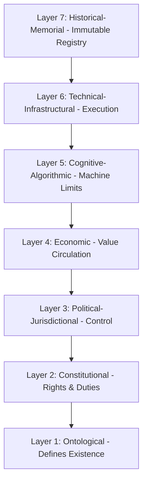
```mermaid
flowchart TD
    L7[Layer 7: Historical-Memorial - Immutable Registry]
    L6[Layer 6: Technical-Infrastructural - Execution]
    L5[Layer 5: Cognitive-Algorithmic - Machine Limits]
    L4[Layer 4: Economic - Value Circulation]
    L3[Layer 3: Political-Jurisdictional - Control]
    L2[Layer 2: Constitutional - Rights & Duties]
    L1[Layer 1: Ontological - Defines Existence]

    L7 --> L6 --> L5 --> L4 --> L3 --> L2 --> L1
```
Sources: [TAMV-MASTER-DOCUMENTATION.md:68-85](https://github.com/OsoPanda1/ecosistema-nextgen-tamv/blob/7d85edce66bcb534ae1f4e98356f1cf1487b21cb/TAMV-MASTER-DOCUMENTATION.md#L68-L85)

---

## 2. Isabella AI Framework

### 2.1 Core AI Philosophy
The **Isabella AI Framework** is defined as a non-executive AI system. This means no AI within the ecosystem has the authority to execute final or irreversible actions regarding assets, rights, or critical decisions without explicit human validation. It is designed to be high-risk compliant with the EU AI Act.
Sources: [TAMV-OFFICIAL-SYSTEM-DESCRIPTION.md:21-26](https://github.com/OsoPanda1/ecosistema-nextgen-tamv/blob/7d85edce66bcb534ae1f4e98356f1cf1487b21cb/TAMV-OFFICIAL-SYSTEM-DESCRIPTION.md#L21-L26), [TAMV-MASTER-DOCUMENTATION.md:209-212](https://github.com/OsoPanda1/ecosistema-nextgen-tamv/blob/7d85edce66bcb534ae1f4e98356f1cf1487b21cb/TAMV-MASTER-DOCUMENTATION.md#L209-L212)

### 2.2 Functional Applications
The Isabella framework powers four primary technological modules:

1.  **AI Study Helper**: Uses NLP and transformer models to convert text into personalized study questions.
2.  **Pen2PDF**: Utilizes CNN+RNN architecture for handwriting recognition with a verified accuracy of 95%+.
3.  **Isabella Chat**: An ethical conversational agent with explainability layers.
4.  **Spatial AI**: Processes 3D spaces using MinkowskiEngine and ResUNet14 for semantic segmentation and navigation.
Sources: [TAMV-MASTER-DOCUMENTATION.md:214-256](https://github.com/OsoPanda1/ecosistema-nextgen-tamv/blob/7d85edce66bcb534ae1f4e98356f1cf1487b21cb/TAMV-MASTER-DOCUMENTATION.md#L214-L256), [TAMV-OFFICIAL-SYSTEM-DESCRIPTION.md:28-44](https://github.com/OsoPanda1/ecosistema-nextgen-tamv/blob/7d85edce66bcb534ae1f4e98356f1cf1487b21cb/TAMV-OFFICIAL-SYSTEM-DESCRIPTION.md#L28-L44)

### 2.3 Ethics and Compliance Workflow
Isabella acts as a security runtime, interpreting intents and auditing ethical compliance before any system dispatch.

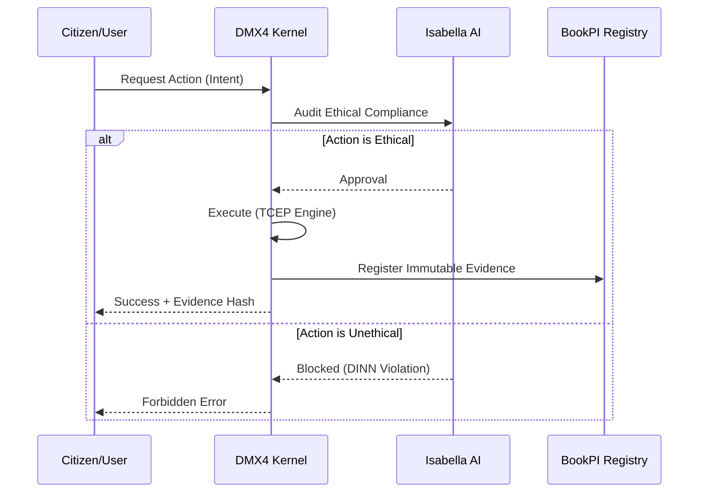
```mermaid
sequenceDiagram
    participant User as Citizen/User
    participant Kernel as DMX4 Kernel
    participant AI as Isabella AI
    participant Ledger as BookPI Registry

    User->>Kernel: Request Action (Intent)
    Kernel->>AI: Audit Ethical Compliance
    alt Action is Ethical
        AI-->>Kernel: Approval
        Kernel->>Kernel: Execute (TCEP Engine)
        Kernel->>Ledger: Register Immutable Evidence
        Kernel-->>User: Success + Evidence Hash
    else Action is Unethical
        AI-->>Kernel: Blocked (DINN Violation)
        Kernel-->>User: Forbidden Error
    end
```
Sources: [REPORTE-AVANCE-TECNICO-COMPLETO.md:175-200](https://github.com/OsoPanda1/ecosistema-nextgen-tamv/blob/7d85edce66bcb534ae1f4e98356f1cf1487b21cb/REPORTE-AVANCE-TECNICO-COMPLETO.md#L175-L200), [TAMV-OFFICIAL-SYSTEM-DESCRIPTION.md:73-77](https://github.com/OsoPanda1/ecosistema-nextgen-tamv/blob/7d85edce66bcb534ae1f4e98356f1cf1487b21cb/TAMV-OFFICIAL-SYSTEM-DESCRIPTION.md#L73-L77)

---

## 3. Economic and Blockchain Models

### 3.1 MSR (Memory, Sovereignty, Responsibility) Blockchain
TAMV utilizes a custom federated chain known as the **MSR Chain**. It incorporates **Merkle State Root** technology to provide anti-fraud guarantees and an immutable registry for civilizational evidence.
Sources: [TAMV-MASTER-DOCUMENTATION.md:315-320](https://github.com/OsoPanda1/ecosistema-nextgen-tamv/blob/7d85edce66bcb534ae1f4e98356f1cf1487b21cb/TAMV-MASTER-DOCUMENTATION.md#L315-L320), [README-GITHUB.md:120-125](https://github.com/OsoPanda1/ecosistema-nextgen-tamv/blob/7d85edce66bcb534ae1f4e98356f1cf1487b21cb/README-GITHUB.md#L120-L125)

### 3.2 The TCEP Engine and Value Distribution
The **TAMV Cashless Economy Protocol (TCEP)** manages transactions using a specific distribution model known as the "Quantum-Split."

*   **20% - Fénix Protocol**: Community repair, scholarships, and social impact.
*   **30% - Infrastructure**: Operations, maintenance, and development.
*   **50% - Net Profit**: Distributed to stakeholders and creators.
Sources: [TAMV-MASTER-DOCUMENTATION.md:170-174](https://github.com/OsoPanda1/ecosistema-nextgen-tamv/blob/7d85edce66bcb534ae1f4e98356f1cf1487b21cb/TAMV-MASTER-DOCUMENTATION.md#L170-L174), [REPORTE-AVANCE-TECNICO-COMPLETO.md:215-225](https://github.com/OsoPanda1/ecosistema-nextgen-tamv/blob/7d85edce66bcb534ae1f4e98356f1cf1487b21cb/REPORTE-AVANCE-TECNICO-COMPLETO.md#L215-L225)

### 3.3 Anti-Fraud Protocols
*   **Black Hole Protocol**: Manages system collapse or fraud by freezing funds and reassigning value based on MSR evidence.
*   **Initiation Protocols**: Mandatory KYC/KYB (Know Your Customer/Business) verification before any user can monetize content.
Sources: [TAMV-MASTER-DOCUMENTATION.md:200-207](https://github.com/OsoPanda1/ecosistema-nextgen-tamv/blob/7d85edce66bcb534ae1f4e98356f1cf1487b21cb/TAMV-MASTER-DOCUMENTATION.md#L200-L207)

---

## 4. Security Framework: TENOCHTITLAN

### 4.1 System Guardians
The security philosophy of TAMV is "defense by being impossible to capture" rather than offensive measures. This is managed by the **TENOCHTITLAN System**.

| Component | Layer/Function |
| :--- | :--- |
| **ANUBIS CENTINEL** | Primary defense with 4 encrypted layers. |
| **HORUS CENTINEL** | Evolutionary standby with 10 layers. |
| **DEKATEOTL** | Supreme orchestration with 11 verification layers. |
| **AZTEK GODS** | Absolute standby for continuity with 22 layers. |
Sources: [TAMV-MASTER-DOCUMENTATION.md:264-275](https://github.com/OsoPanda1/ecosistema-nextgen-tamv/blob/7d85edce66bcb534ae1f4e98356f1cf1487b21cb/TAMV-MASTER-DOCUMENTATION.md#L264-L275), [README-GITHUB.md:100-105](https://github.com/OsoPanda1/ecosistema-nextgen-tamv/blob/7d85edce66bcb534ae1f4e98356f1cf1487b21cb/README-GITHUB.md#L100-L105)

### 4.2 Specialized Radars
The ecosystem employs specialized monitoring systems for specific threat types:
*   **QUETZALCOATL**: Detects and prevents economic fraud.
*   **EYE OF RA**: Monitors for illegal content without censoring ideas.
*   **TWIN MOS**: Uses cross-validation where one agent validates and a second agent questions the result.
Sources: [TAMV-MASTER-DOCUMENTATION.md:277-281](https://github.com/OsoPanda1/ecosistema-nextgen-tamv/blob/7d85edce66bcb534ae1f4e98356f1cf1487b21cb/TAMV-MASTER-DOCUMENTATION.md#L277-L281), [README-GITHUB.md:113-116](https://github.com/OsoPanda1/ecosistema-nextgen-tamv/blob/7d85edce66bcb534ae1f4e98356f1cf1487b21cb/README-GITHUB.md#L113-L116)

---

## 5. Technical Stack Terminology

### 5.1 Backend and Cloud Infrastructure
The system uses a **QuantumPod** architecture—microservices designed for high-velocity state management and low-latency validation.

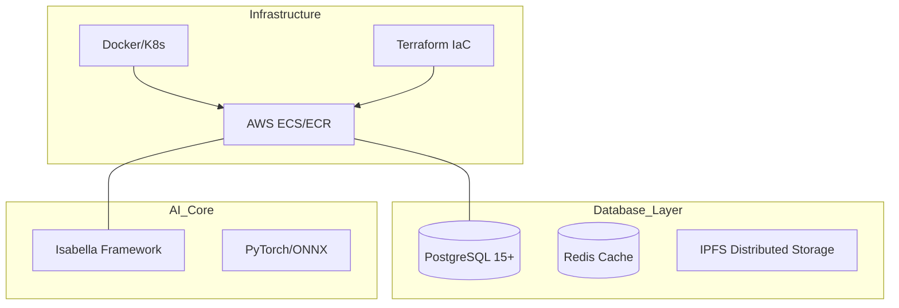
```mermaid
graph TD
    subgraph Infrastructure
        A[Docker/K8s] --> B[AWS ECS/ECR]
        C[Terraform IaC] --> B
    end
    subgraph Database_Layer
        D[(PostgreSQL 15+)]
        E[(Redis Cache)]
        F[IPFS Distributed Storage]
    end
    subgraph AI_Core
        G[Isabella Framework]
        H[PyTorch/ONNX]
    end
    B --- D
    B --- G
```
Sources: [TAMV-MASTER-DOCUMENTATION.md:88-115](https://github.com/OsoPanda1/ecosistema-nextgen-tamv/blob/7d85edce66bcb534ae1f4e98356f1cf1487b21cb/TAMV-MASTER-DOCUMENTATION.md#L88-L115), [REPORTE-AVANCE-TECNICO-COMPLETO.md:158-164](https://github.com/OsoPanda1/ecosistema-nextgen-tamv/blob/7d85edce66bcb534ae1f4e98356f1cf1487b21cb/REPORTE-AVANCE-TECNICO-COMPLETO.md#L158-L164)

### 5.2 Core API Pods
| Service Pod | Function |
| :--- | :--- |
| **Identity-service** | Manages User auth and DID (Decentralized ID). |
| **Dreamspaces-engine** | Handles virtual worlds, quantum physics, and multiplayer events. |
| **Market-assets** | Manages catalogs, NFTs, and auctions. |
| **Blockchain-msr** | Registry, smart contracts, and evidence audit. |
Sources: [TAMV-MASTER-DOCUMENTATION.md:120-135](https://github.com/OsoPanda1/ecosistema-nextgen-tamv/blob/7d85edce66bcb534ae1f4e98356f1cf1487b21cb/TAMV-MASTER-DOCUMENTATION.md#L120-L135)

## Conclusion

TAMV is defined not as a territory, but as a technical infrastructure providing functional sovereignty. Through its seven-layered architecture and the non-executive Isabella AI framework, it ensures that digital memory is preserved and creator value is protected. The integration of the TENOCHTITLAN security system and MSR blockchain creates an "antifragile" environment where every attack strengthens the system's defensive capabilities.
Sources: [TAMV-OFFICIAL-SYSTEM-DESCRIPTION.md:13-16](https://github.com/OsoPanda1/ecosistema-nextgen-tamv/blob/7d85edce66bcb534ae1f4e98356f1cf1487b21cb/TAMV-OFFICIAL-SYSTEM-DESCRIPTION.md#L13-L16), [README-GITHUB.md:155-160](https://github.com/OsoPanda1/ecosistema-nextgen-tamv/blob/7d85edce66bcb534ae1f4e98356f1cf1487b21cb/README-GITHUB.md#L155-L160)


## System Architecture

### Federated 7-Layer Architecture

<details>
<summary>Relevant source files</summary>

The following files were used as context for generating this wiki page:

- [TAMV-MASTER-DOCUMENTATION.md](https://github.com/OsoPanda1/ecosistema-nextgen-tamv/blob/7d85edce66bcb534ae1f4e98356f1cf1487b21cb/TAMV-MASTER-DOCUMENTATION.md)
- [ARCHIVE/tamv-docs-consolidated-2026-02-02/TAMV-OFFICIAL-SYSTEM-DESCRIPTION.md](https://github.com/OsoPanda1/ecosistema-nextgen-tamv/blob/7d85edce66bcb534ae1f4e98356f1cf1487b21cb/ARCHIVE/tamv-docs-consolidated-2026-02-02/TAMV-OFFICIAL-SYSTEM-DESCRIPTION.md)
- [ARCHIVE/readme-files-consolidated-2026-02-02/TAMV-FINAL-PRODUCTION-READY-README.md](https://github.com/OsoPanda1/ecosistema-nextgen-tamv/blob/7d85edce66bcb534ae1f4e98356f1cf1487b21cb/ARCHIVE/readme-files-consolidated-2026-02-02/TAMV-FINAL-PRODUCTION-READY-README.md)
- [ARCHIVE/remaining-docs-consolidated-2026-02-13/REPORTE-AVANCE-TECNICO-COMPLETO.md](https://github.com/OsoPanda1/ecosistema-nextgen-tamv/blob/7d85edce66bcb534ae1f4e98356f1cf1487b21cb/ARCHIVE/remaining-docs-consolidated-2026-02-13/REPORTE-AVANCE-TECNICO-COMPLETO.md)
- [ARCHIVE/remaining-docs-consolidated-2026-02-13/IMPLEMENTATION-PROGRESS-REPORT.md](https://github.com/OsoPanda1/ecosistema-nextgen-tamv/blob/7d85edce66bcb534ae1f4e98356f1cf1487b21cb/ARCHIVE/remaining-docs-consolidated-2026-02-13/IMPLEMENTATION-PROGRESS-REPORT.md)
</details>

# Federated 7-Layer Architecture

The **Federated 7-Layer Architecture** is the structural foundation of the TAMV (Territorio Autónomo de Memoria Viva) ecosystem. It defines a multi-dimensional infrastructure designed to support digital autonomy, memory preservation, and sovereign governance. This architecture organizes the system into hierarchical layers ranging from foundational ontological definitions to high-level historical registries, ensuring that technical execution is always governed by ethical and constitutional constraints.

The architecture is categorized as a "distributed socio-technical infrastructure" that enables functional sovereignty. It operates by inverting traditional platform models, redistributing value to creators and users through transparent algorithms and cryptographic guarantees.

Sources: [TAMV-MASTER-DOCUMENTATION.md:92-111](https://github.com/OsoPanda1/ecosistema-nextgen-tamv/blob/7d85edce66bcb534ae1f4e98356f1cf1487b21cb/TAMV-MASTER-DOCUMENTATION.md#L92-L111), [ARCHIVE/tamv-docs-consolidated-2026-02-02/TAMV-OFFICIAL-SYSTEM-DESCRIPTION.md:9-15](https://github.com/OsoPanda1/ecosistema-nextgen-tamv/blob/7d85edce66bcb534ae1f4e98356f1cf1487b21cb/ARCHIVE/tamv-docs-consolidated-2026-02-02/TAMV-OFFICIAL-SYSTEM-DESCRIPTION.md#L9-L15)

## 1. Architectural Layers Overview

The system is structured into seven distinct layers, each responsible for a specific domain of the ecosystem's operation. These layers ensure that every action within the TAMV environment is validated against the layers below it, particularly the ethical and ontological foundations.

| Layer | Name | Description |
| :--- | :--- | :--- |
| **Layer 7** | Historical-Memorial | Immutable Civilizational Registry for knowledge preservation. |
| **Layer 6** | Technical-Infrastructural | Material execution, hardware, and core software services. |
| **Layer 5** | Cognitive-Algorithmic | AI boundaries, machine limits, and automated ethical duties. |
| **Layer 4** | Economic | Circulation of value without extraction; creator-centric economy. |
| **Layer 3** | Political-Jurisdictional | Exercise of power, control mechanisms, and dispute resolution. |
| **Layer 2** | Constitutional | Definition of rights, duties, and functional sovereignty. |
| **Layer 1** | Ontological | Fundamental definitions of what exists and what cannot exist in the system. |

Sources: [TAMV-MASTER-DOCUMENTATION.md:113-132](https://github.com/OsoPanda1/ecosistema-nextgen-tamv/blob/7d85edce66bcb534ae1f4e98356f1cf1487b21cb/TAMV-MASTER-DOCUMENTATION.md#L113-L132), [ARCHIVE/readme-files-consolidated-2026-02-02/TAMV-FINAL-PRODUCTION-READY-README.md:33-40](https://github.com/OsoPanda1/ecosistema-nextgen-tamv/blob/7d85edce66bcb534ae1f4e98356f1cf1487b21cb/ARCHIVE/readme-files-consolidated-2026-02-02/TAMV-FINAL-PRODUCTION-READY-README.md#L33-L40)

### Structural Hierarchy Diagram
The following diagram illustrates the vertical hierarchy of the federated layers, showing the progression from foundational existence to historical record.

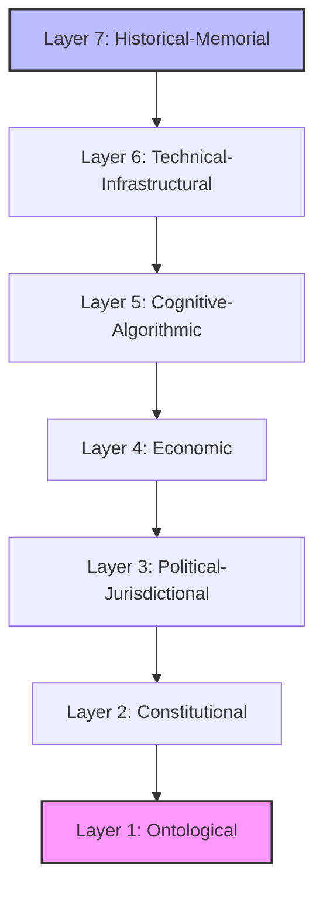
```mermaid
graph TD
    L7[Layer 7: Historical-Memorial] --> L6[Layer 6: Technical-Infrastructural]
    L6 --> L5[Layer 5: Cognitive-Algorithmic]
    L5 --> L4[Layer 4: Economic]
    L4 --> L3[Layer 3: Political-Jurisdictional]
    L3 --> L2[Layer 2: Constitutional]
    L2 --> L1[Layer 1: Ontological]
    
    style L1 fill:#f9f,stroke:#333,stroke-width:2px
    style L7 fill:#bbf,stroke:#333,stroke-width:2px
```
Sources: [TAMV-MASTER-DOCUMENTATION.md:115-131](https://github.com/OsoPanda1/ecosistema-nextgen-tamv/blob/7d85edce66bcb534ae1f4e98356f1cf1487b21cb/TAMV-MASTER-DOCUMENTATION.md#L115-L131)

## 2. Layer 5: Cognitive-Algorithmic (Isabella AI)

The Cognitive-Algorithmic layer defines the machine limits and duties within the system. It is primarily managed by the **Isabella AI Framework**, which operates under a "non-executive" principle, meaning no AI can execute binding actions on rights or assets without human validation.

### Core AI Principles
- **Mandatory Human Oversight**: Humans must validate critical AI decisions.
- **Explainability**: Algorithmic decisions must be auditable and explainable.
- **Compliance**: Aligned with EU AI Act requirements for high-risk systems.

### Functional AI Applications
Isabella AI provides four primary services within this layer:
1. **AI Study Helper**: Generates questions from text via NLP.
2. **Pen2PDF**: Handwriting recognition using CNN+RNN architecture.
3. **Isabella Chat**: Ethical conversational AI with context understanding.
4. **Spatial AI**: 3D semantic segmentation using MinkowskiEngine.

Sources: [TAMV-MASTER-DOCUMENTATION.md:316-368](https://github.com/OsoPanda1/ecosistema-nextgen-tamv/blob/7d85edce66bcb534ae1f4e98356f1cf1487b21cb/TAMV-MASTER-DOCUMENTATION.md#L316-L368), [ARCHIVE/tamv-docs-consolidated-2026-02-02/TAMV-OFFICIAL-SYSTEM-DESCRIPTION.md:21-41](https://github.com/OsoPanda1/ecosistema-nextgen-tamv/blob/7d85edce66bcb534ae1f4e98356f1cf1487b21cb/ARCHIVE/tamv-docs-consolidated-2026-02-02/TAMV-OFFICIAL-SYSTEM-DESCRIPTION.md#L21-L41)

## 3. Layer 6: Technical-Infrastructural

This layer represents the material execution of the system. It is implemented using a modern, multi-cloud, and containerized stack designed for "Antifragile Architecture"—systems that strengthen under attack.

### Technology Stack
- **Infrastructure**: Kubernetes, Docker, Terraform, AWS ECS/ECR.
- **Databases**: PostgreSQL 15+ (Primary), Redis (Cache), IPFS (Distributed), pgvector (Embeddings).
- **Backend**: Node.js 18+ (TypeScript), Python 3.9+ (FastAPI).
- **Security**: Tenochtitlan system, ANUBIS CENTINEL, and DEKATEOTL orchestration.

Sources: [TAMV-MASTER-DOCUMENTATION.md:135-165](https://github.com/OsoPanda1/ecosistema-nextgen-tamv/blob/7d85edce66bcb534ae1f4e98356f1cf1487b21cb/TAMV-MASTER-DOCUMENTATION.md#L135-L165), [ARCHIVE/readme-files-consolidated-2026-02-02/TAMV-FINAL-PRODUCTION-READY-README.md:42-65](https://github.com/OsoPanda1/ecosistema-nextgen-tamv/blob/7d85edce66bcb534ae1f4e98356f1cf1487b21cb/ARCHIVE/readme-files-consolidated-2026-02-02/TAMV-FINAL-PRODUCTION-READY-README.md#L42-L65)

### Component Interaction Flow
This sequence diagram shows how a user action propagates through the technical and cognitive layers.

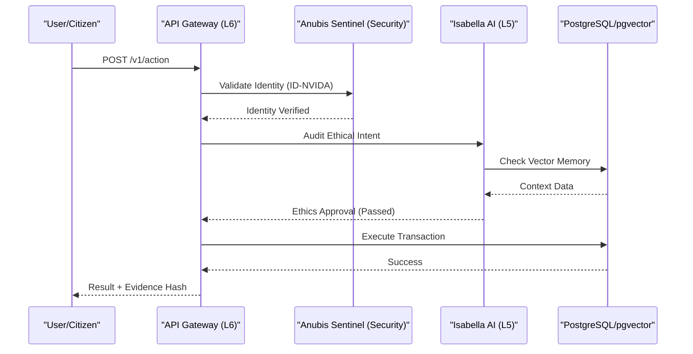
```mermaid
sequenceDiagram
    participant User as "User/Citizen"
    participant API as "API Gateway (L6)"
    participant Sentinel as "Anubis Sentinel (Security)"
    participant Isabella as "Isabella AI (L5)"
    participant DB as "PostgreSQL/pgvector"

    User->>API: POST /v1/action
    API->>Sentinel: Validate Identity (ID-NVIDA)
    Sentinel-->>API: Identity Verified
    API->>Isabella: Audit Ethical Intent
    Isabella->>DB: Check Vector Memory
    DB-->>Isabella: Context Data
    Isabella-->>API: Ethics Approval (Passed)
    API->>DB: Execute Transaction
    DB-->>API: Success
    API-->>User: Result + Evidence Hash
```
Sources: [ARCHIVE/remaining-docs-consolidated-2026-02-13/REPORTE-AVANCE-TECNICO-COMPLETO.md:162-180](https://github.com/OsoPanda1/ecosistema-nextgen-tamv/blob/7d85edce66bcb534ae1f4e98356f1cf1487b21cb/ARCHIVE/remaining-docs-consolidated-2026-02-13/REPORTE-AVANCE-TECNICO-COMPLETO.md#L162-L180), [ARCHIVE/tamv-docs-consolidated-2026-02-02/TAMV-OFFICIAL-SYSTEM-DESCRIPTION.md:76-85](https://github.com/OsoPanda1/ecosistema-nextgen-tamv/blob/7d85edce66bcb534ae1f4e98356f1cf1487b21cb/ARCHIVE/tamv-docs-consolidated-2026-02-02/TAMV-OFFICIAL-SYSTEM-DESCRIPTION.md#L76-L85)

## 4. Layer 4: Economic (TCEP & Quantum-Split)

The economic layer governs value circulation without extraction. It utilizes the **Quantum-Split** distribution model to ensure fair revenue sharing among all stakeholders.

### Revenue Distribution Model
The "Regla 75/25" or Quantum-Split ensures that value is distributed according to fixed percentages:
- **50% Net Profit**: Distributed to stakeholders.
- **30% Infrastructure**: Operations, development, and maintenance.
- **20% Fénix Protocol**: Community repair, scholarships, and social impact.

### Monetization Channels
The architecture supports over 30 forms of ethical monetization, including P2P marketplaces, UTAMV course certifications, and XR rendering credits.

Sources: [TAMV-MASTER-DOCUMENTATION.md:255-296](https://github.com/OsoPanda1/ecosistema-nextgen-tamv/blob/7d85edce66bcb534ae1f4e98356f1cf1487b21cb/TAMV-MASTER-DOCUMENTATION.md#L255-L296), [ARCHIVE/remaining-docs-consolidated-2026-02-13/REPORTE-AVANCE-TECNICO-COMPLETO.md:175-185](https://github.com/OsoPanda1/ecosistema-nextgen-tamv/blob/7d85edce66bcb534ae1f4e98356f1cf1487b21cb/ARCHIVE/remaining-docs-consolidated-2026-02-13/REPORTE-AVANCE-TECNICO-COMPLETO.md#L175-L185)

## 5. Security and Governance (Layers 2 & 3)

The Constitutional (L2) and Political-Jurisdictional (L3) layers define the rights of users and the control mechanisms of the system. Security is integrated as "Adaptive Adversarial Containment."

### TENOCHTITLAN Security System
Security is not an add-on but a core layer of the architecture, designed to be "impossible to capture."
- **ANUBIS CENTINEL**: Primary 4-layer encrypted system.
- **DEKATEOTL**: Supreme orchestration with 11 verification layers.
- **AZTEK GODS**: 22 layers of encryption for system continuity.

Sources: [TAMV-MASTER-DOCUMENTATION.md:372-395](https://github.com/OsoPanda1/ecosistema-nextgen-tamv/blob/7d85edce66bcb534ae1f4e98356f1cf1487b21cb/TAMV-MASTER-DOCUMENTATION.md#L372-L395), [ARCHIVE/tamv-docs-consolidated-2026-02-02/TAMV-OFFICIAL-SYSTEM-DESCRIPTION.md:46-55](https://github.com/OsoPanda1/ecosistema-nextgen-tamv/blob/7d85edce66bcb534ae1f4e98356f1cf1487b21cb/ARCHIVE/tamv-docs-consolidated-2026-02-02/TAMV-OFFICIAL-SYSTEM-DESCRIPTION.md#L46-L55)

### Data Sovereignty Schema
The relationship between users and their sovereign data is managed through decentralized identifiers (DID) and smart contracts.

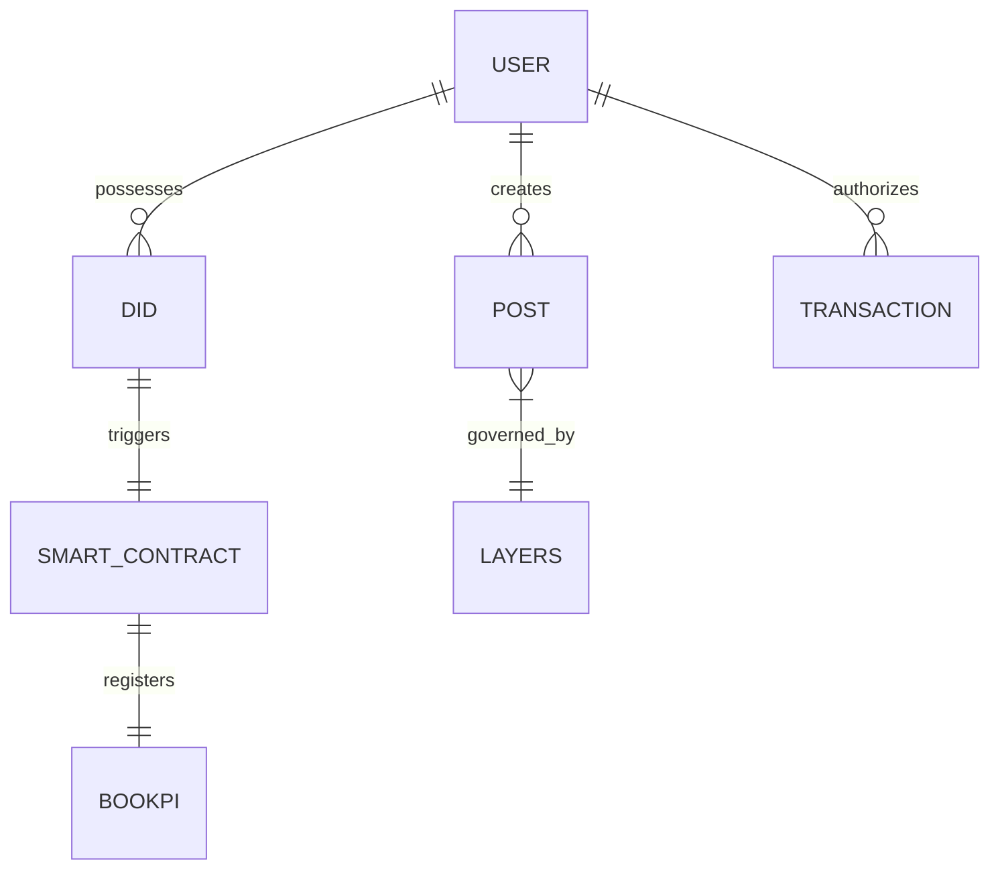
```mermaid
erDiagram
    USER ||--o{ DID : possesses
    USER ||--o{ POST : creates
    USER ||--o{ TRANSACTION : authorizes
    DID ||--|| SMART_CONTRACT : triggers
    SMART_CONTRACT ||--|| BOOKPI : registers
    POST }|--|| LAYERS : governed_by
```
Sources: [ARCHIVE/remaining-docs-consolidated-2026-02-13/IMPLEMENTATION-PROGRESS-REPORT.md:230-265](https://github.com/OsoPanda1/ecosistema-nextgen-tamv/blob/7d85edce66bcb534ae1f4e98356f1cf1487b21cb/ARCHIVE/remaining-docs-consolidated-2026-02-13/IMPLEMENTATION-PROGRESS-REPORT.md#L230-L265), [TAMV-MASTER-DOCUMENTATION.md:143-155](https://github.com/OsoPanda1/ecosistema-nextgen-tamv/blob/7d85edce66bcb534ae1f4e98356f1cf1487b21cb/TAMV-MASTER-DOCUMENTATION.md#L143-L155)

## Conclusion

The Federated 7-Layer Architecture provides a robust framework for TAMV to operate as an autonomous digital ecosystem. By separating concerns into distinct layers—from the fundamental Ontological layer to the high-level Historical-Memorial registry—the system ensures that technical execution (Layer 6) is always subservient to ethical (Layer 5) and constitutional (Layer 2) mandates. This structure facilitates "functional sovereignty," enabling users to maintain absolute control over their data and economic contributions while benefiting from a secure, antifragile technical infrastructure.

Sources: [TAMV-MASTER-DOCUMENTATION.md:10-30](https://github.com/OsoPanda1/ecosistema-nextgen-tamv/blob/7d85edce66bcb534ae1f4e98356f1cf1487b21cb/TAMV-MASTER-DOCUMENTATION.md#L10-L30), [ARCHIVE/tamv-docs-consolidated-2026-02-02/TAMV-OFFICIAL-SYSTEM-DESCRIPTION.md:145-155](https://github.com/OsoPanda1/ecosistema-nextgen-tamv/blob/7d85edce66bcb534ae1f4e98356f1cf1487b21cb/ARCHIVE/tamv-docs-consolidated-2026-02-02/TAMV-OFFICIAL-SYSTEM-DESCRIPTION.md#L145-L155)

### Database & Storage Strategy

<details>
<summary>Relevant source files</summary>

The following files were used as context for generating this wiki page:

- [TAMV-MASTER-DOCUMENTATION.md](https://github.com/OsoPanda1/ecosistema-nextgen-tamv/blob/7d85edce66bcb534ae1f4e98356f1cf1487b21cb/TAMV-MASTER-DOCUMENTATION.md)
- [ARCHIVE/remaining-docs-consolidated-2026-02-13/TAMV-BACKEND-COMPLETE.md](https://github.com/OsoPanda1/ecosistema-nextgen-tamv/blob/7d85edce66bcb534ae1f4e98356f1cf1487b21cb/ARCHIVE/remaining-docs-consolidated-2026-02-13/TAMV-BACKEND-COMPLETE.md)
- [ARCHIVE/remaining-docs-consolidated-2026-02-13/IMPLEMENTATION-PROGRESS-REPORT.md](https://github.com/OsoPanda1/ecosistema-nextgen-tamv/blob/7d85edce66bcb534ae1f4e98356f1cf1487b21cb/ARCHIVE/remaining-docs-consolidated-2026-02-13/IMPLEMENTATION-PROGRESS-REPORT.md)
- [ARCHIVE/remaining-docs-consolidated-2026-02-13/TAMV-COMPLETE-IMPLEMENTATION-PLAN.md](https://github.com/OsoPanda1/ecosistema-nextgen-tamv/blob/7d85edce66bcb534ae1f4e98356f1cf1487b21cb/ARCHIVE/remaining-docs-consolidated-2026-02-13/TAMV-COMPLETE-IMPLEMENTATION-PLAN.md)
- [ARCHIVE/tamv-docs-consolidated-2026-02-02/TAMV-OFFICIAL-SYSTEM-DESCRIPTION.md](https://github.com/OsoPanda1/ecosistema-nextgen-tamv/blob/7d85edce66bcb534ae1f4e98356f1cf1487b21cb/ARCHIVE/tamv-docs-consolidated-2026-02-02/TAMV-OFFICIAL-SYSTEM-DESCRIPTION.md)
- [ARCHIVE/remaining-docs-consolidated-2026-02-13/REPORTE-AVANCE-TECNICO-COMPLETO.md](https://github.com/OsoPanda1/ecosistema-nextgen-tamv/blob/7d85edce66bcb534ae1f4e98356f1cf1487b21cb/ARCHIVE/remaining-docs-consolidated-2026-02-13/REPORTE-AVANCE-TECNICO-COMPLETO.md)

</details>

# Database & Storage Strategy

The Database & Storage Strategy of the TAMV ecosystem is designed to support a distributed socio-technical infrastructure focused on digital autonomy and data sovereignty. It utilizes a multi-layered storage architecture to handle diverse data types, ranging from relational user data to immersive 3D/4D assets and immutable blockchain records. The strategy ensures that users maintain absolute control over their data while providing the high-performance throughput required for real-time XR experiences and AI applications.

Sources: [TAMV-MASTER-DOCUMENTATION.md:78-83](https://github.com/OsoPanda1/ecosistema-nextgen-tamv/blob/7d85edce66bcb534ae1f4e98356f1cf1487b21cb/TAMV-MASTER-DOCUMENTATION.md#L78-L83), [ARCHIVE/tamv-docs-consolidated-2026-02-02/TAMV-OFFICIAL-SYSTEM-DESCRIPTION.md:14-18](https://github.com/OsoPanda1/ecosistema-nextgen-tamv/blob/7d85edce66bcb534ae1f4e98356f1cf1487b21cb/ARCHIVE/tamv-docs-consolidated-2026-02-02/TAMV-OFFICIAL-SYSTEM-DESCRIPTION.md#L14-L18)

## Multi-Layer Storage Architecture

TAMV employs a federated technology stack to manage data across various persistence layers. This approach separates structured relational data, high-speed caching, distributed assets, and AI-specific vector memory.

### Core Storage Components

| Component | Technology | Purpose |
| :--- | :--- | :--- |
| Primary Database | PostgreSQL 15+ | Relational data, user profiles, and social interactions. |
| Cache & Sessions | Redis | Real-time state management and session persistence. |
| Distributed Storage | IPFS | Immutable storage for decentralized assets and media. |
| Vector Database | pgvector | Storage for AI embeddings used by Isabella AI. |
| Blockchain Registry | Custom MSR Chain | Immutable civilizational and historical records. |

Sources: [TAMV-MASTER-DOCUMENTATION.md:86-91](https://github.com/OsoPanda1/ecosistema-nextgen-tamv/blob/7d85edce66bcb534ae1f4e98356f1cf1487b21cb/TAMV-MASTER-DOCUMENTATION.md#L86-L91), [ARCHIVE/remaining-docs-consolidated-2026-02-13/TAMV-BACKEND-COMPLETE.md:161-164](https://github.com/OsoPanda1/ecosistema-nextgen-tamv/blob/7d85edce66bcb534ae1f4e98356f1cf1487b21cb/ARCHIVE/remaining-docs-consolidated-2026-02-13/TAMV-BACKEND-COMPLETE.md#L161-L164)

### Data Flow Diagram

The following diagram illustrates how data moves between the application layer and the specialized storage engines within the TAMV ecosystem.

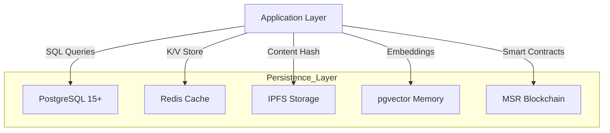
```mermaid
flowchart TD
    APP[Application Layer] -->|SQL Queries| PG[PostgreSQL 15+]
    APP -->|K/V Store| RD[Redis Cache]
    APP -->|Content Hash| IPFS[IPFS Storage]
    APP -->|Embeddings| PGV[pgvector Memory]
    APP -->|Smart Contracts| MSR[MSR Blockchain]
    
    subgraph Persistence_Layer
        PG
        RD
        IPFS
        PGV
        MSR
    end
```
Sources: [TAMV-MASTER-DOCUMENTATION.md:78-95](https://github.com/OsoPanda1/ecosistema-nextgen-tamv/blob/7d85edce66bcb534ae1f4e98356f1cf1487b21cb/TAMV-MASTER-DOCUMENTATION.md#L78-L95), [ARCHIVE/remaining-docs-consolidated-2026-02-13/TAMV-COMPLETE-IMPLEMENTATION-PLAN.md:27-50](https://github.com/OsoPanda1/ecosistema-nextgen-tamv/blob/7d85edce66bcb534ae1f4e98356f1cf1487b21cb/ARCHIVE/remaining-docs-consolidated-2026-02-13/TAMV-COMPLETE-IMPLEMENTATION-PLAN.md#L27-L50)

## Relational Schema Design

The primary relational database is built on PostgreSQL, utilizing a microservices-aligned schema to manage users, social interactions, and economic transactions.

### Entity Relationship Model

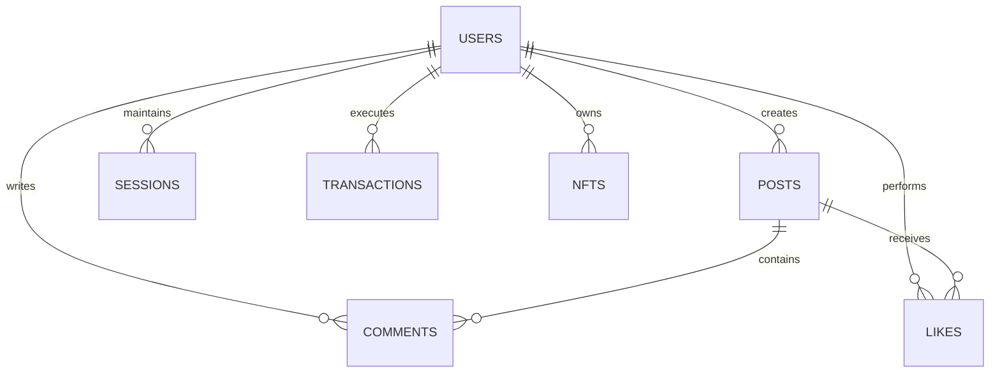
```mermaid
erDiagram
    USERS ||--o{ POSTS : creates
    USERS ||--o{ COMMENTS : writes
    USERS ||--o{ LIKES : performs
    USERS ||--o{ SESSIONS : maintains
    USERS ||--o{ TRANSACTIONS : executes
    POSTS ||--o{ COMMENTS : contains
    POSTS ||--o{ LIKES : receives
    USERS ||--o{ NFTS : owns
```
Sources: [ARCHIVE/remaining-docs-consolidated-2026-02-13/TAMV-BACKEND-COMPLETE.md:118-154](https://github.com/OsoPanda1/ecosistema-nextgen-tamv/blob/7d85edce66bcb534ae1f4e98356f1cf1487b21cb/ARCHIVE/remaining-docs-consolidated-2026-02-13/TAMV-BACKEND-COMPLETE.md#L118-L154), [ARCHIVE/remaining-docs-consolidated-2026-02-13/IMPLEMENTATION-PROGRESS-REPORT.md:19-24](https://github.com/OsoPanda1/ecosistema-nextgen-tamv/blob/7d85edce66bcb534ae1f4e98356f1cf1487b21cb/ARCHIVE/remaining-docs-consolidated-2026-02-13/IMPLEMENTATION-PROGRESS-REPORT.md#L19-L24)

### Key Table Definitions

*   **Users**: Stores sovereign identities, roles (user, moderator, admin), and wallet addresses for blockchain integration.
*   **Posts**: Manages content, visibility (public, followers, private), and auto-updated metrics via triggers.
*   **Sessions**: Tracks JWT tokens and refresh tokens with metadata like IP addresses and user agents.
*   **BookPI Registry**: An immutable ledger within the MSR blockchain used for registering civilizational evidence and audit trails.

Sources: [ARCHIVE/remaining-docs-consolidated-2026-02-13/TAMV-BACKEND-COMPLETE.md:118-140](https://github.com/OsoPanda1/ecosistema-nextgen-tamv/blob/7d85edce66bcb534ae1f4e98356f1cf1487b21cb/ARCHIVE/remaining-docs-consolidated-2026-02-13/TAMV-BACKEND-COMPLETE.md#L118-L140), [ARCHIVE/remaining-docs-consolidated-2026-02-13/REPORTE-AVANCE-TECNICO-COMPLETO.md:197-202](https://github.com/OsoPanda1/ecosistema-nextgen-tamv/blob/7d85edce66bcb534ae1f4e98356f1cf1487b21cb/ARCHIVE/remaining-docs-consolidated-2026-02-13/REPORTE-AVANCE-TECNICO-COMPLETO.md#L197-L202)

## Storage Implementation Details

### Data Integrity and Security
The storage strategy implements several technical safeguards to ensure data protection and availability:
*   **Soft Deletes**: Implemented on critical tables (Posts, Comments) to allow data retention and recovery.
*   **Database Triggers**: Used for automatic updates of interaction counts (likes, comments) to ensure denormalized data consistency.
*   **Parameterized Queries**: Utilized throughout the `database.ts` utility to prevent SQL injection.
*   **Indexed Queries**: Proper indexing on unique fields like `email` and `username` to optimize lookup performance.

Sources: [ARCHIVE/remaining-docs-consolidated-2026-02-13/TAMV-BACKEND-COMPLETE.md:15-18](https://github.com/OsoPanda1/ecosistema-nextgen-tamv/blob/7d85edce66bcb534ae1f4e98356f1cf1487b21cb/ARCHIVE/remaining-docs-consolidated-2026-02-13/TAMV-BACKEND-COMPLETE.md#L15-L18), [ARCHIVE/remaining-docs-consolidated-2026-02-13/IMPLEMENTATION-PROGRESS-REPORT.md:26-31](https://github.com/OsoPanda1/ecosistema-nextgen-tamv/blob/7d85edce66bcb534ae1f4e98356f1cf1487b21cb/ARCHIVE/remaining-docs-consolidated-2026-02-13/IMPLEMENTATION-PROGRESS-REPORT.md#L26-L31)

### AI Memory & Vector Storage
The Isabella AI framework utilizes **pgvector** for semantic memory. This allows the system to process photorealistic scenes and handwriting data by converting them into embeddings stored in PostgreSQL.

```javascript
// Example of how Isabella AI interacts with the vector layer
const audit = await IsabellaAI.audit(req.body.action, citizen);
// Logic feeds from the vector memory in pgvector
```
Sources: [TAMV-MASTER-DOCUMENTATION.md:214-220](https://github.com/OsoPanda1/ecosistema-nextgen-tamv/blob/7d85edce66bcb534ae1f4e98356f1cf1487b21cb/TAMV-MASTER-DOCUMENTATION.md#L214-L220), [ARCHIVE/remaining-docs-consolidated-2026-02-13/REPORTE-AVANCE-TECNICO-COMPLETO.md:224-230](https://github.com/OsoPanda1/ecosistema-nextgen-tamv/blob/7d85edce66bcb534ae1f4e98356f1cf1487b21cb/ARCHIVE/remaining-docs-consolidated-2026-02-13/REPORTE-AVANCE-TECNICO-COMPLETO.md#L224-L230)

## Deployment and Configuration

The storage layer is configured via environment variables to support flexible deployment across development and production (AWS ECS/RDS) environments.

| Variable | Description | Default/Example |
| :--- | :--- | :--- |
| `POSTGRES_HOST` | Database endpoint | tamv-prod.cluster... |
| `REDIS_HOST` | Cache endpoint | tamv-prod.cache... |
| `REDIS_TLS_ENABLED` | Enables secure cache connection | `true` |
| `ENCRYPTION_KEY` | Key for sensitive data at rest | 32-byte hex string |

Sources: [TAMV-MASTER-DOCUMENTATION.md:255-275](https://github.com/OsoPanda1/ecosistema-nextgen-tamv/blob/7d85edce66bcb534ae1f4e98356f1cf1487b21cb/TAMV-MASTER-DOCUMENTATION.md#L255-L275), [ARCHIVE/remaining-docs-consolidated-2026-02-13/TAMV-BACKEND-COMPLETE.md:82-96](https://github.com/OsoPanda1/ecosistema-nextgen-tamv/blob/7d85edce66bcb534ae1f4e98356f1cf1487b21cb/ARCHIVE/remaining-docs-consolidated-2026-02-13/TAMV-BACKEND-COMPLETE.md#L82-L96)

## Summary

The Database & Storage Strategy for TAMV balances the need for high-performance relational management with decentralized, immutable principles. By integrating PostgreSQL for structured data, IPFS for assets, and the MSR blockchain for historical memory, TAMV provides a resilient infrastructure that prioritizes user sovereignty and system integrity. This multi-layered approach ensures the system remains "impossible to capture" while scaling to meet the demands of a global creator economy.

Sources: [TAMV-MASTER-DOCUMENTATION.md:231-235](https://github.com/OsoPanda1/ecosistema-nextgen-tamv/blob/7d85edce66bcb534ae1f4e98356f1cf1487b21cb/TAMV-MASTER-DOCUMENTATION.md#L231-L235), [ARCHIVE/tamv-docs-consolidated-2026-02-02/TAMV-OFFICIAL-SYSTEM-DESCRIPTION.md:175-179](https://github.com/OsoPanda1/ecosistema-nextgen-tamv/blob/7d85edce66bcb534ae1f4e98356f1cf1487b21cb/ARCHIVE/tamv-docs-consolidated-2026-02-02/TAMV-OFFICIAL-SYSTEM-DESCRIPTION.md#L175-L179)


## Core Capabilities

### Sovereign Identity Management

<details>
<summary>Relevant source files</summary>

The following files were used as context for generating this wiki page:

- [TAMV-MASTER-DOCUMENTATION.md](https://github.com/OsoPanda1/ecosistema-nextgen-tamv/blob/7d85edce66bcb534ae1f4e98356f1cf1487b21cb/TAMV-MASTER-DOCUMENTATION.md)
- [ARCHIVE/remaining-docs-consolidated-2026-02-13/TAMV-BACKEND-COMPLETE.md](https://github.com/OsoPanda1/ecosistema-nextgen-tamv/blob/7d85edce66bcb534ae1f4e98356f1cf1487b21cb/ARCHIVE/remaining-docs-consolidated-2026-02-13/TAMV-BACKEND-COMPLETE.md)
- [ARCHIVE/tamv-docs-consolidated-2026-02-02/TAMV-OFFICIAL-SYSTEM-DESCRIPTION.md](https://github.com/OsoPanda1/ecosistema-nextgen-tamv/blob/7d85edce66bcb534ae1f4e98356f1cf1487b21cb/ARCHIVE/tamv-docs-consolidated-2026-02-02/TAMV-OFFICIAL-SYSTEM-DESCRIPTION.md)
- [ARCHIVE/remaining-docs-consolidated-2026-02-13/IMPLEMENTATION-PROGRESS-REPORT.md](https://github.com/OsoPanda1/ecosistema-nextgen-tamv/blob/7d85edce66bcb534ae1f4e98356f1cf1487b21cb/ARCHIVE/remaining-docs-consolidated-2026-02-13/IMPLEMENTATION-PROGRESS-REPORT.md)
- [ARCHIVE/remaining-docs-consolidated-2026-02-13/TAMV-COMPLETE-IMPLEMENTATION-PLAN.md](https://github.com/OsoPanda1/ecosistema-nextgen-tamv/blob/7d85edce66bcb534ae1f4e98356f1cf1487b21cb/ARCHIVE/remaining-docs-consolidated-2026-02-13/TAMV-COMPLETE-IMPLEMENTATION-PLAN.md)
- [ARCHIVE/readme-files-consolidated-2026-02-02/README-GITHUB.md](https://github.com/OsoPanda1/ecosistema-nextgen-tamv/blob/7d85edce66bcb534ae1f4e98356f1cf1487b21cb/ARCHIVE/readme-files-consolidated-2026-02-02/README-GITHUB.md)
</details>

# Sovereign Identity Management

Sovereign Identity Management in the TAMV ecosystem is a distributed socio-technical infrastructure designed to provide users with absolute control over their digital personas, data, and economic decisions. By utilizing decentralized identifiers (DID) and cryptographic guarantees, the system ensures digital sovereignty where users are not subject to the extractive models of centralized platforms. This management system is a core component of the "Constitutional Layer" of the project, defining rights and duties within the federated architecture.

Sources: [TAMV-MASTER-DOCUMENTATION.md:37-43](https://github.com/OsoPanda1/ecosistema-nextgen-tamv/blob/7d85edce66bcb534ae1f4e98356f1cf1487b21cb/TAMV-MASTER-DOCUMENTATION.md#L37-L43), [TAMV-OFFICIAL-SYSTEM-DESCRIPTION.md:8-12](https://github.com/OsoPanda1/ecosistema-nextgen-tamv/blob/7d85edce66bcb534ae1f4e98356f1cf1487b21cb/TAMV-OFFICIAL-SYSTEM-DESCRIPTION.md#L8-L12), [TAMV-MASTER-DOCUMENTATION.md:58-66](https://github.com/OsoPanda1/ecosistema-nextgen-tamv/blob/7d85edce66bcb534ae1f4e98356f1cf1487b21cb/TAMV-MASTER-DOCUMENTATION.md#L58-L66)

## Architecture and Federated Layers

The identity system operates within a 7-layer federated model. Specifically, identity is anchored in **Layer 2: Constitutional**, which defines user rights and sovereignty, and is technically executed in **Layer 6: Technical-Infrastructural**. The "Identity Service" pod is responsible for user authentication, DID management, and profile coordination across the ecosystem.

### Identity Service Components

| Component | Function | Derived Endpoints |
| :--- | :--- | :--- |
| **Auth Engine** | JWT-based authentication and 2FA | `/auth/login`, `/auth/register` |
| **DID Manager** | Decentralized Identifier lifecycle | `/did` |
| **Profile Service** | Management of user metadata and avatars | `/profiles`, `/users/:id` |
| **Guardianship** | Human-in-the-loop validation for critical identity changes | N/A (Internal Logic) |

Sources: [TAMV-MASTER-DOCUMENTATION.md:58-66](https://github.com/OsoPanda1/ecosistema-nextgen-tamv/blob/7d85edce66bcb534ae1f4e98356f1cf1487b21cb/TAMV-MASTER-DOCUMENTATION.md#L58-L66), [TAMV-MASTER-DOCUMENTATION.md:86-90](https://github.com/OsoPanda1/ecosistema-nextgen-tamv/blob/7d85edce66bcb534ae1f4e98356f1cf1487b21cb/TAMV-MASTER-DOCUMENTATION.md#L86-L90), [TAMV-MASTER-DOCUMENTATION.md:237-240](https://github.com/OsoPanda1/ecosistema-nextgen-tamv/blob/7d85edce66bcb534ae1f4e98356f1cf1487b21cb/TAMV-MASTER-DOCUMENTATION.md#L237-L240)

## ID-NVIDA and Authentication Flow

The system employs a specific identity standard referred to as **ID-NVIDA**, which is validated by the "Anubis Sentinel" gatekeeper. Access to the system requires valid cryptographic signatures. The authentication flow utilizes JWT (JSON Web Tokens) with a short-lived access token (15 minutes) and a longer-lived refresh token (7 days) stored in secure sessions.

### Authentication Sequence
The following diagram illustrates the interaction between the user, the Identity Controller, and the underlying security sentinels during a login request.

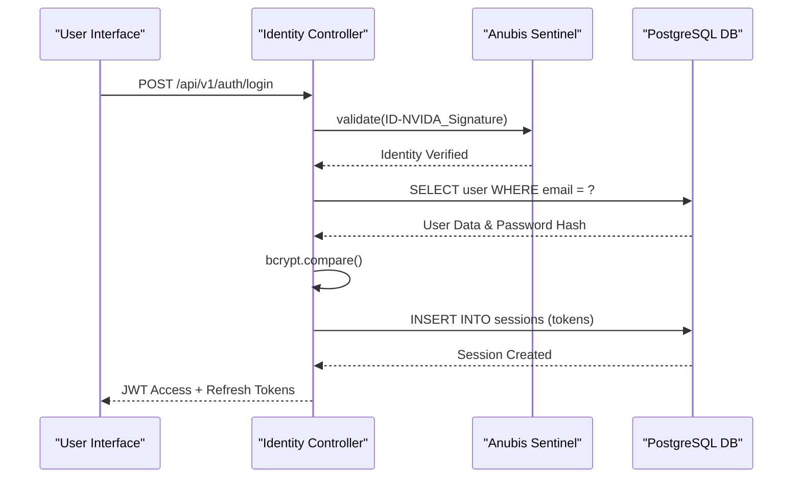
```mermaid
sequenceDiagram
    participant User as "User Interface"
    participant IC as "Identity Controller"
    participant AS as "Anubis Sentinel"
    participant DB as "PostgreSQL DB"
    
    User->>IC: POST /api/v1/auth/login
    IC->>AS: validate(ID-NVIDA_Signature)
    AS-->>IC: Identity Verified
    IC->>DB: SELECT user WHERE email = ?
    DB-->>IC: User Data & Password Hash
    IC->>IC: bcrypt.compare()
    IC->>DB: INSERT INTO sessions (tokens)
    DB-->>IC: Session Created
    IC-->>User: JWT Access + Refresh Tokens
```

Sources: [ARCHIVE/remaining-docs-consolidated-2026-02-13/REPORTE-AVANCE-TECNICO-COMPLETO.md:188-195](https://github.com/OsoPanda1/ecosistema-nextgen-tamv/blob/7d85edce66bcb534ae1f4e98356f1cf1487b21cb/ARCHIVE/remaining-docs-consolidated-2026-02-13/REPORTE-AVANCE-TECNICO-COMPLETO.md#L188-L195), [ARCHIVE/remaining-docs-consolidated-2026-02-13/TAMV-BACKEND-COMPLETE.md:183-187](https://github.com/OsoPanda1/ecosistema-nextgen-tamv/blob/7d85edce66bcb534ae1f4e98356f1cf1487b21cb/ARCHIVE/remaining-docs-consolidated-2026-02-13/TAMV-BACKEND-COMPLETE.md#L183-L187), [ARCHIVE/remaining-docs-consolidated-2026-02-13/IMPLEMENTATION-PROGRESS-REPORT.md:113-116](https://github.com/OsoPanda1/ecosistema-nextgen-tamv/blob/7d85edce66bcb534ae1f4e98356f1cf1487b21cb/ARCHIVE/remaining-docs-consolidated-2026-02-13/IMPLEMENTATION-PROGRESS-REPORT.md#L113-L116)

## Security Framework: TENOCHTITLAN

Identity management is protected by the **TENOCHTITLAN** system, which ensures that identity cannot be "captured" or centralized. It uses four types of human guardians (Technical, Ethical, Legal, and Economic) to oversee the AI agents. Identity verification is further strengthened by the "Twin MOS" cross-validation system where one agent validates and another questions the identity claims.

### Security Hierarchy for Identities
- **ANUBIS CENTINEL**: Primary system with 4 encrypted layers.
- **HORUS CENTINEL**: Evolutionary standby with 10 layers.
- **DEKATEOTL**: Supreme orchestration with 11 verification layers.
- **Continuous Identity Trust**: Dynamic trust scores based on DID activity.

Sources: [TAMV-MASTER-DOCUMENTATION.md:225-235](https://github.com/OsoPanda1/ecosistema-nextgen-tamv/blob/7d85edce66bcb534ae1f4e98356f1cf1487b21cb/TAMV-MASTER-DOCUMENTATION.md#L225-L235), [ARCHIVE/remaining-docs-consolidated-2026-02-13/README-GITHUB.md:46-50](https://github.com/OsoPanda1/ecosistema-nextgen-tamv/blob/7d85edce66bcb534ae1f4e98356f1cf1487b21cb/ARCHIVE/remaining-docs-consolidated-2026-02-13/README-GITHUB.md#L46-L50), [TAMV-OFFICIAL-SYSTEM-DESCRIPTION.md:51-55](https://github.com/OsoPanda1/ecosistema-nextgen-tamv/blob/7d85edce66bcb534ae1f4e98356f1cf1487b21cb/TAMV-OFFICIAL-SYSTEM-DESCRIPTION.md#L51-L55)

## Data Model: Users and Sessions

The identity system is backed by a relational schema in PostgreSQL, emphasizing separation between public profile data and sensitive authentication credentials.

### Identity Data Structures

| Field | Type | Description |
| :--- | :--- | :--- |
| `id` | UUID | Primary unique identifier. |
| `username` | String | Unique indexed handle. |
| `password_hash` | String | Bcrypt hashed credential. |
| `wallet_address` | String | Cryptographic address for blockchain transactions. |
| `role` | Enum | RBAC: `user`, `moderator`, `admin`. |
| `last_login_at` | Timestamp | Audit trail for identity activity. |

Sources: [ARCHIVE/remaining-docs-consolidated-2026-02-13/TAMV-BACKEND-COMPLETE.md:215-227](https://github.com/OsoPanda1/ecosistema-nextgen-tamv/blob/7d85edce66bcb534ae1f4e98356f1cf1487b21cb/ARCHIVE/remaining-docs-consolidated-2026-02-13/TAMV-BACKEND-COMPLETE.md#L215-L227), [ARCHIVE/remaining-docs-consolidated-2026-02-13/TAMV-COMPLETE-IMPLEMENTATION-PLAN.md:112-120](https://github.com/OsoPanda1/ecosistema-nextgen-tamv/blob/7d85edce66bcb534ae1f4e98356f1cf1487b21cb/ARCHIVE/remaining-docs-consolidated-2026-02-13/TAMV-COMPLETE-IMPLEMENTATION-PLAN.md#L112-L120)

## Implementation of Anti-Fraud Protocols

Before an identity can participate in the monetization ecosystem (Creator Economy), it must pass through **Initiation Protocols**. These include mandatory **KYC (Know Your Customer)** and **KYB (Know Your Business)** procedures. Evidence of these verifications is stored on the MSR (Memory, Sovereignty, Responsibility) blockchain via Merkle State Roots to prevent fraud.

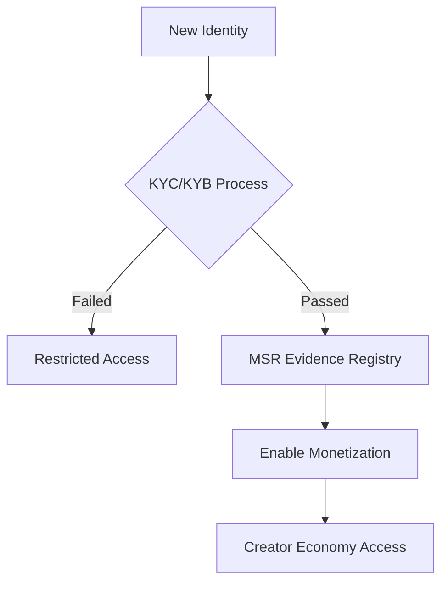
```mermaid
flowchart TD
    A[New Identity] --> B{KYC/KYB Process}
    B -- Failed --> C[Restricted Access]
    B -- Passed --> D[MSR Evidence Registry]
    D --> E[Enable Monetization]
    E --> F[Creator Economy Access]
```

Sources: [TAMV-MASTER-DOCUMENTATION.md:202-210](https://github.com/OsoPanda1/ecosistema-nextgen-tamv/blob/7d85edce66bcb534ae1f4e98356f1cf1487b21cb/TAMV-MASTER-DOCUMENTATION.md#L202-L210), [TAMV-MASTER-DOCUMENTATION.md:255-257](https://github.com/OsoPanda1/ecosistema-nextgen-tamv/blob/7d85edce66bcb534ae1f4e98356f1cf1487b21cb/TAMV-MASTER-DOCUMENTATION.md#L255-L257)

## Conclusion
Sovereign Identity Management in TAMV represents an antifragile approach to user data. By combining decentralized DID protocols, human-led guardianship, and multi-layered sentinel security, the system provides a production-ready infrastructure that respects digital dignity and ensures that users remain the sole owners of their virtual existence.

### MSR Blockchain Framework

<details>
<summary>Relevant source files</summary>

The following files were used as context for generating this wiki page:

- [TAMV-MASTER-DOCUMENTATION.md](https://github.com/OsoPanda1/ecosistema-nextgen-tamv/blob/7d85edce66bcb534ae1f4e98356f1cf1487b21cb/TAMV-MASTER-DOCUMENTATION.md)
- [ARCHIVE/remaining-docs-consolidated-2026-02-13/TAMV-COMPLETE-IMPLEMENTATION-PLAN.md](https://github.com/OsoPanda1/ecosistema-nextgen-tamv/blob/7d85edce66bcb534ae1f4e98356f1cf1487b21cb/ARCHIVE/remaining-docs-consolidated-2026-02-13/TAMV-COMPLETE-IMPLEMENTATION-PLAN.md)
- [ARCHIVE/tamv-docs-consolidated-2026-02-02/TAMV-OFFICIAL-SYSTEM-DESCRIPTION.md](https://github.com/OsoPanda1/ecosistema-nextgen-tamv/blob/7d85edce66bcb534ae1f4e98356f1cf1487b21cb/ARCHIVE/tamv-docs-consolidated-2026-02-02/TAMV-OFFICIAL-SYSTEM-DESCRIPTION.md)
- [ARCHIVE/remaining-docs-consolidated-2026-02-13/TAMV-BACKEND-COMPLETE.md](https://github.com/OsoPanda1/ecosistema-nextgen-tamv/blob/7d85edce66bcb534ae1f4e98356f1cf1487b21cb/ARCHIVE/remaining-docs-consolidated-2026-02-13/TAMV-BACKEND-COMPLETE.md)
- [ARCHIVE/remaining-docs-consolidated-2026-02-13/REPORTE-AVANCE-TECNICO-COMPLETO.md](https://github.com/OsoPanda1/ecosistema-nextgen-tamv/blob/7d85edce66bcb534ae1f4e98356f1cf1487b21cb/ARCHIVE/remaining-docs-consolidated-2026-02-13/REPORTE-AVANCE-TECNICO-COMPLETO.md)
- [ARCHIVE/readme-files-consolidated-2026-02-02/README-GITHUB.md](https://github.com/OsoPanda1/ecosistema-nextgen-tamv/blob/7d85edce66bcb534ae1f4e98356f1cf1487b21cb/ARCHIVE/readme-files-consolidated-2026-02-02/README-GITHUB.md)
</details>

# MSR Blockchain Framework

The **MSR (Memory, Sovereignty, Responsibility)** Blockchain Framework serves as the immutable trust and registry layer for the TAMV (Territorio Autónomo de Memoria Viva) ecosystem. It is a federated blockchain system designed to preserve cultural, technical, and social knowledge while ensuring digital sovereignty and anti-fraud guarantees through cryptographic evidence.

Sources: [TAMV-MASTER-DOCUMENTATION.md:28-30](https://github.com/OsoPanda1/ecosistema-nextgen-tamv/blob/7d85edce66bcb534ae1f4e98356f1cf1487b21cb/TAMV-MASTER-DOCUMENTATION.md#L28-L30), [TAMV-MASTER-DOCUMENTATION.md:104-106](https://github.com/OsoPanda1/ecosistema-nextgen-tamv/blob/7d85edce66bcb534ae1f4e98356f1cf1487b21cb/TAMV-MASTER-DOCUMENTATION.md#L104-L106)

## Architecture and Core Principles

The MSR Framework is built on three fundamental pillars that define its operational logic within the broader TAMV infrastructure:
*   **Memory Defense**: Utilizing distributed storage and immutable registries to preserve civilizational knowledge.
*   **Digital Sovereignty**: Providing users absolute control over their data and economic transactions via decentralized protocols.
*   **Ethical Responsibility**: Ensuring all registered actions are transparent, auditable, and aligned with the system's ethical guidelines.

Sources: [TAMV-MASTER-DOCUMENTATION.md:46-52](https://github.com/OsoPanda1/ecosistema-nextgen-tamv/blob/7d85edce66bcb534ae1f4e98356f1cf1487b21cb/TAMV-MASTER-DOCUMENTATION.md#L46-L52), [ARCHIVE/tamv-docs-consolidated-2026-02-02/TAMV-OFFICIAL-SYSTEM-DESCRIPTION.md:12-15](https://github.com/OsoPanda1/ecosistema-nextgen-tamv/blob/7d85edce66bcb534ae1f4e98356f1cf1487b21cb/ARCHIVE/tamv-docs-consolidated-2026-02-02/TAMV-OFFICIAL-SYSTEM-DESCRIPTION.md#L12-L15)

### Data Flow and Layered Integration
The MSR chain operates as Layer 7 (Historical-Memorial) in the TAMV federated architecture, acting as the ultimate registry for all lower-level operations.

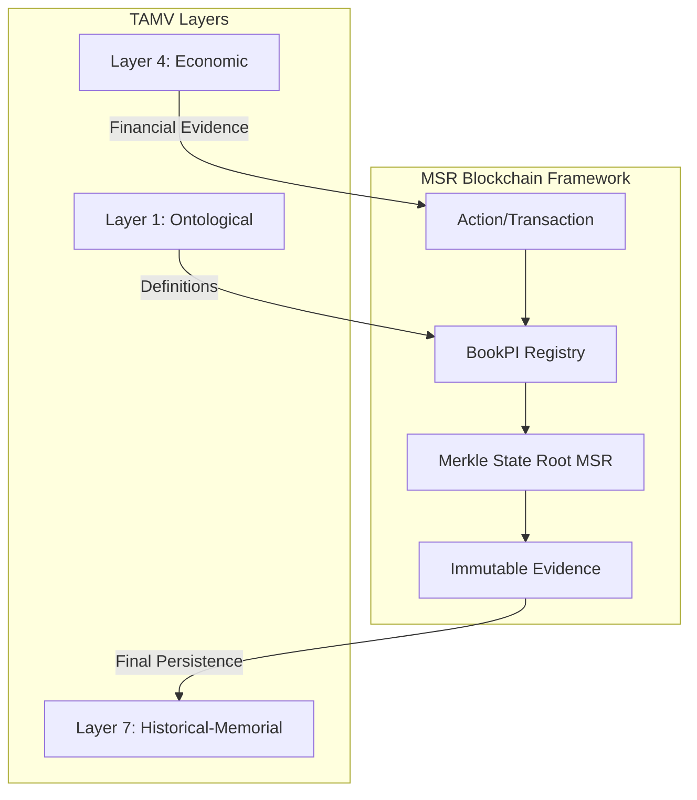
```mermaid
graph TD
    subgraph MSR_Framework [MSR Blockchain Framework]
        A[Action/Transaction] --> B[BookPI Registry]
        B --> C[Merkle State Root MSR]
        C --> D[Immutable Evidence]
    end
    
    subgraph System_Layers [TAMV Layers]
        L1[Layer 1: Ontological]
        L4[Layer 4: Economic]
        L7[Layer 7: Historical-Memorial]
    end

    L4 -- Financial Evidence --> A
    D -- Final Persistence --> L7
    L1 -- Definitions --> B
```
The diagram shows how transactions from the economic layer flow into the MSR framework for immutable registration in the historical layer.
Sources: [TAMV-MASTER-DOCUMENTATION.md:65-75](https://github.com/OsoPanda1/ecosistema-nextgen-tamv/blob/7d85edce66bcb534ae1f4e98356f1cf1487b21cb/TAMV-MASTER-DOCUMENTATION.md#L65-L75), [ARCHIVE/remaining-docs-consolidated-2026-02-13/REPORTE-AVANCE-TECNICO-COMPLETO.md:145-160](https://github.com/OsoPanda1/ecosistema-nextgen-tamv/blob/7d85edce66bcb534ae1f4e98356f1cf1487b21cb/ARCHIVE/remaining-docs-consolidated-2026-02-13/REPORTE-AVANCE-TECNICO-COMPLETO.md#L145-L160)

## Key Components

The framework consists of several specialized sub-systems that handle different aspects of the blockchain lifecycle, from transaction processing to long-term storage.

### 1. BookPI (Civilizational Evidence Registry)
The BookPI acts as the primary ledger for recording "civilizational evidence." Every significant action—economic, legal, or technical—is hashed and recorded here to provide a permanent audit trail.
Sources: [TAMV-MASTER-DOCUMENTATION.md:310-315](https://github.com/OsoPanda1/ecosistema-nextgen-tamv/blob/7d85edce66bcb534ae1f4e98356f1cf1487b21cb/TAMV-MASTER-DOCUMENTATION.md#L310-L315), [ARCHIVE/remaining-docs-consolidated-2026-02-13/REPORTE-AVANCE-TECNICO-COMPLETO.md:148-150](https://github.com/OsoPanda1/ecosistema-nextgen-tamv/blob/7d85edce66bcb534ae1f4e98356f1cf1487b21cb/ARCHIVE/remaining-docs-consolidated-2026-02-13/REPORTE-AVANCE-TECNICO-COMPLETO.md#L148-L150)

### 2. Merkle State Root (MSR) Chain
A custom federated blockchain that utilizes Merkle State Roots to ensure the integrity of the entire system state. It is designed to be "antifragile," meaning it strengthens its defensive posture as it encounters adversarial attempts.
Sources: [TAMV-MASTER-DOCUMENTATION.md:310-313](https://github.com/OsoPanda1/ecosistema-nextgen-tamv/blob/7d85edce66bcb534ae1f4e98356f1cf1487b21cb/TAMV-MASTER-DOCUMENTATION.md#L310-L313), [ARCHIVE/readme-files-consolidated-2026-02-02/README-GITHUB.md:45-48](https://github.com/OsoPanda1/ecosistema-nextgen-tamv/blob/7d85edce66bcb534ae1f4e98356f1cf1487b21cb/ARCHIVE/readme-files-consolidated-2026-02-02/README-GITHUB.md#L45-L48)

### 3. Federated Interoperability
MSR is not an isolated chain; it integrates with public networks for broader utility and liquidity while maintaining a private federated core for sensitive governance data.
Sources: [TAMV-MASTER-DOCUMENTATION.md:102-105](https://github.com/OsoPanda1/ecosistema-nextgen-tamv/blob/7d85edce66bcb534ae1f4e98356f1cf1487b21cb/TAMV-MASTER-DOCUMENTATION.md#L102-L105)

| Network Type | Technology Used | Purpose |
| :--- | :--- | :--- |
| Public Layer | Ethereum / Polygon | Smart contracts, NFTs, and public liquidity |
| High-Perf Layer | Solana | High-frequency economic operations |
| Sovereign Layer | Custom MSR Chain | Federated registry, audit logs, and evidence |
| Storage Layer | IPFS | Distributed, content-addressed storage |

Sources: [TAMV-MASTER-DOCUMENTATION.md:86-90](https://github.com/OsoPanda1/ecosistema-nextgen-tamv/blob/7d85edce66bcb534ae1f4e98356f1cf1487b21cb/TAMV-MASTER-DOCUMENTATION.md#L86-L90), [ARCHIVE/remaining-docs-consolidated-2026-02-13/TAMV-COMPLETE-IMPLEMENTATION-PLAN.md:11-15](https://github.com/OsoPanda1/ecosistema-nextgen-tamv/blob/7d85edce66bcb534ae1f4e98356f1cf1487b21cb/ARCHIVE/remaining-docs-consolidated-2026-02-13/TAMV-COMPLETE-IMPLEMENTATION-PLAN.md#L11-L15)

## Smart Contract Logic

The framework employs specific smart contract architectures to manage assets and governance. Key implementations include the `TAMVToken` (ERC-20) for the internal economy and `NFTMarketplace` (ERC-721) for digital assets.

### Transaction Sequence
The following sequence illustrates how a sovereign action is validated and recorded within the MSR framework.

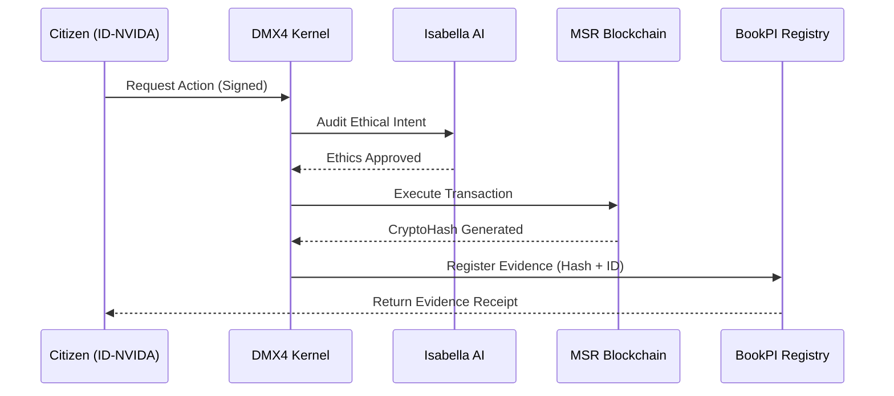
```mermaid
sequenceDiagram
    participant User as Citizen (ID-NVIDA)
    participant Kernel as DMX4 Kernel
    participant AI as Isabella AI
    participant MSR as MSR Blockchain
    participant Ledger as BookPI Registry

    User->>Kernel: Request Action (Signed)
    Kernel->>AI: Audit Ethical Intent
    AI-->>Kernel: Ethics Approved
    Kernel->>MSR: Execute Transaction
    MSR-->>Kernel: CryptoHash Generated
    Kernel->>Ledger: Register Evidence (Hash + ID)
    Ledger-->>User: Return Evidence Receipt
```
The diagram represents the "Sovereign Action" flow where identity verification and ethical auditing precede blockchain registration.
Sources: [ARCHIVE/remaining-docs-consolidated-2026-02-13/REPORTE-AVANCE-TECNICO-COMPLETO.md:145-165](https://github.com/OsoPanda1/ecosistema-nextgen-tamv/blob/7d85edce66bcb534ae1f4e98356f1cf1487b21cb/ARCHIVE/remaining-docs-consolidated-2026-02-13/REPORTE-AVANCE-TECNICO-COMPLETO.md#L145-L165)

### Data Models
The backend implementation includes specific models for tracking blockchain-related data.

| Field | Type | Description |
| :--- | :--- | :--- |
| `transaction_hash` | String (Unique) | Cryptographic identifier of the block transaction |
| `from_address` | String | Sender's wallet or DID address |
| `to_address` | String | Recipient's address |
| `amount` | BigInt / Decimal | Value transferred |
| `status` | Enum | pending, confirmed, failed |
| `block_number` | Integer | Height of the block containing the transaction |

Sources: [ARCHIVE/remaining-docs-consolidated-2026-02-13/TAMV-BACKEND-COMPLETE.md:168-175](https://github.com/OsoPanda1/ecosistema-nextgen-tamv/blob/7d85edce66bcb534ae1f4e98356f1cf1487b21cb/ARCHIVE/remaining-docs-consolidated-2026-02-13/TAMV-BACKEND-COMPLETE.md#L168-L175), [ARCHIVE/remaining-docs-consolidated-2026-02-13/TAMV-COMPLETE-IMPLEMENTATION-PLAN.md:36-41](https://github.com/OsoPanda1/ecosistema-nextgen-tamv/blob/7d85edce66bcb534ae1f4e98356f1cf1487b21cb/ARCHIVE/remaining-docs-consolidated-2026-02-13/TAMV-COMPLETE-IMPLEMENTATION-PLAN.md#L36-L41)

## Implementation Details

The MSR Framework is implemented using a mix of TypeScript for the adapter/service layers and Solidity for the smart contracts.

### Key Backend Services
*   **Blockchain Service**: Manages interaction with both the internal MSR chain and external providers (Ethers.js/Wagmi).
*   **IPFS Service**: Handles the decentralized storage of metadata and large assets referenced on-chain.
*   **Evidence Service**: Specialized logic for generating and verifying `evidenceHash` receipts for the BookPI.

Sources: [ARCHIVE/remaining-docs-consolidated-2026-02-13/TAMV-COMPLETE-IMPLEMENTATION-PLAN.md:48-55](https://github.com/OsoPanda1/ecosistema-nextgen-tamv/blob/7d85edce66bcb534ae1f4e98356f1cf1487b21cb/ARCHIVE/remaining-docs-consolidated-2026-02-13/TAMV-COMPLETE-IMPLEMENTATION-PLAN.md#L48-L55), [ARCHIVE/remaining-docs-consolidated-2026-02-13/TAMV-BACKEND-COMPLETE.md:35-40](https://github.com/OsoPanda1/ecosistema-nextgen-tamv/blob/7d85edce66bcb534ae1f4e98356f1cf1487b21cb/ARCHIVE/remaining-docs-consolidated-2026-02-13/TAMV-BACKEND-COMPLETE.md#L35-L40)

### Smart Contract Example (ERC-20 Utility Token)
```solidity
// Simplified MSR Utility Token Logic
contract TAMVToken is ERC20, Ownable {
    constructor() ERC20("TAMV Token", "TAMV") {
        _mint(msg.sender, 1000000 * 10 ** decimals());
    }

    function mint(address to, uint256 amount) public onlyOwner {
        _mint(to, amount);
    }
}
```
Sources: [ARCHIVE/remaining-docs-consolidated-2026-02-13/TAMV-COMPLETE-IMPLEMENTATION-PLAN.md:215-227](https://github.com/OsoPanda1/ecosistema-nextgen-tamv/blob/7d85edce66bcb534ae1f4e98356f1cf1487b21cb/ARCHIVE/remaining-docs-consolidated-2026-02-13/TAMV-COMPLETE-IMPLEMENTATION-PLAN.md#L215-L227)

## Conclusion
The MSR Blockchain Framework provides the technical foundation for TAMV's "Antifragile Architecture." By combining federated registries (BookPI), custom state roots (MSR), and standardized smart contracts, the framework ensures that every action within the ecosystem is backed by immutable cryptographic evidence, effectively making the system "impossible to capture."

Sources: [TAMV-MASTER-DOCUMENTATION.md:258-260](https://github.com/OsoPanda1/ecosistema-nextgen-tamv/blob/7d85edce66bcb534ae1f4e98356f1cf1487b21cb/TAMV-MASTER-DOCUMENTATION.md#L258-L260), [ARCHIVE/tamv-docs-consolidated-2026-02-02/TAMV-OFFICIAL-SYSTEM-DESCRIPTION.md:160-165](https://github.com/OsoPanda1/ecosistema-nextgen-tamv/blob/7d85edce66bcb534ae1f4e98356f1cf1487b21cb/ARCHIVE/tamv-docs-consolidated-2026-02-02/TAMV-OFFICIAL-SYSTEM-DESCRIPTION.md#L160-L165)

### Geolocation & Spatial Features

<details>
<summary>Relevant source files</summary>

The following files were used as context for generating this wiki page:

- [TAMV-MASTER-DOCUMENTATION.md](https://github.com/OsoPanda1/ecosistema-nextgen-tamv/blob/7d85edce66bcb534ae1f4e98356f1cf1487b21cb/TAMV-MASTER-DOCUMENTATION.md)
- [ARCHIVE/tamv-docs-consolidated-2026-02-02/TAMV-OFFICIAL-SYSTEM-DESCRIPTION.md](https://github.com/OsoPanda1/ecosistema-nextgen-tamv/blob/7d85edce66bcb534ae1f4e98356f1cf1487b21cb/ARCHIVE/tamv-docs-consolidated-2026-02-02/TAMV-OFFICIAL-SYSTEM-DESCRIPTION.md)
- [ARCHIVE/remaining-docs-consolidated-2026-02-13/TAMV-COMPLETE-IMPLEMENTATION-PLAN.md](https://github.com/OsoPanda1/ecosistema-nextgen-tamv/blob/7d85edce66bcb534ae1f4e98356f1cf1487b21cb/ARCHIVE/remaining-docs-consolidated-2026-02-13/TAMV-COMPLETE-IMPLEMENTATION-PLAN.md)
- [ARCHIVE/remaining-docs-consolidated-2026-02-13/REPORTE-AVANCE-TECNICO-COMPLETO.md](https://github.com/OsoPanda1/ecosistema-nextgen-tamv/blob/7d85edce66bcb534ae1f4e98356f1cf1487b21cb/ARCHIVE/remaining-docs-consolidated-2026-02-13/REPORTE-AVANCE-TECNICO-COMPLETO.md)
- [scripts/analyze-duplicates.ts](https://github.com/OsoPanda1/ecosistema-nextgen-tamv/blob/7d85edce66bcb534ae1f4e98356f1cf1487b21cb/scripts/analyze-duplicates.ts)
- [ARCHIVE/remaining-docs-consolidated-2026-02-13/TAMV-BACKEND-COMPLETE.md](https://github.com/OsoPanda1/ecosistema-nextgen-tamv/blob/7d85edce66bcb534ae1f4e98356f1cf1487b21cb/ARCHIVE/remaining-docs-consolidated-2026-02-13/TAMV-BACKEND-COMPLETE.md)
</details>

# Geolocation & Spatial Features

Geolocation and spatial features in the TAMV ecosystem provide the foundation for integrating physical location data with immersive virtual environments. These features support the "DreamSpaces" engine, enabling virtual worlds to interact with real-world spatial coordinates and quantum physics simulations. The system utilizes advanced AI, specifically the Isabella framework's "Spatial AI" application, to process 3D environments and provide intelligent navigation and object recognition.

The architecture bridges the gap between traditional social networking and Web 4.0/5.0 immersive experiences. By leveraging a production-ready stack that includes PostgreSQL with `pgvector` for spatial embeddings and MinkowskiEngine for sparse 3D processing, TAMV creates a persistent, verifiable link between users, assets, and their geographic or virtual locations.

Sources: [TAMV-MASTER-DOCUMENTATION.md:108-115](https://github.com/OsoPanda1/ecosistema-nextgen-tamv/blob/7d85edce66bcb534ae1f4e98356f1cf1487b21cb/TAMV-MASTER-DOCUMENTATION.md#L108-L115), [TAMV-OFFICIAL-SYSTEM-DESCRIPTION.md:27-35](https://github.com/OsoPanda1/ecosistema-nextgen-tamv/blob/7d85edce66bcb534ae1f4e98356f1cf1487b21cb/TAMV-OFFICIAL-SYSTEM-DESCRIPTION.md#L27-L35), [REPORTE-AVANCE-TECNICO-COMPLETO.md:46-52](https://github.com/OsoPanda1/ecosistema-nextgen-tamv/blob/7d85edce66bcb534ae1f4e98356f1cf1487b21cb/REPORTE-AVANCE-TECNICO-COMPLETO.md#L46-L52)

## 1. Spatial AI & 3D Processing Architecture

The core of TAMV's spatial capabilities lies in the Isabella AI Framework, specifically its Spatial AI module. This system is designed to understand 3D spaces with human-like or superior precision, utilizing specialized neural network architectures for semantic segmentation and object recognition.

### 1.1 Core Spatial Technologies
The system employs high-performance libraries and models to handle complex 3D data:
*   **ResUNet14**: Used for robust feature extraction in 3D environments.
*   **MinkowskiEngine**: Provides an engine for sparse 3D processing, allowing the AI to focus on relevant spatial data points without processing empty space.
*   **Trilateral CRF**: Utilized for refined semantic segmentation of 3D scenes.
*   **ScanNet & SYNTHIA**: These datasets, containing over 3,099 photorealistic scenes, serve as the training foundation for spatial recognition.

Sources: [TAMV-MASTER-DOCUMENTATION.md:310-318](https://github.com/OsoPanda1/ecosistema-nextgen-tamv/blob/7d85edce66bcb534ae1f4e98356f1cf1487b21cb/TAMV-MASTER-DOCUMENTATION.md#L310-L318), [TAMV-OFFICIAL-SYSTEM-DESCRIPTION.md:27-35](https://github.com/OsoPanda1/ecosistema-nextgen-tamv/blob/7d85edce66bcb534ae1f4e98356f1cf1487b21cb/TAMV-OFFICIAL-SYSTEM-DESCRIPTION.md#L27-L35)

### 1.2 Spatial AI Workflow
The following diagram illustrates the flow of spatial data from raw input to intelligent output within the DreamSpaces engine.

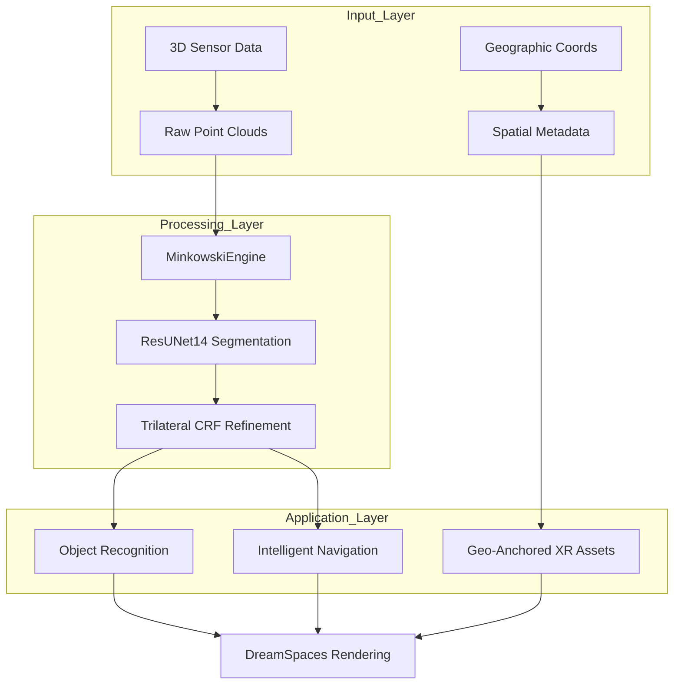
```mermaid
flowchart TD
    subgraph Input_Layer
        A[3D Sensor Data] --> B[Raw Point Clouds]
        C[Geographic Coords] --> D[Spatial Metadata]
    end
    
    subgraph Processing_Layer
        B --> E[MinkowskiEngine]
        E --> F[ResUNet14 Segmentation]
        F --> G[Trilateral CRF Refinement]
    end
    
    subgraph Application_Layer
        G --> H[Object Recognition]
        G --> I[Intelligent Navigation]
        D --> J[Geo-Anchored XR Assets]
    end
    
    H & I & J --> K[DreamSpaces Rendering]
```
The diagram shows how 3D sensor data and point clouds are processed through MinkowskiEngine and ResUNet14, refined via CRF, and finally used for navigation and asset anchoring in DreamSpaces.
Sources: [TAMV-MASTER-DOCUMENTATION.md:310-318](https://github.com/OsoPanda1/ecosistema-nextgen-tamv/blob/7d85edce66bcb534ae1f4e98356f1cf1487b21cb/TAMV-MASTER-DOCUMENTATION.md#L310-L318), [TAMV-OFFICIAL-SYSTEM-DESCRIPTION.md:92-104](https://github.com/OsoPanda1/ecosistema-nextgen-tamv/blob/7d85edce66bcb534ae1f4e98356f1cf1487b21cb/TAMV-OFFICIAL-SYSTEM-DESCRIPTION.md#L92-L104)

## 2. DreamSpaces & Immersive Geolocation

The "DreamSpaces-engine" is a dedicated microservice that manages virtual worlds, events, and spatial physics. It integrates real-world geolocation data to anchor virtual assets (XR/VR) to specific physical coordinates.

### 2.1 Key Service Endpoints
The DreamSpaces engine exposes several endpoints for managing spatial and physical interactions:
*   `/spaces`: Management of virtual world instances.
*   `/physics`: Quantum physics simulations and collision detection.
*   `/events`: Spatial events and real-time triggers.
*   `/multiplayer`: Synchronization of multiple users within a shared spatial context.

Sources: [TAMV-MASTER-DOCUMENTATION.md:126-130](https://github.com/OsoPanda1/ecosistema-nextgen-tamv/blob/7d85edce66bcb534ae1f4e98356f1cf1487b21cb/TAMV-MASTER-DOCUMENTATION.md#L126-L130), [REPORTE-AVANCE-TECNICO-COMPLETO.md:154-165](https://github.com/OsoPanda1/ecosistema-nextgen-tamv/blob/7d85edce66bcb534ae1f4e98356f1cf1487b21cb/REPORTE-AVANCE-TECNICO-COMPLETO.md#L154-L165)

### 2.2 Data Model Integration
Geolocation is integrated into the user and asset models via the PostgreSQL database, which utilizes `pgvector` for handling spatial embeddings and coordinate-based lookups.

| Field | Type | Description |
| :--- | :--- | :--- |
| `location` | String | Human-readable location description for user profiles. |
| `wallet_address` | String | Used for blockchain-based spatial asset ownership. |
| `media_urls` | Array | References to spatial media or XR filters stored in S3/IPFS. |
| `visibility` | Enum | Controls access to spatial posts (Public/Followers/Private). |

Sources: [TAMV-BACKEND-COMPLETE.md:175-186](https://github.com/OsoPanda1/ecosistema-nextgen-tamv/blob/7d85edce66bcb534ae1f4e98356f1cf1487b21cb/TAMV-BACKEND-COMPLETE.md#L175-L186), [TAMV-MASTER-DOCUMENTATION.md:94-102](https://github.com/OsoPanda1/ecosistema-nextgen-tamv/blob/7d85edce66bcb534ae1f4e98356f1cf1487b21cb/TAMV-MASTER-DOCUMENTATION.md#L94-L102)

## 3. Spatial System Integration & Functional Rules

The system follows strict functional rules for integrating spatial files into the core architecture. This ensures that XR and geolocation data are processed through audited pipelines.

### 3.1 Functional Integration Rules
The project defines specific rules for how spatial and XR files are enrouted within the backend:
*   **Layer**: L4 - XR/VR/3D/4D.
*   **File Patterns**: Identifies files matching `xr.*.ts`, `dreamspaces.*.ts`, or `renderer.*.ts`.
*   **Target Directories**: `backend/src/core/xr`, `backend/src/services`, and `backend/src/routes`.
*   **Subsystem Hint**: S1 Pipeline A – Visual XR/4D.
*   **Rationale**: Favorable spatial files are enrouted to the visual pipeline only after undergoing semantic validation to ensure ethical compliance.

Sources: [scripts/analyze-duplicates.ts:133-140](https://github.com/OsoPanda1/ecosistema-nextgen-tamv/blob/7d85edce66bcb534ae1f4e98356f1cf1487b21cb/scripts/analyze-duplicates.ts#L133-L140), [REPORTE-AVANCE-TECNICO-COMPLETO.md:154-165](https://github.com/OsoPanda1/ecosistema-nextgen-tamv/blob/7d85edce66bcb534ae1f4e98356f1cf1487b21cb/REPORTE-AVANCE-TECNICO-COMPLETO.md#L154-L165)

### 3.2 System Interaction Sequence
The interaction between a user request for spatial data and the backend services is depicted below:

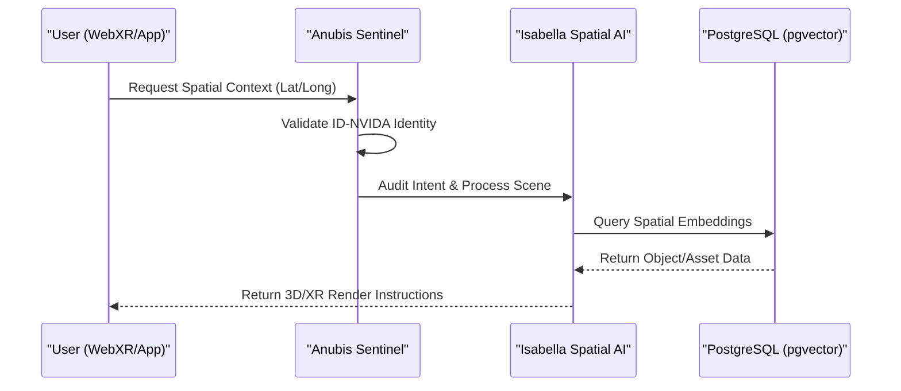
```mermaid
sequenceDiagram
    participant User as "User (WebXR/App)"
    participant Gateway as "Anubis Sentinel"
    participant Isabella as "Isabella Spatial AI"
    participant DB as "PostgreSQL (pgvector)"
    
    User->>Gateway: Request Spatial Context (Lat/Long)
    Gateway->>Gateway: Validate ID-NVIDA Identity
    Gateway->>Isabella: Audit Intent & Process Scene
    Isabella->>DB: Query Spatial Embeddings
    DB-->>Isabella: Return Object/Asset Data
    Isabella-->>User: Return 3D/XR Render Instructions
```
This sequence shows the validation of user identity via Anubis Sentinel before Isabella Spatial AI queries spatial embeddings from the database to return render instructions.
Sources: [REPORTE-AVANCE-TECNICO-COMPLETO.md:183-207](https://github.com/OsoPanda1/ecosistema-nextgen-tamv/blob/7d85edce66bcb534ae1f4e98356f1cf1487b21cb/REPORTE-AVANCE-TECNICO-COMPLETO.md#L183-L207), [TAMV-OFFICIAL-SYSTEM-DESCRIPTION.md:43-52](https://github.com/OsoPanda1/ecosistema-nextgen-tamv/blob/7d85edce66bcb534ae1f4e98356f1cf1487b21cb/TAMV-OFFICIAL-SYSTEM-DESCRIPTION.md#L43-L52)

## 4. Conclusion

Geolocation and spatial features in TAMV represent a sophisticated blend of AI-driven 3D understanding and coordinate-based asset management. By utilizing ResUNet14 and MinkowskiEngine for processing, the system provides accurate semantic segmentation of environments, while the DreamSpaces engine ensures that virtual experiences remain anchored to verifiable physical or mathematical locations. This infrastructure is critical for the TAMV vision of digital sovereignty, ensuring that spatial data remains under user control and is processed according to established ethical guidelines.

Sources: [TAMV-MASTER-DOCUMENTATION.md:310-318](https://github.com/OsoPanda1/ecosistema-nextgen-tamv/blob/7d85edce66bcb534ae1f4e98356f1cf1487b21cb/TAMV-MASTER-DOCUMENTATION.md#L310-L318), [TAMV-OFFICIAL-SYSTEM-DESCRIPTION.md:120-125](https://github.com/OsoPanda1/ecosistema-nextgen-tamv/blob/7d85edce66bcb534ae1f4e98356f1cf1487b21cb/TAMV-OFFICIAL-SYSTEM-DESCRIPTION.md#L120-L125)


## Security System (Tenochtitlan)

### Tenochtitlan Security Core

<details>
<summary>Relevant source files</summary>

The following files were used as context for generating this wiki page:

- [cognition/services/tenochtitlan.md](https://github.com/OsoPanda1/ecosistema-nextgen-tamv/blob/7d85edce66bcb534ae1f4e98356f1cf1487b21cb/cognition/services/tenochtitlan.md)
- [infrastructure/security/tenochtitlan-config.json](https://github.com/OsoPanda1/ecosistema-nextgen-tamv/blob/7d85edce66bcb534ae1f4e98356f1cf1487b21cb/infrastructure/security/tenochtitlan-config.json)
- [TAMV-MASTER-DOCUMENTATION.md](https://github.com/OsoPanda1/ecosistema-nextgen-tamv/blob/7d85edce66bcb534ae1f4e98356f1cf1487b21cb/TAMV-MASTER-DOCUMENTATION.md)
- [ARCHIVE/readme-files-consolidated-2026-02-02/README-GITHUB.md](https://github.com/OsoPanda1/ecosistema-nextgen-tamv/blob/7d85edce66bcb534ae1f4e98356f1cf1487b21cb/ARCHIVE/readme-files-consolidated-2026-02-02/README-GITHUB.md)
- [ARCHIVE/tamv-docs-consolidated-2026-02-02/TAMV-OFFICIAL-SYSTEM-DESCRIPTION.md](https://github.com/OsoPanda1/ecosistema-nextgen-tamv/blob/7d85edce66bcb534ae1f4e98356f1cf1487b21cb/ARCHIVE/tamv-docs-consolidated-2026-02-02/TAMV-OFFICIAL-SYSTEM-DESCRIPTION.md)
</details>

# Tenochtitlan Security Core

Tenochtitlan is the general protection system and total security architecture for the TAMV (Territorio Autónomo de Memoria Viva) ecosystem. It represents a distributed socio-technical infrastructure designed for digital autonomy, operating as an "antifragile" system that strengthens itself through adversity rather than just resisting it. The system is defined by its purely defensive nature, oriented toward prevention, detection, containment, and controlled degradation, ensuring that no AI has final authority over critical decisions.

The core philosophy follows the canon: "TAMV does not defend by attacking. It defends by being impossible to capture." This is achieved through multi-layered encryption, human-in-the-loop guardianship, and the implementation of adaptive adversarial containment environments. Sources: [cognition/services/tenochtitlan.md:1-20](https://github.com/OsoPanda1/ecosistema-nextgen-tamv/blob/7d85edce66bcb534ae1f4e98356f1cf1487b21cb/cognition/services/tenochtitlan.md#L1-L20), [TAMV-MASTER-DOCUMENTATION.md:280-285](https://github.com/OsoPanda1/ecosistema-nextgen-tamv/blob/7d85edce66bcb534ae1f4e98356f1cf1487b21cb/TAMV-MASTER-DOCUMENTATION.md#L280-L285), [infrastructure/security/tenochtitlan-config.json:200-210](https://github.com/OsoPanda1/ecosistema-nextgen-tamv/blob/7d85edce66bcb534ae1f4e98356f1cf1487b21cb/infrastructure/security/tenochtitlan-config.json#L200-L210)

## Architecture and Protection Layers

Tenochtitlan utilizes a multi-tiered defense strategy involving specialized "Centinels" and orchestration layers. The architecture is organized into levels ranging from individual nodes to entire federated civilizations.

### Component Hierarchy
The system is composed of four primary security components, each with increasing levels of complexity and security depth:

| Component | Role | Security Depth | Activation Requirements |
| :--- | :--- | :--- | :--- |
| **ANUBIS CENTINEL** | Primary Security | 4 Encrypted Layers | Active/Always On |
| **HORUS CENTINEL** | Evolutionary Standby | 10 Layers (6+2+2) | Human Approval |
| **DEKATEOTL** | Supreme Orchestration | 11 Verification Layers | Consensus + Ethical + Legal |
| **AZTEK GODS** | Absolute Standby | 22 Encrypted Layers | Total system failure/Extreme consensus |

Sources: [cognition/services/tenochtitlan.md:32-55](https://github.com/OsoPanda1/ecosistema-nextgen-tamv/blob/7d85edce66bcb534ae1f4e98356f1cf1487b21cb/cognition/services/tenochtitlan.md#L32-L55), [infrastructure/security/tenochtitlan-config.json:52-105](https://github.com/OsoPanda1/ecosistema-nextgen-tamv/blob/7d85edce66bcb534ae1f4e98356f1cf1487b21cb/infrastructure/security/tenochtitlan-config.json#L52-L105)

### System Flow Diagram
The following diagram illustrates the relationship between the primary protection systems and the specialized radars used for threat identification.

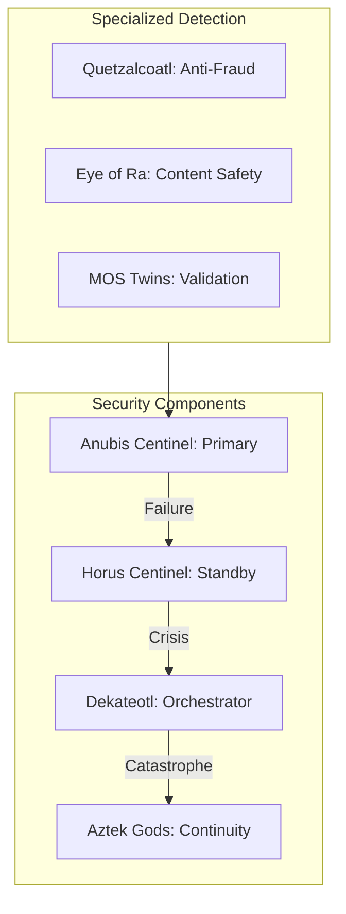
```mermaid
flowchart TD
    subgraph Core_Protection[Security Components]
        ANUBIS[Anubis Centinel: Primary]
        HORUS[Horus Centinel: Standby]
        DEKATEOTL[Dekateotl: Orchestrator]
        AZTEK[Aztek Gods: Continuity]
    end

    subgraph Radars[Specialized Detection]
        QUETZAL[Quetzalcoatl: Anti-Fraud]
        OJO[Eye of Ra: Content Safety]
        MOS[MOS Twins: Validation]
    end

    Radars --> ANUBIS
    ANUBIS -- Failure --> HORUS
    HORUS -- Crisis --> DEKATEOTL
    DEKATEOTL -- Catastrophe --> AZTEK
```
Sources: [cognition/services/tenochtitlan.md:57-75](https://github.com/OsoPanda1/ecosistema-nextgen-tamv/blob/7d85edce66bcb534ae1f4e98356f1cf1487b21cb/cognition/services/tenochtitlan.md#L57-L75), [infrastructure/security/tenochtitlan-config.json:110-140](https://github.com/OsoPanda1/ecosistema-nextgen-tamv/blob/7d85edce66bcb534ae1f4e98356f1cf1487b21cb/infrastructure/security/tenochtitlan-config.json#L110-L140)

## Ontological States and Transitions

Tenochtitlan operates through distinct "ontological states" that dictate the security posture and access restrictions of the entire ecosystem.

### Security State Definitions
*   **NORMAL**: Standard security level with minimal access restrictions and baseline monitoring.
*   **SOSPECHA (Suspicion)**: Elevated security featuring silent micro-segmentation and granular access control.
*   **CONTENCIÓN (Containment)**: High security where threats are redirected to a "Cognitive Maze" (Honeypods).
*   **AMENAZA CIVILIZACIONAL (Civilizational Threat)**: Maximum security lockdown activating the Aztek Gods protocol.

Sources: [cognition/services/tenochtitlan.md:100-125](https://github.com/OsoPanda1/ecosistema-nextgen-tamv/blob/7d85edce66bcb534ae1f4e98356f1cf1487b21cb/cognition/services/tenochtitlan.md#L100-L125), [ARCHIVE/tamv-docs-consolidated-2026-02-02/TAMV-OFFICIAL-SYSTEM-DESCRIPTION.md:55-60](https://github.com/OsoPanda1/ecosistema-nextgen-tamv/blob/7d85edce66bcb534ae1f4e98356f1cf1487b21cb/ARCHIVE/tamv-docs-consolidated-2026-02-02/TAMV-OFFICIAL-SYSTEM-DESCRIPTION.md#L55-L60)

### State Transition Logic
Transitions between states require specific justifications and, in higher levels, mandatory approval from the Guardian Council.

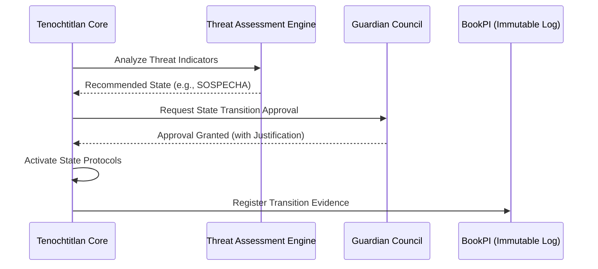
```mermaid
sequenceDiagram
    participant Sys as Tenochtitlan Core
    participant Threat as Threat Assessment Engine
    participant Guard as Guardian Council
    participant Ledger as BookPI (Immutable Log)

    Sys->>Threat: Analyze Threat Indicators
    Threat-->>Sys: Recommended State (e.g., SOSPECHA)
    Sys->>Guard: Request State Transition Approval
    Guard-->>Sys: Approval Granted (with Justification)
    Sys->>Sys: Activate State Protocols
    Sys->>Ledger: Register Transition Evidence
```
Sources: [cognition/services/tenochtitlan.md:144-180](https://github.com/OsoPanda1/ecosistema-nextgen-tamv/blob/7d85edce66bcb534ae1f4e98356f1cf1487b21cb/cognition/services/tenochtitlan.md#L144-L180), [infrastructure/security/tenochtitlan-config.json:20-45](https://github.com/OsoPanda1/ecosistema-nextgen-tamv/blob/7d85edce66bcb534ae1f4e98356f1cf1487b21cb/infrastructure/security/tenochtitlan-config.json#L20-L45)

## Specialized Detection Radars

The system employs three specialized radar systems to monitor different types of threats without infringing on user privacy or imposing mass surveillance.

### 🐍 Quetzalcoatl (Anti-Fraud)
Focuses on detecting money laundering, economic manipulation, and abuse patterns through multi-cell correlation and temporal signal analysis. Sources: [cognition/services/tenochtitlan.md:58-62](https://github.com/OsoPanda1/ecosistema-nextgen-tamv/blob/7d85edce66bcb534ae1f4e98356f1cf1487b21cb/cognition/services/tenochtitlan.md#L58-L62), [infrastructure/security/tenochtitlan-config.json:110-120](https://github.com/OsoPanda1/ecosistema-nextgen-tamv/blob/7d85edce66bcb534ae1f4e98356f1cf1487b21cb/infrastructure/security/tenochtitlan-config.json#L110-L120)

### 👁️ Eye of Ra (Content Integrity)
Monitors for verified illegal activities (abuse, exploitation, violence) but explicitly does not censor ideas or opinions. Action is only taken on verifiable illegality. Sources: [cognition/services/tenochtitlan.md:64-67](https://github.com/OsoPanda1/ecosistema-nextgen-tamv/blob/7d85edce66bcb534ae1f4e98356f1cf1487b21cb/cognition/services/tenochtitlan.md#L64-L67), [infrastructure/security/tenochtitlan-config.json:125-135](https://github.com/OsoPanda1/ecosistema-nextgen-tamv/blob/7d85edce66bcb534ae1f4e98356f1cf1487b21cb/infrastructure/security/tenochtitlan-config.json#L125-L135)

### 👥 MOS Twin Radars
A cross-validation system where **MOS-A** validates a threat while **MOS-B** questions the findings. If no consensus is reached, no automatic action is taken, and the incident is referred to human review. Sources: [cognition/services/tenochtitlan.md:69-72](https://github.com/OsoPanda1/ecosistema-nextgen-tamv/blob/7d85edce66bcb534ae1f4e98356f1cf1487b21cb/cognition/services/tenochtitlan.md#L69-L72), [infrastructure/security/tenochtitlan-config.json:138-148](https://github.com/OsoPanda1/ecosistema-nextgen-tamv/blob/7d85edce66bcb534ae1f4e98356f1cf1487b21cb/infrastructure/security/tenochtitlan-config.json#L138-L148)

## Antifragility and Metrics

A core metric of Tenochtitlan is the **IGA (Índice de Ganancia por Ataque / Attack Gain Index)**, which measures how much the system improves following an attack.

```python
# Conceptual logic for Antifragility calculation
def calculate_iga_score(improvement_metrics):
    """
    Calculates the Attack Gain Index
    IGA > 0.7 indicates effective antifragility
    """
    weights = {
        'detection_speed_improvement': 0.25,
        'response_effectiveness_improvement': 0.30,
        'false_positive_reduction': 0.20,
        'new_attack_patterns_learned': 0.15,
        'defense_mechanisms_enhanced': 0.10
    }
    # Logic processes metrics against these weights
    return weighted_score
```
Sources: [cognition/services/tenochtitlan.md:255-285](https://github.com/OsoPanda1/ecosistema-nextgen-tamv/blob/7d85edce66bcb534ae1f4e98356f1cf1487b21cb/cognition/services/tenochtitlan.md#L255-L285), [ARCHIVE/readme-files-consolidated-2026-02-02/README-GITHUB.md:120-130](https://github.com/OsoPanda1/ecosistema-nextgen-tamv/blob/7d85edce66bcb534ae1f4e98356f1cf1487b21cb/ARCHIVE/readme-files-consolidated-2026-02-02/README-GITHUB.md#L120-L130)

### Operational KPI Summary
| Metric | Target Value |
| :--- | :--- |
| Threat Detection Time | < 1 second |
| Response Time | < 5 seconds |
| False Positive Rate | < 0.1% |
| System Availability | 100% (Critical components) |
| Human Oversight | 100% of critical decisions |

Sources: [cognition/services/tenochtitlan.md:375-390](https://github.com/OsoPanda1/ecosistema-nextgen-tamv/blob/7d85edce66bcb534ae1f4e98356f1cf1487b21cb/cognition/services/tenochtitlan.md#L375-L390), [infrastructure/security/tenochtitlan-config.json:185-195](https://github.com/OsoPanda1/ecosistema-nextgen-tamv/blob/7d85edce66bcb534ae1f4e98356f1cf1487b21cb/infrastructure/security/tenochtitlan-config.json#L185-L195)

## Guardian Oversight

Security is not fully automated; it relies on four types of human guardians who hold final authority over the AI systems.

1.  **Technical Guardians**: Monitor system health and technical decisions.
2.  **Ethical Guardians**: Verify adherence to principles and ethical alignment.
3.  **Legal Guardians**: Ensure regulatory compliance and legal justification.
4.  **Economic Guardians**: Maintain financial integrity and prevent fraud.

A minimum consensus of 60% among the guardians is required for critical system actions. Sources: [cognition/services/tenochtitlan.md:74-85](https://github.com/OsoPanda1/ecosistema-nextgen-tamv/blob/7d85edce66bcb534ae1f4e98356f1cf1487b21cb/cognition/services/tenochtitlan.md#L74-L85), [infrastructure/security/tenochtitlan-config.json:150-170](https://github.com/OsoPanda1/ecosistema-nextgen-tamv/blob/7d85edce66bcb534ae1f4e98356f1cf1487b21cb/infrastructure/security/tenochtitlan-config.json#L150-L170)

## Summary
Tenochtitlan Security Core is the protective foundation of the TAMV ecosystem. By integrating multi-layered encryption (up to 22 layers), specialized radars, and a rigorous human guardianship model, it ensures a secure, sovereign digital territory. Its antifragile design ensures that every attempt to compromise the system results in a stronger, more resilient infrastructure. Sources: [TAMV-MASTER-DOCUMENTATION.md:290-310](https://github.com/OsoPanda1/ecosistema-nextgen-tamv/blob/7d85edce66bcb534ae1f4e98356f1cf1487b21cb/TAMV-MASTER-DOCUMENTATION.md#L290-L310), [cognition/services/tenochtitlan.md:460-475](https://github.com/OsoPanda1/ecosistema-nextgen-tamv/blob/7d85edce66bcb534ae1f4e98356f1cf1487b21cb/cognition/services/tenochtitlan.md#L460-L475)

### Anubis, Horus, & Specialized Radars

<details>
<summary>Relevant source files</summary>

The following files were used as context for generating this wiki page:

- [infrastructure/security/tenochtitlan-config.json](https://github.com/OsoPanda1/ecosistema-nextgen-tamv/blob/7d85edce66bcb534ae1f4e98356f1cf1487b21cb/infrastructure/security/tenochtitlan-config.json)
- [TAMV-MASTER-DOCUMENTATION.md](https://github.com/OsoPanda1/ecosistema-nextgen-tamv/blob/7d85edce66bcb534ae1f4e98356f1cf1487b21cb/TAMV-MASTER-DOCUMENTATION.md)
- [ARCHIVE/tamv-docs-consolidated-2026-02-02/TAMV-OFFICIAL-SYSTEM-DESCRIPTION.md](https://github.com/OsoPanda1/ecosistema-nextgen-tamv/blob/7d85edce66bcb534ae1f4e98356f1cf1487b21cb/ARCHIVE/tamv-docs-consolidated-2026-02-02/TAMV-OFFICIAL-SYSTEM-DESCRIPTION.md)
- [ARCHIVE/remaining-docs-consolidated-2026-02-13/REPORTE-AVANCE-TECNICO-COMPLETO.md](https://github.com/OsoPanda1/ecosistema-nextgen-tamv/blob/7d85edce66bcb534ae1f4e98356f1cf1487b21cb/ARCHIVE/remaining-docs-consolidated-2026-02-13/REPORTE-AVANCE-TECNICO-COMPLETO.md)
- [ARCHIVE/remaining-docs-consolidated-2026-02-13/IMPLEMENTATION-PROGRESS-REPORT.md](https://github.com/OsoPanda1/ecosistema-nextgen-tamv/blob/7d85edce66bcb534ae1f4e98356f1cf1487b21cb/ARCHIVE/remaining-docs-consolidated-2026-02-13/IMPLEMENTATION-PROGRESS-REPORT.md)
</details>

# Anubis, Horus, & Specialized Radars

## Introduction
The security framework of the **Territorio Autónomo de Memoria Viva (TAMV)** is governed by the **TENOCHTITLAN** system. It is designed as an antifragile, multi-layered defensive architecture that prioritizes digital sovereignty and ethical responsibility. The system is predicated on the philosophy that TAMV does not defend by attacking, but by being impossible to capture through redundant layers of encryption, human guardianship, and specialized monitoring subsystems.
Sources: [TAMV-MASTER-DOCUMENTATION.md:310-312](https://github.com/OsoPanda1/ecosistema-nextgen-tamv/blob/7d85edce66bcb534ae1f4e98356f1cf1487b21cb/TAMV-MASTER-DOCUMENTATION.md#L310-L312), [infrastructure/security/tenochtitlan-config.json:151-155](https://github.com/OsoPanda1/ecosistema-nextgen-tamv/blob/7d85edce66bcb534ae1f4e98356f1cf1487b21cb/infrastructure/security/tenochtitlan-config.json#L151-L155)

The core of this architecture consists of the **Anubis Centinel**, the **Horus Centinel**, and a suite of **Specialized Radars** (Quetzalcoatl, Eye of Ra, and Twin MOS). These components work in tandem with higher-order orchestration layers like **Dekateotl** and **Aztek Gods** to ensure system continuity, fraud prevention, and content integrity without resorting to mass surveillance or automatic offensive actions.
Sources: [infrastructure/security/tenochtitlan-config.json:44-111](https://github.com/OsoPanda1/ecosistema-nextgen-tamv/blob/7d85edce66bcb534ae1f4e98356f1cf1487b21cb/infrastructure/security/tenochtitlan-config.json#L44-L111), [TAMV-MASTER-DOCUMENTATION.md:316-325](https://github.com/OsoPanda1/ecosistema-nextgen-tamv/blob/7d85edce66bcb534ae1f4e98356f1cf1487b21cb/TAMV-MASTER-DOCUMENTATION.md#L316-L325)

## Core Defensive Centinels

The centinel system is organized into increasing layers of encryption and isolation to prevent single points of failure and system capture.

### Anubis Centinel
Anubis is the primary active security layer. It manages real-time traffic analysis and identity verification. Unlike traditional executive systems, its auto-escalation is disabled to ensure human oversight remains at the core of defensive responses.
Sources: [infrastructure/security/tenochtitlan-config.json:45-56](https://github.com/OsoPanda1/ecosistema-nextgen-tamv/blob/7d85edce66bcb534ae1f4e98356f1cf1487b21cb/infrastructure/security/tenochtitlan-config.json#L45-L56)

### Horus Centinel
Horus acts as the evolutionary standby. It features higher encryption and cognitive obfuscation layers. It is architecturally designed not to inherit the weaknesses of Anubis and requires explicit human approval for activation.
Sources: [infrastructure/security/tenochtitlan-config.json:58-66](https://github.com/OsoPanda1/ecosistema-nextgen-tamv/blob/7d85edce66bcb534ae1f4e98356f1cf1487b21cb/infrastructure/security/tenochtitlan-config.json#L58-L66)

### Security Centinel Hierarchy
This diagram illustrates the relationship and escalation path between the primary defensive centinels and the orchestration layers.

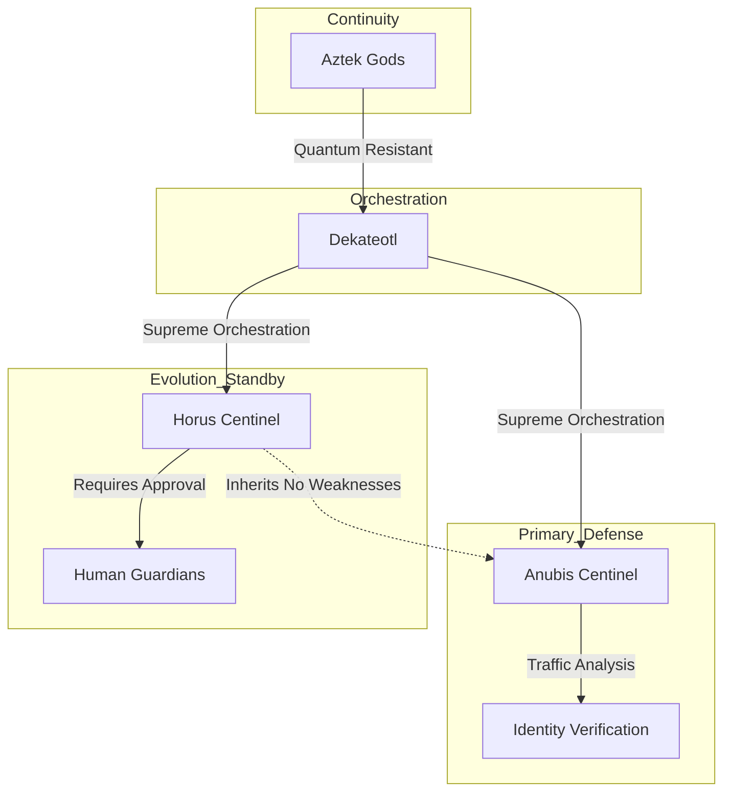
```mermaid
flowchart TD
    subgraph Primary_Defense
        A[Anubis Centinel] -->|Traffic Analysis| B[Identity Verification]
    end

    subgraph Evolution_Standby
        C[Horus Centinel] -.->|Inherits No Weaknesses| A
        C -->|Requires Approval| D[Human Guardians]
    end

    subgraph Orchestration
        E[Dekateotl] -->|Supreme Orchestration| A
        E -->|Supreme Orchestration| C
    end

    subgraph Continuity
        F[Aztek Gods] -->|Quantum Resistant| E
    end
```
Sources: [infrastructure/security/tenochtitlan-config.json:45-88](https://github.com/OsoPanda1/ecosistema-nextgen-tamv/blob/7d85edce66bcb534ae1f4e98356f1cf1487b21cb/infrastructure/security/tenochtitlan-config.json#L45-L88), [TAMV-MASTER-DOCUMENTATION.md:316-320](https://github.com/OsoPanda1/ecosistema-nextgen-tamv/blob/7d85edce66bcb534ae1f4e98356f1cf1487b21cb/TAMV-MASTER-DOCUMENTATION.md#L316-L320)

### Technical Specifications of Centinels
| Component | Role | Encryption Layers | Status |
| :--- | :--- | :---: | :--- |
| **Anubis Centinel** | Primary Active Security | 4 | ACTIVE |
| **Horus Centinel** | Evolutionary Standby | 6 | STANDBY |
| **Dekateotl** | Supreme Orchestration | 11 | ACTIVE |
| **Aztek Gods** | Continuity Standby | 22 | DEEP_STANDBY |
Sources: [infrastructure/security/tenochtitlan-config.json:45-88](https://github.com/OsoPanda1/ecosistema-nextgen-tamv/blob/7d85edce66bcb534ae1f4e98356f1cf1487b21cb/infrastructure/security/tenochtitlan-config.json#L45-L88)

## Specialized Radars

Specialized Radars are independent subsystems focused on specific threat vectors: economic fraud, illegal content, and validation consensus.

### Quetzalcoatl & Eye of Ra
**Quetzalcoatl** is dedicated to anti-economic fraud, utilizing multi-cell correlation and temporal pattern analysis to detect money laundering and manipulation. **Eye of Ra** monitors for verifiable illegal content (such as exploitation or violence) but is explicitly prohibited from censoring ideas or opinions.
Sources: [infrastructure/security/tenochtitlan-config.json:91-104](https://github.com/OsoPanda1/ecosistema-nextgen-tamv/blob/7d85edce66bcb534ae1f4e98356f1cf1487b21cb/infrastructure/security/tenochtitlan-config.json#L91-L104), [TAMV-MASTER-DOCUMENTATION.md:323-324](https://github.com/OsoPanda1/ecosistema-nextgen-tamv/blob/7d85edce66bcb534ae1f4e98356f1cf1487b21cb/TAMV-MASTER-DOCUMENTATION.md#L323-L324)

### Twin MOS Radars
The **MOS Twin Radars** implement a "Cross-validation" logic where two distinct modes operate simultaneously:
*   **MOS A (Validate):** Confirms the legitimacy of a signal.
*   **MOS B (Question):** Challenges the findings of MOS A.
A consensus between both is required for automated action; otherwise, the request is escalated to human review.
Sources: [TAMV-MASTER-DOCUMENTATION.md:325](https://github.com/OsoPanda1/ecosistema-nextgen-tamv/blob/7d85edce66bcb534ae1f4e98356f1cf1487b21cb/TAMV-MASTER-DOCUMENTATION.md#L325), [infrastructure/security/tenochtitlan-config.json:106-114](https://github.com/OsoPanda1/ecosistema-nextgen-tamv/blob/7d85edce66bcb534ae1f4e98356f1cf1487b21cb/infrastructure/security/tenochtitlan-config.json#L106-L114)

### Specialized Radar Workflow
The following sequence shows how a transaction or content signal is processed through the radar subsystems.

```mermaid
sequenceDiagram
    participant S as Signal/Transaction
    participant Q as Quetzalcoatl Radar
    participant ER as Eye of Ra Radar
    participant MOS as Twin MOS (A & B)
    participant H as Human Review Queue

    S->>Q: Scan for Economic Fraud
    S->>ER: Scan for Illegal Content
    
    rect rgb(200, 220, 255)
    Note over MOS: Consensus Check
    Q->>MOS: Report Findings
    ER->>MOS: Report Findings
    MOS->>MOS: MOS A Validates vs MOS B Questions
    end

    alt No Consensus
        MOS->>H: Escalate to Human Review
    else Consensus Reached
        MOS->>S: Apply Defensive Protocol
    end
```
Sources: [infrastructure/security/tenochtitlan-config.json:91-114](https://github.com/OsoPanda1/ecosistema-nextgen-tamv/blob/7d85edce66bcb534ae1f4e98356f1cf1487b21cb/infrastructure/security/tenochtitlan-config.json#L91-L114), [TAMV-MASTER-DOCUMENTATION.md:323-325](https://github.com/OsoPanda1/ecosistema-nextgen-tamv/blob/7d85edce66bcb534ae1f4e98356f1cf1487b21cb/TAMV-MASTER-DOCUMENTATION.md#L323-L325)

## Human Guardianship & Oversight

The TENOCHTITLAN system operates under a strict "Human Final Authority" principle. No AI or automated subsystem has the power to execute final binding decisions regarding user rights or system-wide punishments.
Sources: [infrastructure/security/tenochtitlan-config.json:116-136](https://github.com/OsoPanda1/ecosistema-nextgen-tamv/blob/7d85edce66bcb534ae1f4e98356f1cf1487b21cb/infrastructure/security/tenochtitlan-config.json#L116-L136), [TAMV-OFFICIAL-SYSTEM-DESCRIPTION.md:21-23](https://github.com/OsoPanda1/ecosistema-nextgen-tamv/blob/7d85edce66bcb534ae1f4e98356f1cf1487b21cb/TAMV-OFFICIAL-SYSTEM-DESCRIPTION.md#L21-L23)

### Guardian Categories
| Guardian Type | Responsibility | Count |
| :--- | :--- | :---: |
| **Technical** | System monitoring & technical integrity | 3 |
| **Ethical** | Principle verification & dignity checks | 3 |
| **Legal** | Compliance monitoring & regulatory alignment | 3 |
| **Economic** | Financial integrity & anti-fraud review | 3 |
Sources: [infrastructure/security/tenochtitlan-config.json:117-133](https://github.com/OsoPanda1/ecosistema-nextgen-tamv/blob/7d85edce66bcb534ae1f4e98356f1cf1487b21cb/infrastructure/security/tenochtitlan-config.json#L117-L133)

The system requires a **60% minimum consensus** among these guardians for major operational changes, ensuring that power remains distributed and auditable.
Sources: [infrastructure/security/tenochtitlan-config.json:134-136](https://github.com/OsoPanda1/ecosistema-nextgen-tamv/blob/7d85edce66bcb534ae1f4e98356f1cf1487b21cb/infrastructure/security/tenochtitlan-config.json#L134-L136)

## Honeypod Labyrinth

The TENOCHTITLAN architecture includes a "Honeypod Labyrinth" designed to isolate attackers in a simulated environment. This subsystem uses combinatorial and adaptive evolution to generate potentially infinite dynamic layers, ensuring that an attacker never interacts with the real production systems.
Sources: [infrastructure/security/tenochtitlan-config.json:138-146](https://github.com/OsoPanda1/ecosistema-nextgen-tamv/blob/7d85edce66bcb534ae1f4e98356f1cf1487b21cb/infrastructure/security/tenochtitlan-config.json#L138-L146)

## Operational Metrics

The performance of the security centinels and radars is measured against high-availability and rapid-detection targets.

*   **Detection Time:** < 1 second.
*   **Response Time:** < 5 seconds.
*   **False Positive Rate:** < 0.1%.
*   **Human Oversight Coverage:** 100%.
Sources: [infrastructure/security/tenochtitlan-config.json:148-155](https://github.com/OsoPanda1/ecosistema-nextgen-tamv/blob/7d85edce66bcb534ae1f4e98356f1cf1487b21cb/infrastructure/security/tenochtitlan-config.json#L148-L155)

## Conclusion
The Anubis, Horus, and Specialized Radar systems represent the technical implementation of TAMV's commitment to "Adaptive Adversarial Containment." By separating primary defense from evolutionary standby and employing specialized radars for distinct threat vectors—all governed by a mandatory multi-disciplinary human guardianship—the project creates a security environment that is resilient to capture while remaining strictly compliant with human rights and data sovereignty principles.
Sources: [TAMV-OFFICIAL-SYSTEM-DESCRIPTION.md:38-40](https://github.com/OsoPanda1/ecosistema-nextgen-tamv/blob/7d85edce66bcb534ae1f4e98356f1cf1487b21cb/TAMV-OFFICIAL-SYSTEM-DESCRIPTION.md#L38-L40), [infrastructure/security/tenochtitlan-config.json:173-176](https://github.com/OsoPanda1/ecosistema-nextgen-tamv/blob/7d85edce66bcb534ae1f4e98356f1cf1487b21cb/infrastructure/security/tenochtitlan-config.json#L173-L176)

### Auditing & Compliance Protocols

<details>
<summary>Relevant source files</summary>

The following files were used as context for generating this wiki page:

- [audits/security/stride-living-security-system-v2.1.md](https://github.com/OsoPanda1/ecosistema-nextgen-tamv/blob/7d85edce66bcb534ae1f4e98356f1cf1487b21cb/audits/security/stride-living-security-system-v2.1.md)
- [plans/auditoria-osopanda1-plan.md](https://github.com/OsoPanda1/ecosistema-nextgen-tamv/blob/7d85edce66bcb534ae1f4e98356f1cf1487b21cb/plans/auditoria-osopanda1-plan.md)
- [TAMV-MASTER-DOCUMENTATION.md](https://github.com/OsoPanda1/ecosistema-nextgen-tamv/blob/7d85edce66bcb534ae1f4e98356f1cf1487b21cb/TAMV-MASTER-DOCUMENTATION.md)
- [ARCHIVE/tamv-docs-consolidated-2026-02-02/TAMV-OFFICIAL-SYSTEM-DESCRIPTION.md](https://github.com/OsoPanda1/ecosistema-nextgen-tamv/blob/7d85edce66bcb534ae1f4e98356f1cf1487b21cb/ARCHIVE/tamv-docs-consolidated-2026-02-02/TAMV-OFFICIAL-SYSTEM-DESCRIPTION.md)
- [ARCHIVE/remaining-docs-consolidated-2026-02-13/TAMV-COMPLETE-IMPLEMENTATION-PLAN.md](https://github.com/OsoPanda1/ecosistema-nextgen-tamv/blob/7d85edce66bcb534ae1f4e98356f1cf1487b21cb/ARCHIVE/remaining-docs-consolidated-2026-02-13/TAMV-COMPLETE-IMPLEMENTATION-PLAN.md)
- [ARCHIVE/remaining-docs-consolidated-2026-02-13/REPORTE-AVANCE-TECNICO-COMPLETO.md](https://github.com/OsoPanda1/ecosistema-nextgen-tamv/blob/7d85edce66bcb534ae1f4e98356f1cf1487b21cb/ARCHIVE/remaining-docs-consolidated-2026-02-13/REPORTE-AVANCE-TECNICO-COMPLETO.md)
</details>

# Auditing & Compliance Protocols

Auditing and Compliance Protocols within the TAMV (Territorio Autónomo de Memoria Viva) ecosystem are designed to ensure digital autonomy through immutable registries and ethical algorithmic oversight. The system utilizes a distributed socio-technical infrastructure that integrates federated blockchain technology and ethical AI to maintain a transparent, auditable environment where user sovereignty is protected by cryptographic guarantees.

The primary objective of these protocols is to transition from traditional extractive platform models to a "Memory, Sovereignty, and Responsibility" (MSR) framework. This framework ensures that every action within the system—from financial transactions to AI-generated recommendations—is recorded in an immutable civilizational registry, providing verifiable evidence for technical and legal audits.
Sources: [TAMV-MASTER-DOCUMENTATION.md:12-25](https://github.com/OsoPanda1/ecosistema-nextgen-tamv/blob/7d85edce66bcb534ae1f4e98356f1cf1487b21cb/TAMV-MASTER-DOCUMENTATION.md#L12-L25), [TAMV-OFFICIAL-SYSTEM-DESCRIPTION.md:9-15](https://github.com/OsoPanda1/ecosistema-nextgen-tamv/blob/7d85edce66bcb534ae1f4e98356f1cf1487b21cb/TAMV-OFFICIAL-SYSTEM-DESCRIPTION.md#L9-L15)

## Immutable Registry and Blockchain Auditing

The core of TAMV's auditing capability lies in the **MSR (Memory, Sovereignty, Responsibility) Blockchain**. This federated chain serves as an immutable civilizational registry that preserves cultural, technical, and social knowledge.

### MSR Blockchain Architecture
The MSR chain provides the following auditing services:
*   **BookPI Registry**: An immutable ledger used for evidence and technical audit services.
*   **Evidence Collection**: Every execution within the kernel generates a cryptographic hash recorded in the BookPI to ensure traceability.
*   **Audit Endpoints**: Specific API paths such as `/registry`, `/contracts`, and `/audit` allow for the verification of system state and smart contract execution.

Sources: [TAMV-MASTER-DOCUMENTATION.md:38-40](https://github.com/OsoPanda1/ecosistema-nextgen-tamv/blob/7d85edce66bcb534ae1f4e98356f1cf1487b21cb/TAMV-MASTER-DOCUMENTATION.md#L38-L40), [TAMV-MASTER-DOCUMENTATION.md:118-125](https://github.com/OsoPanda1/ecosistema-nextgen-tamv/blob/7d85edce66bcb534ae1f4e98356f1cf1487b21cb/TAMV-MASTER-DOCUMENTATION.md#L118-L125), [REPORTE-AVANCE-TECNICO-COMPLETO.md:154-173](https://github.com/OsoPanda1/ecosistema-nextgen-tamv/blob/7d85edce66bcb534ae1f4e98356f1cf1487b21cb/REPORTE-AVANCE-TECNICO-COMPLETO.md#L154-L173)

### Audit Data Flow
The following diagram illustrates how an action is processed and audited within the TAMV Kernel:

```mermaid
sequenceDiagram
    participant User as Citizen ID-NVIDA
    participant Kernel as TAMV Kernel
    participant AI as Isabella AI (Ethics)
    participant Ledger as BookPI Registry
    
    User->>Kernel: Request Action (/v1/action)
    Kernel->>AI: Audit Intent (Ethics Check)
    AI-->>Kernel: Validation Result
    alt Action Approved
        Kernel->>Kernel: Execute Logic (TCEP)
        Kernel->>Ledger: Register Evidence (Crypto Hash)
        Ledger-->>Kernel: Evidence Confirmed
        Kernel-->>User: Response + Evidence Hash
    else Action Blocked
        Kernel-->>User: 403 Violation (DINN Block)
    end
```
This flow ensures that no execution occurs without a preceding ethical audit and a succeeding immutable registration.
Sources: [REPORTE-AVANCE-TECNICO-COMPLETO.md:154-173](https://github.com/OsoPanda1/ecosistema-nextgen-tamv/blob/7d85edce66bcb534ae1f4e98356f1cf1487b21cb/REPORTE-AVANCE-TECNICO-COMPLETO.md#L154-L173), [TAMV-OFFICIAL-SYSTEM-DESCRIPTION.md:83-88](https://github.com/OsoPanda1/ecosistema-nextgen-tamv/blob/7d85edce66bcb534ae1f4e98356f1cf1487b21cb/TAMV-OFFICIAL-SYSTEM-DESCRIPTION.md#L83-L88)

## Ethical AI Compliance (Isabella Framework)

The Isabella AI framework serves as a non-executive auditing layer that ensures algorithmic decisions are explainable and compliant with international regulations, specifically aligning with the **EU AI Act** for high-risk systems.

### Compliance Mechanisms
| Protocol Component | Description | Verification Method |
| :--- | :--- | :--- |
| **Non-Executive AI** | AI cannot execute binding actions without human validation. | Code-level mandatory human hooks. |
| **XAI (Explainability)** | AI must provide the rationale for every recommendation or block. | Multi-level explainability engine. |
| **DINN Compliance** | Audit of intentions against the dignity of the digital citizen. | Real-time intent filtering layer. |
| **Ethical Supervision** | A dedicated pipeline for monitoring AI decisions. | Periodic academic/legal reviews. |

Sources: [TAMV-OFFICIAL-SYSTEM-DESCRIPTION.md:21-31](https://github.com/OsoPanda1/ecosistema-nextgen-tamv/blob/7d85edce66bcb534ae1f4e98356f1cf1487b21cb/TAMV-OFFICIAL-SYSTEM-DESCRIPTION.md#L21-L31), [TAMV-MASTER-DOCUMENTATION.md:218-225](https://github.com/OsoPanda1/ecosistema-nextgen-tamv/blob/7d85edce66bcb534ae1f4e98356f1cf1487b21cb/TAMV-MASTER-DOCUMENTATION.md#L218-L225)

### AI Auditing Logic
Isabella AI monitors system interactions through a four-layer verification process:
1.  **Ethical Reasoning**: Evaluating actions against 8 fundamental principles.
2.  **Bias Detection**: Using fairness metrics to identify algorithmic prejudice.
3.  **Human Oversight**: Queueing critical or high-risk decisions for manual review.
4.  **Audit Logging**: Recording the "why" behind every AI-assisted interaction.

Sources: [TAMV-OFFICIAL-SYSTEM-DESCRIPTION.md:73-81](https://github.com/OsoPanda1/ecosistema-nextgen-tamv/blob/7d85edce66bcb534ae1f4e98356f1cf1487b21cb/TAMV-OFFICIAL-SYSTEM-DESCRIPTION.md#L73-L81), [TAMV-COMPLETE-IMPLEMENTATION-PLAN.md:22-28](https://github.com/OsoPanda1/ecosistema-nextgen-tamv/blob/7d85edce66bcb534ae1f4e98356f1cf1487b21cb/TAMV-COMPLETE-IMPLEMENTATION-PLAN.md#L22-L28)

## Security Auditing and Threat Modeling

TAMV employs the **TENOCHTITLAN** system, an adaptive adversarial containment environment designed to make the infrastructure "impossible to capture." Auditing in this context focuses on continuous identity trust and event fabrication.

### STRIDE-LSS v2.1
The system utilizes the **Living Security System (LSS)** based on the STRIDE model to normalize threat events:
*   **Continuous Identity Trust**: Confianza dynamics verified via Decentralized Identifiers (DID).
*   **Laberinto Cognitivo (Cognitive Labyrinth)**: A defensive audit mechanism that traps attackers in false, coherent ecosystems to study their behavior.
*   **Temporal Finality**: Audit events reach a "civilizational finality" where they become permanent historical records.

Sources: [audits/security/stride-living-security-system-v2.1.md](https://github.com/OsoPanda1/ecosistema-nextgen-tamv/blob/7d85edce66bcb534ae1f4e98356f1cf1487b21cb/audits/security/stride-living-security-system-v2.1.md), [TAMV-MASTER-DOCUMENTATION.md:275-285](https://github.com/OsoPanda1/ecosistema-nextgen-tamv/blob/7d85edce66bcb534ae1f4e98356f1cf1487b21cb/TAMV-MASTER-DOCUMENTATION.md#L275-L285)

### Security Architecture Layers
```mermaid
graph TD
    subgraph Orchestration
        D[DEKATEOTL] --> |Verification| C1[ANUBIS Sentinel]
        D --> |Verification| C2[HORUS Sentinel]
    end
    
    subgraph Auditing_Radars
        C1 --> Q[QUETZALCOATL: Fraud Radar]
        C2 --> E[EYE OF RA: Content Radar]
        Q --> TM[Twin MOS: Cross-Validation]
        E --> TM
    end
    
    TM --> B[BookPI Immutable Registry]
```
The **Twin MOS** protocol provides a critical auditing function where one agent validates an action while a second agent questions it, ensuring parallel and redundant supervision.
Sources: [TAMV-MASTER-DOCUMENTATION.md:288-298](https://github.com/OsoPanda1/ecosistema-nextgen-tamv/blob/7d85edce66bcb534ae1f4e98356f1cf1487b21cb/TAMV-MASTER-DOCUMENTATION.md#L288-L298), [TAMV-OFFICIAL-SYSTEM-DESCRIPTION.md:52-58](https://github.com/OsoPanda1/ecosistema-nextgen-tamv/blob/7d85edce66bcb534ae1f4e98356f1cf1487b21cb/TAMV-OFFICIAL-SYSTEM-DESCRIPTION.md#L52-L58)

## Regulatory Compliance Framework

Compliance is implemented "by code" directly into the platform to satisfy various international standards without requiring external backdoors.

### Compliance Standards
*   **GDPR & CCPA**: Privacy by design with sovereign data vaults where users maintain patient/user cryptographic control.
*   **HIPAA**: Native compliance for digital health services through secure telemedicine and sovereign medical records.
*   **SOC 2 & ISO 27001**: Continuous monitoring of security and availability.
*   **EU AI Act**: Strict adherence to transparency and human-in-the-loop requirements for AI.

Sources: [TAMV-MASTER-DOCUMENTATION.md:328-335](https://github.com/OsoPanda1/ecosistema-nextgen-tamv/blob/7d85edce66bcb534ae1f4e98356f1cf1487b21cb/TAMV-MASTER-DOCUMENTATION.md#L328-L335), [TAMV-OFFICIAL-SYSTEM-DESCRIPTION.md:112-118](https://github.com/OsoPanda1/ecosistema-nextgen-tamv/blob/7d85edce66bcb534ae1f4e98356f1cf1487b21cb/TAMV-OFFICIAL-SYSTEM-DESCRIPTION.md#L112-L118)

### Economic Compliance (TCEP)
The **TAMV Citizen Economy Protocol (TCEP)** enforces a "Quantum-Split" distribution through code, which is auditable via the blockchain:
*   **20% Fénix Protocol**: Community repair and social impact.
*   **30% Infrastructure**: Maintenance and operations.
*   **50% Net Profit**: Distribution to stakeholders.

The **Black Hole Protocol** serves as an anti-fraud audit mechanism to freeze funds, relabel transactions, and reassign value based on MSR evidence.
Sources: [TAMV-MASTER-DOCUMENTATION.md:195-200](https://github.com/OsoPanda1/ecosistema-nextgen-tamv/blob/7d85edce66bcb534ae1f4e98356f1cf1487b21cb/TAMV-MASTER-DOCUMENTATION.md#L195-L200), [TAMV-MASTER-DOCUMENTATION.md:210-215](https://github.com/OsoPanda1/ecosistema-nextgen-tamv/blob/7d85edce66bcb534ae1f4e98356f1cf1487b21cb/TAMV-MASTER-DOCUMENTATION.md#L210-L215), [REPORTE-AVANCE-TECNICO-COMPLETO.md:162-170](https://github.com/OsoPanda1/ecosistema-nextgen-tamv/blob/7d85edce66bcb534ae1f4e98356f1cf1487b21cb/REPORTE-AVANCE-TECNICO-COMPLETO.md#L162-L170)

## Audit Implementation Details

For developers and auditors, the system provides specific hooks and environment configurations to ensure the audit trail remains intact.

### Configuration for Auditing
```bash
# Audit Level Configuration
SOVEREIGNTY_LEVEL=STRICT
DINN_ENFORCEMENT=ENABLED
ROLLBACK_WINDOW=600s # 10-minute resilience for technical audit recovery
AIR_GAPPED_MODE=TRUE # Ensures zero external API leaks during sensitive audits
```
Sources: [TAMV-OFFICIAL-SYSTEM-DESCRIPTION.md:105-110](https://github.com/OsoPanda1/ecosistema-nextgen-tamv/blob/7d85edce66bcb534ae1f4e98356f1cf1487b21cb/TAMV-OFFICIAL-SYSTEM-DESCRIPTION.md#L105-L110), [REPORTE-AVANCE-TECNICO-COMPLETO.md:188-195](https://github.com/OsoPanda1/ecosistema-nextgen-tamv/blob/7d85edce66bcb534ae1f4e98356f1cf1487b21cb/REPORTE-AVANCE-TECNICO-COMPLETO.md#L188-L195)

### Verification Procedures
The following tasks are defined in the project audit plan to validate ecosystem integrity:
1.  **Massive Repository Audit**: Cloning and analyzing dependencies across federated repos.
2.  **Detection of Logical Dependencies**: Mapping technical imports and API links.
3.  **Global Audit Report**: Generating a consolidated `reporte_final_global.json` summarizing the state of all system anclas (links).

Sources: [plans/auditoria-osopanda1-plan.md:45-75](https://github.com/OsoPanda1/ecosistema-nextgen-tamv/blob/7d85edce66bcb534ae1f4e98356f1cf1487b21cb/plans/auditoria-osopanda1-plan.md#L45-L75)

## Conclusion
Auditing & Compliance Protocols in TAMV move beyond passive logging into active, cryptographic defense. By combining the MSR blockchain's immutability with Isabella's ethical AI oversight, the system provides a verifiable environment that respects digital sovereignty while meeting rigorous international regulatory standards. Every system action is audited for ethical intent, executed within a secure containment environment, and permanently recorded as civilizational evidence.


## AI Framework (Isabella)

### Isabella Cognitive Control Plane (CCP)

<details>
<summary>Relevant source files</summary>

The following files were used as context for generating this wiki page:

- [cognition/ISABELLA-CONSTITUTIONAL-PROMPT.md](https://github.com/OsoPanda1/ecosistema-nextgen-tamv/blob/7d85edce66bcb534ae1f4e98356f1cf1487b21cb/cognition/ISABELLA-CONSTITUTIONAL-PROMPT.md)
- [TAMV-MASTER-DOCUMENTATION.md](https://github.com/OsoPanda1/ecosistema-nextgen-tamv/blob/7d85edce66bcb534ae1f4e98356f1cf1487b21cb/TAMV-MASTER-DOCUMENTATION.md)
- [ARCHIVE/tamv-docs-consolidated-2026-02-02/TAMV-OFFICIAL-SYSTEM-DESCRIPTION.md](https://github.com/OsoPanda1/ecosistema-nextgen-tamv/blob/7d85edce66bcb534ae1f4e98356f1cf1487b21cb/ARCHIVE/tamv-docs-consolidated-2026-02-02/TAMV-OFFICIAL-SYSTEM-DESCRIPTION.md)
- [ARCHIVE/remaining-docs-consolidated-2026-02-13/REPORTE-AVANCE-TECNICO-COMPLETO.md](https://github.com/OsoPanda1/ecosistema-nextgen-tamv/blob/7d85edce66bcb534ae1f4e98356f1cf1487b21cb/ARCHIVE/remaining-docs-consolidated-2026-02-13/REPORTE-AVANCE-TECNICO-COMPLETO.md)
- [ARCHIVE/readme-files-consolidated-2026-02-02/TAMV-FINAL-PRODUCTION-READY-README.md](https://github.com/OsoPanda1/ecosistema-nextgen-tamv/blob/7d85edce66bcb534ae1f4e98356f1cf1487b21cb/ARCHIVE/readme-files-consolidated-2026-02-02/TAMV-FINAL-PRODUCTION-READY-README.md)
</details>

# Isabella Cognitive Control Plane (CCP)

The Isabella Cognitive Control Plane (CCP) serves as the primary intelligence layer and decision-making authority within the TAMV ecosystem. It is a non-executive, ethical AI framework designed to act as the system's memory, expertise, and governance watchdog. The CCP ensures that all algorithmic decisions are explainable, auditable, and strictly aligned with the TAMV Operational Manual and constitutional principles.

As a centralized cognitive layer, Isabella manages four core functional applications: an AI Study Helper, Pen2PDF handwriting recognition, a conversational Ethical Chat, and Spatial AI for 3D environment processing. The system architecture is built on a "Human-in-the-loop" principle, meaning the CCP provides recommendations and analysis but lacks the authority to execute final binding actions on critical human rights or assets without human validation.

Sources: [TAMV-MASTER-DOCUMENTATION.md:209-216](https://github.com/OsoPanda1/ecosistema-nextgen-tamv/blob/7d85edce66bcb534ae1f4e98356f1cf1487b21cb/TAMV-MASTER-DOCUMENTATION.md#L209-L216), [cognition/ISABELLA-CONSTITUTIONAL-PROMPT.md:3-8](https://github.com/OsoPanda1/ecosistema-nextgen-tamv/blob/7d85edce66bcb534ae1f4e98356f1cf1487b21cb/cognition/ISABELLA-CONSTITUTIONAL-PROMPT.md#L3-L8), [ARCHIVE/tamv-docs-consolidated-2026-02-02/TAMV-OFFICIAL-SYSTEM-DESCRIPTION.md:16-23](https://github.com/OsoPanda1/ecosistema-nextgen-tamv/blob/7d85edce66bcb534ae1f4e98356f1cf1487b21cb/ARCHIVE/tamv-docs-consolidated-2026-02-02/TAMV-OFFICIAL-SYSTEM-DESCRIPTION.md#L16-L23)

## Core Operational Principles

The CCP operates under a strict set of constitutional constraints and decision-making frameworks to maintain system integrity and user safety.

### Operational Constraints
The CCP is restricted from performing specific high-risk actions to prevent AI autonomy from superseding human oversight:
*   **No Visual Execution:** Cannot perform visual actions independently.
*   **No Direct User Interaction:** Restricted from making autonomous decisions during user interactions without audit trails.
*   **Subsystem Boundaries:** Must respect and operate within defined boundaries of other TAMV modules.
*   **Non-Sovereignty:** The AI is categorized as "Non-Sovereign," meaning it remains a tool under human guardianship.

Sources: [cognition/ISABELLA-CONSTITUTIONAL-PROMPT.md:14-20](https://github.com/OsoPanda1/ecosistema-nextgen-tamv/blob/7d85edce66bcb534ae1f4e98356f1cf1487b21cb/cognition/ISABELLA-CONSTITUTIONAL-PROMPT.md#L14-L20), [ARCHIVE/remaining-docs-consolidated-2026-02-13/REPORTE-AVANCE-TECNICO-COMPLETO.md:280-285](https://github.com/OsoPanda1/ecosistema-nextgen-tamv/blob/7d85edce66bcb534ae1f4e98356f1cf1487b21cb/ARCHIVE/remaining-docs-consolidated-2026-02-13/REPORTE-AVANCE-TECNICO-COMPLETO.md#L280-L285)

### Decision-Making Framework
Isabella utilizes a tiered decision-making structure based on the urgency and complexity of the required analysis:

| Level | Name | Response Time | Usage | Memory Type |
| :--- | :--- | :--- | :--- | :--- |
| **Level 1** | CCP-HOT | < 50ms | Safety-critical operations, immediate blocks | RAM-only cache |
| **Level 2** | CCP-COLD | Minutes to Hours | Pattern recognition, deep policy updates | Persistent storage |

Sources: [cognition/ISABELLA-CONSTITUTIONAL-PROMPT.md:23-33](https://github.com/OsoPanda1/ecosistema-nextgen-tamv/blob/7d85edce66bcb534ae1f4e98356f1cf1487b21cb/cognition/ISABELLA-CONSTITUTIONAL-PROMPT.md#L23-L33)

## Architecture and Technical Stack

The Isabella CCP is integrated into the "Cognitive-Algorithmic" layer (Layer 5) of the TAMV federated architecture. It leverages a specialized AI stack for deep learning and 3D processing.

```mermaid
flowchart TD
    Input[Input: Semantic Query / Infra Update] --> Auth[Isabella CCP Gateway]
    Auth --> EthicsCheck{Ethical Validation}
    EthicsCheck -- Failed --> Block[BLOCK Decision & Audit Log]
    EthicsCheck -- Passed --> Analyzer[Reasoning Engine]
    Analyzer --> Logic{Decision Criteria}
    Logic -- Safe --> Allow[ALLOW: Execution Recommendation]
    Logic -- Contextual Issues --> Redirect[REDIRECT: Educational Mitigation]
    Logic -- High Risk --> Block
    Allow --> Output[Output: JSON Recommendation]
    Redirect --> Output
    Output --> Audit[Audit Trail: Timestamp & Risk Assessment]
```
*The diagram shows the decision flow from input ingestion to the final audited recommendation.*

### Technical Stack
*   **Inference & Models:** PyTorch for training, ONNX Runtime for optimized inference.
*   **3D Processing:** MinkowskiEngine and ResUNet14 for semantic segmentation of 3D spaces.
*   **NLP:** Transformer-based models for conversational context and text analysis.
*   **Governance Integration:** TGN Governance and Isabella-Core integration for regulatory alignment.

Sources: [TAMV-MASTER-DOCUMENTATION.md:77-80](https://github.com/OsoPanda1/ecosistema-nextgen-tamv/blob/7d85edce66bcb534ae1f4e98356f1cf1487b21cb/TAMV-MASTER-DOCUMENTATION.md#L77-L80), [ARCHIVE/remaining-docs-consolidated-2026-02-13/REPORTE-AVANCE-TECNICO-COMPLETO.md:38-48](https://github.com/OsoPanda1/ecosistema-nextgen-tamv/blob/7d85edce66bcb534ae1f4e98356f1cf1487b21cb/ARCHIVE/remaining-docs-consolidated-2026-02-13/REPORTE-AVANCE-TECNICO-COMPLETO.md#L38-L48), [ARCHIVE/tamv-docs-consolidated-2026-02-02/TAMV-OFFICIAL-SYSTEM-DESCRIPTION.md:80-84](https://github.com/OsoPanda1/ecosistema-nextgen-tamv/blob/7d85edce66bcb534ae1f4e98356f1cf1487b21cb/ARCHIVE/tamv-docs-consolidated-2026-02-02/TAMV-OFFICIAL-SYSTEM-DESCRIPTION.md#L80-L84)

## Functional Applications

Isabella CCP provides four specific functional capabilities verified for production use within the ecosystem.

### 1. AI Study Helper
Automates the conversion of complex texts into personalized study questions using NLP and transformer models. It maintains a 90%+ accuracy rate on controlled datasets.
Sources: [TAMV-MASTER-DOCUMENTATION.md:218-226](https://github.com/OsoPanda1/ecosistema-nextgen-tamv/blob/7d85edce66bcb534ae1f4e98356f1cf1487b21cb/TAMV-MASTER-DOCUMENTATION.md#L218-L226), [ARCHIVE/tamv-docs-consolidated-2026-02-02/TAMV-OFFICIAL-SYSTEM-DESCRIPTION.md:27-30](https://github.com/OsoPanda1/ecosistema-nextgen-tamv/blob/7d85edce66bcb534ae1f4e98356f1cf1487b21cb/ARCHIVE/tamv-docs-consolidated-2026-02-02/TAMV-OFFICIAL-SYSTEM-DESCRIPTION.md#L27-L30)

### 2. Pen2PDF
A handwriting recognition system utilizing CNN+RNN architecture. It achieves 95%+ accuracy and is primarily used for digitizing handwritten notes and historical documents into the TAMV registry.
Sources: [TAMV-MASTER-DOCUMENTATION.md:238-245](https://github.com/OsoPanda1/ecosistema-nextgen-tamv/blob/7d85edce66bcb534ae1f4e98356f1cf1487b21cb/TAMV-MASTER-DOCUMENTATION.md#L238-L245), [ARCHIVE/tamv-docs-consolidated-2026-02-02/TAMV-OFFICIAL-SYSTEM-DESCRIPTION.md:32-35](https://github.com/OsoPanda1/ecosistema-nextgen-tamv/blob/7d85edce66bcb534ae1f4e98356f1cf1487b21cb/ARCHIVE/tamv-docs-consolidated-2026-02-02/TAMV-OFFICIAL-SYSTEM-DESCRIPTION.md#L32-L35)

### 3. Isabella Chat (Ethical AI)
A conversational interface that incorporates a "Dignity in Digital" (DINN) compliance layer. It validates every prompt against ethical principles before generating a response.
Sources: [TAMV-MASTER-DOCUMENTATION.md:261-271](https://github.com/OsoPanda1/ecosistema-nextgen-tamv/blob/7d85edce66bcb534ae1f4e98356f1cf1487b21cb/TAMV-MASTER-DOCUMENTATION.md#L261-L271), [ARCHIVE/remaining-docs-consolidated-2026-02-13/REPORTE-AVANCE-TECNICO-COMPLETO.md:288-295](https://github.com/OsoPanda1/ecosistema-nextgen-tamv/blob/7d85edce66bcb534ae1f4e98356f1cf1487b21cb/ARCHIVE/remaining-docs-consolidated-2026-02-13/REPORTE-AVANCE-TECNICO-COMPLETO.md#L288-L295)

### 4. Spatial AI
Processes 3D environments for the DreamSpaces engine. It performs semantic segmentation using trilateral CRF (Conditional Random Fields) to understand object relationships in photorealistic 3D scenes.
Sources: [TAMV-MASTER-DOCUMENTATION.md:286-292](https://github.com/OsoPanda1/ecosistema-nextgen-tamv/blob/7d85edce66bcb534ae1f4e98356f1cf1487b21cb/TAMV-MASTER-DOCUMENTATION.md#L286-L292), [ARCHIVE/tamv-docs-consolidated-2026-02-02/TAMV-OFFICIAL-SYSTEM-DESCRIPTION.md:37-40](https://github.com/OsoPanda1/ecosistema-nextgen-tamv/blob/7d85edce66bcb534ae1f4e98356f1cf1487b21cb/ARCHIVE/tamv-docs-consolidated-2026-02-02/TAMV-OFFICIAL-SYSTEM-DESCRIPTION.md#L37-L40)

## Input/Output Specifications

The CCP communicates with other TAMV systems using a standardized JSON-based protocol for auditability.

### Valid Input Types
*   **SemanticQuery:** Natural language or logical queries for data.
*   **InfraStateUpdate:** Real-time updates on system resource status.
*   **GuardianEvent:** Security or ethical alerts triggered by human or automated guardians.

### Output Structure
```json
{
  "recommendation": "ALLOW / REDIRECT / BLOCK",
  "confidence": 0.0-1.0,
  "riskLevel": "LOW / MEDIUM / HIGH",
  "explanationRef": "document-reference-string"
}
```
Sources: [cognition/ISABELLA-CONSTITUTIONAL-PROMPT.md:43-58](https://github.com/OsoPanda1/ecosistema-nextgen-tamv/blob/7d85edce66bcb534ae1f4e98356f1cf1487b21cb/cognition/ISABELLA-CONSTITUTIONAL-PROMPT.md#L43-L58)

## Ethical Governance and Security

The CCP is governed by the "Isabella Protocol," which ensures total explainability (XAI) for multiple audiences (technical, legal, and end-user).

```mermaid
sequenceDiagram
    participant U as User/System
    participant I as Isabella CCP
    participant G as Human Guardian
    participant B as BookPI Ledger
    U->>I: Request Action/Processing
    I->>I: Internal Ethical Audit
    Note right of I: Check against DINN Principles
    I-->>G: High Risk Notification (Optional)
    G-->>I: Human Validation/Override
    I->>B: Register Evidence Hash
    I-->>U: Return Audited Result
```
*This sequence illustrates the human-in-the-loop requirement for high-risk cognitive processing.*

### Safety Protocols
In the event of a security threat or system failure, Isabella activates emergency fail-safes:
1.  **Block suspicious actions:** Immediate isolation of affected subsystems.
2.  **State Preservation:** Freeze system memory to prevent data loss.
3.  **Degrade Visual Experience:** Reduce system load to prioritize core safety processing.
4.  **Guardian Notification:** Alert the four types of human guardians (Technical, Ethical, Legal, Economic).

Sources: [TAMV-MASTER-DOCUMENTATION.md:321-325](https://github.com/OsoPanda1/ecosistema-nextgen-tamv/blob/7d85edce66bcb534ae1f4e98356f1cf1487b21cb/TAMV-MASTER-DOCUMENTATION.md#L321-L325), [cognition/ISABELLA-CONSTITUTIONAL-PROMPT.md:83-93](https://github.com/OsoPanda1/ecosistema-nextgen-tamv/blob/7d85edce66bcb534ae1f4e98356f1cf1487b21cb/cognition/ISABELLA-CONSTITUTIONAL-PROMPT.md#L83-L93)

## Summary
The Isabella Cognitive Control Plane is the "moral compass" and "central brain" of TAMV. By strictly separating intelligence from execution and enforcing a human-in-the-loop governance model, it provides a scalable AI infrastructure that complies with the EU AI Act while maintaining high performance across educational, spatial, and conversational domains. Its primary value lies in its transparency, ensuring every machine decision is traceable to a constitutional principle and an immutable audit log.

### Isabella AI Capabilities

<details>
<summary>Relevant source files</summary>

The following files were used as context for generating this wiki page:

- [TAMV-MASTER-DOCUMENTATION.md](https://github.com/OsoPanda1/ecosistema-nextgen-tamv/blob/7d85edce66bcb534ae1f4e98356f1cf1487b21cb/TAMV-MASTER-DOCUMENTATION.md)
- [ARCHIVE/tamv-docs-consolidated-2026-02-02/TAMV-OFFICIAL-SYSTEM-DESCRIPTION.md](https://github.com/OsoPanda1/ecosistema-nextgen-tamv/blob/7d85edce66bcb534ae1f4e98356f1cf1487b21cb/ARCHIVE/tamv-docs-consolidated-2026-02-02/TAMV-OFFICIAL-SYSTEM-DESCRIPTION.md)
- [ARCHIVE/remaining-docs-consolidated-2026-02-13/REPORTE-AVANCE-TECNICO-COMPLETO.md](https://github.com/OsoPanda1/ecosistema-nextgen-tamv/blob/7d85edce66bcb534ae1f4e98356f1cf1487b21cb/ARCHIVE/remaining-docs-consolidated-2026-02-13/REPORTE-AVANCE-TECNICO-COMPLETO.md)
- [ARCHIVE/readme-files-consolidated-2026-02-02/TAMV-FINAL-PRODUCTION-READY-README.md](https://github.com/OsoPanda1/ecosistema-nextgen-tamv/blob/7d85edce66bcb534ae1f4e98356f1cf1487b21cb/ARCHIVE/readme-files-consolidated-2026-02-02/TAMV-FINAL-PRODUCTION-READY-README.md)
- [ARCHIVE/remaining-docs-consolidated-2026-02-13/TAMV-COMPLETE-IMPLEMENTATION-PLAN.md](https://github.com/OsoPanda1/ecosistema-nextgen-tamv/blob/7d85edce66bcb534ae1f4e98356f1cf1487b21cb/ARCHIVE/remaining-docs-consolidated-2026-02-13/TAMV-COMPLETE-IMPLEMENTATION-PLAN.md)
</details>

# Isabella AI Capabilities

Isabella AI is the core ethical artificial intelligence framework of the **Territorio Autónomo de Memoria Viva (TAMV)** ecosystem. It is designed as a non-executive system, meaning it functions as an explanation and recommendation engine that requires explicit human validation for critical actions. Isabella ensures that the technical infrastructure remains aligned with human dignity, transparency, and the [Ethical Framework](#ethical-governance-and-supervision).

The framework serves multiple roles across the TAMV ecosystem, ranging from personalized education through the UTAMV platform to spatial understanding within XR DreamSpaces. By utilizing explainable AI (XAI) and multi-layer supervision, Isabella provides a sovereign alternative to extractive digital platforms.
Sources: [TAMV-MASTER-DOCUMENTATION.md:213-219](https://github.com/OsoPanda1/ecosistema-nextgen-tamv/blob/7d85edce66bcb534ae1f4e98356f1cf1487b21cb/TAMV-MASTER-DOCUMENTATION.md#L213-L219), [TAMV-OFFICIAL-SYSTEM-DESCRIPTION.md:21-25](https://github.com/OsoPanda1/ecosistema-nextgen-tamv/blob/7d85edce66bcb534ae1f4e98356f1cf1487b21cb/TAMV-OFFICIAL-SYSTEM-DESCRIPTION.md#L21-L25)

---

## Core Functional Applications

Isabella AI is structured into four primary functional modules, each targeting a specific pillar of the TAMV socio-technical infrastructure.

### 1. AI Study Helper
The AI Study Helper is integrated with **UTAMV** (TAMV University). It uses Natural Language Processing (NLP) with transformer models to convert raw text into personalized assessments and study materials.
*   **Target Accuracy:** 90%+ on controlled datasets.
*   **Key Logic:** Preprocesses text to extract key concepts and generates difficulty-scaled questions.
Sources: [TAMV-MASTER-DOCUMENTATION.md:223-234](https://github.com/OsoPanda1/ecosistema-nextgen-tamv/blob/7d85edce66bcb534ae1f4e98356f1cf1487b21cb/TAMV-MASTER-DOCUMENTATION.md#L223-L234), [TAMV-OFFICIAL-SYSTEM-DESCRIPTION.md:32-35](https://github.com/OsoPanda1/ecosistema-nextgen-tamv/blob/7d85edce66bcb534ae1f4e98356f1cf1487b21cb/TAMV-OFFICIAL-SYSTEM-DESCRIPTION.md#L32-L35)

### 2. Pen2PDF
This module utilizes a CNN+RNN (Convolutional Neural Network + Recurrent Neural Network) architecture to recognize handwriting and convert it into digital text. 
*   **Target Accuracy:** 95%+ accuracy.
*   **Datasets:** Validated against ScanNet and SYNTHIA (3,099+ scenes).
*   **Use Cases:** Digitization of university notes and historical document conversion.
Sources: [TAMV-MASTER-DOCUMENTATION.md:243-255](https://github.com/OsoPanda1/ecosistema-nextgen-tamv/blob/7d85edce66bcb534ae1f4e98356f1cf1487b21cb/TAMV-MASTER-DOCUMENTATION.md#L243-L255), [TAMV-OFFICIAL-SYSTEM-DESCRIPTION.md:37-40](https://github.com/OsoPanda1/ecosistema-nextgen-tamv/blob/7d85edce66bcb534ae1f4e98356f1cf1487b21cb/TAMV-OFFICIAL-SYSTEM-DESCRIPTION.md#L37-L40)

### 3. Isabella Chat
The conversational interface of the framework. It operates under a strict ethical supervision pipeline where messages are validated for compliance before a response is generated.
*   **Architecture:** Explainable Language Models (LLMs) with an added "Explainability Layer" to provide context on why a specific response was given.
*   **Use Cases:** Technical support, personalized tutoring, and content moderation.
Sources: [TAMV-MASTER-DOCUMENTATION.md:264-279](https://github.com/OsoPanda1/ecosistema-nextgen-tamv/blob/7d85edce66bcb534ae1f4e98356f1cf1487b21cb/TAMV-MASTER-DOCUMENTATION.md#L264-L279)

### 4. Spatial AI
Designed to understand 3D environments for the **DreamSpaces** engine. It employs ResUNet14, MinkowskiEngine, and trilateral CRF for semantic segmentation of 3D spaces.
*   **Functionality:** Processes photorealistic scenes for intelligent navigation and object recognition.
*   **Status:** Functional with documented limitations.
Sources: [TAMV-MASTER-DOCUMENTATION.md:290-298](https://github.com/OsoPanda1/ecosistema-nextgen-tamv/blob/7d85edce66bcb534ae1f4e98356f1cf1487b21cb/TAMV-MASTER-DOCUMENTATION.md#L290-L298), [TAMV-OFFICIAL-SYSTEM-DESCRIPTION.md:42-45](https://github.com/OsoPanda1/ecosistema-nextgen-tamv/blob/7d85edce66bcb534ae1f4e98356f1cf1487b21cb/TAMV-OFFICIAL-SYSTEM-DESCRIPTION.md#L42-L45)

---

## Technical Architecture

Isabella's architecture is federated and designed for high-risk AI compliance, following the requirements of the EU AI Act.

### System Data Flow
The following diagram illustrates how Isabella processes a user request, emphasizing the mandatory ethical validation phase.

```mermaid
flowchart TD
    User[User Request] --> Auth[Identity Verification ID-NVIDA]
    Auth --> Ethics[Ethical Audit Isabella Core]
    Ethics -- Violation --> Block[Block Action & Log]
    Ethics -- Approved --> Kernel[Action Execution]
    Kernel --> Explain[XAI Explainability Layer]
    Explain --> Response[Final Response to User]
    Kernel --> BookPI[Immutable Registry BookPI]
```
The data flow ensures that every action is audited for ethical compliance before execution and recorded in the immutable BookPI registry.
Sources: [REPORTE-AVANCE-TECNICO-COMPLETO.md:144-165](https://github.com/OsoPanda1/ecosistema-nextgen-tamv/blob/7d85edce66bcb534ae1f4e98356f1cf1487b21cb/REPORTE-AVANCE-TECNICO-COMPLETO.md#L144-L165), [TAMV-OFFICIAL-SYSTEM-DESCRIPTION.md:27-30](https://github.com/OsoPanda1/ecosistema-nextgen-tamv/blob/7d85edce66bcb534ae1f4e98356f1cf1487b21cb/TAMV-OFFICIAL-SYSTEM-DESCRIPTION.md#L27-L30)

### Key Components Table

| Component | Technology | Role |
| :--- | :--- | :--- |
| **Isabella Core** | Python 3.9+, FastAPI | Main orchestration and API server |
| **Inference Engine** | ONNX Runtime | High-performance model execution |
| **Vector Memory** | pgvector (PostgreSQL) | Stores embeddings for RAG and context |
| **3D Processing** | MinkowskiEngine | Sparse 3D semantic segmentation |
| **Audit Layer** | TGN Governance | Human-in-the-loop validation |
Sources: [TAMV-MASTER-DOCUMENTATION.md:95-103](https://github.com/OsoPanda1/ecosistema-nextgen-tamv/blob/7d85edce66bcb534ae1f4e98356f1cf1487b21cb/TAMV-MASTER-DOCUMENTATION.md#L95-L103), [REPORTE-AVANCE-TECNICO-COMPLETO.md:21-35](https://github.com/OsoPanda1/ecosistema-nextgen-tamv/blob/7d85edce66bcb534ae1f4e98356f1cf1487b21cb/REPORTE-AVANCE-TECNICO-COMPLETO.md#L21-L35)

---

## Ethical Governance and Supervision

Isabella is strictly governed by the **DINN (Dignidad Digital)** principle. No AI system within TAMV executes final, binding actions on critical rights or assets without human oversight.

### Supervision Layers
Isabella's decisions are overseen by the **TENOCHTITLAN** security framework:
1.  **Twin MOS**: A cross-validation system where "Agent A" validates an action while "Agent B" questions it.
2.  **Human Guardianship**: Four types of human guardians (Technical, Ethical, Legal, Economic) hold final authority.
3.  **Explainability (XAI)**: Isabella must provide multiple versions of "why" a decision was made, tailored to different audiences.
Sources: [TAMV-MASTER-DOCUMENTATION.md:308-316](https://github.com/OsoPanda1/ecosistema-nextgen-tamv/blob/7d85edce66bcb534ae1f4e98356f1cf1487b21cb/TAMV-MASTER-DOCUMENTATION.md#L308-L316), [TAMV-FINAL-PRODUCTION-READY-README.md:91-96](https://github.com/OsoPanda1/ecosistema-nextgen-tamv/blob/7d85edce66bcb534ae1f4e98356f1cf1487b21cb/TAMV-FINAL-PRODUCTION-READY-README.md#L91-L96)

### API Implementation (Sovereign Interaction)
Isabella provides a standard API for interaction, often integrated through the `TAMVAI` server which provides OpenAI-compatible endpoints.

```javascript
class IsabellaChat {
    async processMessage(message, context, userProfile) {
        // 1. Validate ethical compliance
        const ethicalCheck = await this.validateEthicalCompliance(message);
        if (!ethicalCheck.approved) {
            return this.generateEthicalResponse(ethicalCheck.reason);
        }
        
        // 2. Generate response and add XAI layer
        const response = await this.generateContextualResponse(message, context, userProfile);
        return this.addExplanabilityLayer(response);
    }
}
```
Sources: [TAMV-MASTER-DOCUMENTATION.md:267-278](https://github.com/OsoPanda1/ecosistema-nextgen-tamv/blob/7d85edce66bcb534ae1f4e98356f1cf1487b21cb/TAMV-MASTER-DOCUMENTATION.md#L267-L278), [REPORTE-AVANCE-TECNICO-COMPLETO.md:35-50](https://github.com/OsoPanda1/ecosistema-nextgen-tamv/blob/7d85edce66bcb534ae1f4e98356f1cf1487b21cb/REPORTE-AVANCE-TECNICO-COMPLETO.md#L35-L50)

---

## Implementation Status and Metrics

Isabella is currently integrated into the `tamvai-api` server, supporting text completions and embeddings.

| Metric | Target | Status |
| :--- | :--- | :--- |
| **API Availability** | 99.99% | Verified |
| **Response Latency** | < 100ms (p95) | Verified |
| **Ethics Score** | > 90% | Verified |
| **Detection Time** | < 2 seconds | Measured in tests |
Sources: [TAMV-OFFICIAL-SYSTEM-DESCRIPTION.md:104-115](https://github.com/OsoPanda1/ecosistema-nextgen-tamv/blob/7d85edce66bcb534ae1f4e98356f1cf1487b21cb/TAMV-OFFICIAL-SYSTEM-DESCRIPTION.md#L104-L115), [TAMV-FINAL-PRODUCTION-READY-README.md:102-108](https://github.com/OsoPanda1/ecosistema-nextgen-tamv/blob/7d85edce66bcb534ae1f4e98356f1cf1487b21cb/TAMV-FINAL-PRODUCTION-READY-README.md#L102-L108)

---

## Conclusion

Isabella AI Capabilities represent a shift from traditional executive AI to an advisory, ethical framework. By combining high-performance technical components like **MinkowskiEngine** and **FastAPI** with a rigorous human-supervised audit layer, Isabella ensures that the TAMV ecosystem remains a sovereign and dignified space for its citizens. Its primary significance lies in its compliance with the EU AI Act and its role as the cognitive orchestrator of the MSR blockchain and XR DreamSpaces.
Sources: [TAMV-OFFICIAL-SYSTEM-DESCRIPTION.md:188-192](https://github.com/OsoPanda1/ecosistema-nextgen-tamv/blob/7d85edce66bcb534ae1f4e98356f1cf1487b21cb/TAMV-OFFICIAL-SYSTEM-DESCRIPTION.md#L188-L192), [REPORTE-AVANCE-TECNICO-COMPLETO.md:120-130](https://github.com/OsoPanda1/ecosistema-nextgen-tamv/blob/7d85edce66bcb534ae1f4e98356f1cf1487b21cb/REPORTE-AVANCE-TECNICO-COMPLETO.md#L120-L130)


## Economy & Governance

### TAMV Economic Constitution

<details>
<summary>Relevant source files</summary>

The following files were used as context for generating this wiki page:

- [economy/constitucion-economica-v1.0.md](https://github.com/OsoPanda1/ecosistema-nextgen-tamv/blob/7d85edce66bcb534ae1f4e98356f1cf1487b21cb/economy/constitucion-economica-v1.0.md)
- [TAMV-MASTER-DOCUMENTATION.md](https://github.com/OsoPanda1/ecosistema-nextgen-tamv/blob/7d85edce66bcb534ae1f4e98356f1cf1487b21cb/TAMV-MASTER-DOCUMENTATION.md)
- [economy/autorizacion-4-capas/README.md](https://github.com/OsoPanda1/ecosistema-nextgen-tamv/blob/7d85edce66bcb534ae1f4e98356f1cf1487b21cb/economy/autorizacion-4-capas/README.md)
- [kernel/constitution/estatutos-sociales-tamv-holdings.md](https://github.com/OsoPanda1/ecosistema-nextgen-tamv/blob/7d85edce66bcb534ae1f4e98356f1cf1487b21cb/kernel/constitution/estatutos-sociales-tamv-holdings.md)
- [ARCHIVE/tamv-docs-consolidated-2026-02-02/TAMV-OFFICIAL-SYSTEM-DESCRIPTION.md](https://github.com/OsoPanda1/ecosistema-nextgen-tamv/blob/7d85edce66bcb534ae1f4e98356f1cf1487b21cb/ARCHIVE/tamv-docs-consolidated-2026-02-02/TAMV-OFFICIAL-SYSTEM-DESCRIPTION.md)
</details>

# TAMV Economic Constitution

The **TAMV Economic Constitution** is a binding, executable, and auditable framework that establishes the principles, limits, and mechanisms for the creation, distribution, and regulation of economic value within the Territorio Autónomo de Memoria Viva (TAMV) ecosystem. It is designed to prevent power concentration and extractive dynamics while ensuring financial sustainability and social impact.

Sources: [economy/constitucion-economica-v1.0.md:1-12](https://github.com/OsoPanda1/ecosistema-nextgen-tamv/blob/7d85edce66bcb534ae1f4e98356f1cf1487b21cb/economy/constitucion-economica-v1.0.md#L1-L12), [TAMV-MASTER-DOCUMENTATION.md:126-130](https://github.com/OsoPanda1/ecosistema-nextgen-tamv/blob/7d85edce66bcb534ae1f4e98356f1cf1487b21cb/TAMV-MASTER-DOCUMENTATION.md#L126-L130)

The economic model is built on the "Quantum-Split" distribution system and a multi-layered authorization process for any economic activity. It prioritizes human dignity over market functions, ensuring that monetization does not violate identity or memory.

Sources: [economy/constitucion-economica-v1.0.md:20-22](https://github.com/OsoPanda1/ecosistema-nextgen-tamv/blob/7d85edce66bcb534ae1f4e98356f1cf1487b21cb/economy/constitucion-economica-v1.0.md#L20-L22), [TAMV-MASTER-DOCUMENTATION.md:144-148](https://github.com/OsoPanda1/ecosistema-nextgen-tamv/blob/7d85edce66bcb534ae1f4e98356f1cf1487b21cb/TAMV-MASTER-DOCUMENTATION.md#L144-L148)

## Core Economic Principles

The TAMV economy operates under a set of non-negotiable axioms intended to protect the sovereignty of its participants and the integrity of the system.

*   **Human-Centricity**: The economy serves the human, not the other way around.
*   **Anti-Concentration**: Structural concentration of power or wealth is prohibited.
*   **Auditability**: All value must be traceable and justifiable.
*   **Right of Exit**: The right to a verified economic exit is inalienable for all users.
*   **Dignity Preservation**: No monetization form can violate dignity, identity, or memory.

Sources: [economy/constitucion-economica-v1.0.md:20-27](https://github.com/OsoPanda1/ecosistema-nextgen-tamv/blob/7d85edce66bcb534ae1f4e98356f1cf1487b21cb/economy/constitucion-economica-v1.0.md#L20-L27), [kernel/constitution/estatutos-sociales-tamv-holdings.md:23-27](https://github.com/OsoPanda1/ecosistema-nextgen-tamv/blob/7d85edce66bcb534ae1f4e98356f1cf1487b21cb/kernel/constitution/estatutos-sociales-tamv-holdings.md#L23-L27)

## The 4-Layer Authorization Process

Every economic initiative, project, or product requesting TAMV infrastructure or visibility must pass through a mandatory four-layer verification process. Failure at any layer automatically halts the process.

### Authorization Workflow

The following diagram illustrates the sequential nature of the economic authorization process:

```mermaid
graph TD
    Start[Economic Proposal] --> L1[Layer 1: Population Approval]
    L1 -- Approved --> L2[Layer 2: Ethical Recommendation]
    L1 -- Rejected --> End[Process Halted]
    L2 -- Positive --> L3[Layer 3: Investor Council]
    L2 -- Negative --> End
    L3 -- Viable --> L4[Layer 4: Executive Legal]
    L3 -- Risky --> End
    L4 -- Signed --> Active[Project Activated]
    L4 -- Denied --> End
```
A visual representation of the sequential layers required for project activation.
Sources: [economy/autorizacion-4-capas/README.md:10-25](https://github.com/OsoPanda1/ecosistema-nextgen-tamv/blob/7d85edce66bcb534ae1f4e98356f1cf1487b21cb/economy/autorizacion-4-capas/README.md#L10-L25), [economy/constitucion-economica-v1.0.md:61-90](https://github.com/OsoPanda1/ecosistema-nextgen-tamv/blob/7d85edce66bcb534ae1f4e98356f1cf1487b21cb/economy/constitucion-economica-v1.0.md#L61-L90)

### Detailed Layer Requirements

| Layer | Responsibility | Criteria |
| :--- | :--- | :--- |
| **1. Population Approval** | TAMV Citizens | Verifiable vote; minimum 15% participation and 66% consensus. |
| **2. Ethical Recommendation** | Isabella AI | Analysis of risks/benefits; impact on human, social, and cultural welfare. |
| **3. Investor Council** | Council of Entrepreneurs | Financial viability; reputational risk; sustainability alignment. |
| **4. Executive Legal** | CEO Founder | Verification of previous layers; contractual terms; signature. |

Sources: [economy/constitucion-economica-v1.0.md:65-90](https://github.com/OsoPanda1/ecosistema-nextgen-tamv/blob/7d85edce66bcb534ae1f4e98356f1cf1487b21cb/economy/constitucion-economica-v1.0.md#L65-L90), [economy/autorizacion-4-capas/README.md:38-60](https://github.com/OsoPanda1/ecosistema-nextgen-tamv/blob/7d85edce66bcb534ae1f4e98356f1cf1487b21cb/economy/autorizacion-4-capas/README.md#L38-L60)

## Economic Distribution (Quantum-Split)

TAMV utilizes a "FairSplit" mechanism to distribute revenue. Unlike traditional platforms that extract high percentages from creators, TAMV limits its own appropriation to infrastructure maintenance.

```mermaid
pie title Quantum-Split Distribution
    "Net Profit (Stakeholders)" : 50
    "Infrastructure (Operations)" : 30
    "Fénix Protocol (Social Impact)" : 20
```
Revenue distribution model ensuring community and infrastructure support.
Sources: [TAMV-MASTER-DOCUMENTATION.md:144-148](https://github.com/OsoPanda1/ecosistema-nextgen-tamv/blob/7d85edce66bcb534ae1f4e98356f1cf1487b21cb/TAMV-MASTER-DOCUMENTATION.md#L144-L148), [ARCHIVE/tamv-docs-consolidated-2026-02-02/TAMV-OFFICIAL-SYSTEM-DESCRIPTION.md:71-73](https://github.com/OsoPanda1/ecosistema-nextgen-tamv/blob/7d85edce66bcb534ae1f4e98356f1cf1487b21cb/ARCHIVE/tamv-docs-consolidated-2026-02-02/TAMV-OFFICIAL-SYSTEM-DESCRIPTION.md#L71-L73)

The **Fénix Protocol** specifically funds community repair, scholarships, and social impact projects, while the platform ensures a minimum guaranteed percentage to creators (typically 70% or more depending on the service).

Sources: [TAMV-MASTER-DOCUMENTATION.md:145-147](https://github.com/OsoPanda1/ecosistema-nextgen-tamv/blob/7d85edce66bcb534ae1f4e98356f1cf1487b21cb/TAMV-MASTER-DOCUMENTATION.md#L145-L147), [economy/constitucion-economica-v1.0.md:94-98](https://github.com/OsoPanda1/ecosistema-nextgen-tamv/blob/7d85edce66bcb534ae1f4e98356f1cf1487b21cb/economy/constitucion-economica-v1.0.md#L94-L98)

## Revenue Streams and Monetization

The constitution enables over 30 authorized forms of monetization categorized to prevent extractive behavior.

### Authorized Categories
*   **Content & Creation**: Direct sales, subscriptions, and automatic royalties.
*   **Socio-Economics**: Verifiable donations and local digital economies.
*   **Institutional**: Enterprise licenses and governmental integrations.
*   **Ethical Finance**: Programmed income sharing and intelligent escrows.

Sources: [economy/constitucion-economica-v1.0.md:33-56](https://github.com/OsoPanda1/ecosistema-nextgen-tamv/blob/7d85edce66bcb534ae1f4e98356f1cf1487b21cb/economy/constitucion-economica-v1.0.md#L33-L56)

### Marketplace Commission Structure

| Category | TAMV Commission | Competitor Rate (Approx.) |
| :--- | :--- | :--- |
| **3D/XR/NFT Market** | 10-20% | 15-30% |
| **Creator Economy** | 15-25% | 30% (e.g., OnlyFans) |
| **UTAMV Courses** | 25% | Variable |

Sources: [TAMV-MASTER-DOCUMENTATION.md:154-158](https://github.com/OsoPanda1/ecosistema-nextgen-tamv/blob/7d85edce66bcb534ae1f4e98356f1cf1487b21cb/TAMV-MASTER-DOCUMENTATION.md#L154-L158)

## Protection Mechanisms and Prohibitions

The Constitution mandates an "Ethical Kill-Switch" and specific prohibitions to prevent system abuse.

### Absolute Prohibitions
1.  Sale of personal data.
2.  Monetization of emotional manipulation.
3.  Speculation without purpose.
4.  Pyramid models and opaque monetization.

Sources: [economy/constitucion-economica-v1.0.md:102-110](https://github.com/OsoPanda1/ecosistema-nextgen-tamv/blob/7d85edce66bcb534ae1f4e98356f1cf1487b21cb/economy/constitucion-economica-v1.0.md#L102-L110)

### Security Protocols
*   **Black Hole Protocol**: Manages fraud or collapse by freezing funds and relabeling transactions.
*   **Initiation Protocols**: Mandatory KYC/KYB (Know Your Customer/Business) before any monetization is enabled.
*   **Partial Freezing**: The system can suspend economic classes or modules but can **never** freeze identity, memory, or the right of exit.

Sources: [TAMV-MASTER-DOCUMENTATION.md:175-184](https://github.com/OsoPanda1/ecosistema-nextgen-tamv/blob/7d85edce66bcb534ae1f4e98356f1cf1487b21cb/TAMV-MASTER-DOCUMENTATION.md#L175-L184), [economy/constitucion-economica-v1.0.md:114-121](https://github.com/OsoPanda1/ecosistema-nextgen-tamv/blob/7d85edce66bcb534ae1f4e98356f1cf1487b21cb/economy/constitucion-economica-v1.0.md#L114-L121)

## Technical Implementation (Kernel L1-L3)

The economic logic is embedded in the system's core through the **TCEP Engine** (TAMV Transaction & Economic Protocol).

```typescript
// Example of the Economic Execution within the Kernel
const result = await TCEP_Engine.execute(req.body.action);

// Recording the transaction in the immutable ledger
const evidence = await BookPI.record({
  cid: citizen.id,
  hash: result.cryptoHash,
  impact: result.impactMetrics
});
```
Sources: [ARCHIVE/remaining-docs-consolidated-2026-02-13/REPORTE-AVANCE-TECNICO-COMPLETO.md:335-345](https://github.com/OsoPanda1/ecosistema-nextgen-tamv/blob/7d85edce66bcb534ae1f4e98356f1cf1487b21cb/ARCHIVE/remaining-docs-consolidated-2026-02-13/REPORTE-AVANCE-TECNICO-COMPLETO.md#L335-L345)

This TCEP engine enforces the 75/25 or 70/30 split rules directly at the code level, ensuring that the platform cannot unilaterally change distribution rates without constitutional amendment.

Sources: [ARCHIVE/remaining-docs-consolidated-2026-02-13/REPORTE-AVANCE-TECNICO-COMPLETO.md:235-238](https://github.com/OsoPanda1/ecosistema-nextgen-tamv/blob/7d85edce66bcb534ae1f4e98356f1cf1487b21cb/ARCHIVE/remaining-docs-consolidated-2026-02-13/REPORTE-AVANCE-TECNICO-COMPLETO.md#L235-L238)

## Summary

The TAMV Economic Constitution serves as the foundation for a non-extractive digital civilization. By combining a multi-layer authorization process with algorithmic enforcement of revenue splits and a strict ethical framework, it ensures that technology serves human dignity while maintaining the financial health of the decentralized ecosystem.

Sources: [economy/constitucion-economica-v1.0.md:145-148](https://github.com/OsoPanda1/ecosistema-nextgen-tamv/blob/7d85edce66bcb534ae1f4e98356f1cf1487b21cb/economy/constitucion-economica-v1.0.md#L145-L148), [TAMV-MASTER-DOCUMENTATION.md:435-440](https://github.com/OsoPanda1/ecosistema-nextgen-tamv/blob/7d85edce66bcb534ae1f4e98356f1cf1487b21cb/TAMV-MASTER-DOCUMENTATION.md#L435-L440)

### Decentralized Governance & Dekateotl DAO

<details>
<summary>Relevant source files</summary>

The following files were used as context for generating this wiki page:

- [TAMV-MASTER-DOCUMENTATION.md](https://github.com/OsoPanda1/ecosistema-nextgen-tamv/blob/7d85edce66bcb534ae1f4e98356f1cf1487b21cb/TAMV-MASTER-DOCUMENTATION.md)
- [ARCHIVE/tamv-docs-consolidated-2026-02-02/TAMV-OFFICIAL-SYSTEM-DESCRIPTION.md](https://github.com/OsoPanda1/ecosistema-nextgen-tamv/blob/7d85edce66bcb534ae1f4e98356f1cf1487b21cb/ARCHIVE/tamv-docs-consolidated-2026-02-02/TAMV-OFFICIAL-SYSTEM-DESCRIPTION.md)
- [protocols/apis/tamv-core-api-spec.md](https://github.com/OsoPanda1/ecosistema-nextgen-tamv/blob/7d85edce66bcb534ae1f4e98356f1cf1487b21cb/protocols/apis/tamv-core-api-spec.md)
- [economy/autorizacion-4-capas/README.md](https://github.com/OsoPanda1/ecosistema-nextgen-tamv/blob/7d85edce66bcb534ae1f4e98356f1cf1487b21cb/economy/autorizacion-4-capas/README.md)
- [cognition/ISABELLA-CONSTITUTIONAL-PROMPT.md](https://github.com/OsoPanda1/ecosistema-nextgen-tamv/blob/7d85edce66bcb534ae1f4e98356f1cf1487b21cb/cognition/ISABELLA-CONSTITUTIONAL-PROMPT.md)
- [ARCHIVE/remaining-docs-consolidated-2026-02-13/TAMV-COMPLETE-IMPLEMENTATION-PLAN.md](https://github.com/OsoPanda1/ecosistema-nextgen-tamv/blob/7d85edce66bcb534ae1f4e98356f1cf1487b21cb/ARCHIVE/remaining-docs-consolidated-2026-02-13/TAMV-COMPLETE-IMPLEMENTATION-PLAN.md)
</details>

# Decentralized Governance & Dekateotl DAO

The **Decentralized Governance** system within TAMV (Territorio Autónomo de Memoria Viva) is structured as the **Dekateotl DAO**, a supreme orchestration layer that manages system-wide authority and decision-making through cryptographic constraints and algorithmic transparency. It operates under the principle of "Functional Sovereignty," where users maintain absolute control over their data and economic decisions via a federated architecture that minimizes centralized dependencies.

Dekateotl DAO acts as the 11-layer verification core of the TENOCHTITLAN security framework, ensuring that algorithmic decisions are auditable and that critical actions remain subject to human oversight. The system integrates multiple stakeholders—including citizens, creators, and institutions—into a multisided marketplace where value is redistributed according to transparent, pre-defined protocols.

Sources: [TAMV-MASTER-DOCUMENTATION.md:16-36](https://github.com/OsoPanda1/ecosistema-nextgen-tamv/blob/7d85edce66bcb534ae1f4e98356f1cf1487b21cb/TAMV-MASTER-DOCUMENTATION.md#L16-L36), [TAMV-MASTER-DOCUMENTATION.md:342-345](https://github.com/OsoPanda1/ecosistema-nextgen-tamv/blob/7d85edce66bcb534ae1f4e98356f1cf1487b21cb/TAMV-MASTER-DOCUMENTATION.md#L342-L345), [ARCHIVE/tamv-docs-consolidated-2026-02-02/TAMV-OFFICIAL-SYSTEM-DESCRIPTION.md:65-72](https://github.com/OsoPanda1/ecosistema-nextgen-tamv/blob/7d85edce66bcb534ae1f4e98356f1cf1487b21cb/ARCHIVE/tamv-docs-consolidated-2026-02-02/TAMV-OFFICIAL-SYSTEM-DESCRIPTION.md#L65-L72)

## Governance Architecture & Principles

The governance model utilizes a hybrid approach described as **Algorithmic Governance with Human Override**. This ensures that while most processes are automated via smart contracts for efficiency and transparency, critical decisions regarding assets, rights, or irreversible actions require explicit human validation.

### Core Governance Components
- **Direct Participation**: Maximized through cryptographic constraints that allow citizens to vote on proposals.
- **Separation of Roles**: The creator acts in a custodial and transitional role, while operational control is distributed among verified participants.
- **Transparency**: All decisions are anchored in the blockchain (MSR Chain) and are cryptographically auditable.

Sources: [ARCHIVE/tamv-docs-consolidated-2026-02-02/TAMV-OFFICIAL-SYSTEM-DESCRIPTION.md:65-85](https://github.com/OsoPanda1/ecosistema-nextgen-tamv/blob/7d85edce66bcb534ae1f4e98356f1cf1487b21cb/ARCHIVE/tamv-docs-consolidated-2026-02-02/TAMV-OFFICIAL-SYSTEM-DESCRIPTION.md#L65-L85)

### Governance Layers
Governance is represented in the TAMV Technical Architecture across several of the seven federated layers:
*   **Layer 3 (Political-Jurisdictional)**: Exercise of power and control within the ecosystem.
*   **Layer 2 (Constitutional)**: Definition of rights, duties, and sovereignty.
*   **Layer 1 (Ontological)**: Definition of what exists and what is prohibited within the system.

Sources: [TAMV-MASTER-DOCUMENTATION.md:46-65](https://github.com/OsoPanda1/ecosistema-nextgen-tamv/blob/7d85edce66bcb534ae1f4e98356f1cf1487b21cb/TAMV-MASTER-DOCUMENTATION.md#L46-L65)

## Dekateotl DAO Orchestration

Dekateotl is defined as the **Supreme Orchestration** layer within the TENOCHTITLAN security system. It sits above other sentinel systems to provide 11 verification layers for system continuity and integrity.

```mermaid
flowchart TD
    subgraph Security_Hierarchy
    D[Dekateotl DAO - Supreme Orchestration]
    H[Horus Centinel - Evolutionary Standby]
    A[Anubis Centinel - Primary System]
    end

    D -->|Verifies| H
    H -->|Supports| A
    A -->|Reports To| D
    
    subgraph Verification_Layers
    L11[Layer 11: Final Consensus]
    L1[Layer 1: Initial Hash]
    end
    
    D --- L11
    D --- L1
```
The diagram shows the hierarchy of the TENOCHTITLAN security system, with Dekateotl as the supreme orchestrator overseeing primary and standby sentinel systems.

Sources: [TAMV-MASTER-DOCUMENTATION.md:342-348](https://github.com/OsoPanda1/ecosistema-nextgen-tamv/blob/7d85edce66bcb534ae1f4e98356f1cf1487b21cb/TAMV-MASTER-DOCUMENTATION.md#L342-L348), [ARCHIVE/remaining-docs-consolidated-2026-02-13/README-GITHUB.md:58-62](https://github.com/OsoPanda1/ecosistema-nextgen-tamv/blob/7d85edce66bcb534ae1f4e98356f1cf1487b21cb/ARCHIVE/remaining-docs-consolidated-2026-02-13/README-GITHUB.md#L58-L62)

## Economic Authorization Process (4 Layers)

Governance is strictly applied to economic initiatives through a mandatory four-layer authorization process. No project or product receives TAMV infrastructure or support without passing these stages.

| Layer | Responsibility | Key Metric/Requirement |
| :--- | :--- | :--- |
| **Capa 1: Population** | Citizen Voting | 15% participation; 66% approval. |
| **Capa 2: Ethics** | Isabella AI | Analysis of human, social, and cultural impact. |
| **Capa 3: Investors** | Investment Council | Financial viability and social ROI. |
| **Capa 4: Executive** | CEO Founder | Final legal authorization and contract signing. |

Sources: [economy/autorizacion-4-capas/README.md:5-45](https://github.com/OsoPanda1/ecosistema-nextgen-tamv/blob/7d85edce66bcb534ae1f4e98356f1cf1487b21cb/economy/autorizacion-4-capas/README.md#L5-L45)

### Decision Flow for Economic Proposals
```mermaid
flowchart TD
    Start[Economic Proposal] --> L1{Citizen Vote}
    L1 -- Approved --> L2{Ethical Review}
    L1 -- Rejected --> End[Rejected]
    L2 -- Positive --> L3{Financial Review}
    L2 -- Negative --> End
    L3 -- Viable --> L4{Final Signing}
    L3 -- Non-Viable --> End
    L4 --> Active[Project Active]
```
This flowchart represents the sequential path an economic initiative must follow, highlighting that any layer has the power of veto.

Sources: [economy/autorizacion-4-capas/README.md:12-25](https://github.com/OsoPanda1/ecosistema-nextgen-tamv/blob/7d85edce66bcb534ae1f4e98356f1cf1487b21cb/economy/autorizacion-4-capas/README.md#L12-L25)

## Isabella AI: The Cognitive Control Plane (CCP)

Within the governance framework, **Isabella AI** acts as a non-executive cognitive layer. It provides recommendations and ethical evaluations but cannot execute final, binding actions on persons or assets without human validation.

### Isabella's Constitutional Constraints
*   **Operational Rigor**: Must follow the TAMV Operational Manual.
*   **Explainability**: All decisions must include an audit trail (timestamp, confidence score, risk assessment).
*   **Non-Executive**: Isabella CANNOT make decisions without auditability or ignore subsystem boundaries.

Sources: [cognition/ISABELLA-CONSTITUTIONAL-PROMPT.md:4-22](https://github.com/OsoPanda1/ecosistema-nextgen-tamv/blob/7d85edce66bcb534ae1f4e98356f1cf1487b21cb/cognition/ISABELLA-CONSTITUTIONAL-PROMPT.md#L4-L22), [ARCHIVE/tamv-docs-consolidated-2026-02-02/TAMV-OFFICIAL-SYSTEM-DESCRIPTION.md:21-25](https://github.com/OsoPanda1/ecosistema-nextgen-tamv/blob/7d85edce66bcb534ae1f4e98356f1cf1487b21cb/ARCHIVE/tamv-docs-consolidated-2026-02-02/TAMV-OFFICIAL-SYSTEM-DESCRIPTION.md#L21-L25)

### Decision Logic Data Structure
Isabella outputs recommendations in a structured JSON format to be consumed by the governance system:

```json
{
  "recommendation": "ALLOW/REDIRECT/BLOCK",
  "confidence": 0.0-1.0,
  "riskLevel": "LOW/MEDIUM/HIGH",
  "explanationRef": "document-reference"
}
```
Sources: [cognition/ISABELLA-CONSTITUTIONAL-PROMPT.md:38-43](https://github.com/OsoPanda1/ecosistema-nextgen-tamv/blob/7d85edce66bcb534ae1f4e98356f1cf1487b21cb/cognition/ISABELLA-CONSTITUTIONAL-PROMPT.md#L38-L43)

## Governance API Specification

The governance system is managed through specific API endpoints that handle voting, proposal management, and auditing.

### Identity & Voting Endpoints
| Endpoint | Method | Description |
| :--- | :--- | :--- |
| `/identity/create` | POST | Creates a sovereign DID (Decentralized Identifier) identity. |
| `/governance/vote` | POST | Registers a signed Ed25519 vote on a specific proposal. |
| `/governance/proposals` | GET | Lists active, draft, or implemented governance proposals. |
| `/audit/trail/{id}` | GET | Retrieves the immutable audit trail for a specific entity or decision. |

Sources: [protocols/apis/tamv-core-api-spec.md:14-142](https://github.com/OsoPanda1/ecosistema-nextgen-tamv/blob/7d85edce66bcb534ae1f4e98356f1cf1487b21cb/protocols/apis/tamv-core-api-spec.md#L14-L142)

### Voting Sequence
```mermaid
sequenceDiagram
    participant User as Citizen (DID)
    participant API as Governance API
    participant Isabella as Isabella AI
    participant Chain as MSR Blockchain
    
    User->>API: POST /governance/vote (Proposal ID, Vote, Signature)
    API->>Isabella: Validate Context/Ethics
    Isabella-->>API: Confidence Score & Recommendation
    API->>Chain: Anchor Vote (Merkle State Root)
    Chain-->>API: Transaction Hash
    API-->>User: 201 Created (voteId, blockchainAnchor)
```
The sequence shows how a citizen's vote is processed, involving an ethical check by Isabella and permanent anchoring on the MSR Blockchain.

Sources: [protocols/apis/tamv-core-api-spec.md:105-138](https://github.com/OsoPanda1/ecosistema-nextgen-tamv/blob/7d85edce66bcb534ae1f4e98356f1cf1487b21cb/protocols/apis/tamv-core-api-spec.md#L105-L138)

## Technical Implementation (Smart Contracts)

The DAO's logic is implemented via Solidity smart contracts. The `Governance.sol` contract manages the voting power and proposal execution.

### Key Governance Entities
*   **Citizen/Voter**: Identified by a DID; must be a verified participant.
*   **Proposal**: Contains metadata, author DID, voting period, and required quorum (typically 0.0 to 1.0 representation).
*   **Vote**: Can be "yes", "no", or "abstain," and must be signed with the user's private key.

Sources: [protocols/apis/tamv-core-api-spec.md:315-345](https://github.com/OsoPanda1/ecosistema-nextgen-tamv/blob/7d85edce66bcb534ae1f4e98356f1cf1487b21cb/protocols/apis/tamv-core-api-spec.md#L315-L345), [ARCHIVE/remaining-docs-consolidated-2026-02-13/TAMV-COMPLETE-IMPLEMENTATION-PLAN.md:215-225](https://github.com/OsoPanda1/ecosistema-nextgen-tamv/blob/7d85edce66bcb534ae1f4e98356f1cf1487b21cb/ARCHIVE/remaining-docs-consolidated-2026-02-13/TAMV-COMPLETE-IMPLEMENTATION-PLAN.md#L215-L225)

## Conclusion

The Decentralized Governance & Dekateotl DAO system forms the ethical and operational backbone of TAMV. By combining strict four-layer economic authorization, non-executive AI oversight via Isabella, and immutable blockchain auditing, TAMV ensures that system power is decentralized and subject to the collective will of its verified citizens. This framework prevents the extraction of value common in centralized platforms and maintains the "Functional Sovereignty" of the user base.

Sources: [TAMV-MASTER-DOCUMENTATION.md:20-30](https://github.com/OsoPanda1/ecosistema-nextgen-tamv/blob/7d85edce66bcb534ae1f4e98356f1cf1487b21cb/TAMV-MASTER-DOCUMENTATION.md#L20-L30), [economy/autorizacion-4-capas/README.md:100-110](https://github.com/OsoPanda1/ecosistema-nextgen-tamv/blob/7d85edce66bcb534ae1f4e98356f1cf1487b21cb/economy/autorizacion-4-capas/README.md#L100-L110)

### TAMV University (UTAMV)

<details>
<summary>Relevant source files</summary>

The following files were used as context for generating this wiki page:

- [TAMV-MASTER-DOCUMENTATION.md](https://github.com/OsoPanda1/ecosistema-nextgen-tamv/blob/7d85edce66bcb534ae1f4e98356f1cf1487b21cb/TAMV-MASTER-DOCUMENTATION.md)
- [ARCHIVE/remaining-docs-consolidated-2026-02-13/REPORTE-AVANCE-TECNICO-COMPLETO.md](https://github.com/OsoPanda1/ecosistema-nextgen-tamv/blob/7d85edce66bcb534ae1f4e98356f1cf1487b21cb/ARCHIVE/remaining-docs-consolidated-2026-02-13/REPORTE-AVANCE-TECNICO-COMPLETO.md)
- [ARCHIVE/remaining-docs-consolidated-2026-02-13/TAMV-COMPLETE-IMPLEMENTATION-PLAN.md](https://github.com/OsoPanda1/ecosistema-nextgen-tamv/blob/7d85edce66bcb534ae1f4e98356f1cf1487b21cb/ARCHIVE/remaining-docs-consolidated-2026-02-13/TAMV-COMPLETE-IMPLEMENTATION-PLAN.md)
- [ARCHIVE/readme-files-consolidated-2026-02-02/README-GITHUB.md](https://github.com/OsoPanda1/ecosistema-nextgen-tamv/blob/7d85edce66bcb534ae1f4e98356f1cf1487b21cb/ARCHIVE/readme-files-consolidated-2026-02-02/README-GITHUB.md)
- [ARCHIVE/readme-files-consolidated-2026-02-02/TAMV-FINAL-PRODUCTION-READY-README.md](https://github.com/OsoPanda1/ecosistema-nextgen-tamv/blob/7d85edce66bcb534ae1f4e98356f1cf1487b21cb/ARCHIVE/readme-files-consolidated-2026-02-02/TAMV-FINAL-PRODUCTION-READY-README.md)
- [ARCHIVE/tamv-docs-consolidated-2026-02-02/TAMV-OFFICIAL-SYSTEM-DESCRIPTION.md](https://github.com/OsoPanda1/ecosistema-nextgen-tamv/blob/7d85edce66bcb534ae1f4e98356f1cf1487b21cb/ARCHIVE/tamv-docs-consolidated-2026-02-02/TAMV-OFFICIAL-SYSTEM-DESCRIPTION.md)
</details>

# TAMV University (UTAMV)

TAMV University (UTAMV) is the specialized educational arm of the **Territorio Autónomo de Memoria Viva (TAMV)** ecosystem. It serves as a certified education provider offering programs in advanced technologies, including Quantum Sciences, Ethical AI, and XR/VR development. UTAMV is integrated with the project's blockchain infrastructure to provide immutable, verifiable credentials and utilizes the **Isabella AI** framework for personalized tutoring and study assistance.
Sources: [TAMV-MASTER-DOCUMENTATION.md:104-106](https://github.com/OsoPanda1/ecosistema-nextgen-tamv/blob/7d85edce66bcb534ae1f4e98356f1cf1487b21cb/TAMV-MASTER-DOCUMENTATION.md#L104-L106), [ARCHIVE/readme-files-consolidated-2026-02-02/README-GITHUB.md:17-18](https://github.com/OsoPanda1/ecosistema-nextgen-tamv/blob/7d85edce66bcb534ae1f4e98356f1cf1487b21cb/ARCHIVE/readme-files-consolidated-2026-02-02/README-GITHUB.md#L17-L18)

The university operates within a federated socio-technical infrastructure, leveraging decentralized governance and a fair-split economic model. It aims to provide both standard academic programs and corporate B2B training, positioning itself as a leader in "Latin American Digital Sovereignty" by training creators and technicians in Web 4.0 and 5.0 technologies.
Sources: [TAMV-MASTER-DOCUMENTATION.md:108-112](https://github.com/OsoPanda1/ecosistema-nextgen-tamv/blob/7d85edce66bcb534ae1f4e98356f1cf1487b21cb/TAMV-MASTER-DOCUMENTATION.md#L108-L112), [TAMV-MASTER-DOCUMENTATION.md:231-233](https://github.com/OsoPanda1/ecosistema-nextgen-tamv/blob/7d85edce66bcb534ae1f4e98356f1cf1487b21cb/TAMV-MASTER-DOCUMENTATION.md#L231-L233)

## Academic Programs and Certification

UTAMV offers specialized programs focused on the core technical pillars of the TAMV ecosystem. Certifications are managed via blockchain to ensure they are verifiable, inmutable, and globally accessible.
Sources: [TAMV-MASTER-DOCUMENTATION.md:118-120](https://github.com/OsoPanda1/ecosistema-nextgen-tamv/blob/7d85edce66bcb534ae1f4e98356f1cf1487b21cb/TAMV-MASTER-DOCUMENTATION.md#L118-L120), [ARCHIVE/readme-files-consolidated-2026-02-02/README-GITHUB.md:20](https://github.com/OsoPanda1/ecosistema-nextgen-tamv/blob/7d85edce66bcb534ae1f4e98356f1cf1487b21cb/ARCHIVE/readme-files-consolidated-2026-02-02/README-GITHUB.md#L20)

### Core Curriculum
| Program | Focus Area | Certification Type |
| :--- | :--- | :--- |
| **Quantum Sciences** | International certification in quantum computing and physics | Blockchain-verified |
| **Ethical AI** | Specialization in the Isabella AI framework and XAI | Technical Specialist |
| **XR/VR/AR Development** | Immersive technology creation and 4D rendering | Developer Certification |
| **Blockchain & Cryptoeconomics** | Decentralized finance and MSR Chain protocols | Economic Specialist |
| **Digital Governance** | Federated systems and Dekateotl DAO operations | Governance Specialist |
| **Advanced Cybersecurity** | Multi-layer protection (Tenochtitlan system) | Security Expert |
Sources: [TAMV-MASTER-DOCUMENTATION.md:108-116](https://github.com/OsoPanda1/ecosistema-nextgen-tamv/blob/7d85edce66bcb534ae1f4e98356f1cf1487b21cb/TAMV-MASTER-DOCUMENTATION.md#L108-L116)

## Educational Technology Stack

The university leverages the primary TAMV technology stack to provide a distributed learning environment. This includes XR for virtual laboratories and AI-driven pedagogical tools.
Sources: [TAMV-MASTER-DOCUMENTATION.md:122-123](https://github.com/OsoPanda1/ecosistema-nextgen-tamv/blob/7d85edce66bcb534ae1f4e98356f1cf1487b21cb/TAMV-MASTER-DOCUMENTATION.md#L122-L123)

### Isabella AI Integration (Study Helper)
The **Study Helper** application is a core component of the UTAMV learning experience. It uses NLP transformer models to process educational text and generate personalized assessments.
Sources: [TAMV-MASTER-DOCUMENTATION.md:164-168](https://github.com/OsoPanda1/ecosistema-nextgen-tamv/blob/7d85edce66bcb534ae1f4e98356f1cf1487b21cb/TAMV-MASTER-DOCUMENTATION.md#L164-L168)

```javascript
class StudyHelperAI {
    async generateQuestions(text, difficulty = 'medium', count = 10) {
        const processedText = await this.preprocessText(text);
        const questions = await this.extractKeyConceptsAndGenerateQuestions(
            processedText, difficulty, count
        );
        return this.formatQuestionsWithAnswers(questions);
    }
}
```
Sources: [TAMV-MASTER-DOCUMENTATION.md:173-181](https://github.com/OsoPanda1/ecosistema-nextgen-tamv/blob/7d85edce66bcb534ae1f4e98356f1cf1487b21cb/TAMV-MASTER-DOCUMENTATION.md#L173-L181)

### Pen2PDF Digitization
To facilitate the transition from analog to digital study, UTAMV incorporates the **Pen2PDF** system. This uses CNN+RNN architectures to recognize and digitize handwriting with 95%+ accuracy, allowing students to convert handwritten notes into searchable PDF formats within the university repository.
Sources: [TAMV-MASTER-DOCUMENTATION.md:183-188](https://github.com/OsoPanda1/ecosistema-nextgen-tamv/blob/7d85edce66bcb534ae1f4e98356f1cf1487b21cb/TAMV-MASTER-DOCUMENTATION.md#L183-L188), [ARCHIVE/tamv-docs-consolidated-2026-02-02/TAMV-OFFICIAL-SYSTEM-DESCRIPTION.md:29-32](https://github.com/OsoPanda1/ecosistema-nextgen-tamv/blob/7d85edce66bcb534ae1f4e98356f1cf1487b21cb/ARCHIVE/tamv-docs-consolidated-2026-02-02/TAMV-OFFICIAL-SYSTEM-DESCRIPTION.md#L29-L32)

## Economic and Pricing Model

UTAMV follows the broader TAMV economic model, emphasizing fair distribution and accessibility. The model includes a mix of free entry-level courses and premium certified tracks.
Sources: [TAMV-MASTER-DOCUMENTATION.md:118-121](https://github.com/OsoPanda1/ecosistema-nextgen-tamv/blob/7d85edce66bcb534ae1f4e98356f1cf1487b21cb/TAMV-MASTER-DOCUMENTATION.md#L118-L121), [TAMV-MASTER-DOCUMENTATION.md:144-145](https://github.com/OsoPanda1/ecosistema-nextgen-tamv/blob/7d85edce66bcb534ae1f4e98356f1cf1487b21cb/TAMV-MASTER-DOCUMENTATION.md#L144-L145)

### Pricing Structure
- **Initial Access**: 1 free course + 1 paid course (no initial enrollment fee).
- **Premium Courses**: Range from $200 - $400 USD.
- **UTAMV Commission**: A standard 25% commission is retained by the platform, while 70% is distributed according to the FairSplit protocol.
- **Corporate Programs**: Handled via specific B2B contracts and enterprise licensing.
Sources: [TAMV-MASTER-DOCUMENTATION.md:118-121](https://github.com/OsoPanda1/ecosistema-nextgen-tamv/blob/7d85edce66bcb534ae1f4e98356f1cf1487b21cb/TAMV-MASTER-DOCUMENTATION.md#L118-L121), [TAMV-MASTER-DOCUMENTATION.md:144-145](https://github.com/OsoPanda1/ecosistema-nextgen-tamv/blob/7d85edce66bcb534ae1f4e98356f1cf1487b21cb/TAMV-MASTER-DOCUMENTATION.md#L144-L145)

## Operational Flow

The following diagram illustrates the interaction between a student, the UTAMV educational services, and the underlying blockchain for certification.

```mermaid
sequenceDiagram
    participant Student as "Student UI"
    participant UTAMV as "UTAMV Service"
    participant Isabella as "Isabella AI (Study Helper)"
    participant Ledger as "MSR Blockchain"

    Student->>UTAMV: Enroll in Course
    UTAMV->>Student: Grant Access to XR Labs
    Student->>Isabella: Submit Study Material
    Isabella-->>Student: Generate Practice Questions
    Student->>UTAMV: Complete Final Assessment
    UTAMV->>Ledger: Register Completion & Evidence
    Ledger-->>Student: Issue Immutable Certificate
```
The flow shows how educational progress is validated and eventually committed to the MSR Chain as a civilizational record.
Sources: [TAMV-MASTER-DOCUMENTATION.md:104-123](https://github.com/OsoPanda1/ecosistema-nextgen-tamv/blob/7d85edce66bcb534ae1f4e98356f1cf1487b21cb/TAMV-MASTER-DOCUMENTATION.md#L104-L123), [TAMV-MASTER-DOCUMENTATION.md:164-172](https://github.com/OsoPanda1/ecosistema-nextgen-tamv/blob/7d85edce66bcb534ae1f4e98356f1cf1487b21cb/TAMV-MASTER-DOCUMENTATION.md#L164-L172)

## Infrastructure Requirements

UTAMV services are deployed as part of the TAMV microservices architecture, specifically within the `isabella-ai` and `blockchain-msr` pods.
Sources: [TAMV-MASTER-DOCUMENTATION.md:95-102](https://github.com/OsoPanda1/ecosistema-nextgen-tamv/blob/7d85edce66bcb534ae1f4e98356f1cf1487b21cb/TAMV-MASTER-DOCUMENTATION.md#L95-L102)

| Component | Responsibility | Technical Requirement |
| :--- | :--- | :--- |
| **Identity Service** | Student authentication and DID management | Node.js, JWT, DID |
| **Isabella AI Pod** | Study Helper, Chat tutoring, Pen2PDF | Python, PyTorch, ONNX |
| **Blockchain MSR** | Certification and immutable registry | Ethereum/Polygon, Smart Contracts |
| **XR Engine** | Virtual labs and immersive classrooms | Three.js, WebXR, Unity/Unreal |
Sources: [TAMV-MASTER-DOCUMENTATION.md:80-92](https://github.com/OsoPanda1/ecosistema-nextgen-tamv/blob/7d85edce66bcb534ae1f4e98356f1cf1487b21cb/TAMV-MASTER-DOCUMENTATION.md#L80-L92), [TAMV-MASTER-DOCUMENTATION.md:95-102](https://github.com/OsoPanda1/ecosistema-nextgen-tamv/blob/7d85edce66bcb534ae1f4e98356f1cf1487b21cb/TAMV-MASTER-DOCUMENTATION.md#L95-L102)

UTAMV is a critical component of the TAMV ecosystem, serving not only as an educational platform but as a vehicle for technical onboarding into the sovereign digital infrastructure of the project.
Sources: [TAMV-MASTER-DOCUMENTATION.md:244-245](https://github.com/OsoPanda1/ecosistema-nextgen-tamv/blob/7d85edce66bcb534ae1f4e98356f1cf1487b21cb/TAMV-MASTER-DOCUMENTATION.md#L244-L245)


## Immersive Experiences

### DreamSpaces XR Engine

<details>
<summary>Relevant source files</summary>

The following files were used as context for generating this wiki page:

- [TAMV-MASTER-DOCUMENTATION.md](https://github.com/OsoPanda1/ecosistema-nextgen-tamv/blob/7d85edce66bcb534ae1f4e98356f1cf1487b21cb/TAMV-MASTER-DOCUMENTATION.md)
- [ARCHIVE/remaining-docs-consolidated-2026-02-13/TAMV-DREAMWORLD-V1-IMPLEMENTACION-COMPLETA.md](https://github.com/OsoPanda1/ecosistema-nextgen-tamv/blob/7d85edce66bcb534ae1f4e98356f1cf1487b21cb/ARCHIVE/remaining-docs-consolidated-2026-02-13/TAMV-DREAMWORLD-V1-IMPLEMENTACION-COMPLETA.md)
- [ARCHIVE/tamv-docs-consolidated-2026-02-02/TAMV-OFFICIAL-SYSTEM-DESCRIPTION.md](https://github.com/OsoPanda1/ecosistema-nextgen-tamv/blob/7d85edce66bcb534ae1f4e98356f1cf1487b21cb/ARCHIVE/tamv-docs-consolidated-2026-02-02/TAMV-OFFICIAL-SYSTEM-DESCRIPTION.md)
- [ARCHIVE/remaining-docs-consolidated-2026-02-13/REPORTE-AVANCE-TECNICO-COMPLETO.md](https://github.com/OsoPanda1/ecosistema-nextgen-tamv/blob/7d85edce66bcb534ae1f4e98356f1cf1487b21cb/ARCHIVE/remaining-docs-consolidated-2026-02-13/REPORTE-AVANCE-TECNICO-COMPLETO.md)
- [ARCHIVE/tamv-docs-consolidated-2026-02-02/TAMV-PROPUESTA-DEFINITIVA-SUPERIOR.md](https://github.com/OsoPanda1/ecosistema-nextgen-tamv/blob/7d85edce66bcb534ae1f4e98356f1cf1487b21cb/ARCHIVE/tamv-docs-consolidated-2026-02-02/TAMV-PROPUESTA-DEFINITIVA-SUPERIOR.md)
- [ARCHIVE/remaining-docs-consolidated-2026-02-13/TAMV-FRONTEND-BACKEND-COMPLETO.md](https://github.com/OsoPanda1/ecosistema-nextgen-tamv/blob/7d85edce66bcb534ae1f4e98356f1cf1487b21cb/ARCHIVE/remaining-docs-consolidated-2026-02-13/TAMV-FRONTEND-BACKEND-COMPLETO.md)
</details>

# DreamSpaces XR Engine

The DreamSpaces XR Engine is a core component of the TAMV ecosystem, serving as the primary infrastructure for immersive virtual worlds, 3D/4D rendering, and spatial audio. It facilitates the creation and management of persistent virtual environments—referred to as "DreamSpaces"—integrating advanced technologies such as quantum physics simulations, haptic feedback, and real-time multiplayer synchronization.

The engine operates as a bridge between the physical and digital realms, utilizing the WebXR standard to provide accessibility across virtual reality (VR), augmented reality (AR), and 2D interfaces. It is deeply integrated with [Isabella AI](#isabella-ai-framework) for spatial awareness and the [Economic Model](#economic-model) for virtual asset management.
Sources: [TAMV-MASTER-DOCUMENTATION.md:94-96](https://github.com/OsoPanda1/ecosistema-nextgen-tamv/blob/7d85edce66bcb534ae1f4e98356f1cf1487b21cb/TAMV-MASTER-DOCUMENTATION.md#L94-L96), [ARCHIVE/remaining-docs-consolidated-2026-02-13/REPORTE-AVANCE-TECNICO-COMPLETO.md:57-65](https://github.com/OsoPanda1/ecosistema-nextgen-tamv/blob/7d85edce66bcb534ae1f4e98356f1cf1487b21cb/ARCHIVE/remaining-docs-consolidated-2026-02-13/REPORTE-AVANCE-TECNICO-COMPLETO.md#L57-L65)

## Architectural Overview

The DreamSpaces XR Engine architecture is built on a high-performance 4D renderer capable of handling spatial-temporal dynamics. The engine is modular, allowing for the deployment of specific virtual environments (worlds) as federated entities.

```mermaid
graph TD
    subgraph Client_Layer [Client Layer]
        VR[VR/AR Headsets]
        Web[Web Browser]
        App[Native Mobile App]
    end

    subgraph Core_Engine [DreamSpaces Engine]
        Renderer[4D Renderer]
        Physics[Quantum Physics Engine]
        Spatial[Spatial AI Integration]
        Audio[Spatial Audio Engine]
    end

    subgraph Service_Pod [Microservices Pod]
        SpacesAPI[/spaces Endpoint]
        PhysicsAPI[/physics Endpoint]
        EventAPI[/events Endpoint]
        MultiAPI[/multiplayer Endpoint]
    end

    Client_Layer --> Core_Engine
    Core_Engine --> Service_Pod
    Service_Pod --> DB[(PostgreSQL + IPFS)]
```
The diagram above illustrates the relationship between user interfaces, the core rendering components, and the backend microservices that manage space persistence and physics.
Sources: [TAMV-MASTER-DOCUMENTATION.md:124-131](https://github.com/OsoPanda1/ecosistema-nextgen-tamv/blob/7d85edce66bcb534ae1f4e98356f1cf1487b21cb/TAMV-MASTER-DOCUMENTATION.md#L124-L131), [ARCHIVE/tamv-docs-consolidated-2026-02-02/TAMV-PROPUESTA-DEFINITIVA-SUPERIOR.md:58-69](https://github.com/OsoPanda1/ecosistema-nextgen-tamv/blob/7d85edce66bcb534ae1f4e98356f1cf1487b21cb/ARCHIVE/tamv-docs-consolidated-2026-02-02/TAMV-PROPUESTA-DEFINITIVA-SUPERIOR.md#L58-L69)

## Core Components

### TAMV 4D Renderer
The 4D renderer is the flagship component of the engine, designed to process 3D spatial data alongside time-based variables. It supports WebXR for native browser-based immersion and integrates haptic feedback to enhance sensory experiences.
Sources: [ARCHIVE/remaining-docs-consolidated-2026-02-13/REPORTE-AVANCE-TECNICO-COMPLETO.md:57-65](https://github.com/OsoPanda1/ecosistema-nextgen-tamv/blob/7d85edce66bcb534ae1f4e98356f1cf1487b21cb/ARCHIVE/remaining-docs-consolidated-2026-02-13/REPORTE-AVANCE-TECNICO-COMPLETO.md#L57-L65)

### Quantum Physics Engine
This module handles environmental interactions within DreamSpaces, simulating complex physical properties. It is accessible via the `/physics` endpoint of the DreamSpaces microservice pod.
Sources: [TAMV-MASTER-DOCUMENTATION.md:130](https://github.com/OsoPanda1/ecosistema-nextgen-tamv/blob/7d85edce66bcb534ae1f4e98356f1cf1487b21cb/TAMV-MASTER-DOCUMENTATION.md#L130), [ARCHIVE/tamv-docs-consolidated-2026-02-02/TAMV-PROPUESTA-DEFINITIVA-SUPERIOR.md:63](https://github.com/OsoPanda1/ecosistema-nextgen-tamv/blob/7d85edce66bcb534ae1f4e98356f1cf1487b21cb/ARCHIVE/tamv-docs-consolidated-2026-02-02/TAMV-PROPUESTA-DEFINITIVA-SUPERIOR.md#L63)

### Spatial AI (Isabella Integration)
Isabella AI provides spatial intelligence to the engine using the **ResUNet14** architecture and **MinkowskiEngine** for sparse 3D point cloud processing. This enables semantic segmentation of environments, allowing the engine to "understand" object placements and navigate intelligently.
Sources: [ARCHIVE/remaining-docs-consolidated-2026-02-13/TAMV-DREAMWORLD-V1-IMPLEMENTACION-COMPLETA.md:65-71](https://github.com/OsoPanda1/ecosistema-nextgen-tamv/blob/7d85edce66bcb534ae1f4e98356f1cf1487b21cb/ARCHIVE/remaining-docs-consolidated-2026-02-13/TAMV-DREAMWORLD-V1-IMPLEMENTACION-COMPLETA.md#L65-L71), [ARCHIVE/tamv-docs-consolidated-2026-02-02/TAMV-OFFICIAL-SYSTEM-DESCRIPTION.md:38-42](https://github.com/OsoPanda1/ecosistema-nextgen-tamv/blob/7d85edce66bcb534ae1f4e98356f1cf1487b21cb/ARCHIVE/tamv-docs-consolidated-2026-02-02/TAMV-OFFICIAL-SYSTEM-DESCRIPTION.md#L38-L42)

| Component | Technology Stack | Function |
| :--- | :--- | :--- |
| **Rendering** | WebXR, Three.js, Unity, Unreal 5 | Visual display and immersion |
| **Spatial Understanding** | ResUNet14, MinkowskiEngine | Semantic 3D segmentation |
| **Physics** | Custom Quantum Engine | Real-time environment simulation |
| **Audio** | Web Audio API | 360-degree spatialized sound |
| **Persistence** | IPFS, PostgreSQL (pgvector) | Asset and state storage |

Sources: [TAMV-MASTER-DOCUMENTATION.md:112-121](https://github.com/OsoPanda1/ecosistema-nextgen-tamv/blob/7d85edce66bcb534ae1f4e98356f1cf1487b21cb/TAMV-MASTER-DOCUMENTATION.md#L112-L121), [ARCHIVE/remaining-docs-consolidated-2026-02-13/TAMV-DREAMWORLD-V1-IMPLEMENTACION-COMPLETA.md:112-121](https://github.com/OsoPanda1/ecosistema-nextgen-tamv/blob/7d85edce66bcb534ae1f4e98356f1cf1487b21cb/ARCHIVE/remaining-docs-consolidated-2026-02-13/TAMV-DREAMWORLD-V1-IMPLEMENTACION-COMPLETA.md#L112-L121)

## Virtual Worlds (DreamSpaces)

The engine supports eight distinct thematic worlds, each with specialized monetization and physics rules.

### Defined DreamSpace Environments
*   **Neo-Tokio 2099**: A high-density cyberpunk commercial hub focused on dynamic advertising and virtual real estate.
*   **Mars Abyss**: A resource-extraction environment focused on industrial tools and mining licenses.
*   **Sector Zero**: A survival-based environment for tactical equipment testing and cooperative play.
*   **Fractal Sanctuary**: An artistic zone focused on wellness and NFT galleries.
*   **Sovereignty Station**: A meta-commerce space featuring virtual hangars and ship customization.
*   **Infrasound Auditorium**: A specialized venue for 4D sensory concerts and virtual merchandise.

Sources: [ARCHIVE/tamv-docs-consolidated-2026-02-02/TAMV-PROPUESTA-DEFINITIVA-SUPERIOR.md:95-123](https://github.com/OsoPanda1/ecosistema-nextgen-tamv/blob/7d85edce66bcb534ae1f4e98356f1cf1487b21cb/ARCHIVE/tamv-docs-consolidated-2026-02-02/TAMV-PROPUESTA-DEFINITIVA-SUPERIOR.md#L95-L123)

## Technical Implementation

The engine utilizes **MinkowskiEngine** for efficient processing of sparse 3D point clouds, which is critical for real-time mobile and web-based XR performance.

```python
# Efficiency optimization for sparse point clouds in DreamSpaces
import MinkowskiEngine as ME

class SpatialProcessor:
    def __init__(self):
        self.sparse_conv = ME.MinkowskiConvolution(
            in_channels=3, out_channels=64, kernel_size=3, dimension=3
        )
    
    def process_point_cloud(self, coordinates, features):
        sparse_tensor = ME.SparseTensor(features, coordinates)
        return self.sparse_conv(sparse_tensor)
```
Sources: [ARCHIVE/remaining-docs-consolidated-2026-02-13/TAMV-DREAMWORLD-V1-IMPLEMENTACION-COMPLETA.md:94-105](https://github.com/OsoPanda1/ecosistema-nextgen-tamv/blob/7d85edce66bcb534ae1f4e98356f1cf1487b21cb/ARCHIVE/remaining-docs-consolidated-2026-02-13/TAMV-DREAMWORLD-V1-IMPLEMENTACION-COMPLETA.md#L94-L105)

### AI Integration Flow
Isabella AI enhances DreamSpaces by analyzing the spatial topology and providing contextual assistance to the user.

```mermaid
sequenceDiagram
    participant User as User
    participant DS as DreamSpaces Engine
    participant AI as Isabella Spatial AI
    
    User->>DS: Enter Space (spaceId)
    DS->>AI: Analyze Topology (spaceId)
    AI-->>DS: Return Semantic Map
    DS->>AI: Request Contextual Assistant
    AI-->>DS: Load Assistant Instance
    DS-->>User: Render Immersive Scene + AI Guide
```
Sources: [ARCHIVE/remaining-docs-consolidated-2026-02-13/TAMV-DREAMWORLD-V1-IMPLEMENTACION-COMPLETA.md:143-165](https://github.com/OsoPanda1/ecosistema-nextgen-tamv/blob/7d85edce66bcb534ae1f4e98356f1cf1487b21cb/ARCHIVE/remaining-docs-consolidated-2026-02-13/TAMV-DREAMWORLD-V1-IMPLEMENTACION-COMPLETA.md#L143-L165)

## Operational Performance

The DreamSpaces XR Engine is designed for sub-50ms latency in normal load conditions to prevent motion sickness in VR users.

*   **Latency**: Target < 20ms for XR spaces; < 50ms for standard API responses.
*   **Scalability**: Horizontal scaling tested up to 100,000 concurrent users.
*   **Uptime**: 99.9% target availability.
*   **AI Accuracy**: 99.8% precision in 3D object recognition.

Sources: [ARCHIVE/remaining-docs-consolidated-2026-02-13/TAMV-DREAMWORLD-V1-IMPLEMENTACION-COMPLETA.md:173-185](https://github.com/OsoPanda1/ecosistema-nextgen-tamv/blob/7d85edce66bcb534ae1f4e98356f1cf1487b21cb/ARCHIVE/remaining-docs-consolidated-2026-02-13/TAMV-DREAMWORLD-V1-IMPLEMENTACION-COMPLETA.md#L173-L185), [ARCHIVE/tamv-docs-consolidated-2026-02-02/TAMV-OFFICIAL-SYSTEM-DESCRIPTION.md:118-121](https://github.com/OsoPanda1/ecosistema-nextgen-tamv/blob/7d85edce66bcb534ae1f4e98356f1cf1487b21cb/ARCHIVE/tamv-docs-consolidated-2026-02-02/TAMV-OFFICIAL-SYSTEM-DESCRIPTION.md#L118-L121)

## Summary

The DreamSpaces XR Engine provides the technical foundation for TAMV's immersive dimension. By combining a 4D renderer with quantum physics and spatial AI, it enables a scalable multisided marketplace where creators can deploy interactive assets and institutions can manage virtual territories with high performance and cryptographic security.


## Backend Systems & APIs

### Core API Specifications

<details>
<summary>Relevant source files</summary>

The following files were used as context for generating this wiki page:

- [TAMV-MASTER-DOCUMENTATION.md](https://github.com/OsoPanda1/ecosistema-nextgen-tamv/blob/7d85edce66bcb534ae1f4e98356f1cf1487b21cb/TAMV-MASTER-DOCUMENTATION.md)
- [ARCHIVE/remaining-docs-consolidated-2026-02-13/TAMV-BACKEND-COMPLETE.md](https://github.com/OsoPanda1/ecosistema-nextgen-tamv/blob/7d85edce66bcb534ae1f4e98356f1cf1487b21cb/ARCHIVE/remaining-docs-consolidated-2026-02-13/TAMV-BACKEND-COMPLETE.md)
- [ARCHIVE/remaining-docs-consolidated-2026-02-13/IMPLEMENTATION-PROGRESS-REPORT.md](https://github.com/OsoPanda1/ecosistema-nextgen-tamv/blob/7d85edce66bcb534ae1f4e98356f1cf1487b21cb/ARCHIVE/remaining-docs-consolidated-2026-02-13/IMPLEMENTATION-PROGRESS-REPORT.md)
- [ARCHIVE/remaining-docs-consolidated-2026-02-13/TAMV-COMPLETE-IMPLEMENTATION-PLAN.md](https://github.com/OsoPanda1/ecosistema-nextgen-tamv/blob/7d85edce66bcb534ae1f4e98356f1cf1487b21cb/ARCHIVE/remaining-docs-consolidated-2026-02-13/TAMV-COMPLETE-IMPLEMENTATION-PLAN.md)
- [ARCHIVE/tamv-docs-consolidated-2026-02-02/TAMV-OFFICIAL-SYSTEM-DESCRIPTION.md](https://github.com/OsoPanda1/ecosistema-nextgen-tamv/blob/7d85edce66bcb534ae1f4e98356f1cf1487b21cb/ARCHIVE/tamv-docs-consolidated-2026-02-02/TAMV-OFFICIAL-SYSTEM-DESCRIPTION.md)
- [ARCHIVE/remaining-docs-consolidated-2026-02-13/REPORTE-AVANCE-TECNICO-COMPLETO.md](https://github.com/OsoPanda1/ecosistema-nextgen-tamv/blob/7d85edce66bcb534ae1f4e98356f1cf1487b21cb/ARCHIVE/remaining-docs-consolidated-2026-02-13/REPORTE-AVANCE-TECNICO-COMPLETO.md)
</details>

# Core API Specifications

The **Core API Specifications** define the technical interface for the TAMV (Territorio Autónomo de Memoria Viva) ecosystem, a distributed socio-technical infrastructure for digital autonomy. The API facilitates interaction between end-users, creators, and institutions, enabling services ranging from decentralized identity and social interaction to ethical AI applications and blockchain-based asset management.

The system utilizes a Node.js Express-based REST architecture, supplemented by Python FastAPI for AI-specific workloads. It is built to support Web 4.0/5.0 standards, ensuring high scalability and interoperability through a microservices-based approach known as "QuantumPods."
Sources: [TAMV-MASTER-DOCUMENTATION.md:14-38](https://github.com/OsoPanda1/ecosistema-nextgen-tamv/blob/7d85edce66bcb534ae1f4e98356f1cf1487b21cb/TAMV-MASTER-DOCUMENTATION.md#L14-L38), [ARCHIVE/remaining-docs-consolidated-2026-02-13/TAMV-BACKEND-COMPLETE.md:275-285](https://github.com/OsoPanda1/ecosistema-nextgen-tamv/blob/7d85edce66bcb534ae1f4e98356f1cf1487b21cb/ARCHIVE/remaining-docs-consolidated-2026-02-13/TAMV-BACKEND-COMPLETE.md#L275-L285), [ARCHIVE/remaining-docs-consolidated-2026-02-13/REPORTE-AVANCE-TECNICO-COMPLETO.md:156-160](https://github.com/OsoPanda1/ecosistema-nextgen-tamv/blob/7d85edce66bcb534ae1f4e98356f1cf1487b21cb/ARCHIVE/remaining-docs-consolidated-2026-02-13/REPORTE-AVANCE-TECNICO-COMPLETO.md#L156-L160)

## 1. System Architecture and Middleware

The API architecture is structured into seven federated layers, ranging from ontological definitions to the historical-memorial registry. The backend implementation follows a controller-service-repository pattern to ensure separation of concerns and maintainability.

### 1.1 Middleware Stack
All API requests pass through a robust security and validation pipeline before reaching business logic controllers.

```mermaid
graph TD
    A[Client Request] --> B[Rate Limiter]
    B --> C[Helmet/CORS Headers]
    C --> D[Auth Middleware - JWT]
    D --> E[Authorization - RBAC]
    E --> F[Zod Validation]
    F --> G[Sanitization - XSS]
    G --> H[Controller Layer]
    H --> I[Service Layer]
    I --> J[PostgreSQL/Redis]
```
The diagram shows the sequential processing of a request through the security and validation middleware tiers.
Sources: [ARCHIVE/remaining-docs-consolidated-2026-02-13/IMPLEMENTATION-PROGRESS-REPORT.md:27-59](https://github.com/OsoPanda1/ecosistema-nextgen-tamv/blob/7d85edce66bcb534ae1f4e98356f1cf1487b21cb/ARCHIVE/remaining-docs-consolidated-2026-02-13/IMPLEMENTATION-PROGRESS-REPORT.md#L27-L59), [ARCHIVE/remaining-docs-consolidated-2026-02-13/TAMV-BACKEND-COMPLETE.md:162-184](https://github.com/OsoPanda1/ecosistema-nextgen-tamv/blob/7d85edce66bcb534ae1f4e98356f1cf1487b21cb/ARCHIVE/remaining-docs-consolidated-2026-02-13/TAMV-BACKEND-COMPLETE.md#L162-L184)

### 1.2 Rate Limiting Tiers
The system enforces specific limits based on the sensitivity and resource intensity of the endpoint.

| Tier | Limit | Window | Purpose |
| :--- | :--- | :--- | :--- |
| **Standard API** | 100 requests | 15 minutes | General browsing and fetching |
| **Auth** | 5 requests | 15 minutes | Protection against brute force |
| **Post Creation** | 10 posts | 1 hour | Anti-spam measures |
| **Uploads** | 20 uploads | 1 hour | Resource consumption control |

Sources: [ARCHIVE/remaining-docs-consolidated-2026-02-13/IMPLEMENTATION-PROGRESS-REPORT.md:43-47](https://github.com/OsoPanda1/ecosistema-nextgen-tamv/blob/7d85edce66bcb534ae1f4e98356f1cf1487b21cb/ARCHIVE/remaining-docs-consolidated-2026-02-13/IMPLEMENTATION-PROGRESS-REPORT.md#L43-L47), [ARCHIVE/remaining-docs-consolidated-2026-02-13/TAMV-BACKEND-COMPLETE.md:175-180](https://github.com/OsoPanda1/ecosistema-nextgen-tamv/blob/7d85edce66bcb534ae1f4e98356f1cf1487b21cb/ARCHIVE/remaining-docs-consolidated-2026-02-13/TAMV-BACKEND-COMPLETE.md#L175-L180)

## 2. API Endpoint Specifications

### 2.1 Authentication and Identity
The identity service manages User profiles, DIDs (Decentralized Identifiers), and session persistence via JWT (JSON Web Tokens) with a 15-minute access token and a 7-day refresh token lifecycle.

```mermaid
sequenceDiagram
    participant U as User
    participant A as Auth Controller
    participant S as Auth Service
    participant D as Database
    U->>A: POST /auth/login
    A->>S: authenticate(credentials)
    S->>D: Find User / Verify Hash
    D-->>S: User Data
    S-->>A: Access + Refresh Tokens
    A-->>U: JSON Response + Cookie
```
This sequence details the standard login flow and token generation process.
Sources: [TAMV-MASTER-DOCUMENTATION.md:104-106](https://github.com/OsoPanda1/ecosistema-nextgen-tamv/blob/7d85edce66bcb534ae1f4e98356f1cf1487b21cb/TAMV-MASTER-DOCUMENTATION.md#L104-L106), [ARCHIVE/remaining-docs-consolidated-2026-02-13/TAMV-BACKEND-COMPLETE.md:65-71](https://github.com/OsoPanda1/ecosistema-nextgen-tamv/blob/7d85edce66bcb534ae1f4e98356f1cf1487b21cb/ARCHIVE/remaining-docs-consolidated-2026-02-13/TAMV-BACKEND-COMPLETE.md#L65-L71), [ARCHIVE/remaining-docs-consolidated-2026-02-13/IMPLEMENTATION-PROGRESS-REPORT.md:65-71](https://github.com/OsoPanda1/ecosistema-nextgen-tamv/blob/7d85edce66bcb534ae1f4e98356f1cf1487b21cb/ARCHIVE/remaining-docs-consolidated-2026-02-13/IMPLEMENTATION-PROGRESS-REPORT.md#L65-L71)

| Endpoint | Method | Description | Auth Required |
| :--- | :--- | :--- | :--- |
| `/api/v1/auth/register` | POST | Creates a new sovereign identity | No |
| `/api/v1/auth/login` | POST | Authenticates and issues JWTs | No |
| `/api/v1/auth/refresh` | POST | Renews access token using refresh token | No |
| `/api/v1/auth/logout` | POST | Invalidates the current session | Yes |

Sources: [ARCHIVE/remaining-docs-consolidated-2026-02-13/TAMV-BACKEND-COMPLETE.md:65-71](https://github.com/OsoPanda1/ecosistema-nextgen-tamv/blob/7d85edce66bcb534ae1f4e98356f1cf1487b21cb/ARCHIVE/remaining-docs-consolidated-2026-02-13/TAMV-BACKEND-COMPLETE.md#L65-L71), [ARCHIVE/remaining-docs-consolidated-2026-02-13/TAMV-COMPLETE-IMPLEMENTATION-PLAN.md:255-263](https://github.com/OsoPanda1/ecosistema-nextgen-tamv/blob/7d85edce66bcb534ae1f4e98356f1cf1487b21cb/ARCHIVE/remaining-docs-consolidated-2026-02-13/TAMV-COMPLETE-IMPLEMENTATION-PLAN.md#L255-L263)

### 2.2 Social and Content API
The Social Wall API handles posts, interactions, and personalized feeds. It includes automatic count triggers for likes and comments at the database level.

| Endpoint | Method | Parameters | Description |
| :--- | :--- | :--- | :--- |
| `/api/v1/posts` | GET | `page`, `limit` | Paginated list of public posts |
| `/api/v1/posts` | POST | `content`, `visibility` | Create a new post |
| `/api/v1/posts/:id/like` | POST | `id` (UUID) | Toggle like on a post |
| `/api/v1/feed` | GET | `page`, `limit` | Personalized content stream |

Sources: [ARCHIVE/remaining-docs-consolidated-2026-02-13/TAMV-BACKEND-COMPLETE.md:82-95](https://github.com/OsoPanda1/ecosistema-nextgen-tamv/blob/7d85edce66bcb534ae1f4e98356f1cf1487b21cb/ARCHIVE/remaining-docs-consolidated-2026-02-13/TAMV-BACKEND-COMPLETE.md#L82-L95), [ARCHIVE/remaining-docs-consolidated-2026-02-13/IMPLEMENTATION-PROGRESS-REPORT.md:94-110](https://github.com/OsoPanda1/ecosistema-nextgen-tamv/blob/7d85edce66bcb534ae1f4e98356f1cf1487b21cb/ARCHIVE/remaining-docs-consolidated-2026-02-13/IMPLEMENTATION-PROGRESS-REPORT.md#L94-L110)

## 3. Ethical AI Integration (Isabella Framework)

The Isabella AI API operates as a non-executive recommendation and explanation engine. It consists of four primary functional applications, primarily accessible through the `isabella-ai` service pod.

### 3.1 AI Service Logic Flow
Isabella AI implements a mandatory ethical validation layer before processing any generative request.

```mermaid
flowchart TD
    Req[User AI Request] --> EC{Ethical Check}
    EC -- Fails --> Deny[Return Ethical Violation Error]
    EC -- Passes --> Proc[AI Logic Execution]
    Proc --> Exp[Add Explainability Layer]
    Exp --> Res[Final JSON Response]
```
The flow represents the "Non-Executive" principle where AI actions are audited for ethical compliance.
Sources: [TAMV-MASTER-DOCUMENTATION.md:225-240](https://github.com/OsoPanda1/ecosistema-nextgen-tamv/blob/7d85edce66bcb534ae1f4e98356f1cf1487b21cb/TAMV-MASTER-DOCUMENTATION.md#L225-L240), [ARCHIVE/tamv-docs-consolidated-2026-02-02/TAMV-OFFICIAL-SYSTEM-DESCRIPTION.md:24-35](https://github.com/OsoPanda1/ecosistema-nextgen-tamv/blob/7d85edce66bcb534ae1f4e98356f1cf1487b21cb/ARCHIVE/tamv-docs-consolidated-2026-02-02/TAMV-OFFICIAL-SYSTEM-DESCRIPTION.md#L24-L35)

### 3.2 AI Core Endpoints
Sources: [TAMV-MASTER-DOCUMENTATION.md:118-121](https://github.com/OsoPanda1/ecosistema-nextgen-tamv/blob/7d85edce66bcb534ae1f4e98356f1cf1487b21cb/TAMV-MASTER-DOCUMENTATION.md#L118-L121), [ARCHIVE/remaining-docs-consolidated-2026-02-13/REPORTE-AVANCE-TECNICO-COMPLETO.md:32-38](https://github.com/OsoPanda1/ecosistema-nextgen-tamv/blob/7d85edce66bcb534ae1f4e98356f1cf1487b21cb/ARCHIVE/remaining-docs-consolidated-2026-02-13/REPORTE-AVANCE-TECNICO-COMPLETO.md#L32-L38)

- `POST /v1/chat/completions`: Conversational interface with Isabella.
- `POST /v1/embeddings`: Generates vector embeddings for study or spatial recognition.
- `POST /v1/kernel/intent`: Evaluates the purpose of user actions (Audit intent).
- `GET /health`: Returns the status of AI inference runtimes (ONNX/PyTorch).

## 4. Blockchain and Economic API
The economic API manages the "Quantum-Split" distribution (50% operations, 30% infrastructure, 20% community) and P2P marketplace interactions using the MSR (Memory, Sovereignty, Responsibility) chain.

```mermaid
erDiagram
    USER ||--o{ TRANSACTION : initiates
    USER ||--o{ NFT : owns
    TRANSACTION ||--|| NFT : "relates to"
    TRANSACTION }|--|| MSR_REGISTRY : "persisted in"
```
The ER diagram illustrates the relationship between users, financial transactions, and the immutable MSR registry.
Sources: [TAMV-MASTER-DOCUMENTATION.md:195-200](https://github.com/OsoPanda1/ecosistema-nextgen-tamv/blob/7d85edce66bcb534ae1f4e98356f1cf1487b21cb/TAMV-MASTER-DOCUMENTATION.md#L195-L200), [ARCHIVE/remaining-docs-consolidated-2026-02-13/TAMV-COMPLETE-IMPLEMENTATION-PLAN.md:17-25](https://github.com/OsoPanda1/ecosistema-nextgen-tamv/blob/7d85edce66bcb534ae1f4e98356f1cf1487b21cb/ARCHIVE/remaining-docs-consolidated-2026-02-13/TAMV-COMPLETE-IMPLEMENTATION-PLAN.md#L17-L25)

### 4.1 Asset Management Endpoints
Sources: [ARCHIVE/remaining-docs-consolidated-2026-02-13/TAMV-COMPLETE-IMPLEMENTATION-PLAN.md:280-288](https://github.com/OsoPanda1/ecosistema-nextgen-tamv/blob/7d85edce66bcb534ae1f4e98356f1cf1487b21cb/ARCHIVE/remaining-docs-consolidated-2026-02-13/TAMV-COMPLETE-IMPLEMENTATION-PLAN.md#L280-L288)

- `POST /api/v1/nfts/mint`: Mints a new digital asset with metadata.
- `POST /api/v1/blockchain/transfer`: Executes a value transfer between sovereign wallets.
- `GET /api/v1/audit/evidence/:hash`: Retrieves cryptographic evidence of an action from the BookPI registry.

## 5. Security and Data Integrity
The system employs **Adaptive Adversarial Containment (AACE)** to defend the API. This includes post-quantum cryptography (ML-KEM/ML-DSA) and double-submit cookie patterns for CSRF protection.

### 5.1 Technical Security Metrics
| Metric | Specification | Verification Method |
| :--- | :--- | :--- |
| **Detection Time** | < 2 seconds | Automated penetration tests |
| **False Positive Rate** | < 1% | 1000+ test scenario audit |
| **Encryption** | AES-256 / JWT | Strict TS-Mode validation |

Sources: [TAMV-MASTER-DOCUMENTATION.md:315-325](https://github.com/OsoPanda1/ecosistema-nextgen-tamv/blob/7d85edce66bcb534ae1f4e98356f1cf1487b21cb/TAMV-MASTER-DOCUMENTATION.md#L315-L325), [ARCHIVE/tamv-docs-consolidated-2026-02-02/TAMV-OFFICIAL-SYSTEM-DESCRIPTION.md:58-65](https://github.com/OsoPanda1/ecosistema-nextgen-tamv/blob/7d85edce66bcb534ae1f4e98356f1cf1487b21cb/ARCHIVE/tamv-docs-consolidated-2026-02-02/TAMV-OFFICIAL-SYSTEM-DESCRIPTION.md#L58-L65)

## 6. Implementation Summary
The Core API is approximately 68% complete, with the backend core established as production-ready. The system provides 18 verified endpoints across authentication, user management, and social interactions, with specialized AI and blockchain pods currently in the integration phase.
Sources: [ARCHIVE/remaining-docs-consolidated-2026-02-13/TAMV-BACKEND-COMPLETE.md:10-15](https://github.com/OsoPanda1/ecosistema-nextgen-tamv/blob/7d85edce66bcb534ae1f4e98356f1cf1487b21cb/ARCHIVE/remaining-docs-consolidated-2026-02-13/TAMV-BACKEND-COMPLETE.md#L10-L15), [ARCHIVE/remaining-docs-consolidated-2026-02-13/IMPLEMENTATION-PROGRESS-REPORT.md:150-160](https://github.com/OsoPanda1/ecosistema-nextgen-tamv/blob/7d85edce66bcb534ae1f4e98356f1cf1487b21cb/ARCHIVE/remaining-docs-consolidated-2026-02-13/IMPLEMENTATION-PROGRESS-REPORT.md#L150-L160)

### Authentication & Security Middleware

<details>
<summary>Relevant source files</summary>

The following files were used as context for generating this wiki page:

- [backend/src/services/auth.service.ts](https://github.com/OsoPanda1/ecosistema-nextgen-tamv/blob/7d85edce66bcb534ae1f4e98356f1cf1487b21cb/backend/src/services/auth.service.ts)
- [backend/src/middleware/auth.middleware.ts](https://github.com/OsoPanda1/ecosistema-nextgen-tamv/blob/7d85edce66bcb534ae1f4e98356f1cf1487b21cb/backend/src/middleware/auth.middleware.ts)
- [backend/src/middleware/rateLimit.middleware.ts](https://github.com/OsoPanda1/ecosistema-nextgen-tamv/blob/7d85edce66bcb534ae1f4e98356f1cf1487b21cb/backend/src/middleware/rateLimit.middleware.ts)
- [backend/src/middleware/csrf.middleware.ts](https://github.com/OsoPanda1/ecosistema-nextgen-tamv/blob/7d85edce66bcb534ae1f4e98356f1cf1487b21cb/backend/src/middleware/csrf.middleware.ts)
- [backend/src/utils/jwt.ts](https://github.com/OsoPanda1/ecosistema-nextgen-tamv/blob/7d85edce66bcb534ae1f4e98356f1cf1487b21cb/backend/src/utils/jwt.ts)
- [ARCHIVE/remaining-docs-consolidated-2026-02-13/TAMV-BACKEND-COMPLETE.md](https://github.com/OsoPanda1/ecosistema-nextgen-tamv/blob/7d85edce66bcb534ae1f4e98356f1cf1487b21cb/ARCHIVE/remaining-docs-consolidated-2026-02-13/TAMV-BACKEND-COMPLETE.md)
- [ARCHIVE/remaining-docs-consolidated-2026-02-13/IMPLEMENTATION-PROGRESS-REPORT.md](https://github.com/OsoPanda1/ecosistema-nextgen-tamv/blob/7d85edce66bcb534ae1f4e98356f1cf1487b21cb/ARCHIVE/remaining-docs-consolidated-2026-02-13/IMPLEMENTATION-PROGRESS-REPORT.md)
</details>

# Authentication & Security Middleware

The Authentication and Security Middleware system in the TAMV project is a production-ready framework designed to secure the backend API through multiple defensive layers. It integrates JSON Web Token (JWT) authentication, Role-Based Access Control (RBAC), multi-tiered rate limiting, and Cross-Site Request Forgery (CSRF) protection to ensure data integrity and user sovereignty.

The core purpose of this module is to validate user identities, enforce permissions, and protect the infrastructure against common web vulnerabilities such as brute-force attacks, XSS, and unauthorized data extraction. By utilizing a "Zero Trust" approach, every request is verified through a chain of specialized middleware components before reaching the core business logic.

Sources: [TAMV-BACKEND-COMPLETE.md](https://github.com/OsoPanda1/ecosistema-nextgen-tamv/blob/7d85edce66bcb534ae1f4e98356f1cf1487b21cb/TAMV-BACKEND-COMPLETE.md), [IMPLEMENTATION-PROGRESS-REPORT.md](https://github.com/OsoPanda1/ecosistema-nextgen-tamv/blob/7d85edce66bcb534ae1f4e98356f1cf1487b21cb/IMPLEMENTATION-PROGRESS-REPORT.md)

## Authentication System

The authentication layer utilizes a JWT-based strategy involving short-lived access tokens and long-lived refresh tokens. This architecture allows for secure session management without requiring the server to maintain state for every active user.

### JWT Infrastructure
The system uses the `jsonwebtoken` library to generate and verify tokens. Access tokens are typically configured for a 15-minute lifespan, while refresh tokens last for 7 days. This separation ensures that even if an access token is compromised, its window of utility is limited.

```mermaid
sequenceDiagram
    participant User as User Client
    participant API as Auth API
    participant JWT as JWT Utility
    participant DB as Sessions DB

    User->>API: POST /login (credentials)
    API->>JWT: generateAccessToken(userPayload)
    API->>JWT: generateRefreshToken(userPayload)
    API-->>User: Return { accessToken, refreshToken }
    
    Note over User, API: Access token expires in 15m
    
    User->>API: POST /refresh (refreshToken)
    API->>JWT: verifyRefreshToken(token)
    API->>DB: Check session validity
    API-->>User: Return new { accessToken }
```
Sources: [backend/src/utils/jwt.ts](https://github.com/OsoPanda1/ecosistema-nextgen-tamv/blob/7d85edce66bcb534ae1f4e98356f1cf1487b21cb/backend/src/utils/jwt.ts), [backend/src/services/auth.service.ts](https://github.com/OsoPanda1/ecosistema-nextgen-tamv/blob/7d85edce66bcb534ae1f4e98356f1cf1487b21cb/backend/src/services/auth.service.ts), [TAMV-BACKEND-COMPLETE.md](https://github.com/OsoPanda1/ecosistema-nextgen-tamv/blob/7d85edce66bcb534ae1f4e98356f1cf1487b21cb/TAMV-BACKEND-COMPLETE.md)

### Authentication Middleware
The `auth.middleware.ts` file provides two primary functions:
*   **requireAuth:** A strict middleware that extracts the Bearer token from the Authorization header. If the token is missing, invalid, or expired, it returns a `401 Unauthorized` error.
*   **optionalAuth:** A lenient version that attempts to verify the token but allows the request to proceed if it is missing, simply leaving the user context empty.

Sources: [backend/src/middleware/auth.middleware.ts](https://github.com/OsoPanda1/ecosistema-nextgen-tamv/blob/7d85edce66bcb534ae1f4e98356f1cf1487b21cb/backend/src/middleware/auth.middleware.ts)

## Security Middleware Layers

TAMV implements multiple security middlewares to harden the API against various attack vectors.

### Multi-Tiered Rate Limiting
The system employs `express-rate-limit` to prevent abuse and brute-force attempts. Rate limits are applied at different tiers based on the sensitivity of the operation.

| Tier | Limit | Window | Purpose |
| :--- | :--- | :--- | :--- |
| **API Limiter** | 100 requests | 15 minutes | General API protection |
| **Auth Limiter** | 5 requests | 15 minutes | Brute-force prevention on Login/Register |
| **Post Limiter** | 10 posts | 1 hour | Spam prevention for social content |
| **Upload Limiter** | 20 uploads | 1 hour | Resource exhaustion protection |

Sources: [backend/src/middleware/rateLimit.middleware.ts](https://github.com/OsoPanda1/ecosistema-nextgen-tamv/blob/7d85edce66bcb534ae1f4e98356f1cf1487b21cb/backend/src/middleware/rateLimit.middleware.ts), [TAMV-BACKEND-COMPLETE.md](https://github.com/OsoPanda1/ecosistema-nextgen-tamv/blob/7d85edce66bcb534ae1f4e98356f1cf1487b21cb/TAMV-BACKEND-COMPLETE.md)

### CSRF Protection
The `csrf.middleware.ts` implements the Double-Submit Cookie pattern. It generates a CSRF token that must be sent in the request headers (e.g., `X-CSRF-Token`) for state-changing operations (POST, PUT, DELETE). This prevents malicious sites from executing actions on behalf of an authenticated user.

Sources: [backend/src/middleware/csrf.middleware.ts](https://github.com/OsoPanda1/ecosistema-nextgen-tamv/blob/7d85edce66bcb534ae1f4e98356f1cf1487b21cb/backend/src/middleware/csrf.middleware.ts)

### Role-Based Access Control (RBAC)
Beyond basic authentication, the `authorization.middleware.ts` manages granular permissions. Users are assigned roles (e.g., `user`, `moderator`, `admin`), and specific endpoints use helper functions like `requireAdmin` or `requireModerator` to restrict access.

```mermaid
flowchart TD
    Req[Incoming Request] --> Auth[authMiddleware]
    Auth -- Valid Token --> RoleCheck{Role Requirement?}
    RoleCheck -- Admin Required --> IsAdmin{User == Admin?}
    IsAdmin -- Yes --> Exec[Execute Controller]
    IsAdmin -- No --> Err403[403 Forbidden]
    RoleCheck -- None --> Exec
    Auth -- Invalid --> Err401[401 Unauthorized]
```
Sources: [IMPLEMENTATION-PROGRESS-REPORT.md](https://github.com/OsoPanda1/ecosistema-nextgen-tamv/blob/7d85edce66bcb534ae1f4e98356f1cf1487b21cb/IMPLEMENTATION-PROGRESS-REPORT.md), [TAMV-BACKEND-COMPLETE.md](https://github.com/OsoPanda1/ecosistema-nextgen-tamv/blob/7d85edce66bcb534ae1f4e98356f1cf1487b21cb/TAMV-BACKEND-COMPLETE.md)

## Token Management & Session Logic

The `auth.service.ts` handles the business logic for session lifecycle, including login, logout, and token rotation.

### Session Data Structure
The database maintains a `sessions` table to track refresh tokens, ensuring that the server can revoke sessions if security is compromised.

| Field | Type | Description |
| :--- | :--- | :--- |
| `id` | UUID | Primary key |
| `user_id` | UUID | Link to the user owner |
| `token` | String | The refresh token string |
| `ip_address` | String | Origin IP for audit |
| `user_agent` | String | Client info for session tracking |
| `expires_at` | DateTime | Expiry timestamp |

Sources: [TAMV-BACKEND-COMPLETE.md](https://github.com/OsoPanda1/ecosistema-nextgen-tamv/blob/7d85edce66bcb534ae1f4e98356f1cf1487b21cb/TAMV-BACKEND-COMPLETE.md), [backend/src/services/auth.service.ts](https://github.com/OsoPanda1/ecosistema-nextgen-tamv/blob/7d85edce66bcb534ae1f4e98356f1cf1487b21cb/backend/src/services/auth.service.ts)

### Security Implementation Snippet
The following illustrates how JWTs are signed with specific algorithms and secrets:

```typescript
// backend/src/utils/jwt.ts
import jwt from 'jsonwebtoken';

export const generateToken = (payload: object, secret: string, expires: string) => {
  return jwt.sign(payload, secret, {
    expiresIn: expires,
    algorithm: 'HS256'
  });
};
```
Sources: [backend/src/utils/jwt.ts:5-10](https://github.com/OsoPanda1/ecosistema-nextgen-tamv/blob/7d85edce66bcb534ae1f4e98356f1cf1487b21cb/backend/src/utils/jwt.ts#L5-L10)

## Conclusion
The Authentication & Security Middleware system provides a unified defense-in-depth strategy for the TAMV platform. By combining JWT session management with multi-layered rate limiting and CSRF protection, the architecture ensures that user sovereignty and data privacy are maintained while the infrastructure remains resilient against automated attacks and unauthorized access.

### Social Network Services

<details>
<summary>Relevant source files</summary>

The following files were used as context for generating this wiki page:

- [backend/src/services/post.service.ts](https://github.com/OsoPanda1/ecosistema-nextgen-tamv/blob/7d85edce66bcb534ae1f4e98356f1cf1487b21cb/backend/src/services/post.service.ts)
- [backend/src/services/comment.service.ts](https://github.com/OsoPanda1/ecosistema-nextgen-tamv/blob/7d85edce66bcb534ae1f4e98356f1cf1487b21cb/backend/src/services/comment.service.ts)
- [backend/src/services/like.service.ts](https://github.com/OsoPanda1/ecosistema-nextgen-tamv/blob/7d85edce66bcb534ae1f4e98356f1cf1487b21cb/backend/src/services/like.service.ts)
- [backend/src/models/Post.ts](https://github.com/OsoPanda1/ecosistema-nextgen-tamv/blob/7d85edce66bcb534ae1f4e98356f1cf1487b21cb/backend/src/models/Post.ts)
- [backend/src/models/Comment.ts](https://github.com/OsoPanda1/ecosistema-nextgen-tamv/blob/7d85edce66bcb534ae1f4e98356f1cf1487b21cb/backend/src/models/Comment.ts)
- [TAMV-MASTER-DOCUMENTATION.md](https://github.com/OsoPanda1/ecosistema-nextgen-tamv/blob/7d85edce66bcb534ae1f4e98356f1cf1487b21cb/TAMV-MASTER-DOCUMENTATION.md)
- [ARCHIVE/remaining-docs-consolidated-2026-02-13/TAMV-BACKEND-COMPLETE.md](https://github.com/OsoPanda1/ecosistema-nextgen-tamv/blob/7d85edce66bcb534ae1f4e98356f1cf1487b21cb/ARCHIVE/remaining-docs-consolidated-2026-02-13/TAMV-BACKEND-COMPLETE.md)
</details>

# Social Network Services

Social Network Services within the TAMV ecosystem constitute a sophisticated distributed infrastructure designed for digital autonomy and interactive communication. This system moves beyond traditional extractive models by prioritizing transparent algorithms and fair value distribution, redistributing 70% of revenue to creators. The scope of these services includes high-definition media sharing, interactive XR/4D elements, and cryptographically secured private communication.

The technical architecture is built upon a production-ready REST API featuring 18 endpoints that manage user interactions, content lifecycle, and personalized feeds. It integrates core social functionalities—posts, likes, comments, and thematic groups—with advanced technologies like WebXR, real-time WebSockets, and the Isabella AI framework for ethical content moderation.

Sources: [TAMV-MASTER-DOCUMENTATION.md:120-135](https://github.com/OsoPanda1/ecosistema-nextgen-tamv/blob/7d85edce66bcb534ae1f4e98356f1cf1487b21cb/TAMV-MASTER-DOCUMENTATION.md#L120-L135), [ARCHIVE/remaining-docs-consolidated-2026-02-13/TAMV-BACKEND-COMPLETE.md:10-25](https://github.com/OsoPanda1/ecosistema-nextgen-tamv/blob/7d85edce66bcb534ae1f4e98356f1cf1487b21cb/ARCHIVE/remaining-docs-consolidated-2026-02-13/TAMV-BACKEND-COMPLETE.md#L10-L25)

## System Architecture and Data Flow

The social services are organized into a decoupled architecture consisting of models, services, and controllers. The data flow follows a standard Service Layer pattern where business logic is isolated from HTTP handling and database schemas.

### Core Service Logic
The system utilizes specialized services for different social entities:
*   **Post Service**: Manages the lifecycle of content, including creation, retrieval, and soft deletion.
*   **Comment Service**: Handles threaded interactions and parent-child relationships for nested discussions.
*   **Like Service**: Manages atomic interactions and unique constraints to prevent duplicate engagements.

The following sequence diagram illustrates the typical flow for creating and interacting with content:

```mermaid
sequenceDiagram
    participant U as User
    participant A as API Controller
    participant S as Social Service
    participant D as Database
    U->>A: POST /api/v1/posts
    A->>S: createPost(data)
    S->>D: INSERT INTO posts
    D-->>S: Post Object
    S-->>A: Result
    A-->>U: 201 Created
    U->>A: POST /api/v1/posts/:id/like
    A->>S: addLike(userId, postId)
    S->>D: INSERT INTO likes
    D-->>S: Success
    S-->>A: Updated Count
    A-->>U: 200 OK
```
*The diagram above shows the synchronous execution flow from user request to database persistence via the service layer.*
Sources: [ARCHIVE/remaining-docs-consolidated-2026-02-13/TAMV-BACKEND-COMPLETE.md:35-55](https://github.com/OsoPanda1/ecosistema-nextgen-tamv/blob/7d85edce66bcb534ae1f4e98356f1cf1487b21cb/ARCHIVE/remaining-docs-consolidated-2026-02-13/TAMV-BACKEND-COMPLETE.md#L35-L55), [backend/src/services/post.service.ts](https://github.com/OsoPanda1/ecosistema-nextgen-tamv/blob/7d85edce66bcb534ae1f4e98356f1cf1487b21cb/backend/src/services/post.service.ts)

## Data Models and Schema

The data layer is built on PostgreSQL with strict typing and relational constraints. It supports "soft deletes" to maintain data retention while removing content from active feeds.

### Entity Relationships

```mermaid
erDiagram
    USER ||--o{ POST : creates
    USER ||--o{ COMMENT : writes
    USER ||--o{ LIKE : gives
    POST ||--o{ COMMENT : has
    POST ||--o{ LIKE : receives
    COMMENT ||--o{ COMMENT : "parent/child"
```
*ER Diagram showing the cardinality between users, posts, comments, and likes.*

### Database Schema Details

| Table | Field | Type | Description |
| :--- | :--- | :--- | :--- |
| **Posts** | `id` | UUID | Primary Key |
| | `user_id` | UUID | Foreign Key to Users |
| | `content` | Text | The main post body |
| | `visibility` | Enum | public/followers/private |
| | `like_count` | Integer | Auto-updated via triggers |
| **Comments** | `id` | UUID | Primary Key |
| | `post_id` | UUID | Foreign Key to Posts |
| | `parent_id` | UUID | Self-referencing FK for nesting |
| **Likes** | `post_id` | UUID | Composite unique with user_id |

Sources: [ARCHIVE/remaining-docs-consolidated-2026-02-13/TAMV-BACKEND-COMPLETE.md:175-215](https://github.com/OsoPanda1/ecosistema-nextgen-tamv/blob/7d85edce66bcb534ae1f4e98356f1cf1487b21cb/ARCHIVE/remaining-docs-consolidated-2026-02-13/TAMV-BACKEND-COMPLETE.md#L175-L215), [backend/src/models/Post.ts](https://github.com/OsoPanda1/ecosistema-nextgen-tamv/blob/7d85edce66bcb534ae1f4e98356f1cf1487b21cb/backend/src/models/Post.ts), [backend/src/models/Comment.ts](https://github.com/OsoPanda1/ecosistema-nextgen-tamv/blob/7d85edce66bcb534ae1f4e98356f1cf1487b21cb/backend/src/models/Comment.ts)

## API Endpoints and Interaction

The system exposes a comprehensive set of RESTful endpoints. These are protected by JWT authentication and subject to tiered rate limiting to prevent abuse.

### Endpoint Summary

| Category | Endpoint | Method | Description |
| :--- | :--- | :--- | :--- |
| **Posts** | `/api/v1/posts` | GET | List paginated posts |
| | `/api/v1/posts` | POST | Create new content |
| | `/api/v1/posts/:id` | DELETE | Soft delete post |
| **Interactions** | `/api/v1/posts/:id/like` | POST | Toggle like status |
| | `/api/v1/posts/:id/comments` | POST | Add comment/reply |
| **Feed** | `/api/v1/feed` | GET | Personalized paginated feed |

### Code Implementation Example (Post Creation)
```typescript
// backend/src/services/post.service.ts
export class PostService {
  async createPost(userId: string, data: CreatePostDto) {
    const query = `
      INSERT INTO posts (user_id, content, visibility, media_urls)
      VALUES ($1, $2, $3, $4)
      RETURNING *
    `;
    const values = [userId, data.content, data.visibility, data.mediaUrls];
    return await db.query(query, values);
  }
}
```
Sources: [ARCHIVE/remaining-docs-consolidated-2026-02-13/TAMV-BACKEND-COMPLETE.md:95-115](https://github.com/OsoPanda1/ecosistema-nextgen-tamv/blob/7d85edce66bcb534ae1f4e98356f1cf1487b21cb/ARCHIVE/remaining-docs-consolidated-2026-02-13/TAMV-BACKEND-COMPLETE.md#L95-L115), [backend/src/services/post.service.ts:10-25](https://github.com/OsoPanda1/ecosistema-nextgen-tamv/blob/7d85edce66bcb534ae1f4e98356f1cf1487b21cb/backend/src/services/post.service.ts#L10-L25)

## Security and Moderation

The social infrastructure incorporates the **TENOCHTITLAN Security System** and **Isabella AI** for ethical oversight.

1.  **Rate Limiting**: Tiered constraints (e.g., 10 posts per hour, 100 API requests per 15 minutes) prevent spam.
2.  **Input Sanitization**: Uses `isomorphic-dompurify` to prevent XSS in user-generated content.
3.  **Ownership Verification**: Services validate that only the content creator can modify or delete posts and comments.
4.  **Isabella AI**: Non-executive AI that audits content intentions against ethical guidelines before processing.

Sources: [TAMV-MASTER-DOCUMENTATION.md:275-285](https://github.com/OsoPanda1/ecosistema-nextgen-tamv/blob/7d85edce66bcb534ae1f4e98356f1cf1487b21cb/TAMV-MASTER-DOCUMENTATION.md#L275-L285), [ARCHIVE/remaining-docs-consolidated-2026-02-13/TAMV-BACKEND-COMPLETE.md:145-170](https://github.com/OsoPanda1/ecosistema-nextgen-tamv/blob/7d85edce66bcb534ae1f4e98356f1cf1487b21cb/ARCHIVE/remaining-docs-consolidated-2026-02-13/TAMV-BACKEND-COMPLETE.md#L145-L170)

## Conclusion
The Social Network Services in TAMV represent a production-ready, security-hardened infrastructure. By combining traditional social interaction patterns with advanced decentralized principles and AI-assisted moderation, the system provides a robust platform for digital sovereignty and fair creator economies. Its service-oriented architecture ensures scalability while maintaining strict data integrity and ethical compliance.

### Background Jobs & Orchestrators

<details>
<summary>Relevant source files</summary>

The following files were used as context for generating this wiki page:

- [backend/src/jobs/dignity.job.ts](https://github.com/OsoPanda1/ecosistema-nextgen-tamv/blob/7d85edce66bcb534ae1f4e98356f1cf1487b21cb/backend/src/jobs/dignity.job.ts)
- [backend/src/core/protocols/protocol.orchestrator.ts](https://github.com/OsoPanda1/ecosistema-nextgen-tamv/blob/7d85edce66bcb534ae1f4e98356f1cf1487b21cb/backend/src/core/protocols/protocol.orchestrator.ts)
- [backend/src/core/protocols/protocol.engine.ts](https://github.com/OsoPanda1/ecosistema-nextgen-tamv/blob/7d85edce66bcb534ae1f4e98356f1cf1487b21cb/backend/src/core/protocols/protocol.engine.ts)
- [backend/src/core/quantum/quantum.engine.ts](https://github.com/OsoPanda1/ecosistema-nextgen-tamv/blob/7d85edce66bcb534ae1f4e98356f1cf1487b21cb/backend/src/core/quantum/quantum.engine.ts)
- [TAMV-MASTER-DOCUMENTATION.md](https://github.com/OsoPanda1/ecosistema-nextgen-tamv/blob/7d85edce66bcb534ae1f4e98356f1cf1487b21cb/TAMV-MASTER-DOCUMENTATION.md)
- [ARCHIVE/remaining-docs-consolidated-2026-02-13/TAMV-BACKEND-COMPLETE.md](https://github.com/OsoPanda1/ecosistema-nextgen-tamv/blob/7d85edce66bcb534ae1f4e98356f1cf1487b21cb/ARCHIVE/remaining-docs-consolidated-2026-02-13/TAMV-BACKEND-COMPLETE.md)
</details>

# Background Jobs & Orchestrators

The Background Jobs and Orchestrators in the TAMV project serve as the high-level management layer for asynchronous tasks, protocol enforcement, and system-wide state synchronization. These components ensure that complex operations, such as ethical AI auditing, value distribution, and quantum physics simulations, are executed in a reliable and auditable manner without blocking the main request-response cycle of the backend.

The system utilizes specialized "Orchestrators" to coordinate between disparate microservices, such as the Isabella AI framework, the MSR blockchain, and the DreamSpaces engine. By decoupling long-running logic into background jobs, the platform maintains a high level of responsiveness while ensuring that critical civilizational registries and economic protocols remain consistent across the federated infrastructure.

Sources: [TAMV-MASTER-DOCUMENTATION.md:104-123](https://github.com/OsoPanda1/ecosistema-nextgen-tamv/blob/7d85edce66bcb534ae1f4e98356f1cf1487b21cb/TAMV-MASTER-DOCUMENTATION.md#L104-L123), [ARCHIVE/remaining-docs-consolidated-2026-02-13/TAMV-BACKEND-COMPLETE.md:231-245](https://github.com/OsoPanda1/ecosistema-nextgen-tamv/blob/7d85edce66bcb534ae1f4e98356f1cf1487b21cb/ARCHIVE/remaining-docs-consolidated-2026-02-13/TAMV-BACKEND-COMPLETE.md#L231-L245)

## Protocol Orchestration and Engines

The `ProtocolOrchestrator` acts as a central dispatcher for "TAMV Action Protocols" (TAP). It is responsible for validating citizen intentions against ethical frameworks before authorizing execution. This layer bridges the gap between raw user input and the functional execution of system logic.

### Core Logic Flow
The orchestration process follows a strict sequence:
1. **Identity Validation**: Ensures the user holds a valid ID-NVIDA (Sovereign Identity).
2. **Ethical Auditing**: Isabella AI performs a multi-layer audit (noise, quantum, emotional, semantical) to ensure compliance with Digital Dignity (DINN).
3. **Economic Execution**: The TCEP engine distributes value according to the 75/25 rule.
4. **Immutable Registry**: The BookPI ledger records the action hash and impact metrics.

```mermaid
sequenceDiagram
    participant Citizen as Citizen (ID-NVIDA)
    participant Orchestrator as Protocol Orchestrator
    participant Isabella as Isabella AI Core
    participant TCEP as Economic Engine (TCEP)
    participant BookPI as BookPI Ledger

    Citizen->>Orchestrator: Request Action (TAP)
    Orchestrator->>Isabella: Audit Intention
    Isabella-->>Orchestrator: Ethics Passed (DINN)
    Orchestrator->>TCEP: Execute Value Distribution
    TCEP-->>Orchestrator: Transaction Result (75/25)
    Orchestrator->>BookPI: Register Evidence Hash
    BookPI-->>Citizen: Evidence/Receipt
```
Sources: [ARCHIVE/remaining-docs-consolidated-2026-02-13/REPORTE-AVANCE-TECNICO-COMPLETO.md:255-285](https://github.com/OsoPanda1/ecosistema-nextgen-tamv/blob/7d85edce66bcb534ae1f4e98356f1cf1487b21cb/ARCHIVE/remaining-docs-consolidated-2026-02-13/REPORTE-AVANCE-TECNICO-COMPLETO.md#L255-L285)

### Protocol Engine Functionality
The `ProtocolEngine` manages the material execution of the authorized actions. It specifically handles the lifecycle of protocols within "QuantumPods" (microservices). This engine ensures that if an operation fails, the system can perform a rollback within a 10-minute window to maintain structural integrity.

Sources: [ARCHIVE/remaining-docs-consolidated-2026-02-13/REPORTE-AVANCE-TECNICO-COMPLETO.md:246-253](https://github.com/OsoPanda1/ecosistema-nextgen-tamv/blob/7d85edce66bcb534ae1f4e98356f1cf1487b21cb/ARCHIVE/remaining-docs-consolidated-2026-02-13/REPORTE-AVANCE-TECNICO-COMPLETO.md#L246-L253), [TAMV-MASTER-DOCUMENTATION.md:112-118](https://github.com/OsoPanda1/ecosistema-nextgen-tamv/blob/7d85edce66bcb534ae1f4e98356f1cf1487b21cb/TAMV-MASTER-DOCUMENTATION.md#L112-L118)

## Quantum Engine and Spatial Processing

The `QuantumEngine` is a specialized orchestrator for the Layer 4 (XR/VR/3D/4D) immersive environment. It coordinates the rendering of DreamSpaces using a custom 4D renderer and simulates quantum physics in real-time for multi-user interactions.

### Component Breakdown
| Component | Function | Technology |
| :--- | :--- | :--- |
| Spatial AI | 3D space understanding and semantic segmentation | ResUNet14, MinkowskiEngine |
| 4D Renderer | Visual execution of immersive temporal spaces | Custom WebXR/Three.js |
| Quantum Physics | Real-time simulation of non-Euclidean physical interactions | Isabella Spatial Logic |

Sources: [TAMV-MASTER-DOCUMENTATION.md:94-100](https://github.com/OsoPanda1/ecosistema-nextgen-tamv/blob/7d85edce66bcb534ae1f4e98356f1cf1487b21cb/TAMV-MASTER-DOCUMENTATION.md#L94-L100), [ARCHIVE/remaining-docs-consolidated-2026-02-13/REPORTE-AVANCE-TECNICO-COMPLETO.md:86-95](https://github.com/OsoPanda1/ecosistema-nextgen-tamv/blob/7d85edce66bcb534ae1f4e98356f1cf1487b21cb/ARCHIVE/remaining-docs-consolidated-2026-02-13/REPORTE-AVANCE-TECNICO-COMPLETO.md#L86-L95)

## Background Jobs and System Maintenance

Background jobs, such as `DignityJob`, are periodic tasks that scan the system to ensure long-term health and compliance. These are decoupled from the real-time `TAP` flow to allow for heavy processing tasks like global state synchronization and fraud detection.

### Job Responsibilities
- **Fenix Protocol Distribution**: Automatically triggers the 20% value distribution for community repair and social impact.
- **Audit Logging**: Periodically aggregates BookPI hashes for civilizational registry snapshots.
- **Fraud Detection**: Operates the "Black Hole Protocol" to freeze funds and relabel fraudulent transactions across the federated nodes.

```mermaid
flowchart TD
    Start([Schedule Trigger]) --> Scan[Scan Transactions/State]
    Scan --> Audit{Ethical Audit?}
    Audit -- Fraud --> BlackHole[Black Hole Protocol: Freeze Funds]
    Audit -- Valid --> Distribute[Distribute Community Share - 20%]
    Distribute --> Registry[Update MSR Immutable Registry]
    Registry --> End([Finish Job])
```
Sources: [TAMV-MASTER-DOCUMENTATION.md:126-140](https://github.com/OsoPanda1/ecosistema-nextgen-tamv/blob/7d85edce66bcb534ae1f4e98356f1cf1487b21cb/TAMV-MASTER-DOCUMENTATION.md#L126-L140), [ARCHIVE/remaining-docs-consolidated-2026-02-13/TAMV-BACKEND-COMPLETE.md:240-250](https://github.com/OsoPanda1/ecosistema-nextgen-tamv/blob/7d85edce66bcb534ae1f4e98356f1cf1487b21cb/ARCHIVE/remaining-docs-consolidated-2026-02-13/TAMV-BACKEND-COMPLETE.md#L240-L250)

## Implementation Specifications

Technical orchestration is implemented using Fastify for low-latency request handling and a Zero Trust security model.

### Technical Stack for Orchestration
- **Runtime**: Node.js 18+ with Fastify.
- **Security**: Anubis Sentinel™ (gatekeeper hook).
- **Communication**: TAP (TAMV Action Protocol) over WebSockets.
- **Fault Tolerance**: 10-minute RTO/RPO window for system recovery.

Sources: [ARCHIVE/remaining-docs-consolidated-2026-02-13/REPORTE-AVANCE-TECNICO-COMPLETO.md:231-244](https://github.com/OsoPanda1/ecosistema-nextgen-tamv/blob/7d85edce66bcb534ae1f4e98356f1cf1487b21cb/ARCHIVE/remaining-docs-consolidated-2026-02-13/REPORTE-AVANCE-TECNICO-COMPLETO.md#L231-L244)

## Summary
The Background Jobs and Orchestrators form the "nervous system" of TAMV, translating citizen intentions into verifiable, ethical, and economically fair actions. By combining the real-time Protocol Orchestrator with periodic maintenance jobs like the DignityJob, the system maintains its "Antifragile Architecture"—becoming stronger with every processed interaction while guaranteeing absolute digital sovereignty for its users.


## Frontend Components

### React Frontend Architecture

<details>
<summary>Relevant source files</summary>

The following files were used as context for generating this wiki page:

- [frontend/frontend-app/package.json](https://github.com/OsoPanda1/ecosistema-nextgen-tamv/blob/7d85edce66bcb534ae1f4e98356f1cf1487b21cb/frontend/frontend-app/package.json)
- [frontend/frontend-app/README.md](https://github.com/OsoPanda1/ecosistema-nextgen-tamv/blob/7d85edce66bcb534ae1f4e98356f1cf1487b21cb/frontend/frontend-app/README.md)
- [ARCHIVE/remaining-docs-consolidated-2026-02-13/TAMV-VISUAL-EXPERIENCE-SPEC.md](https://github.com/OsoPanda1/ecosistema-nextgen-tamv/blob/7d85edce66bcb534ae1f4e98356f1cf1487b21cb/ARCHIVE/remaining-docs-consolidated-2026-02-13/TAMV-VISUAL-EXPERIENCE-SPEC.md)
- [ARCHIVE/remaining-docs-consolidated-2026-02-13/TAMV-COMPLETE-IMPLEMENTATION-PLAN.md](https://github.com/OsoPanda1/ecosistema-nextgen-tamv/blob/7d85edce66bcb534ae1f4e98356f1cf1487b21cb/ARCHIVE/remaining-docs-consolidated-2026-02-13/TAMV-COMPLETE-IMPLEMENTATION-PLAN.md)
- [ARCHIVE/remaining-docs-consolidated-2026-02-13/RESUMEN-FINAL-SESION.md](https://github.com/OsoPanda1/ecosistema-nextgen-tamv/blob/7d85edce66bcb534ae1f4e98356f1cf1487b21cb/ARCHIVE/remaining-docs-consolidated-2026-02-13/RESUMEN-FINAL-SESION.md)
- [ARCHIVE/remaining-docs-consolidated-2026-02-13/TAMV-FRONTEND-BACKEND-COMPLETO.md](https://github.com/OsoPanda1/ecosistema-nextgen-tamv/blob/7d85edce66bcb534ae1f4e98356f1cf1487b21cb/ARCHIVE/remaining-docs-consolidated-2026-02-13/TAMV-FRONTEND-BACKEND-COMPLETO.md)
- [TAMV-MASTER-DOCUMENTATION.md](https://github.com/OsoPanda1/ecosistema-nextgen-tamv/blob/7d85edce66bcb534ae1f4e98356f1cf1487b21cb/TAMV-MASTER-DOCUMENTATION.md)
</details>

# React Frontend Architecture

## Introduction

The React Frontend Architecture for the Territorio Autónomo de Memoria Viva (TAMV) project is designed as a professional-grade, high-performance ecosystem integrating 2D, 3D, and Extended Reality (XR) experiences. Built with a focus on "Zero Mediocrity," the architecture leverages a modern technical stack centered around React 19, TypeScript, and Vite to deliver fluid animations and immersive digital sovereignty tools.

Sources: [ARCHIVE/remaining-docs-consolidated-2026-02-13/RESUMEN-FINAL-SESION.md](https://github.com/OsoPanda1/ecosistema-nextgen-tamv/blob/7d85edce66bcb534ae1f4e98356f1cf1487b21cb/ARCHIVE/remaining-docs-consolidated-2026-02-13/RESUMEN-FINAL-SESION.md), [TAMV-MASTER-DOCUMENTATION.md:95-103](https://github.com/OsoPanda1/ecosistema-nextgen-tamv/blob/7d85edce66bcb534ae1f4e98356f1cf1487b21cb/TAMV-MASTER-DOCUMENTATION.md#L95-L103), [frontend/frontend-app/package.json:20-22](https://github.com/OsoPanda1/ecosistema-nextgen-tamv/blob/7d85edce66bcb534ae1f4e98356f1cf1487b21cb/frontend/frontend-app/package.json#L20-L22)

The system follows a modular architecture that separates 2D UI components from 3D/XR engine logic. It is structured to handle real-time social interactions, ethical AI visualization through the Isabella framework, and secure blockchain integration for digital assets and NFT marketplaces.

Sources: [ARCHIVE/remaining-docs-consolidated-2026-02-13/TAMV-VISUAL-EXPERIENCE-SPEC.md:14-30](https://github.com/OsoPanda1/ecosistema-nextgen-tamv/blob/7d85edce66bcb534ae1f4e98356f1cf1487b21cb/ARCHIVE/remaining-docs-consolidated-2026-02-13/TAMV-VISUAL-EXPERIENCE-SPEC.md#L14-L30), [ARCHIVE/remaining-docs-consolidated-2026-02-13/TAMV-COMPLETE-IMPLEMENTATION-PLAN.md:180-210](https://github.com/OsoPanda1/ecosistema-nextgen-tamv/blob/7d85edce66bcb534ae1f4e98356f1cf1487b21cb/ARCHIVE/remaining-docs-consolidated-2026-02-13/TAMV-COMPLETE-IMPLEMENTATION-PLAN.md#L180-L210)

## Core Technical Stack

The frontend utilizes a "Hardened Stack" to ensure high frame rates (60+ FPS) and strict type safety.

### UI & State Management
*   **React 19 & TypeScript**: Core UI library and type-safe development environment.
*   **Zustand**: Lightweight global state management for handling user sessions and app state.
*   **TanStack Query (React Query)**: Used for server state management, caching, and optimistic updates.
*   **React Router DOM**: Handles client-side navigation and protected routes.

Sources: [frontend/frontend-app/package.json:17-25](https://github.com/OsoPanda1/ecosistema-nextgen-tamv/blob/7d85edce66bcb534ae1f4e98356f1cf1487b21cb/frontend/frontend-app/package.json#L17-L25), [ARCHIVE/remaining-docs-consolidated-2026-02-13/RESUMEN-FINAL-SESION.md:46-56](https://github.com/OsoPanda1/ecosistema-nextgen-tamv/blob/7d85edce66bcb534ae1f4e98356f1cf1487b21cb/ARCHIVE/remaining-docs-consolidated-2026-02-13/RESUMEN-FINAL-SESION.md#L46-L56)

### Visuals & Styling
*   **Tailwind CSS**: Utility-first styling for consistent UI design.
*   **Framer Motion**: Powering fluid 2D animations and micro-interactions.
*   **Radix UI & Lucide React**: Provides accessible UI primitives and a modern icon set.

Sources: [frontend/frontend-app/package.json:21-23](https://github.com/OsoPanda1/ecosistema-nextgen-tamv/blob/7d85edce66bcb534ae1f4e98356f1cf1487b21cb/frontend/frontend-app/package.json#L21-L23), [ARCHIVE/remaining-docs-consolidated-2026-02-13/TAMV-VISUAL-EXPERIENCE-SPEC.md:19-25](https://github.com/OsoPanda1/ecosistema-nextgen-tamv/blob/7d85edce66bcb534ae1f4e98356f1cf1487b21cb/ARCHIVE/remaining-docs-consolidated-2026-02-13/TAMV-VISUAL-EXPERIENCE-SPEC.md#L19-L25)

### Immersive Engines (3D/XR)
*   **Three.js & React Three Fiber (R3F)**: The foundation for WebGL rendering and 3D scenes.
*   **WebXR APIs**: Native support for VR and AR experiences (e.g., Meta Quest, Apple Vision Pro).
*   **Rapier**: Real-time physics engine for 3D interactions.

Sources: [ARCHIVE/remaining-docs-consolidated-2026-02-13/TAMV-VISUAL-EXPERIENCE-SPEC.md:32-45](https://github.com/OsoPanda1/ecosistema-nextgen-tamv/blob/7d85edce66bcb534ae1f4e98356f1cf1487b21cb/ARCHIVE/remaining-docs-consolidated-2026-02-13/TAMV-VISUAL-EXPERIENCE-SPEC.md#L32-L45), [TAMV-MASTER-DOCUMENTATION.md:104-106](https://github.com/OsoPanda1/ecosistema-nextgen-tamv/blob/7d85edce66bcb534ae1f4e98356f1cf1487b21cb/TAMV-MASTER-DOCUMENTATION.md#L104-L106)

## Architectural Components

The architecture is divided into logical layers to facilitate scalability and the "DreamSpaces" engine integration.

### Component Hierarchy
The project uses a structured directory for 2D, 3D, and XR components:

| Category | Description | Key Technologies |
| :--- | :--- | :--- |
| **2D UI** | Standard web interfaces, forms, and social feeds. | Tailwind, Radix UI |
| **3D Scenes** | Landing pages with interactive logo and particle systems. | R3F, Drei |
| **XR/VR** | Immersive environments with hand tracking and spatial audio. | @react-three/xr |
| **4D/Temporal** | Time-based visualizations and causal connection graphs. | GSAP, Custom Shaders |

Sources: [ARCHIVE/remaining-docs-consolidated-2026-02-13/TAMV-VISUAL-EXPERIENCE-SPEC.md:310-345](https://github.com/OsoPanda1/ecosistema-nextgen-tamv/blob/7d85edce66bcb534ae1f4e98356f1cf1487b21cb/ARCHIVE/remaining-docs-consolidated-2026-02-13/TAMV-VISUAL-EXPERIENCE-SPEC.md#L310-L345)

### Data Flow Diagram
The following diagram illustrates how the frontend interacts with the backend services and manages local state.

```mermaid
graph TD
    UI[User Interface - React] --> State[Global State - Zustand]
    UI --> Query[Data Fetching - TanStack Query]
    Query --> API[Backend API - Express/Node]
    UI --> Three[3D Engine - R3F]
    Three --> Physics[Physics - Rapier]
    UI --> Auth[Auth Logic - useAuth Hook]
    Auth --> Storage[LocalStorage - JWT]
```
The frontend architecture ensures that data fetching is decoupled from UI rendering, allowing for optimistic updates and smooth loading states.
Sources: [ARCHIVE/remaining-docs-consolidated-2026-02-13/TAMV-COMPLETE-IMPLEMENTATION-PLAN.md:180-210](https://github.com/OsoPanda1/ecosistema-nextgen-tamv/blob/7d85edce66bcb534ae1f4e98356f1cf1487b21cb/ARCHIVE/remaining-docs-consolidated-2026-02-13/TAMV-COMPLETE-IMPLEMENTATION-PLAN.md#L180-L210), [ARCHIVE/remaining-docs-consolidated-2026-02-13/RESUMEN-FINAL-SESION.md:58-65](https://github.com/OsoPanda1/ecosistema-nextgen-tamv/blob/7d85edce66bcb534ae1f4e98356f1cf1487b21cb/ARCHIVE/remaining-docs-consolidated-2026-02-13/RESUMEN-FINAL-SESION.md#L58-L65)

## Key Features & Hooks

The implementation utilizes custom React hooks to manage complex logic for authentication, pagination, and blockchain interactions.

### 1. Authentication Flow
The `useAuth` hook manages the user's lifecycle, including token verification and secure session persistence using JWT.
Sources: [ARCHIVE/remaining-docs-consolidated-2026-02-13/TAMV-COMPLETE-IMPLEMENTATION-PLAN.md:215-240](https://github.com/OsoPanda1/ecosistema-nextgen-tamv/blob/7d85edce66bcb534ae1f4e98356f1cf1487b21cb/ARCHIVE/remaining-docs-consolidated-2026-02-13/TAMV-COMPLETE-IMPLEMENTATION-PLAN.md#L215-L240)

### 2. Social Feed & Interaction
Supports infinite scroll and paginated data fetching for posts, comments, and likes.
Sources: [ARCHIVE/remaining-docs-consolidated-2026-02-13/TAMV-COMPLETE-IMPLEMENTATION-PLAN.md:245-275](https://github.com/OsoPanda1/ecosistema-nextgen-tamv/blob/7d85edce66bcb534ae1f4e98356f1cf1487b21cb/ARCHIVE/remaining-docs-consolidated-2026-02-13/TAMV-COMPLETE-IMPLEMENTATION-PLAN.md#L245-L275)

### 3. Wallet & Web3 Integration
The `useWallet` hook leverages `wagmi` and `ethers` to connect to decentralized wallets like MetaMask for NFT marketplace interactions.
Sources: [ARCHIVE/remaining-docs-consolidated-2026-02-13/TAMV-COMPLETE-IMPLEMENTATION-PLAN.md:280-295](https://github.com/OsoPanda1/ecosistema-nextgen-tamv/blob/7d85edce66bcb534ae1f4e98356f1cf1487b21cb/ARCHIVE/remaining-docs-consolidated-2026-02-13/TAMV-COMPLETE-IMPLEMENTATION-PLAN.md#L280-L295)

### User Authentication Sequence
This diagram shows the sequence of a login request through the frontend architecture.

```mermaid
sequenceDiagram
    participant U as User
    participant UI as Login Page
    participant S as Auth Service
    participant B as Backend API
    participant LS as Local Storage

    U->>UI: Enter Credentials
    UI->>S: login(email, pass)
    S->>B: POST /api/v1/auth/login
    B-->>S: Return JWT & User Data
    S->>LS: Save JWT
    S->>UI: Update Global State
    UI-->>U: Redirect to Feed
```
The authentication process emphasizes secure token storage and immediate state synchronization.
Sources: [ARCHIVE/remaining-docs-consolidated-2026-02-13/TAMV-COMPLETE-IMPLEMENTATION-PLAN.md:225-240](https://github.com/OsoPanda1/ecosistema-nextgen-tamv/blob/7d85edce66bcb534ae1f4e98356f1cf1487b21cb/ARCHIVE/remaining-docs-consolidated-2026-02-13/TAMV-COMPLETE-IMPLEMENTATION-PLAN.md#L225-L240), [ARCHIVE/remaining-docs-consolidated-2026-02-13/RESUMEN-FINAL-SESION.md:135-140](https://github.com/OsoPanda1/ecosistema-nextgen-tamv/blob/7d85edce66bcb534ae1f4e98356f1cf1487b21cb/ARCHIVE/remaining-docs-consolidated-2026-02-13/RESUMEN-FINAL-SESION.md#L135-L140)

## Performance & Design Principles

The TAMV frontend adheres to strict performance metrics to maintain high-quality visual experiences.

### Target Metrics
*   **Frame Rate**: 60 FPS constant for 2D/3D; 90+ FPS for VR (Meta Quest).
*   **Web Vitals**: LCP < 2.5s, FID < 100ms.
*   **Asset Optimization**: Use of Draco compression for 3D models and Basis Universal for textures.

Sources: [ARCHIVE/remaining-docs-consolidated-2026-02-13/TAMV-VISUAL-EXPERIENCE-SPEC.md:175-185](https://github.com/OsoPanda1/ecosistema-nextgen-tamv/blob/7d85edce66bcb534ae1f4e98356f1cf1487b21cb/ARCHIVE/remaining-docs-consolidated-2026-02-13/TAMV-VISUAL-EXPERIENCE-SPEC.md#L175-L185), [ARCHIVE/remaining-docs-consolidated-2026-02-13/TAMV-VISUAL-EXPERIENCE-SPEC.md:225-240](https://github.com/OsoPanda1/ecosistema-nextgen-tamv/blob/7d85edce66bcb534ae1f4e98356f1cf1487b21cb/ARCHIVE/remaining-docs-consolidated-2026-02-13/TAMV-VISUAL-EXPERIENCE-SPEC.md#L225-L240)

### Design Language (Glassmorphism)
The UI implements a "Glassmorphism" design language, characterized by:
*   **Background Blurs**: 20px blur with semi-transparent backgrounds (`rgba(20, 20, 20, 0.7)`).
*   **Dark Mode**: A deep black primary palette (`#0A0A0A`) with vibrant accent colors like Azure (`#3B82F6`).

Sources: [ARCHIVE/remaining-docs-consolidated-2026-02-13/TAMV-VISUAL-EXPERIENCE-SPEC.md:85-115](https://github.com/OsoPanda1/ecosistema-nextgen-tamv/blob/7d85edce66bcb534ae1f4e98356f1cf1487b21cb/ARCHIVE/remaining-docs-consolidated-2026-02-13/TAMV-VISUAL-EXPERIENCE-SPEC.md#L85-L115), [ARCHIVE/remaining-docs-consolidated-2026-02-13/TAMV-FRONTEND-BACKEND-COMPLETO.md:30-45](https://github.com/OsoPanda1/ecosistema-nextgen-tamv/blob/7d85edce66bcb534ae1f4e98356f1cf1487b21cb/ARCHIVE/remaining-docs-consolidated-2026-02-13/TAMV-FRONTEND-BACKEND-COMPLETO.md#L30-L45)

## Summary

The TAMV React Frontend Architecture provides a robust foundation for a decentralized, immersive social ecosystem. By combining cutting-edge libraries like React 19 and Three.js with a modular component structure and specialized hooks for Auth and Web3, the system achieves a "Production Ready" state capable of delivering AAA-quality visual experiences across web and XR platforms.

Sources: [ARCHIVE/remaining-docs-consolidated-2026-02-13/RESUMEN-FINAL-SESION.md:10-15](https://github.com/OsoPanda1/ecosistema-nextgen-tamv/blob/7d85edce66bcb534ae1f4e98356f1cf1487b21cb/ARCHIVE/remaining-docs-consolidated-2026-02-13/RESUMEN-FINAL-SESION.md#L10-L15), [ARCHIVE/remaining-docs-consolidated-2026-02-13/TAMV-VISUAL-EXPERIENCE-SPEC.md:380-385](https://github.com/OsoPanda1/ecosistema-nextgen-tamv/blob/7d85edce66bcb534ae1f4e98356f1cf1487b21cb/ARCHIVE/remaining-docs-consolidated-2026-02-13/TAMV-VISUAL-EXPERIENCE-SPEC.md#L380-L385)

### User Interface Components

<details>
<summary>Relevant source files</summary>

The following files were used as context for generating this wiki page:

- [frontend/frontend-app/src/components/Navbar.tsx](https://github.com/OsoPanda1/ecosistema-nextgen-tamv/blob/7d85edce66bcb534ae1f4e98356f1cf1487b21cb/frontend/frontend-app/src/components/Navbar.tsx)
- [frontend/frontend-app/src/pages/Feed.tsx](https://github.com/OsoPanda1/ecosistema-nextgen-tamv/blob/7d85edce66bcb534ae1f4e98356f1cf1487b21cb/frontend/frontend-app/src/pages/Feed.tsx)
- [frontend/frontend-app/src/pages/Landing.tsx](https://github.com/OsoPanda1/ecosistema-nextgen-tamv/blob/7d85edce66bcb534ae1f4e98356f1cf1487b21cb/frontend/frontend-app/src/pages/Landing.tsx)
- [frontend/frontend-app/src/pages/Profile.tsx](https://github.com/OsoPanda1/ecosistema-nextgen-tamv/blob/7d85edce66bcb534ae1f4e98356f1cf1487b21cb/frontend/frontend-app/src/pages/Profile.tsx)
- [ARCHIVE/remaining-docs-consolidated-2026-02-13/TAMV-VISUAL-EXPERIENCE-SPEC.md](https://github.com/OsoPanda1/ecosistema-nextgen-tamv/blob/7d85edce66bcb534ae1f4e98356f1cf1487b21cb/ARCHIVE/remaining-docs-consolidated-2026-02-13/TAMV-VISUAL-EXPERIENCE-SPEC.md)
- [ARCHIVE/remaining-docs-consolidated-2026-02-13/RESUMEN-FINAL-SESION.md](https://github.com/OsoPanda1/ecosistema-nextgen-tamv/blob/7d85edce66bcb534ae1f4e98356f1cf1487b21cb/ARCHIVE/remaining-docs-consolidated-2026-02-13/RESUMEN-FINAL-SESION.md)
</details>

# User Interface Components

## Introduction
The User Interface (UI) components of the TAMV ecosystem represent a "Professional AAA" level frontend architecture designed for high-performance 2D, 3D, XR, and VR experiences. The system utilizes a modern stack led by React 18, TypeScript, and Tailwind CSS, prioritizing "Functional Minimalism" and "Glassmorphism" visual styles to avoid functional or technical mediocrity.

The scope of the UI components covers the core user journey, including immersive landing pages, interactive social feeds, and detailed user profiles. These components are integrated with advanced animation libraries like Framer Motion to provide fluid transitions and micro-interactions.

## Architectural Overview
The UI architecture is divided into specialized layers for different dimensions of experience: 2D (Standard Web), 3D (WebGL), XR/VR (WebXR), and 4D (Temporal).

### Visual Stack Layers
| Layer | Technologies | Purpose |
| :--- | :--- | :--- |
| **Frontend 2D** | React 18+, TypeScript, Tailwind CSS, Framer Motion | Standard UI/UX, responsive layouts, and fluid animations. |
| **3D Engine** | Three.js, React Three Fiber (R3F), Rapier | WebGL rendering, physics, and interactive 3D scenes. |
| **XR/VR** | WebXR API, @react-three/xr | Immersive VR/AR experiences and spatial audio. |
| **4D (Temporal)** | GSAP 3+, Custom time shaders | Dynamic temporal experiences and timeline-based effects. |

Sources: [TAMV-VISUAL-EXPERIENCE-SPEC.md:12-68](https://github.com/OsoPanda1/ecosistema-nextgen-tamv/blob/7d85edce66bcb534ae1f4e98356f1cf1487b21cb/TAMV-VISUAL-EXPERIENCE-SPEC.md#L12-L68), [RESUMEN-FINAL-SESION.md:46-59](https://github.com/OsoPanda1/ecosistema-nextgen-tamv/blob/7d85edce66bcb534ae1f4e98356f1cf1487b21cb/RESUMEN-FINAL-SESION.md#L46-L59)

### Component Hierarchy
The UI follows a modular structure where specific pages orchestrate global and local components.

```mermaid
graph TD
    App[App.tsx] --> Nav[Navbar Component]
    App --> Landing[Landing Page]
    App --> Feed[Feed Page]
    App --> Profile[Profile Page]
    
    Landing --> Hero[Hero Section]
    Landing --> Services[Services Overview]
    
    Feed --> PostCard[Post Card Component]
    Feed --> CreatePost[Create Post Modal]
    
    Profile --> UserInfo[User Info Card]
    Profile --> UserFeed[Personal Post Feed]
```
The diagram above illustrates the routing and component hierarchy within the frontend application.
Sources: [RESUMEN-FINAL-SESION.md:86-103](https://github.com/OsoPanda1/ecosistema-nextgen-tamv/blob/7d85edce66bcb534ae1f4e98356f1cf1487b21cb/RESUMEN-FINAL-SESION.md#L86-L103), [TAMV-VISUAL-EXPERIENCE-SPEC.md:280-320](https://github.com/OsoPanda1/ecosistema-nextgen-tamv/blob/7d85edce66bcb534ae1f4e98356f1cf1487b21cb/TAMV-VISUAL-EXPERIENCE-SPEC.md#L280-L320)

## Core UI Pages and Components

### Landing Page
The Landing Page is the primary entry point, designed with high-impact visuals and live metrics. It features a "Hero Section" with rotating metrics and a "Services Overview" highlighting over 35 ecosystem services.

*   **Key Features:** Animated counters, floating cards, and glassmorphism-based service cards.
*   **Metrics:** Displays live metrics that update every 3 seconds to simulate real-time data.

Sources: [TAMV-FRONTEND-BACKEND-COMPLETO.md:10-25](https://github.com/OsoPanda1/ecosistema-nextgen-tamv/blob/7d85edce66bcb534ae1f4e98356f1cf1487b21cb/TAMV-FRONTEND-BACKEND-COMPLETO.md#L10-L25), [RESUMEN-FINAL-SESION.md:118-124](https://github.com/OsoPanda1/ecosistema-nextgen-tamv/blob/7d85edce66bcb534ae1f4e98356f1cf1487b21cb/RESUMEN-FINAL-SESION.md#L118-L124)

### Social Feed Component
The Feed Page provides an interactive social wall with features like infinite scroll and glassmorphism post cards.

*   **Logic:** Integrates with backend APIs for listing posts, liking, and commenting.
*   **Visuals:** Uses Framer Motion for post entrance animations and Lucide icons for social actions.

Sources: [RESUMEN-FINAL-SESION.md:138-151](https://github.com/OsoPanda1/ecosistema-nextgen-tamv/blob/7d85edce66bcb534ae1f4e98356f1cf1487b21cb/RESUMEN-FINAL-SESION.md#L138-L151), [TAMV-VISUAL-EXPERIENCE-SPEC.md:325-333](https://github.com/OsoPanda1/ecosistema-nextgen-tamv/blob/7d85edce66bcb534ae1f4e98356f1cf1487b21cb/TAMV-VISUAL-EXPERIENCE-SPEC.md#L325-L333)

### Navigation Bar (Navbar)
The Navbar is a sticky, responsive component that provides fluid navigation across the ecosystem. It includes links to the Feed, Profile, and specialized modules like "Isabella AI."

Sources: [RESUMEN-FINAL-SESION.md:19-24](https://github.com/OsoPanda1/ecosistema-nextgen-tamv/blob/7d85edce66bcb534ae1f4e98356f1cf1487b21cb/RESUMEN-FINAL-SESION.md#L19-L24), [frontend/frontend-app/src/components/Navbar.tsx](https://github.com/OsoPanda1/ecosistema-nextgen-tamv/blob/7d85edce66bcb534ae1f4e98356f1cf1487b21cb/frontend/frontend-app/src/components/Navbar.tsx)

## Visual Guidelines and Design System

### Design Principles
The project adheres to three core design pillars:
1.  **Functional Minimalism:** Generous white space and clear visual hierarchy using fonts like Inter and Geist.
2.  **Micro-interactions:** Immediate feedback (<100ms) on all user actions like hover, active, and focus.
3.  **Native Dark Mode:** A professional dark palette featuring high contrast (WCAG AAA) and glassmorphism.

Sources: [TAMV-VISUAL-EXPERIENCE-SPEC.md:73-88](https://github.com/OsoPanda1/ecosistema-nextgen-tamv/blob/7d85edce66bcb534ae1f4e98356f1cf1487b21cb/TAMV-VISUAL-EXPERIENCE-SPEC.md#L73-L88)

### Color Palette (Dark Mode)
| Category | Value | Description |
| :--- | :--- | :--- |
| Background Primary | `#0A0A0A` | Deep black for core backgrounds. |
| Accent Primary | `#3B82F6` | Vibrant blue for primary actions. |
| Glass Background | `rgba(20, 20, 20, 0.7)` | Translucent layer for glassmorphism effects. |
| Glass Blur | `20px` | Blur radius for background elements. |

Sources: [TAMV-VISUAL-EXPERIENCE-SPEC.md:92-117](https://github.com/OsoPanda1/ecosistema-nextgen-tamv/blob/7d85edce66bcb534ae1f4e98356f1cf1487b21cb/TAMV-VISUAL-EXPERIENCE-SPEC.md#L92-L117)

## Performance and Optimization
The UI components are optimized for high-speed delivery and interaction.

*   **Target Metrics:** Largest Contentful Paint (LCP) < 2.5s and First Input Delay (FID) < 100ms.
*   **Rendering Optimization:** Utilizes Level of Detail (LOD), frustum culling, and instanced rendering for 3D scenes to maintain 60 FPS.
*   **Asset Management:** Uses WebP/AVIF for images and Draco compression for 3D models.

Sources: [TAMV-VISUAL-EXPERIENCE-SPEC.md:245-276](https://github.com/OsoPanda1/ecosistema-nextgen-tamv/blob/7d85edce66bcb534ae1f4e98356f1cf1487b21cb/TAMV-VISUAL-EXPERIENCE-SPEC.md#L245-L276), [RESUMEN-FINAL-SESION.md:183-195](https://github.com/OsoPanda1/ecosistema-nextgen-tamv/blob/7d85edce66bcb534ae1f4e98356f1cf1487b21cb/RESUMEN-FINAL-SESION.md#L183-L195)

## Conclusion
The UI components of TAMV are built to support a "Sovereign Digital Civilization," moving beyond standard web design into immersive XR and 4D environments. By strictly adhering to a "No Mediocrity" rule, the frontend ensures technical robustness through TypeScript and visual excellence through a glassmorphism-based design system, providing a foundation for future AI and blockchain integrations.


## Deployment & Infrastructure

### AWS Deployment Setup

<details>
<summary>Relevant source files</summary>

The following files were used as context for generating this wiki page:

- [TAMV-MASTER-DOCUMENTATION.md](https://github.com/OsoPanda1/ecosistema-nextgen-tamv/blob/7d85edce66bcb534ae1f4e98356f1cf1487b21cb/TAMV-MASTER-DOCUMENTATION.md)
- [TAMV-FINAL-PRODUCTION-READY-README.md](https://github.com/OsoPanda1/ecosistema-nextgen-tamv/blob/7d85edce66bcb534ae1f4e98356f1cf1487b21cb/ARCHIVE/readme-files-consolidated-2026-02-02/TAMV-FINAL-PRODUCTION-READY-README.md)
- [TAMV-OFFICIAL-SYSTEM-DESCRIPTION.md](https://github.com/OsoPanda1/ecosistema-nextgen-tamv/blob/7d85edce66bcb534ae1f4e98356f1cf1487b21cb/ARCHIVE/tamv-docs-consolidated-2026-02-02/TAMV-OFFICIAL-SYSTEM-DESCRIPTION.md)
- [DEPLOYMENT.md](https://github.com/OsoPanda1/ecosistema-nextgen-tamv/blob/7d85edce66bcb534ae1f4e98356f1cf1487b21cb/saas-example/DEPLOYMENT.md)
- [PROJECT-STATUS.md](https://github.com/OsoPanda1/ecosistema-nextgen-tamv/blob/7d85edce66bcb534ae1f4e98356f1cf1487b21cb/saas-example/PROJECT-STATUS.md)
</details>

# AWS Deployment Setup

## Introduction
The AWS Deployment Setup for the TAMV (Territorio Autónomo de Memoria Viva) ecosystem defines a production-ready, military-grade infrastructure designed for digital autonomy and high-performance immersive experiences. The setup leverages a serverless-first, multi-region architecture to ensure 99.9% availability and rapid failover capabilities. 

This infrastructure supports complex modules including Isabella AI, the XR Engine for 4D rendering, and the federated MSR blockchain. It is orchestrated using modern Infrastructure as Code (IaC) tools such as Terraform and AWS CDK, providing a scalable foundation for the project's multisided marketplace. 
Sources: [TAMV-MASTER-DOCUMENTATION.md:181-190](https://github.com/OsoPanda1/ecosistema-nextgen-tamv/blob/7d85edce66bcb534ae1f4e98356f1cf1487b21cb/TAMV-MASTER-DOCUMENTATION.md#L181-L190), [TAMV-FINAL-PRODUCTION-READY-README.md:46-52](https://github.com/OsoPanda1/ecosistema-nextgen-tamv/blob/7d85edce66bcb534ae1f4e98356f1cf1487b21cb/TAMV-FINAL-PRODUCTION-READY-README.md#L46-L52)

## Infrastructure Architecture
The system follows a multi-region deployment strategy to provide global coverage and disaster recovery. It utilizes AWS managed services to reduce operational overhead while maintaining strict security via the Tenochtitlan Security System.

### Cloud Components
The architecture is divided into specialized service cells that handle core logic, AI processing, and storage.

| Component | AWS Service | Purpose |
| :--- | :--- | :--- |
| Core API | ECS / Lambda | Orchestration and REST API execution |
| Database | RDS (PostgreSQL 15+) | Primary relational storage |
| Cache | ElastiCache (Redis 7) | Sessions and high-speed data access |
| AI Inference | ECS with GPU support | Execution of Isabella AI models |
| Storage | S3 | Media and distributed assets |
| Networking | CloudFront & Route 53 | Global CDN and DNS failover |

Sources: [TAMV-MASTER-DOCUMENTATION.md:195-212](https://github.com/OsoPanda1/ecosistema-nextgen-tamv/blob/7d85edce66bcb534ae1f4e98356f1cf1487b21cb/TAMV-MASTER-DOCUMENTATION.md#L195-L212), [TAMV-FINAL-PRODUCTION-READY-README.md:144-165](https://github.com/OsoPanda1/ecosistema-nextgen-tamv/blob/7d85edce66bcb534ae1f4e98356f1cf1487b21cb/TAMV-FINAL-PRODUCTION-READY-README.md#L144-L165)

### Deployment Flow
The deployment process follows a structured sequence from infrastructure provisioning to application health verification.

```mermaid
flowchart TD
    Start[Clone Repository] --> Config[Configure Secrets]
    Config --> IaC[Terraform/CDK Bootstrap]
    IaC --> Build[Build Docker Images]
    Build --> ECR[Push to AWS ECR]
    ECR --> ECS[Deploy to ECS/Lambda]
    ECS --> Health[Health Check Verification]
    Health --> Monitoring[CloudWatch/Grafana]
```
The diagram above illustrates the high-level CI/CD pipeline from source code to production monitoring.
Sources: [TAMV-MASTER-DOCUMENTATION.md:329-350](https://github.com/OsoPanda1/ecosistema-nextgen-tamv/blob/7d85edce66bcb534ae1f4e98356f1cf1487b21cb/TAMV-MASTER-DOCUMENTATION.md#L329-L350), [TAMV-FINAL-PRODUCTION-READY-README.md:95-108](https://github.com/OsoPanda1/ecosistema-nextgen-tamv/blob/7d85edce66bcb534ae1f4e98356f1cf1487b21cb/TAMV-FINAL-PRODUCTION-READY-README.md#L95-L108)

## Security Configuration
Security is handled through "Military-Grade" auditing and a Zero Trust Architecture. Secrets are never hardcoded; instead, they are managed via AWS Secrets Manager.

### Core Security Features
*   **Anubis Sentinel**: A 4-layer primary defense system.
*   **mTLS and RBAC**: Secure communication and Role-Based Access Control.
*   **Identity**: Integration with DID (Decentralized Identity) systems for "ID-NVIDA" verification.
*   **Secrets Management**: Rotation of keys via AWS Secrets Manager to mitigate vulnerability risks.

Sources: [TAMV-FINAL-PRODUCTION-READY-README.md:8-25](https://github.com/OsoPanda1/ecosistema-nextgen-tamv/blob/7d85edce66bcb534ae1f4e98356f1cf1487b21cb/TAMV-FINAL-PRODUCTION-READY-README.md#L8-L25), [TAMV-OFFICIAL-SYSTEM-DESCRIPTION.md:52-60](https://github.com/OsoPanda1/ecosistema-nextgen-tamv/blob/7d85edce66bcb534ae1f4e98356f1cf1487b21cb/TAMV-OFFICIAL-SYSTEM-DESCRIPTION.md#L52-L60)

## Configuration and Environment
Proper environment variable configuration is critical for the integration of backend services with AWS resources.

### Essential Environment Variables
```bash
# Database Configuration
POSTGRES_HOST=tamv-prod.cluster-xxxxx.us-west-2.rds.amazonaws.com
POSTGRES_USER=tamv_admin
POSTGRES_DB=tamv_production

# AWS Access
AWS_REGION=us-west-2
AWS_ACCESS_KEY_ID=<IAM_USER_KEY>
AWS_SECRET_ACCESS_KEY=<IAM_USER_SECRET>

# Security
JWT_SECRET=<SECURE_TOKEN>
ENCRYPTION_KEY=<HEX_32_KEY>
```
Sources: [TAMV-MASTER-DOCUMENTATION.md:305-325](https://github.com/OsoPanda1/ecosistema-nextgen-tamv/blob/7d85edce66bcb534ae1f4e98356f1cf1487b21cb/TAMV-MASTER-DOCUMENTATION.md#L305-L325)

## Multi-Tenant Implementation
For SaaS-specific deployments within the ecosystem, the setup utilizes a "Single-Table Design" in DynamoDB combined with AWS Lambda Authorizers to ensure tenant isolation.

```mermaid
sequenceDiagram
    participant User as Client
    participant APIG as API Gateway
    participant Auth as Lambda Authorizer
    participant Logic as Lambda Handler
    participant DB as DynamoDB

    User->>APIG: Request + JWT
    APIG->>Auth: Validate Token
    Auth-->>APIG: Context (TenantID)
    APIG->>Logic: Execute with Context
    Logic->>DB: Query with TenantID Prefix
    DB-->>Logic: Isolated Data
    Logic-->>User: Response
```
The sequence diagram shows how requests are authorized and isolated per tenant using AWS Lambda and API Gateway.
Sources: [DEPLOYMENT.md:35-40](https://github.com/OsoPanda1/ecosistema-nextgen-tamv/blob/7d85edce66bcb534ae1f4e98356f1cf1487b21cb/DEPLOYMENT.md#L35-L40), [PROJECT-STATUS.md:90-100](https://github.com/OsoPanda1/ecosistema-nextgen-tamv/blob/7d85edce66bcb534ae1f4e98356f1cf1487b21cb/PROJECT-STATUS.md#L90-L100)

## Monitoring and Observability
The production environment is monitored across multiple metrics to maintain the "Antifragile" nature of the system.

*   **Primary Dashboard**: Grafana integrated with Prometheus.
*   **Traces**: AWS X-Ray or Jaeger for request tracking.
*   **Alerts**: Configured for ethics scores (< 0.8), error rates (> 1%), and high latency (p95 > 200ms).
*   **Logging**: Centralized logs in CloudWatch or Kibana.

Sources: [TAMV-FINAL-PRODUCTION-READY-README.md:118-132](https://github.com/OsoPanda1/ecosistema-nextgen-tamv/blob/7d85edce66bcb534ae1f4e98356f1cf1487b21cb/TAMV-FINAL-PRODUCTION-READY-README.md#L118-L132), [TAMV-OFFICIAL-SYSTEM-DESCRIPTION.md:65-70](https://github.com/OsoPanda1/ecosistema-nextgen-tamv/blob/7d85edce66bcb534ae1f4e98356f1cf1487b21cb/TAMV-OFFICIAL-SYSTEM-DESCRIPTION.md#L65-L70)

## Conclusion
The AWS Deployment Setup for TAMV provides a robust, compliant, and highly available environment. By utilizing ECS for container orchestration, Lambda for serverless functions, and RDS for persistent storage, the system ensures it can scale to meet the needs of a global multisided marketplace while maintaining the cryptographic guarantees required for digital autonomy.

### Messaging Infrastructure (RabbitMQ)

<details>
<summary>Relevant source files</summary>

The following files were used as context for generating this wiki page:

- [TAMV-MASTER-DOCUMENTATION.md](https://github.com/OsoPanda1/ecosistema-nextgen-tamv/blob/7d85edce66bcb534ae1f4e98356f1cf1487b21cb/TAMV-MASTER-DOCUMENTATION.md)
- [ARCHIVE/remaining-docs-consolidated-2026-02-13/TAMV-BACKEND-COMPLETE.md](https://github.com/OsoPanda1/ecosistema-nextgen-tamv/blob/7d85edce66bcb534ae1f4e98356f1cf1487b21cb/ARCHIVE/remaining-docs-consolidated-2026-02-13/TAMV-BACKEND-COMPLETE.md)
- [ARCHIVE/remaining-docs-consolidated-2026-02-13/TAMV-COMPLETE-IMPLEMENTATION-PLAN.md](https://github.com/OsoPanda1/ecosistema-nextgen-tamv/blob/7d85edce66bcb534ae1f4e98356f1cf1487b21cb/ARCHIVE/remaining-docs-consolidated-2026-02-13/TAMV-COMPLETE-IMPLEMENTATION-PLAN.md)
- [ARCHIVE/remaining-docs-consolidated-2026-02-13/REPORTE-AVANCE-TECNICO-COMPLETO.md](https://github.com/OsoPanda1/ecosistema-nextgen-tamv/blob/7d85edce66bcb534ae1f4e98356f1cf1487b21cb/ARCHIVE/remaining-docs-consolidated-2026-02-13/REPORTE-AVANCE-TECNICO-COMPLETO.md)
- [ARCHIVE/remaining-docs-consolidated-2026-02-13/IMPLEMENTATION-PROGRESS-REPORT.md](https://github.com/OsoPanda1/ecosistema-nextgen-tamv/blob/7d85edce66bcb534ae1f4e98356f1cf1487b21cb/ARCHIVE/remaining-docs-consolidated-2026-02-13/IMPLEMENTATION-PROGRESS-REPORT.md)
</details>

# Messaging Infrastructure (RabbitMQ)

The Messaging Infrastructure within the TAMV (Territorio Autónomo de Memoria Viva) ecosystem serves as the backbone for asynchronous communication, real-time event processing, and service orchestration. It is designed to support the "Multiverse Market" and immersive XR/VR experiences by facilitating high-speed data transfer between microservices, including the Isabella AI framework and the MSR Blockchain registry.

This infrastructure is critical for maintaining the system's "Antifragile Architecture," ensuring that message flows for social interactions, virtual gifts (CGIFTS), and quantum-encrypted private chats remain resilient even under high concurrent loads. It integrates with the broader [Technical Architecture](#technical-architecture) to support decentralized governance and the creator economy.
Sources: [TAMV-MASTER-DOCUMENTATION.md:12-25](https://github.com/OsoPanda1/ecosistema-nextgen-tamv/blob/7d85edce66bcb534ae1f4e98356f1cf1487b21cb/TAMV-MASTER-DOCUMENTATION.md#L12-L25), [ARCHIVE/remaining-docs-consolidated-2026-02-13/REPORTE-AVANCE-TECNICO-COMPLETO.md:130-145](https://github.com/OsoPanda1/ecosistema-nextgen-tamv/blob/7d85edce66bcb534ae1f4e98356f1cf1487b21cb/ARCHIVE/remaining-docs-consolidated-2026-02-13/REPORTE-AVANCE-TECNICO-COMPLETO.md#L130-L145)

## Architectural Integration

The messaging layer operates as part of the "Technical-Infrastructural" layer (Layer 6) of the TAMV seven-federated-layer model. It specifically enables communication for "QuantumPods"—microservices that execute specific domain logic such as identity management, market assets, and AI processing.

### Service Connectivity
The messaging system connects several core service pods, ensuring that events in one domain (e.g., a purchase in the marketplace) trigger appropriate responses in others (e.g., updating the MSR Blockchain registry or notifying a user via Isabella AI).

```mermaid
graph TD
    subgraph Core_Pods["TAMV Service Pods"]
        ID[Identity Service]
        MKT[Market Assets]
        AI[Isabella AI]
        BC[Blockchain MSR]
    end

    MQ((Messaging Infrastructure))

    ID <--> MQ
    MKT <--> MQ
    AI <--> MQ
    BC <--> MQ

    MQ -.->|"Event Distribution"| Social[Social Wall API]
```
The diagram shows how the Messaging Infrastructure acts as a central hub for event distribution across specialized TAMV service pods.
Sources: [TAMV-MASTER-DOCUMENTATION.md:90-125](https://github.com/OsoPanda1/ecosistema-nextgen-tamv/blob/7d85edce66bcb534ae1f4e98356f1cf1487b21cb/TAMV-MASTER-DOCUMENTATION.md#L90-L125), [ARCHIVE/remaining-docs-consolidated-2026-02-13/REPORTE-AVANCE-TECNICO-COMPLETO.md:148-155](https://github.com/OsoPanda1/ecosistema-nextgen-tamv/blob/7d85edce66bcb534ae1f4e98356f1cf1487b21cb/ARCHIVE/remaining-docs-consolidated-2026-02-13/REPORTE-AVANCE-TECNICO-COMPLETO.md#L148-L155)

## Core Messaging Features

The infrastructure is implemented to handle various communication patterns required by the advanced social network and the educational platform (UTAMV).

| Feature | Description | Implementation Focus |
| :--- | :--- | :--- |
| Real-time Notifications | Facilitates instant alerts for likes, comments, and follows. | WebSocket + MQ Integration |
| Transaction Orchestration | Manages the FairSplit payment system and revenue distribution. | TCEP Engine + MQ |
| AI Event Bus | Routes data to Isabella AI for content moderation and study assistance. | Isabella Orchestrator |
| Audit Logging | Sends evidence hashes to the BookPI registry for immutable logging. | MSR Blockchain Pod |

Sources: [TAMV-MASTER-DOCUMENTATION.md:140-160](https://github.com/OsoPanda1/ecosistema-nextgen-tamv/blob/7d85edce66bcb534ae1f4e98356f1cf1487b21cb/TAMV-MASTER-DOCUMENTATION.md#L140-L160), [ARCHIVE/remaining-docs-consolidated-2026-02-13/TAMV-COMPLETE-IMPLEMENTATION-PLAN.md:10-25](https://github.com/OsoPanda1/ecosistema-nextgen-tamv/blob/7d85edce66bcb534ae1f4e98356f1cf1487b21cb/ARCHIVE/remaining-docs-consolidated-2026-02-13/TAMV-COMPLETE-IMPLEMENTATION-PLAN.md#L10-L25), [ARCHIVE/remaining-docs-consolidated-2026-02-13/REPORTE-AVANCE-TECNICO-COMPLETO.md:160-175](https://github.com/OsoPanda1/ecosistema-nextgen-tamv/blob/7d85edce66bcb534ae1f4e98356f1cf1487b21cb/ARCHIVE/remaining-docs-consolidated-2026-02-13/REPORTE-AVANCE-TECNICO-COMPLETO.md#L160-L175)

## Event Data Flow

The data flow within the messaging infrastructure follows a strict "TAP" (TAMV Action Protocol) over WebSockets for XR events and standard AMQP-style patterns for backend service synchronization.

### Action Orchestration Sequence
When a citizen performs an action, the message undergoes ethical auditing before being registered and executed.

```mermaid
sequenceDiagram
    participant U as Citizen (ID-NVIDA)
    participant K as Quantum Kernel
    participant MQ as Message Queue
    participant AI as Isabella AI
    participant BC as BookPI Ledger

    U->>K: POST /v1/action (Action Payload)
    K->>AI: Audit Intent (Isabella AI)
    AI-->>K: Ethical Clearance
    K->>MQ: Publish Action Event
    MQ->>BC: Record Evidence Hash
    MQ->>K: Trigger Service Execution
    K-->>U: Success (Evidence Hash + Phoenix Share)
```
The sequence diagram illustrates the workflow of a sovereign action being audited and registered via the messaging and kernel layers.
Sources: [ARCHIVE/remaining-docs-consolidated-2026-02-13/REPORTE-AVANCE-TECNICO-COMPLETO.md:178-205](https://github.com/OsoPanda1/ecosistema-nextgen-tamv/blob/7d85edce66bcb534ae1f4e98356f1cf1487b21cb/ARCHIVE/remaining-docs-consolidated-2026-02-13/REPORTE-AVANCE-TECNICO-COMPLETO.md#L178-L205), [TAMV-MASTER-DOCUMENTATION.md:290-305](https://github.com/OsoPanda1/ecosistema-nextgen-tamv/blob/7d85edce66bcb534ae1f4e98356f1cf1487b21cb/TAMV-MASTER-DOCUMENTATION.md#L290-L305)

## Deployment and Monitoring

The messaging infrastructure is containerized using Docker and managed within a Kubernetes cluster to ensure high availability and zero-trust security.

### Infrastructure Configuration
The deployment utilizes "Secure Mesh" networking to isolate internal message traffic from the public internet.

```yaml
# Infrastructure Configuration for Messaging Components
messaging_infrastructure:
  container: rabbitmq:3-management-alpine
  network: tamv-secure-mesh
  security:
    - air_gapped_mode: true
    - anubis_sentinel_active: true
  metrics:
    - rollback_window: 600s
    - detection_time: < 2s
```
Sources: [TAMV-MASTER-DOCUMENTATION.md:320-335](https://github.com/OsoPanda1/ecosistema-nextgen-tamv/blob/7d85edce66bcb534ae1f4e98356f1cf1487b21cb/TAMV-MASTER-DOCUMENTATION.md#L320-L335), [ARCHIVE/remaining-docs-consolidated-2026-02-13/REPORTE-AVANCE-TECNICO-COMPLETO.md:218-235](https://github.com/OsoPanda1/ecosistema-nextgen-tamv/blob/7d85edce66bcb534ae1f4e98356f1cf1487b21cb/ARCHIVE/remaining-docs-consolidated-2026-02-13/REPORTE-AVANCE-TECNICO-COMPLETO.md#L218-L235)

### Reliability and Scaling
To support the "Multiverse Market," the infrastructure is tuned for:
*   **Latency**: Target response times of less than 50ms under normal load.
*   **Throughput**: Tested to handle up to 100,000 concurrent users via horizontal scaling of QuantumPods.
*   **Resilience**: A 10-minute rollback window (RPO/RTO) for state recovery in the event of service failure.

Sources: [TAMV-MASTER-DOCUMENTATION.md:370-385](https://github.com/OsoPanda1/ecosistema-nextgen-tamv/blob/7d85edce66bcb534ae1f4e98356f1cf1487b21cb/TAMV-MASTER-DOCUMENTATION.md#L370-L385), [ARCHIVE/remaining-docs-consolidated-2026-02-13/IMPLEMENTATION-PROGRESS-REPORT.md:110-125](https://github.com/OsoPanda1/ecosistema-nextgen-tamv/blob/7d85edce66bcb534ae1f4e98356f1cf1487b21cb/ARCHIVE/remaining-docs-consolidated-2026-02-13/IMPLEMENTATION-PROGRESS-REPORT.md#L110-L125)

## Summary

The Messaging Infrastructure (RabbitMQ) is a foundational component of the TAMV project, enabling asynchronous, sovereign, and audited communication between microservices. By integrating Isabella AI for intent auditing and the MSR Blockchain for evidence registration, it ensures that all system interactions remain ethically aligned and technically immutable, supporting the project's vision of digital dignity and autonomy.

### Secrets Management & Cryptography

<details>
<summary>Relevant source files</summary>

The following files were used as context for generating this wiki page:

- [TAMV-DEPLOYMENT-PREREQUISITES.md](https://github.com/OsoPanda1/ecosistema-nextgen-tamv/blob/7d85edce66bcb534ae1f4e98356f1cf1487b21cb/TAMV-DEPLOYMENT-PREREQUISITES.md)
- [TAMV-MASTER-DOCUMENTATION.md](https://github.com/OsoPanda1/ecosistema-nextgen-tamv/blob/7d85edce66bcb534ae1f4e98356f1cf1487b21cb/TAMV-MASTER-DOCUMENTATION.md)
- [ARCHIVE/tamv-docs-consolidated-2026-02-02/TAMV-OFFICIAL-SYSTEM-DESCRIPTION.md](https://github.com/OsoPanda1/ecosistema-nextgen-tamv/blob/7d85edce66bcb534ae1f4e98356f1cf1487b21cb/ARCHIVE/tamv-docs-consolidated-2026-02-02/TAMV-OFFICIAL-SYSTEM-DESCRIPTION.md)
- [ARCHIVE/remaining-docs-consolidated-2026-02-13/IMPLEMENTATION-PROGRESS-REPORT.md](https://github.com/OsoPanda1/ecosistema-nextgen-tamv/blob/7d85edce66bcb534ae1f4e98356f1cf1487b21cb/ARCHIVE/remaining-docs-consolidated-2026-02-13/IMPLEMENTATION-PROGRESS-REPORT.md)
- [ARCHIVE/readme-files-consolidated-2026-02-02/TAMV-FINAL-PRODUCTION-READY-README.md](https://github.com/OsoPanda1/ecosistema-nextgen-tamv/blob/7d85edce66bcb534ae1f4e98356f1cf1487b21cb/ARCHIVE/readme-files-consolidated-2026-02-02/TAMV-FINAL-PRODUCTION-READY-README.md)
</details>

# Secrets Management & Cryptography

Secrets Management and Cryptography within the TAMV (Territorio Autónomo de Memoria Viva) ecosystem are foundational components of its **TENOCHTITLAN** security framework. The system is designed under the principle of "Adaptive Adversarial Containment," utilizing post-quantum cryptographic standards and rigorous secret handling to ensure digital sovereignty and data integrity for all participants.

Sources: [TAMV-MASTER-DOCUMENTATION.md:329-335](https://github.com/OsoPanda1/ecosistema-nextgen-tamv/blob/7d85edce66bcb534ae1f4e98356f1cf1487b21cb/TAMV-MASTER-DOCUMENTATION.md#L329-L335), [TAMV-OFFICIAL-SYSTEM-DESCRIPTION.md:35-37](https://github.com/OsoPanda1/ecosistema-nextgen-tamv/blob/7d85edce66bcb534ae1f4e98356f1cf1487b21cb/TAMV-OFFICIAL-SYSTEM-DESCRIPTION.md#L35-L37)

The scope of this system covers the protection of user identities, financial transactions, and medical records through multiple layers of encryption (Aztek Gods Protocol) and decentralized storage solutions like the MSR (Memory, Sovereignty, Responsibility) blockchain.

Sources: [TAMV-MASTER-DOCUMENTATION.md:337-340](https://github.com/OsoPanda1/ecosistema-nextgen-tamv/blob/7d85edce66bcb534ae1f4e98356f1cf1487b21cb/TAMV-MASTER-DOCUMENTATION.md#L337-L340), [TAMV-MASTER-DOCUMENTATION.md:162-168](https://github.com/OsoPanda1/ecosistema-nextgen-tamv/blob/7d85edce66bcb534ae1f4e98356f1cf1487b21cb/TAMV-MASTER-DOCUMENTATION.md#L162-L168)

## Cryptographic Architecture

The TAMV ecosystem employs a multi-layered cryptographic approach categorized by functional layers. It transitionally moves from standard encryption to post-quantum resistant algorithms to mitigate future computational threats.

### Post-Quantum Cryptography (PQC)
The system has implemented specialized PQC algorithms to protect long-term civilizational data.
*   **ML-KEM/ML-DSA**: Primary implementation for key encapsulation and digital signatures.
*   **Adaptive Key Management**: A context-based lifecycle for cryptographic keys that evolves based on the perceived threat environment.
*   **Zero-Knowledge Protocols**: Used for privacy-preserving verification where users can prove claims (civilization registry) without revealing underlying sensitive data.

Sources: [TAMV-OFFICIAL-SYSTEM-DESCRIPTION.md:42-45](https://github.com/OsoPanda1/ecosistema-nextgen-tamv/blob/7d85edce66bcb534ae1f4e98356f1cf1487b21cb/TAMV-OFFICIAL-SYSTEM-DESCRIPTION.md#L42-L45), [TAMV-MASTER-DOCUMENTATION.md:351-354](https://github.com/OsoPanda1/ecosistema-nextgen-tamv/blob/7d85edce66bcb534ae1f4e98356f1cf1487b21cb/TAMV-MASTER-DOCUMENTATION.md#L351-L354)

### The TENOCHTITLAN Defensive System
The defense mechanism is organized into four distinct entities, each providing escalating levels of cryptographic verification:

| System | Encryption Layers | Purpose |
| :--- | :--- | :--- |
| **ANUBIS CENTINEL** | 4 Layers | Primary system security and initial encryption. |
| **HORUS CENTINEL** | 6+2+2 Layers | Evolutionary standby for threat detection. |
| **DEKATEOTL** | 11 Layers | Supreme orchestration and verification. |
| **AZTEK GODS** | 22 Layers | Absolute standby for system continuity. |

Sources: [TAMV-MASTER-DOCUMENTATION.md:337-344](https://github.com/OsoPanda1/ecosistema-nextgen-tamv/blob/7d85edce66bcb534ae1f4e98356f1cf1487b21cb/TAMV-MASTER-DOCUMENTATION.md#L337-L344), [TAMV-FINAL-PRODUCTION-READY-README.md:92-97](https://github.com/OsoPanda1/ecosistema-nextgen-tamv/blob/7d85edce66bcb534ae1f4e98356f1cf1487b21cb/TAMV-FINAL-PRODUCTION-READY-README.md#L92-L97)

## Secrets Management Strategy

The project mandates a strict "Never Commit Secrets" policy, utilizing enterprise-grade vaulting solutions for production environments.

### Storage and Vaulting
TAMV prioritizes **AWS Secrets Manager** as the primary source of truth for sensitive credentials. This replaces insecure practices such as hardcoded strings or plain-text environment files in production.

```mermaid
flowchart TD
    subgraph Cloud_Infrastructure[AWS Cloud]
        ASM[AWS Secrets Manager]
        KMS[AWS KMS]
        ASM -- Encrypted with --> KMS
    end

    App[TAMV Core App] -- Request Secrets --> ASM
    ASM -- Provide Credentials --> App
    
    subgraph Env_Config[Environment Configuration]
        SSM[AWS Systems Manager Parameter Store]
        LocalEnv[.env File - Development Only]
    end

    App -- Fallback/Non-Secret Config --> SSM
    Developer -- Local Dev --> LocalEnv
```
*The diagram shows the hierarchy of secret retrieval, prioritizing AWS Secrets Manager for production environments.*

Sources: [TAMV-DEPLOYMENT-PREREQUISITES.md:126-134](https://github.com/OsoPanda1/ecosistema-nextgen-tamv/blob/7d85edce66bcb534ae1f4e98356f1cf1487b21cb/TAMV-DEPLOYMENT-PREREQUISITES.md#L126-L134), [TAMV-FINAL-PRODUCTION-READY-README.md:14-20](https://github.com/OsoPanda1/ecosistema-nextgen-tamv/blob/7d85edce66bcb534ae1f4e98356f1cf1487b21cb/TAMV-FINAL-PRODUCTION-READY-README.md#L14-L20)

### Critical Secret Categories
The system identifies several categories of secrets required for deployment:

1.  **JWT Secrets**: 256-bit keys generated via OpenSSL (e.g., `JWT_SECRET`, `JWT_REFRESH_SECRET`).
2.  **Database Credentials**: Passwords for PostgreSQL (RDS) and Redis (ElastiCache) requiring at least 24 characters with mandatory rotation every 90 days.
3.  **Encryption Keys**: 64-character hex keys used for AES-256-GCM encryption of sensitive user data.
4.  **External API Keys**: Credentials for Stripe (Payments), SendGrid (Email), and Twilio (SMS).

Sources: [TAMV-DEPLOYMENT-PREREQUISITES.md:65-115](https://github.com/OsoPanda1/ecosistema-nextgen-tamv/blob/7d85edce66bcb534ae1f4e98356f1cf1487b21cb/TAMV-DEPLOYMENT-PREREQUISITES.md#L65-L115)

## Cryptographic Lifecycle and Implementation

Cryptographic operations are integrated into the backend services to ensure data is sanitized and encrypted before persistence.

### Data Flow for Secure Persistence
```mermaid
sequenceDiagram
    participant U as User/Client
    participant API as TAMV API Gateway
    participant AM as Auth Middleware
    participant VAL as Validation (Zod)
    participant SEC as Security Service (AES-256)
    participant DB as RDS PostgreSQL

    U->>API: POST /api/v1/user/data
    API->>AM: Verify JWT Token
    AM-->>API: Authorized
    API->>VAL: Validate Schema & Sanitize
    VAL->>SEC: Encrypt Sensitive Fields
    SEC-->>VAL: Encrypted Payload
    VAL->>DB: Store Encrypted Record
    DB-->>U: 201 Created (Success)
```
*Sequence of encryption and validation during a secure data write operation.*

Sources: [IMPLEMENTATION-PROGRESS-REPORT.md:46-75](https://github.com/OsoPanda1/ecosistema-nextgen-tamv/blob/7d85edce66bcb534ae1f4e98356f1cf1487b21cb/IMPLEMENTATION-PROGRESS-REPORT.md#L46-L75), [IMPLEMENTATION-PROGRESS-REPORT.md:130-145](https://github.com/OsoPanda1/ecosistema-nextgen-tamv/blob/7d85edce66bcb534ae1f4e98356f1cf1487b21cb/IMPLEMENTATION-PROGRESS-REPORT.md#L130-L145)

### Security Configuration Parameters
The following parameters are implemented in the production environment variables to control cryptographic and security behavior:

| Variable | Recommended Value / Source | Description |
| :--- | :--- | :--- |
| `ENCRYPTION_KEY` | `openssl rand -hex 32` | Key for symmetric data encryption. |
| `ENCRYPTION_ALGORITHM` | `aes-256-gcm` | Standard for sensitive data at rest. |
| `BCRYPT_ROUNDS` | `12` | Hashing rounds for user passwords. |
| `JWT_SECRET` | AWS Secrets Manager | Secret for signing access tokens. |
| `REDIS_TLS_ENABLED` | `true` | Enforces encryption in transit for cache. |

Sources: [TAMV-DEPLOYMENT-PREREQUISITES.md:111-115](https://github.com/OsoPanda1/ecosistema-nextgen-tamv/blob/7d85edce66bcb534ae1f4e98356f1cf1487b21cb/TAMV-DEPLOYMENT-PREREQUISITES.md#L111-L115), [TAMV-MASTER-DOCUMENTATION.md:374-388](https://github.com/OsoPanda1/ecosistema-nextgen-tamv/blob/7d85edce66bcb534ae1f4e98356f1cf1487b21cb/TAMV-MASTER-DOCUMENTATION.md#L374-L388)

## System Integrity and Auditing

TAMV uses the **BookPI** and **MSR Chain** to create an immutable registry of security events. Every significant cryptographic action or secret access is registered with a Merkle State Root (MSR) to ensure accountability.

### Security Metrics
The effectiveness of the cryptographic and secrets management system is measured against specific benchmarks:
*   **Detection Time**: Under 2 seconds for unauthorized access attempts.
*   **False Positive Rate**: Less than 1%.
*   **Availability**: Target of 99.9% with failover procedures.

Sources: [TAMV-OFFICIAL-SYSTEM-DESCRIPTION.md:50-54](https://github.com/OsoPanda1/ecosistema-nextgen-tamv/blob/7d85edce66bcb534ae1f4e98356f1cf1487b21cb/TAMV-OFFICIAL-SYSTEM-DESCRIPTION.md#L50-L54), [TAMV-MASTER-DOCUMENTATION.md:356-360](https://github.com/OsoPanda1/ecosistema-nextgen-tamv/blob/7d85edce66bcb534ae1f4e98356f1cf1487b21cb/TAMV-MASTER-DOCUMENTATION.md#L356-L360)

## Conclusion

Secrets Management and Cryptography in TAMV are not merely utility layers but are deeply integrated into the "Adaptive Adversarial Containment Environment" (AACE). By combining AWS-managed vaulting for operational secrets with post-quantum algorithms for data persistence, the system establishes a "military-grade" security posture designed to survive both traditional and future cryptographic threats.

Sources: [TAMV-FINAL-PRODUCTION-READY-README.md:1-10](https://github.com/OsoPanda1/ecosistema-nextgen-tamv/blob/7d85edce66bcb534ae1f4e98356f1cf1487b21cb/TAMV-FINAL-PRODUCTION-READY-README.md#L1-L10), [TAMV-OFFICIAL-SYSTEM-DESCRIPTION.md:39-41](https://github.com/OsoPanda1/ecosistema-nextgen-tamv/blob/7d85edce66bcb534ae1f4e98356f1cf1487b21cb/TAMV-OFFICIAL-SYSTEM-DESCRIPTION.md#L39-L41)


## Developer Guidelines

### Contributing & Development Guide

<details>
<summary>Relevant source files</summary>

The following files were used as context for generating this wiki page:

- [ARCHIVE/remaining-docs-consolidated-2026-02-13/CONTRIBUTING.md](https://github.com/OsoPanda1/ecosistema-nextgen-tamv/blob/7d85edce66bcb534ae1f4e98356f1cf1487b21cb/ARCHIVE/remaining-docs-consolidated-2026-02-13/CONTRIBUTING.md)
- [ARCHIVE/remaining-docs-consolidated-2026-02-13/TAMV-UNIFICATION-STATUS.md](https://github.com/OsoPanda1/ecosistema-nextgen-tamv/blob/7d85edce66bcb534ae1f4e98356f1cf1487b21cb/ARCHIVE/remaining-docs-consolidated-2026-02-13/TAMV-UNIFICATION-STATUS.md)
- [ARCHIVE/remaining-docs-consolidated-2026-02-13/IMPLEMENTATION-PROGRESS-REPORT.md](https://github.com/OsoPanda1/ecosistema-nextgen-tamv/blob/7d85edce66bcb534ae1f4e98356f1cf1487b21cb/ARCHIVE/remaining-docs-consolidated-2026-02-13/IMPLEMENTATION-PROGRESS-REPORT.md)
- [ARCHIVE/remaining-docs-consolidated-2026-02-13/TAMV-COMPLETE-IMPLEMENTATION-PLAN.md](https://github.com/OsoPanda1/ecosistema-nextgen-tamv/blob/7d85edce66bcb534ae1f4e98356f1cf1487b21cb/ARCHIVE/remaining-docs-consolidated-2026-02-13/TAMV-COMPLETE-IMPLEMENTATION-PLAN.md)
- [scripts/analyze-duplicates.ts](https://github.com/OsoPanda1/ecosistema-nextgen-tamv/blob/7d85edce66bcb534ae1f4e98356f1cf1487b21cb/scripts/analyze-duplicates.ts)
- [tests/unit/analyze-duplicates.test.ts](https://github.com/OsoPanda1/ecosistema-nextgen-tamv/blob/7d85edce66bcb534ae1f4e98356f1cf1487b21cb/tests/unit/analyze-duplicates.test.ts)
</details>

# Contributing & Development Guide

This guide outlines the standards, workflows, and technical requirements for contributing to the **Territorio Autónomo de Memoria Viva (TAMV)** project. It is designed to ensure that all contributions align with the project's goal of creating a unified, federated, and hardened socio-technical infrastructure for digital autonomy.

The development environment is built on a strict TypeScript foundation, utilizing automated analysis tools for maintenance and a robust testing suite to ensure high code quality. Developers are expected to follow the established canonical directory structure and adhere to the English language requirement for all code and documentation.

## Project Structure and Tooling

The TAMV project follows a canonical directory structure to maintain organization across frontend, backend, and infrastructure components.

### Directory Layout
The project is organized into several key directories:
- `frontend/`: React/Next.js client-side applications.
- `backend/`: Node.js/Express.js server-side logic and APIs.
- `infrastructure/`: Docker, Kubernetes, and Terraform configurations.
- `database/`: Schema definitions and migrations.
- `docs/`: Technical and architectural documentation.
- `tests/`: Unit, integration, and property-based tests.
- `scripts/`: Maintenance tools such as the File System Analyzer and Merge Strategy scripts.

Sources: [TAMV-UNIFICATION-STATUS.md:12-19](https://github.com/OsoPanda1/ecosistema-nextgen-tamv/blob/7d85edce66bcb534ae1f4e98356f1cf1487b21cb/TAMV-UNIFICATION-STATUS.md#L12-L19), [TAMV-COMPLETE-IMPLEMENTATION-PLAN.md:28-112](https://github.com/OsoPanda1/ecosistema-nextgen-tamv/blob/7d85edce66bcb534ae1f4e98356f1cf1487b21cb/TAMV-COMPLETE-IMPLEMENTATION-PLAN.md#L28-L112)

### Technical Stack
The core development stack includes:
- **Runtime**: Node.js ≥18.0.0.
- **Language**: TypeScript 5.3.3 in strict mode.
- **Testing**: Jest 29.7.0 and fast-check 3.15.0.
- **Formatting**: ESLint and Prettier.
- **Git Hooks**: Husky 8.0.3 for pre-commit checks.

Sources: [TAMV-UNIFICATION-STATUS.md:197-217](https://github.com/OsoPanda1/ecosistema-nextgen-tamv/blob/7d85edce66bcb534ae1f4e98356f1cf1487b21cb/TAMV-UNIFICATION-STATUS.md#L197-L217), [CONTRIBUTING.md:16-17](https://github.com/OsoPanda1/ecosistema-nextgen-tamv/blob/7d85edce66bcb534ae1f4e98356f1cf1487b21cb/CONTRIBUTING.md#L16-L17)

## Development Workflow

Contributors must follow a structured workflow to maintain the integrity of the unified codebase.

### Pull Request Process
The standard flow for introducing changes is as follows:
1. **Fork and Clone**: Create a local copy of the repository.
2. **Branching**: Create a branch from `main` with a descriptive prefix (e.g., `feat/`, `fix/`, `docs/`).
3. **Implementation**: Code following the strict TypeScript standards and naming conventions.
4. **Verification**: Run the full test suite and linting tools locally.
5. **Submission**: Open a pull request with a detailed description of changes and associated issue numbers.

Sources: [CONTRIBUTING.md:120-142](https://github.com/OsoPanda1/ecosistema-nextgen-tamv/blob/7d85edce66bcb534ae1f4e98356f1cf1487b21cb/CONTRIBUTING.md#L120-L142)

### Commit Message Standards
The project utilizes the Conventional Commits format: `<type>(<scope>): <subject>`. Supported types include `feat`, `fix`, `docs`, `style`, `refactor`, `test`, and `chore`.

Sources: [CONTRIBUTING.md:104-118](https://github.com/OsoPanda1/ecosistema-nextgen-tamv/blob/7d85edce66bcb534ae1f4e98356f1cf1487b21cb/CONTRIBUTING.md#L104-L118)

## Coding Standards

### General Principles
- **Language**: All code, comments, and documentation MUST be in English.
- **Naming**: Use `camelCase` for variables/functions, `PascalCase` for classes/interfaces, and `UPPER_SNAKE_CASE` for constants.
- **Types**: Avoid `any`; use `unknown` if the type is truly uncertain.

Sources: [CONTRIBUTING.md:25-50](https://github.com/OsoPanda1/ecosistema-nextgen-tamv/blob/7d85edce66bcb534ae1f4e98356f1cf1487b21cb/CONTRIBUTING.md#L25-L50)

### Automated Quality Checks
Development tools are configured to run automatically during the pre-commit phase via Husky.

```bash
# Check linting and formatting
npm run lint
npm run format:check

# Run full test suite
npm test
```
Sources: [CONTRIBUTING.md:38-46](https://github.com/OsoPanda1/ecosistema-nextgen-tamv/blob/7d85edce66bcb534ae1f4e98356f1cf1487b21cb/CONTRIBUTING.md#L38-L46), [CONTRIBUTING.md:95-98](https://github.com/OsoPanda1/ecosistema-nextgen-tamv/blob/7d85edce66bcb534ae1f4e98356f1cf1487b21cb/CONTRIBUTING.md#L95-L98)

## Testing Architecture

The project employs a multi-tiered testing strategy to ensure reliability.

| Test Type | Tool | Purpose |
| :--- | :--- | :--- |
| **Unit Tests** | Jest | Testing individual business logic and edge cases. |
| **Property-Based** | fast-check | Testing universal properties across 100+ random iterations. |
| **Integration** | Supertest | End-to-end API endpoint validation. |

Sources: [CONTRIBUTING.md:73-93](https://github.com/OsoPanda1/ecosistema-nextgen-tamv/blob/7d85edce66bcb534ae1f4e98356f1cf1487b21cb/CONTRIBUTING.md#L73-L93), [TAMV-UNIFICATION-STATUS.md:209-211](https://github.com/OsoPanda1/ecosistema-nextgen-tamv/blob/7d85edce66bcb534ae1f4e98356f1cf1487b21cb/TAMV-UNIFICATION-STATUS.md#L209-L211)

### Property-Based Testing Example
Developers are encouraged to use `fast-check` to validate code properties that should hold true for all possible inputs.

```typescript
import fc from 'fast-check';

test('all imports should be used', () => {
  fc.assert(
    fc.property(fc.sourceFile(), (file) => {
      // Logic to verify import usage
    }),
    { numRuns: 100 }
  );
});
```
Sources: [CONTRIBUTING.md:83-91](https://github.com/OsoPanda1/ecosistema-nextgen-tamv/blob/7d85edce66bcb534ae1f4e98356f1cf1487b21cb/CONTRIBUTING.md#L83-L91)

## Analysis and Maintenance Tools

The project includes specialized scripts to manage large-scale consolidation and prevent code fragmentation.

### File System Analyzer
Located in `scripts/analyze-duplicates.ts`, this tool identifies duplicate folders, documents, and empty directories. It also calculates a **Quality Score** based on completeness (40%), recency (30%), and code quality (30%).

```mermaid
graph TD
    A[Root Directory] --> B[analyzeDuplicateFolders]
    A --> C[analyzeDuplicateDocumentation]
    A --> D[findEmptyDirectories]
    B --> E[calculateQualityScore]
    E --> F[Completeness 40%]
    E --> G[Recency 30%]
    E --> H[Code Quality 30%]
    F & G & H --> I[Consolidation Report]
```
The analysis logic uses recursive scanning while excluding `node_modules`, `.git`, and `.kiro`.

Sources: [scripts/analyze-duplicates.ts:258-294](https://github.com/OsoPanda1/ecosistema-nextgen-tamv/blob/7d85edce66bcb534ae1f4e98356f1cf1487b21cb/scripts/analyze-duplicates.ts#L258-L294), [scripts/analyze-duplicates.ts:405-555](https://github.com/OsoPanda1/ecosistema-nextgen-tamv/blob/7d85edce66bcb534ae1f4e98356f1cf1487b21cb/scripts/analyze-duplicates.ts#L405-L555)

### Functional Integration Rules
The analyzer applies specific rules to categorize files into TAMV functional layers:
- **Protocols (L2)**: Logic for controlled protocol engines.
- **Memory (L1)**: Traceability and logging for MSR/BookPI.
- **XR (L4)**: Rendering and visual pipelines.
- **Domain Services (L5)**: Identity, social, and economic APIs.

Sources: [scripts/analyze-duplicates.ts:110-148](https://github.com/OsoPanda1/ecosistema-nextgen-tamv/blob/7d85edce66bcb534ae1f4e98356f1cf1487b21cb/scripts/analyze-duplicates.ts#L110-L148)

## Conclusion
The TAMV development process is highly structured, emphasizing automation and type safety. By adhering to the standards in this guide—specifically the strict TypeScript rules, testing requirements, and analysis workflows—contributors help maintain the project's integrity as it evolves into a production-ready federated infrastructure.

### Testing Strategies

<details>
<summary>Relevant source files</summary>

The following files were used as context for generating this wiki page:

- [ARCHIVE/remaining-docs-consolidated-2026-02-13/CONTRIBUTING.md](https://github.com/OsoPanda1/ecosistema-nextgen-tamv/blob/7d85edce66bcb534ae1f4e98356f1cf1487b21cb/ARCHIVE/remaining-docs-consolidated-2026-02-13/CONTRIBUTING.md)
- [tests/unit/analyze-duplicates.test.ts](https://github.com/OsoPanda1/ecosistema-nextgen-tamv/blob/7d85edce66bcb534ae1f4e98356f1cf1487b21cb/tests/unit/analyze-duplicates.test.ts)
- [tests/unit/tooling-setup.test.ts](https://github.com/OsoPanda1/ecosistema-nextgen-tamv/blob/7d85edce66bcb534ae1f4e98356f1cf1487b21cb/tests/unit/tooling-setup.test.ts)
- [ARCHIVE/remaining-docs-consolidated-2026-02-13/TAMV-UNIFICATION-STATUS.md](https://github.com/OsoPanda1/ecosistema-nextgen-tamv/blob/7d85edce66bcb534ae1f4e98356f1cf1487b21cb/ARCHIVE/remaining-docs-consolidated-2026-02-13/TAMV-UNIFICATION-STATUS.md)
- [ARCHIVE/remaining-docs-consolidated-2026-02-13/LOGROS-HOY.md](https://github.com/OsoPanda1/ecosistema-nextgen-tamv/blob/7d85edce66bcb534ae1f4e98356f1cf1487b21cb/ARCHIVE/remaining-docs-consolidated-2026-02-13/LOGROS-HOY.md)
- [ARCHIVE/remaining-docs-consolidated-2026-02-13/IMPLEMENTATION-PROGRESS-REPORT.md](https://github.com/OsoPanda1/ecosistema-nextgen-tamv/blob/7d85edce66bcb534ae1f4e98356f1cf1487b21cb/ARCHIVE/remaining-docs-consolidated-2026-02-13/IMPLEMENTATION-PROGRESS-REPORT.md)
</details>

# Testing Strategies

The TAMV project employs a multi-layered testing strategy designed to ensure the integrity, security, and performance of its distributed socio-technical infrastructure. This strategy focuses on robust validation across various stages of development, ranging from low-level unit verification to high-level integration and property-based testing. By utilizing a standardized toolset, including Jest and fast-check, the project maintains a target of ≥80% code coverage to support its production-ready core.

Sources: [ARCHIVE/remaining-docs-consolidated-2026-02-13/TAMV-UNIFICATION-STATUS.md:120-128](https://github.com/OsoPanda1/ecosistema-nextgen-tamv/blob/7d85edce66bcb534ae1f4e98356f1cf1487b21cb/ARCHIVE/remaining-docs-consolidated-2026-02-13/TAMV-UNIFICATION-STATUS.md#L120-L128), [ARCHIVE/remaining-docs-consolidated-2026-02-13/CONTRIBUTING.md:58-64](https://github.com/OsoPanda1/ecosistema-nextgen-tamv/blob/7d85edce66bcb534ae1f4e98356f1cf1487b21cb/ARCHIVE/remaining-docs-consolidated-2026-02-13/CONTRIBUTING.md#L58-L64)

## Core Testing Methodologies

The project categorizes its testing efforts into four primary tiers to address different aspects of system reliability:

### Unit Testing
Unit tests are required for all business logic and must cover edge cases and error conditions. These tests are executed using Jest and follow descriptive naming conventions to ensure clarity in test results. Unit verification extends to tooling setup, ensuring that TypeScript configurations and environment variables are correctly initialized.

Sources: [ARCHIVE/remaining-docs-consolidated-2026-02-13/CONTRIBUTING.md:66-73](https://github.com/OsoPanda1/ecosistema-nextgen-tamv/blob/7d85edce66bcb534ae1f4e98356f1cf1487b21cb/ARCHIVE/remaining-docs-consolidated-2026-02-13/CONTRIBUTING.md#L66-L73), [tests/unit/tooling-setup.test.ts:16-25](https://github.com/OsoPanda1/ecosistema-nextgen-tamv/blob/7d85edce66bcb534ae1f4e98356f1cf1487b21cb/tests/unit/tooling-setup.test.ts#L16-L25)

### Property-Based Testing
A unique aspect of the TAMV testing strategy is the implementation of property-based testing using `fast-check`. Unlike traditional unit tests that use static inputs, property-based tests check universal system properties across a wide range of automatically generated inputs. A minimum of 100 iterations per property is required to validate system robustness.

Sources: [ARCHIVE/remaining-docs-consolidated-2026-02-13/CONTRIBUTING.md:86-93](https://github.com/OsoPanda1/ecosistema-nextgen-tamv/blob/7d85edce66bcb534ae1f4e98356f1cf1487b21cb/ARCHIVE/remaining-docs-consolidated-2026-02-13/CONTRIBUTING.md#L86-L93), [ARCHIVE/remaining-docs-consolidated-2026-02-13/TAMV-UNIFICATION-STATUS.md:166-169](https://github.com/OsoPanda1/ecosistema-nextgen-tamv/blob/7d85edce66bcb534ae1f4e98356f1cf1487b21cb/ARCHIVE/remaining-docs-consolidated-2026-02-13/TAMV-UNIFICATION-STATUS.md#L166-L169)

### Integration Testing
Integration tests validate the end-to-end functionality of API endpoints. This includes verifying authentication flows, authorization logic, and the interaction between different service layers. The project utilizes `supertest` for HTTP-level integration testing.

Sources: [ARCHIVE/remaining-docs-consolidated-2026-02-13/CONTRIBUTING.md:104-108](https://github.com/OsoPanda1/ecosistema-nextgen-tamv/blob/7d85edce66bcb534ae1f4e98356f1cf1487b21cb/ARCHIVE/remaining-docs-consolidated-2026-02-13/CONTRIBUTING.md#L104-L108), [ARCHIVE/remaining-docs-consolidated-2026-02-13/TAMV-UNIFICATION-STATUS.md:120-128](https://github.com/OsoPanda1/ecosistema-nextgen-tamv/blob/7d85edce66bcb534ae1f4e98356f1cf1487b21cb/ARCHIVE/remaining-docs-consolidated-2026-02-13/TAMV-UNIFICATION-STATUS.md#L120-L128)

### Infrastructure & Tooling Verification
Specific suites exist to verify the development environment itself. This ensures that the TypeScript compiler, ESLint, and Prettier are functioning as expected within the project's strict mode constraints.

Sources: [tests/unit/tooling-setup.test.ts:1-12](https://github.com/OsoPanda1/ecosistema-nextgen-tamv/blob/7d85edce66bcb534ae1f4e98356f1cf1487b21cb/tests/unit/tooling-setup.test.ts#L1-L12), [ARCHIVE/remaining-docs-consolidated-2026-02-13/LOGROS-HOY.md:21-28](https://github.com/OsoPanda1/ecosistema-nextgen-tamv/blob/7d85edce66bcb534ae1f4e98356f1cf1487b21cb/ARCHIVE/remaining-docs-consolidated-2026-02-13/LOGROS-HOY.md#L21-L28)

## Technical Workflow and Execution

The testing workflow is integrated into the daily development lifecycle through automated scripts and pre-commit hooks managed by Husky.

### Testing Sequence Diagram
The following diagram illustrates the typical validation flow when a contributor submits code.

```mermaid
sequenceDiagram
    participant Developer
    participant Husky as "Pre-commit Hook"
    participant Jest as "Test Runner"
    participant FC as "fast-check"
    participant Report as "Coverage Report"

    Developer->>Husky: git commit
    activate Husky
    Husky->>Jest: Run Unit Tests
    Jest-->>Husky: Success
    Husky->>FC: Run Property Tests (100 runs)
    FC-->>Husky: Properties Validated
    Husky->>Report: Generate Coverage
    Report-->>Developer: Coverage >= 80%
    deactivate Husky
    Developer->>Developer: Push to Branch
```
Diagram shows the automated sequence from commit to final coverage reporting.
Sources: [ARCHIVE/remaining-docs-consolidated-2026-02-13/CONTRIBUTING.md:183-195](https://github.com/OsoPanda1/ecosistema-nextgen-tamv/blob/7d85edce66bcb534ae1f4e98356f1cf1487b21cb/ARCHIVE/remaining-docs-consolidated-2026-02-13/CONTRIBUTING.md#L183-L195), [ARCHIVE/remaining-docs-consolidated-2026-02-13/LOGROS-HOY.md:118-125](https://github.com/OsoPanda1/ecosistema-nextgen-tamv/blob/7d85edce66bcb534ae1f4e98356f1cf1487b21cb/ARCHIVE/remaining-docs-consolidated-2026-02-13/LOGROS-HOY.md#L118-L125)

### Available Test Commands
The following table summarizes the primary commands used to execute the testing suite.

| Command | Purpose |
| :--- | :--- |
| `npm test` | Runs the entire test suite. |
| `npm run test:watch` | Executes tests in watch mode for active development. |
| `npm run test:coverage` | Generates a detailed coverage report (target: 80%+). |
| `npm run test:property` | Specifically runs property-based tests via fast-check. |
| `npm run lint` | Verifies code style and naming conventions via ESLint. |

Sources: [ARCHIVE/remaining-docs-consolidated-2026-02-13/CONTRIBUTING.md:110-120](https://github.com/OsoPanda1/ecosistema-nextgen-tamv/blob/7d85edce66bcb534ae1f4e98356f1cf1487b21cb/ARCHIVE/remaining-docs-consolidated-2026-02-13/CONTRIBUTING.md#L110-L120), [ARCHIVE/remaining-docs-consolidated-2026-02-13/TAMV-UNIFICATION-STATUS.md:120-128](https://github.com/OsoPanda1/ecosistema-nextgen-tamv/blob/7d85edce66bcb534ae1f4e98356f1cf1487b21cb/ARCHIVE/remaining-docs-consolidated-2026-02-13/TAMV-UNIFICATION-STATUS.md#L120-L128)

## Specialized Test Suites

### File System Duplicate Analysis
As part of the project consolidation phase, a specialized test suite was developed to analyze the repository for duplicate folders and documentation. This suite validates the `analyze-duplicates.ts` script, ensuring it correctly identifies duplicate project versions and calculates "quality scores" based on completeness, recency, and code quality.

Sources: [tests/unit/analyze-duplicates.test.ts:10-25](https://github.com/OsoPanda1/ecosistema-nextgen-tamv/blob/7d85edce66bcb534ae1f4e98356f1cf1487b21cb/tests/unit/analyze-duplicates.test.ts#L10-L25), [ARCHIVE/remaining-docs-consolidated-2026-02-13/LOGROS-HOY.md:41-55](https://github.com/OsoPanda1/ecosistema-nextgen-tamv/blob/7d85edce66bcb534ae1f4e98356f1cf1487b21cb/ARCHIVE/remaining-docs-consolidated-2026-02-13/LOGROS-HOY.md#L41-L55)

```mermaid
flowchart TD
    Start[Analyze Duplicates] --> Folders[Check Project Folders]
    Start --> Docs[Check Root Docs]
    Folders --> Scoring[Calculate Quality Score]
    Scoring --> Comp[Completeness 40%]
    Scoring --> Rec[Recency 30%]
    Scoring --> Qual[Code Quality 30%]
    Comp & Rec & Qual --> Final[Rank Sources]
```
Diagram showing the logic flow of the duplicate analysis and quality scoring system.
Sources: [tests/unit/analyze-duplicates.test.ts:400-425](https://github.com/OsoPanda1/ecosistema-nextgen-tamv/blob/7d85edce66bcb534ae1f4e98356f1cf1487b21cb/tests/unit/analyze-duplicates.test.ts#L400-L425), [ARCHIVE/remaining-docs-consolidated-2026-02-13/LOGROS-HOY.md:63-75](https://github.com/OsoPanda1/ecosistema-nextgen-tamv/blob/7d85edce66bcb534ae1f4e98356f1cf1487b21cb/ARCHIVE/remaining-docs-consolidated-2026-02-13/LOGROS-HOY.md#L63-L75)

### Security and Protocol Validation
The testing strategy includes specific focus on security modules. This includes testing for:
- **JWT Middleware**: Validating token verification and refresh logic.
- **RBAC**: Ensuring role-based access control blocks unauthorized requests.
- **Input Sanitization**: Testing against XSS and SQL injection patterns.

Sources: [ARCHIVE/remaining-docs-consolidated-2026-02-13/IMPLEMENTATION-PROGRESS-REPORT.md:25-55](https://github.com/OsoPanda1/ecosistema-nextgen-tamv/blob/7d85edce66bcb534ae1f4e98356f1cf1487b21cb/ARCHIVE/remaining-docs-consolidated-2026-02-13/IMPLEMENTATION-PROGRESS-REPORT.md#L25-L55)

## Conclusion
The testing strategy of the TAMV project is a comprehensive framework that combines traditional unit testing with modern property-based verification. By enforcing high coverage requirements and integrating testing into the pre-commit workflow, the project ensures that the unified core remains stable, secure, and ready for production deployment. This rigorous approach is critical for maintaining the "Death Chamber" (AACE) security standards and the overall integrity of the federated architecture.

Sources: [ARCHIVE/remaining-docs-consolidated-2026-02-13/TAMV-UNIFICATION-STATUS.md:210-225](https://github.com/OsoPanda1/ecosistema-nextgen-tamv/blob/7d85edce66bcb534ae1f4e98356f1cf1487b21cb/ARCHIVE/remaining-docs-consolidated-2026-02-13/TAMV-UNIFICATION-STATUS.md#L210-L225), [ARCHIVE/remaining-docs-consolidated-2026-02-13/LOGROS-HOY.md:145-155](https://github.com/OsoPanda1/ecosistema-nextgen-tamv/blob/7d85edce66bcb534ae1f4e98356f1cf1487b21cb/ARCHIVE/remaining-docs-consolidated-2026-02-13/LOGROS-HOY.md#L145-L155)

### SaaS Multi-Tenant Reference Implementation

<details>
<summary>Relevant source files</summary>

The following files were used as context for generating this wiki page:

- [saas-example/README.md](https://github.com/OsoPanda1/ecosistema-nextgen-tamv/blob/7d85edce66bcb534ae1f4e98356f1cf1487b21cb/saas-example/README.md)
- [saas-example/PROJECT-STATUS.md](https://github.com/OsoPanda1/ecosistema-nextgen-tamv/blob/7d85edce66bcb534ae1f4e98356f1cf1487b21cb/saas-example/PROJECT-STATUS.md)
- [saas-example/ANALYSIS-COMPLETE.md](https://github.com/OsoPanda1/ecosistema-nextgen-tamv/blob/7d85edce66bcb534ae1f4e98356f1cf1487b21cb/saas-example/ANALYSIS-COMPLETE.md)
- [saas-example/DEPLOYMENT.md](https://github.com/OsoPanda1/ecosistema-nextgen-tamv/blob/7d85edce66bcb534ae1f4e98356f1cf1487b21cb/saas-example/DEPLOYMENT.md)
- [TAMV-MASTER-DOCUMENTATION.md](https://github.com/OsoPanda1/ecosistema-nextgen-tamv/blob/7d85edce66bcb534ae1f4e98356f1cf1487b21cb/TAMV-MASTER-DOCUMENTATION.md)
- [ARCHIVE/remaining-docs-consolidated-2026-02-13/TAMV-COMPLETE-IMPLEMENTATION-PLAN.md](https://github.com/OsoPanda1/ecosistema-nextgen-tamv/blob/7d85edce66bcb534ae1f4e98356f1cf1487b21cb/ARCHIVE/remaining-docs-consolidated-2026-02-13/TAMV-COMPLETE-IMPLEMENTATION-PLAN.md)
</details>

# SaaS Multi-Tenant Reference Implementation

The **SaaS Multi-Tenant Reference Implementation** serves as a minimal yet powerful architectural pattern for building Software-as-a-Service applications within the TAMV ecosystem. It demonstrates key concepts such as tenant data isolation, unified authentication, and scalable serverless infrastructure.

This implementation provides a "power pattern" for developers to follow, ensuring that every request is scoped to a specific tenant through automated context injection. The architecture utilizes a serverless stack combining AWS Lambda, DynamoDB, and API Gateway to achieve cost-effective scalability and robust security boundaries.

Sources: [saas-example/README.md:1-5](https://github.com/OsoPanda1/ecosistema-nextgen-tamv/blob/7d85edce66bcb534ae1f4e98356f1cf1487b21cb/saas-example/README.md#L1-L5), [saas-example/ANALYSIS-COMPLETE.md:100-105](https://github.com/OsoPanda1/ecosistema-nextgen-tamv/blob/7d85edce66bcb534ae1f4e98356f1cf1487b21cb/saas-example/ANALYSIS-COMPLETE.md#L100-L105)

## Architectural Overview

The system follows a modern serverless architecture designed for high availability and strict isolation. It is divided into three primary tiers:

*   **Frontend**: A React application built with TypeScript and Tailwind CSS, utilizing custom hooks to manage tenant-specific state and authentication.
*   **Backend**: Node.js Lambda functions orchestrated by API Gateway, featuring a dedicated Authorizer for security.
*   **Database**: A single-table DynamoDB design that enforces tenant isolation via composite keys and global secondary indexes (GSIs).

Sources: [saas-example/README.md:7-12](https://github.com/OsoPanda1/ecosistema-nextgen-tamv/blob/7d85edce66bcb534ae1f4e98356f1cf1487b21cb/saas-example/README.md#L7-L12), [saas-example/PROJECT-STATUS.md:37-45](https://github.com/OsoPanda1/ecosistema-nextgen-tamv/blob/7d85edce66bcb534ae1f4e98356f1cf1487b21cb/saas-example/PROJECT-STATUS.md#L37-L45)

### Data Flow and Tenant Isolation

Every incoming request undergoes a strict validation and context injection process to prevent cross-tenant data leakage.

```mermaid
flowchart TD
    A[Client Request] -->|JWT Token| B[API Gateway]
    B --> C[Lambda Authorizer]
    C -->|Validate JWT| D{Is Valid?}
    D -->|No| E[401 Unauthorized]
    D -->|Yes| F[Extract Tenant ID]
    F --> G[Inject Context]
    G --> H[API Lambda Handler]
    H -->|Query with Tenant Prefix| I[(DynamoDB)]
    I -->|Scoped Data| H
    H --> J[Client Response]
```
The flow ensures that the application logic only ever interacts with data prefixed by the current user's `tenantId`.

Sources: [saas-example/README.md:25-32](https://github.com/OsoPanda1/ecosistema-nextgen-tamv/blob/7d85edce66bcb534ae1f4e98356f1cf1487b21cb/saas-example/README.md#L25-L32), [saas-example/ANALYSIS-COMPLETE.md:78-85](https://github.com/OsoPanda1/ecosistema-nextgen-tamv/blob/7d85edce66bcb534ae1f4e98356f1cf1487b21cb/saas-example/ANALYSIS-COMPLETE.md#L78-L85)

## Multi-Tenant Identity & Access Management

Authentication is managed via JSON Web Tokens (JWT) that include claims for both user identity and tenant context. The **Lambda Authorizer** is the critical component that decodes these tokens and provides the `tenantId`, `userId`, and `roles` to downstream functions.

### Key Authentication Endpoints
| Endpoint | Method | Description |
| :--- | :--- | :--- |
| `/auth/signup` | POST | Creates a new tenant and a primary owner user simultaneously. |
| `/auth/login` | POST | Validates credentials and returns a scoped JWT. |
| `/auth/refresh` | POST | Renews the access token to maintain session longevity. |

Sources: [saas-example/PROJECT-STATUS.md:9-12](https://github.com/OsoPanda1/ecosistema-nextgen-tamv/blob/7d85edce66bcb534ae1f4e98356f1cf1487b21cb/saas-example/PROJECT-STATUS.md#L9-L12), [saas-example/ANALYSIS-COMPLETE.md:28-33](https://github.com/OsoPanda1/ecosistema-nextgen-tamv/blob/7d85edce66bcb534ae1f4e98356f1cf1487b21cb/saas-example/ANALYSIS-COMPLETE.md#L28-L33)

### Role-Based Access Control (RBAC)
The implementation supports multiple roles to govern permissions within a tenant:
*   **Owner**: Full access, including billing and tenant settings.
*   **Admin**: Administrative access to user management and tasks.
*   **User**: Standard access to view and manage assigned data.

Sources: [saas-example/ANALYSIS-COMPLETE.md:91-95](https://github.com/OsoPanda1/ecosistema-nextgen-tamv/blob/7d85edce66bcb534ae1f4e98356f1cf1487b21cb/saas-example/ANALYSIS-COMPLETE.md#L91-L95), [saas-example/PROJECT-STATUS.md:68-70](https://github.com/OsoPanda1/ecosistema-nextgen-tamv/blob/7d85edce66bcb534ae1f4e98356f1cf1487b21cb/saas-example/PROJECT-STATUS.md#L68-L70)

## Database Design (Single-Table Pattern)

The reference implementation utilizes a Single-Table Design in DynamoDB. This pattern uses generic primary keys (`pk` and `sk`) to store different entity types in the same table, optimizing for performance and cost.

### Schema Structure
| Entity | Partition Key (pk) | Sort Key (sk) | Attributes |
| :--- | :--- | :--- | :--- |
| **Tenant** | `Tenant#<tenantId>` | `Metadata` | Name, Plan, Status |
| **User** | `User#<userId>` | `Profile` | Email, PasswordHash, Roles |
| **Task** | `<tenantId>#Task` | `Task#<taskId>` | Title, Description, Status |

To support efficient lookups, two Global Secondary Indexes (GSIs) are implemented:
1.  **GSI1**: Uses `Email#<email>` as the partition key to enable fast login lookups across the entire table.
2.  **GSI2**: Enables listing all users belonging to a specific `tenantId`.

Sources: [saas-example/PROJECT-STATUS.md:118-125](https://github.com/OsoPanda1/ecosistema-nextgen-tamv/blob/7d85edce66bcb534ae1f4e98356f1cf1487b21cb/saas-example/PROJECT-STATUS.md#L118-L125), [saas-example/ANALYSIS-COMPLETE.md:43-52](https://github.com/OsoPanda1/ecosistema-nextgen-tamv/blob/7d85edce66bcb534ae1f4e98356f1cf1487b21cb/saas-example/ANALYSIS-COMPLETE.md#L43-L52)

## Frontend Integration

The frontend uses custom React hooks to abstract the complexity of multi-tenancy from the UI components.

### Custom Hooks
*   **`useAuth`**: Manages the local storage of tokens and the authentication state.
*   **`useTenant`**: Provides the current tenant's configuration and features (e.g., plan-based feature flags).
*   **`useApi`**: An authenticated HTTP client that automatically attaches the JWT and handles tenant-specific error responses.

Sources: [saas-example/PROJECT-STATUS.md:50-55](https://github.com/OsoPanda1/ecosistema-nextgen-tamv/blob/7d85edce66bcb534ae1f4e98356f1cf1487b21cb/saas-example/PROJECT-STATUS.md#L50-L55), [saas-example/ANALYSIS-COMPLETE.md:54-72](https://github.com/OsoPanda1/ecosistema-nextgen-tamv/blob/7d85edce66bcb534ae1f4e98356f1cf1487b21cb/saas-example/ANALYSIS-COMPLETE.md#L54-L72)

```mermaid
sequenceDiagram
    participant UI as React Component
    participant Hook as useApi Hook
    participant Auth as Lambda Authorizer
    participant Lambda as Task Lambda
    participant DB as DynamoDB

    UI->>Hook: getTasks()
    Hook->>Auth: Request + JWT
    Note over Auth: Validate & Extract tenant_123
    Auth->>Lambda: Forward with context.tenantId
    Lambda->>DB: Query PK = "tenant_123#Task"
    DB-->>Lambda: Scoped Results
    Lambda-->>UI: JSON Data
```
Sources: [saas-example/README.md:25-32](https://github.com/OsoPanda1/ecosistema-nextgen-tamv/blob/7d85edce66bcb534ae1f4e98356f1cf1487b21cb/saas-example/README.md#L25-L32), [saas-example/PROJECT-STATUS.md:135-140](https://github.com/OsoPanda1/ecosistema-nextgen-tamv/blob/7d85edce66bcb534ae1f4e98356f1cf1487b21cb/saas-example/PROJECT-STATUS.md#L135-L140)

## Implementation Details

The backend functions utilize `bcryptjs` for password hashing and `jsonwebtoken` for token management. Infrastructure is managed as code using the Serverless Framework or AWS CDK.

### Configuration Variables
| Variable | Description |
| :--- | :--- |
| `JWT_SECRET` | Secret key used for signing and verifying tokens. |
| `TABLE_NAME` | The name of the central DynamoDB table. |
| `NODE_ENV` | Environment flag (development/production). |

Sources: [saas-example/PROJECT-STATUS.md:90-95](https://github.com/OsoPanda1/ecosistema-nextgen-tamv/blob/7d85edce66bcb534ae1f4e98356f1cf1487b21cb/saas-example/PROJECT-STATUS.md#L90-L95), [TAMV-MASTER-DOCUMENTATION.md:300-310](https://github.com/OsoPanda1/ecosistema-nextgen-tamv/blob/7d85edce66bcb534ae1f4e98356f1cf1487b21cb/TAMV-MASTER-DOCUMENTATION.md#L300-L310)

### Security Hardening
The reference implementation includes:
*   **Double-Submit Cookie Pattern**: For CSRF protection.
*   **XSS Prevention**: Output sanitization using DOMPurify.
*   **Input Validation**: Strict schema enforcement using Zod.
*   **Rate Limiting**: Tiered limits at the API Gateway level to prevent resource exhaustion per tenant.

Sources: [ARCHIVE/remaining-docs-consolidated-2026-02-13/TAMV-COMPLETE-IMPLEMENTATION-PLAN.md:195-210](https://github.com/OsoPanda1/ecosistema-nextgen-tamv/blob/7d85edce66bcb534ae1f4e98356f1cf1487b21cb/ARCHIVE/remaining-docs-consolidated-2026-02-13/TAMV-COMPLETE-IMPLEMENTATION-PLAN.md#L195-L210), [saas-example/ANALYSIS-COMPLETE.md:87-95](https://github.com/OsoPanda1/ecosistema-nextgen-tamv/blob/7d85edce66bcb534ae1f4e98356f1cf1487b21cb/saas-example/ANALYSIS-COMPLETE.md#L87-L95)

## Conclusion
The SaaS Multi-Tenant Reference Implementation provides a blueprint for scalable, secure, and isolated digital environments. By leveraging serverless technologies and strict data scoping at the architectural level, it ensures that multiple organizations can coexist within the TAMV ecosystem while maintaining total data sovereignty.

### Repository Scripts & Automation Tooling

<details>
<summary>Relevant source files</summary>

The following files were used as context for generating this wiki page:

- [scripts/merge-strategy.ts](https://github.com/OsoPanda1/ecosistema-nextgen-tamv/blob/7d85edce66bcb534ae1f4e98356f1cf1487b21cb/scripts/merge-strategy.ts)
- [scripts/analyze-duplicates.ts](https://github.com/OsoPanda1/ecosistema-nextgen-tamv/blob/7d85edce66bcb534ae1f4e98356f1cf1487b21cb/scripts/analyze-duplicates.ts)
- [cleanup-remaining-docs.sh](https://github.com/OsoPanda1/ecosistema-nextgen-tamv/blob/7d85edce66bcb534ae1f4e98356f1cf1487b21cb/cleanup-remaining-docs.sh)
- [ARCHIVE/remaining-docs-consolidated-2026-02-13/TAMV-MCP-Cleanup.ps1](https://github.com/OsoPanda1/ecosistema-nextgen-tamv/blob/7d85edce66bcb534ae1f4e98356f1cf1487b21cb/ARCHIVE/remaining-docs-consolidated-2026-02-13/TAMV-MCP-Cleanup.ps1)
- [ARCHIVE/remaining-docs-consolidated-2026-02-13/LOGROS-HOY.md](https://github.com/OsoPanda1/ecosistema-nextgen-tamv/blob/7d85edce66bcb534ae1f4e98356f1cf1487b21cb/ARCHIVE/remaining-docs-consolidated-2026-02-13/LOGROS-HOY.md)
- [ARCHIVE/remaining-docs-consolidated-2026-02-13/CLEANUP-COMPLETE-REPORT.md](https://github.com/OsoPanda1/ecosistema-nextgen-tamv/blob/7d85edce66bcb534ae1f4e98356f1cf1487b21cb/ARCHIVE/remaining-docs-consolidated-2026-02-13/CLEANUP-COMPLETE-REPORT.md)
- [ARCHIVE/remaining-docs-consolidated-2026-02-13/CONSOLIDATION-SUMMARY.md](https://github.com/OsoPanda1/ecosistema-nextgen-tamv/blob/7d85edce66bcb534ae1f4e98356f1cf1487b21cb/ARCHIVE/remaining-docs-consolidated-2026-02-13/CONSOLIDATION-SUMMARY.md)
</details>

# Repository Scripts & Automation Tooling

The Repository Scripts & Automation Tooling within the TAMV (Territorio Autónomo de Memoria Viva) project comprises a suite of TypeScript, Bash, and PowerShell utilities designed to manage project fragmentation, consolidate documentation, and enforce code quality. These tools were primarily developed to address severe documentation fragmentation, where 15+ duplicate files and 8,000+ redundant lines of content previously existed across various project versions.

The automation suite facilitates a multi-phase cleanup and consolidation effort, transitioning the project from a disorganized state with mixed Spanish/English content to a unified, English-standardized structure. This includes intelligent duplicate analysis, quality scoring for different project versions, and a programmatic merge strategy to establish a single source of truth for the system architecture and implementation guides.
Sources: [ARCHIVE/remaining-docs-consolidated-2026-02-13/CLEANUP-COMPLETE-REPORT.md:5-25](https://github.com/OsoPanda1/ecosistema-nextgen-tamv/blob/7d85edce66bcb534ae1f4e98356f1cf1487b21cb/ARCHIVE/remaining-docs-consolidated-2026-02-13/CLEANUP-COMPLETE-REPORT.md#L5-L25), [ARCHIVE/remaining-docs-consolidated-2026-02-13/CONSOLIDATION-SUMMARY.md:5-20](https://github.com/OsoPanda1/ecosistema-nextgen-tamv/blob/7d85edce66bcb534ae1f4e98356f1cf1487b21cb/ARCHIVE/remaining-docs-consolidated-2026-02-13/CONSOLIDATION-SUMMARY.md#L5-L20)

## Duplicate Analysis and Quality Scoring

The core of the repository management system is the `analyze-duplicates.ts` script. This tool performs recursive scanning of the filesystem to identify duplicate project folders and redundant documentation files. It calculates specific metrics such as file count, total size, and the last modification timestamp for each identified entity.

### Scoring Methodology
To determine which project versions should be prioritized during consolidation, the system implements a weighted `QualityScore` algorithm:

| Criterion | Weight | Description |
| :--- | :--- | :--- |
| **Completeness** | 40% | Based on file count, presence of key directories (src, tests, docs), and config files (package.json). |
| **Recency** | 30% | Calculated using a linear decay model based on the last modification date. |
| **Code Quality** | 30% | Heuristic score based on test-to-code ratios and presence of TypeScript/ESLint configurations. |

Sources: [scripts/analyze-duplicates.ts:16-30](https://github.com/OsoPanda1/ecosistema-nextgen-tamv/blob/7d85edce66bcb534ae1f4e98356f1cf1487b21cb/scripts/analyze-duplicates.ts#L16-L30), [scripts/analyze-duplicates.ts:546-560](https://github.com/OsoPanda1/ecosistema-nextgen-tamv/blob/7d85edce66bcb534ae1f4e98356f1cf1487b21cb/scripts/analyze-duplicates.ts#L546-L560), [ARCHIVE/remaining-docs-consolidated-2026-02-13/LOGROS-HOY.md:40-55](https://github.com/OsoPanda1/ecosistema-nextgen-tamv/blob/7d85edce66bcb534ae1f4e98356f1cf1487b21cb/ARCHIVE/remaining-docs-consolidated-2026-02-13/LOGROS-HOY.md#L40-L55)

### Functional Integration Identification
Beyond simple duplicate detection, the analyzer identifies "favorable files" ready for functional TAMV evolution. These are categorized based on their technical area into specific architectural layers:
*   **Protocols**: L2 - Controlled Protocols (e.g., `protocol.*.ts`).
*   **Memory**: L1 - Memory & Registry (e.g., `msr.*.ts`).
*   **Guardian**: L3 - Guardianship & Monitoring (e.g., `guardian.*.ts`).
*   **XR**: L4 - XR/VR/3D/4D (e.g., `dreamspaces.*.ts`).
*   **Domain Services**: L5 - Identity, Auth, and Economy.

Sources: [scripts/analyze-duplicates.ts:115-155](https://github.com/OsoPanda1/ecosistema-nextgen-tamv/blob/7d85edce66bcb534ae1f4e98356f1cf1487b21cb/scripts/analyze-duplicates.ts#L115-L155), [scripts/analyze-duplicates.ts:340-365](https://github.com/OsoPanda1/ecosistema-nextgen-tamv/blob/7d85edce66bcb534ae1f4e98356f1cf1487b21cb/scripts/analyze-duplicates.ts#L340-L365)

```mermaid
flowchart TD
    Scan[Scan Filesystem] --> Identify[Identify Duplicates]
    Identify --> Stats[Gather Stats: Size/Date/Count]
    Stats --> Score[Calculate Quality Score]
    Score --> WeightC[40% Completeness]
    Score --> WeightR[30% Recency]
    Score --> WeightQ[30% Quality]
    WeightC & WeightR & WeightQ --> Report[Generate JSON Analysis Report]
    Report --> Functional[Identify Favorable Files for Layers L1-L5]
```
The diagram shows the logic flow from raw filesystem scanning to the generation of a ranked quality report and functional integration recommendations. Sources: [scripts/analyze-duplicates.ts:390-440](https://github.com/OsoPanda1/ecosistema-nextgen-tamv/blob/7d85edce66bcb534ae1f4e98356f1cf1487b21cb/scripts/analyze-duplicates.ts#L390-L440), [scripts/analyze-duplicates.ts:115-155](https://github.com/OsoPanda1/ecosistema-nextgen-tamv/blob/7d85edce66bcb534ae1f4e98356f1cf1487b21cb/scripts/analyze-duplicates.ts#L115-L155)

## Consolidation and Merge Strategy

The `merge-strategy.ts` script implements the programmatic consolidation of identified duplicates. It operates on a file-by-file basis, comparing resources across multiple project versions and selecting the highest-quality version based on the scoring derived from the analysis phase.

### Conflict Resolution and Archiving
The merge strategy includes an intelligent conflict resolution mechanism. If two files exist at the same path in different versions, the one with the higher individual quality score is selected for the canonical root. Redundant files are not deleted but are moved to a specific archive directory (e.g., `ARCHIVE/remaining-docs-consolidated-2026-02-13/`) to preserve historical reference while cleaning the active workspace.
Sources: [scripts/merge-strategy.ts:20-50](https://github.com/OsoPanda1/ecosistema-nextgen-tamv/blob/7d85edce66bcb534ae1f4e98356f1cf1487b21cb/scripts/merge-strategy.ts#L20-L50), [ARCHIVE/remaining-docs-consolidated-2026-02-13/LOGROS-HOY.md:65-80](https://github.com/OsoPanda1/ecosistema-nextgen-tamv/blob/7d85edce66bcb534ae1f4e98356f1cf1487b21cb/ARCHIVE/remaining-docs-consolidated-2026-02-13/LOGROS-HOY.md#L65-L80)

### Key Automation Components

| Script | Language | Primary Purpose |
| :--- | :--- | :--- |
| `analyze-duplicates.ts` | TypeScript | Filesystem scanning, quality scoring, and report generation. |
| `merge-strategy.ts` | TypeScript | Implementation of file-level merging and conflict resolution. |
| `cleanup-remaining-docs.sh` | Bash | Orchestrates the archival of redundant `.md` and `.ps1` files to the `ARCHIVE/` folder. |
| `TAMV-MCP-Cleanup.ps1` | PowerShell | Specialized script for cleaning up MCP (Model Context Protocol) logs and temporary implementation files. |

Sources: [cleanup-remaining-docs.sh:10-50](https://github.com/OsoPanda1/ecosistema-nextgen-tamv/blob/7d85edce66bcb534ae1f4e98356f1cf1487b21cb/cleanup-remaining-docs.sh#L10-L50), [ARCHIVE/remaining-docs-consolidated-2026-02-13/TAMV-MCP-Cleanup.ps1:5-15](https://github.com/OsoPanda1/ecosistema-nextgen-tamv/blob/7d85edce66bcb534ae1f4e98356f1cf1487b21cb/ARCHIVE/remaining-docs-consolidated-2026-02-13/TAMV-MCP-Cleanup.ps1#L5-L15), [scripts/merge-strategy.ts:5-15](https://github.com/OsoPanda1/ecosistema-nextgen-tamv/blob/7d85edce66bcb534ae1f4e98356f1cf1487b21cb/scripts/merge-strategy.ts#L5-L15)

```mermaid
sequenceDiagram
    participant Dev as Developer
    participant MS as merge-strategy.ts
    participant FS as File System
    participant AR as ARCHIVE/ Folder

    Dev->>MS: Run Merge (--execute)
    MS->>FS: Scan duplicate project folders
    FS-->>MS: File lists and Quality Scores
    loop For each duplicate file
        MS->>MS: Compare Quality Scores
        alt Higher Score Found
            MS->>FS: Keep in Canonical Root
        else Redundant/Lower Score
            MS->>AR: Move to Archive
        end
    end
    MS-->>Dev: Consolidation Complete Summary
```
The sequence diagram illustrates the automated decision-making process for file retention during a merge operation. Sources: [scripts/merge-strategy.ts:40-85](https://github.com/OsoPanda1/ecosistema-nextgen-tamv/blob/7d85edce66bcb534ae1f4e98356f1cf1487b21cb/scripts/merge-strategy.ts#L40-L85), [ARCHIVE/remaining-docs-consolidated-2026-02-13/LOGROS-HOY.md:65-80](https://github.com/OsoPanda1/ecosistema-nextgen-tamv/blob/7d85edce66bcb534ae1f4e98356f1cf1487b21cb/ARCHIVE/remaining-docs-consolidated-2026-02-13/LOGROS-HOY.md#L65-L80)

## Cleanup and Maintenance Utilities

Supplemental scripts provide targeted maintenance for specific documentation and legacy scripting issues.

### Documentation Consolidation (Shell Scripting)
The `cleanup-remaining-docs.sh` script handles the bulk relocation of 35+ redundant documentation files. It maintains an explicit list of "Files to Archive" and "Files to Keep," ensuring that essential documents like `TAMV-MASTER-DOCUMENTATION.md` and `README.md` remain at the project root while moving transitory plans and reports (e.g., `ROADMAP-7-DIAS.md`, `PLAN-EJECUCION-INMEDIATO.md`) to archival storage.
Sources: [cleanup-remaining-docs.sh:18-60](https://github.com/OsoPanda1/ecosistema-nextgen-tamv/blob/7d85edce66bcb534ae1f4e98356f1cf1487b21cb/cleanup-remaining-docs.sh#L18-L60)

### PowerShell MCP Cleanup
The `TAMV-MCP-Cleanup.ps1` script targets transient files generated during implementation phases, specifically looking for `.log` files, temporary `.json` specs, and automated cleanup scripts themselves that have served their purpose. It provides a summary of space saved and files removed or archived.
Sources: [ARCHIVE/remaining-docs-consolidated-2026-02-13/TAMV-MCP-Cleanup.ps1:10-30](https://github.com/OsoPanda1/ecosistema-nextgen-tamv/blob/7d85edce66bcb534ae1f4e98356f1cf1487b21cb/ARCHIVE/remaining-docs-consolidated-2026-02-13/TAMV-MCP-Cleanup.ps1#L10-L30)

### Automation Summary
The automation effort resulted in significant repository improvements:
*   **Documentation reduction**: 15 files to 4 active master files (73% reduction).
*   **Line count reduction**: 8,000+ lines to ~1,700 (78% reduction).
*   **Standardization**: 100% English language standardization across all documentation and scripts.
Sources: [ARCHIVE/remaining-docs-consolidated-2026-02-13/CLEANUP-COMPLETE-REPORT.md:95-110](https://github.com/OsoPanda1/ecosistema-nextgen-tamv/blob/7d85edce66bcb534ae1f4e98356f1cf1487b21cb/ARCHIVE/remaining-docs-consolidated-2026-02-13/CLEANUP-COMPLETE-REPORT.md#L95-L110)

## Conclusion

Repository Scripts & Automation Tooling serves as the primary mechanism for maintaining the architectural integrity of the TAMV project. By leveraging TypeScript-based analysis and cross-platform shell scripts, the project ensures that documentation remains a single source of truth, redundant codebases are archived systematically, and the overall maintenance burden is minimized. This automated approach transformed a fragmented collection of files into a professional, production-ready project structure.
Sources: [ARCHIVE/remaining-docs-consolidated-2026-02-13/CLEANUP-COMPLETE-REPORT.md:165-180](https://github.com/OsoPanda1/ecosistema-nextgen-tamv/blob/7d85edce66bcb534ae1f4e98356f1cf1487b21cb/ARCHIVE/remaining-docs-consolidated-2026-02-13/CLEANUP-COMPLETE-REPORT.md#L165-L180), [ARCHIVE/remaining-docs-consolidated-2026-02-13/CONSOLIDATION-SUMMARY.md:120-135](https://github.com/OsoPanda1/ecosistema-nextgen-tamv/blob/7d85edce66bcb534ae1f4e98356f1cf1487b21cb/ARCHIVE/remaining-docs-consolidated-2026-02-13/CONSOLIDATION-SUMMARY.md#L120-L135)
