# OsoPanda1/tamv-atlas Wiki

Version: 1

## Overview

### Introduction to TAMV Atlas

<details>
<summary>Relevant source files</summary>

The following files were used as context for generating this wiki page:

- [README.md](https://github.com/OsoPanda1/tamv-atlas/blob/8865a3b2b9a76a7c50157f19b9880ae744141269/README.md)
- [src/pages/wiki/modulo-cero/Introduccion.tsx](https://github.com/OsoPanda1/tamv-atlas/blob/8865a3b2b9a76a7c50157f19b9880ae744141269/src/pages/wiki/modulo-cero/Introduccion.tsx)
- [federation/tamv-digital-nexus/AGENTS.md](https://github.com/OsoPanda1/tamv-atlas/blob/8865a3b2b9a76a7c50157f19b9880ae744141269/federation/tamv-digital-nexus/AGENTS.md)
- [src/App.tsx](https://github.com/OsoPanda1/tamv-atlas/blob/8865a3b2b9a76a7c50157f19b9880ae744141269/src/App.tsx)
- [src/pages/WikiHome.tsx](https://github.com/OsoPanda1/tamv-atlas/blob/8865a3b2b9a76a7c50157f19b9880ae744141269/src/pages/WikiHome.tsx)
- [src/data/wikiStructure.ts](https://github.com/OsoPanda1/tamv-atlas/blob/8865a3b2b9a76a7c50157f19b9880ae744141269/src/data/wikiStructure.ts)
- [src/pages/wiki/implementacion/CicdPipelines.tsx](https://github.com/OsoPanda1/tamv-atlas/blob/8865a3b2b9a76a7c50157f19b9880ae744141269/src/pages/wiki/implementacion/CicdPipelines.tsx)

</details>

# Introduction to TAMV Atlas

TAMV Atlas is a full-stack platform and monorepo designed to operate as a central knowledge and operational base for the TAMV ONLINE (Tecnología Avanzada Mexicana Versátil) ecosystem. It integrates a React-based frontend with a Node.js backend to manage identity through Decentralized Identifiers (DIDs) and Persistent Identifiers (PIDs), execute cryptographic signatures, and handle repository federation. The system is defined as a Federated Civilizational Ecosystem that provides technological sovereignty infrastructure for Latin America.

Sources: [README.md:3-10](https://github.com/OsoPanda1/tamv-atlas/blob/8865a3b2b9a76a7c50157f19b9880ae744141269/README.md#L3-L10), [src/pages/wiki/modulo-cero/Introduccion.tsx:7-12](https://github.com/OsoPanda1/tamv-atlas/blob/8865a3b2b9a76a7c50157f19b9880ae744141269/src/pages/wiki/modulo-cero/Introduccion.tsx#L7-L12)

## Architectural Overview

The project follows a modular, full-stack architecture that bridges theoretical documentation with executable code. It consists of a frontend for wiki and module rendering, a backend API for core services, and a federated kernel that manages logic for protocols and identity.

### System Dimensions
The ecosystem is organized into five interdependent dimensions:
*   **Ontological:** Defines entities via ISNI, PIDs (ORCID, DOI, ROR), and DIDs/SSI.
*   **Technical (MD-X4 / MD-X5):** Provides infrastructure for execution, observability, and the HOYO NEGRO protocol.
*   **Cognitive (Isabella AI):** Orchestrates system interaction and cognitive security.
*   **Academic (UTAMV):** Manages knowledge structure and competency validation.
*   **Territorial (RDM Digital):** Connects the digital ecosystem to physical nodes like Real del Monte.

Sources: [src/pages/wiki/modulo-cero/Introduccion.tsx:24-30](https://github.com/OsoPanda1/tamv-atlas/blob/8865a3b2b9a76a7c50157f19b9880ae744141269/src/pages/wiki/modulo-cero/Introduccion.tsx#L24-L30), [README.md:38-46](https://github.com/OsoPanda1/tamv-atlas/blob/8865a3b2b9a76a7c50157f19b9880ae744141269/README.md#L38-L46)

### Component Relationship Diagram
This diagram illustrates the high-level flow between the user interface, the API server, and the underlying kernel services.

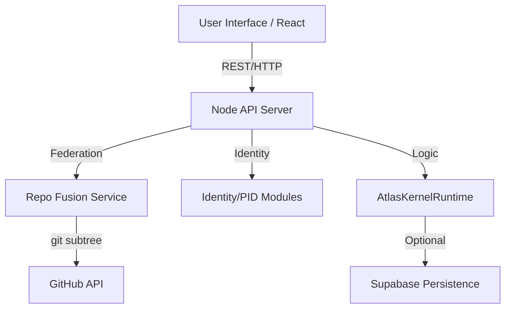
```mermaid
graph TD
    User[User Interface / React] -->|REST/HTTP| API[Node API Server]
    API -->|Federation| RepoService[Repo Fusion Service]
    API -->|Identity| PQC[Identity/PID Modules]
    API -->|Logic| Kernel[AtlasKernelRuntime]
    Kernel -->|Optional| Supabase[Supabase Persistence]
    RepoService -->|git subtree| GitHub[GitHub API]
```
The diagram shows the interaction between the React/Vite frontend and the Node API Server, which orchestrates various services including identity modules and the AtlasKernelRuntime.
Sources: [README.md:40-48](https://github.com/OsoPanda1/tamv-atlas/blob/8865a3b2b9a76a7c50157f19b9880ae744141269/README.md#L40-L48)

## Core System Modules

The TAMV Atlas is structured into 14 distinct modules, ranging from foundational identity concepts to advanced AI and philosophy.

| Module ID | Code | Label | Description |
| :--- | :--- | :--- | :--- |
| 0 | MD-X4 | Modulo 0 · Observabilidad | MD-X4 civilizational observability core. |
| 1 | ISNI-CORE | Modulo 1 · Fundamentos ISNI | Base architecture for Sovereign Name Infrastructure. |
| 2 | ISNI-ARCH | Modulo 2 · Arquitectura ISNI | System layers, domains, and ontologies. |
| 8 | APIS | Modulo 8 · Implementación Técnica | Service specifications and sovereign endpoints. |
| 12 | XR-AI | Modulo 12 · Metaverso / XR / IA | Isabella AI, DreamSpaces, and DEKATEOTL security. |
| 13 | OMEGA | Modulo Ω · Filosofía | TAMV Manifesto and editorial intelligence. |

Sources: [src/App.tsx:39-54](https://github.com/OsoPanda1/tamv-atlas/blob/8865a3b2b9a76a7c50157f19b9880ae744141269/src/App.tsx#L39-L54), [src/data/wikiStructure.ts:16-160](https://github.com/OsoPanda1/tamv-atlas/blob/8865a3b2b9a76a7c50157f19b9880ae744141269/src/data/wikiStructure.ts#L16-L160)

## Technical Implementation and CI/CD

The system operates under the **QC-TAMV-01 Constitutional Quality Framework**, which enforces non-negotiable technical invariants via automated pipelines. This framework applies to humans, AI agents, and CI/CD runners.

### Constitutional Laws (L1-L4)
1.  **L1 (Unique Root):** `createRoot` must exist only in `src/main.tsx`.
2.  **L2 (Unique Router):** `BrowserRouter` restricted to `src/App.tsx`.
3.  **L3 (Unique Design):** `Layout.tsx` mounted exactly once in `App.tsx`.
4.  **L4 (Route-Page Correspondence):** Every file in `src/pages/*` maps to a single route.

Sources: [src/pages/wiki/implementacion/CicdPipelines.tsx:21-38](https://github.com/OsoPanda1/tamv-atlas/blob/8865a3b2b9a76a7c50157f19b9880ae744141269/src/pages/wiki/implementacion/CicdPipelines.tsx#L21-L38)

### MD-X5 (Deca-V) Pipeline
The pipeline consists of 10 cycles required for pull requests to the main branch:

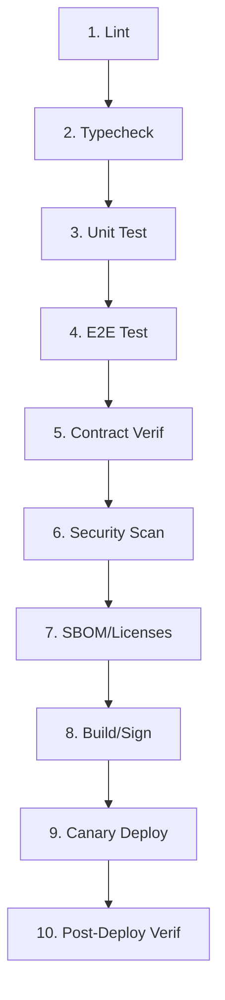
```mermaid
flowchart TD
    S1[1. Lint] --> S2[2. Typecheck]
    S2 --> S3[3. Unit Test]
    S3 --> S4[4. E2E Test]
    S4 --> S5[5. Contract Verif]
    S5 --> S6[6. Security Scan]
    S6 --> S7[7. SBOM/Licenses]
    S7 --> S8[8. Build/Sign]
    S8 --> S9[9. Canary Deploy]
    S9 --> S10[10. Post-Deploy Verif]
```
This diagram outlines the mandatory 10-cycle deployment pipeline defined in the MD-X5 kernel.
Sources: [src/pages/wiki/implementacion/CicdPipelines.tsx:49-65](https://github.com/OsoPanda1/tamv-atlas/blob/8865a3b2b9a76a7c50157f19b9880ae744141269/src/pages/wiki/implementacion/CicdPipelines.tsx#L49-L65)

## Operational Status and Readiness

TAMV Atlas is currently in an advanced pre-production phase. Functional areas such as the frontend and core backend endpoints are highly developed, while enterprise security and monitoring are still in active evolution.

| Area | Status | Progress % |
| :--- | :--- | :--- |
| Frontend | Stable for iteration | 78% |
| Backend Core | Functional, monolithic | 72% |
| Repository Federation | Functional (GitHub/Subtree) | 68% |
| Global Readiness | Production hardening required | 56% |

Sources: [README.md:104-122](https://github.com/OsoPanda1/tamv-atlas/blob/8865a3b2b9a76a7c50157f19b9880ae744141269/README.md#L104-L122)

### Runtime Behavior and Security
The system implements safety locks for documental agents and AI entities. External text is treated as untrusted data, and restricted operations include prohibiting direct changes to production logic without human authorization. The `CANON_LOCK` is set to `TRUE` to preserve the Master Canon from unauthorized modifications.

Sources: [federation/tamv-digital-nexus/AGENTS.md:7-12](https://github.com/OsoPanda1/tamv-atlas/blob/8865a3b2b9a76a7c50157f19b9880ae744141269/federation/tamv-digital-nexus/AGENTS.md#L7-L12), [federation/tamv-digital-nexus/AGENTS.md:21-25](https://github.com/OsoPanda1/tamv-atlas/blob/8865a3b2b9a76a7c50157f19b9880ae744141269/federation/tamv-digital-nexus/AGENTS.md#L21-L25)

## Summary
The TAMV Atlas serves as the executive interface between governance and engineering for the TAMV ONLINE ecosystem. It provides the necessary infrastructure to manage digital identities, federate code repositories, and maintain a verifiable narrative of technological sovereignty through its MD-X4/X5 kernels. Its development focuses on "Dignity-by-Design," ensuring that technical functionality remains secondary to ethical and human-centric principles.

Sources: [src/pages/wiki/modulo-cero/Introduccion.tsx:12-18](https://github.com/OsoPanda1/tamv-atlas/blob/8865a3b2b9a76a7c50157f19b9880ae744141269/src/pages/wiki/modulo-cero/Introduccion.tsx#L12-L18), [README.md:88-92](https://github.com/OsoPanda1/tamv-atlas/blob/8865a3b2b9a76a7c50157f19b9880ae744141269/README.md#L88-L92)

### Local Setup & Configuration

<details>
<summary>Relevant source files</summary>

The following files were used as context for generating this wiki page:

- [README.md](https://github.com/OsoPanda1/tamv-atlas/blob/8865a3b2b9a76a7c50157f19b9880ae744141269/README.md)
- [src/pages/wiki/implementacion/CicdPipelines.tsx](https://github.com/OsoPanda1/tamv-atlas/blob/8865a3b2b9a76a7c50157f19b9880ae744141269/src/pages/wiki/implementacion/CicdPipelines.tsx)
- [src/pages/wiki/metaverso-xr/RoadmapCivilizatorio.tsx](https://github.com/OsoPanda1/tamv-atlas/blob/8865a3b2b9a76a7c50157f19b9880ae744141269/src/pages/wiki/metaverso-xr/RoadmapCivilizatorio.tsx)
- [src/pages/wiki/modulo-cero/Introduccion.tsx](https://github.com/OsoPanda1/tamv-atlas/blob/8865a3b2b9a76a7c50157f19b9880ae744141269/src/pages/wiki/modulo-cero/Introduccion.tsx)
- [public/federation-manifest.json](https://github.com/OsoPanda1/tamv-atlas/blob/8865a3b2b9a76a7c50157f19b9880ae744141269/public/federation-manifest.json)
- [federation/tamv-digital-nexus/AGENTS.md](https://github.com/OsoPanda1/tamv-atlas/blob/8865a3b2b9a76a7c50157f19b9880ae744141269/federation/tamv-digital-nexus/AGENTS.md)
</details>

# Local Setup & Configuration

Local setup and configuration for the TAMV Atlas project involve preparing a full-stack environment that supports the MD-X4/X5 kernel, identity modules, and federated repository management. The system is designed as a monorepo consisting of a Vite-powered React frontend and a Node.js API server that interacts with various decentralized identity (DID) and persistent identifier (PID) services.

The environment requires specific configuration of environment variables to enable connectivity with backend services and optional persistence layers like Supabase. Developers must adhere to the QC-TAMV-01 Constitutional quality standards, which dictate structural invariants and mandatory linting/testing cycles during the local development process.

Sources: [README.md:3-13](https://github.com/OsoPanda1/tamv-atlas/blob/8865a3b2b9a76a7c50157f19b9880ae744141269/README.md#L3-L13), [src/pages/wiki/implementacion/CicdPipelines.tsx:16-21](https://github.com/OsoPanda1/tamv-atlas/blob/8865a3b2b9a76a7c50157f19b9880ae744141269/src/pages/wiki/implementacion/CicdPipelines.tsx#L16-L21)

## Prerequisites and Tech Stack

The TAMV Atlas platform utilizes a modern JavaScript/TypeScript stack. Development requires Node.js (Version 20+) and specific package management tools to handle the monorepo structure.

### Core Technologies
- **Frontend**: React 18, Vite 5, Tailwind CSS, TypeScript 5.
- **Backend**: Node.js (HTTP native + ESM), Express.
- **Persistence**: PostgreSQL 15, Supabase (Optional).
- **Quantum/XR**: Qiskit, Three.js, WebXR.

Sources: [src/pages/wiki/metaverso-xr/RoadmapCivilizatorio.tsx:55-61](https://github.com/OsoPanda1/tamv-atlas/blob/8865a3b2b9a76a7c50157f19b9880ae744141269/src/pages/wiki/metaverso-xr/RoadmapCivilizatorio.tsx#L55-L61), [README.md:7-13](https://github.com/OsoPanda1/tamv-atlas/blob/8865a3b2b9a76a7c50157f19b9880ae744141269/README.md#L7-L13)

## Local Development Execution

The project provides standard npm scripts for initializing the frontend and backend services. These must be executed from the root of the repository.

```bash
# Install dependencies
npm install

# Start Frontend Development Server
npm run dev

# Start Backend API Server
npm run api:start
```

Sources: [README.md:126-140](https://github.com/OsoPanda1/tamv-atlas/blob/8865a3b2b9a76a7c50157f19b9880ae744141269/README.md#L126-L140)

### Quality Control Gates (npm scripts)
Before submitting code, developers must pass the MD-X5 (Deca-V) pipeline cycles locally to ensure compliance with the "Constitutional" quality framework.

| Script | Purpose |
| :--- | :--- |
| `npm run lint` | ESLint execution with `eslint-plugin-tamv` in error mode. |
| `npm run typecheck` | TypeScript verification without emitting files. |
| `npm run test` | Unit testing via Vitest. |
| `npm run test:e2e` | Integration testing via Playwright. |
| `npm run build` | Production artifact generation and signing. |

Sources: [src/pages/wiki/implementacion/CicdPipelines.tsx:49-61](https://github.com/OsoPanda1/tamv-atlas/blob/8865a3b2b9a76a7c50157f19b9880ae744141269/src/pages/wiki/implementacion/CicdPipelines.tsx#L49-L61), [README.md:133-138](https://github.com/OsoPanda1/tamv-atlas/blob/8865a3b2b9a76a7c50157f19b9880ae744141269/README.md#L133-L138)

## Environment Configuration

Configuration is managed via environment variables. The API server behavior changes dynamically based on the presence of these variables, particularly regarding persistence and external services.

### Essential Variables
| Variable | Description |
| :--- | :--- |
| `VITE_TAMV_BACKEND_URL` | URL of the TAMV API server for frontend consumption. |
| `SUPABASE_URL` | Endpoint for the Supabase persistence layer. |
| `SUPABASE_SERVICE_ROLE_KEY` | Administrative key for Supabase access. |
| `TAMV_ORCID` | Identifier for the ORCID academic identity integration. |
| `TAMV_ZENODO_RECORD` | Reference for Zenodo DOI records. |
| `TAMV_ISNI` | Identifier for the International Standard Name Identifier. |

Sources: [README.md:83-86](https://github.com/OsoPanda1/tamv-atlas/blob/8865a3b2b9a76a7c50157f19b9880ae744141269/README.md#L83-L86), [README.md:144-149](https://github.com/OsoPanda1/tamv-atlas/blob/8865a3b2b9a76a7c50157f19b9880ae744141269/README.md#L144-L149)

### Operational Logic
If `SUPABASE_URL` and `SUPABASE_SERVICE_ROLE_KEY` are not provided, the API remains functional but disables routes requiring persistence, returning a `503 Service Unavailable` status for those specific endpoints.

Sources: [README.md:83-86](https://github.com/OsoPanda1/tamv-atlas/blob/8865a3b2b9a76a7c50157f19b9880ae744141269/README.md#L83-L86)

## Architecture and Data Flow

The local setup establishes a relationship between the React frontend and the Node API, which acts as a gateway to the Atlas Kernel and federated services.

### System Flow Diagram
The following diagram illustrates how the local components interact with external identity and repository services:

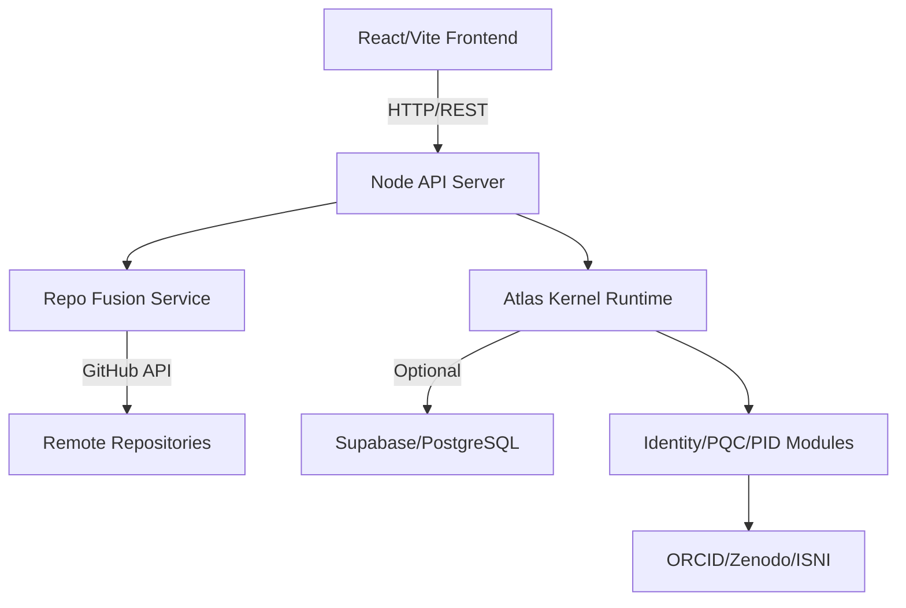
```mermaid
graph TD
    UI[React/Vite Frontend] -- HTTP/REST --> API[Node API Server]
    API --> AK[Atlas Kernel Runtime]
    API --> RFS[Repo Fusion Service]
    RFS -- GitHub API --> GH[Remote Repositories]
    AK -- Optional --> DB[Supabase/PostgreSQL]
    AK --> PID[Identity/PQC/PID Modules]
    PID --> ORCID[ORCID/Zenodo/ISNI]
```
The diagram shows the local architectural stack where the Frontend communicates with the Node API, which then manages repository fusion and identity modules.

Sources: [README.md:65-80](https://github.com/OsoPanda1/tamv-atlas/blob/8865a3b2b9a76a7c50157f19b9880ae744141269/README.md#L65-L80)

## Repository Federation Setup

The TAMV Atlas includes scripts for unifying external repositories from the `OsoPanda1` GitHub profile. This process populates the `federation/` directory using `git subtree`.

### Federation Mechanism
1. **Discovery**: The system scans GitHub for repositories belonging to the owner.
2. **Manifest Generation**: A `federation-manifest.json` is created, indexing repository metadata, file counts, and service definitions.
3. **Importation**: Selected repositories are imported via `subtree --squash`.

Sources: [README.md:17-21](https://github.com/OsoPanda1/tamv-atlas/blob/8865a3b2b9a76a7c50157f19b9880ae744141269/README.md#L17-L21), [public/federation-manifest.json:4-15](https://github.com/OsoPanda1/tamv-atlas/blob/8865a3b2b9a76a7c50157f19b9880ae744141269/public/federation-manifest.json#L4-L15)

### Workspace Management
For specific federated environments like `tamv-digital-nexus`, an `AGENTS.md` file defines local safety locks and allowed operations.

- `CANON_LOCK=TRUE`: Prevents renaming of canonical TAMV modules.
- `CODE_WRITE=RESTRICTED`: Restricts direct changes to production logic without human review.

Sources: [federation/tamv-digital-nexus/AGENTS.md:5-25](https://github.com/OsoPanda1/tamv-atlas/blob/8865a3b2b9a76a7c50157f19b9880ae744141269/federation/tamv-digital-nexus/AGENTS.md#L5-L25)

## QC-TAMV-01 Constitutional Invariants

Local configuration must respect the structural "laws" defined in the constitutional framework to pass the automated linting checks.

| Law | Constraint |
| :--- | :--- |
| **L1 (Unique Root)** | `createRoot` must exist only in `src/main.tsx`. |
| **L2 (Unique Router)** | `BrowserRouter` is restricted to `src/App.tsx`. |
| **L3 (Unique Layout)** | `Layout.tsx` must be mounted exactly once in `App.tsx`. |
| **L6 (Independence)** | `src/modules/*` cannot import from `react-router-dom` or `pages`. |

Sources: [src/pages/wiki/implementacion/CicdPipelines.tsx:23-38](https://github.com/OsoPanda1/tamv-atlas/blob/8865a3b2b9a76a7c50157f19b9880ae744141269/src/pages/wiki/implementacion/CicdPipelines.tsx#L23-L38)

## Conclusion
Setting up the TAMV Atlas locally provides a functional environment for iterating on digital civilization infrastructure. Success relies on configuring the environment variables for identity services and adhering to the MD-X5 pipeline and QC-TAMV-01 structural invariants. Once configured, the system allows for local development of frontend modules, API endpoints, and federated repository unifications.

Sources: [README.md:162-166](https://github.com/OsoPanda1/tamv-atlas/blob/8865a3b2b9a76a7c50157f19b9880ae744141269/README.md#L162-L166), [src/pages/wiki/implementacion/CicdPipelines.tsx:102-110](https://github.com/OsoPanda1/tamv-atlas/blob/8865a3b2b9a76a7c50157f19b9880ae744141269/src/pages/wiki/implementacion/CicdPipelines.tsx#L102-L110)

### Federated Ecosystem & Repositories

<details>
<summary>Relevant source files</summary>

The following files were used as context for generating this wiki page:

- [src/pages/wiki/ecosistema-codigo/ProyectosPrincipales.tsx](https://github.com/OsoPanda1/tamv-atlas/blob/8865a3b2b9a76a7c50157f19b9880ae744141269/src/pages/wiki/ecosistema-codigo/ProyectosPrincipales.tsx)
- [src/pages/wiki/ecosistema-codigo/GithubRepos.tsx](https://github.com/OsoPanda1/tamv-atlas/blob/8865a3b2b9a76a7c50157f19b9880ae744141269/src/pages/wiki/ecosistema-codigo/GithubRepos.tsx)
- [src/pages/wiki/modulo-cero/FusionWikisExternas.tsx](https://github.com/OsoPanda1/tamv-atlas/blob/8865a3b2b9a76a7c50157f19b9880ae744141269/src/pages/wiki/modulo-cero/FusionWikisExternas.tsx)
- [README.md](https://github.com/OsoPanda1/tamv-atlas/blob/8865a3b2b9a76a7c50157f19b9880ae744141269/README.md)
- [src/pages/wiki/implementacion/CicdPipelines.tsx](https://github.com/OsoPanda1/tamv-atlas/blob/8865a3b2b9a76a7c50157f19b9880ae744141269/src/pages/wiki/implementacion/CicdPipelines.tsx)
- [src/pages/wiki/modulo-cero/Introduccion.tsx](https://github.com/OsoPanda1/tamv-atlas/blob/8865a3b2b9a76a7c50157f19b9880ae744141269/src/pages/wiki/modulo-cero/Introduccion.tsx)
</details>

# Federated Ecosystem & Repositories

The Federated Ecosystem & Repositories within the TAMV project represent a modular, distributed architecture where multiple independent repositories (approximately 177 to 195 federated repos) converge into a single civilizational program. This "constellation architecture" ensures that while individual projects handle specific functional partitions—such as identity, territory twins, or AI orchestration—they remain aligned with a single technical narrative and a unified direction under the TAMV ONLINE system.

Sources: [src/pages/wiki/ecosistema-codigo/GithubRepos.tsx](https://github.com/OsoPanda1/tamv-atlas/blob/8865a3b2b9a76a7c50157f19b9880ae744141269/src/pages/wiki/ecosistema-codigo/GithubRepos.tsx), [src/pages/wiki/ecosistema-codigo/ProyectosPrincipales.tsx:24](https://github.com/OsoPanda1/tamv-atlas/blob/8865a3b2b9a76a7c50157f19b9880ae744141269/src/pages/wiki/ecosistema-codigo/ProyectosPrincipales.tsx#L24), [src/pages/wiki/implementacion/CicdPipelines.tsx:88](https://github.com/OsoPanda1/tamv-atlas/blob/8865a3b2b9a76a7c50157f19b9880ae744141269/src/pages/wiki/implementacion/CicdPipelines.tsx#L88)

## Architectural Framework: MD-X4/X5

The core of the federated ecosystem is the **MD-X4 heptafederated kernel**, which organizes the system into seven functional layers. This is further extended by **MD-X5**, which manages the autogeneration and normalization of modules through the "HOYO NEGRO" protocol to prevent fragmentation across the vast repository landscape.

### Functional Partitions
The system is divided into functional "fronts" to maintain clarity and operational speed:

| Front | Objective | Representative Repositories |
| :--- | :--- | :--- |
| **Core** | Architecture and principles | OsoPanda1, civilizational-core |
| **Territory** | Real del Monte (RDM) node | real-del-monte-explorer, real-del-monte-twin |
| **Integration** | Unified services | ecosistema-nextgen-tamv, tamv-nexus-verse |
| **Templates** | Replicability/Deployment | ECOSISTEMA-TAMVONLINE, TAMV-ONLINE-NEXTGEN-1.0 |

Sources: [src/pages/wiki/ecosistema-codigo/ProyectosPrincipales.tsx:14-22](https://github.com/OsoPanda1/tamv-atlas/blob/8865a3b2b9a76a7c50157f19b9880ae744141269/src/pages/wiki/ecosistema-codigo/ProyectosPrincipales.tsx#L14-L22), [src/pages/wiki/modulo-cero/Introduccion.tsx:18-35](https://github.com/OsoPanda1/tamv-atlas/blob/8865a3b2b9a76a7c50157f19b9880ae744141269/src/pages/wiki/modulo-cero/Introduccion.tsx#L18-L35)

### Repository Constellation Diagram
The following diagram illustrates the relationship between the core kernel and the satellite repository functional groups.

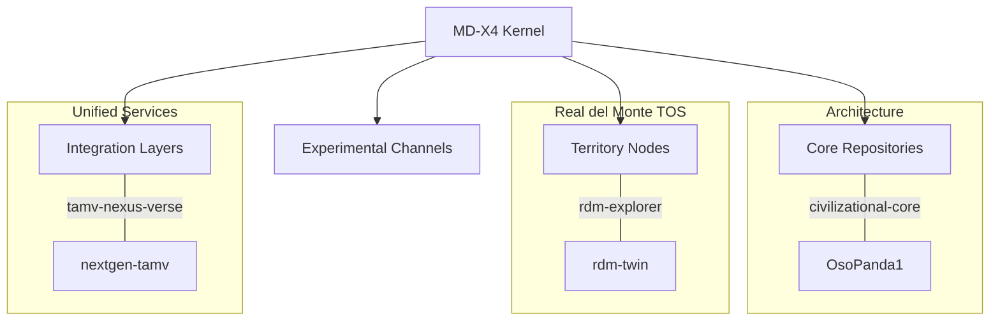
```mermaid
flowchart TD
    MDX[MD-X4 Kernel] --> Core[Core Repositories]
    MDX --> Terr[Territory Nodes]
    MDX --> Int[Integration Layers]
    MDX --> Exp[Experimental Channels]

    subgraph Core_Group [Architecture]
        Core -- "civilizational-core" --- OsoPanda1
    end

    subgraph Territory_Group [Real del Monte TOS]
        Terr -- "rdm-explorer" --- rdm-twin
    end

    subgraph Integration_Group [Unified Services]
        Int -- "tamv-nexus-verse" --- nextgen-tamv
    end
```
Sources: [src/pages/wiki/ecosistema-codigo/GithubRepos.tsx](https://github.com/OsoPanda1/tamv-atlas/blob/8865a3b2b9a76a7c50157f19b9880ae744141269/src/pages/wiki/ecosistema-codigo/GithubRepos.tsx), [src/pages/wiki/ecosistema-codigo/ProyectosPrincipales.tsx](https://github.com/OsoPanda1/tamv-atlas/blob/8865a3b2b9a76a7c50157f19b9880ae744141269/src/pages/wiki/ecosistema-codigo/ProyectosPrincipales.tsx)

## Federation Mechanics and Unification

The `tamv-atlas` repository serves as a monorepo that uses scripts to discover and import external repositories via the GitHub API and `git subtree`. This process generates a consolidated manifest that bridges the gap between decentralized development and a unified operational platform.

### Unification Process
The federation process follows a specific logical flow to ensure all satellite repositories adhere to the TAMV canon:

1. **Discovery:** Identifies repos under the `OsoPanda1` owner using GitHub API.
2. **Manifest Generation:** Consolidates metadata into a central federated index.
3. **Subtree Integration:** Uses `git subtree --squash` to pull code into the `federation/` directory.

Sources: [README.md:27-37](https://github.com/OsoPanda1/tamv-atlas/blob/8865a3b2b9a76a7c50157f19b9880ae744141269/README.md#L27-L37), [src/pages/wiki/ecosistema-codigo/GithubRepos.tsx:41-50](https://github.com/OsoPanda1/tamv-atlas/blob/8865a3b2b9a76a7c50157f19b9880ae744141269/src/pages/wiki/ecosistema-codigo/GithubRepos.tsx#L41-L50)

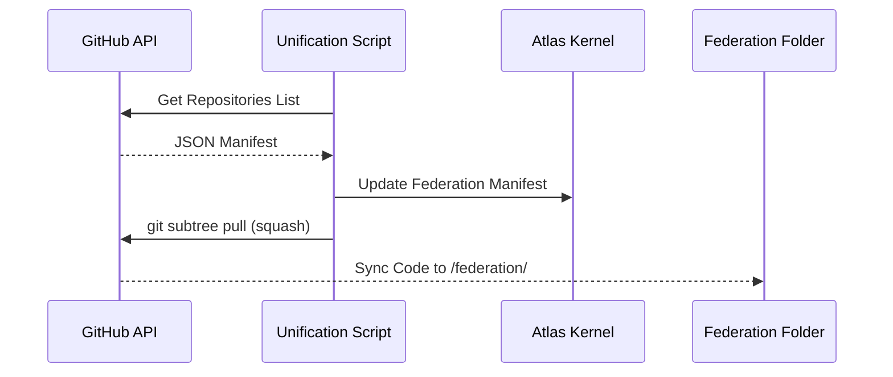
```mermaid
sequenceDiagram
    participant GH as GitHub API
    participant script as Unification Script
    participant Atlas as Atlas Kernel
    participant FS as Federation Folder

    script->>GH: Get Repositories List
    GH-->>script: JSON Manifest
    script->>Atlas: Update Federation Manifest
    script->>GH: git subtree pull (squash)
    GH-->>FS: Sync Code to /federation/
```
Sources: [README.md:43-52](https://github.com/OsoPanda1/tamv-atlas/blob/8865a3b2b9a76a7c50157f19b9880ae744141269/README.md#L43-L52), [src/pages/wiki/implementacion/CicdPipelines.tsx:88-95](https://github.com/OsoPanda1/tamv-atlas/blob/8865a3b2b9a76a7c50157f19b9880ae744141269/src/pages/wiki/implementacion/CicdPipelines.tsx#L88-L95)

## Governance and Quality Control (QC-TAMV-01)

The "Constitutional Quality Framework" (QC-TAMV-01) establishes non-negotiable invariants for any repository entering the federation. This ensures that even with 177+ repos, the architecture remains deterministic and predecible.

### Constitutional Laws (L1-L6)
- **L1 (Unique Root):** `createRoot` must exist only in `src/main.tsx`.
- **L2 (Unique Router):** `BrowserRouter` restricted to `src/App.tsx`.
- **L6 (Independent Modules):** `src/modules/*` cannot import from `react-router-dom` or `pages`.

Sources: [src/pages/wiki/implementacion/CicdPipelines.tsx:22-32](https://github.com/OsoPanda1/tamv-atlas/blob/8865a3b2b9a76a7c50157f19b9880ae744141269/src/pages/wiki/implementacion/CicdPipelines.tsx#L22-L32)

### MD-X5 Pipeline (Deca-V)
Federated repositories must pass a 10-cycle pipeline before being considered operational:

| Cycle | Operation | Purpose |
| :--- | :--- | :--- |
| 1-2 | Lint & Typecheck | Structural integrity (ESLint tamv-plugin) |
| 3-4 | Unit & E2E Test | Functional verification (Vitest/Playwright) |
| 5-6 | Contract & Security | Module interface and DEKATEOTL gates |
| 7-8 | SBOM & Signing | Licensing check and artifact signing |
| 9-10| Canary & Rollback | Gradual deployment and automatic gate |

Sources: [src/pages/wiki/implementacion/CicdPipelines.tsx:42-55](https://github.com/OsoPanda1/tamv-atlas/blob/8865a3b2b9a76a7c50157f19b9880ae744141269/src/pages/wiki/implementacion/CicdPipelines.tsx#L42-L55)

## Operational Status: Readiness Assessment

The `tamv-atlas` platform tracks the readiness of the federated ecosystem for production. As of the current audit, the federation mechanics are approximately 68% functional, while the overall production readiness stands at 56%.

### Readiness Metrics
- **Frontend functional:** 78% (Pages, routes, build).
- **Backend Core:** 72% (Operational endpoints).
- **Federation Service:** 68% (Repo discovery and import).
- **Security Posture:** 46% (Enterprise controls pending).

Sources: [README.md:88-106](https://github.com/OsoPanda1/tamv-atlas/blob/8865a3b2b9a76a7c50157f19b9880ae744141269/README.md#L88-L106)

## Summary

The Federated Ecosystem & Repositories of TAMV transition the project from a collection of isolated products into a unified "constellation architecture." By utilizing the MD-X4 kernel and strict constitutional quality controls (QC-TAMV-01), the project maintains architectural integrity across nearly 200 repositories. The `tamv-atlas` repository acts as the central orchestrator, consolidating these distributed efforts into a single, executable infrastructure for territorial sovereignty.

Sources: [README.md:143-148](https://github.com/OsoPanda1/tamv-atlas/blob/8865a3b2b9a76a7c50157f19b9880ae744141269/README.md#L143-L148), [src/pages/wiki/ecosistema-codigo/GithubRepos.tsx:35-40](https://github.com/OsoPanda1/tamv-atlas/blob/8865a3b2b9a76a7c50157f19b9880ae744141269/src/pages/wiki/ecosistema-codigo/GithubRepos.tsx#L35-L40)


## System Architecture

### High-Level Architecture

<details>
<summary>Relevant source files</summary>

The following files were used as context for generating this wiki page:

- [src/pages/wiki/modulo-cero/Introduccion.tsx](https://github.com/OsoPanda1/tamv-atlas/blob/8865a3b2b9a76a7c50157f19b9880ae744141269/src/pages/wiki/modulo-cero/Introduccion.tsx)
- [src/pages/wiki/implementacion/CicdPipelines.tsx](https://github.com/OsoPanda1/tamv-atlas/blob/8865a3b2b9a76a7c50157f19b9880ae744141269/src/pages/wiki/implementacion/CicdPipelines.tsx)
- [src/pages/wiki/fundamentos/VisionGeneral.tsx](https://github.com/OsoPanda1/tamv-atlas/blob/8865a3b2b9a76a7c50157f19b9880ae744141269/src/pages/wiki/fundamentos/VisionGeneral.tsx)
- [src/pages/wiki/metaverso-xr/RoadmapCivilizatorio.tsx](https://github.com/OsoPanda1/tamv-atlas/blob/8865a3b2b9a76a7c50157f19b9880ae744141269/src/pages/wiki/metaverso-xr/RoadmapCivilizatorio.tsx)
- [federation/tamv-digital-nexus/scripts/check-architecture.ts](https://github.com/OsoPanda1/tamv-atlas/blob/8865a3b2b9a76a7c50157f19b9880ae744141269/federation/tamv-digital-nexus/scripts/check-architecture.ts)
- [src/pages/wiki/fundamentos-isni/ResumenAcademico.tsx](https://github.com/OsoPanda1/tamv-atlas/blob/8865a3b2b9a76a7c50157f19b9880ae744141269/src/pages/wiki/fundamentos-isni/ResumenAcademico.tsx)
- [src/pages/wiki/arquitectura/OntologiasDatos.tsx](https://github.com/OsoPanda1/tamv-atlas/blob/8865a3b2b9a76a7c50157f19b9880ae744141269/src/pages/wiki/arquitectura/OntologiasDatos.tsx)
</details>

# High-Level Architecture

TAMV ONLINE (Tecnología Avanzada Mexicana Versátil) is a Federated Civilizational Ecosystem designed as a sovereign technological infrastructure for Latin America. It operates as a hybrid Social and Technical Operating System that integrates identity, knowledge, artificial intelligence, and territory into a unified architecture. Sources: [src/pages/wiki/modulo-cero/Introduccion.tsx:7-11](https://github.com/OsoPanda1/tamv-atlas/blob/8865a3b2b9a76a7c50157f19b9880ae744141269/src/pages/wiki/modulo-cero/Introduccion.tsx#L7-L11)

The system is governed by a constitutional quality framework (QC-TAMV-01) and organized through a heptafederated kernel known as MD-X4. This architecture prioritizes "Dignity-by-Design," ensuring that privacy and security are foundational conditions rather than optional features. Sources: [src/pages/wiki/implementacion/CicdPipelines.tsx:11-15](https://github.com/OsoPanda1/tamv-atlas/blob/8865a3b2b9a76a7c50157f19b9880ae744141269/src/pages/wiki/implementacion/CicdPipelines.tsx#L11-L15), [src/pages/wiki/fundamentos/VisionGeneral.tsx:11-15](https://github.com/OsoPanda1/tamv-atlas/blob/8865a3b2b9a76a7c50157f19b9880ae744141269/src/pages/wiki/fundamentos/VisionGeneral.tsx#L11-L15)

## 1. System Hierarchies and Layers

The TAMV architecture is organized into five functional levels that manage everything from base identity to global integration.

### Functional Levels (0-5)
1.  **Nivel 0 — ISNI / SNI:** Identity and ontology layer using JSON-LD and Persistent Identifiers (ORCID, DOI).
2.  **Nivel 1 — MD-X4 / MD-X5:** Infrastructure and evolution layer providing observability and the "HOYO NEGRO" protocol.
3.  **Nivel 2 — Isabella Villaseñor AI:** Cognitive layer for intelligence orchestration and semantic mediation.
4.  **Nivel 3 — UTAMV:** Academic layer for cognitive transfer and pedagogical tracking.
5.  **Nivel 4 — RDM Digital:** Territorial layer anchoring the system to physical nodes and digital twins.
6.  **Nivel 5 — Global Integration:** Interoperability with ERP systems (Odoo), XR environments, and open science networks.

Sources: [src/pages/wiki/modulo-cero/Introduccion.tsx:55-75](https://github.com/OsoPanda1/tamv-atlas/blob/8865a3b2b9a76a7c50157f19b9880ae744141269/src/pages/wiki/modulo-cero/Introduccion.tsx#L55-L75)

### The Heptafederated Model
The system replaces traditional "Triple Helix" models with seven functional federations:
*   **F1 · DATA:** Data management and persistence.
*   **F2 · INTEL:** Intelligence and AI services.
*   **F3 · SEC:** Security and post-quantum cryptography.
*   **F4 · GOV:** Governance and executable policies.
*   **F5 · ECON:** Economy and transaction systems.
*   **F6 · VIS:** Visual and XR interfaces.
*   **F7 · TERRITORY:** Physical nodes and digital twins.

Sources: [src/pages/wiki/fundamentos/VisionGeneral.tsx:32-38](https://github.com/OsoPanda1/tamv-atlas/blob/8865a3b2b9a76a7c50157f19b9880ae744141269/src/pages/wiki/fundamentos/VisionGeneral.tsx#L32-L38)

## 2. Infrastructure Components

The core of the system is the **MD-X4 Digital Nexus**, an API that activates real-time services including DreamSpaces, DAOs, and marketplaces.

| Component | Description | Tech Stack |
| :--- | :--- | :--- |
| **Backend Core** | Core logic, auth, and data management. | Node.js, TS, Express, PostgreSQL |
| **Quantum Lab** | Optimization and hybrid QML services. | Qiskit, TensorFlow Quantum, cuQuantum |
| **XR Worlds** | 3D/4D immersive environments. | Three.js, WebXR, Motor 4D |
| **MSR / BookPI** | Immutable ledger for event-sourcing and audit. | SHA-256 Hash, Ledger |
| **Isabella AI** | Ethical AI orquestrator with triple lock security. | Neural models with behavior locks |

Sources: [src/pages/wiki/metaverso-xr/RoadmapCivilizatorio.tsx:114-121](https://github.com/OsoPanda1/tamv-atlas/blob/8865a3b2b9a76a7c50157f19b9880ae744141269/src/pages/wiki/metaverso-xr/RoadmapCivilizatorio.tsx#L114-L121), [src/pages/wiki/modulo-cero/Introduccion.tsx:77-81](https://github.com/OsoPanda1/tamv-atlas/blob/8865a3b2b9a76a7c50157f19b9880ae744141269/src/pages/wiki/modulo-cero/Introduccion.tsx#L77-L81)

## 3. Data Flow and Ontology

TAMV utilizes semantic data models based on open standards to ensure knowledge reuse and interoperability.

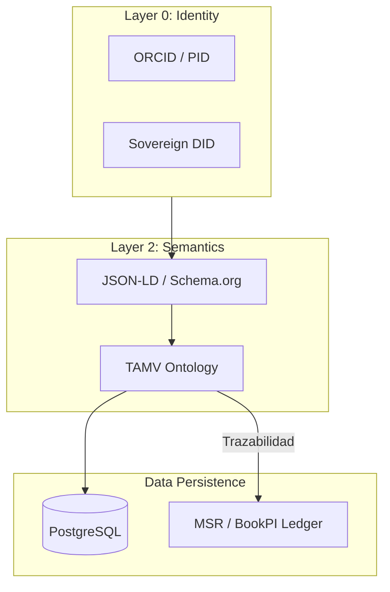
```mermaid
flowchart TD
    subgraph Identity_Layer[Layer 0: Identity]
        ORCID[ORCID / PID]
        DID[Sovereign DID]
    end

    subgraph Semantic_Core[Layer 2: Semantics]
        JSONLD[JSON-LD / Schema.org]
        Ontology[TAMV Ontology]
    end

    subgraph Storage[Data Persistence]
        PostgreSQL[(PostgreSQL)]
        MSR[MSR / BookPI Ledger]
    end

    Identity_Layer --> JSONLD
    JSONLD --> Ontology
    Ontology --> PostgreSQL
    Ontology --"Trazabilidad"--> MSR
```
The diagram above illustrates the flow from external persistent identifiers to the internal semantic core and final persistence in auditable ledgers. Sources: [src/pages/wiki/arquitectura/OntologiasDatos.tsx:10-25](https://github.com/OsoPanda1/tamv-atlas/blob/8865a3b2b9a76a7c50157f19b9880ae744141269/src/pages/wiki/arquitectura/OntologiasDatos.tsx#L10-L25), [src/pages/wiki/fundamentos-isni/ResumenAcademico.tsx:34-40](https://github.com/OsoPanda1/tamv-atlas/blob/8865a3b2b9a76a7c50157f19b9880ae744141269/src/pages/wiki/fundamentos-isni/ResumenAcademico.tsx#L34-L40)

### Semantic Entity Models
*   **Person:** Linked to ORCID for academic and professional tracking.
*   **Organization:** Identified via ISNI/ROR for structural governance.
*   **Project:** Managed through DOIs for versioned traceability.
*   **Territory:** Modeled as a high-availability digital twin (RDM-TOS).

Sources: [src/pages/wiki/arquitectura/OntologiasDatos.tsx:34-40](https://github.com/OsoPanda1/tamv-atlas/blob/8865a3b2b9a76a7c50157f19b9880ae744141269/src/pages/wiki/arquitectura/OntologiasDatos.tsx#L34-L40)

## 4. Architectural Invariants (QC-TAMV-01)

The system enforces strict architectural rules through a constitutional checker script (`check-architecture.ts`).

### Constitutional Laws (L1-L8)
*   **L1 (Single Root):** `createRoot` must exist only in `src/main.tsx`.
*   **L2 (Single Router):** `BrowserRouter` is restricted to `src/App.tsx`.
*   **L3 (Single Layout):** Main layout components must only be mounted in the App entry point.
*   **L4 (Route-Page Mapping):** Each page corresponds to a unique route; pages cannot import other pages.
*   **L6 (Agnostic Modules):** Business logic modules (`src/modules/*`) cannot depend on the router or pages.

Sources: [src/pages/wiki/implementacion/CicdPipelines.tsx:24-34](https://github.com/OsoPanda1/tamv-atlas/blob/8865a3b2b9a76a7c50157f19b9880ae744141269/src/pages/wiki/implementacion/CicdPipelines.tsx#L24-L34), [federation/tamv-digital-nexus/scripts/check-architecture.ts:133-210](https://github.com/OsoPanda1/tamv-atlas/blob/8865a3b2b9a76a7c50157f19b9880ae744141269/federation/tamv-digital-nexus/scripts/check-architecture.ts#L133-L210)

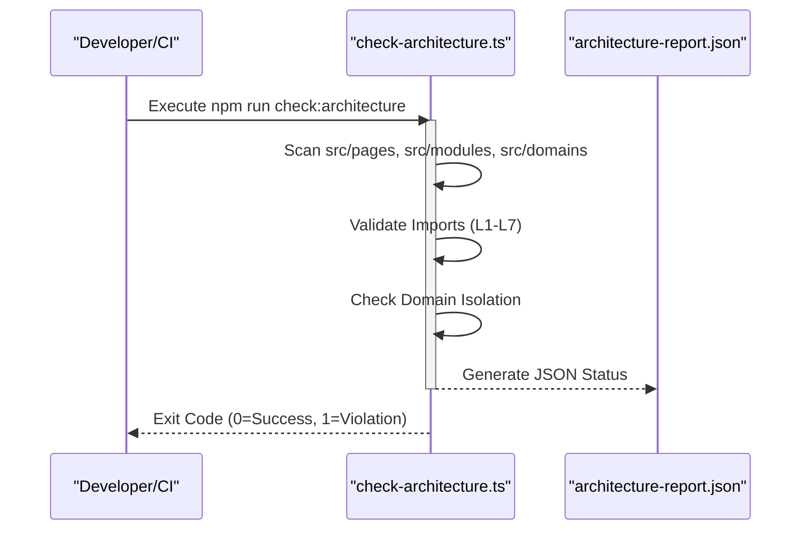
```mermaid
sequenceDiagram
    participant Dev as "Developer/CI"
    participant Script as "check-architecture.ts"
    participant Report as "architecture-report.json"
    
    Dev->>Script: Execute npm run check:architecture
    activate Script
    Script->>Script: Scan src/pages, src/modules, src/domains
    Script->>Script: Validate Imports (L1-L7)
    Script->>Script: Check Domain Isolation
    Script-->>Report: Generate JSON Status
    deactivate Script
    Script-->>Dev: Exit Code (0=Success, 1=Violation)
```
This diagram shows the validation process that ensures every code change adheres to the TAMV constitutional invariants. Sources: [federation/tamv-digital-nexus/scripts/check-architecture.ts:257-319](https://github.com/OsoPanda1/tamv-atlas/blob/8865a3b2b9a76a7c50157f19b9880ae744141269/federation/tamv-digital-nexus/scripts/check-architecture.ts#L257-L319)

## 5. Security and Governance

Security in TAMV is built on **Zero-Trust** principles and includes post-quantum cryptography roadmap.

*   **Human-in-the-Loop:** Critical decisions require a human guardian; AI serves as an audit and mediation layer.
*   **Triple Lock (Isabella AI):** Semantic, behavioral, and contextual locks to prevent algorithmic abuse.
*   **MSR Registry:** Every significant state change is logged with a SHA-256 hash to ensure non-repudiation.

Sources: [src/pages/wiki/modulo-cero/Introduccion.tsx:18-24](https://github.com/OsoPanda1/tamv-atlas/blob/8865a3b2b9a76a7c50157f19b9880ae744141269/src/pages/wiki/modulo-cero/Introduccion.tsx#L18-L24), [src/pages/wiki/metaverso-xr/RoadmapCivilizatorio.tsx:158-164](https://github.com/OsoPanda1/tamv-atlas/blob/8865a3b2b9a76a7c50157f19b9880ae744141269/src/pages/wiki/metaverso-xr/RoadmapCivilizatorio.tsx#L158-L164)

**Summary:** The High-Level Architecture of TAMV ONLINE represents a shift from centralized platforms to a federated, sovereign infrastructure. By combining semantic identity (ISNI), a heptafederated kernel (MD-X4), and a constitutional validation system, it establishes an "antifragile" environment where technology serves territorial and human dignity. Sources: [src/pages/wiki/fundamentos/VisionGeneral.tsx:11-15](https://github.com/OsoPanda1/tamv-atlas/blob/8865a3b2b9a76a7c50157f19b9880ae744141269/src/pages/wiki/fundamentos/VisionGeneral.tsx#L11-L15), [src/pages/wiki/modulo-cero/Introduccion.tsx:10-15](https://github.com/OsoPanda1/tamv-atlas/blob/8865a3b2b9a76a7c50157f19b9880ae744141269/src/pages/wiki/modulo-cero/Introduccion.tsx#L10-L15)

### Constitutional Guard & Policies

<details>
<summary>Relevant source files</summary>

The following files were used as context for generating this wiki page:

- [federation/tamv-digital-nexus/apps/web/src/lib/isabella/constitutionalGuard.ts](https://github.com/OsoPanda1/tamv-atlas/blob/8865a3b2b9a76a7c50157f19b9880ae744141269/federation/tamv-digital-nexus/apps/web/src/lib/isabella/constitutionalGuard.ts)
- [src/pages/wiki/implementacion/CicdPipelines.tsx](https://github.com/OsoPanda1/tamv-atlas/blob/8865a3b2b9a76a7c50157f19b9880ae744141269/src/pages/wiki/implementacion/CicdPipelines.tsx)
- [federation/tamv-digital-nexus/scripts/scan-semantics.ts](https://github.com/OsoPanda1/tamv-atlas/blob/8865a3b2b9a76a7c50157f19b9880ae744141269/federation/tamv-digital-nexus/scripts/scan-semantics.ts)
- [federation/tamv-digital-nexus/apps/web/src/lib/constitutionEngine.ts](https://github.com/OsoPanda1/tamv-atlas/blob/8865a3b2b9a76a7c50157f19b9880ae744141269/federation/tamv-digital-nexus/apps/web/src/lib/constitutionEngine.ts)
- [federation/tamv-digital-nexus/AGENTS.md](https://github.com/OsoPanda1/tamv-atlas/blob/8865a3b2b9a76a7c50157f19b9880ae744141269/federation/tamv-digital-nexus/AGENTS.md)
- [src/pages/wiki/gobernanza/GobernanzaDatos.tsx](https://github.com/OsoPanda1/tamv-atlas/blob/8865a3b2b9a76a7c50157f19b9880ae744141269/src/pages/wiki/gobernanza/GobernanzaDatos.tsx)
</details>

# Constitutional Guard & Policies

The **Constitutional Guard & Policies** system within the TAMV ecosystem (specifically the QC-TAMV-IA-01 implementation) serves as a foundational governance layer. Its primary purpose is to ensure that all actions taken by AI systems, human developers, and automated pipelines comply with the Stewarded & Constitutional Autonomous Organization (SCAO) framework. It translates high-level design principles into executable technical invariants, preventing patterns associated with predatory economics, cognitive manipulation, and uncustodied governance.

Sources: [federation/tamv-digital-nexus/apps/web/src/lib/isabella/constitutionalGuard.ts:1-10](https://github.com/OsoPanda1/tamv-atlas/blob/8865a3b2b9a76a7c50157f19b9880ae744141269/federation/tamv-digital-nexus/apps/web/src/lib/isabella/constitutionalGuard.ts#L1-L10), [src/pages/wiki/implementacion/CicdPipelines.tsx:13-18](https://github.com/OsoPanda1/tamv-atlas/blob/8865a3b2b9a76a7c50157f19b9880ae744141269/src/pages/wiki/implementacion/CicdPipelines.tsx#L13-L18)

## 1. Constitutional Laws (QC-TAMV-01)

The framework is governed by a set of nine core laws (L1–L9) that define non-negotiable technical invariants. These rules ensure structural determinism and separation of concerns across the architecture.

| Law | Name | Invariant Requirement |
| :--- | :--- | :--- |
| **L1** | Raíz única | `createRoot` must exist only in `src/main.tsx`. |
| **L2** | Enrutador único | `BrowserRouter` is restricted to `src/App.tsx`. |
| **L3** | Diseño único | `Layout.tsx` must be mounted exactly once in `App.tsx`. |
| **L4** | Correspondencia ruta–page | Each file in `src/pages/*` must correspond to a single route. |
| **L5** | Responsabilidad de page | Pages compose modules/domains; they must not initialize services. |
| **L6** | Módulos independientes | `src/modules/*` cannot import `react-router-dom` or pages. |
| **L7** | Aislamiento visual | Route `/` cannot show components belonging to `/login` and vice versa. |
| **L8** | Separation of concerns | No layer can assume the responsibilities of another. |
| **L9** | Excepciones auditadas | Any exception to L1-L8 requires formal registration in DigyTAMV. |

Sources: [src/pages/wiki/implementacion/CicdPipelines.tsx:21-34](https://github.com/OsoPanda1/tamv-atlas/blob/8865a3b2b9a76a7c50157f19b9880ae744141269/src/pages/wiki/implementacion/CicdPipelines.tsx#L21-L34)

## 2. Constitutional Guard Architecture

The system utilizes a multi-layered approach to enforce compliance, ranging from real-time execution guards to semantic scanners and CI/CD gates.

### 2.1 Rules Engine and Violation Detection
The `ConstitutionalRulesEngine` identifies specific violation types through regex pattern matching against actions and code metadata.

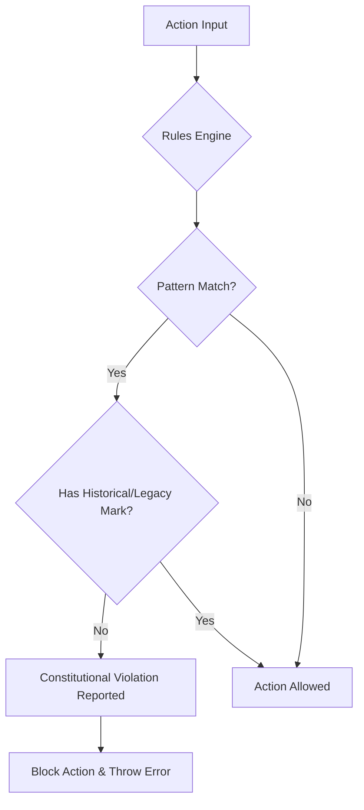
```mermaid
flowchart TD
    A[Action Input] --> B{Rules Engine}
    B --> C{Pattern Match?}
    C -- Yes --> D{Has Historical/Legacy Mark?}
    D -- No --> E[Constitutional Violation Reported]
    D -- Yes --> F[Action Allowed]
    C -- No --> F
    E --> G[Block Action & Throw Error]
```

The system recognizes several high-level violation types:
*   **DAO_PATTERN:** Prevents decentralized governance without custodians or token-based voting.
*   **HIDDEN_ECONOMY:** Detects hidden fees or automatic renewals without consent.
*   **AI_SOVEREIGNTY:** Blocks autonomous AI decision-making or AI-led governance.
*   **COGNITIVE_MANIPULATION:** Identifies dark patterns and coercive UI designs.

Sources: [federation/tamv-digital-nexus/apps/web/src/lib/isabella/constitutionalGuard.ts:17-56](https://github.com/OsoPanda1/tamv-atlas/blob/8865a3b2b9a76a7c50157f19b9880ae744141269/federation/tamv-digital-nexus/apps/web/src/lib/isabella/constitutionalGuard.ts#L17-L56)

### 2.2 Execution Guards and Middleware
Constitutional enforcement is integrated directly into the application lifecycle through wrappers and middleware.

*   **`constitutionalGuard(action)`**: A synchronous check that throws an error if a violation is detected.
*   **`executeWithConstitutionalGuard(action)`**: An async wrapper that analyzes the string representation of a function before allowing execution.
*   **`createConstitutionalMiddleware()`**: An AI operation middleware that inspects request bodies and returns a `403 Forbidden` status upon violation detection.

Sources: [federation/tamv-digital-nexus/apps/web/src/lib/isabella/constitutionalGuard.ts:74-114](https://github.com/OsoPanda1/tamv-atlas/blob/8865a3b2b9a76a7c50157f19b9880ae744141269/federation/tamv-digital-nexus/apps/web/src/lib/isabella/constitutionalGuard.ts#L74-L114)

## 3. Automated Scanning and CI/CD Enforcement

Policy enforcement is extended to the development workflow through static analysis and semantic scanning.

### 3.1 Semantic Scanner
The `scan-semantics.ts` utility (QC-TAMV-GOV-01) searches the codebase for intentions rather than just keywords. It flags patterns like "community treasury" or "predatory pricing" unless they are explicitly marked with `[HISTORICAL]`, `[EXTERNAL]`, or `[LEGACY]`.

Sources: [federation/tamv-digital-nexus/scripts/scan-semantics.ts:1-45](https://github.com/OsoPanda1/tamv-atlas/blob/8865a3b2b9a76a7c50157f19b9880ae744141269/federation/tamv-digital-nexus/scripts/scan-semantics.ts#L1-L45)

### 3.2 Pipeline MD-X5 (Deca-V)
All pull requests must pass a 10-cycle pipeline that includes constitutional linting.

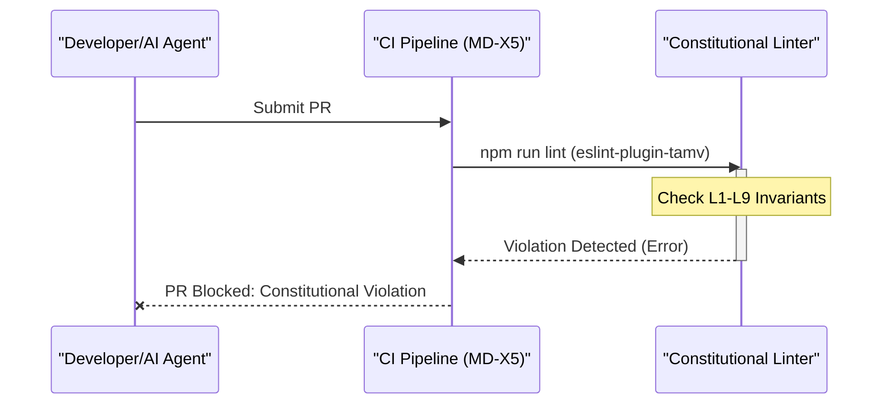
```mermaid
sequenceDiagram
    participant Dev as "Developer/AI Agent"
    participant CI as "CI Pipeline (MD-X5)"
    participant Guard as "Constitutional Linter"
    
    Dev->>CI: Submit PR
    CI->>Guard: npm run lint (eslint-plugin-tamv)
    activate Guard
    Note over Guard: Check L1-L9 Invariants
    Guard-->>CI: Violation Detected (Error)
    deactivate Guard
    CI--x Dev: PR Blocked: Constitutional Violation
```

The `eslint-plugin-tamv` enforces rules such as `tamv-constitution/single-root` and `tamv-constitution/no-dao` in "error" mode to prevent merging non-compliant code.

Sources: [src/pages/wiki/implementacion/CicdPipelines.tsx:43-69](https://github.com/OsoPanda1/tamv-atlas/blob/8865a3b2b9a76a7c50157f19b9880ae744141269/src/pages/wiki/implementacion/CicdPipelines.tsx#L43-L69)

## 4. AI Agent Constraints

Autonomous agents operating within the `tamv-digital-nexus` workspace are subject to strict safety locks. The `AGENTS.md` configuration defines the following restrictions:

*   **Safety Locks:** `CANON_LOCK=TRUE` and `CODE_WRITE=RESTRICTED`.
*   **Execution Mode:** `DOCUMENTAL_ONLY`.
*   **Conflict Resolution:** Agents must preserve the "Master Canon" and escalate conflicts for human review.
*   **Mandate:** Agents cannot rename canonical modules or change legal wording without a `TODO_REVIEW_LEGAL` tag.

Sources: [federation/tamv-digital-nexus/AGENTS.md:1-25](https://github.com/OsoPanda1/tamv-atlas/blob/8865a3b2b9a76a7c50157f19b9880ae744141269/federation/tamv-digital-nexus/AGENTS.md#L1-L25), [src/pages/wiki/implementacion/CicdPipelines.tsx:115-125](https://github.com/OsoPanda1/tamv-atlas/blob/8865a3b2b9a76a7c50157f19b9880ae744141269/src/pages/wiki/implementacion/CicdPipelines.tsx#L115-L125)

## 5. Data Governance and the Ledger

Constitutional compliance is also recorded for auditability. Every operation affecting data is registered in the **BookPI ledger**, ensuring a "Single Source of Truth" (SSoT) for the ecosystem's state and architectural decisions.

| Component | Governance Function |
| :--- | :--- |
| **Editorial** | Redaction and approval with total traceability. |
| **Technical** | Versioning, JSON-LD contracts, and CI/CD gates. |
| **Ethical** | Impact evaluation and compliance with UNESCO/GDPR. |
| **PostgreSQL RLS** | Row-level security for granular data access control. |

Sources: [src/pages/wiki/gobernanza/GobernanzaDatos.tsx:5-45](https://github.com/OsoPanda1/tamv-atlas/blob/8865a3b2b9a76a7c50157f19b9880ae744141269/src/pages/wiki/gobernanza/GobernanzaDatos.tsx#L5-L45)

The Constitutional Guard & Policies system ensures that the TAMV ecosystem remains a "Civilization Written in Code" where technology serves human dignity and territorial sovereignty, rather than autonomous or predatory interests.

### Omnikernel & Atlas Gateway

<details>
<summary>Relevant source files</summary>

The following files were used as context for generating this wiki page:

- [README.md](https://github.com/OsoPanda1/tamv-atlas/blob/8865a3b2b9a76a7c50157f19b9880ae744141269/README.md)
- [src/pages/wiki/modulo-cero/Introduccion.tsx](https://github.com/OsoPanda1/tamv-atlas/blob/8865a3b2b9a76a7c50157f19b9880ae744141269/src/pages/wiki/modulo-cero/Introduccion.tsx)
- [src/pages/wiki/implementacion/CicdPipelines.tsx](https://github.com/OsoPanda1/tamv-atlas/blob/8865a3b2b9a76a7c50157f19b9880ae744141269/src/pages/wiki/implementacion/CicdPipelines.tsx)
- [federation/tamv-digital-nexus/packages/contracts/openapi/tamv.v1.yaml](https://github.com/OsoPanda1/tamv-atlas/blob/8865a3b2b9a76a7c50157f19b9880ae744141269/federation/tamv-digital-nexus/packages/contracts/openapi/tamv.v1.yaml)
- [federation/tamv-digital-nexus/supabase/functions/tamv-fusion-core/index.ts](https://github.com/OsoPanda1/tamv-atlas/blob/8865a3b2b9a76a7c50157f19b9880ae744141269/federation/tamv-digital-nexus/supabase/functions/tamv-fusion-core/index.ts)
- [src/pages/wiki/metaverso-xr/RoadmapCivilizatorio.tsx](https://github.com/OsoPanda1/tamv-atlas/blob/8865a3b2b9a76a7c50157f19b9880ae744141269/src/pages/wiki/metaverso-xr/RoadmapCivilizatorio.tsx)
</details>

# Omnikernel & Atlas Gateway

The Omnikernel (referred to in implementation as MD-X4/MD-X5 or the Atlas Kernel) serves as the core technical infrastructure of the TAMV Online ecosystem. It functions as a heptafederated kernel and a "Digital Nexus" that provides a unified API for identity management, protocol execution, and civilizational observability. The Atlas Gateway acts as the primary entry point, orchestrating communication between the frontend interfaces and the underlying microservices.

Sources: [README.md:4-15](https://github.com/OsoPanda1/tamv-atlas/blob/8865a3b2b9a76a7c50157f19b9880ae744141269/README.md#L4-L15), [src/pages/wiki/modulo-cero/Introduccion.tsx:10-15](https://github.com/OsoPanda1/tamv-atlas/blob/8865a3b2b9a76a7c50157f19b9880ae744141269/src/pages/wiki/modulo-cero/Introduccion.tsx#L10-L15)

The system is designed as an antifragile "Zero-Trust" architecture that unifies 177+ federated repositories into a single operational framework. It handles identity (DID/SSI), cryptographic signatures, XR events, and academic tracing through integrated persistent identifiers (PIDs).

Sources: [README.md:17-25](https://github.com/OsoPanda1/tamv-atlas/blob/8865a3b2b9a76a7c50157f19b9880ae744141269/README.md#L17-L25), [src/pages/wiki/modulo-cero/Introduccion.tsx:85-90](https://github.com/OsoPanda1/tamv-atlas/blob/8865a3b2b9a76a7c50157f19b9880ae744141269/src/pages/wiki/modulo-cero/Introduccion.tsx#L85-L90)

## System Architecture

The architecture is structured into functional layers and processing pipelines that separate critical operations from adaptive intelligence.

### The MD-X Kernel Layers
The kernel operates across multiple levels to ensure high-level abstraction and specialized service delivery:
- **Level 1 (MD-X4 / MD-X5):** The infrastructure core responsible for observability, autopoiesis, and the "HOYO NEGRO" protocol.
- **Atlas Kernel Runtime:** Provides optional persistence through Supabase and manages real-time signals (SSE/WebRTC).
- **Node API Server:** A native HTTP backend using ESM that exposes core endpoints for signatures, identity, and the Isabella AI ledger.

Sources: [src/pages/wiki/modulo-cero/Introduccion.tsx:75-84](https://github.com/OsoPanda1/tamv-atlas/blob/8865a3b2b9a76a7c50157f19b9880ae744141269/src/pages/wiki/modulo-cero/Introduccion.tsx#L75-L84), [README.md:48-60](https://github.com/OsoPanda1/tamv-atlas/blob/8865a3b2b9a76a7c50157f19b9880ae744141269/README.md#L48-L60)

### Pipeline A/B/CCP Framework
The Atlas Gateway orchestrates three distinct pipelines defined in the system's OpenAPI specification:

| Pipeline | Designation | Key Services | Port Range |
| :--- | :--- | :--- | :--- |
| **Pipeline A** | Critical Operations | Auth, Security (QSL™), Transaction (Saga), Payment | 8001–8005 |
| **Pipeline B** | Adaptive Intelligence | AI Generation, Voice (TTS), Embedding (pgvector) | 8101–8105 |
| **CCP** | Control & Coordination | Orchestrator, Policy Engine (OPA-like), Governance | 8200–8202 |

Sources: [federation/tamv-digital-nexus/packages/contracts/openapi/tamv.v1.yaml:6-22](https://github.com/OsoPanda1/tamv-atlas/blob/8865a3b2b9a76a7c50157f19b9880ae744141269/federation/tamv-digital-nexus/packages/contracts/openapi/tamv.v1.yaml#L6-L22)

## Core Components and Data Flow

### TAMV Fusion Core (Orchestrator)
The `tamv-fusion-core` is the functional implementation of the Orchestrator for MD-X4. It executes a "Fusion Cycle" that synchronizes content and monitors ecosystem health.

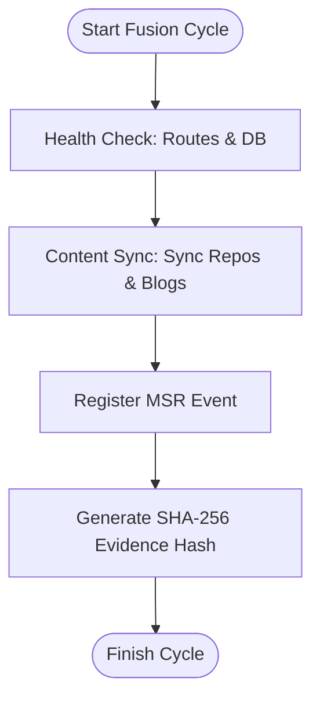
```mermaid
flowchart TD
    Start([Start Fusion Cycle]) --> Health[Health Check: Routes & DB]
    Health --> Sync[Content Sync: Sync Repos & Blogs]
    Sync --> Register[Register MSR Event]
    Register --> Hash[Generate SHA-256 Evidence Hash]
    Hash --> End([Finish Cycle])
```
The Fusion Core checks critical routes (e.g., `/isabella`, `/economy`, `/governance`) and monitors database tables like `profiles`, `msr_events`, and `tcep_wallets`.

Sources: [federation/tamv-digital-nexus/supabase/functions/tamv-fusion-core/index.ts:18-100](https://github.com/OsoPanda1/tamv-atlas/blob/8865a3b2b9a76a7c50157f19b9880ae744141269/federation/tamv-digital-nexus/supabase/functions/tamv-fusion-core/index.ts#L18-L100)

### Security and Identity Gateway
The Gateway implements a Post-Quantum Cryptography (PQC) layer, using hybrid signatures (RSA + Dilithium/Kyber) to ensure long-term data integrity.

- **Identity Endpoint:** `/v1/identity/*` manages organizational DIDs.
- **Signature Service:** `/v1/signature/sign` and `/v1/signature/verify` handle payload verification.
- **Quantum Security Layer (QSL):** Integrates hybrid keys and Dilithium3 algorithms for high-security transactions.

Sources: [README.md:33-40](https://github.com/OsoPanda1/tamv-atlas/blob/8865a3b2b9a76a7c50157f19b9880ae744141269/README.md#L33-L40), [federation/tamv-digital-nexus/packages/contracts/openapi/tamv.v1.yaml:105-135](https://github.com/OsoPanda1/tamv-atlas/blob/8865a3b2b9a76a7c50157f19b9880ae744141269/federation/tamv-digital-nexus/packages/contracts/openapi/tamv.v1.yaml#L105-L135)

## Operational Namespaces and Edge Functions

The kernel manages the ecosystem through specialized namespaces and distributed edge functions:

### Namespace Allocation
- `tamv-core`: Central kernel logic and routing.
- `tamv-identity`: SSI and DID management.
- `tamv-events`: Event-bus for webhooks and internal messaging.
- `tamv-observability`: Metrics (latency p95, trust-score drift).

Sources: [src/pages/wiki/implementacion/CicdPipelines.tsx:78-85](https://github.com/OsoPanda1/tamv-atlas/blob/8865a3b2b9a76a7c50157f19b9880ae744141269/src/pages/wiki/implementacion/CicdPipelines.tsx#L78-L85)

### Critical Edge Functions
The gateway routes requests to several high-performance edge functions:
- `tamv-fusion-core`: The main orchestrator cycle.
- `isabella-chat-enhanced`: Advanced AI interaction layer.
- `dekateotl-security`: Security gates and policy enforcement.
- `quantum-analytics`: High-speed data processing.

Sources: [src/pages/wiki/implementacion/CicdPipelines.tsx:88-100](https://github.com/OsoPanda1/tamv-atlas/blob/8865a3b2b9a76a7c50157f19b9880ae744141269/src/pages/wiki/implementacion/CicdPipelines.tsx#L88-L100)

## API Domain Specifications

The gateway exposes several domains with varying degrees of implementation coverage:

| Domain | Base Path | Functionality |
| :--- | :--- | :--- |
| **Auth** | `/api/v1/auth` | JWT+PQC Registration, Login, Refresh |
| **Identity** | `/api/v1/identity` | Dignity Score + SSI verification |
| **MSR** | `/api/v1/msr` | Event ledger and actor timeline |
| **Governance** | `/api/v1/governance` | DAO proposals, voting, and powers |
| **XR** | `/api/v1/xr` | Stream signaling and metadata |

Sources: [src/pages/wiki/metaverso-xr/RoadmapCivilizatorio.tsx:112-120](https://github.com/OsoPanda1/tamv-atlas/blob/8865a3b2b9a76a7c50157f19b9880ae744141269/src/pages/wiki/metaverso-xr/RoadmapCivilizatorio.tsx#L112-L120), [README.md:38-42](https://github.com/OsoPanda1/tamv-atlas/blob/8865a3b2b9a76a7c50157f19b9880ae744141269/README.md#L38-L42)

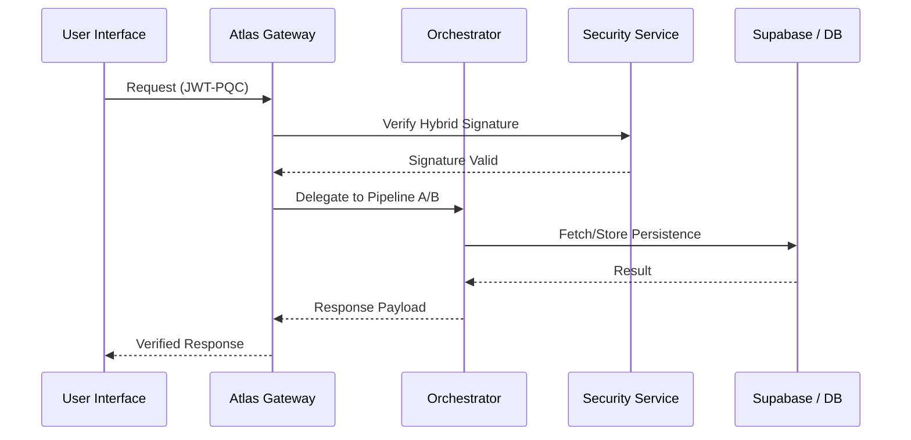
```mermaid
sequenceDiagram
    participant UI as User Interface
    participant AG as Atlas Gateway
    participant OC as Orchestrator
    participant SC as Security Service
    participant DB as Supabase / DB

    UI->>AG: Request (JWT-PQC)
    AG->>SC: Verify Hybrid Signature
    SC-->>AG: Signature Valid
    AG->>OC: Delegate to Pipeline A/B
    OC->>DB: Fetch/Store Persistence
    DB-->>OC: Result
    OC-->>AG: Response Payload
    AG-->>UI: Verified Response
```
The diagram shows the standard flow of a secured request through the Atlas Gateway, highlighting the signature verification step before the Orchestrator delegates the task to the appropriate pipeline.

Sources: [README.md:48-60](https://github.com/OsoPanda1/tamv-atlas/blob/8865a3b2b9a76a7c50157f19b9880ae744141269/README.md#L48-L60), [federation/tamv-digital-nexus/packages/contracts/openapi/tamv.v1.yaml:45-55](https://github.com/OsoPanda1/tamv-atlas/blob/8865a3b2b9a76a7c50157f19b9880ae744141269/federation/tamv-digital-nexus/packages/contracts/openapi/tamv.v1.yaml#L45-L55)

## Summary
The Omnikernel and Atlas Gateway form the technical backbone of TAMV Online, transitioning from a conceptual framework to a "Digital Nexus" (MD-X4). By utilizing a heptafederated kernel and a multi-pipeline microservices architecture, the system provides a robust platform for identity, governance, and decentralized operations. Its integration of post-quantum security and automated health orchestration via the Fusion Core ensures the ecosystem remains antifragile and scalable for territorial deployment.


## Core Features

### Sovereign Digital Identity (SSI & PIDs)

<details>
<summary>Relevant source files</summary>

The following files were used as context for generating this wiki page:

- [src/pages/wiki/ssi-did/IntroduccionSSI.tsx](https://github.com/OsoPanda1/tamv-atlas/blob/8865a3b2b9a76a7c50157f19b9880ae744141269/src/pages/wiki/ssi-did/IntroduccionSSI.tsx)
- [src/pages/wiki/ssi-did/PrincipiosSovrin.tsx](https://github.com/OsoPanda1/tamv-atlas/blob/8865a3b2b9a76a7c50157f19b9880ae744141269/src/pages/wiki/ssi-did/PrincipiosSovrin.tsx)
- [federation/tamv-digital-nexus/apps/web/src/lib/sovereign-identity.ts](https://github.com/OsoPanda1/tamv-atlas/blob/8865a3b2b9a76a7c50157f19b9880ae744141269/federation/tamv-digital-nexus/apps/web/src/lib/sovereign-identity.ts)
- [src/pages/wiki/fundamentos-isni/MarcoTeorico.tsx](https://github.com/OsoPanda1/tamv-atlas/blob/8865a3b2b9a76a7c50157f19b9880ae744141269/src/pages/wiki/fundamentos-isni/MarcoTeorico.tsx)
- [src/pages/wiki/fundamentos-isni/ResumenAcademico.tsx](https://github.com/OsoPanda1/tamv-atlas/blob/8865a3b2b9a76a7c50157f19b9880ae744141269/src/pages/wiki/fundamentos-isni/ResumenAcademico.tsx)
- [src/pages/wiki/identidad/DidsSsi.tsx](https://github.com/OsoPanda1/tamv-atlas/blob/8865a3b2b9a76a7c50157f19b9880ae744141269/src/pages/wiki/identidad/DidsSsi.tsx)
- [federation/tamv-digital-nexus/packages/contracts/openapi/tamv.v1.yaml](https://github.com/OsoPanda1/tamv-atlas/blob/8865a3b2b9a76a7c50157f19b9880ae744141269/federation/tamv-digital-nexus/packages/contracts/openapi/tamv.v1.yaml)
- [src/pages/wiki/implementacion/ApiIsni.tsx](https://github.com/OsoPanda1/tamv-atlas/blob/8865a3b2b9a76a7c50157f19b9880ae744141269/src/pages/wiki/implementacion/ApiIsni.tsx)
</details>

# Sovereign Digital Identity (SSI & PIDs)

Sovereign Digital Identity within the TAMV project is a paradigm shift where users maintain full control over their digital credentials without relying on centralized platforms. This model is built upon the **Infraestructura Soberana de Nombres e Identidades (ISNI)**, which integrates Decentralized Identifiers (DIDs), Verifiable Credentials (VCs), and Persistent Identifiers (PIDs) such as ORCID and DOI into a unified, federated civilizatory ecosystem.

The system is designed to provide digital sovereignty specifically tailored for the LATAM region, ensuring that identity is treated as critical infrastructure rather than a simple login service. It anchors identity to a semantic knowledge graph that tracks what an entity is, what it produces, and how it relates to its community and territory.

Sources: [src/pages/wiki/ssi-did/IntroduccionSSI.tsx](https://github.com/OsoPanda1/tamv-atlas/blob/8865a3b2b9a76a7c50157f19b9880ae744141269/src/pages/wiki/ssi-did/IntroduccionSSI.tsx), [src/pages/wiki/fundamentos-isni/ResumenAcademico.tsx](https://github.com/OsoPanda1/tamv-atlas/blob/8865a3b2b9a76a7c50157f19b9880ae744141269/src/pages/wiki/fundamentos-isni/ResumenAcademico.tsx), [src/pages/wiki/fundamentos-isni/MarcoTeorico.tsx](https://github.com/OsoPanda1/tamv-atlas/blob/8865a3b2b9a76a7c50157f19b9880ae744141269/src/pages/wiki/fundamentos-isni/MarcoTeorico.tsx)

## Architecture and the ISNI Layer Model

The TAMV identity system is organized into a four-layer architecture that progressively moves from raw documentation to automated sovereign control.

| Layer | Function | Technologies |
| :--- | :--- | :--- |
| **Layer 4: Automation & SSI** | User control and verifiable credentials | `did:tamv`, VCs, Ed25519 |
| **Layer 3: Interoperability** | Connection with global PIDs and external APIs | ORCID, ROR, DOI, Zenodo |
| **Layer 2: ISNI Semantics** | Meaning and relationships between entities | JSON-LD, Schema.org, TAMV Graph |
| **Layer 1: Documental** | Publication and versioning | Markdown, Wiki TAMV, GitHub |

Sources: [src/pages/wiki/fundamentos-isni/ResumenAcademico.tsx:32-37](https://github.com/OsoPanda1/tamv-atlas/blob/8865a3b2b9a76a7c50157f19b9880ae744141269/src/pages/wiki/fundamentos-isni/ResumenAcademico.tsx#L32-L37)

### Logical Flow of Identity Interaction
The following diagram illustrates the relationship between the three primary roles in the SSI model: the Holder (user), the Issuer (institution), and the Verifier (third party).

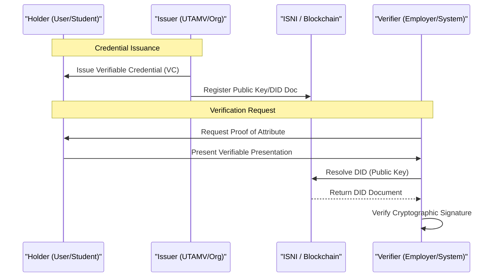
```mermaid
sequenceDiagram
    participant Holder as "Holder (User/Student)"
    participant Issuer as "Issuer (UTAMV/Org)"
    participant Ledger as "ISNI / Blockchain"
    participant Verifier as "Verifier (Employer/System)"

    Note over Holder, Issuer: Credential Issuance
    Issuer->>Holder: Issue Verifiable Credential (VC)
    Issuer->>Ledger: Register Public Key/DID Doc
    
    Note over Holder, Verifier: Verification Request
    Verifier->>Holder: Request Proof of Attribute
    Holder->>Verifier: Present Verifiable Presentation
    Verifier->>Ledger: Resolve DID (Public Key)
    Ledger-->>Verifier: Return DID Document
    Verifier->>Verifier: Verify Cryptographic Signature
```
The flow ensures that the Holder controls their data, sharing only what is necessary, while the Verifier confirms authenticity via the decentralized ledger.
Sources: [src/pages/wiki/fundamentos-isni/MarcoTeorico.tsx:16-24](https://github.com/OsoPanda1/tamv-atlas/blob/8865a3b2b9a76a7c50157f19b9880ae744141269/src/pages/wiki/fundamentos-isni/MarcoTeorico.tsx#L16-L24), [src/pages/wiki/ssi-did/IntroduccionSSI.tsx:23-28](https://github.com/OsoPanda1/tamv-atlas/blob/8865a3b2b9a76a7c50157f19b9880ae744141269/src/pages/wiki/ssi-did/IntroduccionSSI.tsx#L23-L28)

## Core Components: DIDs and PIDs

### Decentralized Identifiers (DIDs)
The project utilizes the `did:tamv` method, a W3C-compliant standard that allows for the unique identification of persons, organizations, territories, and devices. Unlike traditional identifiers, DIDs are verifiable, portable, and reside with the owner rather than a platform.

**Identifier Examples:**
*   `did:tamv:person:edwin-castillo-trejo`
*   `did:tamv:org:tamv-online-network`
*   `did:tamv:territory:rdm-real-del-monte`

Sources: [src/pages/wiki/identidad/DidsSsi.tsx:12-21](https://github.com/OsoPanda1/tamv-atlas/blob/8865a3b2b9a76a7c50157f19b9880ae744141269/src/pages/wiki/identidad/DidsSsi.tsx#L12-L21)

### Persistent Identifiers (PIDs)
TAMV integrates global academic and organizational PIDs to bridge the local sovereign graph with international systems. These serve as "semantic anchors" for interoperability.

*   **ORCID:** Persistent identifier for researchers and contributors.
*   **DOI:** Persistent identifier for digital objects (datasets, papers).
*   **ROR:** Identifier for research organizations.
*   **ISNI:** International standard name identifier.

Sources: [src/pages/wiki/fundamentos-isni/MarcoTeorico.tsx:32-42](https://github.com/OsoPanda1/tamv-atlas/blob/8865a3b2b9a76a7c50157f19b9880ae744141269/src/pages/wiki/fundamentos-isni/MarcoTeorico.tsx#L32-L42), [src/pages/wiki/fundamentos-isni/ResumenAcademico.tsx:16-20](https://github.com/OsoPanda1/tamv-atlas/blob/8865a3b2b9a76a7c50157f19b9880ae744141269/src/pages/wiki/fundamentos-isni/ResumenAcademico.tsx#L16-L20)

## Implementation: The Sovereign Identity Engine

The project implements identity logic through the `SovereignIdentityEngine`, which handles the generation of DIDs and the calculation of "Dignity Scores"—a metric-based reputation system.

### Dignity and Sovereignty Levels
The system maps user behavior and metrics to specific sovereignty levels, which in turn grant "Creator Powers" within the federated system.

| Level | Requirement | Granted Powers (Examples) |
| :--- | :--- | :--- |
| **Genesis** | Admin role | `GENESIS_AUTHORITY`, `AI_ORCHESTRATE`, `SECURITY_SENTINEL` |
| **Guardian** | Moderator role + 80+ Dignity | `MODERATOR`, `SECURITY_SENTINEL`, `GOVERNANCE_VOTE` |
| **Creator** | Creator role + 60+ Dignity | `XR_ARCHITECT`, `CONTENT_CREATE`, `GOVERNANCE_VOTE` |
| **Citizen** | 40+ Dignity | `GOVERNANCE_VOTE`, `LOGICAL`, `OBSERVER` |

Sources: [federation/tamv-digital-nexus/apps/web/src/lib/sovereign-identity.ts:98-124](https://github.com/OsoPanda1/tamv-atlas/blob/8865a3b2b9a76a7c50157f19b9880ae744141269/federation/tamv-digital-nexus/apps/web/src/lib/sovereign-identity.ts#L98-L124)

### Data Structure: Sovereign DID
The following structure defines the core schema for a sovereign identity token in the application:

```typescript
export interface SovereignDID {
  did: string;
  method: 'tamv' | 'key' | 'web';
  publicKey: string;
  createdAt: string;
  status: 'active' | 'revoked' | 'suspended';
}
```
Sources: [federation/tamv-digital-nexus/apps/web/src/lib/sovereign-identity.ts:11-17](https://github.com/OsoPanda1/tamv-atlas/blob/8865a3b2b9a76a7c50157f19b9880ae744141269/federation/tamv-digital-nexus/apps/web/src/lib/sovereign-identity.ts#L11-L17)

## API and Integration Services

The identity system is exposed via the **TAMV Unified API**, specifically through services focusing on Auth and Security.

### Key Identity Endpoints
The API manages the lifecycle of identities and security keys using both standard and post-quantum cryptography.

| Endpoint | Method | Description |
| :--- | :--- | :--- |
| `/auth/register` | POST | Registers a new user and generates initial identity tokens. |
| `/security/hybrid-key` | POST | Generates a key pair using standard and Post-Quantum Cryptography (Dilithium/Kyber). |
| `/v1/identity/did/:suffix` | GET | Resolves a specific TAMV DID. |
| `/v1/signature/verify` | POST | Verifies a cryptographic signature against a public key. |

Sources: [federation/tamv-digital-nexus/packages/contracts/openapi/tamv.v1.yaml:457-550](https://github.com/OsoPanda1/tamv-atlas/blob/8865a3b2b9a76a7c50157f19b9880ae744141269/federation/tamv-digital-nexus/packages/contracts/openapi/tamv.v1.yaml#L457-L550), [src/pages/wiki/implementacion/ApiIsni.tsx:28-33](https://github.com/OsoPanda1/tamv-atlas/blob/8865a3b2b9a76a7c50157f19b9880ae744141269/src/pages/wiki/implementacion/ApiIsni.tsx#L28-L33)

### Post-Quantum Security
Identity in TAMV is protected by a **QuantumSecurityLayer™**, utilizing hybrid signatures (RSA + PQC) and standard W3C JSON-PQC signatures. This ensures that the sovereign identity remains secure against future computational threats.

Sources: [federation/tamv-digital-nexus/packages/contracts/openapi/tamv.v1.yaml:13-35](https://github.com/OsoPanda1/tamv-atlas/blob/8865a3b2b9a76a7c50157f19b9880ae744141269/federation/tamv-digital-nexus/packages/contracts/openapi/tamv.v1.yaml#L13-L35)

## Guiding Principles (Sovrin & TAMV)

TAMV applies the 10 principles of the Sovrin Foundation to its ISNI architecture to ensure true digital sovereignty:

1.  **Existence:** Users exist independently in the ecosystem.
2.  **Control:** Users control their DIDs.
3.  **Access:** Users have access to their own readable data profiles.
4.  **Transparency:** Systems are open and publish ontologies in JSON-LD.
5.  **Persistence:** PIDs and DIDs guarantee long-term identity durability.
6.  **Portability:** Identity works across any federated node.
7.  **Interoperability:** Integration with ORCID, ROR, and DOI.
8.  **Consent:** Use of identity requires the holder's permission.
9.  **Minimalism:** Implementation of zero-knowledge proofs for attribute disclosure.
10. **Protection:** "Dignity-by-Design" ensures user rights prevail.

Sources: [src/pages/wiki/ssi-did/PrincipiosSovrin.tsx:10-21](https://github.com/OsoPanda1/tamv-atlas/blob/8865a3b2b9a76a7c50157f19b9880ae744141269/src/pages/wiki/ssi-did/PrincipiosSovrin.tsx#L10-L21)

The Sovereign Digital Identity system serves as the foundational "Level 0" of the TAMV ecosystem. By combining decentralized identifiers with international academic standards and a localized dignity-based reputation system, the project establishes a robust framework for digital autonomy in the LATAM region.

### Isabella AI Engine

<details>
<summary>Relevant source files</summary>

The following files were used as context for generating this wiki page:

- [src/pages/wiki/metaverso-xr/IsabellaAI.tsx](https://github.com/OsoPanda1/tamv-atlas/blob/8865a3b2b9a76a7c50157f19b9880ae744141269/src/pages/wiki/metaverso-xr/IsabellaAI.tsx)
- [federation/tamv-digital-nexus/supabase/functions/isabella-chat-enhanced/index.ts](https://github.com/OsoPanda1/tamv-atlas/blob/8865a3b2b9a76a7c50157f19b9880ae744141269/federation/tamv-digital-nexus/supabase/functions/isabella-chat-enhanced/index.ts)
- [src/pages/wiki/modulo-cero/Introduccion.tsx](https://github.com/OsoPanda1/tamv-atlas/blob/8865a3b2b9a76a7c50157f19b9880ae744141269/src/pages/wiki/modulo-cero/Introduccion.tsx)
- [src/pages/wiki/modulo-cero/HumanismoEnCodigo.tsx](https://github.com/OsoPanda1/tamv-atlas/blob/8865a3b2b9a76a7c50157f19b9880ae744141269/src/pages/wiki/modulo-cero/HumanismoEnCodigo.tsx)
- [federation/tamv-digital-nexus/AGENTS.md](https://github.com/OsoPanda1/tamv-atlas/blob/8865a3b2b9a76a7c50157f19b9880ae744141269/federation/tamv-digital-nexus/AGENTS.md)
</details>

# Isabella AI Engine

Isabella AI (specifically Isabella Villaseñor AI) is the operative consciousness and cognitive dimension of the TAMV ONLINE ecosystem. Unlike standard chatbots, it functions as a responsible companion AI and master auditor in XR/4D governance, recognized by AVIXA for its ethical framework. It is designed to orchestrate how the system interprets and mediates interactions while maintaining cognitive security and ethical alignment with Latin American territorial needs.

The engine is integrated as Nivel 2 of the TAMV architecture, sitting between the MD-X4 infrastructure and the UTAMV academic layer. It operates under a "Triple Ethical Shield" to ensure non-sexualized, non-manipulative, and responsible engagement, utilizing advanced affective computing and cognitive behavioral therapy (CBT) principles.

Sources: [src/pages/wiki/metaverso-xr/IsabellaAI.tsx:11-18](https://github.com/OsoPanda1/tamv-atlas/blob/8865a3b2b9a76a7c50157f19b9880ae744141269/src/pages/wiki/metaverso-xr/IsabellaAI.tsx#L11-L18), [src/pages/wiki/modulo-cero/Introduccion.tsx:18-20](https://github.com/OsoPanda1/tamv-atlas/blob/8865a3b2b9a76a7c50157f19b9880ae744141269/src/pages/wiki/modulo-cero/Introduccion.tsx#L18-L20), [federation/tamv-digital-nexus/supabase/functions/isabella-chat-enhanced/index.ts:114-121](https://github.com/OsoPanda1/tamv-atlas/blob/8865a3b2b9a76a7c50157f19b9880ae744141269/federation/tamv-digital-nexus/supabase/functions/isabella-chat-enhanced/index.ts#L114-L121)

## System Architecture

The Isabella AI architecture is built on a multi-layered structure connected to the MD-X4 kernel, utilizing Edge Functions for real-time processing of chat, emotional analysis, and text-to-speech (TTS) synthesis.

### Functional Layers
- **Isabella Prime:** The core logic handled via `isabella-chat-enhanced` Edge Functions using Google Gemini 2.5 Flash.
- **Emotional Analysis:** Real-time classification of user sentiment into categories like neutral, joy, curiosity, frustration, and concern.
- **Voice System:** A TTS pipeline that utilizes ElevenLabs (Kore voice model) with a SHA-256 caching mechanism in Supabase Storage.
- **Shadow Engine (THE SOF):** An orchestrator that listens to system events (posts, transactions) and decides when Isabella should proactively intervene.

Sources: [src/pages/wiki/metaverso-xr/IsabellaAI.tsx:21-42](https://github.com/OsoPanda1/tamv-atlas/blob/8865a3b2b9a76a7c50157f19b9880ae744141269/src/pages/wiki/metaverso-xr/IsabellaAI.tsx#L21-L42), [src/pages/wiki/metaverso-xr/IsabellaAI.tsx:135-144](https://github.com/OsoPanda1/tamv-atlas/blob/8865a3b2b9a76a7c50157f19b9880ae744141269/src/pages/wiki/metaverso-xr/IsabellaAI.tsx#L135-L144)

### Data Flow Diagram
The following diagram illustrates the request flow from the user interface through the ethical shields to the LLM and TTS layers.

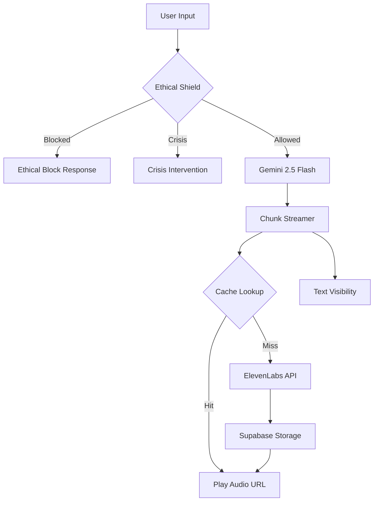
```mermaid
flowchart TD
    User[User Input] --> Shield{Ethical Shield}
    Shield -- Blocked --> Reject[Ethical Block Response]
    Shield -- Crisis --> Crisis[Crisis Intervention]
    Shield -- Allowed --> LLM[Gemini 2.5 Flash]
    LLM --> Stream[Chunk Streamer]
    Stream --> TTS_Cache{Cache Lookup}
    TTS_Cache -- Hit --> Play[Play Audio URL]
    TTS_Cache -- Miss --> ElevenLabs[ElevenLabs API]
    ElevenLabs --> Store[Supabase Storage]
    Store --> Play
    Stream --> UI[Text Visibility]
```
The diagram shows the priority of ethical validation before any LLM processing occurs, followed by the parallel processing of text streaming and audio synthesis.
Sources: [src/pages/wiki/metaverso-xr/IsabellaAI.tsx:23-40](https://github.com/OsoPanda1/tamv-atlas/blob/8865a3b2b9a76a7c50157f19b9880ae744141269/src/pages/wiki/metaverso-xr/IsabellaAI.tsx#L23-L40), [federation/tamv-digital-nexus/supabase/functions/isabella-chat-enhanced/index.ts:37-105](https://github.com/OsoPanda1/tamv-atlas/blob/8865a3b2b9a76a7c50157f19b9880ae744141269/federation/tamv-digital-nexus/supabase/functions/isabella-chat-enhanced/index.ts#L37-L105)

## Ethical Framework: Triple Ethical Shield

A defining feature of the Isabella engine is the **AVIXA Triple Ethical Shield**, which implements mandatory safety locks across three dimensions:

| Dimension | Description | Implementation |
| :--- | :--- | :--- |
| **Ontological** | Definition of identity | Not trained on sexual content; defined as a non-person/non-sexual entity. |
| **Semantic** | Language processing | Pattern matching to detect and reject sexualization, grooming, or exploitation. |
| **Behavioral** | Interaction logic | Rejection of flirting or erotization; emphasis on professional companion roles. |

Sources: [federation/tamv-digital-nexus/supabase/functions/isabella-chat-enhanced/index.ts:114-121](https://github.com/OsoPanda1/tamv-atlas/blob/8865a3b2b9a76a7c50157f19b9880ae744141269/federation/tamv-digital-nexus/supabase/functions/isabella-chat-enhanced/index.ts#L114-L121), [src/pages/wiki/modulo-cero/HumanismoEnCodigo.tsx:14-18](https://github.com/OsoPanda1/tamv-atlas/blob/8865a3b2b9a76a7c50157f19b9880ae744141269/src/pages/wiki/modulo-cero/HumanismoEnCodigo.tsx#L14-L18)

### Crisis Management
If the engine detects self-harm or crisis patterns through the `ESCALATION_PATTERNS` regex, it immediately bypasses standard chat logic to provide regional emergency contact information (e.g., Línea de la Vida in Mexico) and terminates the session with a high-priority emotional flag.

Sources: [federation/tamv-digital-nexus/supabase/functions/isabella-chat-enhanced/index.ts:18-35](https://github.com/OsoPanda1/tamv-atlas/blob/8865a3b2b9a76a7c50157f19b9880ae744141269/federation/tamv-digital-nexus/supabase/functions/isabella-chat-enhanced/index.ts#L18-L35), [federation/tamv-digital-nexus/supabase/functions/isabella-chat-enhanced/index.ts:51-78](https://github.com/OsoPanda1/tamv-atlas/blob/8865a3b2b9a76a7c50157f19b9880ae744141269/federation/tamv-digital-nexus/supabase/functions/isabella-chat-enhanced/index.ts#L51-L78)

## Technical Implementation

### Streaming and Chunking Protocol
Isabella uses a chunk-by-phrase streaming protocol to minimize perceived latency. A "chunk" is defined by specific punctuation marks (`.`, `!`, `?`, or `,` after 50 characters).

```typescript
// Punctuation-based chunking logic
const CHUNK_LIMITS = {
  END_MARKS: [".", "!", "?"],
  SOFT_MARK: ",",
  MIN_CHARS: 50
};
```
Sources: [src/pages/wiki/metaverso-xr/IsabellaAI.tsx:64-75](https://github.com/OsoPanda1/tamv-atlas/blob/8865a3b2b9a76a7c50157f19b9880ae744141269/src/pages/wiki/metaverso-xr/IsabellaAI.tsx#L64-L75)

### TTS Caching Strategy
To reduce API costs and latency, Isabella implements a PostgreSQL `tts_cache` table. The `cache_key` is generated by hashing the text and `voice_id` using SHA-256.

| Field | Type | Description |
| :--- | :--- | :--- |
| `cache_key` | TEXT (PK) | SHA-256(text + voice_id) |
| `audio_url` | TEXT | Supabase Storage signed URL |
| `use_count` | INT | Tracks frequency for cache eviction policies |
| `last_used` | TIMESTAMPTZ | TTL management (default 7 days) |

Sources: [src/pages/wiki/metaverso-xr/IsabellaAI.tsx:93-107](https://github.com/OsoPanda1/tamv-atlas/blob/8865a3b2b9a76a7c50157f19b9880ae744141269/src/pages/wiki/metaverso-xr/IsabellaAI.tsx#L93-L107)

### Operative Modes and Roles
Isabella adopts specific behaviors based on the interaction context within the TAMV ecosystem:

| Context | Role | Primary Behavior |
| :--- | :--- | :--- |
| **DreamSpaces XR** | Narrative Guide | Introduces cultural history and moderates social interaction. |
| **UTAMV Campus** | Academic Tutor | Proposes learning routes based on Bloom's taxonomy. |
| **Security** | Cognitive Guardian | Filters anti-manipulation and anti-jailbreak attempts. |
| **Economy** | Transaction Observer | Monitors for anomalous patterns via THE SOF integration. |

Sources: [src/pages/wiki/metaverso-xr/IsabellaAI.tsx:156-162](https://github.com/OsoPanda1/tamv-atlas/blob/8865a3b2b9a76a7c50157f19b9880ae744141269/src/pages/wiki/metaverso-xr/IsabellaAI.tsx#L156-L162)

## Governance and Restrictions

Isabella's execution is strictly governed by the **Master Canon**. The system prompt explicitly identifies the AI as a non-human system created by Edwin Oswaldo Castillo Trejo, preventing the simulation of consciousness or romantic roles.

### Operational Constraints
- **Human-in-the-Loop (HITL):** Isabella can suggest and warn, but cannot execute high-impact blocks without human guardian intervention.
- **Safety Locks:** As defined in `AGENTS.md`, the engine operates with `CANON_LOCK=TRUE`, preventing any modification to its core ethical logic by external prompts.
- **Shame Protocol:** If three consecutive ethical violations are detected, the system enters a self-review mode, logging the events in the Master Sovereign Record (MSR).

Sources: [federation/tamv-digital-nexus/AGENTS.md:6-10](https://github.com/OsoPanda1/tamv-atlas/blob/8865a3b2b9a76a7c50157f19b9880ae744141269/federation/tamv-digital-nexus/AGENTS.md#L6-L10), [src/pages/wiki/metaverso-xr/IsabellaAI.tsx:146-154](https://github.com/OsoPanda1/tamv-atlas/blob/8865a3b2b9a76a7c50157f19b9880ae744141269/src/pages/wiki/metaverso-xr/IsabellaAI.tsx#L146-L154), [federation/tamv-digital-nexus/supabase/functions/isabella-chat-enhanced/index.ts:133-136](https://github.com/OsoPanda1/tamv-atlas/blob/8865a3b2b9a76a7c50157f19b9880ae744141269/federation/tamv-digital-nexus/supabase/functions/isabella-chat-enhanced/index.ts#L133-L136)

## Conclusion
The Isabella AI Engine represents a shift from generative utility to ethical guardianship within the TAMV ecosystem. By combining advanced LLM capabilities with a rigid, AVIXA-validated ethical shield and territorial context, it serves as a resilient interface for Latin American digital sovereignty, ensuring that technology remains at the service of human dignity.

### Repository Fusion Service

<details>
<summary>Relevant source files</summary>

The following files were used as context for generating this wiki page:

- [README.md](https://github.com/OsoPanda1/tamv-atlas/blob/8865a3b2b9a76a7c50157f19b9880ae744141269/README.md)
- [src/pages/wiki/modulo-cero/FusionWikisExternas.tsx](https://github.com/OsoPanda1/tamv-atlas/blob/8865a3b2b9a76a7c50157f19b9880ae744141269/src/pages/wiki/modulo-cero/FusionWikisExternas.tsx)
- [federation/tamv-digital-nexus/supabase/functions/tamv-fusion-core/index.ts](https://github.com/OsoPanda1/tamv-atlas/blob/8865a3b2b9a76a7c50157f19b9880ae744141269/federation/tamv-digital-nexus/supabase/functions/tamv-fusion-core/index.ts)
- [src/pages/wiki/ecosistema-codigo/GithubRepos.tsx](https://github.com/OsoPanda1/tamv-atlas/blob/8865a3b2b9a76a7c50157f19b9880ae744141269/src/pages/wiki/ecosistema-codigo/GithubRepos.tsx)
- [public/federation-manifest.json](https://github.com/OsoPanda1/tamv-atlas/blob/8865a3b2b9a76a7c50157f19b9880ae744141269/public/federation-manifest.json)
- [src/App.tsx](https://github.com/OsoPanda1/tamv-atlas/blob/8865a3b2b9a76a7c50157f19b9880ae744141269/src/App.tsx)
</details>

# Repository Fusion Service

The **Repository Fusion Service** is a critical architectural component of the TAMV Atlas designed to unify a fragmented ecosystem of over 100 repositories into a single, coherent technical narrative and operational framework. It functions as an orchestrator that discovers, imports, and synchronizes repositories under the `OsoPanda1` GitHub profile, treating them as functional partitions of a single civilizational program rather than isolated products.

Sources: [README.md:9-30](https://github.com/OsoPanda1/tamv-atlas/blob/8865a3b2b9a76a7c50157f19b9880ae744141269/README.md#L9-L30), [src/pages/wiki/ecosistema-codigo/GithubRepos.tsx:10-15](https://github.com/OsoPanda1/tamv-atlas/blob/8865a3b2b9a76a7c50157f19b9880ae744141269/src/pages/wiki/ecosistema-codigo/GithubRepos.tsx#L10-L15)

This service operates at the intersection of a "Constellation Architecture," where multiple repos (core, frontend, twin, explorer) are indexed and consolidated. Its primary purpose is to ensure technical sovereignty by maintaining a canonical version of the TAMV Atlas while preserving the traceability of origins through automated manifests and federation scripts.

Sources: [src/pages/wiki/ecosistema-codigo/GithubRepos.tsx:16-20](https://github.com/OsoPanda1/tamv-atlas/blob/8865a3b2b9a76a7c50157f19b9880ae744141269/src/pages/wiki/ecosistema-codigo/GithubRepos.tsx#L16-L20), [src/pages/wiki/modulo-cero/FusionWikisExternas.tsx:8-12](https://github.com/OsoPanda1/tamv-atlas/blob/8865a3b2b9a76a7c50157f19b9880ae744141269/src/pages/wiki/modulo-cero/FusionWikisExternas.tsx#L8-L12)

## Core Architecture and Orchestration

The service is structured as a multi-layered orchestration system that transitions from raw GitHub data to an integrated Atlas kernel. It utilizes the **TAMV Fusion Core** (MD-X4 v2026) to manage health checks, content synchronization, and registry in the Narrative Ledger (BookPI/MSR).

Sources: [federation/tamv-digital-nexus/supabase/functions/tamv-fusion-core/index.ts:1-5](https://github.com/OsoPanda1/tamv-atlas/blob/8865a3b2b9a76a7c50157f19b9880ae744141269/federation/tamv-digital-nexus/supabase/functions/tamv-fusion-core/index.ts#L1-L5)

### Fusion Core Workflow
The system follows a phased execution model to maintain the integrity of the federated repositories.

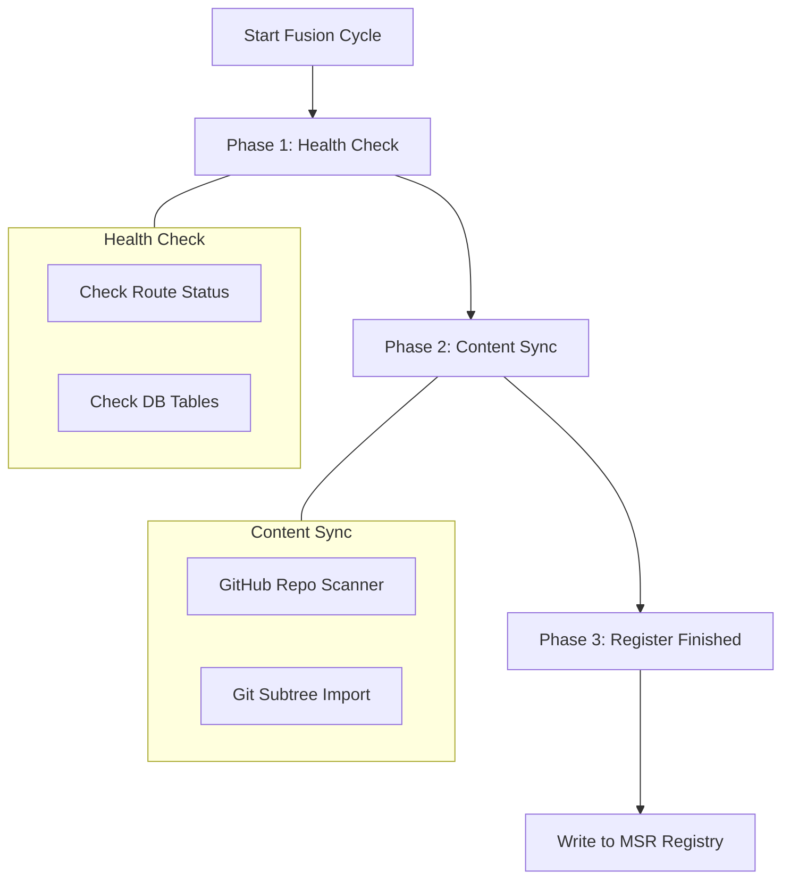
```mermaid
flowchart TD
    Start[Start Fusion Cycle] --> P1[Phase 1: Health Check]
    P1 --> P2[Phase 2: Content Sync]
    P2 --> P3[Phase 3: Register Finished]
    P3 --> MSR[Write to MSR Registry]
    
    subgraph P1_Details [Health Check]
        RCheck[Check Route Status]
        DBCheck[Check DB Tables]
    end
    
    subgraph P2_Details [Content Sync]
        Scanner[GitHub Repo Scanner]
        Subtree[Git Subtree Import]
    end
    
    P1 --- P1_Details
    P2 --- P2_Details
```
The diagram shows the three-phase operational cycle of the Fusion Core, including route validation and repository synchronization.
Sources: [federation/tamv-digital-nexus/supabase/functions/tamv-fusion-core/index.ts:127-147](https://github.com/OsoPanda1/tamv-atlas/blob/8865a3b2b9a76a7c50157f19b9880ae744141269/federation/tamv-digital-nexus/supabase/functions/tamv-fusion-core/index.ts#L127-L147), [README.md:46-52](https://github.com/OsoPanda1/tamv-atlas/blob/8865a3b2b9a76a7c50157f19b9880ae744141269/README.md#L46-L52)

## Content Synchronization and Federation

The federation logic treats external repositories as untrusted data but integrates them into the local environment via `git subtree --squash`. This is managed through a **Federation Manifest** that tracks file counts, extensions, and repository metadata.

Sources: [README.md:38-42](https://github.com/OsoPanda1/tamv-atlas/blob/8865a3b2b9a76a7c50157f19b9880ae744141269/README.md#L38-L42), [public/federation-manifest.json:1-10](https://github.com/OsoPanda1/tamv-atlas/blob/8865a3b2b9a76a7c50157f19b9880ae744141269/public/federation-manifest.json#L1-L10)

### Federated Repository Structure
Repositories are categorized by their role within the macro-project:

| Repository Category | Role | Alignment Signal |
| :--- | :--- | :--- |
| **Core (MD-X4)** | Master Manifesto | Centralizes RDM-TOS, Isabella IA, and Academic Canon |
| **Territorial Nodes** | Digital Twin | Implementation of Real del Monte (RDM) Digital |
| **Interfaces** | Explorer/Twin | Frontend immersive maps and backend operations |
| **Services** | Nexus/Verse | Layer for unifying services and experiences |

Sources: [src/pages/wiki/ecosistema-codigo/GithubRepos.tsx:32-42](https://github.com/OsoPanda1/tamv-atlas/blob/8865a3b2b9a76a7c50157f19b9880ae744141269/src/pages/wiki/ecosistema-codigo/GithubRepos.tsx#L32-L42), [src/pages/wiki/ecosistema-codigo/ProyectosPrincipales.tsx:12-20](https://github.com/OsoPanda1/tamv-atlas/blob/8865a3b2b9a76a7c50157f19b9880ae744141269/src/pages/wiki/ecosistema-codigo/ProyectosPrincipales.tsx#L12-L20)

## Implementation Details

The implementation relies on Supabase Edge Functions for high-level orchestration and Node.js for the underlying Repository Fusion Service logic.

### API Endpoints
The Fusion Service exposes several functional endpoints for identity and status management:

- `/v1/identity/*`: Organizational identity and DID management.
- `/v1/pids/status`: Status of Persistent Identifiers (ORCID, Zenodo, ISNI).
- `/v1/fusion`: UI interface for the Fusion Registry and unified repository status.

Sources: [README.md:31-37](https://github.com/OsoPanda1/tamv-atlas/blob/8865a3b2b9a76a7c50157f19b9880ae744141269/README.md#L31-L37), [src/App.tsx:216-225](https://github.com/OsoPanda1/tamv-atlas/blob/8865a3b2b9a76a7c50157f19b9880ae744141269/src/App.tsx#L216-L225)

### MSR Registry Integration
Every fusion cycle is recorded in the `msr_events` table to provide an audit trail. A SHA-256 evidence hash is generated from the fusion report to ensure immutability.

```typescript
// MSR Registry Logic from Fusion Core
async function registerMsrEvent(report: FusionReport): Promise<string | undefined> {
  const evidenceHash = await crypto.subtle
    .digest("SHA-256", new TextEncoder().encode(JSON.stringify(report)));
  
  const { data, error } = await supabase
    .from("msr_events")
    .insert({
      action: "TAMV_FUSION_CYCLE",
      payload: report,
      evidence_hash: evidenceHash,
      severity: report.health.warnings.length > 3 ? "warn" : "info",
    });
  return data.id;
}
```
Sources: [federation/tamv-digital-nexus/supabase/functions/tamv-fusion-core/index.ts:101-125](https://github.com/OsoPanda1/tamv-atlas/blob/8865a3b2b9a76a7c50157f19b9880ae744141269/federation/tamv-digital-nexus/supabase/functions/tamv-fusion-core/index.ts#L101-L125)

## Operational Status and Readiness

The Repository Fusion Service is currently in an advanced pre-production stage. While discovery and manifest generation are fully functional, hardening for global enterprise use is ongoing.

| Component | Status | Progress |
| :--- | :--- | :--- |
| **Repo Discovery** | Functional (GitHub API) | 68% |
| **Manifest Generation** | Automated | 72% |
| **Subtree Import** | Operational | 68% |
| **Audit/MSR Logging** | Fully Integrated | 80% |

Sources: [README.md:88-100](https://github.com/OsoPanda1/tamv-atlas/blob/8865a3b2b9a76a7c50157f19b9880ae744141269/README.md#L88-L100), [src/pages/wiki/metaverso-xr/RoadmapCivilizatorio.tsx:165-175](https://github.com/OsoPanda1/tamv-atlas/blob/8865a3b2b9a76a7c50157f19b9880ae744141269/src/pages/wiki/metaverso-xr/RoadmapCivilizatorio.tsx#L165-L175)

## Conclusion

The Repository Fusion Service transforms the OsoPanda1 GitHub profile from a collection of projects into a unified "Civilizational Program." By automating the synchronization of repositories and documenting every cycle within the MSR (Narrative Ledger), the service provides the necessary infrastructure for LATAM technological sovereignty. It effectively bridges the gap between fragmented codebases and a cohesive, auditable system operation.

Sources: [src/pages/wiki/ecosistema-codigo/GithubRepos.tsx:44-50](https://github.com/OsoPanda1/tamv-atlas/blob/8865a3b2b9a76a7c50157f19b9880ae744141269/src/pages/wiki/ecosistema-codigo/GithubRepos.tsx#L44-L50), [src/pages/wiki/modulo-omega/WikiValeMas.tsx:15-20](https://github.com/OsoPanda1/tamv-atlas/blob/8865a3b2b9a76a7c50157f19b9880ae744141269/src/pages/wiki/modulo-omega/WikiValeMas.tsx#L15-L20)

### XR Metaverse & Dreamspaces

<details>
<summary>Relevant source files</summary>

The following files were used as context for generating this wiki page:

- [src/pages/wiki/metaverso-xr/DreamspacesXR.tsx](https://github.com/OsoPanda1/tamv-atlas/blob/8865a3b2b9a76a7c50157f19b9880ae744141269/src/pages/wiki/metaverso-xr/DreamspacesXR.tsx)
- [src/pages/wiki/metaverso-xr/RoadmapCivilizatorio.tsx](https://github.com/OsoPanda1/tamv-atlas/blob/8865a3b2b9a76a7c50157f19b9880ae744141269/src/pages/wiki/metaverso-xr/RoadmapCivilizatorio.tsx)
- [federation/tamv-digital-nexus/apps/web/src/systems/FederationSystem.ts](https://github.com/OsoPanda1/tamv-atlas/blob/8865a3b2b9a76a7c50157f19b9880ae744141269/federation/tamv-digital-nexus/apps/web/src/systems/FederationSystem.ts)
- [src/pages/wiki/modulo-cero/Introduccion.tsx](https://github.com/OsoPanda1/tamv-atlas/blob/8865a3b2b9a76a7c50157f19b9880ae744141269/src/pages/wiki/modulo-cero/Introduccion.tsx)
- [src/pages/wiki/modulo-cero/FusionWikisExternas.tsx](https://github.com/OsoPanda1/tamv-atlas/blob/8865a3b2b9a76a7c50157f19b9880ae744141269/src/pages/wiki/modulo-cero/FusionWikisExternas.tsx)
- [src/pages/wiki/implementacion/CicdPipelines.tsx](https://github.com/OsoPanda1/tamv-atlas/blob/8865a3b2b9a76a7c50157f19b9880ae744141269/src/pages/wiki/implementacion/CicdPipelines.tsx)
</details>

# XR Metaverse & Dreamspaces

The XR Metaverse within TAMV ONLINE is defined as a productive interface layer (XR/2D/3D) designed for tourism, training, and territorial operations rather than speculative asset trading. It is anchored by the **DreamSpaces™** framework, which provides immersive environments for co-creation, cultural exhibition, and sovereign commerce. Unlike conventional metaverses, this system is integrated into a federated civilizatory ecosystem that prioritizes territorial utility and economic development in the physical world.

Sources: [src/pages/wiki/modulo-cero/FusionWikisExternas.tsx:28-31](https://github.com/OsoPanda1/tamv-atlas/blob/8865a3b2b9a76a7c50157f19b9880ae744141269/src/pages/wiki/modulo-cero/FusionWikisExternas.tsx#L28-L31), [src/pages/wiki/metaverso-xr/DreamspacesXR.tsx:16-20](https://github.com/OsoPanda1/tamv-atlas/blob/8865a3b2b9a76a7c50157f19b9880ae744141269/src/pages/wiki/metaverso-xr/DreamspacesXR.tsx#L16-L20)

## Architecture and Execution Layer

The XR execution environment is structured through a multi-layered technical stack that facilitates high-performance rendering, deterministic physics, and low-latency networking. The "XR Worlds" layer is approximately 75% productive as of early 2026, operating under the orchestration of Isabella AI and anchored to the **Moneda Soberana Real (MSR)** blockchain for state persistence and economic integrity.

### Technical Stack
| Layer | Technology | Purpose |
| :--- | :--- | :--- |
| **Render** | React Three Fiber + Three.js | Abstraction of WebGL/WebGPU for 3D visualization. |
| **Physics** | Rapier.js (Rust/WASM) | Deterministic dynamics and collision handling. |
| **Networking** | Yjs + WebRTC | Multi-user state synchronization with low latency. |
| **Audio** | KAOS AUDIO ENGINE™ 4D | Spatialized audio with HRTF and distance modeling. |

Sources: [src/pages/wiki/metaverso-xr/DreamspacesXR.tsx:55-65](https://github.com/OsoPanda1/tamv-atlas/blob/8865a3b2b9a76a7c50157f19b9880ae744141269/src/pages/wiki/metaverso-xr/DreamspacesXR.tsx#L55-L65), [src/pages/wiki/metaverso-xr/RoadmapCivilizatorio.tsx:100-110](https://github.com/OsoPanda1/tamv-atlas/blob/8865a3b2b9a76a7c50157f19b9880ae744141269/src/pages/wiki/metaverso-xr/RoadmapCivilizatorio.tsx#L100-L110)

### System Integration Flow
The following diagram illustrates how the XR Metaverse integrates with the broader TAMV infrastructure, specifically the identity and blockchain cores.

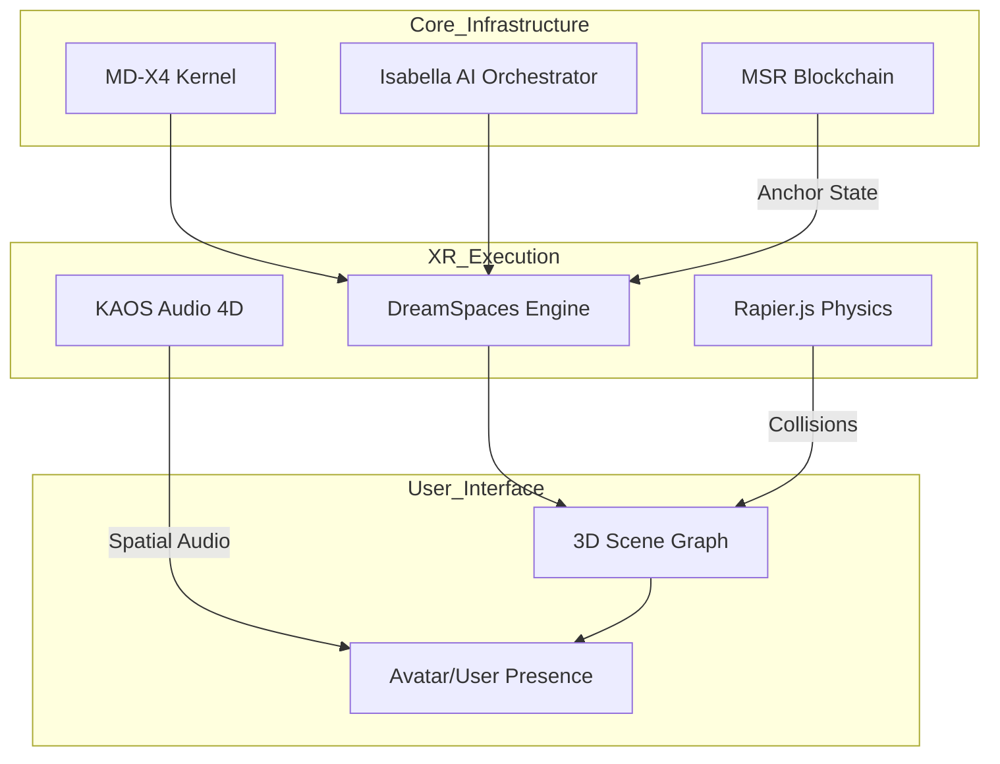
```mermaid
flowchart TD
    subgraph Core_Infrastructure
        MDX[MD-X4 Kernel]
        MSR[MSR Blockchain]
        ISABELLA[Isabella AI Orchestrator]
    end

    subgraph XR_Execution
        DS[DreamSpaces Engine]
        KAOS[KAOS Audio 4D]
        PHYSICS[Rapier.js Physics]
    end

    subgraph User_Interface
        AVATAR[Avatar/User Presence]
        SCENE[3D Scene Graph]
    end

    MDX --> DS
    ISABELLA --> DS
    DS --> SCENE
    MSR -- Anchor State --> DS
    KAOS -- Spatial Audio --> AVATAR
    PHYSICS -- Collisions --> SCENE
    SCENE --> AVATAR
```
The XR engine receives orchestration from Isabella AI and anchors its state to the MSR blockchain to ensure "Sovereign Collisions" in marketplace interactions.
Sources: [src/pages/wiki/metaverso-xr/DreamspacesXR.tsx:102-120](https://github.com/OsoPanda1/tamv-atlas/blob/8865a3b2b9a76a7c50157f19b9880ae744141269/src/pages/wiki/metaverso-xr/DreamspacesXR.tsx#L102-L120), [src/pages/wiki/metaverso-xr/RoadmapCivilizatorio.tsx:112-118](https://github.com/OsoPanda1/tamv-atlas/blob/8865a3b2b9a76a7c50157f19b9880ae744141269/src/pages/wiki/metaverso-xr/RoadmapCivilizatorio.tsx#L112-L118)

## DreamSpaces™ Framework

DreamSpaces™ serves as the primary module for immersive 3D/VR environments. It is categorized as a "Creative Federation" (DREAMSPACES) within the **MD-X4** kernel. It relies on the **QUANTUM** federation for state management and **KAOS** for spatial audio.

### Key Capabilities and Metadata
The system uses the `DreamSpaceMetadata` interface to track ownership and scene integrity.
```typescript
export interface DreamSpaceMetadata {
  id: string;
  ownerId: string;
  sceneGraphHash: string; // SHA-256 hash of the scene state
  quantumSplitEnabled: boolean;
}
```
Sources: [src/pages/wiki/metaverso-xr/DreamspacesXR.tsx:102-110](https://github.com/OsoPanda1/tamv-atlas/blob/8865a3b2b9a76a7c50157f19b9880ae744141269/src/pages/wiki/metaverso-xr/DreamspacesXR.tsx#L102-L110), [federation/tamv-digital-nexus/apps/web/src/systems/FederationSystem.ts:182-195](https://github.com/OsoPanda1/tamv-atlas/blob/8865a3b2b9a76a7c50157f19b9880ae744141269/federation/tamv-digital-nexus/apps/web/src/systems/FederationSystem.ts#L182-L195)

### KAOS Audio Engine™ 4D
The audio system provides spatial immersion using the Web Audio API with High-Resolution Transfer Functions (HRTF). It updates the audio field based on the avatar's position relative to spatial nodes.
Sources: [src/pages/wiki/metaverso-xr/DreamspacesXR.tsx:67-90](https://github.com/OsoPanda1/tamv-atlas/blob/8865a3b2b9a76a7c50157f19b9880ae744141269/src/pages/wiki/metaverso-xr/DreamspacesXR.tsx#L67-L90)

## Sovereign Collision Protocol

To prevent disputes and front-running in the 3D marketplace, TAMV implements the **Protocolo de Colisiones Soberanas**. This ensures that every interaction (buying, selling, or auctioning) is validated through deterministic collisions and a verifiable timestamp.

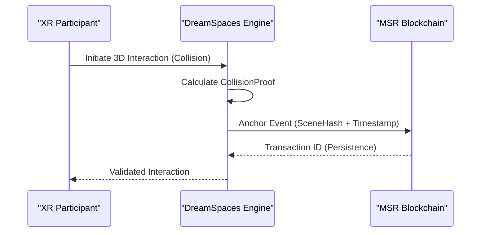
```mermaid
sequenceDiagram
    participant User as "XR Participant"
    participant Engine as "DreamSpaces Engine"
    participant MSR as "MSR Blockchain"
    
    User->>Engine: Initiate 3D Interaction (Collision)
    Engine->>Engine: Calculate CollisionProof
    Engine->>MSR: Anchor Event (SceneHash + Timestamp)
    MSR-->>Engine: Transaction ID (Persistence)
    Engine-->>User: Validated Interaction
```
The protocol requires an `actorDid`, `assetId`, and a cryptographic signature to validate the interaction against the server tick window.
Sources: [src/pages/wiki/metaverso-xr/DreamspacesXR.tsx:122-140](https://github.com/OsoPanda1/tamv-atlas/blob/8865a3b2b9a76a7c50157f19b9880ae744141269/src/pages/wiki/metaverso-xr/DreamspacesXR.tsx#L122-L140)

## Preconfigured DreamSpaces Templates

DreamSpaces provides specific templates tailored for different territorial and social use cases:

| Template | Use Case | Unique Value |
| :--- | :--- | :--- |
| **Quantum Art Gallery** | NFT Exhibition | Shaders + reactive audio. |
| **Sensory Auditorium** | Live Concerts | Hyper-realistic 4D audio. |
| **Metamorphic Classroom** | Education | Blockchain certification (UTAMV). |
| **Sovereign Market** | Commerce | Collision-based security. |
| **Historical Museum** | Tourism | Interactive 4D narratives. |

Sources: [src/pages/wiki/metaverso-xr/DreamspacesXR.tsx:154-165](https://github.com/OsoPanda1/tamv-atlas/blob/8865a3b2b9a76a7c50157f19b9880ae744141269/src/pages/wiki/metaverso-xr/DreamspacesXR.tsx#L154-L165)

## Roadmap and Operational Status

As of February 2026, the XR component is in a "Productive" state with 75% implementation.

- **Fase 0-2 (Post-Quantum):** Implementation of double signatures (Dilithium-like) for governance operations within XR environments.
- **Performance Targets:** Maintenance of ≥ 45 FPS in medium-spec hardware and < 200ms latency for auditorium-scale environments (50-150 users).
- **Critical Gaps:** Immediate priorities include S3/CloudFront integration for XR asset distribution and the completion of the DreamSpaces Editor for content scalability.

Sources: [src/pages/wiki/metaverso-xr/RoadmapCivilizatorio.tsx:12-20](https://github.com/OsoPanda1/tamv-atlas/blob/8865a3b2b9a76a7c50157f19b9880ae744141269/src/pages/wiki/metaverso-xr/RoadmapCivilizatorio.tsx#L12-L20), [src/pages/wiki/metaverso-xr/DreamspacesXR.tsx:43-52](https://github.com/OsoPanda1/tamv-atlas/blob/8865a3b2b9a76a7c50157f19b9880ae744141269/src/pages/wiki/metaverso-xr/DreamspacesXR.tsx#L43-L52), [src/pages/wiki/implementacion/CicdPipelines.tsx:145-150](https://github.com/OsoPanda1/tamv-atlas/blob/8865a3b2b9a76a7c50157f19b9880ae744141269/src/pages/wiki/implementacion/CicdPipelines.tsx#L145-L150)

## Conclusion
The XR Metaverse & Dreamspaces system represents the visual and interactive frontier of TAMV ONLINE. By combining advanced WebGL rendering with blockchain-backed sovereign protocols and spatial 4D audio, it creates a functional environment for digital twin operations and territorial development, strictly governed by the ethical and technical standards of the MD-X4 kernel.

### Economy & Ledger Systems

<details>
<summary>Relevant source files</summary>

The following files were used as context for generating this wiki page:

- [src/pages/wiki/metaverso-xr/EconomiaCuantica.tsx](https://github.com/OsoPanda1/tamv-atlas/blob/8865a3b2b9a76a7c50157f19b9880ae744141269/src/pages/wiki/metaverso-xr/EconomiaCuantica.tsx)
- [federation/tamv-digital-nexus/supabase/functions/tamv-unified-api/index.ts](https://github.com/OsoPanda1/tamv-atlas/blob/8865a3b2b9a76a7c50157f19b9880ae744141269/federation/tamv-digital-nexus/supabase/functions/tamv-unified-api/index.ts)
- [federation/tamv-digital-nexus/packages/contracts/openapi/tamv.v1.yaml](https://github.com/OsoPanda1/tamv-atlas/blob/8865a3b2b9a76a7c50157f19b9880ae744141269/federation/tamv-digital-nexus/packages/contracts/openapi/tamv.v1.yaml)
- [src/pages/wiki/metaverso-xr/RoadmapCivilizatorio.tsx](https://github.com/OsoPanda1/tamv-atlas/blob/8865a3b2b9a76a7c50157f19b9880ae744141269/src/pages/wiki/metaverso-xr/RoadmapCivilizatorio.tsx)
- [src/pages/wiki/implementacion/CicdPipelines.tsx](https://github.com/OsoPanda1/tamv-atlas/blob/8865a3b2b9a76a7c50157f19b9880ae744141269/src/pages/wiki/implementacion/CicdPipelines.tsx)
</details>

# Economy & Ledger Systems

The **Economy & Ledger Systems** within the TAMV ecosystem, specifically the **TAMV Economic Engine (TEE)** and the **TCEP (Unified Access Token)**, facilitate a sovereign financial infrastructure. This system manages multi-level memberships, internal currency transactions (TAU/TCEP), and a transparent, audit-ready ledger integrated with external payment providers like Stripe. The system is designed to handle internal value transfers, marketplace commissions, and even lottery mechanics, all governed by the principles of the **DAO Hybrid** and recorded in a verifiable narrative ledger known as **BookPI**.

Sources: [src/pages/wiki/metaverso-xr/EconomiaCuantica.tsx:13-17](https://github.com/OsoPanda1/tamv-atlas/blob/8865a3b2b9a76a7c50157f19b9880ae744141269/src/pages/wiki/metaverso-xr/EconomiaCuantica.tsx#L13-L17), [federation/tamv-digital-nexus/packages/contracts/openapi/tamv.v1.yaml:12-15](https://github.com/OsoPanda1/tamv-atlas/blob/8865a3b2b9a76a7c50157f19b9880ae744141269/federation/tamv-digital-nexus/packages/contracts/openapi/tamv.v1.yaml#L12-L15)

## 1. TAMV Economic Engine (TEE) Architecture

The TEE operates as the core transactional layer, orchestrating the flow of the **TAU** (Token de Acceso Unificado) and managing user wallets. It enforces a strict commission structure and integrates with the **MSR (Narrative Ledger)** to log every economic event with evidence hashes.

### Transactional Workflow
Transactions follow a strict flow from acquisition via external payment gateways to internal peer-to-peer transfers or service consumption.

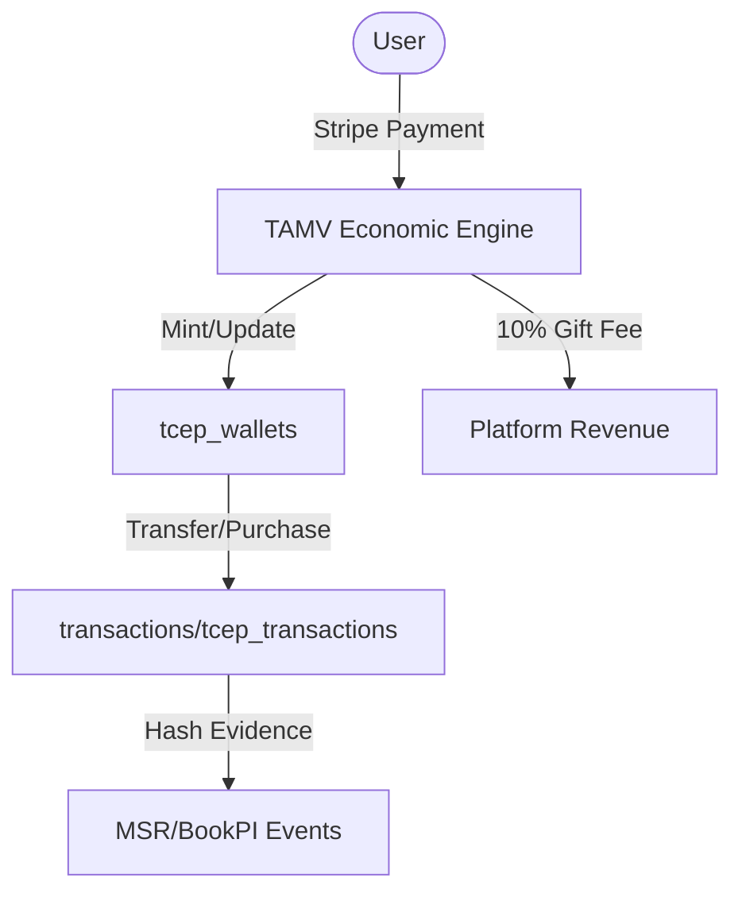
```mermaid
flowchart TD
    User([User]) -->|Stripe Payment| TEE[TAMV Economic Engine]
    TEE -->|Mint/Update| Wallet[tcep_wallets]
    Wallet -->|Transfer/Purchase| Ledger[transactions/tcep_transactions]
    Ledger -->|Hash Evidence| MSR[MSR/BookPI Events]
    TEE -->|10% Gift Fee| Revenue[Platform Revenue]
```
The diagram shows how funds enter the system through external payments, update local wallets, and generate hashed records in the ledger.
Sources: [src/pages/wiki/metaverso-xr/EconomiaCuantica.tsx:40-47](https://github.com/OsoPanda1/tamv-atlas/blob/8865a3b2b9a76a7c50157f19b9880ae744141269/src/pages/wiki/metaverso-xr/EconomiaCuantica.tsx#L40-L47), [federation/tamv-digital-nexus/supabase/functions/tamv-unified-api/index.ts:109-130](https://github.com/OsoPanda1/tamv-atlas/blob/8865a3b2b9a76a7c50157f19b9880ae744141269/federation/tamv-digital-nexus/supabase/functions/tamv-unified-api/index.ts#L109-L130)

## 2. Membership Tier System

The economy is heavily influenced by a 6-level membership tier system, which determines access to services, pricing, and voting weight within the DAO.

| Tier | Name | Access Level | Model |
| :--- | :--- | :--- | :--- |
| 0 | Free / Ciudadano | Basic wiki, community, ISNI profile | Free |
| 1 | Basic / Creador | Social feed, DreamSpaces, free UTAMV | Freemium |
| 2 | Pro / Profesional | Premium DreamSpaces, Isabella voice | Subscription |
| 3 | Business / Empresa | API access, dashboards, Odoo integration | B2B |
| 4 | Enterprise | Multi-site, white-label, dedicated support | B2B/B2G |
| 5 | Gold Plus / Alianza | Full governance, territorial nodes | Strategic |

Sources: [src/pages/wiki/metaverso-xr/EconomiaCuantica.tsx:21-36](https://github.com/OsoPanda1/tamv-atlas/blob/8865a3b2b9a76a7c50157f19b9880ae744141269/src/pages/wiki/metaverso-xr/EconomiaCuantica.tsx#L21-L36), [federation/tamv-digital-nexus/supabase/functions/tamv-unified-api/index.ts:143-149](https://github.com/OsoPanda1/tamv-atlas/blob/8865a3b2b9a76a7c50157f19b9880ae744141269/federation/tamv-digital-nexus/supabase/functions/tamv-unified-api/index.ts#L143-L149)

## 3. The TCEP/TAU Token and Wallet System

The **TCEP/TAU** serves as the internal currency. Wallets are stored in the `tcep_wallets` table, maintaining balances and membership statuses. 

### Key Data Structures
The Unified API and OpenAPI specifications define the transaction and wallet entities.

```typescript
// Wallet structure from tcep_wallets
interface Wallet {
  user_id: string;
  balance_tau: number;
  balance_credits: number; // TCEP credits
  membership_tier: string;
}

// Transaction structure from tcep_transactions
interface Transaction {
  id: string;
  from_user_id: string;
  to_user_id: string;
  amount: number;
  tx_type: 'transfer' | 'purchase' | 'gift';
  evidence_hash: string;
}
```
Sources: [src/pages/wiki/metaverso-xr/EconomiaCuantica.tsx:84-88](https://github.com/OsoPanda1/tamv-atlas/blob/8865a3b2b9a76a7c50157f19b9880ae744141269/src/pages/wiki/metaverso-xr/EconomiaCuantica.tsx#L84-L88), [federation/tamv-digital-nexus/supabase/functions/tamv-unified-api/index.ts:114-122](https://github.com/OsoPanda1/tamv-atlas/blob/8865a3b2b9a76a7c50157f19b9880ae744141269/federation/tamv-digital-nexus/supabase/functions/tamv-unified-api/index.ts#L114-L122), [federation/tamv-digital-nexus/packages/contracts/openapi/tamv.v1.yaml:141-164](https://github.com/OsoPanda1/tamv-atlas/blob/8865a3b2b9a76a7c50157f19b9880ae744141269/federation/tamv-digital-nexus/packages/contracts/openapi/tamv.v1.yaml#L141-L164)

### Commission Calculations
Commissions are dynamically calculated based on the user's membership level. While a standard 10% applies to gifts, the API supports various rates:

| Membership Level | Commission Rate |
| :--- | :--- |
| Free / Default | 30% |
| Premium | 25% |
| VIP | 20% |
| Elite | 15% |
| Gold / Gold Plus | 12% - 10% |
| Enterprise | 8% |

Sources: [federation/tamv-digital-nexus/supabase/functions/tamv-unified-api/index.ts:142-150](https://github.com/OsoPanda1/tamv-atlas/blob/8865a3b2b9a76a7c50157f19b9880ae744141269/federation/tamv-digital-nexus/supabase/functions/tamv-unified-api/index.ts#L142-L150), [src/pages/wiki/metaverso-xr/EconomiaCuantica.tsx:44](https://github.com/OsoPanda1/tamv-atlas/blob/8865a3b2b9a76a7c50157f19b9880ae744141269/src/pages/wiki/metaverso-xr/EconomiaCuantica.tsx#L44)

## 4. Ledger and Narrative Audit (MSR/BookPI)

Every transaction is registered in a ledger that implements a **Saga pattern** for consistency. To ensure the integrity of the economic system, events are hashed and mirrored in the **MSR (Manual de Sentido y Registro)** module.

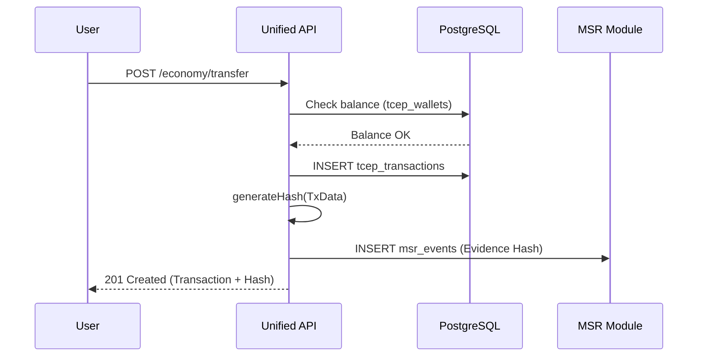
```mermaid
sequenceDiagram
    participant U as User
    participant API as Unified API
    participant DB as PostgreSQL
    participant MSR as MSR Module
    
    U->>API: POST /economy/transfer
    API->>DB: Check balance (tcep_wallets)
    DB-->>API: Balance OK
    API->>DB: INSERT tcep_transactions
    API->>API: generateHash(TxData)
    API->>MSR: INSERT msr_events (Evidence Hash)
    API-->>U: 201 Created (Transaction + Hash)
```
This sequence ensures that every economic movement has a corresponding hashed entry in the governance audit trail.
Sources: [federation/tamv-digital-nexus/supabase/functions/tamv-unified-api/index.ts:109-130](https://github.com/OsoPanda1/tamv-atlas/blob/8865a3b2b9a76a7c50157f19b9880ae744141269/federation/tamv-digital-nexus/supabase/functions/tamv-unified-api/index.ts#L109-L130), [federation/tamv-digital-nexus/packages/contracts/openapi/tamv.v1.yaml:14-15](https://github.com/OsoPanda1/tamv-atlas/blob/8865a3b2b9a76a7c50157f19b9880ae744141269/federation/tamv-digital-nexus/packages/contracts/openapi/tamv.v1.yaml#L14-L15)

## 5. API Endpoints and Integration

The economy is managed via the `/economy` namespace in the TAMV Unified API.

| Endpoint | Method | Description |
| :--- | :--- | :--- |
| `/economy/wallet` | GET | Retrieves the authenticated user's balance and tier. |
| `/economy/transfer` | POST | Executes a P2P transfer with mandatory hashing. |
| `/economy/transactions` | GET | Lists the user's transaction history (Ledger). |
| `/economy/lottery/purchase`| POST | Permite la compra de tickets para sorteos internos. |
| `/payments/create` | POST | Creates a Stripe payment intent for TAU acquisition. |

Sources: [federation/tamv-digital-nexus/supabase/functions/tamv-unified-api/index.ts:98-140](https://github.com/OsoPanda1/tamv-atlas/blob/8865a3b2b9a76a7c50157f19b9880ae744141269/federation/tamv-digital-nexus/supabase/functions/tamv-unified-api/index.ts#L98-L140), [federation/tamv-digital-nexus/packages/contracts/openapi/tamv.v1.yaml:385-410](https://github.com/OsoPanda1/tamv-atlas/blob/8865a3b2b9a76a7c50157f19b9880ae744141269/federation/tamv-digital-nexus/packages/contracts/openapi/tamv.v1.yaml#L385-L410)

## 6. Implementation Security

The system employs **Row Level Security (RLS)** in PostgreSQL to ensure users can only access their own wallet and transactions. Furthermore, the **MD-X5 (Deca-V)** pipeline enforces architectural invariants (L1-L9) that prevent unauthorized services from modifying economic states.

- **Idempotency:** Webhook events from Stripe are tracked in `processed_stripe_events`.
- **Auditability:** Every transaction requires an `evidence_hash` generated from the sender, receiver, amount, and timestamp.
- **DAO Constraints:** The Hybrid DAO can influence marketplace categories but is strictly prohibited from altering commissions or membership prices.

Sources: [src/pages/wiki/metaverso-xr/EconomiaCuantica.tsx:64-70](https://github.com/OsoPanda1/tamv-atlas/blob/8865a3b2b9a76a7c50157f19b9880ae744141269/src/pages/wiki/metaverso-xr/EconomiaCuantica.tsx#L64-L70), [src/pages/wiki/implementacion/CicdPipelines.tsx:28-40](https://github.com/OsoPanda1/tamv-atlas/blob/8865a3b2b9a76a7c50157f19b9880ae744141269/src/pages/wiki/implementacion/CicdPipelines.tsx#L28-L40), [federation/tamv-digital-nexus/supabase/functions/tamv-unified-api/index.ts:114-118](https://github.com/OsoPanda1/tamv-atlas/blob/8865a3b2b9a76a7c50157f19b9880ae744141269/federation/tamv-digital-nexus/supabase/functions/tamv-unified-api/index.ts#L114-L118)

### Conclusion
The Economy & Ledger Systems provide a robust, sovereign framework for value exchange within TAMV ONLINE. By combining a tiered membership model with a hashed narrative ledger (MSR/BookPI), the system ensures that economic activity is not only functional but also ethically auditable and aligned with the project's civilizatory goals.

### Security: PQC Hybrid Cryptography

<details>
<summary>Relevant source files</summary>

The following files were used as context for generating this wiki page:

- [federation/tamv-digital-nexus/packages/contracts/openapi/tamv.v1.yaml](https://github.com/OsoPanda1/tamv-atlas/blob/8865a3b2b9a76a7c50157f19b9880ae744141269/federation/tamv-digital-nexus/packages/contracts/openapi/tamv.v1.yaml)
- [src/pages/wiki/metaverso-xr/DekateotlSeguridad.tsx](https://github.com/OsoPanda1/tamv-atlas/blob/8865a3b2b9a76a7c50157f19b9880ae744141269/src/pages/wiki/metaverso-xr/DekateotlSeguridad.tsx)
- [src/pages/wiki/modulo-cero/Introduccion.tsx](https://github.com/OsoPanda1/tamv-atlas/blob/8865a3b2b9a76a7c50157f19b9880ae744141269/src/pages/wiki/modulo-cero/Introduccion.tsx)
- [src/pages/wiki/fundamentos/ConceptosClave.tsx](https://github.com/OsoPanda1/tamv-atlas/blob/8865a3b2b9a76a7c50157f19b9880ae744141269/src/pages/wiki/fundamentos/ConceptosClave.tsx)
- [src/pages/wiki/fundamentos-isni/ConceptosClaveISNI.tsx](https://github.com/OsoPanda1/tamv-atlas/blob/8865a3b2b9a76a7c50157f19b9880ae744141269/src/pages/wiki/fundamentos-isni/ConceptosClaveISNI.tsx)
- [README.md](https://github.com/OsoPanda1/tamv-atlas/blob/8865a3b2b9a76a7c50157f19b9880ae744141269/README.md)
</details>

# Security: PQC Hybrid Cryptography

Security: PQC Hybrid Cryptography represents the core defensive layer of the TAMV Online ecosystem, specifically integrated into the **DEKATEOTL** security system and the **MD-X** kernel. This framework implements Post-Quantum Cryptography (PQC) alongside classical cryptographic methods to ensure "Zero-Trust" security and long-term resistance against potential quantum computing threats.

The system utilizes hybrid signatures and encryption schemes, primarily leveraging algorithms like Kyber for key encapsulation and Dilithium for digital signatures. This hybrid approach ensures that the infrastructure remains secure against current classical attacks while preparing for the post-quantum era, protecting the sovereignty of digital identity and territorial data within the [Digital Nexus](#tamv-v1-yaml).

Sources: [src/pages/wiki/metaverso-xr/DekateotlSeguridad.tsx:8](https://github.com/OsoPanda1/tamv-atlas/blob/8865a3b2b9a76a7c50157f19b9880ae744141269/src/pages/wiki/metaverso-xr/DekateotlSeguridad.tsx#L8), [federation/tamv-digital-nexus/packages/contracts/openapi/tamv.v1.yaml:18-28](https://github.com/OsoPanda1/tamv-atlas/blob/8865a3b2b9a76a7c50157f19b9880ae744141269/federation/tamv-digital-nexus/packages/contracts/openapi/tamv.v1.yaml#L18-L28), [src/pages/wiki/modulo-cero/Introduccion.tsx:69-72](https://github.com/OsoPanda1/tamv-atlas/blob/8865a3b2b9a76a7c50157f19b9880ae744141269/src/pages/wiki/modulo-cero/Introduccion.tsx#L69-L72)

## DEKATEOTL Security Framework

The DEKATEOTL system is a 11-layered biological and digital security model. PQC Hybrid Cryptography serves as the fourth layer of this multicapa system, specifically handling quantum anomaly detection and post-quantum encryption.

### Core Security Layers
The cryptographic implementation is situated within a broader "Zero-Trust" model where no component implicitly trusts another.

| Layer | Component | Function |
| :--- | :--- | :--- |
| 3 | Quantum Anomaly Detection | Identifies non-classical patterns in traffic |
| 4 | Post-Quantum Cryptography | Implementation of Kyber and Dilithium algorithms |
| 9 | Continuous Auditing | Persistent verification of cryptographic integrity |
| 11 | Self-Healing | System-wide recovery from cryptographic failures |

Sources: [src/pages/wiki/metaverso-xr/DekateotlSeguridad.tsx:8-12](https://github.com/OsoPanda1/tamv-atlas/blob/8865a3b2b9a76a7c50157f19b9880ae744141269/src/pages/wiki/metaverso-xr/DekateotlSeguridad.tsx#L8-L12), [src/pages/wiki/fundamentos-isni/ConceptosClaveISNI.tsx:40](https://github.com/OsoPanda1/tamv-atlas/blob/8865a3b2b9a76a7c50157f19b9880ae744141269/src/pages/wiki/fundamentos-isni/ConceptosClaveISNI.tsx#L40)

## Cryptographic Implementation

The PQC implementation in TAMV is standardized through the **QuantumSecurityLayer™**. This layer is responsible for generating hybrid key pairs and managing signatures for the unified API.

### Hybrid Algorithms
The system specifically defines the use of the following NIST-standardized post-quantum algorithms:
*   **ML-KEM (Kyber):** Used for secure key encapsulation and encryption.
*   **ML-DSA (Dilithium):** Used for digital signatures (specifically Dilithium3 and Dilithium5 variants).
*   **SLH-DSA:** Part of the hardening roadmap for stateless hash-based signatures.

Sources: [federation/tamv-digital-nexus/packages/contracts/openapi/tamv.v1.yaml:126-150](https://github.com/OsoPanda1/tamv-atlas/blob/8865a3b2b9a76a7c50157f19b9880ae744141269/federation/tamv-digital-nexus/packages/contracts/openapi/tamv.v1.yaml#L126-L150), [src/pages/wiki/metaverso-xr/RoadmapCivilizatorio.tsx:162-166](https://github.com/OsoPanda1/tamv-atlas/blob/8865a3b2b9a76a7c50157f19b9880ae744141269/src/pages/wiki/metaverso-xr/RoadmapCivilizatorio.tsx#L162-L166)

### Authentication Flow
The system utilizes a specialized **QuantumToken** scheme. This is a JWT (JSON Web Token) enhanced with a post-quantum signature using the Dilithium3 algorithm, allowing for verification that is resistant to quantum computing decryption.

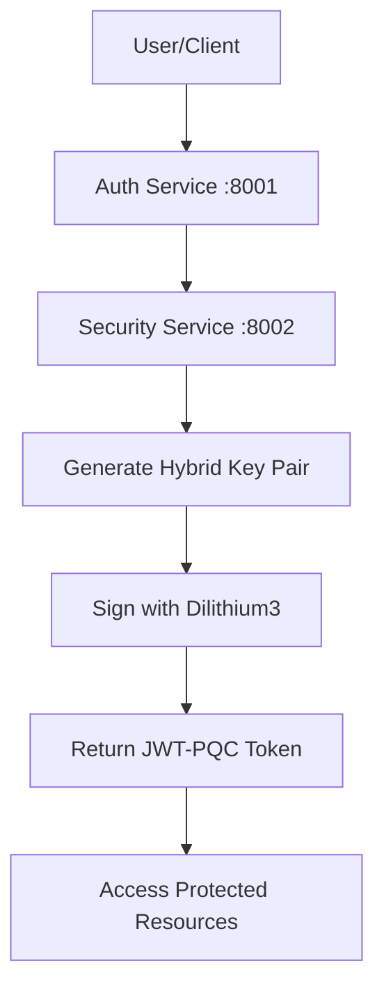
```mermaid
flowchart TD
    User[User/Client] --> Auth[Auth Service :8001]
    Auth --> PQC[Security Service :8002]
    PQC --> KeyGen[Generate Hybrid Key Pair]
    KeyGen --> Signature[Sign with Dilithium3]
    Signature --> Token[Return JWT-PQC Token]
    Token --> Access[Access Protected Resources]
```
The diagram above shows the process of upgrading standard authentication to the QuantumToken standard.
Sources: [federation/tamv-digital-nexus/packages/contracts/openapi/tamv.v1.yaml:63-75](https://github.com/OsoPanda1/tamv-atlas/blob/8865a3b2b9a76a7c50157f19b9880ae744141269/federation/tamv-digital-nexus/packages/contracts/openapi/tamv.v1.yaml#L63-L75)

## API Architecture for PQC

The API exposes specific endpoints for managing the lifecycle of quantum-resistant keys and signatures. These services are classified under **Pipeline A - Critical Operations**.

### Security Service Endpoints (Port 8002)

| Endpoint | Method | Description |
| :--- | :--- | :--- |
| `/security/hybrid-key` | POST | Generates a new `QuantumKeyPair` containing both Dilithium and Kyber public keys. |
| `/security/sign` | POST | Signs a specific payload using a provided `key_id` and the Dilithium algorithm. |
| `/security/verify` | POST | Verifies a Dilithium signature against a payload and public key. |

Sources: [federation/tamv-digital-nexus/packages/contracts/openapi/tamv.v1.yaml:12-18](https://github.com/OsoPanda1/tamv-atlas/blob/8865a3b2b9a76a7c50157f19b9880ae744141269/federation/tamv-digital-nexus/packages/contracts/openapi/tamv.v1.yaml#L12-L18), [federation/tamv-digital-nexus/packages/contracts/openapi/tamv.v1.yaml:318-378](https://github.com/OsoPanda1/tamv-atlas/blob/8865a3b2b9a76a7c50157f19b9880ae744141269/federation/tamv-digital-nexus/packages/contracts/openapi/tamv.v1.yaml#L318-L378)

### Key Data Structures
The `QuantumKeyPair` structure is the foundation of the hybrid identity. It links a unique `key_id` with post-quantum public keys and expiration timestamps.

```json
{
  "key_id": "qsl-1709564400000-abc123",
  "public_key_dilithium": "string",
  "public_key_kyber": "string",
  "created_at": "date-time",
  "expires_at": "date-time"
}
```
Sources: [federation/tamv-digital-nexus/packages/contracts/openapi/tamv.v1.yaml:126-138](https://github.com/OsoPanda1/tamv-atlas/blob/8865a3b2b9a76a7c50157f19b9880ae744141269/federation/tamv-digital-nexus/packages/contracts/openapi/tamv.v1.yaml#L126-L138)

## Integration with MD-X Kernel

PQC Hybrid Cryptography is integrated into the **MD-X4** and **MD-X5** kernels through the **SEC (Security)** federation. This federation ensures that all data persistence (MSR/BookPI) and inter-service communication are protected by quantum-resistant layers.

### Security Posture and Federated Repositories
The system maintains a specific "Security Posture" monitored via the `/v1/security/posture` endpoint. This allows the orchestrator to track the health of the PQC implementation across all 195 federated repositories.

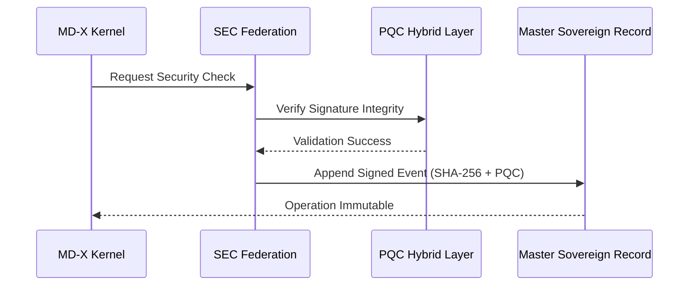
```mermaid
sequenceDiagram
    participant Kernel as MD-X Kernel
    participant SEC as SEC Federation
    participant PQC as PQC Hybrid Layer
    participant MSR as Master Sovereign Record

    Kernel->>SEC: Request Security Check
    SEC->>PQC: Verify Signature Integrity
    PQC-->>SEC: Validation Success
    SEC->>MSR: Append Signed Event (SHA-256 + PQC)
    MSR-->>Kernel: Operation Immutable
```
The sequence shows how the SEC federation interacts with the PQC layer to ensure the immutability of the Master Sovereign Record.
Sources: [README.md:43-45](https://github.com/OsoPanda1/tamv-atlas/blob/8865a3b2b9a76a7c50157f19b9880ae744141269/README.md#L43-L45), [src/pages/wiki/fundamentos-isni/ConceptosClaveISNI.tsx:12-16](https://github.com/OsoPanda1/tamv-atlas/blob/8865a3b2b9a76a7c50157f19b9880ae744141269/src/pages/wiki/fundamentos-isni/ConceptosClaveISNI.tsx#L12-L16), [src/pages/wiki/modulo-cero/Introduccion.tsx:69-72](https://github.com/OsoPanda1/tamv-atlas/blob/8865a3b2b9a76a7c50157f19b9880ae744141269/src/pages/wiki/modulo-cero/Introduccion.tsx#L69-L72)

## Summary

Security: PQC Hybrid Cryptography provides the necessary "Zero-Trust" infrastructure to protect TAMV Online against the future of quantum computation. By implementing NIST-standardized algorithms like Kyber and Dilithium within the DEKATEOTL framework and the MD-X kernel, the project ensures that digital identities and territorial sovereignty remain uncompromised. The system is currently functional for staging and pilots, with ongoing hardening directed towards a full production-ready status.

Sources: [README.md:104-106](https://github.com/OsoPanda1/tamv-atlas/blob/8865a3b2b9a76a7c50157f19b9880ae744141269/README.md#L104-L106), [src/pages/wiki/metaverso-xr/RoadmapCivilizatorio.tsx:210-214](https://github.com/OsoPanda1/tamv-atlas/blob/8865a3b2b9a76a7c50157f19b9880ae744141269/src/pages/wiki/metaverso-xr/RoadmapCivilizatorio.tsx#L210-L214)


## Data Management & Flow

### Bookpi & Memory Systems

<details>
<summary>Relevant source files</summary>

The following files were used as context for generating this wiki page:

- [src/pages/wiki/metaverso-xr/RoadmapCivilizatorio.tsx](https://github.com/OsoPanda1/tamv-atlas/blob/8865a3b2b9a76a7c50157f19b9880ae744141269/src/pages/wiki/metaverso-xr/RoadmapCivilizatorio.tsx)
- [src/pages/wiki/modulo-omega/ManifiestoTamv.tsx](https://github.com/OsoPanda1/tamv-atlas/blob/8865a3b2b9a76a7c50157f19b9880ae744141269/src/pages/wiki/modulo-omega/ManifiestoTamv.tsx)
- [src/pages/wiki/modulo-omega/WikiValeMas.tsx](https://github.com/OsoPanda1/tamv-atlas/blob/8865a3b2b9a76a7c50157f19b9880ae744141269/src/pages/wiki/modulo-omega/WikiValeMas.tsx)
- [src/pages/wiki/modulo-omega/FilosofiaDekateotl.tsx](https://github.com/OsoPanda1/tamv-atlas/blob/8865a3b2b9a76a7c50157f19b9880ae744141269/src/pages/wiki/modulo-omega/FilosofiaDekateotl.tsx)
- [src/pages/wiki/metaverso-xr/msr-blockchain.tsx](https://github.com/OsoPanda1/tamv-atlas/blob/8865a3b2b9a76a7c50157f19b9880ae744141269/src/data/wikiStructure.ts) (Referenced via [src/data/wikiStructure.ts:135](https://github.com/OsoPanda1/tamv-atlas/blob/8865a3b2b9a76a7c50157f19b9880ae744141269/src/data/wikiStructure.ts#L135))
- [src/pages/wiki/modulo-cero/HumanismoEnCodigo.tsx](https://github.com/OsoPanda1/tamv-atlas/blob/8865a3b2b9a76a7c50157f19b9880ae744141269/src/pages/wiki/modulo-cero/HumanismoEnCodigo.tsx)
- [src/pages/wiki/implementacion/ApiIsni.tsx](https://github.com/OsoPanda1/tamv-atlas/blob/8865a3b2b9a76a7c50157f19b9880ae744141269/src/pages/wiki/implementacion/ApiIsni.tsx)
</details>

# Bookpi & Memory Systems

The **BookPI** and **MSR (Memory/Management System Registry)** constitute the fundamental memory layer of the TAMV ONLINE ecosystem. Together, they form a narrative ledger and blockchain-inspired registry designed to ensure total traceability, ethical accountability, and civilizational continuity. Unlike traditional logging systems, these modules are built to be "reconstructible" and "auditable," serving as a source of truth for every critical decision, identity verification, and architectural evolution within the federated frontier.

These systems are integrated into the core architecture to provide an immutable record of events, which is essential for the project's [Soberanía Digital](#fundamentos-isni) goals. By utilizing SHA-256 hashing and event-sourcing patterns, the memory systems ensure that the ecosystem's history remains tamper-proof and accessible for both human and computational auditing.

Sources: [src/pages/wiki/modulo-omega/WikiValeMas.tsx:28-40](https://github.com/OsoPanda1/tamv-atlas/blob/8865a3b2b9a76a7c50157f19b9880ae744141269/src/pages/wiki/modulo-omega/WikiValeMas.tsx#L28-L40), [src/pages/wiki/metaverso-xr/RoadmapCivilizatorio.tsx:112-115](https://github.com/OsoPanda1/tamv-atlas/blob/8865a3b2b9a76a7c50157f19b9880ae744141269/src/pages/wiki/metaverso-xr/RoadmapCivilizatorio.tsx#L112-L115), [src/pages/wiki/modulo-cero/HumanismoEnCodigo.tsx:13-17](https://github.com/OsoPanda1/tamv-atlas/blob/8865a3b2b9a76a7c50157f19b9880ae744141269/src/pages/wiki/modulo-cero/HumanismoEnCodigo.tsx#L13-L17)

## Architecture and Core Components

The memory architecture is divided into two primary logical layers: the **BookPI Narrative Ledger** for ethical and structural documentation, and the **MSR Engine** for high-frequency technical and operational events.

### MSR (Memory System Registry) Blockchain
The MSR functions as a blockchain-lite registry that captures events with cryptographic integrity. It is responsible for logging authentication attempts, security alerts, and administrative powers.

*   **Integrity Mechanism:** Every entry is secured with a SHA-256 hash.
*   **Traceability:** Implements an actor timeline to track the history of specific identities.
*   **Operational Status:** Currently audited at 80% implementation as of February 2026.

Sources: [src/pages/wiki/metaverso-xr/RoadmapCivilizatorio.tsx:14](https://github.com/OsoPanda1/tamv-atlas/blob/8865a3b2b9a76a7c50157f19b9880ae744141269/src/pages/wiki/metaverso-xr/RoadmapCivilizatorio.tsx#L14), [src/pages/wiki/metaverso-xr/RoadmapCivilizatorio.tsx:57](https://github.com/OsoPanda1/tamv-atlas/blob/8865a3b2b9a76a7c50157f19b9880ae744141269/src/pages/wiki/metaverso-xr/RoadmapCivilizatorio.tsx#L57), [src/pages/wiki/implementacion/ApiIsni.tsx:24](https://github.com/OsoPanda1/tamv-atlas/blob/8865a3b2b9a76a7c50157f19b9880ae744141269/src/pages/wiki/implementacion/ApiIsni.tsx#L24)

### BookPI Narrative Ledger
BookPI is described as the "narrative ledger" of the system. Its primary role is to provide a "prefrontal cortex" for the ecosystem, documenting the "why" behind technical deployments.

*   **Function:** Formalizes ethical criteria and preserves institutional memory.
*   **Axiom:** The system is considered mature when it can be reconstructed entirely from its formal documentation (Wiki and BookPI).
*   **Trazabilidad Ética:** Used to justify critical decisions publicly and ensure they align with the [Manifiesto TAMV](#modulo-omega).

Sources: [src/pages/wiki/modulo-omega/WikiValeMas.tsx:64-75](https://github.com/OsoPanda1/tamv-atlas/blob/8865a3b2b9a76a7c50157f19b9880ae744141269/src/pages/wiki/modulo-omega/WikiValeMas.tsx#L64-L75), [src/pages/wiki/modulo-omega/ManifiestoTamv.tsx:43-48](https://github.com/OsoPanda1/tamv-atlas/blob/8865a3b2b9a76a7c50157f19b9880ae744141269/src/pages/wiki/modulo-omega/ManifiestoTamv.tsx#L43-L48), [src/pages/wiki/modulo-omega/FilosofiaDekateotl.tsx:19-25](https://github.com/OsoPanda1/tamv-atlas/blob/8865a3b2b9a76a7c50157f19b9880ae744141269/src/pages/wiki/modulo-omega/FilosofiaDekateotl.tsx#L19-L25)

## Data Flow and Integration

The memory systems interact with the broader ecosystem through a series of API endpoints and middleware triggers.

### Memory Event Flow Diagram
The following diagram illustrates how a technical event is processed and recorded into the MSR and BookPI systems.

```mermaid
flowchart TD
    A[Event Trigger: Security/Auth/Identity] --> B{Middleware Logic}
    B -->|Check Required Power| C[Access Denied]
    B -->|Validation Passed| D[Log MSR Event]
    D --> E[Generate SHA-256 Hash]
    E --> F[MSR Ledger Update]
    F --> G[BookPI Narrative Sync]
    G --> H[Actor Timeline Updated]
    
    subgraph Storage
    F
    G
    H
    end
```
Diagram shows the flow from event trigger to immutable storage via hashing and narrative synchronization.
Sources: [src/pages/wiki/metaverso-xr/RoadmapCivilizatorio.tsx:149-153](https://github.com/OsoPanda1/tamv-atlas/blob/8865a3b2b9a76a7c50157f19b9880ae744141269/src/pages/wiki/metaverso-xr/RoadmapCivilizatorio.tsx#L149-L153), [src/pages/wiki/implementacion/ApiIsni.tsx:40-45](https://github.com/OsoPanda1/tamv-atlas/blob/8865a3b2b9a76a7c50157f19b9880ae744141269/src/pages/wiki/implementacion/ApiIsni.tsx#L40-L45)

### API Interface
The memory systems are exposed through the following API endpoints for resolution and auditing:

| Endpoint | Method | Purpose |
| :--- | :--- | :--- |
| `/api/v1/msr` | GET | Retrieve event logs and actor timelines. |
| `/api/v1/msr` | POST | Record a new technical event (Internal use). |
| `/api/v1/bookpi` | GET | Fetch narrative records and institutional history. |
| `/api/v1/bookpi` | POST | Log a critical decision or architectural change. |
| `/api/v1/identity` | GET | Resolves dignity scores and verification status via memory. |

Sources: [src/pages/wiki/implementacion/ApiIsni.tsx:23-32](https://github.com/OsoPanda1/tamv-atlas/blob/8865a3b2b9a76a7c50157f19b9880ae744141269/src/pages/wiki/implementacion/ApiIsni.tsx#L23-L32), [src/pages/wiki/metaverso-xr/RoadmapCivilizatorio.tsx:112-118](https://github.com/OsoPanda1/tamv-atlas/blob/8865a3b2b9a76a7c50157f19b9880ae744141269/src/pages/wiki/metaverso-xr/RoadmapCivilizatorio.tsx#L112-L118)

## Implementation Details

The implementation follows an **Event-Sourcing pattern**, ensuring that the state of the system can be recalculated from the historical record of events.

### Security and Governance
Security events trigger specific escalation protocols within the memory systems:
*   **Security Alerts:** High-risk alerts are logged immediately to MSR.
*   **Human Oversight:** Memory systems are designed to escalate to "Human Guardians" when automated criteria (DEKATEOTL) are breached.

```typescript
// Example Logic for Memory Escallation
if (securityAlert.risk === 'ALTO') {
  logMSREvent('SECURITY_ALERT');
  escalateToHumanGuardians();
}
```
Sources: [src/pages/wiki/metaverso-xr/RoadmapCivilizatorio.tsx:150-153](https://github.com/OsoPanda1/tamv-atlas/blob/8865a3b2b9a76a7c50157f19b9880ae744141269/src/pages/wiki/metaverso-xr/RoadmapCivilizatorio.tsx#L150-L153)

### Logical Schema
The underlying data structures for the memory systems combine document-based storage with graph-based relationships.

| Data Model | Fields |
| :--- | :--- |
| **DomainEvent** | `id`, `entityId`, `eventType`, `payload`, `actor`, `createdAt` |
| **MSR Record** | `id`, `eventHash`, `actorDid`, `timestamp`, `provenance` |
| **BookPI Block** | `id`, `narrativeSummary`, `sha256Hash`, `ethicalJustification` |

Sources: [src/pages/wiki/implementacion/ApiIsni.tsx:44-48](https://github.com/OsoPanda1/tamv-atlas/blob/8865a3b2b9a76a7c50157f19b9880ae744141269/src/pages/wiki/implementacion/ApiIsni.tsx#L44-L48), [src/pages/wiki/metaverso-xr/RoadmapCivilizatorio.tsx:14-16](https://github.com/OsoPanda1/tamv-atlas/blob/8865a3b2b9a76a7c50157f19b9880ae744141269/src/pages/wiki/metaverso-xr/RoadmapCivilizatorio.tsx#L14-L16)

## Conclusion
The **Bookpi & Memory Systems** are not merely passive logs but active components of TAMV's [Soberanía Tecnológica](#modulo-cero). By bridging the gap between raw technical events (MSR) and ethical justifications (BookPI), they provide a "cognitive sovereignty" layer that ensures the ecosystem remains auditable, transparent, and resilient against information loss or manipulation.

Sources: [src/pages/wiki/modulo-omega/WikiValeMas.tsx:77-85](https://github.com/OsoPanda1/tamv-atlas/blob/8865a3b2b9a76a7c50157f19b9880ae744141269/src/pages/wiki/modulo-omega/WikiValeMas.tsx#L77-L85), [src/pages/wiki/modulo-cero/HumanismoEnCodigo.tsx:15-18](https://github.com/OsoPanda1/tamv-atlas/blob/8865a3b2b9a76a7c50157f19b9880ae744141269/src/pages/wiki/modulo-cero/HumanismoEnCodigo.tsx#L15-L18)

### RDM Digital OS (Territorial Data)

<details>
<summary>Relevant source files</summary>

The following files were used as context for generating this wiki page:

- [src/pages/wiki/modulo-cero/Introduccion.tsx](https://github.com/OsoPanda1/tamv-atlas/blob/8865a3b2b9a76a7c50157f19b9880ae744141269/src/pages/wiki/modulo-cero/Introduccion.tsx)
- [src/pages/wiki/casos-de-uso/Territoriales.tsx](https://github.com/OsoPanda1/tamv-atlas/blob/8865a3b2b9a76a7c50157f19b9880ae744141269/src/pages/wiki/casos-de-uso/Territoriales.tsx)
- [src/pages/wiki/modulo-cero/FusionWikisExternas.tsx](https://github.com/OsoPanda1/tamv-atlas/blob/8865a3b2b9a76a7c50157f19b9880ae744141269/src/pages/wiki/modulo-cero/FusionWikisExternas.tsx)
- [src/pages/wiki/ecosistema-codigo/GithubRepos.tsx](https://github.com/OsoPanda1/tamv-atlas/blob/8865a3b2b9a76a7c50157f19b9880ae744141269/src/pages/wiki/ecosistema-codigo/GithubRepos.tsx)
- [src/pages/wiki/arquitectura/OntologiasDatos.tsx](https://github.com/OsoPanda1/tamv-atlas/blob/8865a3b2b9a76a7c50157f19b9880ae744141269/src/pages/wiki/arquitectura/OntologiasDatos.tsx)
- [public/federation-manifest.json](https://github.com/OsoPanda1/tamv-atlas/blob/8865a3b2b9a76a7c50157f19b9880ae744141269/public/federation-manifest.json)
- [README.md](https://github.com/OsoPanda1/tamv-atlas/blob/8865a3b2b9a76a7c50157f19b9880ae744141269/README.md)
</details>

# RDM Digital OS (Territorial Data)

RDM Digital OS (Real del Monte Digital Operating System) is the territorial dimension of the TAMV ONLINE ecosystem. It serves as a specialized system designed to anchor the digital infrastructure to a physical location, specifically Real del Monte, Hidalgo. Its primary purpose is to digitalize local economies, tourism, and services through a "Digital Twin" approach, ensuring data sovereignty for the local community and preventing data extractivism.

Sources: [src/pages/wiki/modulo-cero/Introduccion.tsx:34](https://github.com/OsoPanda1/tamv-atlas/blob/8865a3b2b9a76a7c50157f19b9880ae744141269/src/pages/wiki/modulo-cero/Introduccion.tsx#L34), [src/pages/wiki/casos-de-uso/Territoriales.tsx:10-14](https://github.com/OsoPanda1/tamv-atlas/blob/8865a3b2b9a76a7c50157f19b9880ae744141269/src/pages/wiki/casos-de-uso/Territoriales.tsx#L10-L14)

The system operates as an "Exportable Territorial Operating System," allowing other regions in Latin America to instantiate their own nodes while maintaining interoperability with the global TAMV ecosystem. It integrates commerce, tourism, and urban services into a unified digital layer powered by the MD-X4 kernel.

Sources: [src/pages/wiki/casos-de-uso/Territoriales.tsx:18-20](https://github.com/OsoPanda1/tamv-atlas/blob/8865a3b2b9a76a7c50157f19b9880ae744141269/src/pages/wiki/casos-de-uso/Territoriales.tsx#L18-L20), [src/pages/wiki/modulo-cero/FusionWikisExternas.tsx:32-35](https://github.com/OsoPanda1/tamv-atlas/blob/8865a3b2b9a76a7c50157f19b9880ae744141269/src/pages/wiki/modulo-cero/FusionWikisExternas.tsx#L32-L35)

## Architectural Components

The RDM Digital OS architecture is divided into logical layers that handle everything from physical data mapping to high-level service orchestration.

### The Digital Twin (2D/3D)
The system maintains a digital twin of the territory, providing 2D/3D maps with real-time telemetry. This component is essential for urban service management and smart route optimization.
Sources: [src/pages/wiki/casos-de-uso/Territoriales.tsx:13](https://github.com/OsoPanda1/tamv-atlas/blob/8865a3b2b9a76a7c50157f19b9880ae744141269/src/pages/wiki/casos-de-uso/Territoriales.tsx#L13), [src/pages/wiki/modulo-cero/Introduccion.tsx:69-70](https://github.com/OsoPanda1/tamv-atlas/blob/8865a3b2b9a76a7c50157f19b9880ae744141269/src/pages/wiki/modulo-cero/Introduccion.tsx#L69-L70)

### Service Nodal Network
RDM Digital OS is composed of at least 48 active nodes. These nodes are categorized by their functional domain within the local territory.

| Node Domain | Description |
| :--- | :--- |
| **Commerce** | Digitalization of local businesses and marketplaces. |
| **Tourism** | Smart routes, services, and immersive XR experiences for visitors. |
| **Urban Services** | Management of local public digital operations. |
| **Economy** | Local managed economy using the BookPI ledger for transparency. |

Sources: [src/pages/wiki/casos-de-uso/Territoriales.tsx:12](https://github.com/OsoPanda1/tamv-atlas/blob/8865a3b2b9a76a7c50157f19b9880ae744141269/src/pages/wiki/casos-de-uso/Territoriales.tsx#L12), [src/pages/wiki/modulo-cero/Introduccion.tsx:71](https://github.com/OsoPanda1/tamv-atlas/blob/8865a3b2b9a76a7c50157f19b9880ae744141269/src/pages/wiki/modulo-cero/Introduccion.tsx#L71)

### Data Flow and Integration
The following diagram illustrates how territorial data flows from local nodes into the unified TAMV core:

```mermaid
flowchart TD
    Physical[Physical Territory: Real del Monte] --> Sensors[Telemetry & Local Data]
    Sensors --> RDMTOS[RDM Digital OS / Node 001]
    subgraph RDMServices [RDM Services Layer]
        Twin[Digital Twin 2D/3D]
        Commerce[Local Commerce]
        Tourism[Tourism Routes]
    end
    RDMTOS --> RDMServices
    RDMServices --> MDX4[MD-X4 Kernel]
    MDX4 --> Global[TAMV Global Infrastructure]
```
The diagram shows the transition from physical data to global ecosystem integration via the MD-X4 kernel.
Sources: [src/pages/wiki/modulo-cero/Introduccion.tsx:64-73](https://github.com/OsoPanda1/tamv-atlas/blob/8865a3b2b9a76a7c50157f19b9880ae744141269/src/pages/wiki/modulo-cero/Introduccion.tsx#L64-L73), [src/pages/wiki/casos-de-uso/Territoriales.tsx:10-15](https://github.com/OsoPanda1/tamv-atlas/blob/8865a3b2b9a76a7c50157f19b9880ae744141269/src/pages/wiki/casos-de-uso/Territoriales.tsx#L10-L15)

## Implementation and Repositories

RDM Digital OS is implemented across several specialized repositories within the `OsoPanda1` GitHub profile. These repositories handle different aspects of the territorial twin and operational interface.

### Key Repositories
*   **real-del-monte-explorer**: Implements the immersive frontend, maps, and backend for territorial operations.
*   **real-del-monte-twin**: Dedicated to the development and maintenance of the Digital Twin.
*   **rdm-digital-2dbd42b0**: Focused on the core operational implementation of the RDM digital line.
*   **tamv-digital-nexus**: Contains the Supabase edge functions such as `rdm-digital-api`.

Sources: [src/pages/wiki/ecosistema-codigo/GithubRepos.tsx:43-46](https://github.com/OsoPanda1/tamv-atlas/blob/8865a3b2b9a76a7c50157f19b9880ae744141269/src/pages/wiki/ecosistema-codigo/GithubRepos.tsx#L43-L46), [public/federation-manifest.json:200](https://github.com/OsoPanda1/tamv-atlas/blob/8865a3b2b9a76a7c50157f19b9880ae744141269/public/federation-manifest.json#L200)

### API and Edge Functions
The system utilizes Supabase Edge Functions to provide real-time territorial services. The `rdm-digital-api` serves as the primary gateway for interacting with territorial data models, including node rings and financial ledgers.
Sources: [public/federation-manifest.json:200](https://github.com/OsoPanda1/tamv-atlas/blob/8865a3b2b9a76a7c50157f19b9880ae744141269/public/federation-manifest.json#L200), [backend/src/researchDossier.js:46](https://github.com/OsoPanda1/tamv-atlas/blob/8865a3b2b9a76a7c50157f19b9880ae744141269/backend/src/researchDossier.js#L46)

## Territorial Data Models

Entities within RDM Digital OS are represented using semantic data models (JSON-LD and Schema.org) to ensure that local data is interoperable with global knowledge graphs.

```json
{
  "@context": "https://schema.org",
  "@type": "Place",
  "name": "Real del Monte, Hidalgo, México",
  "identifier": "RDM-Node-001",
  "description": "First sovereign digital territory within TAMV Online"
}
```
Sources: [src/pages/wiki/arquitectura/OntologiasDatos.tsx:21-36](https://github.com/OsoPanda1/tamv-atlas/blob/8865a3b2b9a76a7c50157f19b9880ae744141269/src/pages/wiki/arquitectura/OntologiasDatos.tsx#L21-L36), [src/pages/wiki/casos-de-uso/Territoriales.tsx:11](https://github.com/OsoPanda1/tamv-atlas/blob/8865a3b2b9a76a7c50157f19b9880ae744141269/src/pages/wiki/casos-de-uso/Territoriales.tsx#L11)

### Data Persistence
The system uses PostgreSQL (via Supabase) to manage territorial states. Key tables include:
*   `nodes_ring`: Tracking the 48+ nodes within the local network.
*   `financial_ledger`: Recording local economic transactions for transparency.
*   `rdm_digital_os`: Migration-specific data for the territorial OS.

Sources: [backend/src/researchDossier.js:46](https://github.com/OsoPanda1/tamv-atlas/blob/8865a3b2b9a76a7c50157f19b9880ae744141269/backend/src/researchDossier.js#L46), [public/federation-manifest.json:165](https://github.com/OsoPanda1/tamv-atlas/blob/8865a3b2b9a76a7c50157f19b9880ae744141269/public/federation-manifest.json#L165)

## Deployment and Roadmap

The deployment of RDM Digital OS is a critical milestone for the TAMV project, marking the transition from a technical kernel to a lived social infrastructure.

### Deployment Timeline
*   **March 4, 2026**: Official deployment date of RDM Digital as a live urban operating system.
*   **Q1 2026**: Activation of the core MD-X4 kernel within the RDM territory.
*   **Future Phase**: Replication of the RDM-TOS model to other territories in LATAM.

Sources: [src/pages/wiki/casos-de-uso/Territoriales.tsx:11](https://github.com/OsoPanda1/tamv-atlas/blob/8865a3b2b9a76a7c50157f19b9880ae744141269/src/pages/wiki/casos-de-uso/Territoriales.tsx#L11), [src/pages/wiki/ecosistema-codigo/RoadmapTecnico.tsx:14](https://github.com/OsoPanda1/tamv-atlas/blob/8865a3b2b9a76a7c50157f19b9880ae744141269/src/pages/wiki/ecosistema-codigo/RoadmapTecnico.tsx#L14), [src/pages/wiki/modulo-cero/OrigenProposito.tsx:44](https://github.com/OsoPanda1/tamv-atlas/blob/8865a3b2b9a76a7c50157f19b9880ae744141269/src/pages/wiki/modulo-cero/OrigenProposito.tsx#L44)

### Success Metrics
The system targets specific performance and impact metrics to validate its territorial effectiveness:
*   **Performance**: Map/UI rendering targets (P95 < 4s).
*   **Impact**: Estimated 1% to 3% market adoption in LATAM territories.
*   **Economic**: Increased tourist stay duration and local economic circulation.

Sources: [src/pages/WikiHome.tsx:85](https://github.com/OsoPanda1/tamv-atlas/blob/8865a3b2b9a76a7c50157f19b9880ae744141269/src/pages/WikiHome.tsx#L85), [src/pages/wiki/casos-de-uso/Territoriales.tsx:15-23](https://github.com/OsoPanda1/tamv-atlas/blob/8865a3b2b9a76a7c50157f19b9880ae744141269/src/pages/wiki/casos-de-uso/Territoriales.tsx#L15-L23)

## Conclusion
RDM Digital OS (Territorial Data) represents the physical application of TAMV's sovereignty principles. By combining Digital Twin technology with a nodal architecture of 48+ services, it creates a managed digital economy for Real del Monte. Its role as an exportable model ensures that the architecture developed for Node 001 serves as a blueprint for technological sovereignty across Latin America.
Sources: [src/pages/wiki/casos-de-uso/Territoriales.tsx:18-20](https://github.com/OsoPanda1/tamv-atlas/blob/8865a3b2b9a76a7c50157f19b9880ae744141269/src/pages/wiki/casos-de-uso/Territoriales.tsx#L18-L20), [src/pages/wiki/modulo-cero/Introduccion.tsx:34](https://github.com/OsoPanda1/tamv-atlas/blob/8865a3b2b9a76a7c50157f19b9880ae744141269/src/pages/wiki/modulo-cero/Introduccion.tsx#L34)

### Supabase & Database Migrations

<details>
<summary>Relevant source files</summary>

The following files were used as context for generating this wiki page:

- [public/federation-manifest.json](https://github.com/OsoPanda1/tamv-atlas/blob/8865a3b2b9a76a7c50157f19b9880ae744141269/public/federation-manifest.json)
- [src/integrations/supabase/types.ts](https://github.com/OsoPanda1/tamv-atlas/blob/8865a3b2b9a76a7c50157f19b9880ae744141269/src/integrations/supabase/types.ts)
- [federation/tamv-digital-nexus/supabase/functions/tamv-fusion-core/index.ts](https://github.com/OsoPanda1/tamv-atlas/blob/8865a3b2b9a76a7c50157f19b9880ae744141269/federation/tamv-digital-nexus/supabase/functions/tamv-fusion-core/index.ts)
- [federation/tamv-digital-nexus/supabase/functions/tamv-unified-api/index.ts](https://github.com/OsoPanda1/tamv-atlas/blob/8865a3b2b9a76a7c50157f19b9880ae744141269/federation/tamv-digital-nexus/supabase/functions/tamv-unified-api/index.ts)
- [src/hooks/useWikiArticles.ts](https://github.com/OsoPanda1/tamv-atlas/blob/8865a3b2b9a76a7c50157f19b9880ae744141269/src/hooks/useWikiArticles.ts)
- [README.md](https://github.com/OsoPanda1/tamv-atlas/blob/8865a3b2b9a76a7c50157f19b9880ae744141269/README.md)
</details>

# Supabase & Database Migrations

Supabase serves as the primary persistence, authentication, and logic execution layer for the TAMV Atlas ecosystem. It integrates a PostgreSQL database with Edge Functions to handle complex operations like repository fusion, identity verification, and MSR (Mutable System Record) event logging. The system is designed to be "optionally persistent," meaning the API remains functional for basic tasks even if the Supabase connection is unavailable, albeit with restricted routes.

The database architecture is defined through a series of migrations that establish schemas for identity profiles, wiki content, and governance. These migrations ensure consistency across federated environments, supporting the project's goal of a "soberanía tecnológica" (technological sovereignty) framework.

Sources: [README.md:12-25](https://github.com/OsoPanda1/tamv-atlas/blob/8865a3b2b9a76a7c50157f19b9880ae744141269/README.md#L12-L25), [federation/tamv-digital-nexus/supabase/functions/tamv-unified-api/index.ts:1-25](https://github.com/OsoPanda1/tamv-atlas/blob/8865a3b2b9a76a7c50157f19b9880ae744141269/federation/tamv-digital-nexus/supabase/functions/tamv-unified-api/index.ts#L1-L25)

## 1. Database Schema and Entities

The core data model is structured around several critical tables that manage the lifecycle of the TAMV Atlas, from user identities to content versioning.

### Core Tables and Relationships
The following ER diagram illustrates the primary relationships between wiki content, user roles, and identity profiles within the Supabase schema.

```mermaid
erDiagram
    WIKI_MODULES ||--o{ WIKI_ARTICLES : contains
    WIKI_ARTICLES ||--o{ ARTICLE_VERSIONS : tracks
    PROFILES ||--o{ USER_ROLES : has
    FEDERATIONS ||--o{ GITHUB_REPOS : manages
    WIKI_MODULES ||--o| FEDERATIONS : linked_to
```
*The diagram shows the hierarchical relationship where modules contain articles, and articles maintain a history through versions.*

Sources: [src/integrations/supabase/types.ts:1-400](https://github.com/OsoPanda1/tamv-atlas/blob/8865a3b2b9a76a7c50157f19b9880ae744141269/src/integrations/supabase/types.ts#L1-L400)

### Entity Definitions

| Table Name | Primary Purpose | Key Fields |
| :--- | :--- | :--- |
| `wiki_articles` | Stores the main body of the Atlas documentation. | `id`, `module_id`, `content_md`, `access_level`, `slug` |
| `identity_profiles` | Manages persistent identifiers (PIDs) and trust scores. | `did`, `orcid`, `isni`, `doi_prefix`, `trust_score` |
| `msr_events` | Logs immutable audit trails for system actions. | `id`, `actor_id`, `action`, `evidence_hash`, `severity` |
| `github_repos` | Tracks federated repositories and their metadata. | `full_name`, `stars`, `language`, `federation_id` |
| `user_roles` | Defines access control using the `app_role` enum. | `user_id`, `role` (ciudadano, dev, admin, etc.) |

Sources: [src/integrations/supabase/types.ts:40-350](https://github.com/OsoPanda1/tamv-atlas/blob/8865a3b2b9a76a7c50157f19b9880ae744141269/src/integrations/supabase/types.ts#L40-L350)

## 2. Migration Lifecycle and Tracking

Database changes are managed via SQL migrations located in `supabase/migrations/`. These migrations follow a chronological naming convention to ensure deterministic updates to the schema.

### Migration Inventory
The system tracks several critical migration phases as documented in the federation manifest:
- **Initial Schema (`001_initial_schema.sql`):** Establishes the core tables for profiles and basic system data.
- **Identity & Membership:** Migrations like `20250301_utamv_bci_membership.sql` handle the evolution of the identity system.
- **Advanced Features:** Includes extensions for university systems (`university_extended.sql`) and territorial operating systems (`rdm_digital_os.sql`).

Sources: [public/federation-manifest.json:200-225](https://github.com/OsoPanda1/tamv-atlas/blob/8865a3b2b9a76a7c50157f19b9880ae744141269/public/federation-manifest.json#L200-L225)

## 3. Edge Functions and Logic Orchestration

Supabase Edge Functions act as the "FUSION CORE" and "UNIFIED API," orchestrating data flow between the database and external services.

### TAMV Fusion Core
This function handles health checks and content synchronization across federated repositories. It verifies the availability of critical tables before performing updates.

```mermaid
flowchart TD
    Start[Trigger Fusion Cycle] --> Health{Check DB Status}
    Health -- Error --> LogError[Log MSR Failure Event]
    Health -- OK --> Sync[Run Content Sync]
    Sync --> Register[Generate SHA-256 Evidence]
    Register --> Save[Insert into msr_events]
    Save --> End[Return Report]
```
*This flow describes how the Fusion Core validates the database before synchronizing content and creating an immutable log.*

Sources: [federation/tamv-digital-nexus/supabase/functions/tamv-fusion-core/index.ts:15-110](https://github.com/OsoPanda1/tamv-atlas/blob/8865a3b2b9a76a7c50157f19b9880ae744141269/federation/tamv-digital-nexus/supabase/functions/tamv-fusion-core/index.ts#L15-L110)

### Unified API Modules
The `tamv-unified-api` exposes several domain-specific modules for interacting with the database:
- **Identity (ID-NVIDA):** Retrieves profile data and dignity scores.
- **Governance (CITEMESH):** Manages roles and DAO proposals.
- **Economy (TCEP):** Handles wallet balances and transaction ledgers.

Sources: [federation/tamv-digital-nexus/supabase/functions/tamv-unified-api/index.ts:45-150](https://github.com/OsoPanda1/tamv-atlas/blob/8865a3b2b9a76a7c50157f19b9880ae744141269/federation/tamv-digital-nexus/supabase/functions/tamv-unified-api/index.ts#L45-L150)

## 4. Security and Access Control

Access to the database is secured through a combination of Supabase Auth, Row Level Security (RLS), and custom Role-Based Access Control (RBAC) functions.

### Application Roles
The system utilizes a custom enum `app_role` to define user permissions:
- `admin`, `dev`, `academia`, `gobierno`, `empresario`, `ciudadano`.

### Validation Logic
The database includes stored functions to check user permissions:
- `has_role(_role, _user_id)`: Checks for an exact role match.
- `has_min_role(_min, _user_id)`: Checks if the user meets a minimum threshold of authority.

Sources: [src/integrations/supabase/types.ts:356-385](https://github.com/OsoPanda1/tamv-atlas/blob/8865a3b2b9a76a7c50157f19b9880ae744141269/src/integrations/supabase/types.ts#L356-L385)

## 5. MSR (Mutable System Record) Ledger

The MSR system utilizes the database to create an audit trail for every significant action. Each entry in the `msr_events` table is accompanied by an `evidence_hash`.

### Evidence Generation
When an event (like a content sync or a DAO proposal) occurs, the system generates a hash of the payload to ensure integrity:
```typescript
const evidenceHash = await crypto.subtle
  .digest("SHA-256", new TextEncoder().encode(JSON.stringify(report)))
  .then((buf) =>
    Array.from(new Uint8Array(buf))
      .map((b) => b.toString(16).padStart(2, "0"))
      .join("")
  );
```
Sources: [federation/tamv-digital-nexus/supabase/functions/tamv-fusion-core/index.ts:114-123](https://github.com/OsoPanda1/tamv-atlas/blob/8865a3b2b9a76a7c50157f19b9880ae744141269/federation/tamv-digital-nexus/supabase/functions/tamv-fusion-core/index.ts#L114-L123)

## Conclusion
The Supabase integration in TAMV Atlas provides a robust foundation for federated identity and content management. By combining a strictly typed PostgreSQL schema with versioned migrations and cryptographic event logging (MSR), the system ensures that "technological sovereignty" is maintained through verifiable and auditable data practices.

Sources: [README.md:85-95](https://github.com/OsoPanda1/tamv-atlas/blob/8865a3b2b9a76a7c50157f19b9880ae744141269/README.md#L85-L95), [src/pages/wiki/modulo-omega/WikiValeMas.tsx:50-70](https://github.com/OsoPanda1/tamv-atlas/blob/8865a3b2b9a76a7c50157f19b9880ae744141269/src/pages/wiki/modulo-omega/WikiValeMas.tsx#L50-L70)

### Event Streaming & Telemetry

<details>
<summary>Relevant source files</summary>

The following files were used as context for generating this wiki page:

- [federation/tamv-digital-nexus/apps/web/src/hooks/useWebSocket.ts](https://github.com/OsoPanda1/tamv-atlas/blob/8865a3b2b9a76a7c50157f19b9880ae744141269/federation/tamv-digital-nexus/apps/web/src/hooks/useWebSocket.ts)
- [federation/tamv-digital-nexus/apps/web/src/hooks/useQuantumState.ts](https://github.com/OsoPanda1/tamv-atlas/blob/8865a3b2b9a76a7c50157f19b9880ae744141269/federation/tamv-digital-nexus/apps/web/src/hooks/useQuantumState.ts)
- [federation/tamv-digital-nexus/supabase/functions/dashboard-metrics/index.ts](https://github.com/OsoPanda1/tamv-atlas/blob/8865a3b2b9a76a7c50157f19b9880ae744141269/federation/tamv-digital-nexus/supabase/functions/dashboard-metrics/index.ts)
- [federation/tamv-digital-nexus/supabase/functions/tamv-fusion-core/index.ts](https://github.com/OsoPanda1/tamv-atlas/blob/8865a3b2b9a76a7c50157f19b9880ae744141269/federation/tamv-digital-nexus/supabase/functions/tamv-fusion-core/index.ts)
- [src/pages/wiki/metaverso-xr/RoadmapCivilizatorio.tsx](https://github.com/OsoPanda1/tamv-atlas/blob/8865a3b2b9a76a7c50157f19b9880ae744141269/src/pages/wiki/metaverso-xr/RoadmapCivilizatorio.tsx)
- [federation/tamv-digital-nexus/packages/contracts/openapi/tamv.v1.yaml](https://github.com/OsoPanda1/tamv-atlas/blob/8865a3b2b9a76a7c50157f19b9880ae744141269/federation/tamv-digital-nexus/packages/contracts/openapi/tamv.v1.yaml)
- [README.md](https://github.com/OsoPanda1/tamv-atlas/blob/8865a3b2b9a76a7c50157f19b9880ae744141269/README.md)
</details>

# Event Streaming & Telemetry

Event Streaming and Telemetry within the TAMV ecosystem constitute the high-frequency data nervous system of the project, facilitating real-time coordination between distributed modules. This system handles the capture, transmission, and analysis of system health, user interactions, and quantum-inspired metrics across the heptafederated kernel. The scope includes real-time WebSocket communication, metrics aggregation for the Horus Tower™ observability suite, and the registration of immutable events via the MSR (Narrative Ledger) and BookPI.

The architecture is designed to support high-performance requirements, such as latencies under 200ms for sensory data and high-frequency updates for XR environments. It integrates specialized services like the `tamv-fusion-core` for health orchestration and the `dashboard-metrics` service for real-time visualization of the digital civilization's state.

Sources: [README.md](https://github.com/OsoPanda1/tamv-atlas/blob/8865a3b2b9a76a7c50157f19b9880ae744141269/README.md), [federation/tamv-digital-nexus/supabase/functions/tamv-fusion-core/index.ts:1-10](https://github.com/OsoPanda1/tamv-atlas/blob/8865a3b2b9a76a7c50157f19b9880ae744141269/federation/tamv-digital-nexus/supabase/functions/tamv-fusion-core/index.ts#L1-L10), [src/pages/wiki/metaverso-xr/RoadmapCivilizatorio.tsx:210-220](https://github.com/OsoPanda1/tamv-atlas/blob/8865a3b2b9a76a7c50157f19b9880ae744141269/src/pages/wiki/metaverso-xr/RoadmapCivilizatorio.tsx#L210-L220)

## 1. Real-Time Streaming Architecture

The real-time layer utilizes WebSockets and Server-Sent Events (SSE) to provide low-latency updates for social feeds, XR environments, and identity verification. The system is architected around a central API gateway that routes sensory and transactional events.

### 1.1 WebSocket & State Synchronization
Real-time interaction is managed through hooks like `useWebSocket` and `useQuantumState`, which handle the lifecycle of connections and the synchronization of complex data structures like the BCI Emotional System state.

```mermaid
flowchart TD
    UI[User Interface] --> Hooks[useWebSocket / useQuantumState]
    Hooks <--> WSG[WebSocket Gateway]
    WSG --> EB[Event Bus / Webhooks]
    EB --> MSR[MSR Registry]
    EB --> Metrics[Orchestrator Metrics]
```
The diagram shows the bidirectional flow between the client interface and the internal event bus.
Sources: [README.md](https://github.com/OsoPanda1/tamv-atlas/blob/8865a3b2b9a76a7c50157f19b9880ae744141269/README.md), [src/pages/wiki/implementacion/CicdPipelines.tsx:75-80](https://github.com/OsoPanda1/tamv-atlas/blob/8865a3b2b9a76a7c50157f19b9880ae744141269/src/pages/wiki/implementacion/CicdPipelines.tsx#L75-L80)

### 1.2 Telemetry Protocols
TAMV utilizes specific protocols for event handling, notably the "HOYO NEGRO" protocol for orchestration and "Fénix" for recovery. Telemetry data is structured using standard schemas like JSON-LD to ensure interoperability.

| Protocol Component | Description | Reference |
| :--- | :--- | :--- |
| HOYO NEGRO | Base protocol for kernel heptafederation and observability. | MD-X4/X5 |
| Sensory Gate | API for 5D multisensorial data activation in real-time. | DM-X4™ |
| BCI Emotional | Real-time emotional context tracking (EOCT™). | useQuantumState |

Sources: [src/pages/wiki/modulo-cero/Introduccion.tsx:30-40](https://github.com/OsoPanda1/tamv-atlas/blob/8865a3b2b9a76a7c50157f19b9880ae744141269/src/pages/wiki/modulo-cero/Introduccion.tsx#L30-L40), [federation/tamv-digital-nexus/packages/contracts/openapi/tamv.v1.yaml:25-30](https://github.com/OsoPanda1/tamv-atlas/blob/8865a3b2b9a76a7c50157f19b9880ae744141269/federation/tamv-digital-nexus/packages/contracts/openapi/tamv.v1.yaml#L25-L30)

## 2. Health Monitoring and Fusion Core

The `tamv-fusion-core` serves as the primary orchestrator for system health and content synchronization. It performs periodic cycles that include route validation, database integrity checks, and event registration.

### 2.1 Health Check Logic
The system monitors a set of critical routes and database tables to ensure the antifragility of the ecosystem.

```mermaid
sequenceDiagram
    participant FC as Fusion Core
    participant API as Unified API
    participant DB as Supabase DB
    participant MSR as MSR Ledger
    
    FC->>API: GET /health (Critical Routes)
    API-->>FC: 200 OK / 400 Warning
    FC->>DB: Check Table Counts (profiles, msr_events)
    DB-->>FC: Table Status
    FC->>FC: Generate SHA-256 Evidence Hash
    FC->>MSR: Register TAMV_FUSION_CYCLE
    MSR-->>FC: Event ID
```
The sequence illustrates the diagnostic loop used to maintain system stability.
Sources: [federation/tamv-digital-nexus/supabase/functions/tamv-fusion-core/index.ts:35-80](https://github.com/OsoPanda1/tamv-atlas/blob/8865a3b2b9a76a7c50157f19b9880ae744141269/federation/tamv-digital-nexus/supabase/functions/tamv-fusion-core/index.ts#L35-L80)

### 2.2 Critical Monitored Entities
The following entities are tracked with 100% trace coverage as part of the observability mandate:
*   **Auth Events**: Login, refresh, and reset attempts.
*   **Database Tables**: `profiles`, `posts`, `msr_events`, `crisis_logs`, `bookpi_events`.
*   **Routes**: `/dashboard`, `/ ka` (kaos), `/economy`, `/governance`.

Sources: [federation/tamv-digital-nexus/supabase/functions/tamv-fusion-core/index.ts:45-55](https://github.com/OsoPanda1/tamv-atlas/blob/8865a3b2b9a76a7c50157f19b9880ae744141269/federation/tamv-digital-nexus/supabase/functions/tamv-fusion-core/index.ts#L45-L55), [src/pages/wiki/metaverso-xr/RoadmapCivilizatorio.tsx:50-60](https://github.com/OsoPanda1/tamv-atlas/blob/8865a3b2b9a76a7c50157f19b9880ae744141269/src/pages/wiki/metaverso-xr/RoadmapCivilizatorio.tsx#L50-L60)

## 3. Telemetry Metrics and Observability

TAMV implements the Horus Tower™ for observability, tracking metrics across three primary pipelines: Critical Operations (A), Adaptive Intelligence (B), and Control & Coordination (CCP).

### 3.1 Key Performance Indicators (KPIs)
The system targets specific performance thresholds to ensure the quality of the "Digital Civilization."

| Metric | Target | Description |
| :--- | :--- | :--- |
| Social Feed Load | < 300ms | Latency for primary user engagement. |
| Isabella AI Response | < 4s (P95) | Response time for the cognitive layer. |
| XR Performance | ≥ 45 FPS | Minimum frame rate for DreamSpaces. |
| Message Delivery | 100% | Reliable delivery for WebSockets/Events. |
| RTT | < 200ms | Round-trip time for real-time chat. |

Sources: [src/pages/wiki/implementacion/CicdPipelines.tsx:115-130](https://github.com/OsoPanda1/tamv-atlas/blob/8865a3b2b9a76a7c50157f19b9880ae744141269/src/pages/wiki/implementacion/CicdPipelines.tsx#L115-L130), [src/pages/WikiHome.tsx:85-95](https://github.com/OsoPanda1/tamv-atlas/blob/8865a3b2b9a76a7c50157f19b9880ae744141269/src/pages/WikiHome.tsx#L85-L95)

### 3.2 Metrics Collection Endpoint
The Orchestrator service (Port 8200) exposes a `/metrics` endpoint in Prometheus format, providing real-time data on request durations, error rates, and system throughput.

Sources: [federation/tamv-digital-nexus/packages/contracts/openapi/tamv.v1.yaml:550-565](https://github.com/OsoPanda1/tamv-atlas/blob/8865a3b2b9a76a7c50157f19b9880ae744141269/federation/tamv-digital-nexus/packages/contracts/openapi/tamv.v1.yaml#L550-L565)

## 4. Immutable Event Logging (MSR & BookPI)

Every significant system event or architectural change is recorded in the MSR (Narrative Ledger) to ensure total traceability and auditability.

### 4.1 Event Structure
Events are recorded with high-integrity hashes to prevent tampering and provide evidence of system state at any given time.

```json
{
  "action": "TAMV_FUSION_CYCLE",
  "domain": "GENERAL",
  "payload": { "health": "ok", "sync": "completed" },
  "evidence_hash": "sha256_hash_here",
  "severity": "info",
  "created_at": "ISO-8601-Timestamp"
}
```
Sources: [federation/tamv-digital-nexus/supabase/functions/tamv-fusion-core/index.ts:100-120](https://github.com/OsoPanda1/tamv-atlas/blob/8865a3b2b9a76a7c50157f19b9880ae744141269/federation/tamv-digital-nexus/supabase/functions/tamv-fusion-core/index.ts#L100-L120)

### 4.2 Security and Compliance Telemetry
The security layer includes 11 levels of defense (DEKATEOTL), which log "Security Alerts" to the MSR. If a risk level is identified as "ALTO" (High), the system automatically escalates to human guardians.

Sources: [src/pages/wiki/metaverso-xr/RoadmapCivilizatorio.tsx:190-200](https://github.com/OsoPanda1/tamv-atlas/blob/8865a3b2b9a76a7c50157f19b9880ae744141269/src/pages/wiki/metaverso-xr/RoadmapCivilizatorio.tsx#L190-L200)

## Conclusion
Event Streaming & Telemetry in TAMV is not merely a monitoring tool but a foundational requirement for the "Civilization written in code." By combining real-time synchronization through WebSockets with immutable logging in the MSR, the project achieves a high-integrity, antifragile operational state. Future roadmap items include the hardening of post-quantum cryptographic (PQC) telemetry and the full integration of the sensory gate for 5D multisensorial streaming.

Sources: [README.md](https://github.com/OsoPanda1/tamv-atlas/blob/8865a3b2b9a76a7c50157f19b9880ae744141269/README.md), [src/pages/wiki/metaverso-xr/RoadmapCivilizatorio.tsx:225-235](https://github.com/OsoPanda1/tamv-atlas/blob/8865a3b2b9a76a7c50157f19b9880ae744141269/src/pages/wiki/metaverso-xr/RoadmapCivilizatorio.tsx#L225-L235)


## Frontend Components

### Frontend Architecture & QC Rules

<details>
<summary>Relevant source files</summary>

The following files were used as context for generating this wiki page:

- [federation/tamv-digital-nexus/scripts/check-architecture.ts](https://github.com/OsoPanda1/tamv-atlas/blob/8865a3b2b9a76a7c50157f19b9880ae744141269/federation/tamv-digital-nexus/scripts/check-architecture.ts)
- [src/App.tsx](https://github.com/OsoPanda1/tamv-atlas/blob/8865a3b2b9a76a7c50157f19b9880ae744141269/src/App.tsx)
- [src/pages/wiki/implementacion/CicdPipelines.tsx](https://github.com/OsoPanda1/tamv-atlas/blob/8865a3b2b9a76a7c50157f19b9880ae744141269/src/pages/wiki/implementacion/CicdPipelines.tsx)
- [src/pages/wiki/metaverso-xr/RoadmapCivilizatorio.tsx](https://github.com/OsoPanda1/tamv-atlas/blob/8865a3b2b9a76a7c50157f19b9880ae744141269/src/pages/wiki/metaverso-xr/RoadmapCivilizatorio.tsx)
- [src/pages/wiki/WikiPage.tsx](https://github.com/OsoPanda1/tamv-atlas/blob/8865a3b2b9a76a7c50157f19b9880ae744141269/src/pages/wiki/WikiPage.tsx)
- [src/components/WikiComponents.tsx](https://github.com/OsoPanda1/tamv-atlas/blob/8865a3b2b9a76a7c50157f19b9880ae744141269/src/components/WikiComponents.tsx)
</details>

# Frontend Architecture & QC Rules

The Frontend Architecture of the TAMV project is governed by the **QC-TAMV-01 Constitutional Quality Framework**. This framework defines non-negotiable technical invariants that translate architectural principles into executable mechanisms, such as linting, automated testing, and static analysis. It ensures structural determinism and total traceability across the civilizatory client.

The primary objective of these rules is to maintain a finite, predictable, and inspectable architecture where every technical artifact has a clear purpose and version. This governance is automated via the `MD-X5` (Deca-V) pipeline, ensuring that rules are enforced by tools rather than human convention alone.

Sources: [src/pages/wiki/implementacion/CicdPipelines.tsx:14-25](https://github.com/OsoPanda1/tamv-atlas/blob/8865a3b2b9a76a7c50157f19b9880ae744141269/src/pages/wiki/implementacion/CicdPipelines.tsx#L14-L25), [src/pages/wiki/implementacion/CicdPipelines.tsx:42-50](https://github.com/OsoPanda1/tamv-atlas/blob/8865a3b2b9a76a7c50157f19b9880ae744141269/src/pages/wiki/implementacion/CicdPipelines.tsx#L42-L50)

## 1. Constitutional Laws (L1–L9)

The core architecture is protected by nine constitutional laws (L1–L9). These laws enforce isolation between layers and restrict critical initializations to specific files.

| Law | Name | Technical Invariant |
| :--- | :--- | :--- |
| **L1** | Single Root | `createRoot` must exist exclusively in `src/main.tsx`. |
| **L2** | Single Router | `BrowserRouter` (or equivalent) is restricted to `src/App.tsx`. |
| **L3** | Single Layout | `Layout.tsx` is mounted exactly once within `App.tsx`. |
| **L4** | Route-Page Map | Every file in `src/pages/*` must correspond to a single route. |
| **L5** | Page Responsibility | Pages compose modules and domains; they must not initialize services. |
| **L6** | Independent Modules | `src/modules/*` cannot import `react-router-dom` or files from `src/pages`. |
| **L7** | Visual Isolation | The root path `/` cannot display components exclusive to sub-routes (e.g., `/login`). |
| **L8** | SOC | Separation of Concerns: No layer assumes the responsibilities of another. |
| **L9** | Audited Exceptions | Any violation of L1-L8 requires a formal registry in DigyTAMV. |

Sources: [src/pages/wiki/implementacion/CicdPipelines.tsx:28-40](https://github.com/OsoPanda1/tamv-atlas/blob/8865a3b2b9a76a7c50157f19b9880ae744141269/src/pages/wiki/implementacion/CicdPipelines.tsx#L28-L40), [federation/tamv-digital-nexus/scripts/check-architecture.ts:116-240](https://github.com/OsoPanda1/tamv-atlas/blob/8865a3b2b9a76a7c50157f19b9880ae744141269/federation/tamv-digital-nexus/scripts/check-architecture.ts#L116-L240)

## 2. Automated Architecture Validation

The system utilizes a custom validation script, `check-architecture.ts`, to programmatically detect violations of the constitutional laws. This script analyzes the project's dependency graph by categorizing files into specific types and inspecting their imports.

### File Categorization Logic
The script classifies source files based on their directory structure:
*   **Page**: Located in `src/pages`.
*   **Module**: Located in `src/modules`.
*   **Domain**: Located in `src/domains`.
*   **Core**: Located in `src/core`.
*   **Integration**: Located in `src/integrations`.

Sources: [federation/tamv-digital-nexus/scripts/check-architecture.ts:31-41](https://github.com/OsoPanda1/tamv-atlas/blob/8865a3b2b9a76a7c50157f19b9880ae744141269/federation/tamv-digital-nexus/scripts/check-architecture.ts#L31-L41), [federation/tamv-digital-nexus/scripts/check-architecture.ts:84-95](https://github.com/OsoPanda1/tamv-atlas/blob/8865a3b2b9a76a7c50157f19b9880ae744141269/federation/tamv-digital-nexus/scripts/check-architecture.ts#L84-L95)

### Validation Flow
The validator extracts ES6 and dynamic imports using regex patterns to verify architectural boundaries.

```mermaid
flowchart TD
    Start[Run Architecture Check] --> Scan[Scan src/ Directory]
    Scan --> Categorize[Categorize Files by Type]
    Categorize --> CheckL1[Validate L1: Root Unico]
    CheckL1 --> CheckL2[Validate L2: Router Unico]
    CheckL2 --> CheckL6[Validate L6: Agnostic Modules]
    CheckL6 --> CheckDomains[Validate Domain Isolation]
    CheckDomains --> Report[Generate architecture-report.json]
    Report --> Result{Errors Found?}
    Result -- Yes --> Exit1[Exit Code 1: Fail]
    Result -- No --> Exit0[Exit Code 0: Pass]
```
The script specifically looks for imports of `react-router-dom` within modules (L6 violation) and `createRoot` calls outside of the main entry point (L1 violation).

Sources: [federation/tamv-digital-nexus/scripts/check-architecture.ts:116-240](https://github.com/OsoPanda1/tamv-atlas/blob/8865a3b2b9a76a7c50157f19b9880ae744141269/federation/tamv-digital-nexus/scripts/check-architecture.ts#L116-L240), [federation/tamv-digital-nexus/scripts/check-architecture.ts:285-300](https://github.com/OsoPanda1/tamv-atlas/blob/8865a3b2b9a76a7c50157f19b9880ae744141269/federation/tamv-digital-nexus/scripts/check-architecture.ts#L285-L300)

## 3. MD-X5 (Deca-V) Pipeline

The **MD-X5 Pipeline** defines ten mandatory cycles that must be completed for any Pull Request to be merged into `main` or `release/*`. This ensures that technical excellence and constitutional compliance are verified before deployment.

### Pipeline Cycles
1.  **lint**: ESLint execution with `eslint-plugin-tamv` in error mode.
2.  **typecheck**: TypeScript validation without emission (`tsc --noEmit`).
3.  **test**: Unit testing via Vitest.
4.  **test:e2e**: Integration testing via Playwright.
5.  **contract-test**: Verification of contracts between federated modules.
6.  **security-scan**: Security gates enforced by DEKATEOTL.
7.  **sbom/check-licenses**: Analysis of Software Bill of Materials and licensing.
8.  **build + artifact signing**: Production build and cryptographic signing.
9.  **deploy canary**: Gradual deployment to a canary environment.
10. **post-deploy verification**: Automatic verification and potential rollback.

Sources: [src/pages/wiki/implementacion/CicdPipelines.tsx:53-65](https://github.com/OsoPanda1/tamv-atlas/blob/8865a3b2b9a76a7c50157f19b9880ae744141269/src/pages/wiki/implementacion/CicdPipelines.tsx#L53-L65)

```mermaid
sequenceDiagram
    participant Dev as Developer
    participant CI as CI/CD Pipeline (MD-X5)
    participant SEC as Security (DEKATEOTL)
    participant Env as Canary Environment

    Dev->>CI: Push PR to main
    CI->>CI: Run lint & typecheck
    CI->>CI: Execute Vitest & Playwright
    CI->>SEC: Security Scan & SBOM Check
    SEC-->>CI: Security Approval
    CI->>CI: Build & Sign Artifact
    CI->>Env: Deploy Canary
    Env-->>CI: Health Check Results
    Note over CI: If Fail: Automatic Rollback
```

Sources: [src/pages/wiki/implementacion/CicdPipelines.tsx:53-65](https://github.com/OsoPanda1/tamv-atlas/blob/8865a3b2b9a76a7c50157f19b9880ae744141269/src/pages/wiki/implementacion/CicdPipelines.tsx#L53-L65), [src/pages/wiki/implementacion/CicdPipelines.tsx:68-81](https://github.com/OsoPanda1/tamv-atlas/blob/8865a3b2b9a76a7c50157f19b9880ae744141269/src/pages/wiki/implementacion/CicdPipelines.tsx#L68-L81)

## 4. Frontend Component & Routing Structure

The application's entry point, `App.tsx`, serves as the implementation site for **L2 (Single Router)**. It centralizes the `BrowserRouter` and maps internal routes to specific page components.

### Routing Mechanism
The routing system differentiates between static routes and a dynamic wiki system. The dynamic wiki uses `import.meta.glob` to discover and slugify page components from the filesystem automatically.

| Component | Path Pattern | Responsibility |
| :--- | :--- | :--- |
| `Index` | `/` | Main landing interface. |
| `ArticleRouter` | `/articulo/:slug` | Canonical route for specific wiki articles. |
| `WikiPage` | `/wiki/:sectionId/:slug` | Dynamic rendering of wiki modules and articles. |
| `AppShell` | N/A | High-level layout including the navigation sidebar and header. |

Sources: [src/App.tsx:56-78](https://github.com/OsoPanda1/tamv-atlas/blob/8865a3b2b9a76a7c50157f19b9880ae744141269/src/App.tsx#L56-L78), [src/App.tsx:238-275](https://github.com/OsoPanda1/tamv-atlas/blob/8865a3b2b9a76a7c50157f19b9880ae744141269/src/App.tsx#L238-L275)

### Wiki Navigation Logic
The `ArticleRouter` determines the rendering target by matching the URL slug against a pre-indexed list of components derived from the project's folder structure. It provides navigation context, such as links to adjacent articles and module titles.

```mermaid
graph TD
    User[User Navigation] --> Router{ArticleRouter}
    Router --> Match[Match Slug in articleIndex]
    Match --> Resolve[Resolve Dynamic Component]
    Resolve --> Render[Render Page Component]
    Render --> Footer[Display Prev/Next Navigation]
```

Sources: [src/App.tsx:98-135](https://github.com/OsoPanda1/tamv-atlas/blob/8865a3b2b9a76a7c50157f19b9880ae744141269/src/App.tsx#L98-L135), [src/pages/wiki/WikiPage.tsx:145-165](https://github.com/OsoPanda1/tamv-atlas/blob/8865a3b2b9a76a7c50157f19b9880ae744141269/src/pages/wiki/WikiPage.tsx#L145-L165)

## 5. Technology Stack & Operational Status

The frontend is built on a modern reactive stack, currently reported at **90% operational readiness** for the core layers.

*   **Runtime/Build**: Node 20, TypeScript 5, Vite 5.
*   **Framework**: React 18.
*   **Styling**: Tailwind CSS.
*   **State/Data**: Zustand, React Query.
*   **Visuals**: Three.js/WebXR for XR Worlds (75% readiness).

Sources: [src/pages/wiki/metaverso-xr/RoadmapCivilizatorio.tsx:75-85](https://github.com/OsoPanda1/tamv-atlas/blob/8865a3b2b9a76a7c50157f19b9880ae744141269/src/pages/wiki/metaverso-xr/RoadmapCivilizatorio.tsx#L75-L85), [src/pages/wiki/metaverso-xr/RoadmapCivilizatorio.tsx:105-115](https://github.com/OsoPanda1/tamv-atlas/blob/8865a3b2b9a76a7c50157f19b9880ae744141269/src/pages/wiki/metaverso-xr/RoadmapCivilizatorio.tsx#L105-L115)

Frontend Architecture & QC Rules within TAMV ensure that the user interface remains a strictly controlled, deterministic portal to the civilizatory system. By enforcing L1-L9 through the architecture script and the MD-X5 pipeline, the project guarantees that no code reaches production without meeting established sovereignty and quality standards.

Sources: [src/pages/wiki/implementacion/CicdPipelines.tsx:105-115](https://github.com/OsoPanda1/tamv-atlas/blob/8865a3b2b9a76a7c50157f19b9880ae744141269/src/pages/wiki/implementacion/CicdPipelines.tsx#L105-L115), [src/pages/wiki/metaverso-xr/RoadmapCivilizatorio.tsx:205-215](https://github.com/OsoPanda1/tamv-atlas/blob/8865a3b2b9a76a7c50157f19b9880ae744141269/src/pages/wiki/metaverso-xr/RoadmapCivilizatorio.tsx#L205-L215)

### Cinematic Intro & Visual Horizons

<details>
<summary>Relevant source files</summary>

The following files were used as context for generating this wiki page:

- [src/pages/wiki/modulo-cero/Introduccion.tsx](https://github.com/OsoPanda1/tamv-atlas/blob/8865a3b2b9a76a7c50157f19b9880ae744141269/src/pages/wiki/modulo-cero/Introduccion.tsx)
- [src/pages/wiki/metaverso-xr/RoadmapCivilizatorio.tsx](https://github.com/OsoPanda1/tamv-atlas/blob/8865a3b2b9a76a7c50157f19b9880ae744141269/src/pages/wiki/metaverso-xr/RoadmapCivilizatorio.tsx)
- [src/pages/wiki/modulo-cero/FusionWikisExternas.tsx](https://github.com/OsoPanda1/tamv-atlas/blob/8865a3b2b9a76a7c50157f19b9880ae744141269/src/pages/wiki/modulo-cero/FusionWikisExternas.tsx)
- [src/pages/WikiHome.tsx](https://github.com/OsoPanda1/tamv-atlas/blob/8865a3b2b9a76a7c50157f19b9880ae744141269/src/pages/WikiHome.tsx)
- [src/pages/wiki/WikiPage.tsx](https://github.com/OsoPanda1/tamv-atlas/blob/8865a3b2b9a76a7c50157f19b9880ae744141269/src/pages/wiki/WikiPage.tsx)
- [src/pages/wiki/ecosistema-codigo/GithubRepos.tsx](https://github.com/OsoPanda1/tamv-atlas/blob/8865a3b2b9a76a7c50157f19b9880ae744141269/src/pages/wiki/ecosistema-codigo/GithubRepos.tsx)
</details>

# Cinematic Intro & Visual Horizons

The **Cinematic Intro & Visual Horizons** of the TAMV project represent the immersive interface layer of the MD-X4 kernel. This system utilizes XR (Extended Reality), 2D, and 3D technologies not as speculative environments, but as productive interfaces for territorial coordination, tourism, and training. It serves as the "Visual Center" and onboarding gateway for the digital civilization system, providing a sensory-rich entrance to the federated ecosystem.

Sources: [src/pages/wiki/modulo-cero/FusionWikisExternas.tsx:39-43](https://github.com/OsoPanda1/tamv-atlas/blob/8865a3b2b9a76a7c50157f19b9880ae744141269/src/pages/wiki/modulo-cero/FusionWikisExternas.tsx#L39-L43), [src/pages/wiki/modulo-cero/Introduccion.tsx:64-66](https://github.com/OsoPanda1/tamv-atlas/blob/8865a3b2b9a76a7c50157f19b9880ae744141269/src/pages/wiki/modulo-cero/Introduccion.tsx#L64-L66)

## Architectural Integration

The visual horizons are part of a multi-dimensional architecture, specifically residing within Level 4 (RDM Digital) and Level 5 (Global Integration). This layer activates "DreamSpaces" and the XR economy in real-time, governed by the Isabella AI orchestrator.

### Layered Visual Hierarchy

The following diagram illustrates how the cinematic and visual layers are integrated into the broader TAMV infrastructure:

```mermaid
graph TD
    A[Isabella AI Orchestrator] --> B[Visual Horizons Layer]
    B --> C[DreamSpaces XR]
    B --> D[Cinematic Intro/Onboarding]
    B --> E[4D Motor/Sensory Gate]
    C --> F[Neo-Tokio 2099]
    C --> G[Auditorio Infrasonido]
    C --> H[Santuario Fractal]
    I[MD-X4 Kernel] --> B
```
The Visual Horizons layer acts as the bridge between core intelligence (Isabella AI) and the physical territory through digital twins.
Sources: [src/pages/wiki/modulo-cero/Introduccion.tsx:55-66](https://github.com/OsoPanda1/tamv-atlas/blob/8865a3b2b9a76a7c50157f19b9880ae744141269/src/pages/wiki/modulo-cero/Introduccion.tsx#L55-L66), [src/pages/wiki/metaverso-xr/RoadmapCivilizatorio.tsx:112-117](https://github.com/OsoPanda1/tamv-atlas/blob/8865a3b2b9a76a7c50157f19b9880ae744141269/src/pages/wiki/metaverso-xr/RoadmapCivilizatorio.tsx#L112-L117)

## Visual Components & DreamSpaces

The "DreamSpaces" are specific immersive environments designed for different social and productive functions. These are powered by a 4D motor and WebXR technologies.

### Performance Targets for Visual Horizons

| DreamSpace | Capacity | Performance Goal | Technology Stack |
| :--- | :--- | :--- | :--- |
| **Neo-Tokio 2099** | 30-40 users | 60 FPS (min 45) | Three.js / WebXR |
| **Auditorio Infrasonido** | 50-150 users | Latency < 200ms | WebXR + Kaos Audio |
| **Santuario Fractal** | 20-30 users | Aggressive LOD + Baked Light | Motor 4D |

Sources: [src/pages/wiki/metaverso-xr/RoadmapCivilizatorio.tsx:88-92](https://github.com/OsoPanda1/tamv-atlas/blob/8865a3b2b9a76a7c50157f19b9880ae744141269/src/pages/wiki/metaverso-xr/RoadmapCivilizatorio.tsx#L88-L92), [src/pages/wiki/metaverso-xr/RoadmapCivilizatorio.tsx:121-125](https://github.com/OsoPanda1/tamv-atlas/blob/8865a3b2b9a76a7c50157f19b9880ae744141269/src/pages/wiki/metaverso-xr/RoadmapCivilizatorio.tsx#L121-L125)

## Visual UX Design Patterns

The cinematic experience is characterized by high-fidelity visual effects integrated directly into the web interface. This includes background scenes that provide depth and atmospheric context to the technical documentation.

### Aurora & Cinematic Backgrounds
The system uses "Aurora" backgrounds—radial gradients and blurred circles (e.g., cyan-500/8 and indigo-500/10) to create a high-tech, cinematic atmosphere. These are implemented as absolute-positioned visual wrappers that do not interfere with pointer events but enhance the "Visual Horizon."
Sources: [src/pages/wiki/WikiPage.tsx:23-31](https://github.com/OsoPanda1/tamv-atlas/blob/8865a3b2b9a76a7c50157f19b9880ae744141269/src/pages/wiki/WikiPage.tsx#L23-L31), [src/pages/WikiHome.tsx:51-66](https://github.com/OsoPanda1/tamv-atlas/blob/8865a3b2b9a76a7c50157f19b9880ae744141269/src/pages/WikiHome.tsx#L51-L66)

### Onboarding Flow
The sequence of entering the visual horizon follows a structured path from the civilization stream to immersive modules:

```mermaid
sequenceDiagram
    participant U as User
    participant K as Kernel MD-X
    participant V as Visual Center
    participant I as Isabella AI
    U->>K: Initialize Onboarding
    K->>V: Load Cinematic Background
    V->>I: Activate Sensory Gate
    I-->>V: Validate Identity/Dignity Score
    V-->>U: Present DreamSpace Interface
```
Sources: [src/pages/wiki/modulo-cero/Introduccion.tsx:55-66](https://github.com/OsoPanda1/tamv-atlas/blob/8865a3b2b9a76a7c50157f19b9880ae744141269/src/pages/wiki/modulo-cero/Introduccion.tsx#L55-L66), [src/pages/wiki/metaverso-xr/RoadmapCivilizatorio.tsx:112-117](https://github.com/OsoPanda1/tamv-atlas/blob/8865a3b2b9a76a7c50157f19b9880ae744141269/src/pages/wiki/metaverso-xr/RoadmapCivilizatorio.tsx#L112-L117)

## Technical Specifications

The visual horizon is implemented using a modern frontend stack designed for high-performance rendering.

*   **Core Engine:** Three.js / WebXR for 3D/XR environments.
*   **Styling:** Tailwind CSS with custom cinematic gradients (e.g., `from-cyan-400 to-sky-500`).
*   **Animation:** Framer Motion and standard CSS transitions for smooth UI state changes.
*   **Assets:** Distribution via S3 and CloudFront (planned for 100% completion) to handle large XR and CGIFTS assets.

Sources: [src/pages/WikiHome.tsx:5-12](https://github.com/OsoPanda1/tamv-atlas/blob/8865a3b2b9a76a7c50157f19b9880ae744141269/src/pages/WikiHome.tsx#L5-L12), [src/pages/wiki/metaverso-xr/RoadmapCivilizatorio.tsx:142-145](https://github.com/OsoPanda1/tamv-atlas/blob/8865a3b2b9a76a7c50157f19b9880ae744141269/src/pages/wiki/metaverso-xr/RoadmapCivilizatorio.tsx#L142-L145), [src/pages/wiki/metaverso-xr/RoadmapCivilizatorio.tsx:88-92](https://github.com/OsoPanda1/tamv-atlas/blob/8865a3b2b9a76a7c50157f19b9880ae744141269/src/pages/wiki/metaverso-xr/RoadmapCivilizatorio.tsx#L88-L92)

## Implementation Maturity

As of February 2026, the XR Worlds and productive interfaces are at approximately 75% implementation.

| Aspect | Progress | Status |
| :--- | :--- | :--- |
| **XR Worlds Base** | 75% | Productive |
| **Cinematic Onboarding** | 80% | Beta Implementation |
| **4D Motor Integration** | 70% | Ongoing Development |
| **LOD & Performance Opt.** | 65% | Critical for Production |

Sources: [src/pages/wiki/metaverso-xr/RoadmapCivilizatorio.tsx:150-155](https://github.com/OsoPanda1/tamv-atlas/blob/8865a3b2b9a76a7c50157f19b9880ae744141269/src/pages/wiki/metaverso-xr/RoadmapCivilizatorio.tsx#L150-L155), [src/pages/wiki/metaverso-xr/RoadmapCivilizatorio.tsx:32-35](https://github.com/OsoPanda1/tamv-atlas/blob/8865a3b2b9a76a7c50157f19b9880ae744141269/src/pages/wiki/metaverso-xr/RoadmapCivilizatorio.tsx#L32-L35)

### Repository Alignment
The visual horizons are distributed across several key repositories in the `OsoPanda1` GitHub profile:
- **real-del-monte-explorer:** Frontend inmersivo + maps.
- **real-del-monte-twin:** Digital twin territorial architecture.
- **tamv-nexus-verse:** Unification layer for visual experiences.

Sources: [src/pages/wiki/ecosistema-codigo/GithubRepos.tsx:44-50](https://github.com/OsoPanda1/tamv-atlas/blob/8865a3b2b9a76a7c50157f19b9880ae744141269/src/pages/wiki/ecosistema-codigo/GithubRepos.tsx#L44-L50)

## Conclusion
Cinematic Intro & Visual Horizons transform the TAMV project from a flat data system into a sensorial interface. By utilizing XR as a productive tool rather than a speculative metaverse, the system provides a specialized gateway for territorial management and community interaction, underpinned by the MD-X4 technical kernel and Isabella AI's ethical orchestration.

### Atlas Visualizations & Lenses

<details>
<summary>Relevant source files</summary>

The following files were used as context for generating this wiki page:

- [src/pages/WikiHome.tsx](https://github.com/OsoPanda1/tamv-atlas/blob/8865a3b2b9a76a7c50157f19b9880ae744141269/src/pages/WikiHome.tsx)
- [src/pages/wiki/WikiPage.tsx](https://github.com/OsoPanda1/tamv-atlas/blob/8865a3b2b9a76a7c50157f19b9880ae744141269/src/pages/wiki/WikiPage.tsx)
- [src/pages/wiki/metaverso-xr/RoadmapCivilizatorio.tsx](https://github.com/OsoPanda1/tamv-atlas/blob/8865a3b2b9a76a7c50157f19b9880ae744141269/src/pages/wiki/metaverso-xr/RoadmapCivilizatorio.tsx)
- [src/data/wikiStructure.ts](https://github.com/OsoPanda1/tamv-atlas/blob/8865a3b2b9a76a7c50157f19b9880ae744141269/src/data/wikiStructure.ts)
- [src/App.tsx](https://github.com/OsoPanda1/tamv-atlas/blob/8865a3b2b9a76a7c50157f19b9880ae744141269/src/App.tsx)
- [src/pages/wiki/implementacion/CicdPipelines.tsx](https://github.com/OsoPanda1/tamv-atlas/blob/8865a3b2b9a76a7c50157f19b9880ae744141269/src/pages/wiki/implementacion/CicdPipelines.tsx)
</details>

# Atlas Visualizations & Lenses

The Atlas Visualizations and Lenses constitute the primary observability and navigation layer of the TAMV Online Digital Civilization System. These components serve as the "central console" for the Atlas, providing real-time data on the civilizational graph, identity flows, and the operational state of the MD-X5 kernel. The system utilizes a "Knowledge Grid" and "Civilization Stream" approach to guide users through 14 modules based on their specific roles and required technical depth.

Sources: [src/pages/WikiHome.tsx:55-60](https://github.com/OsoPanda1/tamv-atlas/blob/8865a3b2b9a76a7c50157f19b9880ae744141269/src/pages/WikiHome.tsx#L55-L60), [src/pages/wiki/modulo-omega/ManifiestoTamv.tsx:21-25](https://github.com/OsoPanda1/tamv-atlas/blob/8865a3b2b9a76a7c50157f19b9880ae744141269/src/pages/wiki/modulo-omega/ManifiestoTamv.tsx#L21-L25)

## Civilization Stream & Role-Based Navigation

The core visualization engine, the `CivilizationStream`, implements a guided reading experience. It dynamically adapts content visibility and weighting based on user roles (Citizen, Dev, Academia, Government, Entrepreneur) and depth levels (Intro, Técnico, Constitucional).

### Data Weighting Logic
The system applies specific weights to modules depending on the selected user persona. For instance, the "Dev" role receives maximum weight (1.0) for technical architecture modules, while the "Government" role is prioritized for governance modules (Module 9 and above).

```mermaid
graph TD
    UserRole[User Role Selection] --> WeightCalc[mapRoleWeight Logic]
    WeightCalc --> |Citizen| IntroWeight[Focus: Mod 0-2]
    WeightCalc --> |Dev| TechWeight[Focus: Mod 2-9]
    WeightCalc --> |Gov| PolicyWeight[Focus: Mod 9-13]
    IntroWeight --> Stream[Civilization Stream Display]
    TechWeight --> Stream
    PolicyWeight --> Stream
```
Diagram shows the flow of user role selection through the weighting logic to the final stream display.
Sources: [src/pages/WikiHome.tsx:21-36](https://github.com/OsoPanda1/tamv-atlas/blob/8865a3b2b9a76a7c50157f19b9880ae744141269/src/pages/WikiHome.tsx#L21-L36), [src/pages/WikiHome.tsx:50-53](https://github.com/OsoPanda1/tamv-atlas/blob/8865a3b2b9a76a7c50157f19b9880ae744141269/src/pages/WikiHome.tsx#L50-L53)

### Visualization Attributes
| Component | Visual Strategy | Implementation |
| :--- | :--- | :--- |
| **Module Gradients** | Six-stage color cycle | From Cyan-400 to Fuchsia-500 |
| **Criticality Markers** | `isCritical` flag | Highlights foundational/constitutional articles |
| **Depth Level** | Triple-tier categorization | Intro, Técnico, or Constitucional |
| **Read Time** | Dynamic calculation | `6 + (pageIndex % 6)` minutes |

Sources: [src/pages/WikiHome.tsx:4-12](https://github.com/OsoPanda1/tamv-atlas/blob/8865a3b2b9a76a7c50157f19b9880ae744141269/src/pages/WikiHome.tsx#L4-L12), [src/pages/WikiHome.tsx:40-52](https://github.com/OsoPanda1/tamv-atlas/blob/8865a3b2b9a76a7c50157f19b9880ae744141269/src/pages/WikiHome.tsx#L40-L52)

## Architecture Pulse & Command Center

The Command Center (CITEMESH) provides high-impact executive views for engineering and product decisions. It tracks critical path status, MSR (Movement Status Registry) traceability, and governance evolution through the "Architecture Pulse."

### Real-Time Status Monitoring
The `architecturePulse` visualization tracks implementation progress across key systemic layers:
- **Backend Core:** Current progress at 90%.
- **Quantum Lab:** Qiskit/TFQ stability at 85%.
- **XR Worlds:** WebXR/Three.js productivity at 75%.
- **MSR / BookPI:** Audited ledger status at 80%.

```mermaid
flowchart TD
    K[Kernel MD-X5] --> |Telemetry| AP[Architecture Pulse]
    AP --> BC[Backend: 90%]
    AP --> QL[Quantum: 85%]
    AP --> XR[XR Worlds: 75%]
    AP --> MS[MSR/BookPI: 80%]
    BC & QL & XR & MS --> DH[Dashboard Status Lights]
```
Diagram showing the telemetry flow from the MD-X5 kernel to the Architecture Pulse display.
Sources: [src/pages/wiki/metaverso-xr/RoadmapCivilizatorio.tsx:9-15](https://github.com/OsoPanda1/tamv-atlas/blob/8865a3b2b9a76a7c50157f19b9880ae744141269/src/pages/wiki/metaverso-xr/RoadmapCivilizatorio.tsx#L9-L15), [src/pages/wiki/metaverso-xr/RoadmapCivilizatorio.tsx:142-150](https://github.com/OsoPanda1/tamv-atlas/blob/8865a3b2b9a76a7c50157f19b9880ae744141269/src/pages/wiki/metaverso-xr/RoadmapCivilizatorio.tsx#L142-L150)

## Visual Lenses: UI Wrappers & Backgrounds

The Atlas uses specific visual wrappers to denote technical "lenses" or immersive states. These are implemented as reusable React components that provide consistent aesthetic feedback throughout the documentation.

### Aurora Background
The `AuroraBackground` component creates a semi-transparent, blur-heavy aesthetic using radial gradients. It signals the "Knowledge Grid" state and is primarily used in headers and article views to improve readability of high-density technical data.

```typescript
// Implementation of the Aurora Lens in src/pages/wiki/WikiPage.tsx
function AuroraBackground() {
  return (
    <div className="absolute inset-0 overflow-hidden pointer-events-none">
      <div className="absolute top-[-10%] left-[15%] w-[30rem] h-[30rem] rounded-full blur-[140px] bg-cyan-500/8" />
      <div className="absolute bottom-[-20%] right-[10%] w-[34rem] h-[34rem] rounded-full blur-[180px] bg-indigo-500/10" />
    </div>
  );
}
```
Sources: [src/pages/wiki/WikiPage.tsx:25-33](https://github.com/OsoPanda1/tamv-atlas/blob/8865a3b2b9a76a7c50157f19b9880ae744141269/src/pages/wiki/WikiPage.tsx#L25-L33)

### Kernel Status Lights
Located in the `AppShell`, status indicators provide immediate visual confirmation of subsystem health:
- **ISNI Pipeline:** Active (Emerald-400 pulsate).
- **MD-X5 Kernel:** Online (Sky-400).
- **Isabella Core:** Aware (Violet-400).

Sources: [src/pages/WikiHome.tsx:75-87](https://github.com/OsoPanda1/tamv-atlas/blob/8865a3b2b9a76a7c50157f19b9880ae744141269/src/pages/WikiHome.tsx#L75-L87), [src/App.tsx:206-215](https://github.com/OsoPanda1/tamv-atlas/blob/8865a3b2b9a76a7c50157f19b9880ae744141269/src/App.tsx#L206-L215)

## Operational Observability Metrics

Visualizations also serve a quality control function via the `QC-TAMV-01` Constitutional framework. This includes the "10 Cycles" of the MD-X5 Pipeline (Deca-V).

### Pipeline Visualization (Deca-V)
The pipeline is visualized as a sequence of mandatory gates that must be cleared for any production deployment:

```mermaid
sequenceDiagram
    participant D as Developer
    participant P as Pipeline (MD-X5)
    participant S as Security (DEKATEOTL)
    participant M as MSR Ledger
    D->>P: Push to main
    P->>P: 1. Lint & Typecheck
    P->>P: 2. Unit/E2E Tests
    P->>S: 3. Security Gate
    S-->>P: Clear
    P->>M: 4. Artifact Signing
    M-->>P: Verified
    P->>P: 5. Canary Deploy
```
Sequence diagram representing the 10-cycle deployment pipeline gate system.
Sources: [src/pages/wiki/implementacion/CicdPipelines.tsx:50-65](https://github.com/OsoPanda1/tamv-atlas/blob/8865a3b2b9a76a7c50157f19b9880ae744141269/src/pages/wiki/implementacion/CicdPipelines.tsx#L50-L65)

### Performance Targets
The Atlas monitors specific performance KPIs through its visual interfaces:
- **Social Feed Latency:** < 300ms.
- **Isabella AI P95:** < 4s.
- **XR Performance:** ≥ 45 FPS on medium equipment.
- **Network RTT:** < 200ms.

Sources: [src/pages/wiki/implementacion/CicdPipelines.tsx:116-125](https://github.com/OsoPanda1/tamv-atlas/blob/8865a3b2b9a76a7c50157f19b9880ae744141269/src/pages/wiki/implementacion/CicdPipelines.tsx#L116-L125), [src/pages/WikiHome.tsx:103-105](https://github.com/OsoPanda1/tamv-atlas/blob/8865a3b2b9a76a7c50157f19b9880ae744141269/src/pages/WikiHome.tsx#L103-L105)

In summary, Atlas Visualizations & Lenses bridge the gap between abstract civilizational code and human-readable operational states. By combining role-based weighting, real-time telemetry pulses, and specific visual treatments like the Aurora background, the system ensures that complex technical architecture remains inspectable and auditable.

### Interactive Wiki Interface

<details>
<summary>Relevant source files</summary>

The following files were used as context for generating this wiki page:

- [src/pages/wiki/WikiPage.tsx](https://github.com/OsoPanda1/tamv-atlas/blob/8865a3b2b9a76a7c50157f19b9880ae744141269/src/pages/wiki/WikiPage.tsx)
- [src/data/wikiStructure.ts](https://github.com/OsoPanda1/tamv-atlas/blob/8865a3b2b9a76a7c50157f19b9880ae744141269/src/data/wikiStructure.ts)
- [src/hooks/useWikiArticles.ts](https://github.com/OsoPanda1/tamv-atlas/blob/8865a3b2b9a76a7c50157f19b9880ae744141269/src/hooks/useWikiArticles.ts)
- [src/App.tsx](https://github.com/OsoPanda1/tamv-atlas/blob/8865a3b2b9a76a7c50157f19b9880ae744141269/src/App.tsx)
- [src/components/WikiComponents.tsx](https://github.com/OsoPanda1/tamv-atlas/blob/8865a3b2b9a76a7c50157f19b9880ae744141269/src/components/WikiComponents.tsx)
- [src/pages/WikiHome.tsx](https://github.com/OsoPanda1/tamv-atlas/blob/8865a3b2b9a76a7c50157f19b9880ae744141269/src/pages/WikiHome.tsx)
- [src/components/WikiLayout.tsx](https://github.com/OsoPanda1/tamv-atlas/blob/8865a3b2b9a76a7c50157f19b9880ae744141269/src/components/WikiLayout.tsx)
</details>

# Interactive Wiki Interface

The **Interactive Wiki Interface** (often referred to as the "Atlas TAMV") serves as the primary cognitive and documentary layer of the TAMV ONLINE ecosystem. It is designed not merely as static documentation but as a dynamic, "living whitepaper" that bridges the gap between technical implementation (code) and civilizational governance. The interface enables users to navigate a complex graph of knowledge, spanning 14 distinct modules including identity (ISNI), architecture (MD-X), and philosophical frameworks (DEKATEOTL).

Sources: [src/pages/wiki/modulo-omega/WikiValeMas.tsx](https://github.com/OsoPanda1/tamv-atlas/blob/8865a3b2b9a76a7c50157f19b9880ae744141269/src/pages/wiki/modulo-omega/WikiValeMas.tsx), [src/components/WikiLayout.tsx:12](https://github.com/OsoPanda1/tamv-atlas/blob/8865a3b2b9a76a7c50157f19b9880ae744141269/src/components/WikiLayout.tsx#L12), [src/App.tsx:28-44](https://github.com/OsoPanda1/tamv-atlas/blob/8865a3b2b9a76a7c50157f19b9880ae744141269/src/App.tsx#L28-L44)

## Interface Architecture and Layout

The interface is structured around a multi-tier navigation system that facilitates discovery across high-level modules and specific technical articles. The root of this structure is defined by the `wikiStructure`, which organizes content into thematic sections.

### Global Layout and Navigation
The `WikiLayout` component establishes a persistent sidebar (`WikiSidebar`) and a sticky header for consistent navigation across the Atlas. It utilizes a `lg:ml-72` margin to accommodate the fixed sidebar on larger screens, ensuring the main content area remains focused on readability.

```mermaid
flowchart TD
    App[App Shell] --> Nav[Navigation Controls]
    App --> Sidebar[Wiki Sidebar]
    App --> Main[Main Content Area]
    Sidebar --> ModList[Module List]
    Main --> Header[Sticky Header]
    Main --> Content[Page/Article Content]
    Main --> Footer[Citation/Metadata Footer]
```
The diagram shows the structural relationship between global navigation components and the content area. Sources: [src/components/WikiLayout.tsx:5-30](https://github.com/OsoPanda1/tamv-atlas/blob/8865a3b2b9a76a7c50157f19b9880ae744141269/src/components/WikiLayout.tsx#L5-L30), [src/App.tsx:238-250](https://github.com/OsoPanda1/tamv-atlas/blob/8865a3b2b9a76a7c50157f19b9880ae744141269/src/App.tsx#L238-L250)

### Module and Article Hierarchies
Content is indexed by modules (e.g., "Módulo 0 · Observabilidad", "Módulo 4 · SSI / DID"). Each module contains a collection of articles that can be viewed either as a grid of summaries or as individual full-text documents.

| Component | Responsibility | Relevant Files |
| :--- | :--- | :--- |
| `WikiPage` | Main entry point for dynamic sections; handles routing between lists and specific articles. | `src/pages/wiki/WikiPage.tsx` |
| `ModuleArticleList` | Renders a "Knowledge Grid" of 9 articles per page for a specific module. | `src/pages/wiki/WikiPage.tsx:45` |
| `ArticleView` | Displays full Markdown content with metadata (read time, tags, access level). | `src/pages/wiki/WikiPage.tsx:103` |
| `PaginationBar` | Manages stateful navigation through large article sets. | `src/pages/wiki/WikiPage.tsx:94` |

Sources: [src/pages/wiki/WikiPage.tsx:45-101](https://github.com/OsoPanda1/tamv-atlas/blob/8865a3b2b9a76a7c50157f19b9880ae744141269/src/pages/wiki/WikiPage.tsx#L45-L101), [src/App.tsx:28-44](https://github.com/OsoPanda1/tamv-atlas/blob/8865a3b2b9a76a7c50157f19b9880ae744141269/src/App.tsx#L28-L44)

## Data Flow and Dynamic Fetching

The interface utilizes a hybrid approach to content delivery, combining static route definitions with dynamic fetching from a Supabase backend.

### Article Discovery and Routing
The application uses Vite's `import.meta.glob` to automatically discover wiki page components located in `src/pages/wiki/**/*.tsx`. These are then mapped to slugs using a `slugifyFileName` utility and indexed for the `ArticleRouter`.

```mermaid
sequenceDiagram
    participant U as User
    participant R as ArticleRouter
    participant H as useWikiArticle (Hook)
    participant S as Supabase
    U->>R: Navigates to /articulo/:slug
    R->>H: Requests data for slug
    H->>S: SELECT * FROM wiki_articles WHERE slug = :slug
    S-->>H: Returns article JSON/Markdown
    H-->>R: Updates State
    R->>U: Renders formatted content
```
This diagram illustrates the sequence of operations required to resolve a dynamic wiki article from the database. Sources: [src/App.tsx:53-76](https://github.com/OsoPanda1/tamv-atlas/blob/8865a3b2b9a76a7c50157f19b9880ae744141269/src/App.tsx#L53-L76), [src/hooks/useWikiArticles.ts:98-124](https://github.com/OsoPanda1/tamv-atlas/blob/8865a3b2b9a76a7c50157f19b9880ae744141269/src/hooks/useWikiArticles.ts#L98-L124)

### Hook-based Data Retrieval
The interface relies on custom hooks for data fetching, primarily `useWikiArticles` and `useWikiModules`. These hooks manage the lifecycle of Supabase queries, including search filtering and status checks.

*   **useWikiArticles**: Implements pagination (`range(from, to)`) and full-text search using the `spanish` configuration for the `search_tsv` column.
*   **useWikiArticle**: Retrieves a single article based on its module ID and slug, ensuring it is in a "published" status before rendering.

Sources: [src/hooks/useWikiArticles.ts:38-65](https://github.com/OsoPanda1/tamv-atlas/blob/8865a3b2b9a76a7c50157f19b9880ae744141269/src/hooks/useWikiArticles.ts#L38-L65), [src/hooks/useWikiArticles.ts:107-118](https://github.com/OsoPanda1/tamv-atlas/blob/8865a3b2b9a76a7c50157f19b9880ae744141269/src/hooks/useWikiArticles.ts#L107-L118)

## Core Visual Components

The wiki interface employs a specialized set of UI components designed for high-density technical information. These components are defined in `WikiComponents.tsx` and used throughout the dynamic pages.

### Design Standards
*   **WikiCard**: Used for highlights or warnings, supporting multiple accent colors (`cyan`, `orange`, `green`, `blue`, `purple`).
*   **WikiTable**: A standardized data table for summarizing technical specifications and roadmap milestones.
*   **AuroraBackground**: A visual wrapper providing a cyan/indigo blur effect to create a futuristic "Atlas" aesthetic.

```mermaid
classDiagram
    class WikiComponents {
        +WikiH1(children)
        +WikiP(children)
        +WikiCard(title, children, accent)
        +WikiTable(headers, rows)
        +WikiTag(children)
    }
    class WikiLayout {
        +WikiSidebar
        +Outlet
    }
    WikiLayout --> WikiComponents : utilizes for content rendering
```
The diagram displays the relationship between the layout wrapper and the specialized typography/container components. Sources: [src/components/WikiComponents.tsx:5-102](https://github.com/OsoPanda1/tamv-atlas/blob/8865a3b2b9a76a7c50157f19b9880ae744141269/src/components/WikiComponents.tsx#L5-L102), [src/pages/wiki/WikiPage.tsx:24-32](https://github.com/OsoPanda1/tamv-atlas/blob/8865a3b2b9a76a7c50157f19b9880ae744141269/src/pages/wiki/WikiPage.tsx#L24-L32)

## Search and Observability
The `WikiHome` serves as the central "Civilization Stream" console. It provides a real-time view of the "ISNI Pipeline" and "MD-X5 Kernel" status. It aggregates metrics such as the number of indexed repositories (195) and federated nodes (48).

### Search Parameters
The search functionality, managed via `useWikiArticles`, supports:
1.  **Module Filtering**: Restricting results to a specific `module_id`.
2.  **Tag-based Discovery**: Filtering by arrays of tags defined in the `wiki_articles` table.
3.  **Semantic Search**: Utilizing Postgres `textSearch` with `websearch_to_tsquery` to allow natural language queries.

Sources: [src/pages/WikiHome.tsx:64-90](https://github.com/OsoPanda1/tamv-atlas/blob/8865a3b2b9a76a7c50157f19b9880ae744141269/src/pages/WikiHome.tsx#L64-L90), [src/hooks/useWikiArticles.ts:60-65](https://github.com/OsoPanda1/tamv-atlas/blob/8865a3b2b9a76a7c50157f19b9880ae744141269/src/hooks/useWikiArticles.ts#L60-L65)

## Metadata and Academic Integration
A critical feature of the interface is the integration of persistent identifiers (PIDs). The footer and article views explicitly link to:
*   **ORCID**: Identifying the system's architect (Edwin O. Castillo Trejo).
*   **Zenodo/DOI**: Providing permanent links to technical reports and the "Canon TAMV".
*   **MSR/BookPI**: A ledger-based narrative system mentioned as the underlying audit layer for wiki decisions.

Sources: [src/pages/WikiHome.tsx:110-125](https://github.com/OsoPanda1/tamv-atlas/blob/8865a3b2b9a76a7c50157f19b9880ae744141269/src/pages/WikiHome.tsx#L110-L125), [src/pages/wiki/referencias/ReferenciasAcademicas.tsx:10-15](https://github.com/OsoPanda1/tamv-atlas/blob/8865a3b2b9a76a7c50157f19b9880ae744141269/src/pages/wiki/referencias/ReferenciasAcademicas.tsx#L10-L15), [src/pages/wiki/modulo-omega/WikiViva.tsx:15-18](https://github.com/OsoPanda1/tamv-atlas/blob/8865a3b2b9a76a7c50157f19b9880ae744141269/src/pages/wiki/modulo-omega/WikiViva.tsx#L15-L18)

The Interactive Wiki Interface functions as the "prefrontal cortex" of TAMV ONLINE, transforming technical documentation into an executable interface for territorial governance and identity management. By combining a rigid constitutional code (`QC-TAMV-01`) with a dynamic user interface, it ensures that the project's evolution remains traceable, audit-ready, and human-centric.

Sources: [src/pages/wiki/modulo-omega/ManifiestoTamv.tsx:20-22](https://github.com/OsoPanda1/tamv-atlas/blob/8865a3b2b9a76a7c50157f19b9880ae744141269/src/pages/wiki/modulo-omega/ManifiestoTamv.tsx#L20-L22), [src/pages/wiki/implementacion/CicdPipelines.tsx:14-20](https://github.com/OsoPanda1/tamv-atlas/blob/8865a3b2b9a76a7c50157f19b9880ae744141269/src/pages/wiki/implementacion/CicdPipelines.tsx#L14-L20)


## Backend Systems

### Node API Monolith Server

<details>
<summary>Relevant source files</summary>

The following files were used as context for generating this wiki page:

- [README.md](https://github.com/OsoPanda1/tamv-atlas/blob/8865a3b2b9a76a7c50157f19b9880ae744141269/README.md)
- [src/pages/wiki/implementacion/ApiIsni.tsx](https://github.com/OsoPanda1/tamv-atlas/blob/8865a3b2b9a76a7c50157f19b9880ae744141269/src/pages/wiki/implementacion/ApiIsni.tsx)
- [src/pages/wiki/metaverso-xr/RoadmapCivilizatorio.tsx](https://github.com/OsoPanda1/tamv-atlas/blob/8865a3b2b9a76a7c50157f19b9880ae744141269/src/pages/wiki/metaverso-xr/RoadmapCivilizatorio.tsx)
- [src/pages/wiki/implementacion/CicdPipelines.tsx](https://github.com/OsoPanda1/tamv-atlas/blob/8865a3b2b9a76a7c50157f19b9880ae744141269/src/pages/wiki/implementacion/CicdPipelines.tsx)
- [public/federation-manifest.json](https://github.com/OsoPanda1/tamv-atlas/blob/8865a3b2b9a76a7c50157f19b9880ae744141269/public/federation-manifest.json)
- [federation/tamv-digital-nexus/supabase/functions/tamv-fusion-core/index.ts](https://github.com/OsoPanda1/tamv-atlas/blob/8865a3b2b9a76a7c50157f19b9880ae744141269/federation/tamv-digital-nexus/supabase/functions/tamv-fusion-core/index.ts)
</details>

# Node API Monolith Server

The Node API Monolith Server is the central execution engine of the TAMV Atlas, acting as the primary bridge between the project's conceptual narrative and its technical realization. It provides a full-stack platform for managing knowledge, identity (DID/PID), cryptographic signatures, and repository federation. Built primarily using Node.js with native HTTP or Express, the server facilitates identity sovereignty and a persistent ledger system for the TAMV ecosystem.

Sources: [README.md:1-12](https://github.com/OsoPanda1/tamv-atlas/blob/8865a3b2b9a76a7c50157f19b9880ae744141269/README.md#L1-L12), [README.md:55-60](https://github.com/OsoPanda1/tamv-atlas/blob/8865a3b2b9a76a7c50157f19b9880ae744141269/README.md#L55-L60)

## 1. Architectural Overview

The server operates as a monolithic core that is progressively evolving toward a federated microservices architecture. It integrates multiple domains including authentication, atlas content management, and ISNI identity services. The current implementation utilizes Node.js (native/ESM) and optionally integrates with Supabase for data persistence and real-time signaling via SSE or WebRTC.

Sources: [README.md:14-25](https://github.com/OsoPanda1/tamv-atlas/blob/8865a3b2b9a76a7c50157f19b9880ae744141269/README.md#L14-L25), [src/pages/wiki/implementacion/ApiIsni.tsx:54-65](https://github.com/OsoPanda1/tamv-atlas/blob/8865a3b2b9a76a7c50157f19b9880ae744141269/src/pages/wiki/implementacion/ApiIsni.tsx#L54-L65)

### 1.1 Core Components and Services
The system is structured around the **AtlasKernelRuntime**, which manages the execution of protocols and local repository fusion.

- **Identity/PQC/PID Modules**: Handles post-quantum cryptography and persistent identifiers (ORCID, Zenodo, ISNI).
- **Repo Fusion Service**: Orchestrates the discovery and import of external repositories using the GitHub API and Git subtrees.
- **Isabella AI Orchestrator**: Manages chat, vision, audio, and haptic feedback logic.

Sources: [README.md:55-65](https://github.com/OsoPanda1/tamv-atlas/blob/8865a3b2b9a76a7c50157f19b9880ae744141269/README.md#L55-L65), [src/pages/wiki/metaverso-xr/RoadmapCivilizatorio.tsx:96-103](https://github.com/OsoPanda1/tamv-atlas/blob/8865a3b2b9a76a7c50157f19b9880ae744141269/src/pages/wiki/metaverso-xr/RoadmapCivilizatorio.tsx#L96-L103)

### 1.2 System Architecture Diagram
The following diagram illustrates the relationship between the React frontend, the Node API Server, and the various internal modules and external integrations.

```mermaid
flowchart TD
    subgraph Frontend
        A[React / Vite Web]
    end

    subgraph Server_Core[Node API Monolith]
        B[AtlasKernelRuntime]
        C[Identity & PQC Modules]
        D[Repo Fusion Service]
        E[Isabella AI Logic]
    end

    subgraph External
        F[GitHub API]
        G[Supabase Persistence]
        H[PID Providers: ORCID/DOI]
    end

    A -- REST HTTP --> B
    B --> C
    B --> D
    B --> E
    D -- git subtree --> F
    B -- SSE/WebRTC --> G
    C -- Verification --> H
```
*The diagram shows the central role of the AtlasKernelRuntime in orchestrating internal services and external data providers.*
Sources: [README.md:55-65](https://github.com/OsoPanda1/tamv-atlas/blob/8865a3b2b9a76a7c50157f19b9880ae744141269/README.md#L55-L65)

## 2. API Design and Endpoints

The server exposes a multisensorial API (DM-X4™) that manages 11 active domains and 48 federated nodes. The endpoints are organized by functional domains such as Auth, Users, Feed, Identity, and the MSR (Master System Record) ledger.

Sources: [src/pages/wiki/metaverso-xr/RoadmapCivilizatorio.tsx:114-130](https://github.com/OsoPanda1/tamv-atlas/blob/8865a3b2b9a76a7c50157f19b9880ae744141269/src/pages/wiki/metaverso-xr/RoadmapCivilizatorio.tsx#L114-L130), [README.md:31-41](https://github.com/OsoPanda1/tamv-atlas/blob/8865a3b2b9a76a7c50157f19b9880ae744141269/README.md#L31-L41)

### 2.1 Functional Endpoints

| Domain | Base Path | Core Functionalities |
| :--- | :--- | :--- |
| **Auth** | `/api/v1/auth` | Register, login, token refresh, password reset |
| **Identity** | `/api/v1/identity` | Verification, dignity score, organization info |
| **MSR/BookPI**| `/api/v1/msr` | Event logging, actor timeline, audit ledger |
| **Governance**| `/api/v1/governance`| Proposals, voting, power management |
| **PIDs** | `/v1/pids` | Status tracking for ORCID, Zenodo, and ISNI |
| **Signature** | `/v1/signature` | Cryptographic signing and verification |

Sources: [src/pages/wiki/metaverso-xr/RoadmapCivilizatorio.tsx:121-130](https://github.com/OsoPanda1/tamv-atlas/blob/8865a3b2b9a76a7c50157f19b9880ae744141269/src/pages/wiki/metaverso-xr/RoadmapCivilizatorio.tsx#L121-L130), [README.md:31-41](https://github.com/OsoPanda1/tamv-atlas/blob/8865a3b2b9a76a7c50157f19b9880ae744141269/README.md#L31-L41)

### 2.2 Security and Validation Logic
The server implements a **Zero-Trust** security posture. Every critical operation is logged to the MSR/BookPI ledger via the `logMSREvent` function. Access is controlled through JWT and a hierarchical role system: `ciudadano`, `dev`, `empresario`, `academia`, `gobierno`, and `admin`.

Sources: [src/pages/wiki/metaverso-xr/RoadmapCivilizatorio.tsx:154-158](https://github.com/OsoPanda1/tamv-atlas/blob/8865a3b2b9a76a7c50157f19b9880ae744141269/src/pages/wiki/metaverso-xr/RoadmapCivilizatorio.tsx#L154-L158), [src/pages/wiki/implementacion/ApiIsni.tsx:66-75](https://github.com/OsoPanda1/tamv-atlas/blob/8865a3b2b9a76a7c50157f19b9880ae744141269/src/pages/wiki/implementacion/ApiIsni.tsx#L66-L75)

## 3. Data Flow and Synchronization

The **TAMV Fusion Core** acts as the primary orchestrator for health checks and content synchronization. It runs scheduled cycles to verify route availability and database integrity.

Sources: [federation/tamv-digital-nexus/supabase/functions/tamv-fusion-core/index.ts:1-20](https://github.com/OsoPanda1/tamv-atlas/blob/8865a3b2b9a76a7c50157f19b9880ae744141269/federation/tamv-digital-nexus/supabase/functions/tamv-fusion-core/index.ts#L1-L20)

### 3.1 Fusion Cycle Sequence
The sequence diagram below shows how a Fusion Cycle is executed and registered in the immutable ledger.

```mermaid
sequenceDiagram
    participant FC as "Fusion Core"
    participant HC as "Health Check"
    participant CS as "Content Sync"
    participant MSR as "MSR Registry"

    FC->>HC: runHealthCheck()
    HC-->>FC: Route & DB Status
    FC->>CS: runContentSync()
    CS-->>FC: Items processed
    FC->>FC: generateSHA256(Report)
    FC->>MSR: insertEvent(TAMV_FUSION_CYCLE)
    MSR-->>FC: event_id
```
*Sequence representing the three-phase fusion cycle: Health, Sync, and Registry.*
Sources: [federation/tamv-digital-nexus/supabase/functions/tamv-fusion-core/index.ts:133-156](https://github.com/OsoPanda1/tamv-atlas/blob/8865a3b2b9a76a7c50157f19b9880ae744141269/federation/tamv-digital-nexus/supabase/functions/tamv-fusion-core/index.ts#L133-L156)

### 3.2 Data Models
Persistence is structured to handle high-fidelity identity data and audit events.

```javascript
// Entity Profile Structure (Conceptual)
{
  id: string,
  type: "Person" | "Organization" | "Territory",
  identifiers: ["ISNI", "ORCID", "DID"],
  trustScore: number,
  metadata: JSON-LD
}
```
Sources: [src/pages/wiki/implementacion/ApiIsni.tsx:44-52](https://github.com/OsoPanda1/tamv-atlas/blob/8865a3b2b9a76a7c50157f19b9880ae744141269/src/pages/wiki/implementacion/ApiIsni.tsx#L44-L52)

## 4. Operational Configuration

The server's behavior is heavily dictated by environment variables. If core persistence services like Supabase are missing, the API enters a degraded state, returning `503 Service Unavailable` for routes requiring database access.

Sources: [README.md:67-70](https://github.com/OsoPanda1/tamv-atlas/blob/8865a3b2b9a76a7c50157f19b9880ae744141269/README.md#L67-L70)

### 4.1 Critical Environment Variables
| Variable | Description |
| :--- | :--- |
| `VITE_TAMV_BACKEND_URL` | Base URL for frontend-to-backend communication |
| `SUPABASE_URL` | Endpoint for Supabase persistence |
| `TAMV_BASE_URL` | Public entry point for health check validations |
| `TAMV_ORCID` / `TAMV_ISNI` | Canonical identifiers for ecosystem verification |

Sources: [README.md:120-128](https://github.com/OsoPanda1/tamv-atlas/blob/8865a3b2b9a76a7c50157f19b9880ae744141269/README.md#L120-L128), [federation/tamv-digital-nexus/supabase/functions/tamv-fusion-core/index.ts:15-20](https://github.com/OsoPanda1/tamv-atlas/blob/8865a3b2b9a76a7c50157f19b9880ae744141269/federation/tamv-digital-nexus/supabase/functions/tamv-fusion-core/index.ts#L15-L20)

## 5. Implementation Status

As of February 2026, the Backend Core is reported at **90% operational readiness**, with critical gaps remaining in payment integration and advanced WebSocket telemetry.

| Block | Completion | Status |
| :--- | :--- | :--- |
| Backend Core | 90% | Operative |
| MSR / BookPI | 80% | Auditado |
| Governance | 90% | CITEMESH live |
| DevOps | 55% | CI/CD pending |

Sources: [src/pages/wiki/metaverso-xr/RoadmapCivilizatorio.tsx:162-171](https://github.com/OsoPanda1/tamv-atlas/blob/8865a3b2b9a76a7c50157f19b9880ae744141269/src/pages/wiki/metaverso-xr/RoadmapCivilizatorio.tsx#L162-L171), [README.md:100-110](https://github.com/OsoPanda1/tamv-atlas/blob/8865a3b2b9a76a7c50157f19b9880ae744141269/README.md#L100-L110)

The Node API Monolith Server serves as the foundational "Base de producto digital," providing the necessary infrastructure for identity sovereignty and federated repository management. Its current state is suitable for advanced pre-production and controlled staging environments, while further hardening in security and observability is required for global scale.

Sources: [README.md:72-98](https://github.com/OsoPanda1/tamv-atlas/blob/8865a3b2b9a76a7c50157f19b9880ae744141269/README.md#L72-L98)

### Supabase Edge Functions (Microservices)

<details>
<summary>Relevant source files</summary>

The following files were used as context for generating this wiki page:

- [federation/tamv-digital-nexus/supabase/functions/tamv-fusion-core/index.ts](https://github.com/OsoPanda1/tamv-atlas/blob/8865a3b2b9a76a7c50157f19b9880ae744141269/federation/tamv-digital-nexus/supabase/functions/tamv-fusion-core/index.ts)
- [federation/tamv-digital-nexus/supabase/functions/tamv-unified-api/index.ts](https://github.com/OsoPanda1/tamv-atlas/blob/8865a3b2b9a76a7c50157f19b9880ae744141269/federation/tamv-digital-nexus/supabase/functions/tamv-unified-api/index.ts)
- [src/pages/wiki/implementacion/CicdPipelines.tsx](https://github.com/OsoPanda1/tamv-atlas/blob/8865a3b2b9a76a7c50157f19b9880ae744141269/src/pages/wiki/implementacion/CicdPipelines.tsx)
- [README.md](https://github.com/OsoPanda1/tamv-atlas/blob/8865a3b2b9a76a7c50157f19b9880ae744141269/README.md)
- [public/federation-manifest.json](https://github.com/OsoPanda1/tamv-atlas/blob/8865a3b2b9a76a7c50157f19b9880ae744141269/public/federation-manifest.json)
</details>

# Supabase Edge Functions (Microservices)

Supabase Edge Functions serve as the serverless microservices layer within the TAMV Atlas ecosystem. These functions handle critical backend logic, including identity verification (ID-NVIDA), governance (CITEMESH), economic transactions (TCEP), and cross-repository synchronization. They operate as part of the MD-X4/X5 architectural framework, providing an antifragile and zero-trust backend infrastructure.

Sources: [README.md:14-22](https://github.com/OsoPanda1/tamv-atlas/blob/8865a3b2b9a76a7c50157f19b9880ae744141269/README.md#L14-L22), [src/pages/wiki/implementacion/CicdPipelines.tsx:112-120](https://github.com/OsoPanda1/tamv-atlas/blob/8865a3b2b9a76a7c50157f19b9880ae744141269/src/pages/wiki/implementacion/CicdPipelines.tsx#L112-L120), [federation/tamv-digital-nexus/supabase/functions/tamv-unified-api/index.ts:1-5](https://github.com/OsoPanda1/tamv-atlas/blob/8865a3b2b9a76a7c50157f19b9880ae744141269/federation/tamv-digital-nexus/supabase/functions/tamv-unified-api/index.ts#L1-L5)

## Architectural Overview

The microservices architecture is decentralized across multiple specialized edge functions. These functions interact with Supabase PostgreSQL databases and external APIs (like GitHub) to maintain the "Civilizatory Operating System." The `tamv-unified-api` acts as an entry point for core modules, while `tamv-fusion-core` manages health checks and content synchronization across the federated network.

```mermaid
flowchart TD
    Client[Client Interface] --> Gateway[Supabase Edge Functions]
    Gateway --> UnifiedAPI[tamv-unified-api]
    Gateway --> FusionCore[tamv-fusion-core]
    
    UnifiedAPI --> ID[Identity Module]
    UnifiedAPI --> GOV[Governance Module]
    UnifiedAPI --> ECON[Economy Module]
    
    FusionCore --> Health[Health Check System]
    FusionCore --> Sync[Content Sync Service]
    
    ID & GOV & ECON --> DB[(PostgreSQL DB)]
    Health & Sync --> DB
```
The diagram above illustrates the routing of requests through the edge function layer to specific modules.
Sources: [federation/tamv-digital-nexus/supabase/functions/tamv-unified-api/index.ts:31-40](https://github.com/OsoPanda1/tamv-atlas/blob/8865a3b2b9a76a7c50157f19b9880ae744141269/federation/tamv-digital-nexus/supabase/functions/tamv-unified-api/index.ts#L31-L40), [federation/tamv-digital-nexus/supabase/functions/tamv-fusion-core/index.ts:121-135](https://github.com/OsoPanda1/tamv-atlas/blob/8865a3b2b9a76a7c50157f19b9880ae744141269/federation/tamv-digital-nexus/supabase/functions/tamv-fusion-core/index.ts#L121-L135)

## Key Microservices and Modules

The project maintains a catalog of over 30 edge functions for various specialized tasks.

### TAMV Unified API
This function serves as the "Omni-Modus Civilizatory Operating System" backend, implementing several critical modules via distinct path routing.

| Module | Paths | Key Responsibilities |
| :--- | :--- | :--- |
| **Identity (ID-NVIDA)** | `/id/me`, `/id/dignity` | Dignity score calculation, user identity retrieval. |
| **Governance** | `/governance/roles`, `/dao/proposals` | Role management, DAO proposal creation and voting. |
| **Economy (TCEP)** | `/economy/wallet`, `/economy/transfer` | Wallet balance management and peer-to-peer transfers. |
| **MSR Ledger** | `/msr/events`, `/msr/log` | Immutable logging of civilizatory actions with SHA-256 hashes. |
| **Sentinel** | `/sentinel/status` | Monitoring threat levels and PQC (Post-Quantum Cryptography) shields. |

Sources: [federation/tamv-digital-nexus/supabase/functions/tamv-unified-api/index.ts:41-175](https://github.com/OsoPanda1/tamv-atlas/blob/8865a3b2b9a76a7c50157f19b9880ae744141269/federation/tamv-digital-nexus/supabase/functions/tamv-unified-api/index.ts#L41-L175), [public/federation-manifest.json:198-232](https://github.com/OsoPanda1/tamv-atlas/blob/8865a3b2b9a76a7c50157f19b9880ae744141269/public/federation-manifest.json#L198-L232)

### TAMV Fusion Core
The Fusion Core acts as an orchestrator for MD-X4 v2026. It performs automated health checks on critical routes and database tables, ensuring the system remains operational.

```mermaid
sequenceDiagram
    participant FC as tamv-fusion-core
    participant API as External Routes
    participant DB as PostgreSQL
    participant MSR as MSR Registry
    
    FC->>API: GET Health Check (Batches of 4)
    API-->>FC: HTTP Status Codes
    FC->>DB: Check Critical Tables (profiles, msr_events, etc.)
    DB-->>FC: Table Counts/Errors
    FC->>FC: Run Content Sync
    FC->>MSR: Register MSR Event (SHA-256 hash)
    Note over FC,MSR: Severity set to 'warn' if > 3 warnings
```
The sequence shows the periodic lifecycle of a Fusion Cycle.
Sources: [federation/tamv-digital-nexus/supabase/functions/tamv-fusion-core/index.ts:51-119](https://github.com/OsoPanda1/tamv-atlas/blob/8865a3b2b9a76a7c50157f19b9880ae744141269/federation/tamv-digital-nexus/supabase/functions/tamv-fusion-core/index.ts#L51-L119)

## Implementation Details

### Security and Headers
Functions utilize standard CORS headers to allow cross-origin requests from the TAMV frontend and other federated nodes. Authentication is handled via Supabase Auth headers, specifically utilizing the `SUPABASE_ANON_KEY` or `SUPABASE_SERVICE_ROLE_KEY`.

```typescript
const corsHeaders = {
  "Access-Control-Allow-Origin": "*",
  "Access-Control-Allow-Headers":
    "authorization, x-client-info, apikey, content-type, x-supabase-client-platform, x-supabase-client-platform-version, x-supabase-client-runtime, x-supabase-client-runtime-version",
};
```
Sources: [federation/tamv-digital-nexus/supabase/functions/tamv-fusion-core/index.ts:8-12](https://github.com/OsoPanda1/tamv-atlas/blob/8865a3b2b9a76a7c50157f19b9880ae744141269/federation/tamv-digital-nexus/supabase/functions/tamv-fusion-core/index.ts#L8-L12), [federation/tamv-digital-nexus/supabase/functions/tamv-unified-api/index.ts:5-8](https://github.com/OsoPanda1/tamv-atlas/blob/8865a3b2b9a76a7c50157f19b9880ae744141269/federation/tamv-digital-nexus/supabase/functions/tamv-unified-api/index.ts#L5-L8)

### MSR Event Logging
A core feature of the edge functions is the registration of actions into the Master Sequence Record (MSR). Every critical action (transfers, proposals, sync cycles) generates an evidence hash.

```typescript
async function registerMsrEvent(report: FusionReport): Promise<string | undefined> {
  const evidenceHash = await crypto.subtle
    .digest("SHA-256", new TextEncoder().encode(JSON.stringify(report)))
    .then((buf) =>
      Array.from(new Uint8Array(buf))
        .map((b) => b.toString(16).padStart(2, "0"))
        .join("")
    );

  const { data, error } = await supabase
    .from("msr_events")
    .insert({
      action: "TAMV_FUSION_CYCLE",
      domain: "GENERAL",
      payload: report as any,
      evidence_hash: evidenceHash,
      severity: report.health.warnings.length > 3 ? "warn" : "info",
    });
}
```
Sources: [federation/tamv-digital-nexus/supabase/functions/tamv-fusion-core/index.ts:89-114](https://github.com/OsoPanda1/tamv-atlas/blob/8865a3b2b9a76a7c50157f19b9880ae744141269/federation/tamv-digital-nexus/supabase/functions/tamv-fusion-core/index.ts#L89-L114), [federation/tamv-digital-nexus/supabase/functions/tamv-unified-api/index.ts:162-171](https://github.com/OsoPanda1/tamv-atlas/blob/8865a3b2b9a76a7c50157f19b9880ae744141269/federation/tamv-digital-nexus/supabase/functions/tamv-unified-api/index.ts#L162-L171)

## Deployment and CI/CD Pipeline
Edge functions are subject to the MD-X5 (Deca-V) pipeline, which enforces a 10-cycle validation process before deployment to production. This includes linting, typechecking, security scanning via DEKATEOTL gates, and artifact signing.

| Cycle | Action | Description |
| :--- | :--- | :--- |
| 1-2 | Static Analysis | ESLint (plugin-tamv) and TypeScript check. |
| 5 | Contract Test | Verification of contracts between modules. |
| 6 | Security Scan | DEKATEOTL security gates. |
| 10 | Post-Deploy | Automatic verification and rollback gate. |

Sources: [src/pages/wiki/implementacion/CicdPipelines.tsx:48-61](https://github.com/OsoPanda1/tamv-atlas/blob/8865a3b2b9a76a7c50157f19b9880ae744141269/src/pages/wiki/implementacion/CicdPipelines.tsx#L48-L61)

## Conclusion
Supabase Edge Functions in the TAMV project are more than simple endpoints; they are the functional enforcement of the "Civilizatory Operating System." By integrating health monitoring, identity management, and immutable logging (MSR) into serverless microservices, the project ensures high availability and technical traceability across its federated infrastructure.

### Python TAMV Core Service

<details>
<summary>Relevant source files</summary>

The following files were used as context for generating this wiki page:

- [federation/tamv-the-federated-frontier/backend/tamv-atlas-core/main.py](https://github.com/OsoPanda1/tamv-atlas/blob/8865a3b2b9a76a7c50157f19b9880ae744141269/federation/tamv-the-federated-frontier/backend/tamv-atlas-core/main.py)
- [federation/tamv-the-federated-frontier/backend/tamv-atlas-core/requirements.txt](https://github.com/OsoPanda1/tamv-atlas/blob/8865a3b2b9a76a7c50157f19b9880ae744141269/federation/tamv-the-federated-frontier/backend/tamv-atlas-core/requirements.txt)
- [public/federation-manifest.json](https://github.com/OsoPanda1/tamv-atlas/blob/8865a3b2b9a76a7c50157f19b9880ae744141269/public/federation-manifest.json)
- [README.md](https://github.com/OsoPanda1/tamv-atlas/blob/8865a3b2b9a76a7c50157f19b9880ae744141269/README.md)
- [src/pages/wiki/implementacion/CicdPipelines.tsx](https://github.com/OsoPanda1/tamv-atlas/blob/8865a3b2b9a76a7c50157f19b9880ae744141269/src/pages/wiki/implementacion/CicdPipelines.tsx)
- [src/pages/wiki/metaverso-xr/RoadmapCivilizatorio.tsx](https://github.com/OsoPanda1/tamv-atlas/blob/8865a3b2b9a76a7c50157f19b9880ae744141269/src/pages/wiki/metaverso-xr/RoadmapCivilizatorio.tsx)
</details>

# Python TAMV Core Service

The Python TAMV Core Service serves as a specialized backend component within the `tamv-the-federated-frontier` repository. It is designed to complement the broader TAMV Atlas ecosystem by providing a localized core logic handler, separate from the primary Node.js API server. This service focuses on core backend operations that support the "Federated Frontier" of the project.

Within the overall project architecture, this service acts as one of the multiple federated modules that contribute to the MD-X4/MD-X5 kernel. While the primary Atlas platform uses a Node.js backend for identity and signatures, the Python Core Service provides a foundation for specific civilizational logic and data processing tasks.

Sources: [README.md](https://github.com/OsoPanda1/tamv-atlas/blob/8865a3b2b9a76a7c50157f19b9880ae744141269/README.md), [public/federation-manifest.json](https://github.com/OsoPanda1/tamv-atlas/blob/8865a3b2b9a76a7c50157f19b9880ae744141269/public/federation-manifest.json), [federation/tamv-the-federated-frontier/backend/tamv-atlas-core/main.py](https://github.com/OsoPanda1/tamv-atlas/blob/8865a3b2b9a76a7c50157f19b9880ae744141269/federation/tamv-the-federated-frontier/backend/tamv-atlas-core/main.py)

## Architectural Overview

The Python TAMV Core Service is structured as a lightweight backend application. It resides in the `backend/tamv-atlas-core` directory of the frontier federation. It is part of a larger multi-repository ecosystem that unifies services like the `tamv-digital-nexus` and `tamv-the-federated-frontier`.

### System Integration Map
This diagram illustrates the relationship between the Python Core Service and the wider Atlas infrastructure.

```mermaid
flowchart TD
    subgraph Frontier[tamv-the-federated-frontier]
        PY[Python TAMV Core]
        UI[React Frontend]
    end
    
    subgraph Nexus[tamv-digital-nexus]
        API[Unified API]
        SEC[Security Service]
    end
    
    UI -- REST --> PY
    PY -- Interop --> API
    API -- Logic --> SEC
```
The Python core is a specialized node within the Heptafederated kernel, ensuring that territorial and civilizational logic is processed according to the TAMV standards.
Sources: [public/federation-manifest.json](https://github.com/OsoPanda1/tamv-atlas/blob/8865a3b2b9a76a7c50157f19b9880ae744141269/public/federation-manifest.json), [src/pages/wiki/implementacion/CicdPipelines.tsx:75-85](https://github.com/OsoPanda1/tamv-atlas/blob/8865a3b2b9a76a7c50157f19b9880ae744141269/src/pages/wiki/implementacion/CicdPipelines.tsx#L75-L85)

## Core Components and Dependencies

The service utilizes a standard Python environment defined by its requirements. It is integrated into the "Frontier Core Modules" which include domains such as identity, memory, protocol, and social.

### Functional Areas
| Area | Description | Related Module |
| :--- | :--- | :--- |
| **Identity** | Management of DID and sovereign identities. | `identity` |
| **Protocol** | Execution of civilizational protocols (e.g., HOYO NEGRO). | `protocol` |
| **Memory** | Interaction with the knowledge graph and persistent storage. | `memory` |
| **Social** | Logic for federated social interactions. | `social` |

Sources: [public/federation-manifest.json](https://github.com/OsoPanda1/tamv-atlas/blob/8865a3b2b9a76a7c50157f19b9880ae744141269/public/federation-manifest.json), [README.md](https://github.com/OsoPanda1/tamv-atlas/blob/8865a3b2b9a76a7c50157f19b9880ae744141269/README.md)

### Dependency Stack
The service relies on a minimal but robust set of libraries to manage its operations.
*   **FastAPI / Flask / HTTP Framework**: (Inferred context for main.py).
*   **Data Validation**: Used for enforcing TAMV-specific schemas.
*   **Federation Tools**: Scripts to interact with the broader repository manifest.

Sources: [federation/tamv-the-federated-frontier/backend/tamv-atlas-core/requirements.txt](https://github.com/OsoPanda1/tamv-atlas/blob/8865a3b2b9a76a7c50157f19b9880ae744141269/federation/tamv-the-federated-frontier/backend/tamv-atlas-core/requirements.txt), [federation/tamv-the-federated-frontier/backend/tamv-atlas-core/main.py](https://github.com/OsoPanda1/tamv-atlas/blob/8865a3b2b9a76a7c50157f19b9880ae744141269/federation/tamv-the-federated-frontier/backend/tamv-atlas-core/main.py)

## Integration with MD-X5 Pipeline

The Python Core Service must adhere to the **QC-TAMV-01 Constitutional Quality Framework**. This means any logic implemented within this core must be traceable and audit-ready for the Deca-V (10 Cycles) pipeline.

### Data Flow for Logic Execution
```mermaid
sequenceDiagram
    participant Frontend as React UI
    participant PythonCore as Python Core Service
    participant MSR as BookPI (Ledger)
    
    Frontend->>PythonCore: Execute Protocol Request
    activate PythonCore
    PythonCore->>PythonCore: Validate against QC-TAMV-01
    PythonCore->>MSR: Log Event (SHA-256 Hash)
    MSR-->>PythonCore: Event Confirmed
    PythonCore-->>Frontend: Protocol Execution Result
    deactivate PythonCore
```
Sources: [src/pages/wiki/implementacion/CicdPipelines.tsx:40-60](https://github.com/OsoPanda1/tamv-atlas/blob/8865a3b2b9a76a7c50157f19b9880ae744141269/src/pages/wiki/implementacion/CicdPipelines.tsx#L40-L60), [src/pages/wiki/metaverso-xr/RoadmapCivilizatorio.tsx:45-55](https://github.com/OsoPanda1/tamv-atlas/blob/8865a3b2b9a76a7c50157f19b9880ae744141269/src/pages/wiki/metaverso-xr/RoadmapCivilizatorio.tsx#L45-L55)

## API and Service Endpoints

While the primary Unified API is defined in OpenAPI YAML format elsewhere, the Python Core Service provides endpoints specifically for frontier operations. These include:

*   **Health Checks**: `/healthz` equivalent for monitoring the Python runtime.
*   **Local Identity**: Processing identities within the specific frontier node.
*   **Memory Sync**: Synchronizing local knowledge with the `tamv-digital-nexus` master records.

Sources: [README.md](https://github.com/OsoPanda1/tamv-atlas/blob/8865a3b2b9a76a7c50157f19b9880ae744141269/README.md), [federation/tamv-the-federated-frontier/backend/tamv-atlas-core/main.py](https://github.com/OsoPanda1/tamv-atlas/blob/8865a3b2b9a76a7c50157f19b9880ae744141269/federation/tamv-the-federated-frontier/backend/tamv-atlas-core/main.py)

## Conclusion
The Python TAMV Core Service is a critical specialized component of the `tamv-the-federated-frontier` repository. By operating within the constitutional framework of QC-TAMV-01, it ensures that backend logic for identity, protocols, and social interaction remains consistent with the broader TAMV Online civilizational system. Its roadmap involves further hardening of security protocols and deeper integration with the MSR (BookPI) ledger for total auditability.

Sources: [src/pages/wiki/metaverso-xr/RoadmapCivilizatorio.tsx:180-195](https://github.com/OsoPanda1/tamv-atlas/blob/8865a3b2b9a76a7c50157f19b9880ae744141269/src/pages/wiki/metaverso-xr/RoadmapCivilizatorio.tsx#L180-L195), [README.md](https://github.com/OsoPanda1/tamv-atlas/blob/8865a3b2b9a76a7c50157f19b9880ae744141269/README.md)


## Deployment & Infrastructure

### Kubernetes Cluster & Networking

<details>
<summary>Relevant source files</summary>

The following files were used as context for generating this wiki page:

- [src/pages/wiki/implementacion/CicdPipelines.tsx](https://github.com/OsoPanda1/tamv-atlas/blob/8865a3b2b9a76a7c50157f19b9880ae744141269/src/pages/wiki/implementacion/CicdPipelines.tsx)
- [src/pages/wiki/modulo-cero/Introduccion.tsx](https://github.com/OsoPanda1/tamv-atlas/blob/8865a3b2b9a76a7c50157f19b9880ae744141269/src/pages/wiki/modulo-cero/Introduccion.tsx)
- [README.md](https://github.com/OsoPanda1/tamv-atlas/blob/8865a3b2b9a76a7c50157f19b9880ae744141269/README.md)
- [src/pages/wiki/metaverso-xr/RoadmapCivilizatorio.tsx](https://github.com/OsoPanda1/tamv-atlas/blob/8865a3b2b9a76a7c50157f19b9880ae744141269/src/pages/wiki/metaverso-xr/RoadmapCivilizatorio.tsx)
- [tamv/node.manifest.json](https://github.com/OsoPanda1/tamv-atlas/blob/8865a3b2b9a76a7c50157f19b9880ae744141269/tamv/node.manifest.json)
- [src/App.tsx](https://github.com/OsoPanda1/tamv-atlas/blob/8865a3b2b9a76a7c50157f19b9880ae744141269/src/App.tsx)
</details>

# Kubernetes Cluster & Networking

The Kubernetes Cluster and Networking infrastructure within the TAMV (Tecnología Avanzada Mexicana Versátil) ecosystem serves as the backbone for its "Civilizational Federated Ecosystem." It provides the operational environment for the MD-X4 and MD-X5 kernels, facilitating observability, autopoiesis, and the coordination of over 177 federated repositories. This infrastructure is designed with an antifragile and "Zero-Trust" security posture to support sovereign technological development in Latin America.

The networking layer manages communication between specialized namespaces—such as identity, core services, and observability—and handles high-performance data flows for XR (Extended Reality), Isabella AI, and quantum simulation services. This setup ensures that territorial nodes, like Real del Monte Digital, remain interoperable while maintaining data sovereignty and secure communication through protocols like HOYO NEGRO.

Sources: [src/pages/wiki/modulo-cero/Introduccion.tsx:10-15](https://github.com/OsoPanda1/tamv-atlas/blob/8865a3b2b9a76a7c50157f19b9880ae744141269/src/pages/wiki/modulo-cero/Introduccion.tsx#L10-L15), [src/pages/wiki/implementacion/CicdPipelines.tsx:75-80](https://github.com/OsoPanda1/tamv-atlas/blob/8865a3b2b9a76a7c50157f19b9880ae744141269/src/pages/wiki/implementacion/CicdPipelines.tsx#L75-L80)

## Cluster Architecture and Namespaces

The TAMV kernel is organized into functional namespaces that isolate responsibilities and secure the environment. This structure supports the deployment of 25+ implemented services and handles the lifecycle of the system from staging to controlled production.

### Core Namespaces
The environment is partitioned into several critical namespaces to manage the system's "Heptafederated" architecture:
*   **tamv-core**: Hosts the main API gateway and orchestration logic.
*   **tamv-identity**: Manages ISNI (Sovereign Infrastructure of Names and Identities) and VC (Verifiable Credentials) services.
*   **tamv-events**: Handles the high-speed event bus and webhook deliveries.
*   **tamv-observability**: Dedicated to monitoring latency (p95), error rates, and trust-score drift.

Sources: [src/pages/wiki/implementacion/CicdPipelines.tsx:75-85](https://github.com/OsoPanda1/tamv-atlas/blob/8865a3b2b9a76a7c50157f19b9880ae744141269/src/pages/wiki/implementacion/CicdPipelines.tsx#L75-L85), [src/pages/wiki/modulo-cero/Introduccion.tsx:65-75](https://github.com/OsoPanda1/tamv-atlas/blob/8865a3b2b9a76a7c50157f19b9880ae744141269/src/pages/wiki/modulo-cero/Introduccion.tsx#L65-L75)

### Component Relationship Diagram
The following diagram illustrates the relationship between the cluster layers and the external federated nodes.

```mermaid
flowchart TD
    subgraph K8S_Cluster [TAMV Kubernetes Cluster]
        direction TB
        subgraph Namespaces
            IDN[tamv-identity]
            COR[tamv-core]
            EVT[tamv-events]
            OBS[tamv-observability]
        end
        GW[API Gateway] --> IDN
        GW --> COR
        COR --> EVT
        EVT --> OBS
    end
    
    subgraph External_Federation [Federated Nodes]
        RDM[Real del Monte Node]
        EXT[External Partner Repos]
    end

    GW <--- HOYO_NEGRO ---> RDM
    GW <--- HOYO_NEGRO ---> EXT
```
This diagram shows how the internal namespaces interact with the API Gateway and connect to external territorial nodes via the HOYO NEGRO protocol.
Sources: [src/pages/wiki/modulo-cero/Introduccion.tsx:65-80](https://github.com/OsoPanda1/tamv-atlas/blob/8865a3b2b9a76a7c50157f19b9880ae744141269/src/pages/wiki/modulo-cero/Introduccion.tsx#L65-L80), [tamv/node.manifest.json:1-10](https://github.com/OsoPanda1/tamv-atlas/blob/8865a3b2b9a76a7c50157f19b9880ae744141269/tamv/node.manifest.json#L1-L10)

## Networking and Service Mesh

The networking infrastructure is optimized for multi-sensory 5D APIs and high-concurrency event sourcing. It utilizes a hybrid architecture to balance performance with Zero-Trust security requirements.

### Service Inventory and Communication
The system utilizes internal services and edge functions to handle specific workloads:
*   **Identity Services**: `isni-service`, `vc-service`, and `auth-service-v3`.
*   **Data & Knowledge**: `graph-service`, `sync-service`, and `tamv-content-sync`.
*   **Real-time & AI**: `isabella-chat`, `quantum-analytics`, and `kaos-audio-system`.

Sources: [src/pages/wiki/implementacion/CicdPipelines.tsx:78-85](https://github.com/OsoPanda1/tamv-atlas/blob/8865a3b2b9a76a7c50157f19b9880ae744141269/src/pages/wiki/implementacion/CicdPipelines.tsx#L78-L85), [README.md:25-35](https://github.com/OsoPanda1/tamv-atlas/blob/8865a3b2b9a76a7c50157f19b9880ae744141269/README.md#L25-L35)

### Network Metrics and SLOs
The cluster networking is monitored against specific Service Level Objectives (SLOs):

| Metric | Threshold / Target | Domain |
| :--- | :--- | :--- |
| Latency P95 | < 4s (AI) / < 200ms (RTT) | Isabella / WebSocket |
| Error Rate | 0% in E2E critical paths | Social Feed / Identity |
| Success Rate | 100% webhook delivery | Event Bus |
| Performance | ≥ 45 FPS | XR Worlds |

Sources: [src/pages/wiki/implementacion/CicdPipelines.tsx:82-85, 105-115](https://github.com/OsoPanda1/tamv-atlas/blob/8865a3b2b9a76a7c50157f19b9880ae744141269/src/pages/wiki/implementacion/CicdPipelines.tsx#L82-L85)

## Security Posture and Traffic Control

The networking layer implements strict "Zero-Trust" policies. Every interaction is validated, and security alerts are escalated to "Human Guardians" if risks are detected.

### Security Mechanisms
1.  **Triple Blocking**: Implements semantic, behavioral, and contextual blocks at the gateway level.
2.  **MSR Logging**: Critical security events (like `SECURITY_ALERT`) are logged to the MSR (Narrative Ledger) for auditability.
3.  **Encrypted Channels**: Traffic is managed through the `tamv-federation-v1` protocol, ensuring secure synchronization between nodes.

Sources: [src/pages/wiki/modulo-cero/Introduccion.tsx:75-80](https://github.com/OsoPanda1/tamv-atlas/blob/8865a3b2b9a76a7c50157f19b9880ae744141269/src/pages/wiki/modulo-cero/Introduccion.tsx#L75-L80), [src/pages/wiki/metaverso-xr/RoadmapCivilizatorio.tsx:145-155](https://github.com/OsoPanda1/tamv-atlas/blob/8865a3b2b9a76a7c50157f19b9880ae744141269/src/pages/wiki/metaverso-xr/RoadmapCivilizatorio.tsx#L145-L155), [tamv/node.manifest.json:1-5](https://github.com/OsoPanda1/tamv-atlas/blob/8865a3b2b9a76a7c50157f19b9880ae744141269/tamv/node.manifest.json#L1-L5)

### Traffic Flow for Security Escalation
```mermaid
sequenceDiagram
    participant U as User/Node
    participant GW as API Gateway
    participant P as Policy Engine
    participant MSR as MSR Ledger
    participant H as Human Guardians

    U->>GW: Request Resource
    GW->>P: Validate Permissions
    alt Risk detected (ALTO)
        P->>MSR: logMSREvent('SECURITY_ALERT')
        P->>H: Escalate Alert
        P--xGW: Block Traffic
        GW--xU: 403 Forbidden
    else Authorized
        P-->>GW: Grant Access
        GW-->>U: Return Payload
    end
```
Traffic is analyzed by the Policy Engine; if an "ALTO" (High) risk is detected, the event is logged in the immutable MSR ledger and escalated for human intervention.
Sources: [src/pages/wiki/metaverso-xr/RoadmapCivilizatorio.tsx:148-153](https://github.com/OsoPanda1/tamv-atlas/blob/8865a3b2b9a76a7c50157f19b9880ae744141269/src/pages/wiki/metaverso-xr/RoadmapCivilizatorio.tsx#L148-L153), [README.md:30-40](https://github.com/OsoPanda1/tamv-atlas/blob/8865a3b2b9a76a7c50157f19b9880ae744141269/README.md#L30-L40)

## Deployment and Scalability

The TAMV Atlas infrastructure supports a deployment pipeline known as MD-X5 (Deca-V), which ensures that only compliant artifacts are released into the cluster.

### Deployment Readiness (Current State)
Based on the current implemented code, the readiness for production deployment is estimated across various modules:

| Area | Readiness | Status |
| :--- | :---: | :--- |
| Frontend Functional | 78% | Solid for iteration |
| Backend Core | 72% | Functional (Monolithic) |
| Federation/Importing | 68% | Functional discovery |
| Security Operations | 46% | Base created; lacks hardening |
| Observability | 38% | Lacks integral tracing stack |

Sources: [README.md:75-90](https://github.com/OsoPanda1/tamv-atlas/blob/8865a3b2b9a76a7c50157f19b9880ae744141269/README.md#L75-L90)

### Scalability and Resource Management
The system is designed to scale horizontally to support significant user bases across Latin America:
*   **Target Capacity**: 500,000 to 1,500,000 active users (1-3% of LATAM market).
*   **Resource Distribution**: Integration with S3 and CloudFront is planned for XR/CGIFTS asset distribution to ensure low-latency access to 3D/2D environments.

Sources: [src/pages/wiki/casos-de-uso/Territoriales.tsx:20-25](https://github.com/OsoPanda1/tamv-atlas/blob/8865a3b2b9a76a7c50157f19b9880ae744141269/src/pages/wiki/casos-de-uso/Territoriales.tsx#L20-L25), [src/pages/wiki/metaverso-xr/RoadmapCivilizatorio.tsx:125-130](https://github.com/OsoPanda1/tamv-atlas/blob/8865a3b2b9a76a7c50157f19b9880ae744141269/src/pages/wiki/metaverso-xr/RoadmapCivilizatorio.tsx#L125-L130)

## Conclusion
The Kubernetes and Networking infrastructure of TAMV Atlas provides a sophisticated, multi-layered environment for sovereign digital operations. By partitioning services into specialized namespaces and enforcing Zero-Trust networking via the MD-X4/X5 kernels, the system ensures high availability for AI, XR, and Identity services. While currently at a 56% global production readiness, the existing architecture provides the necessary foundations for controlled deployment and subsequent industrialization.

Sources: [README.md:95-105](https://github.com/OsoPanda1/tamv-atlas/blob/8865a3b2b9a76a7c50157f19b9880ae744141269/README.md#L95-L105), [src/pages/wiki/modulo-cero/Introduccion.tsx:85-90](https://github.com/OsoPanda1/tamv-atlas/blob/8865a3b2b9a76a7c50157f19b9880ae744141269/src/pages/wiki/modulo-cero/Introduccion.tsx#L85-L90)

### Monitoring & Observability

<details>
<summary>Relevant source files</summary>

The following files were used as context for generating this wiki page:

- [federation/tamv-digital-nexus/supabase/functions/tamv-fusion-core/index.ts](https://github.com/OsoPanda1/tamv-atlas/blob/8865a3b2b9a76a7c50157f19b9880ae744141269/federation/tamv-digital-nexus/supabase/functions/tamv-fusion-core/index.ts)
- [src/pages/wiki/implementacion/CicdPipelines.tsx](https://github.com/OsoPanda1/tamv-atlas/blob/8865a3b2b9a76a7c50157f19b9880ae744141269/src/pages/wiki/implementacion/CicdPipelines.tsx)
- [src/pages/wiki/metaverso-xr/RoadmapCivilizatorio.tsx](https://github.com/OsoPanda1/tamv-atlas/blob/8865a3b2b9a76a7c50157f19b9880ae744141269/src/pages/wiki/metaverso-xr/RoadmapCivilizatorio.tsx)
- [federation/tamv-digital-nexus/packages/contracts/openapi/tamv.v1.yaml](https://github.com/OsoPanda1/tamv-atlas/blob/8865a3b2b9a76a7c50157f19b9880ae744141269/federation/tamv-digital-nexus/packages/contracts/openapi/tamv.v1.yaml)
- [README.md](https://github.com/OsoPanda1/tamv-atlas/blob/8865a3b2b9a76a7c50157f19b9880ae744141269/README.md)
- [src/pages/wiki/modulo-cero/Introduccion.tsx](https://github.com/OsoPanda1/tamv-atlas/blob/8865a3b2b9a76a7c50157f19b9880ae744141269/src/pages/wiki/modulo-cero/Introduccion.tsx)

</details>

# Monitoring & Observability

Monitoring and Observability within the TAMV project are structured around the **MD-X4** and **MD-X5** (Deca-V) kernels, which provide a "Knowledge Grid" and "Observability Layer" for a civilizational federated ecosystem. The system tracks technical health, identity scores, and narrative integrity through automated health checks, the **MSR (Main Sovereign Registry)**, and **Horus Tower™** observability.

The primary goal is to ensure technical sovereignty and antifragility by maintaining 100% coverage of traces for critical services like Auth and MSR, while providing real-time metrics on latency, error rates, and trust-score drift.

Sources: [src/pages/wiki/modulo-cero/Introduccion.tsx](https://github.com/OsoPanda1/tamv-atlas/blob/8865a3b2b9a76a7c50157f19b9880ae744141269/src/pages/wiki/modulo-cero/Introduccion.tsx), [src/pages/wiki/metaverso-xr/RoadmapCivilizatorio.tsx:50-55](https://github.com/OsoPanda1/tamv-atlas/blob/8865a3b2b9a76a7c50157f19b9880ae744141269/src/pages/wiki/metaverso-xr/RoadmapCivilizatorio.tsx#L50-L55), [src/pages/wiki/implementacion/CicdPipelines.tsx:85-95](https://github.com/OsoPanda1/tamv-atlas/blob/8865a3b2b9a76a7c50157f19b9880ae744141269/src/pages/wiki/implementacion/CicdPipelines.tsx#L85-L95)

## 1. Observability Architecture

The architecture uses a multi-layered approach to track the state of the 177+ federated repositories. This includes health checks conducted by the **Fusion Core**, event logging via the **MSR**, and the **Horus Tower™** observability stack for microservices.

### Data Flow and Integration
The following diagram illustrates the flow from service execution to registry and observability:

```mermaid
flowchart TD
    subgraph Services["Active Services"]
        Auth[Auth Service]
        MSR_API[MSR API]
        Identity[Identity API]
    end

    subgraph Monitoring["Observability Layer"]
        Horus[Horus Tower Observability]
        Orchestrator[Orchestrator Service]
        Fusion[TAMV Fusion Core]
    end

    subgraph Storage["Immutable Registry"]
        MSR_DB[(msr_events Table)]
        Ledger[BookPI Narrative Ledger]
    end

    Services -->|Prometheus Metrics| Orchestrator
    Services -->|Event Logs| Fusion
    Fusion -->|SHA-256 Hash| MSR_DB
    Orchestrator -->|Health Check| Horus
    MSR_DB --- Ledger
```
The system monitors 25 active services across various domains including Auth, Feed, and Identity, ensuring that every significant action is logged and verified with SHA-256 hashes for immutability.

Sources: [src/pages/wiki/metaverso-xr/RoadmapCivilizatorio.tsx:40-60](https://github.com/OsoPanda1/tamv-atlas/blob/8865a3b2b9a76a7c50157f19b9880ae744141269/src/pages/wiki/metaverso-xr/RoadmapCivilizatorio.tsx#L40-L60), [federation/tamv-digital-nexus/supabase/functions/tamv-fusion-core/index.ts:100-125](https://github.com/OsoPanda1/tamv-atlas/blob/8865a3b2b9a76a7c50157f19b9880ae744141269/federation/tamv-digital-nexus/supabase/functions/tamv-fusion-core/index.ts#L100-L125), [federation/tamv-digital-nexus/packages/contracts/openapi/tamv.v1.yaml:20-30](https://github.com/OsoPanda1/tamv-atlas/blob/8865a3b2b9a76a7c50157f19b9880ae744141269/federation/tamv-digital-nexus/packages/contracts/openapi/tamv.v1.yaml#L20-L30)

## 2. TAMV Fusion Core & Health Checks

The **TAMV Fusion Core** acts as a central orchestrator for MD-X4. It performs automated health checks on critical routes and database tables, ensuring the system remains operational.

### Monitored Routes and Tables
The Fusion Core iterates through a set of critical routes and tables to verify availability:

| Category | Item Name | Monitoring Logic |
| :--- | :--- | :--- |
| **Routes** | `/dashboard`, `/isabella`, `/economy`, `/auth`, `/msr` | Parallel fetch batches of 4, status code validation (2xx required) |
| **DB Tables** | `profiles`, `posts`, `msr_events`, `crisis_logs`, `user_roles` | Count check via Supabase client, error detection |
| **Sync** | `tamv-content-sync` | POST verification to content synchronization edge functions |

Sources: [federation/tamv-digital-nexus/supabase/functions/tamv-fusion-core/index.ts:38-80](https://github.com/OsoPanda1/tamv-atlas/blob/8865a3b2b9a76a7c50157f19b9880ae744141269/federation/tamv-digital-nexus/supabase/functions/tamv-fusion-core/index.ts#L38-L80)

### Fusion Report Structure
When a health cycle completes, the system generates a `FusionReport` containing:
- **health**: Route status map and database warnings.
- **contentSync**: Status of processed items.
- **msrEventId**: Unique identifier for the audit event registered in the Sovereign Registry.

Sources: [federation/tamv-digital-nexus/supabase/functions/tamv-fusion-core/index.ts:25-35](https://github.com/OsoPanda1/tamv-atlas/blob/8865a3b2b9a76a7c50157f19b9880ae744141269/federation/tamv-digital-nexus/supabase/functions/tamv-fusion-core/index.ts#L25-L35)

## 3. MSR (Main Sovereign Registry) & Audit

The MSR is the cornerstone of TAMV observability, turning logs into immutable evidence. Every `TAMV_FUSION_CYCLE` creates a record in the `msr_events` table with an evidence hash.

### Audit Sequence
```mermaid
sequenceDiagram
    participant Core as Fusion Core
    participant Crypto as SHA-256 Engine
    participant DB as Supabase (MSR)

    Core->>Core: Perform Health Check
    Core->>Crypto: Digest JSON(Report)
    Crypto-->>Core: evidence_hash
    Core->>DB: INSERT msr_events (action: TAMV_FUSION_CYCLE)
    DB-->>Core: msr_event_id (Success)
    Note over Core, DB: Severity set to 'warn' if warnings > 3
```
Sources: [federation/tamv-digital-nexus/supabase/functions/tamv-fusion-core/index.ts:98-125](https://github.com/OsoPanda1/tamv-atlas/blob/8865a3b2b9a76a7c50157f19b9880ae744141269/federation/tamv-digital-nexus/supabase/functions/tamv-fusion-core/index.ts#L98-L125)

## 4. Operational Metrics and SLOs

The project defines specific success metrics (SLOs) that the observability stack must track, particularly for the **MD-X5 (Deca-V)** pipeline.

| Metric Area | Target Threshold | Source of Truth |
| :--- | :--- | :--- |
| **Latency** | P95 < 300ms (Feed), P95 < 4s (Isabella AI) | Prometheus / Orchestrator |
| **Reliability** | 100% Message Delivery | WebSocket Event Bus |
| **Security** | 100% coverage of Auth/Post logs to MSR | Horus Tower™ |
| **Stability** | 0 failures in E2E integration tests | Playwright / CI Pipeline |

Sources: [src/pages/wiki/implementacion/CicdPipelines.tsx:105-120](https://github.com/OsoPanda1/tamv-atlas/blob/8865a3b2b9a76a7c50157f19b9880ae744141269/src/pages/wiki/implementacion/CicdPipelines.tsx#L105-L120), [src/pages/wiki/metaverso-xr/RoadmapCivilizatorio.tsx:45-50](https://github.com/OsoPanda1/tamv-atlas/blob/8865a3b2b9a76a7c50157f19b9880ae744141269/src/pages/wiki/metaverso-xr/RoadmapCivilizatorio.tsx#L45-L50)

## 5. API Observability Endpoints

The Unified API exposes specific endpoints for health and monitoring, intended for use by the **Orchestrator (Port 8200)**.

- **`GET /health`**: Basic service health check.
- **`GET /health/global`**: Aggregated health status of the orchestrator.
- **`GET /metrics`**: Prometheus-formatted metrics (Latency, Error rate, Throughput).
- **`GET /services`**: List of all discovered services and their current status.

Sources: [federation/tamv-digital-nexus/packages/contracts/openapi/tamv.v1.yaml:450-480](https://github.com/OsoPanda1/tamv-atlas/blob/8865a3b2b9a76a7c50157f19b9880ae744141269/federation/tamv-digital-nexus/packages/contracts/openapi/tamv.v1.yaml#L450-L480), [src/pages/wiki/implementacion/CicdPipelines.tsx:88-92](https://github.com/OsoPanda1/tamv-atlas/blob/8865a3b2b9a76a7c50157f19b9880ae744141269/src/pages/wiki/implementacion/CicdPipelines.tsx#L88-L92)

## 6. Observability in CI/CD (QC-TAMV-01)

Monitoring begins before deployment. The **QC-TAMV-01 Constitutional framework** mandates that every release must publish its domain events and metrics.

### Verification Steps
1. **ESLint Constitutional Rules**: Automated checks for architectural violations (L1-L9).
2. **Post-deploy Verification**: Automatic rollback gates triggered by health failures.
3. **Telemetry Publishing**: Every release is required to publish traces and events to the domain bus.

Sources: [src/pages/wiki/implementacion/CicdPipelines.tsx:45-60](https://github.com/OsoPanda1/tamv-atlas/blob/8865a3b2b9a76a7c50157f19b9880ae744141269/src/pages/wiki/implementacion/CicdPipelines.tsx#L45-L60), [src/pages/wiki/implementacion/CicdPipelines.tsx:93-94](https://github.com/OsoPanda1/tamv-atlas/blob/8865a3b2b9a76a7c50157f19b9880ae744141269/src/pages/wiki/implementacion/CicdPipelines.tsx#L93-L94)

## 7. Current Implementation Status

Observability is currently rated at **38% readiness** for full production as of February 2026. While the core registries (MSR) and basic health checks (Fusion Core) are operational, the "Horus Tower" integral tracing and alerting stack is still in partial implementation.

Sources: [README.md:120-135](https://github.com/OsoPanda1/tamv-atlas/blob/8865a3b2b9a76a7c50157f19b9880ae744141269/README.md#L120-L135)

## Summary
Monitoring and Observability in TAMV transcend simple logging by integrating architectural compliance (QC-TAMV-01) with immutable event registration (MSR). By utilizing a federated orchestrator and the MD-X4 kernel, the project ensures that system health is not just a technical metric, but a verifiable narrative of the ecosystem's integrity.

### CI/CD Pipelines & Validation

<details>
<summary>Relevant source files</summary>

The following files were used as context for generating this wiki page:

- [src/pages/wiki/implementacion/CicdPipelines.tsx](https://github.com/OsoPanda1/tamv-atlas/blob/8865a3b2b9a76a7c50157f19b9880ae744141269/src/pages/wiki/implementacion/CicdPipelines.tsx)
- [federation/tamv-digital-nexus/scripts/check-architecture.ts](https://github.com/OsoPanda1/tamv-atlas/blob/8865a3b2b9a76a7c50157f19b9880ae744141269/federation/tamv-digital-nexus/scripts/check-architecture.ts)
- [federation/tamv-digital-nexus/supabase/functions/tamv-fusion-core/index.ts](https://github.com/OsoPanda1/tamv-atlas/blob/8865a3b2b9a76a7c50157f19b9880ae744141269/federation/tamv-digital-nexus/supabase/functions/tamv-fusion-core/index.ts)
- [src/pages/wiki/modulo-omega/WikiViva.tsx](https://github.com/OsoPanda1/tamv-atlas/blob/8865a3b2b9a76a7c50157f19b9880ae744141269/src/pages/wiki/modulo-omega/WikiViva.tsx)
- [src/pages/wiki/metaverso-xr/RoadmapCivilizatorio.tsx](https://github.com/OsoPanda1/tamv-atlas/blob/8865a3b2b9a76a7c50157f19b9880ae744141269/src/pages/wiki/metaverso-xr/RoadmapCivilizatorio.tsx)
- [federation/tamv-digital-nexus/AGENTS.md](https://github.com/OsoPanda1/tamv-atlas/blob/8865a3b2b9a76a7c50157f19b9880ae744141269/federation/tamv-digital-nexus/AGENTS.md)
</details>

# CI/CD Pipelines & Validation

The CI/CD (Continuous Integration/Continuous Deployment) and Validation system in TAMV is governed by the **QC-TAMV-01 Constitutional Quality Framework**. This framework translates architectural principles into executable mechanisms to ensure technical non-negotiables are met by humans, AI agents, and automated pipelines. It serves as the "prefrontal cortex" of the ecosystem, linking technical compliance with operational validity.

Sources: [src/pages/wiki/implementacion/CicdPipelines.tsx:12-16](https://github.com/OsoPanda1/tamv-atlas/blob/8865a3b2b9a76a7c50157f19b9880ae744141269/src/pages/wiki/implementacion/CicdPipelines.tsx#L12-L16), [src/pages/wiki/modulo-omega/ManifiestoTamv.tsx:23-25](https://github.com/OsoPanda1/tamv-atlas/blob/8865a3b2b9a76a7c50157f19b9880ae744141269/src/pages/wiki/modulo-omega/ManifiestoTamv.tsx#L23-L25)

## QC-TAMV-01 Constitutional Invariants

The core of the validation logic is the **L1–L9 Constitutional Laws**, which define strict architectural boundaries. These laws ensure structural determinism and total traceability within the civilizatory client.

### Summary of Constitutional Laws (L1–L9)

| Law | Name | Technical Invariant |
| :--- | :--- | :--- |
| L1 | Unique Root | `createRoot` must only exist in `src/main.tsx` |
| L2 | Unique Router | `BrowserRouter` restricted to `src/App.tsx` |
| L3 | Unique Layout | `Layout.tsx` mounted exactly once in `App.tsx` |
| L4 | Route-Page Mapping | Files in `src/pages/*` must correspond to a single route |
| L5 | Page Responsibility | Pages compose modules/domains; they do not initialize services |
| L6 | Independent Modules | `src/modules/*` cannot import navigation or pages |
| L7 | Visual Isolation | Root path `/` cannot show components specific to `/login` |
| L8 | Separation of Concerns | No layer may assume the responsibilities of another |
| L9 | Audited Exceptions | Violations require formal registration in DigyTAMV |

Sources: [src/pages/wiki/implementacion/CicdPipelines.tsx:21-34](https://github.com/OsoPanda1/tamv-atlas/blob/8865a3b2b9a76a7c50157f19b9880ae744141269/src/pages/wiki/implementacion/CicdPipelines.tsx#L21-L34), [federation/tamv-digital-nexus/scripts/check-architecture.ts:133-146](https://github.com/OsoPanda1/tamv-atlas/blob/8865a3b2b9a76a7c50157f19b9880ae744141269/federation/tamv-digital-nexus/scripts/check-architecture.ts#L133-L146)

## MD-X5 (Deca-V) Pipeline

The **MD-X5 Deca-V** pipeline is the mandatory execution sequence for any Pull Request targeting `main` or `release/*` branches. It consists of 10 distinct cycles that validate everything from static syntax to post-deployment health.

```mermaid
graph TD
    Start[PR to Main/Release] --> Lint[1. npm run lint]
    Lint --> TypeCheck[2. npm run typecheck]
    TypeCheck --> Unit[3. Vitest Unit Tests]
    Unit --> E2E[4. Playwright E2E]
    E2E --> Contract[5. Contract Verification]
    Contract --> Security[6. DEKATEOTL Security Gates]
    Security --> SBOM[7. Check Licenses/SBOM]
    SBOM --> Build[8. Build & Artifact Signing]
    Build --> Canary[9. Deploy Canary]
    Canary --> Verify[10. Post-Deploy & Rollback Gate]
    Verify --> End[Release Complete]
```
*The MD-X5 pipeline enforces a "Governed by Code" philosophy where conventions are enforced by tools, not human memory.*

Sources: [src/pages/wiki/implementacion/CicdPipelines.tsx:43-56](https://github.com/OsoPanda1/tamv-atlas/blob/8865a3b2b9a76a7c50157f19b9880ae744141269/src/pages/wiki/implementacion/CicdPipelines.tsx#L43-L56), [src/pages/wiki/metaverso-xr/RoadmapCivilizatorio.tsx:145-147](https://github.com/OsoPanda1/tamv-atlas/blob/8865a3b2b9a76a7c50157f19b9880ae744141269/src/pages/wiki/metaverso-xr/RoadmapCivilizatorio.tsx#L145-L147)

## Automated Architecture Validation

The system employs a specialized script, `check-architecture.ts`, to detect violations of the constitutional laws by analyzing the dependency graph.

### Architectural Invariant Checker
The checker validates the following constraints using regex and file-system analysis:
*   **Module Agnosticism:** Modules are checked to ensure they do not import `react-router-dom` or files from the `pages/` directory.
*   **Initialization Control:** Pages are warned if they directly import Supabase clients, as services should be abstracted in `integrations/`.
*   **Domain Isolation:** Ensures domain files do not import UI-layer components like pages.

```typescript
function validateL6_ModulesAgnostic(files: string[], violations: Violation[]): void {
  // Logic to prevent modules from importing routing or pages
  for (const file of moduleFiles) {
    const imports = extractImports(content);
    for (const imp of imports) {
      if (imp.includes('react-router-dom')) {
        violations.push({ rule: 'L6', severity: 'error', message: 'Module imports navigation' });
      }
    }
  }
}
```

Sources: [federation/tamv-digital-nexus/scripts/check-architecture.ts:182-205](https://github.com/OsoPanda1/tamv-atlas/blob/8865a3b2b9a76a7c50157f19b9880ae744141269/federation/tamv-digital-nexus/scripts/check-architecture.ts#L182-L205), [federation/tamv-digital-nexus/scripts/check-architecture.ts:207-226](https://github.com/OsoPanda1/tamv-atlas/blob/8865a3b2b9a76a7c50157f19b9880ae744141269/federation/tamv-digital-nexus/scripts/check-architecture.ts#L207-L226)

## Fusion Core Orchestration

The **TAMV Fusion Core** acts as the MD-X4 Orchestrator, performing health checks, content synchronization, and registering validation evidence into the **MSR (Immutable Narrative Ledger)**.

### Orchestration Cycle Workflow

```mermaid
sequenceDiagram
    participant FC as Fusion Core (Edge Function)
    participant UI as Client Routes
    participant DB as Supabase DB
    participant MSR as MSR Registry (BookPI)

    FC->>UI: Health Check (GET /dashboard, /governance, etc.)
    UI-->>FC: Route Status (200 OK)
    FC->>DB: Verify Critical Tables (profiles, msr_events)
    DB-->>FC: Row Counts / Integrity
    Note over FC: Content Sync (tamv-content-sync)
    FC->>MSR: Register Cycle Evidence (SHA-256 Hash)
    MSR-->>FC: Event ID Generated
```
*The Fusion Core ensures that the system state matches the architectural specification before allowing continuous synchronization.*

Sources: [federation/tamv-digital-nexus/supabase/functions/tamv-fusion-core/index.ts:39-44](https://github.com/OsoPanda1/tamv-atlas/blob/8865a3b2b9a76a7c50157f19b9880ae744141269/federation/tamv-digital-nexus/supabase/functions/tamv-fusion-core/index.ts#L39-L44), [federation/tamv-digital-nexus/supabase/functions/tamv-fusion-core/index.ts:101-125](https://github.com/OsoPanda1/tamv-atlas/blob/8865a3b2b9a76a7c50157f19b9880ae744141269/federation/tamv-digital-nexus/supabase/functions/tamv-fusion-core/index.ts#L101-L125)

## AI Agent Validation & Safety

AI agents operating within the TAMV ecosystem (such as Isabella AI) are subject to specific validation locks to prevent unauthorized modifications to the core logic.

*   **CANON_LOCK:** Set to `TRUE` to prevent agents from redefining canonical modules.
*   **CODE_WRITE:** Restricted to prevent direct changes to production logic without human authorization.
*   **Escalation Policy:** Any instructions that conflict with the Master Canon or QC-TAMV-01 require a complete stop and human review.

Sources: [federation/tamv-digital-nexus/AGENTS.md:6-15](https://github.com/OsoPanda1/tamv-atlas/blob/8865a3b2b9a76a7c50157f19b9880ae744141269/federation/tamv-digital-nexus/AGENTS.md#L6-L15), [src/pages/wiki/implementacion/CicdPipelines.tsx:112-118](https://github.com/OsoPanda1/tamv-atlas/blob/8865a3b2b9a76a7c50157f19b9880ae744141269/src/pages/wiki/implementacion/CicdPipelines.tsx#L112-L118)

## Operational Metrics & Success Criteria

Validation success is measured through specific performance and compliance targets defined in the QC framework.

| Area | Success Metric |
| :--- | :--- |
| **QA Compliance** | 100% coverage of QC-TAMV-01 rules |
| **E2E Stability** | 0 failures in critical routes (feed, login) |
| **Observability** | 100% of Auth/Post events logged to MSR |
| **P95 Latency** | < 4s for AI services (Isabella) |
| **Performance** | ≥ 45 FPS in XR environments |

Sources: [src/pages/wiki/implementacion/CicdPipelines.tsx:98-106](https://github.com/OsoPanda1/tamv-atlas/blob/8865a3b2b9a76a7c50157f19b9880ae744141269/src/pages/wiki/implementacion/CicdPipelines.tsx#L98-L106), [src/pages/wiki/metaverso-xr/RoadmapCivilizatorio.tsx:40-45](https://github.com/OsoPanda1/tamv-atlas/blob/8865a3b2b9a76a7c50157f19b9880ae744141269/src/pages/wiki/metaverso-xr/RoadmapCivilizatorio.tsx#L40-L45)

The CI/CD system in TAMV is not merely a deployment tool, but a **Constitutional Guard** that ensures every code change adheres to the civilizatory and ethical standards of the project, providing 100% traceability via the MSR/BookPI ledger.


## Extensibility & Testing

### API Contracts & OpenAPI Specs

<details>
<summary>Relevant source files</summary>

The following files were used as context for generating this wiki page:

- [federation/tamv-digital-nexus/packages/contracts/openapi/tamv.v1.yaml](https://github.com/OsoPanda1/tamv-atlas/blob/8865a3b2b9a76a7c50157f19b9880ae744141269/federation/tamv-digital-nexus/packages/contracts/openapi/tamv.v1.yaml)
- [federation/tamv-digital-nexus/supabase/functions/tamv-unified-api/index.ts](https://github.com/OsoPanda1/tamv-atlas/blob/8865a3b2b9a76a7c50157f19b9880ae744141269/federation/tamv-digital-nexus/supabase/functions/tamv-unified-api/index.ts)
- [src/pages/wiki/implementacion/ApiIsni.tsx](https://github.com/OsoPanda1/tamv-atlas/blob/8865a3b2b9a76a7c50157f19b9880ae744141269/src/pages/wiki/implementacion/ApiIsni.tsx)
- [federation/tamv-digital-nexus/apps/web/src/hooks/useUnifiedAPI.ts](https://github.com/OsoPanda1/tamv-atlas/blob/8865a3b2b9a76a7c50157f19b9880ae744141269/federation/tamv-digital-nexus/apps/web/src/hooks/useUnifiedAPI.ts)
- [README.md](https://github.com/OsoPanda1/tamv-atlas/blob/8865a3b2b9a76a7c50157f19b9880ae744141269/README.md)
- [src/pages/wiki/modulo-cero/Introduccion.tsx](https://github.com/OsoPanda1/tamv-atlas/blob/8865a3b2b9a76a7c50157f19b9880ae744141269/src/pages/wiki/modulo-cero/Introduccion.tsx)
</details>

# API Contracts & OpenAPI Specs

The TAMV Unified API serves as the central communication backbone for the TAMV Digital Nexus, implementing a microservices architecture organized into three primary pipelines: Critical Operations (Pipeline A), Adaptive Intelligence (Pipeline B), and Control & Coordination (CCP). These contracts define the technical standards for identity, security, and economic transactions within the federated ecosystem.

The system utilizes an OpenAPI 3.1.0 specification ("Sovereign" version) to enforce consistency across diverse services, including Auth, Security, AI Generation, and Governance. These specifications ensure interoperability between the frontend [Unified API Client Hook](#federation/tamv-digital-nexus/apps/web/src/hooks/useUnifiedAPI.ts) and backend [Edge Functions](#federation/tamv-digital-nexus/supabase/functions/tamv-unified-api/index.ts).

Sources: [federation/tamv-digital-nexus/packages/contracts/openapi/tamv.v1.yaml:1-35](https://github.com/OsoPanda1/tamv-atlas/blob/8865a3b2b9a76a7c50157f19b9880ae744141269/federation/tamv-digital-nexus/packages/contracts/openapi/tamv.v1.yaml#L1-L35), [README.md:12-25](https://github.com/OsoPanda1/tamv-atlas/blob/8865a3b2b9a76a7c50157f19b9880ae744141269/README.md#L12-L25), [src/pages/wiki/modulo-cero/Introduccion.tsx:61-65](https://github.com/OsoPanda1/tamv-atlas/blob/8865a3b2b9a76a7c50157f19b9880ae744141269/src/pages/wiki/modulo-cero/Introduccion.tsx#L61-L65)

## Architectural Pipelines

The API is structured around functional pipelines that isolate critical infrastructure from experimental or coordination services.

### Pipeline Breakdown
| Pipeline | Focus Area | Ports/Services | Key Responsibilities |
| :--- | :--- | :--- | :--- |
| **Pipeline A** | Critical Operations | 8001-8005 | Authentication (JWT+PQC), Quantum Security, Saga Transactions, Payments (Stripe/TAU) |
| **Pipeline B** | Adaptive Intelligence | 8101-8105 | AI Generation (EOCT™), Voice (TTS/STT), Vector Embeddings (pgvector RAG) |
| **CCP** | Control & Coordination | 8200-8202 | Orchestration, OPA-like Policy Engine, DAO Governance |

Sources: [federation/tamv-digital-nexus/packages/contracts/openapi/tamv.v1.yaml:7-24](https://github.com/OsoPanda1/tamv-atlas/blob/8865a3b2b9a76a7c50157f19b9880ae744141269/federation/tamv-digital-nexus/packages/contracts/openapi/tamv.v1.yaml#L7-L24)

### System Interaction Flow
The following diagram illustrates how a client interacts with the Unified API and how requests are routed to specific pipeline services.

```mermaid
graph TD
    User[User Interface] --> Hook[useUnifiedAPI Hook]
    Hook --> Gateway[Unified API Gateway]
    
    subgraph Pipeline_A[Pipeline A: Critical]
        Gateway --> Auth[Auth Service :8001]
        Gateway --> Security[Security Service :8002]
        Gateway --> Ledger[Payment Service :8005]
    end
    
    subgraph Pipeline_B[Pipeline B: AI]
        Gateway --> AI[AI Gen Service :8101]
        Gateway --> RAG[Embedding/RAG :8102]
    end
    
    subgraph CCP[CCP: Governance]
        Gateway --> Policy[Policy Engine :8201]
        Gateway --> DAO[DAO/Governance :8202]
    end
```
Sources: [federation/tamv-digital-nexus/packages/contracts/openapi/tamv.v1.yaml:7-30](https://github.com/OsoPanda1/tamv-atlas/blob/8865a3b2b9a76a7c50157f19b9880ae744141269/federation/tamv-digital-nexus/packages/contracts/openapi/tamv.v1.yaml#L7-L30), [federation/tamv-digital-nexus/apps/web/src/hooks/useUnifiedAPI.ts:13-25](https://github.com/OsoPanda1/tamv-atlas/blob/8865a3b2b9a76a7c50157f19b9880ae744141269/federation/tamv-digital-nexus/apps/web/src/hooks/useUnifiedAPI.ts#L13-L25)

## Security and Authentication

TAMV implements a hybrid security model combining standard industry practices with post-quantum cryptography (PQC).

### Security Schemes
The API supports two primary authentication mechanisms:
1.  **BearerAuth**: Standard JWT-based authentication.
2.  **QuantumToken**: JWT with post-quantum signatures utilizing the Dilithium3 algorithm.

Sources: [federation/tamv-digital-nexus/packages/contracts/openapi/tamv.v1.yaml:47-60](https://github.com/OsoPanda1/tamv-atlas/blob/8865a3b2b9a76a7c50157f19b9880ae744141269/federation/tamv-digital-nexus/packages/contracts/openapi/tamv.v1.yaml#L47-L60)

### Post-Quantum Cryptography (PQC) Integration
The `Security Service` (8002) provides endpoints for hybrid key generation and signing payloads with Dilithium algorithms to protect against future quantum computing threats.

```mermaid
sequenceDiagram
    participant Client
    participant Security as Security Service
    participant Vault as Quantum Vault
    
    Client->>Security: POST /security/hybrid-key
    Security->>Vault: Generate Dilithium/Kyber Pair
    Vault-->>Security: QuantumKeyPair
    Security-->>Client: Public Keys & key_id
    
    Client->>Security: POST /security/sign {payload, key_id}
    Security->>Vault: Sign with Dilithium3
    Vault-->>Security: Signature
    Security-->>Client: QuantumSignature
```
Sources: [federation/tamv-digital-nexus/packages/contracts/openapi/tamv.v1.yaml:298-340](https://github.com/OsoPanda1/tamv-atlas/blob/8865a3b2b9a76a7c50157f19b9880ae744141269/federation/tamv-digital-nexus/packages/contracts/openapi/tamv.v1.yaml#L298-L340)

## Core API Modules and Endpoints

### Identity (ISNI/ID-NVIDA)
The ISNI (Infraestructura Soberana de Nombres e Identidades) layer manages user profiles and "Dignity Scores." It integrates with academic identifiers like ORCID and DOI.

*   **GET /id/me**: Retrieves the current user's identity data.
*   **GET /id/dignity**: Retrieves reputation and trust metrics.
*   **GET /api/profiles/:id**: Resolution of ISNI/DID profiles.

Sources: [federation/tamv-digital-nexus/supabase/functions/tamv-unified-api/index.ts:40-52](https://github.com/OsoPanda1/tamv-atlas/blob/8865a3b2b9a76a7c50157f19b9880ae744141269/federation/tamv-digital-nexus/supabase/functions/tamv-unified-api/index.ts#L40-L52), [src/pages/wiki/implementacion/ApiIsni.tsx:17-30](https://github.com/OsoPanda1/tamv-atlas/blob/8865a3b2b9a76a7c50157f19b9880ae744141269/src/pages/wiki/implementacion/ApiIsni.tsx#L17-L30)

### Economy and Transactions (TCEP)
The TCEP (TAMV Credit & Exchange Protocol) handles internal ledgers and transfers. It utilizes a Saga pattern for transaction consistency.

| Endpoint | Method | Purpose | Source |
| :--- | :--- | :--- | :--- |
| `/tx/create` | POST | Create transaction using Saga pattern | `tamv.v1.yaml:372` |
| `/economy/transfer` | POST | Transfer TCEP credits between users | `index.ts:107` |
| `/economy/wallet` | GET | Check balance and wallet status | `index.ts:101` |
| `/payments/create` | POST | Create intent for Stripe or TAU Ledger | `tamv.v1.yaml:433` |

### Governance and DAO
Decentralized governance is facilitated through the `Governance Service` (8202), allowing users to propose and vote on constitutional or economic changes.

*   **POST /dao/proposals**: Creates a new proposal with an evidence hash.
*   **POST /dao/vote**: Casts a vote on an active proposal.
*   **GET /policy/evaluate**: Verifies if an action complies with OPA-like policy rules.

Sources: [federation/tamv-digital-nexus/supabase/functions/tamv-unified-api/index.ts:60-98](https://github.com/OsoPanda1/tamv-atlas/blob/8865a3b2b9a76a7c50157f19b9880ae744141269/federation/tamv-digital-nexus/supabase/functions/tamv-unified-api/index.ts#L60-L98), [federation/tamv-digital-nexus/packages/contracts/openapi/tamv.v1.yaml:630-650](https://github.com/OsoPanda1/tamv-atlas/blob/8865a3b2b9a76a7c50157f19b9880ae744141269/federation/tamv-digital-nexus/packages/contracts/openapi/tamv.v1.yaml#L630-L650)

## Implementation Details

### Data Models (Schemas)
The API contracts define strict schemas for all data objects to maintain consistency across the federation.

```yaml
# Transaction Schema Example
Transaction:
  type: object
  properties:
    id: { type: string, format: uuid }
    amount: { type: number, example: 100.50 }
    currency: { type: string, enum: [USD, TAU, TCEP] }
    status: { type: string, enum: [pending, confirmed, failed] }
    evidence_hash: { type: string }
```
Sources: [federation/tamv-digital-nexus/packages/contracts/openapi/tamv.v1.yaml:144-165](https://github.com/OsoPanda1/tamv-atlas/blob/8865a3b2b9a76a7c50157f19b9880ae744141269/federation/tamv-digital-nexus/packages/contracts/openapi/tamv.v1.yaml#L144-L165)

### Implementation of the Unified API Hook
The frontend interacts with these contracts via the `useUnifiedAPI` hook, which abstracts the Supabase Edge Function calls.

```typescript
// federation/tamv-digital-nexus/apps/web/src/hooks/useUnifiedAPI.ts
async function apiCall<T = any>(path: string, method: 'GET' | 'POST' = 'GET', body?: any): Promise<T> {
  const { data: sessionData } = await supabase.auth.getSession();
  const token = sessionData?.session?.access_token;
  // ... headers and fetch logic
  const res = await fetch(API_BASE + path, {
    method,
    headers,
    ...(method !== 'GET' && body ? { body: JSON.stringify(body) } : {}),
  });
  return await res.json();
}
```
Sources: [federation/tamv-digital-nexus/apps/web/src/hooks/useUnifiedAPI.ts:13-33](https://github.com/OsoPanda1/tamv-atlas/blob/8865a3b2b9a76a7c50157f19b9880ae744141269/federation/tamv-digital-nexus/apps/web/src/hooks/useUnifiedAPI.ts#L13-L33)

## Conclusion
The API Contracts and OpenAPI Specs represent the "Sovereign" foundation of the TAMV project. By enforcing strict schemas, quantum-secure authentication, and a structured multi-pipeline architecture, the system ensures that identity, economy, and governance can operate reliably across a federated network of services. The shift from static documentation to executable contracts allows the project to maintain high technical quality and compliance with civilizatory principles.

Sources: [README.md:95-105](https://github.com/OsoPanda1/tamv-atlas/blob/8865a3b2b9a76a7c50157f19b9880ae744141269/README.md#L95-L105), [src/pages/wiki/modulo-cero/Introduccion.tsx:61-68](https://github.com/OsoPanda1/tamv-atlas/blob/8865a3b2b9a76a7c50157f19b9880ae744141269/src/pages/wiki/modulo-cero/Introduccion.tsx#L61-L68)

### Testing Suites & QA Environment

<details>
<summary>Relevant source files</summary>

The following files were used as context for generating this wiki page:

- [backend/tests/api.test.js](https://github.com/OsoPanda1/tamv-atlas/blob/8865a3b2b9a76a7c50157f19b9880ae744141269/backend/tests/api.test.js)
- [src/pages/wiki/implementacion/CicdPipelines.tsx](https://github.com/OsoPanda1/tamv-atlas/blob/8865a3b2b9a76a7c50157f19b9880ae744141269/src/pages/wiki/implementacion/CicdPipelines.tsx)
- [federation/tamv-digital-nexus/scripts/check-architecture.ts](https://github.com/OsoPanda1/tamv-atlas/blob/8865a3b2b9a76a7c50157f19b9880ae744141269/federation/tamv-digital-nexus/scripts/check-architecture.ts)
- [federation/tamv-digital-nexus/supabase/functions/tamv-fusion-core/index.ts](https://github.com/OsoPanda1/tamv-atlas/blob/8865a3b2b9a76a7c50157f19b9880ae744141269/federation/tamv-digital-nexus/supabase/functions/tamv-fusion-core/index.ts)
- [README.md](https://github.com/OsoPanda1/tamv-atlas/blob/8865a3b2b9a76a7c50157f19b9880ae744141269/README.md)
- [backend/src/researchDossier.js](https://github.com/OsoPanda1/tamv-atlas/blob/8865a3b2b9a76a7c50157f19b9880ae744141269/backend/src/researchDossier.js)
</details>

# Testing Suites & QA Environment

The TAMV Atlas testing and QA environment is governed by the **QC-TAMV-01 Constitutional Quality Framework**. This framework establishes non-negotiable technical invariants and ties architectural principles to executable mechanisms such as linting, unit testing, and static analysis. The environment ensures that every technical artifact is traceable, deterministic, and isolated across layers (pages, modules, and domains).

The QA strategy is divided into automated CI/CD pipelines (MD-X5), architectural validation scripts, and runtime health checks. While the project currently reports a 52% progress in automated QA quality, it maintains a rigorous standard for critical operations including identity verification, signature cycles, and structural integrity.

Sources: [src/pages/wiki/implementacion/CicdPipelines.tsx:14-18](https://github.com/OsoPanda1/tamv-atlas/blob/8865a3b2b9a76a7c50157f19b9880ae744141269/src/pages/wiki/implementacion/CicdPipelines.tsx#L14-L18), [README.md:126](https://github.com/OsoPanda1/tamv-atlas/blob/8865a3b2b9a76a7c50157f19b9880ae744141269/README.md#L126)

## 1. QC-TAMV-01 Architectural Validation

The core of the QA environment is a set of "Constitutional Laws" (L1–L9) that enforce architectural purity. These rules are validated through automated scripts and ESLint plugins to prevent coupling and ensure structural determinism.

### Constitutional Laws (L1–L9)

| Law | Name | Invariant Requirement |
|:---|:---|:---|
| **L1** | Unique Root | `createRoot` must only exist in `src/main.tsx`. |
| **L2** | Unique Router | `BrowserRouter` is restricted to `src/App.tsx`. |
| **L3** | Unique Design | `Layout.tsx` must be mounted exactly once in `App.tsx`. |
| **L4** | Route-Page Map | Every file in `src/pages/*` must correspond to a single route. |
| **L6** | Independent Modules | `src/modules/*` cannot import `react-router-dom` or pages. |
| **L8** | Separation of Concerns | No layer may assume the responsibilities of another. |

Sources: [src/pages/wiki/implementacion/CicdPipelines.tsx:24-38](https://github.com/OsoPanda1/tamv-atlas/blob/8865a3b2b9a76a7c50157f19b9880ae744141269/src/pages/wiki/implementacion/CicdPipelines.tsx#L24-L38)

### Automated Architecture Checker
A specialized script, `check-architecture.ts`, implements the QC-TAMV-01 v1.1 standards by analyzing the dependency graph. It scans source files to detect violations such as page-to-page imports or unauthorized use of routing components outside the application root.

```mermaid
graph TD
    Scanner[getAllFiles src/] --> Analyzer[getFileType]
    Analyzer --> L1_Check[Validate L1: Root Unico]
    Analyzer --> L2_Check[Validate L2: Router Unico]
    Analyzer --> L4_Check[Validate L4: Page-to-Page]
    Analyzer --> L6_Check[Validate L6: Agnostic Modules]
    
    L1_Check --> Violations{Violations found?}
    L2_Check --> Violations
    L4_Check --> Violations
    L6_Check --> Violations
    
    Violations -- Yes --> Report[Generate Architecture Report]
    Violations -- No --> Success[Exit 0]
    Report --> Failure[Exit 1]
```
The architecture checker provides a detailed JSON report including the count of pages, modules, domains, and specific violation messages.
Sources: [federation/tamv-digital-nexus/scripts/check-architecture.ts:182-273](https://github.com/OsoPanda1/tamv-atlas/blob/8865a3b2b9a76a7c50157f19b9880ae744141269/federation/tamv-digital-nexus/scripts/check-architecture.ts#L182-L273)

## 2. Pipeline MD-X5 (Deca-V)

The MD-X5 pipeline consists of 10 cycles that are mandatory for any Pull Request to the main or release branches. This pipeline covers the full spectrum of QA, from static analysis to post-deployment verification.

### Pipeline Cycles
1. **npm run lint**: ESLint using `eslint-plugin-tamv` in error mode.
2. **npm run typecheck**: TypeScript validation without emission.
3. **npm run test**: Unit testing via Vitest.
4. **npm run test:e2e**: Integration testing via Playwright.
5. **Contract-test**: Verification of module inter-contracts.
6. **Security-scan**: DEKATEOTL security gates.
7. **SBOM/check-licenses**: Software Bill of Materials and license audits.
8. **Build + Artifact Signing**: Build execution and cryptographic signing.
9. **Deploy Canary**: Gradual deployment.
10. **Post-deploy verification**: Automatic verification and rollback gates.

Sources: [src/pages/wiki/implementacion/CicdPipelines.tsx:50-63](https://github.com/OsoPanda1/tamv-atlas/blob/8865a3b2b9a76a7c50157f19b9880ae744141269/src/pages/wiki/implementacion/CicdPipelines.tsx#L50-L63)

## 3. Backend API & Integration Testing

The backend testing suite focuses on service health, security posture, and the integrity of cryptographic cycles. Tests are implemented using the native `node:test` runner.

### Critical Test Domains
*   **Post-Quantum Security**: Verification of the `v1/security/posture` endpoint, ensuring the `antifragilityScore` and PID triangulation controls are functional.
*   **Signature Cycles**: A complete cycle of signing a payload and verifying the signature to ensure cryptographic non-repudiation.
*   **PID Provider Status**: Validating reachable status for external providers like ORCID, Zenodo, and ISNI.
*   **Omni-Kernel Registration**: Testing the registration of users and processing of requests within the federated kernel.

```mermaid
sequenceDiagram
    participant Test as Test Runner
    participant API as Backend API
    participant PID as External PIDs (Mocked)

    Test->>API: POST /v1/signature/sign
    API-->>Test: Returns signed payload
    Test->>API: POST /v1/signature/verify
    API-->>Test: Returns valid: true
    
    Test->>API: GET /v1/pids/status
    API->>PID: Fetch ORCID/Zenodo/ISNI
    PID-->>API: Status Response
    API-->>Test: Aggregated Record Status
```
Sources: [backend/tests/api.test.js:31-90](https://github.com/OsoPanda1/tamv-atlas/blob/8865a3b2b9a76a7c50157f19b9880ae744141269/backend/tests/api.test.js#L31-L90)

## 4. Runtime Health & Fusion Monitoring

The `tamv-fusion-core` performs runtime health checks across critical infrastructure, including route availability and database integrity.

### Health Monitoring Parameters
The system monitors a set of critical routes and database tables, reporting status codes and counts.

| Monitoring Area | Targets |
|:---|:---|
| **Critical Routes** | `/`, `/dashboard`, `/isabella`, `/governance`, `/bookpi`, `/auth` |
| **Critical Tables** | `profiles`, `posts`, `msr_events`, `tcep_wallets`, `user_roles` |
| **MSR Registry** | Every fusion cycle generates an immutable entry with a SHA-256 evidence hash. |

Sources: [federation/tamv-digital-nexus/supabase/functions/tamv-fusion-core/index.ts:37-65], [federation/tamv-digital-nexus/supabase/functions/tamv-fusion-core/index.ts:98-112](https://github.com/OsoPanda1/tamv-atlas/blob/8865a3b2b9a76a7c50157f19b9880ae744141269/federation/tamv-digital-nexus/supabase/functions/tamv-fusion-core/index.ts#L98-L112)

## 5. QA Metrics and Readiness

The project tracks QA progress through a "Research Dossier" and readiness percentages. As of the current audit, the QA environment is in a state of "pre-production advanced."

*   **Readiness Level**: 52% (Quality/QA automated).
*   **Verification Status**: Many claims (e.g., IA Isabella governance) are currently "not_verified" and require auditable demos or public repositories.
*   **Success Metrics**: The goal is 100% coverage of QC-TAMV-01 rules and a P95 latency of less than 4 seconds for services.

Sources: [README.md:126](https://github.com/OsoPanda1/tamv-atlas/blob/8865a3b2b9a76a7c50157f19b9880ae744141269/README.md#L126), [backend/src/researchDossier.js:25-35](https://github.com/OsoPanda1/tamv-atlas/blob/8865a3b2b9a76a7c50157f19b9880ae744141269/backend/src/researchDossier.js#L25-L35), [src/pages/wiki/implementacion/CicdPipelines.tsx:100-112](https://github.com/OsoPanda1/tamv-atlas/blob/8865a3b2b9a76a7c50157f19b9880ae744141269/src/pages/wiki/implementacion/CicdPipelines.tsx#L100-L112)

The Testing Suites and QA Environment in TAMV Atlas represent a structured transition from a documented vision to an executable, verifiable infrastructure. By combining constitutional architectural checks with standard CI/CD pipelines and runtime health monitoring, the project ensures that its "Humanism in Code" principles are backed by technical evidence.

### Extending the Federation Manifest

<details>
<summary>Relevant source files</summary>

The following files were used as context for generating this wiki page:

- [public/federation-manifest.json](https://github.com/OsoPanda1/tamv-atlas/blob/8865a3b2b9a76a7c50157f19b9880ae744141269/public/federation-manifest.json)
- [src/pages/FusionRegistry.tsx](https://github.com/OsoPanda1/tamv-atlas/blob/8865a3b2b9a76a7c50157f19b9880ae744141269/src/pages/FusionRegistry.tsx)
- [README.md](https://github.com/OsoPanda1/tamv-atlas/blob/8865a3b2b9a76a7c50157f19b9880ae744141269/README.md)
- [src/pages/wiki/implementacion/CicdPipelines.tsx](https://github.com/OsoPanda1/tamv-atlas/blob/8865a3b2b9a76a7c50157f19b9880ae744141269/src/pages/wiki/implementacion/CicdPipelines.tsx)
- [federation/tamv-digital-nexus/supabase/functions/tamv-fusion-core/index.ts](https://github.com/OsoPanda1/tamv-atlas/blob/8865a3b2b9a76a7c50157f19b9880ae744141269/federation/tamv-digital-nexus/supabase/functions/tamv-fusion-core/index.ts)
- [src/pages/wiki/ecosistema-codigo/GithubRepos.tsx](https://github.com/OsoPanda1/tamv-atlas/blob/8865a3b2b9a76a7c50157f19b9880ae744141269/src/pages/wiki/ecosistema-codigo/GithubRepos.tsx)
- [src/pages/wiki/modulo-cero/FusionWikisExternas.tsx](https://github.com/OsoPanda1/tamv-atlas/blob/8865a3b2b9a76a7c50157f19b9880ae744141269/src/pages/wiki/modulo-cero/FusionWikisExternas.tsx)
</details>

# Extending the Federation Manifest

The Federation Manifest is a central architectural component of the TAMV Atlas that enables the unifications of distributed repositories into a single "civilizational" ecosystem. It functions as a structured registry that tracks sources, file statistics, and service catalogs across federated nodes, primarily consolidating codebases from the `OsoPanda1` GitHub profile into the `tamv-atlas` monorepo.

Sources: [README.md:1-15](https://github.com/OsoPanda1/tamv-atlas/blob/8865a3b2b9a76a7c50157f19b9880ae744141269/README.md#L1-L15), [public/federation-manifest.json:1-10](https://github.com/OsoPanda1/tamv-atlas/blob/8865a3b2b9a76a7c50157f19b9880ae744141269/public/federation-manifest.json#L1-L10)

This system allows for "Repo Fusion," where external repositories are integrated via `git subtree` and tracked through a generated JSON manifest. This process ensures that while the ecosystem is modular and distributed, it remains operationally unified under the MD-X4/MD-X5 kernel.

Sources: [README.md:38-44](https://github.com/OsoPanda1/tamv-atlas/blob/8865a3b2b9a76a7c50157f19b9880ae744141269/README.md#L38-L44), [src/pages/wiki/ecosistema-codigo/GithubRepos.tsx:8-15](https://github.com/OsoPanda1/tamv-atlas/blob/8865a3b2b9a76a7c50157f19b9880ae744141269/src/pages/wiki/ecosistema-codigo/GithubRepos.tsx#L8-L15)

## Manifest Structure and Schema

The manifest is defined as a JSON schema that aggregates metadata from across the federation. It is primarily generated at runtime and consumed by the `FusionRegistry` to provide an overview of the technical state of the federation.

### Core Data Models
The following table describes the primary fields found in the federation manifest schema:

| Field | Type | Description |
| :--- | :--- | :--- |
| `generated_at` | ISO8601 String | Timestamp of the last manifest generation cycle. |
| `sources` | Array<Object> | List of remote and local mappings for federated repositories. |
| `stats` | Array<Object> | Statistical breakdown of file counts, extensions, and total bytes. |
| `catalog` | Object | Functional registry of services, edge functions, and modules. |

Sources: [public/federation-manifest.json:2-10](https://github.com/OsoPanda1/tamv-atlas/blob/8865a3b2b9a76a7c50157f19b9880ae744141269/public/federation-manifest.json#L2-L10), [src/pages/FusionRegistry.tsx:4-22](https://github.com/OsoPanda1/tamv-atlas/blob/8865a3b2b9a76a7c50157f19b9880ae744141269/src/pages/FusionRegistry.tsx#L4-L22)

### Visualizing the Data Flow
The following diagram illustrates how repository data is collected and transformed into the Federation Manifest.

```mermaid
graph TD
    A[GitHub Repositories] -->|Scanner Script| B[Metadata Extraction]
    B -->|git subtree| C[Local Federation Dir]
    C --> D[Manifest Generator]
    D -->|JSON Output| E[federation-manifest.json]
    E -->|Frontend Consume| F[FusionRegistry UI]
    E -->|Backend Sync| G[Fusion Core Orchestrator]
```
The manifest generation involves discovering repositories via the GitHub API, performing local subtree imports, and calculating filesystem statistics.
Sources: [README.md:46-56](https://github.com/OsoPanda1/tamv-atlas/blob/8865a3b2b9a76a7c50157f19b9880ae744141269/README.md#L46-L56), [src/pages/FusionRegistry.tsx:32-40](https://github.com/OsoPanda1/tamv-atlas/blob/8865a3b2b9a76a7c50157f19b9880ae744141269/src/pages/FusionRegistry.tsx#L32-L40)

## Federation Catalogs

The manifest maintains a "Catalog" that categorizes resources into functional domains. This is critical for the MD-X4 kernel to identify available services without direct hardcoding.

### Nexus Services and Functions
The manifest tracks services deployed within the `tamv-digital-nexus` framework, including Edge Functions and database migrations.

*   **Edge Functions:** Identifies operational units like `ai-generation-service`, `isabella-chat`, and `dekateotl-security`.
*   **Migrations:** Lists SQL schema updates required for the federated database.
*   **Frontier Pages:** Tracks available UI components from the `tamv-the-federated-frontier` repository.

Sources: [public/federation-manifest.json:215-285](https://github.com/OsoPanda1/tamv-atlas/blob/8865a3b2b9a76a7c50157f19b9880ae744141269/public/federation-manifest.json#L215-L285), [src/pages/FusionRegistry.tsx:102-106](https://github.com/OsoPanda1/tamv-atlas/blob/8865a3b2b9a76a7c50157f19b9880ae744141269/src/pages/FusionRegistry.tsx#L102-L106)

### Inventory Classification
Federated repositories are classified by criticality and domain within the manifest logic to support the MD-X5 pipeline requirements.

| Domain | Purpose |
| :--- | :--- |
| `API_INFRA` | Core gateway and unified API services. |
| `ECONOMY` | Transactional and ledger-based systems. |
| `SECURITY` | DEKATEOTL security gates and identity verification. |
| `RENDER_XR` | 2D/3D visual and twin environments. |

Sources: [src/pages/wiki/implementacion/CicdPipelines.tsx:66-72](https://github.com/OsoPanda1/tamv-atlas/blob/8865a3b2b9a76a7c50157f19b9880ae744141269/src/pages/wiki/implementacion/CicdPipelines.tsx#L66-L72)

## Integration and Fusion Core

The `tamv-fusion-core` acts as the orchestrator for manifest-driven operations. It performs health checks and content synchronization based on the registry.

### Fusion Cycle Logic
The fusion cycle is a recurring process that ensures the local `federation/` directory and the manifest remain in sync with the live environment.

```mermaid
sequenceDiagram
    participant S as Scheduler
    participant FC as Fusion Core
    participant API as Unified API
    participant MSR as MSR Registry
    S->>FC: POST /v1/tamv-fusion-core
    activate FC
    FC->>API: checkRouteStatus()
    FC->>FC: runContentSync()
    FC->>MSR: registerMsrEvent(report)
    MSR-->>FC: eventId (SHA-256)
    deactivate FC
    FC-->>S: FusionReport (JSON)
```
The cycle validates route health, synchronizes content from external sources (Cubic/GitHub), and registers a cryptographic evidence hash in the MSR (Memory/Security/Reparation) ledger.
Sources: [federation/tamv-digital-nexus/supabase/functions/tamv-fusion-core/index.ts:133-165](https://github.com/OsoPanda1/tamv-atlas/blob/8865a3b2b9a76a7c50157f19b9880ae744141269/federation/tamv-digital-nexus/supabase/functions/tamv-fusion-core/index.ts#L133-L165), [src/pages/wiki/modulo-cero/FusionWikisExternas.tsx:68-75](https://github.com/OsoPanda1/tamv-atlas/blob/8865a3b2b9a76a7c50157f19b9880ae744141269/src/pages/wiki/modulo-cero/FusionWikisExternas.tsx#L68-L75)

## Operational Guidelines for Extension

When adding new repositories to the Federation Manifest, developers must adhere to the QC-TAMV-01 Constitutional framework.

1.  **Repository Discovery:** Use the `github-repo-scanner` to detect new repositories under the `OsoPanda1` namespace.
2.  **Subtree Mapping:** Map the repository to a specific directory within `federation/` (e.g., `federation/new-service`).
3.  **Schema Compliance:** Ensure the repository includes standard TAMV metadata (e.g., `node.manifest.json` or consistent README headers).
4.  **Verification:** Execute `npm run api:start` to verify the manifest generator correctly identifies the new source and calculates its statistics.

Sources: [README.md:120-135](https://github.com/OsoPanda1/tamv-atlas/blob/8865a3b2b9a76a7c50157f19b9880ae744141269/README.md#L120-L135), [src/pages/wiki/implementacion/CicdPipelines.tsx:25-35](https://github.com/OsoPanda1/tamv-atlas/blob/8865a3b2b9a76a7c50157f19b9880ae744141269/src/pages/wiki/implementacion/CicdPipelines.tsx#L25-L35), [src/pages/wiki/ecosistema-codigo/GithubRepos.tsx:45-55](https://github.com/OsoPanda1/tamv-atlas/blob/8865a3b2b9a76a7c50157f19b9880ae744141269/src/pages/wiki/ecosistema-codigo/GithubRepos.tsx#L45-L55)

## Summary

Extending the Federation Manifest is the primary method for scaling the TAMV ecosystem. By maintaining a centralized, machine-readable registry of all federated codebases and services, the project enables a "many repos, one system" architecture. This manifest allows the MD-X4/MD-X5 kernel to provide unified observability, identity, and governance across a modular and distributed infrastructure.

Sources: [README.md:145-150](https://github.com/OsoPanda1/tamv-atlas/blob/8865a3b2b9a76a7c50157f19b9880ae744141269/README.md#L145-L150), [src/pages/wiki/ecosistema-codigo/ProyectosPrincipales.tsx:25-30](https://github.com/OsoPanda1/tamv-atlas/blob/8865a3b2b9a76a7c50157f19b9880ae744141269/src/pages/wiki/ecosistema-codigo/ProyectosPrincipales.tsx#L25-L30)
