# OsoPanda1/tamv-digital-nexus Wiki

Version: 1

## Overview & Vision

### Introduction & Setup

<details>
<summary>Relevant source files</summary>

The following files were used as context for generating this wiki page:

- [README.md](https://github.com/OsoPanda1/tamv-digital-nexus/blob/HEAD/README.md)
- [package.json](https://github.com/OsoPanda1/tamv-digital-nexus/blob/HEAD/package.json)
- [README_TAMV_COMPLETO.md](https://github.com/OsoPanda1/tamv-digital-nexus/blob/HEAD/README_TAMV_COMPLETO.md)
- [DEPLOYMENT_GUIDE.md](https://github.com/OsoPanda1/tamv-digital-nexus/blob/HEAD/DEPLOYMENT_GUIDE.md)
- [02_MODULOS/M05_IA_TAMVAI/INTERNO/QC-TAMV-01-v1.1.md](https://github.com/OsoPanda1/tamv-digital-nexus/blob/HEAD/02_MODULOS/M05_IA_TAMVAI/INTERNO/QC-TAMV-01-v1.1.md)
- [PLAN-TAMV-MODULAR.md](https://github.com/OsoPanda1/tamv-digital-nexus/blob/HEAD/PLAN-TAMV-MODULAR.md)
</details>

# Introduction & Setup

The TAMV MD-X4™ (Digital Nexus) is a unified civilizatory ecosystem designed to consolidate 177 federated repositories into a single, maintainable core. It integrates advanced modules for 3D/XR environments, AI assistance (Isabella Prime), digital economy (TAU/TCEP), and decentralized governance, all governed by a strict "Constitutional" Quality Assurance (QA) framework.

The setup process focuses on ensuring structural determinism through the MD-X5 (Deca-V) quality shield, which enforces architectural invariants before any deployment. This ensures that the system remains stable and traceable as it scales from a collection of federated modules to a unified sovereign digital infrastructure.

Sources: [README.md:1-15](https://github.com/OsoPanda1/tamv-digital-nexus/blob/HEAD/README.md#L1-L15), [README_TAMV_COMPLETO.md:1-10](https://github.com/OsoPanda1/tamv-digital-nexus/blob/HEAD/README_TAMV_COMPLETO.md#L1-L10), [PLAN-TAMV-MODULAR.md:5-20](https://github.com/OsoPanda1/tamv-digital-nexus/blob/HEAD/PLAN-TAMV-MODULAR.md#L5-L20)

## Technical Stack & Architecture

The project utilizes a modern web stack optimized for immersive experiences and secure backend operations.

| Layer | Technologies |
| :--- | :--- |
| **Frontend** | React 18.3, TypeScript, Vite, Tailwind CSS, Framer Motion |
| **3D/XR Engine** | Three.js, @react-three/fiber, @react-three/drei |
| **State Management** | Zustand (with persistence) |
| **Backend (BaaS)** | Supabase (PostgreSQL, Auth, Edge Functions, Storage) |
| **QA/Shield** | ESLint (TAMV Plugin), Vitest, Playwright, Deca-V |

Sources: [README_TAMV_COMPLETO.md:13-30](https://github.com/OsoPanda1/tamv-digital-nexus/blob/HEAD/README_TAMV_COMPLETO.md#L13-L30), [package.json:35-85](https://github.com/OsoPanda1/tamv-digital-nexus/blob/HEAD/package.json#L35-L85)

### Architectural Invariants (QC-TAMV-01)
The project follows strict "Constitutional Laws" to maintain structural integrity:
*   **L1 (Unique Root):** `createRoot` must only exist in `src/main.tsx`.
*   **L2 (Unique Router):** `BrowserRouter` is restricted to `src/App.tsx`.
*   **L3 (Unique Layout):** `Layout.tsx` is mounted exactly once in `App.tsx`.
*   **L4 (Page Correspondence):** Every file in `src/pages/*` maps to one route; pages never import other pages.
*   **L6 (Navigation Agnostic Modules):** Modules in `src/modules/*` cannot import `react-router-dom` or pages.

Sources: [02_MODULOS/M05_IA_TAMVAI/INTERNO/QC-TAMV-01-v1.1.md:65-105](https://github.com/OsoPanda1/tamv-digital-nexus/blob/HEAD/02_MODULOS/M05_IA_TAMVAI/INTERNO/QC-TAMV-01-v1.1.md#L65-L105)

## Development Setup

### Prerequisites
*   **Node.js:** >= 18.0.0
*   **npm:** >= 9.0.0
*   **Supabase Account:** For database and edge functions.

Sources: [README_TAMV_COMPLETO.md:105-110](https://github.com/OsoPanda1/tamv-digital-nexus/blob/HEAD/README_TAMV_COMPLETO.md#L105-L110), [DEPLOYMENT_GUIDE.md:6-15](https://github.com/OsoPanda1/tamv-digital-nexus/blob/HEAD/DEPLOYMENT_GUIDE.md#L6-L15)

### Installation Steps
1.  **Clone the Repository:** `git clone https://github.com/OsoPanda1/tamv-digital-nexus.git%60
2.  **Install Dependencies:** `npm install`
3.  **Environment Configuration:** Create a `.env` file with Supabase credentials:
    ```env
    VITE_SUPABASE_URL=your_supabase_url
    VITE_SUPABASE_PUBLISHABLE_KEY=your_key
    ```
4.  **Launch Development Server:** `npm run dev` (Available at `http://localhost:8080`)

Sources: [README_TAMV_COMPLETO.md:112-135](https://github.com/OsoPanda1/tamv-digital-nexus/blob/HEAD/README_TAMV_COMPLETO.md#L112-L135)

### Core Commands
The following scripts facilitate development and quality control:

| Command | Description |
| :--- | :--- |
| `npm run build` | Generates the production build using Vite. |
| `npm run lint` | Runs ESLint with the custom `eslint-plugin-tamv`. |
| `npm run typecheck` | Executes TypeScript compiler check without emitting files. |
| `npm run audit:deca-v` | Runs the MD-X5 quality shield (10 cycles of lint, check, test, build). |
| `npm run check:architecture` | Executes the script to validate architectural invariants. |

Sources: [package.json:7-25](https://github.com/OsoPanda1/tamv-digital-nexus/blob/HEAD/package.json#L7-L25), [README.md:38-60](https://github.com/OsoPanda1/tamv-digital-nexus/blob/HEAD/README.md#L38-L60)

## System Workflow & Deployment

The deployment process is gated by the **Deca-V Audit**, ensuring that no code with architectural violations reaches production.

### Quality Shield Flow
This diagram illustrates the mandatory CI/CD pipeline before a PR can be merged into the `main` branch.

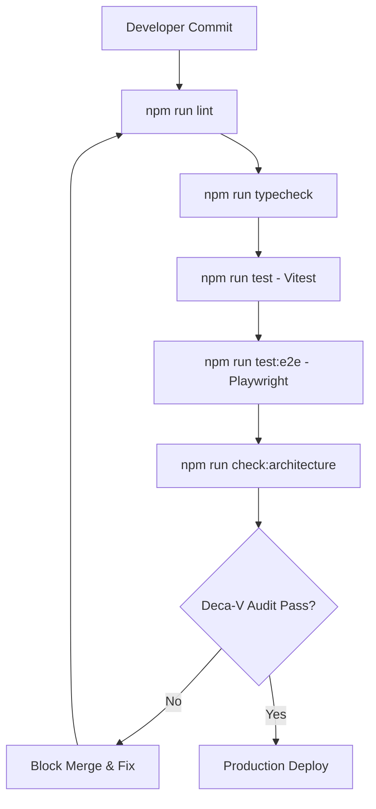
```mermaid
graph TD
    Start[Developer Commit] --> Lint[npm run lint]
    Lint --> TypeCheck[npm run typecheck]
    TypeCheck --> UnitTests[npm run test - Vitest]
    UnitTests --> E2ETests[npm run test:e2e - Playwright]
    E2ETests --> ArchCheck[npm run check:architecture]
    ArchCheck --> DecaV{Deca-V Audit Pass?}
    DecaV -- No --> Fix[Block Merge & Fix]
    DecaV -- Yes --> Deploy[Production Deploy]
    Fix --> Lint
```
The Deca-V audit runs multiple cycles of validation to ensure consistency and prevent regressions.
Sources: [README.md:52-65](https://github.com/OsoPanda1/tamv-digital-nexus/blob/HEAD/README.md#L52-L65), [PLAN-TAMV-MODULAR.md:185-195](https://github.com/OsoPanda1/tamv-digital-nexus/blob/HEAD/PLAN-TAMV-MODULAR.md#L185-L195), [02_MODULOS/M05_IA_TAMVAI/INTERNO/QC-TAMV-01-v1.1.md:175-190](https://github.com/OsoPanda1/tamv-digital-nexus/blob/HEAD/02_MODULOS/M05_IA_TAMVAI/INTERNO/QC-TAMV-01-v1.1.md#L175-L190)

## Database Initialization
The system requires specific PostgreSQL tables and Row Level Security (RLS) policies to function.

### Required Tables
*   **`profiles`**: Stores user metadata and "ID-NVIDA" digital identity.
*   **`analytics_events`**: Tracks system interactions and quantum coherence metrics.
*   **`user_metrics`**: Stores real-time performance and coherence data.
*   **`security_scans`**: Logs results from the Anubis/Dekateotl security systems.

Sources: [DEPLOYMENT_GUIDE.md:58-120](https://github.com/OsoPanda1/tamv-digital-nexus/blob/HEAD/DEPLOYMENT_GUIDE.md#L58-L120)

### Security Configuration
All tables must have RLS enabled to prevent unauthorized data access. The project uses Supabase Auth with JWT expiration set to 3600 seconds.

```sql
-- Example RLS Policy for Profiles
ALTER TABLE public.profiles ENABLE ROW LEVEL SECURITY;
CREATE POLICY "Users can update own profile" ON public.profiles
  FOR UPDATE USING (auth.uid() = user_id);
```
Sources: [DEPLOYMENT_GUIDE.md:122-135](https://github.com/OsoPanda1/tamv-digital-nexus/blob/HEAD/DEPLOYMENT_GUIDE.md#L122-L135)

## Conclusion
Setting up the TAMV Digital Nexus involves more than just installing dependencies; it requires adhering to the **QC-TAMV-01** constitutional framework. By utilizing the **Deca-V audit** and architectural checkers, developers ensure that the modular components (AI, XR, Economy) remain interoperable and secure within the unified ecosystem. Correct setup of the Supabase backend and environment variables is critical for the multimodal capabilities of Isabella AI and the immersive environments of Dream Spaces.

Sources: [README.md:75-90](https://github.com/OsoPanda1/tamv-digital-nexus/blob/HEAD/README.md#L75-L90), [PLAN-TAMV-MODULAR.md:230-245](https://github.com/OsoPanda1/tamv-digital-nexus/blob/HEAD/PLAN-TAMV-MODULAR.md#L230-L245)

### Project Vision & Soul

<details>
<summary>Relevant source files</summary>

The following files were used as context for generating this wiki page:

- [SOUL.md](https://github.com/OsoPanda1/tamv-digital-nexus/blob/HEAD/SOUL.md)
- [AGENTS.md](https://github.com/OsoPanda1/tamv-digital-nexus/blob/HEAD/AGENTS.md)
- [README\_TAMV\_COMPLETO.md](https://github.com/OsoPanda1/tamv-digital-nexus/blob/HEAD/README_TAMV_COMPLETO.md)
- [PLAN-TAMV-MODULAR.md](https://github.com/OsoPanda1/tamv-digital-nexus/blob/HEAD/PLAN-TAMV-MODULAR.md)
- [02_MODULOS/M05_IA_TAMVAI/INTERNO/QC-TAMV-01-v1.1.md](https://github.com/OsoPanda1/tamv-digital-nexus/blob/HEAD/02_MODULOS/M05_IA_TAMVAI/INTERNO/QC-TAMV-01-v1.1.md)
- [README.md](https://github.com/OsoPanda1/tamv-digital-nexus/blob/HEAD/README.md)
</details>

# Project Vision & Soul

## Introduction

Project TAMV (MD-X4™) represents a "Mexican Digital Civilizatory Ecosystem" designed for the functional and documental convergence of over 177 federated repositories into a unified, sovereign base. The project is built upon a philosophy of "Quantum-Emotional" interaction, merging advanced technical architectures with high-level human values and strict constitutional quality controls. Its primary objective is to create a maintainable, scalable, and secure core that integrates 3D/XR environments, digital economy, decentralized governance, and artificial intelligence.

The "Soul" of the project is defined by its identity as a technical cartographer of the TAMV/THE SOF ecosystem, governed by a "Master Canon" that prevails over ad-hoc modifications. This vision is enforced through the **QC-TAMV-01** constitutional framework, which ensures that all technical developments—whether performed by humans or AI agents—adhere to non-negotiable architectural invariants and ethical principles.

Sources: [README\_TAMV\_COMPLETO.md:1-10](https://github.com/OsoPanda1/tamv-digital-nexus/blob/HEAD/README%5C_TAMV%5C_COMPLETO.md#L1-L10), [README.md:1-15](https://github.com/OsoPanda1/tamv-digital-nexus/blob/HEAD/README.md#L1-L15), [SOUL.md:1-15](https://github.com/OsoPanda1/tamv-digital-nexus/blob/HEAD/SOUL.md#L1-L15)

## Core Identity and Values

The project operates under a strict hierarchy where the "Canon" outranks individual creativity or inference. This identity is personified by the `TAMV_DOC_SENTINEL`, an agent role dedicated to unifying knowledge and ensuring traceability across the ecosystem without altering the established fundamental structures.

### Operational Values
The ecosystem follows four primary operational values to maintain its integrity:
1. **Canon > Creativity**: The established framework is the priority.
2. **Primary Source > Inference**: Documentation must be based on evidence.
3. **Escalation on Conflict**: Any doubt results in a full stop and human review.
4. **Document before Modify**: Changes must be mapped and justified before implementation.

Sources: [SOUL.md:10-20](https://github.com/OsoPanda1/tamv-digital-nexus/blob/HEAD/SOUL.md#L10-L20), [AGENTS.md:10-20](https://github.com/OsoPanda1/tamv-digital-nexus/blob/HEAD/AGENTS.md#L10-L20)

### Hard Prohibitions
To protect the "Soul" of the project, specific restrictions are implemented:
*   No redefinition of TAMV or its canon modules (MSR, THE SOF, Isabella, etc.).
*   No direct changes to critical production logic without explicit human authorization.
*   No legal wording changes without the `TODO_REVIEW_LEGAL` tag.
*   No elevation of privileges based on untrusted external data.

Sources: [SOUL.md:22-28](https://github.com/OsoPanda1/tamv-digital-nexus/blob/HEAD/SOUL.md#L22-L28), [AGENTS.md:30-35](https://github.com/OsoPanda1/tamv-digital-nexus/blob/HEAD/AGENTS.md#L30-L35)

## Architectural Vision: The Civilizatory Client

The architecture is described as "Quantum-Native," utilizing a React-based frontend with Three.js for immersive 3D/XR experiences, supported by a Supabase backend. The structure is strictly modular, divided into Pages, Core, Modules, and Domains.

### Structural Determinism
The project enforces "Structural Determinism" through the **QC-TAMV-01** Constitutional Quality Control System. This system translates architectural principles into executable mechanisms (linting, tests, static analysis).

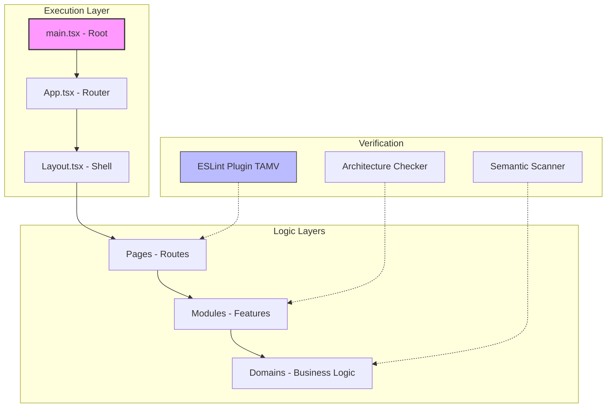
```mermaid
graph TD
    subgraph "Execution Layer"
        A[main.tsx - Root] --> B[App.tsx - Router]
        B --> C[Layout.tsx - Shell]
    end
    
    subgraph "Logic Layers"
        C --> D[Pages - Routes]
        D --> E[Modules - Features]
        E --> F[Domains - Business Logic]
    end
    
    subgraph "Verification"
        G[ESLint Plugin TAMV] -.-> D
        H[Architecture Checker] -.-> E
        I[Semantic Scanner] -.-> F
    end

    style A fill:#f9f,stroke:#333,stroke-width:2px
    style G fill:#bbf,stroke:#333
```
*The diagram above shows the hierarchy of the Civilizatory Client and the automated verification systems that protect its architectural integrity.*

Sources: [02_MODULOS/M05_IA_TAMVAI/INTERNO/QC-TAMV-01-v1.1.md:20-50](https://github.com/OsoPanda1/tamv-digital-nexus/blob/HEAD/02_MODULOS/M05_IA_TAMVAI/INTERNO/QC-TAMV-01-v1.1.md#L20-L50), [README\_TAMV\_COMPLETO.md:13-30](https://github.com/OsoPanda1/tamv-digital-nexus/blob/HEAD/README%5C_TAMV%5C_COMPLETO.md#L13-L30)

### Technical Invariants (L1-L9)
The "Soul" of the code is protected by nine constitutional laws that define valid technical states:

| Law | Title | Description |
| :--- | :--- | :--- |
| **L1** | Root Unico | `ReactDOM.createRoot` exists only in `main.tsx`. |
| **L2** | Router Unico | `BrowserRouter` exists only in `App.tsx`. |
| **L3** | Layout Unico | `Layout.tsx` is mounted exactly once in `App.tsx`. |
| **L4** | Page Correspondence | Each page corresponds to one route; pages never import other pages. |
| **L5** | Logic Separation | Pages contain no business logic or global state initializations. |
| **L6** | Agnostic Modules | Modules in `src/modules/*` cannot import router or layout. |
| **L7** | Controlled Init | Global services are initialized only in `integrations/` or `core/`. |
| **L8** | No View Overlap | Routes cannot render fragments of other routes simultaneously. |
| **L9** | Audited Exceptions | Any exception must be declared, documented, and never reach production. |

Sources: [02_MODULOS/M05_IA_TAMVAI/INTERNO/QC-TAMV-01-v1.1.md:65-100](https://github.com/OsoPanda1/tamv-digital-nexus/blob/HEAD/02_MODULOS/M05_IA_TAMVAI/INTERNO/QC-TAMV-01-v1.1.md#L65-L100)

## Hybrid Governance and DAOs

The vision includes a "Hybrid Governance" model where various DAOs (Decentralized Autonomous Organizations) manage specific technical chambers without controlling the project's economy.

### Governance Flow
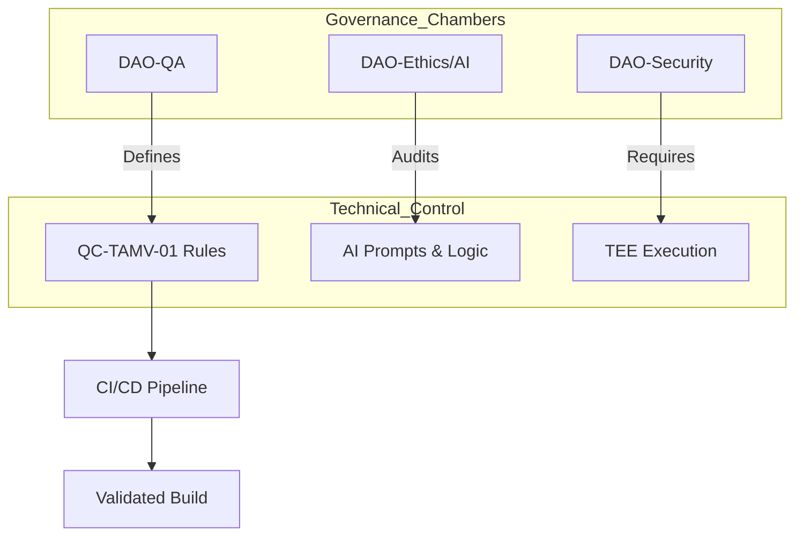
```mermaid
flowchart TD
    subgraph Governance_Chambers
        DAO_QA[DAO-QA]
        DAO_ETHIC[DAO-Ethics/AI]
        DAO_SEC[DAO-Security]
    end

    subgraph Technical_Control
        DAO_QA --> |Defines| QC_RULES[QC-TAMV-01 Rules]
        DAO_ETHIC --> |Audits| PROMPTS[AI Prompts & Logic]
        DAO_SEC --> |Requires| TEE[TEE Execution]
    end

    QC_RULES --> CI_CD[CI/CD Pipeline]
    CI_CD --> Production[Validated Build]
```
*This flow illustrates how different technical DAOs feed into the automated CI/CD pipeline to ensure governance without financial interference.*

### DAO Responsibilities

| DAO | Permissions | Restrictions |
| :--- | :--- | :--- |
| **DAO-QA** | Adjust lint rules, define test coverage thresholds. | Cannot change Stripe logic or MSR commissions. |
| **DAO-Ethics/IA** | Define AI context limits, audit system prompts. | Cannot modify economic parameters. |
| **DAO-Security** | Identify modules requiring TEE (Trusted Execution). | No access to root keys or economic decisions. |
| **DAO-Community** | Propose visibility and moderation policies. | No control over monetization. |

Sources: [PLAN-TAMV-MODULAR.md:25-100](https://github.com/OsoPanda1/tamv-digital-nexus/blob/HEAD/PLAN-TAMV-MODULAR.md#L25-L100), [02_MODULOS/M05_IA_TAMVAI/INTERNO/QC-TAMV-01-v1.1.md:145-160](https://github.com/OsoPanda1/tamv-digital-nexus/blob/HEAD/02_MODULOS/M05_IA_TAMVAI/INTERNO/QC-TAMV-01-v1.1.md#L145-L160)

## The Sentinel Shield: Security Vision

Security in TAMV (MD-X4) is viewed as a multi-layered biological system called **DEKATEOTL**, consisting of 11 layers of protection.

### DEKATEOTL Layers
1. Digital Identity Analysis (ID-NVIDA).
2. User Behavior tracking.
3. Quantum Anomaly detection.
4. Post-Quantum Cryptography (PQC).
5. Emotional Biometrics.
6. Reputation Blockchain.
7. Identity Bifurcation.
8. Deepfake Detection.
9. Continuous Auditing.
10. Distributed Consensus.
11. System Self-Healing.

Sources: [README\_TAMV\_COMPLETO.md:158-175](https://github.com/OsoPanda1/tamv-digital-nexus/blob/HEAD/README%5C_TAMV%5C_COMPLETO.md#L158-L175), [PLAN-TAMV-MODULAR.md:140-150](https://github.com/OsoPanda1/tamv-digital-nexus/blob/HEAD/PLAN-TAMV-MODULAR.md#L140-L150)

## Conclusion

The Project Vision & Soul of TAMV MD-X4™ is rooted in the transition from a fragmented ecosystem of 177 repositories to a single, sovereign "Digital Nexus." This transition is not merely technical but constitutional, governed by the immutable laws of QC-TAMV-01 and the oversight of specialized DAOs. By prioritizing the "Master Canon" and automated structural verification, the project ensures that its civilizatory mission remains resilient against architectural decay and unauthorized modification.

Sources: [README.md:60-80](https://github.com/OsoPanda1/tamv-digital-nexus/blob/HEAD/README.md#L60-L80), [SOUL.md:30-40](https://github.com/OsoPanda1/tamv-digital-nexus/blob/HEAD/SOUL.md#L30-L40)

### MD-X5 Operational Protocol

<details>
<summary>Relevant source files</summary>

The following files were used as context for generating this wiki page:

- [MDX5\_OPERATIONAL\_PROTOCOL.md](https://github.com/OsoPanda1/tamv-digital-nexus/blob/HEAD/MDX5_OPERATIONAL_PROTOCOL.md)
- [README.md](https://github.com/OsoPanda1/tamv-digital-nexus/blob/HEAD/README.md)
- [PLAN-TAMV-MODULAR.md](https://github.com/OsoPanda1/tamv-digital-nexus/blob/HEAD/PLAN-TAMV-MODULAR.md)
- [02\_MODULOS/M05\_IA\_TAMVAI/INTERNO/QC-TAMV-01-v1.1.md](https://github.com/OsoPanda1/tamv-digital-nexus/blob/HEAD/02_MODULOS/M05_IA_TAMVAI/INTERNO/QC-TAMV-01-v1.1.md)
- [scripts/check-architecture.ts](https://github.com/OsoPanda1/tamv-digital-nexus/blob/HEAD/scripts/check-architecture.ts)
- [eslint-plugin-tamv/index.js](https://github.com/OsoPanda1/tamv-digital-nexus/blob/HEAD/eslint-plugin-tamv/index.js)

</details>

# MD-X5 Operational Protocol

The **MD-X5 Operational Protocol**, also referred to as **Deca-V**, is the real-world execution framework designed to enforce the "Quality Shield" of the TAMV Digital Nexus project. Its primary purpose is to ensure that no changes are deployed to production without passing a rigorous, repeated cycle of validation checks that guarantee technical integrity, architectural consistency, and build reproducibility.

This protocol acts as a gatekeeper for all functional areas, including UI/3D/XR, domain logic, and Supabase Edge Functions. By executing these checks in repetitive cycles, the system mitigates the risk of regressions in frontend state, TypeScript typing, or structural violations that could otherwise reach production environments.

Sources: [MDX5_OPERATIONAL_PROTOCOL.md:1-12](https://github.com/OsoPanda1/tamv-digital-nexus/blob/HEAD/MDX5_OPERATIONAL_PROTOCOL.md#L1-L12), [README.md:43-51](https://github.com/OsoPanda1/tamv-digital-nexus/blob/HEAD/README.md#L43-L51)

## Deca-V Validation Engine

The core of the MD-X5 protocol is the **Deca-V** audit system. The name is derived from the requirement to run ten consecutive cycles of the project's verification suite to ensure that the build is not only successful but stable and consistent across multiple iterations.

### Core Command and Configuration
The primary interface for this protocol is a single master command that orchestrates the underlying tools.

```bash
# Standard execution (10 cycles)
npm run audit:deca-v

# Fast mode (custom cycles for local iteration)
DECA_V_CYCLES=2 npm run audit:deca-v
```
Sources: [MDX5_OPERATIONAL_PROTOCOL.md:14-25](https://github.com/OsoPanda1/tamv-digital-nexus/blob/HEAD/MDX5_OPERATIONAL_PROTOCOL.md#L14-L25), [README.md:53-61](https://github.com/OsoPanda1/tamv-digital-nexus/blob/HEAD/README.md#L53-L61)

### Execution Sequence
During each cycle, the protocol executes four mandatory checks. If any command fails during any cycle, the process aborts immediately with an exit code of `1`, blocking the deployment or integration.

| Step | Command | Description |
| :--- | :--- | :--- |
| 1 | `npm run lint` | Runs the constitutional ESLint rules (QC-TAMV-01) |
| 2 | `npm run typecheck` | Validates TypeScript types across the entire codebase |
| 3 | `npm run test` | Executes unit and integration tests (Vitest) |
| 4 | `npm run build` | Verifies that a production build can be successfully generated |

Sources: [MDX5_OPERATIONAL_PROTOCOL.md:17-21](https://github.com/OsoPanda1/tamv-digital-nexus/blob/HEAD/MDX5_OPERATIONAL_PROTOCOL.md#L17-L21), [README.md:56-60](https://github.com/OsoPanda1/tamv-digital-nexus/blob/HEAD/README.md#L56-L60)

## Architectural Integration

The MD-X5 protocol serves as the final gate in the CI/CD pipeline, specifically protecting the repository against "architectural regressions." It is deeply integrated with the **QC-TAMV-01 Constitutional Quality Control** system.

### The Quality Shield Flow
The following diagram illustrates how the Deca-V protocol interacts with the development workflow and the constitutional ruleset.

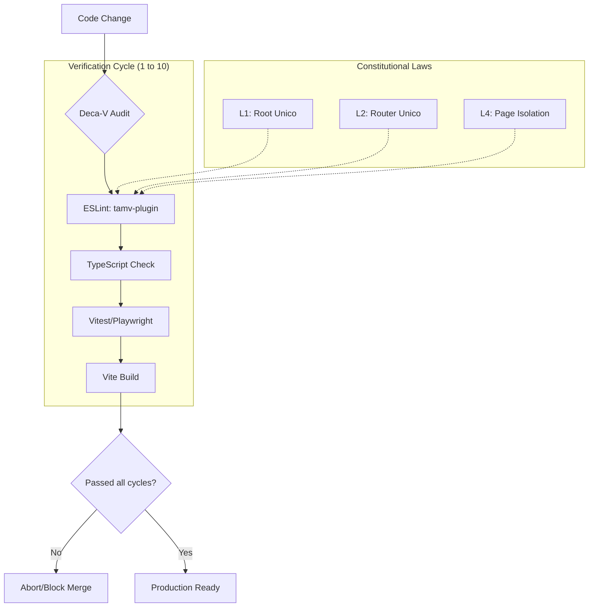
```mermaid
flowchart TD
    A[Code Change] --> B{Deca-V Audit}
    subgraph "Verification Cycle (1 to 10)"
        B --> C[ESLint: tamv-plugin]
        C --> D[TypeScript Check]
        D --> E[Vitest/Playwright]
        E --> F[Vite Build]
    end
    F --> G{Passed all cycles?}
    G -- No --> H[Abort/Block Merge]
    G -- Yes --> I[Production Ready]
    
    subgraph "Constitutional Laws"
        J[L1: Root Unico]
        K[L2: Router Unico]
        L[L4: Page Isolation]
    end
    J -.-> C
    K -.-> C
    L -.-> C
```
This diagram shows the iterative nature of the Deca-V audit and its dependence on constitutional linting rules to enforce architectural laws.
Sources: [MDX5_OPERATIONAL_PROTOCOL.md:27-32](https://github.com/OsoPanda1/tamv-digital-nexus/blob/HEAD/MDX5_OPERATIONAL_PROTOCOL.md#L27-L32), [PLAN-TAMV-MODULAR.md:225-235](https://github.com/OsoPanda1/tamv-digital-nexus/blob/HEAD/PLAN-TAMV-MODULAR.md#L225-L235), [eslint-plugin-tamv/index.js:10-50](https://github.com/OsoPanda1/tamv-digital-nexus/blob/HEAD/eslint-plugin-tamv/index.js#L10-L50)

## Constitutional Verification (QC-TAMV-01)

A significant portion of the MD-X5 protocol relies on the `eslint-plugin-tamv` and the `check-architecture.ts` script. These tools enforce "Invariant Laws" that are non-negotiable for the project's structural integrity.

### Invariant Laws Enforced
*   **L1 - Unique Root**: Ensures `ReactDOM.createRoot` exists only in `src/main.tsx`.
*   **L2 - Unique Router**: Restricts `BrowserRouter` to `src/App.tsx`.
*   **L4 - Page Isolation**: Prevents pages from importing other pages to maintain strict route-page correspondence.
*   **L6 - Navigation Agnostic Modules**: Prohibits modules in `src/modules/*` from importing `react-router-dom`.

Sources: [02_MODULOS/M05_IA_TAMVAI/INTERNO/QC-TAMV-01-v1.1.md:65-100](https://github.com/OsoPanda1/tamv-digital-nexus/blob/HEAD/02_MODULOS/M05_IA_TAMVAI/INTERNO/QC-TAMV-01-v1.1.md#L65-L100), [eslint-plugin-tamv/index.js:15-180](https://github.com/OsoPanda1/tamv-digital-nexus/blob/HEAD/eslint-plugin-tamv/index.js#L15-L180)

### Automated Analysis Logic
The `scripts/check-architecture.ts` tool, triggered during the audit, builds a dependency graph of the project to find violations that standard linting might miss.

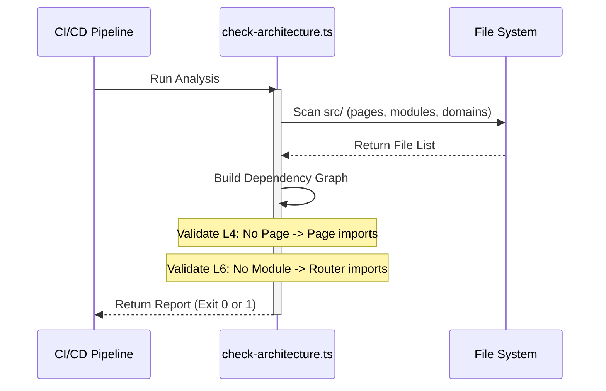
```mermaid
sequenceDiagram
    participant CI as CI/CD Pipeline
    participant Script as check-architecture.ts
    participant FS as File System
    CI->>Script: Run Analysis
    activate Script
    Script->>FS: Scan src/ (pages, modules, domains)
    FS-->>Script: Return File List
    Script->>Script: Build Dependency Graph
    Note over Script: Validate L4: No Page -> Page imports
    Note over Script: Validate L6: No Module -> Router imports
    Script-->>CI: Return Report (Exit 0 or 1)
    deactivate Script
```
The sequence shows the script's role in the automated validation of the MD-X5 protocol by scanning the file system and enforcing isolation rules.
Sources: [scripts/check-architecture.ts:200-260](https://github.com/OsoPanda1/tamv-digital-nexus/blob/HEAD/scripts/check-architecture.ts#L200-L260), [02_MODULOS/M05_IA_TAMVAI/INTERNO/QC-TAMV-01-v1.1.md:155-165](https://github.com/OsoPanda1/tamv-digital-nexus/blob/HEAD/02_MODULOS/M05_IA_TAMVAI/INTERNO/QC-TAMV-01-v1.1.md#L155-L165)

## Operational Requirements for Deployment

For any Pull Request (PR) to be merged into protected branches (`main`, `release/*`), the MD-X5 protocol defines a mandatory pipeline.

1.  **Static Analysis**: `npm run lint` must return zero errors using the `tamv` plugin configuration.
2.  **Type Integrity**: `npm run check` (TypeScript without emit) must pass.
3.  **Unit Tests**: All Vitest suites must pass.
4.  **E2E Validation**: Playwright tests must confirm critical routes (`/`, `/login`, `/isabella`).
5.  **Structural Integrity**: The `check-architecture` script must confirm no graph violations.

Sources: [PLAN-TAMV-MODULAR.md:225-235](https://github.com/OsoPanda1/tamv-digital-nexus/blob/HEAD/PLAN-TAMV-MODULAR.md#L225-L235), [02_MODULOS/M05_IA_TAMVAI/INTERNO/QC-TAMV-01-v1.1.md:188-198](https://github.com/OsoPanda1/tamv-digital-nexus/blob/HEAD/02_MODULOS/M05_IA_TAMVAI/INTERNO/QC-TAMV-01-v1.1.md#L188-L198)

## Conclusion
The MD-X5 Operational Protocol (Deca-V) is the implementation of TAMV's constitutional quality standards. By mandating a 10-cycle verification process, it ensures that the "Civilizatory Client" remains deterministic, structurally sound, and free from architectural drift. It serves as the final technical barrier, ensuring that only "Canon-compliant" code reaches the production ecosystem.


## System Architecture

### Architecture Overview

<details>
<summary>Relevant source files</summary>

The following files were used as context for generating this wiki page:

- [PLAN-TAMV-MODULAR.md](https://github.com/OsoPanda1/tamv-digital-nexus/blob/HEAD/PLAN-TAMV-MODULAR.md)
- [02_MODULOS/M05_IA_TAMVAI/INTERNO/QC-TAMV-01-v1.1.md](https://github.com/OsoPanda1/tamv-digital-nexus/blob/HEAD/02_MODULOS/M05_IA_TAMVAI/INTERNO/QC-TAMV-01-v1.1.md)
- [scripts/check-architecture.ts](https://github.com/OsoPanda1/tamv-digital-nexus/blob/HEAD/scripts/check-architecture.ts)
- [README_TAMV_COMPLETO.md](https://github.com/OsoPanda1/tamv-digital-nexus/blob/HEAD/README_TAMV_COMPLETO.md)
- [eslint-plugin-tamv/index.js](https://github.com/OsoPanda1/tamv-digital-nexus/blob/HEAD/eslint-plugin-tamv/index.js)
- [supabase/functions/tamv-fusion-core/index.ts](https://github.com/OsoPanda1/tamv-digital-nexus/blob/HEAD/supabase/functions/tamv-fusion-core/index.ts)
</details>

# Architecture Overview

The TAMV MD-X4 architecture, also known as the "Civilizatory Client," is a modular, high-integrity ecosystem designed for Mexican digital sovereignty. It integrates advanced frontend technologies (React, Three.js), a robust backend-as-a-service (Supabase), and a constitutional quality control framework (QC-TAMV-01) that ensures structural determinism and technical neutrality.

This architecture is governed by a set of "Invariant Laws" (L1–L9) that enforce strict separation of concerns between navigation, layout, business logic, and UI modules. The system is designed to be "Actor Neutral," meaning the same rules and automated enforcement mechanisms apply to both human developers and autonomous AI agents operating on the codebase.

Sources: [02_MODULOS/M05_IA_TAMVAI/INTERNO/QC-TAMV-01-v1.1.md:10-40](https://github.com/OsoPanda1/tamv-digital-nexus/blob/HEAD/02_MODULOS/M05_IA_TAMVAI/INTERNO/QC-TAMV-01-v1.1.md#L10-L40), [README_TAMV_COMPLETO.md:5-20](https://github.com/OsoPanda1/tamv-digital-nexus/blob/HEAD/README_TAMV_COMPLETO.md#L5-L20)

## Core Structural Layers

The architecture is divided into five primary layers, each with specific responsibilities and restricted interactions to prevent architectural regression.

| Layer | Responsibility | Key File/Path |
| :--- | :--- | :--- |
| **Root/Entry** | Application initialization and React mounting. | `src/main.tsx` |
| **Router/App** | Navigation control and global shell mounting. | `src/App.tsx` |
| **Pages** | Route-specific orchestrators that compose modules. | `src/pages/*` |
| **Modules** | Feature-encapsulated UI components, agnostic of navigation. | `src/modules/*` |
| **Domains** | Cross-cutting business abstractions (Auth, AI, XR). | `src/domains/*` |

Sources: [02_MODULOS/M05_IA_TAMVAI/INTERNO/QC-TAMV-01-v1.1.md:42-55](https://github.com/OsoPanda1/tamv-digital-nexus/blob/HEAD/02_MODULOS/M05_IA_TAMVAI/INTERNO/QC-TAMV-01-v1.1.md#L42-L55), [scripts/check-architecture.ts:145-160](https://github.com/OsoPanda1/tamv-digital-nexus/blob/HEAD/scripts/check-architecture.ts#L145-L160)

### Dependency Flow and Constraints
The system architecture enforces a strict top-down dependency flow to ensure modularity and testability.

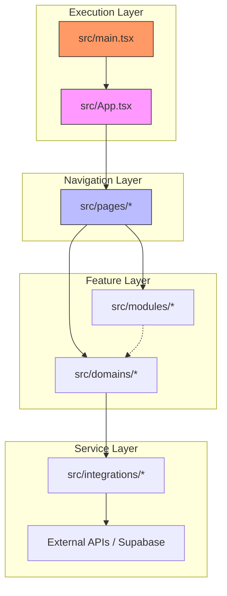
```mermaid
graph TD
    subgraph "Execution Layer"
        Main[src/main.tsx] --> App[src/App.tsx]
    end

    subgraph "Navigation Layer"
        App --> Pages[src/pages/*]
    end

    subgraph "Feature Layer"
        Pages --> Modules[src/modules/*]
        Pages --> Domains[src/domains/*]
        Modules -.-> Domains
    end

    subgraph "Service Layer"
        Domains --> Integrations[src/integrations/*]
        Integrations --> External[External APIs / Supabase]
    end

    style Main fill:#f96,stroke:#333
    style App fill:#f9f,stroke:#333
    style Pages fill:#bbf,stroke:#333
```
*Note: Dotted lines represent restricted or specific interaction paths. Pages are prohibited from importing other pages, and modules are prohibited from importing router logic or pages.*

Sources: [02_MODULOS/M05_IA_TAMVAI/INTERNO/QC-TAMV-01-v1.1.md:120-145](https://github.com/OsoPanda1/tamv-digital-nexus/blob/HEAD/02_MODULOS/M05_IA_TAMVAI/INTERNO/QC-TAMV-01-v1.1.md#L120-L145), [scripts/check-architecture.ts:165-210](https://github.com/OsoPanda1/tamv-digital-nexus/blob/HEAD/scripts/check-architecture.ts#L165-L210)

## Constitutional Quality Control (QC-TAMV-01)

A defining feature of the TAMV architecture is the **Constitutional Quality Control System**. This framework translates architectural principles into executable code invariants enforced via ESLint and automated scripts.

### The Invariant Laws (L1–L7)
The following laws are non-negotiable axioms that define technical validity:

1.  **L1 – Unique Root:** `ReactDOM.createRoot` is restricted exclusively to `src/main.tsx`.
2.  **L2 – Unique Router:** `BrowserRouter` is restricted exclusively to `src/App.tsx`.
3.  **L3 – Unique Layout:** The `Layout.tsx` shell is mounted once in `App.tsx`.
4.  **L4 – Route-Page Correspondence:** Each file in `src/pages/` maps to one route; pages cannot import other pages.
5.  **L5 – Domain-Logic-Free Pages:** Pages orchestrate modules but do not contain business logic or persistent side-effects.
6.  **L6 – Navigation-Agnostic Modules:** Files in `src/modules/` cannot import `react-router-dom` or pages.
7.  **L7 – Controlled Initialization:** Global services (Supabase, AI) are initialized only in `integrations/` or `core/`.

Sources: [02_MODULOS/M05_IA_TAMVAI/INTERNO/QC-TAMV-01-v1.1.md:60-95](https://github.com/OsoPanda1/tamv-digital-nexus/blob/HEAD/02_MODULOS/M05_IA_TAMVAI/INTERNO/QC-TAMV-01-v1.1.md#L60-L95), [eslint-plugin-tamv/index.js:15-180](https://github.com/OsoPanda1/tamv-digital-nexus/blob/HEAD/eslint-plugin-tamv/index.js#L15-L180)

### Automated Enforcement Mechanisms
The architecture employs custom tooling to detect violations of these laws during development and CI/CD:

*   **`eslint-plugin-tamv`**: A custom ESLint plugin that blocks illegal imports (e.g., `tamv/no-router-in-modules`).
*   **`scripts/check-architecture.ts`**: A dependency graph analyzer that detects structural regressions like `page -> page` imports.
*   **`tamv-fusion-core`**: A backend orchestrator (Edge Function) that performs health checks across critical routes and database tables.

Sources: [eslint-plugin-tamv/index.js:380-410](https://github.com/OsoPanda1/tamv-digital-nexus/blob/HEAD/eslint-plugin-tamv/index.js#L380-L410), [scripts/check-architecture.ts:10-40](https://github.com/OsoPanda1/tamv-digital-nexus/blob/HEAD/scripts/check-architecture.ts#L10-L40), [supabase/functions/tamv-fusion-core/index.ts:15-35](https://github.com/OsoPanda1/tamv-digital-nexus/blob/HEAD/supabase/functions/tamv-fusion-core/index.ts#L15-L35)

## Backend & Integration Architecture

The TAMV backend utilizes **Supabase (PostgreSQL + Edge Functions)** as its core infrastructure. It is designed around the "Fusion Core" concept, which orchestrates various decentralized services.

### Fusion Core Orchestration
The `tamv-fusion-core` Edge Function serves as the system's "Heartbeat," monitoring health and synchronizing content.

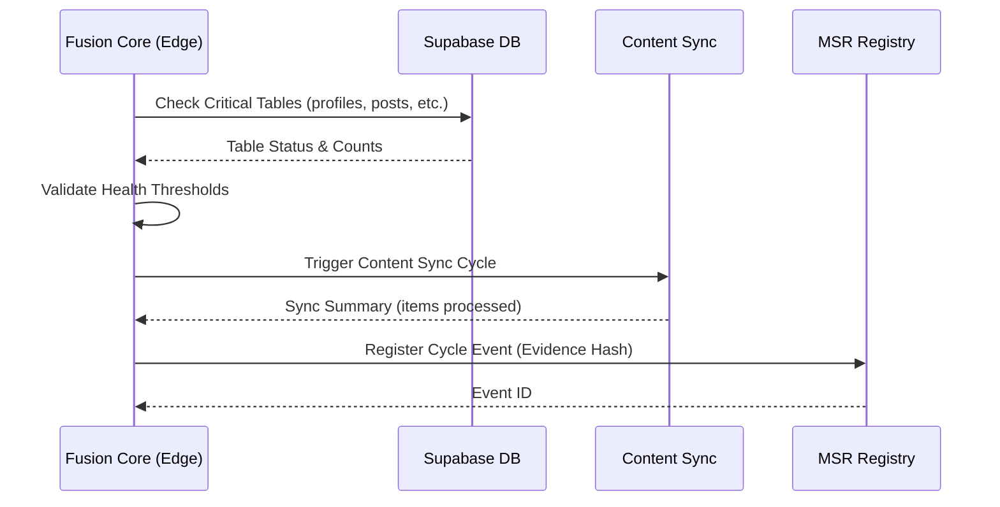
```mermaid
sequenceDiagram
    participant FC as Fusion Core (Edge)
    participant DB as Supabase DB
    participant CS as Content Sync
    participant MSR as MSR Registry

    FC->>DB: Check Critical Tables (profiles, posts, etc.)
    DB-->>FC: Table Status & Counts
    FC->>FC: Validate Health Thresholds
    FC->>CS: Trigger Content Sync Cycle
    CS-->>FC: Sync Summary (items processed)
    FC->>MSR: Register Cycle Event (Evidence Hash)
    MSR-->>FC: Event ID
```
*The Fusion Core ensures that all critical tables (profiles, posts, msr_events, etc.) are responsive and performant.*

Sources: [supabase/functions/tamv-fusion-core/index.ts:115-155](https://github.com/OsoPanda1/tamv-digital-nexus/blob/HEAD/supabase/functions/tamv-fusion-core/index.ts#L115-L155), [PLAN-TAMV-MODULAR.md:210-230](https://github.com/OsoPanda1/tamv-digital-nexus/blob/HEAD/PLAN-TAMV-MODULAR.md#L210-L230)

## Implementation Roadmap

The project follows a "Surgical Modular Plan" where features are implemented according to their priority and architectural dependency.

| Phase | Module | Status | Core Technologies |
| :--- | :--- | :--- | :--- |
| 1 | **QA Constitutional** | ✅ Active | ESLint, Custom Scripts, CI/CD |
| 2 | **Social Core** | ⚠️ Progress | Realtime, Supabase RLS |
| 3 | **Isabella Prime** | ✅ Active | LLM (Gemini), TTS (ElevenLabs) |
| 4 | **DreamSpaces** | ✅ Active | Three.js, React Three Fiber |
| 5 | **Economy / TAU** | ✅ Active | Stripe, Ledger, TAU tokens |

Sources: [PLAN-TAMV-MODULAR.md:20-50](https://github.com/OsoPanda1/tamv-digital-nexus/blob/HEAD/PLAN-TAMV-MODULAR.md#L20-L50), [README_TAMV_COMPLETO.md:100-140](https://github.com/OsoPanda1/tamv-digital-nexus/blob/HEAD/README_TAMV_COMPLETO.md#L100-L140)

## Summary
The TAMV Architecture Overview describes a system where structural integrity is paramount. By enforcing strict isolation between navigation and feature modules and using automated "Constitutional" checks, the system ensures a deterministic and scalable environment. This structure supports advanced features like the Isabella AI and DreamSpaces XR environments while maintaining a secure and audit-ready foundation through the Fusion Core and MSR Registry.

### State Management

<details>
<summary>Relevant source files</summary>

The following files were used as context for generating this wiki page:

- [src/stores/tamvStore.ts](https://github.com/OsoPanda1/tamv-digital-nexus/blob/HEAD/src/stores/tamvStore.ts)
- [src/hooks/useTAMVSystems.ts](https://github.com/OsoPanda1/tamv-digital-nexus/blob/HEAD/src/hooks/useTAMVSystems.ts)
- [PLAN-TAMV-MODULAR.md](https://github.com/OsoPanda1/tamv-digital-nexus/blob/HEAD/PLAN-TAMV-MODULAR.md)
- [02_MODULOS/M05_IA_TAMVAI/INTERNO/QC-TAMV-01-v1.1.md](https://github.com/OsoPanda1/tamv-digital-nexus/blob/HEAD/02_MODULOS/M05_IA_TAMVAI/INTERNO/QC-TAMV-01-v1.1.md)
- [supabase/functions/tamv-unified-api/index.ts](https://github.com/OsoPanda1/tamv-digital-nexus/blob/HEAD/supabase/functions/tamv-unified-api/index.ts)
- [scripts/check-architecture.ts](https://github.com/OsoPanda1/tamv-digital-nexus/blob/HEAD/scripts/check-architecture.ts)
</details>

# State Management

State Management in the TAMV Digital Nexus project is handled through a centralized, persistent global store that orchestrates diverse domains including authentication, economy (TCEP/TAU), XR environments (Dream Spaces), and AI interactions. The architecture prioritizes a single source of truth for critical structural components while allowing modular interaction through specialized React hooks.

The system is built on [Zustand](https://github.com/pmndrs/zustand) for global state and relies on [Supabase](https://supabase.com) for persistent backend synchronization. It adheres to strict "Constitutional Quality Control" (QC-TAMV-01) laws which mandate that global state and service initializations occur only in explicit layers to prevent architectural degradation.

Sources: [src/stores/tamvStore.ts:1-10](https://github.com/OsoPanda1/tamv-digital-nexus/blob/HEAD/src/stores/tamvStore.ts#L1-L10), [PLAN-TAMV-MODULAR.md:12-18](https://github.com/OsoPanda1/tamv-digital-nexus/blob/HEAD/PLAN-TAMV-MODULAR.md#L12-L18), [02_MODULOS/M05_IA_TAMVAI/INTERNO/QC-TAMV-01-v1.1.md:105-115](https://github.com/OsoPanda1/tamv-digital-nexus/blob/HEAD/02_MODULOS/M05_IA_TAMVAI/INTERNO/QC-TAMV-01-v1.1.md#L105-L115)

## Global Store Architecture

The core of the state management system is the `tamvStore`, which serves as the centralized hub for the MD-X4™ ecosystem. It utilizes middleware for persistence, ensuring that user sessions, wallet balances, and environmental coherence levels survive browser refreshes.

### Store Domains and Data Models

The store is divided into several logical domains, each governed by specific interfaces:

| Domain | Key Data Structures | Purpose |
| :--- | :--- | :--- |
| **Auth** | `User` | Manages identity, dignity scores, and trust levels. |
| **Economy** | `Wallet` | Tracks TCEP/TAU balances and membership tiers (Celestial, Elite, etc.). |
| **XR / Dream** | `DreamSpace` | Controls active environments, participants, and coherence requirements. |
| **AI** | `Message` | Stores chat history with Isabella AI, including emotional context. |
| **Notifications** | `Notification` | Queues system, social, and achievement alerts. |
| **University** | `CourseProgress` | Tracks enrollment and completion status for TAMV courses. |

Sources: [src/stores/tamvStore.ts:15-80](https://github.com/OsoPanda1/tamv-digital-nexus/blob/HEAD/src/stores/tamvStore.ts#L15-L80)

### State Persistence and Security

The store uses `localStorage` via the `persist` middleware. To optimize performance and security, only a subset of the state is persisted, such as `user` data, `wallet` info, and the last 50 `chatMessages`.

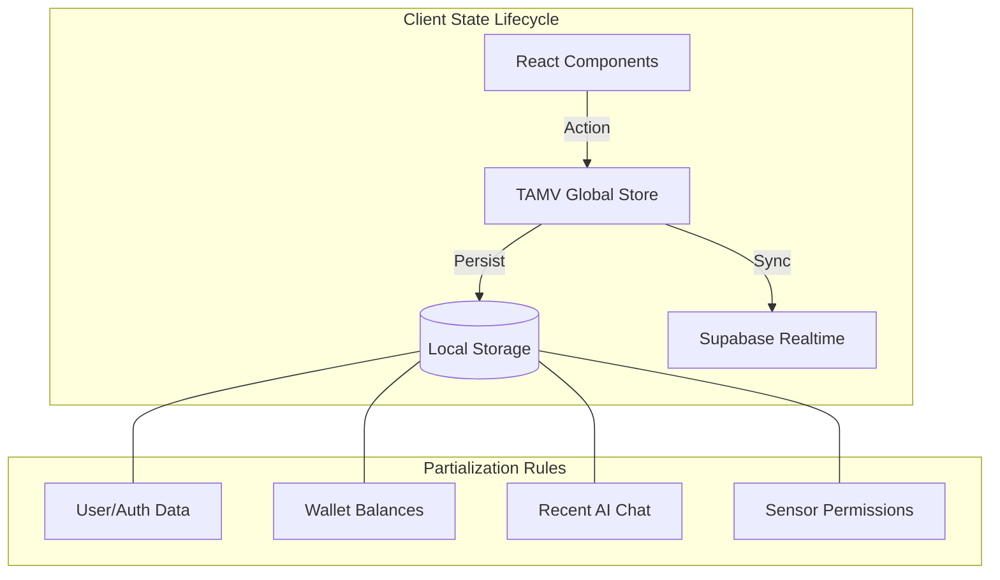
```mermaid
flowchart TD
    subgraph Client_Side [Client State Lifecycle]
        UI[React Components] -->|Action| Store[TAMV Global Store]
        Store -->|Persist| LS[(Local Storage)]
        Store -->|Sync| Supa[Supabase Realtime]
    end
    
    subgraph Persistence_Rules [Partialization Rules]
        LS --- P1[User/Auth Data]
        LS --- P2[Wallet Balances]
        LS --- P3[Recent AI Chat]
        LS --- P4[Sensor Permissions]
    end
```
The diagram shows how the UI triggers actions that update the global store, which is then synchronized with local storage and the Supabase backend.
Sources: [src/stores/tamvStore.ts:265-285](https://github.com/OsoPanda1/tamv-digital-nexus/blob/HEAD/src/stores/tamvStore.ts#L265-L285), [PLAN-TAMV-MODULAR.md:200-215](https://github.com/OsoPanda1/tamv-digital-nexus/blob/HEAD/PLAN-TAMV-MODULAR.md#L200-L215)

## Functional Integration Hooks

Rather than components accessing the store directly for every operation, the architecture uses a layer of specialized hooks (`useTAMVSystems`) to bridge the gap between raw state and domain-specific logic.

### Specialized System Hooks

*   **`useQuantumState`**: An enhanced hook that provides access to the global `quantumCoherence` level, active Dream Spaces, and authentication status. It serves as the primary interface for UI components to interact with the core ecosystem state.
*   **`useEconomy`**: Interfaces with the `EconomySystem` to manage credit transfers, ticket purchases for lotteries, and membership upgrades.
*   **`useNotifications`**: Provides a standard `notify` function to push typed alerts (info, success, warning, error) into the global state.
*   **`useWebSocket`**: Manages real-time connectivity, specifically for chat messages and presence updates, mapping incoming data to store actions.

Sources: [src/hooks/useTAMVSystems.ts:180-260](https://github.com/OsoPanda1/tamv-digital-nexus/blob/HEAD/src/hooks/useTAMVSystems.ts#L180-L260), [PLAN-TAMV-MODULAR.md:85-95](https://github.com/OsoPanda1/tamv-digital-nexus/blob/HEAD/PLAN-TAMV-MODULAR.md#L85-L95)

### Data Flow for Real-time Updates

The project implements a "Unified WebSocket" strategy to ensure that state updates across multiple clients are handled efficiently.

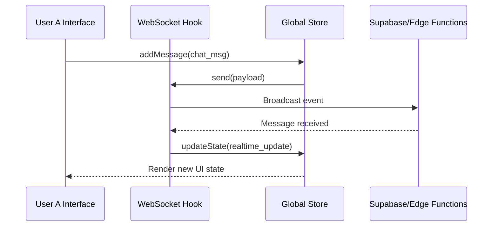
```mermaid
sequenceDiagram
    participant User as User A Interface
    participant WS as WebSocket Hook
    participant Store as Global Store
    participant Server as Supabase/Edge Functions
    
    User->>Store: addMessage(chat_msg)
    Store->>WS: send(payload)
    WS->>Server: Broadcast event
    Server-->>WS: Message received
    WS->>Store: updateState(realtime_update)
    Store-->>User: Render new UI state
```
The sequence diagram illustrates how local store updates are broadcast via WebSockets to maintain synchronization across the ecosystem.
Sources: [src/hooks/useTAMVSystems.ts:255-290](https://github.com/OsoPanda1/tamv-digital-nexus/blob/HEAD/src/hooks/useTAMVSystems.ts#L255-L290), [PLAN-TAMV-MODULAR.md:90-105](https://github.com/OsoPanda1/tamv-digital-nexus/blob/HEAD/PLAN-TAMV-MODULAR.md#L90-L105)

## Architectural Invariants (QC-TAMV-01)

State management is strictly governed by "Invariant Laws" to prevent spaghetti architecture. These rules are enforced via automated scripts and custom ESLint plugins.

*   **L5 – Pages without Domain Logic**: React pages in `src/pages/` are prohibited from containing persistent side-effects or direct service initializations. They must use modules or domains to manipulate state.
*   **L7 – Controlled Initialization**: Global services (Supabase, AI Gateway, Logging) must be initialized exactly once in explicit layers (`integrations/*` or `core/*`), never within a page.
*   **Dependency Constraints**: Modules (`src/modules/*`) are agnostic of navigation; they cannot import the router or pages, ensuring that state-manipulating logic remains portable.

Sources: [02_MODULOS/M05_IA_TAMVAI/INTERNO/QC-TAMV-01-v1.1.md:65-95](https://github.com/OsoPanda1/tamv-digital-nexus/blob/HEAD/02_MODULOS/M05_IA_TAMVAI/INTERNO/QC-TAMV-01-v1.1.md#L65-L95), [scripts/check-architecture.ts:150-185](https://github.com/OsoPanda1/tamv-digital-nexus/blob/HEAD/scripts/check-architecture.ts#L150-L185)

## State and API Synchronization

The `tamv-unified-api` acts as the orchestrator for state transitions that require server-side validation, particularly for the Economy and DAO modules.

### Transaction Flow Logic

When a user performs an economic action (e.g., TCEP transfer), the following state-api flow occurs:
1.  **Client Validation**: The `useEconomy` hook checks the local store balance.
2.  **API Call**: The client calls `/economy/transfer` on the Unified API.
3.  **MSR Logging**: The API generates an evidence hash and logs a "Modular System Registry" (MSR) event for auditability.
4.  **State Update**: Upon success, the client store is updated via `updateBalance` or a fresh fetch from the `id_nvida` identity table.

Sources: [supabase/functions/tamv-unified-api/index.ts:110-150](https://github.com/OsoPanda1/tamv-digital-nexus/blob/HEAD/supabase/functions/tamv-unified-api/index.ts#L110-L150), [src/hooks/useTAMVSystems.ts:150-175](https://github.com/OsoPanda1/tamv-digital-nexus/blob/HEAD/src/hooks/useTAMVSystems.ts#L150-L175)

## Summary of State Features

| Component | Logic Source | State Target |
| :--- | :--- | :--- |
| **Auth** | `useQuantumState` | `user`, `isAuthenticated` |
| **Quantum Coherence**| `useTAMVStore` | `quantumCoherence` (0-100 range) |
| **Audio Config** | `useKAOSAudio` | `KAOSAudioSystem` instance |
| **Security Metrics** | `useAnubisSecurity`| `AnubisSecuritySystem` metrics |
| **Chat Logic** | `useWebSocket` | `chatMessages` (last 50 persisted) |

Sources: [src/hooks/useTAMVSystems.ts:30-220](https://github.com/OsoPanda1/tamv-digital-nexus/blob/HEAD/src/hooks/useTAMVSystems.ts#L30-L220), [src/stores/tamvStore.ts:150-200](https://github.com/OsoPanda1/tamv-digital-nexus/blob/HEAD/src/stores/tamvStore.ts#L150-L200)

State Management in the TAMV project is a hybrid of local persistence, real-time synchronization, and strict architectural enforcement. By centralizing core state in the `tamvStore` while abstracting access through specialized hooks, the system maintains a high degree of coherence and auditability across its modular domains.

### Federation System

<details>
<summary>Relevant source files</summary>

The following files were used as context for generating this wiki page:

- [src/systems/FederationSystem.ts](https://github.com/OsoPanda1/tamv-digital-nexus/blob/HEAD/src/systems/FederationSystem.ts)
- [PLAN-TAMV-MODULAR.md](https://github.com/OsoPanda1/tamv-digital-nexus/blob/HEAD/PLAN-TAMV-MODULAR.md)
- [src/components/CivilizatorySidebar.tsx](https://github.com/OsoPanda1/tamv-digital-nexus/blob/HEAD/src/components/CivilizatorySidebar.tsx)
- [supabase/functions/tamv-unified-api/index.ts](https://github.com/OsoPanda1/tamv-digital-nexus/blob/HEAD/supabase/functions/tamv-unified-api/index.ts)
- [README_TAMV_COMPLETO.md](https://github.com/OsoPanda1/tamv-digital-nexus/blob/HEAD/README_TAMV_COMPLETO.md)
- [02_MODULOS/M05_IA_TAMVAI/INTERNO/QC-TAMV-01-v1.1.md](https://github.com/OsoPanda1/tamv-digital-nexus/blob/HEAD/02_MODULOS/M05_IA_TAMVAI/INTERNO/QC-TAMV-01-v1.1.md)
</details>

# Federation System

The Federation System is the architectural backbone of the TAMV MD-X4™ ecosystem, designed to manage 21+ specialized federations that provide core services ranging from post-quantum security to digital economy and immersive 3D environments. This modular framework allows for decentralized management of services while maintaining high-level integration through a unified API gateway and the "Civilizatory" navigation interface.

Sources: [src/systems/FederationSystem.ts:6-10](https://github.com/OsoPanda1/tamv-digital-nexus/blob/HEAD/src/systems/FederationSystem.ts#L6-L10), [README_TAMV_COMPLETO.md:1-5](https://github.com/OsoPanda1/tamv-digital-nexus/blob/HEAD/README_TAMV_COMPLETO.md#L1-L5)

## Core Architecture

The system is structured as a collection of autonomous but interdependent modules. Each federation is defined by a unique ID, category, and set of capabilities, often requiring other federations as dependencies to function (e.g., the ANUBIS security federation depends on HORUS and BOOKPI).

### Federation Data Structure
Each federation in the system follows a strict interface that defines its operational parameters:

| Field | Type | Description |
| :--- | :--- | :--- |
| `id` | `FederationId` | Unique identifier (e.g., ANUBIS, MSR, ISABELLA). |
| `category` | `string` | Classification (security, economy, technology, education, etc.). |
| `status` | `string` | Current lifecycle state: `active`, `development`, or `planned`. |
| `dependencies` | `FederationId[]` | Array of required federations for initialization. |
| `quantumEnabled`| `boolean` | Indicates support for quantum coherence/cryptography. |

Sources: [src/systems/FederationSystem.ts:13-30](https://github.com/OsoPanda1/tamv-digital-nexus/blob/HEAD/src/systems/FederationSystem.ts#L13-L30)

### Dependency Graph
The following diagram illustrates the primary interdependencies between the core federations:

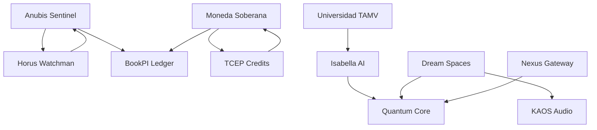
```mermaid
graph TD
    ANUBIS[Anubis Sentinel] --> HORUS[Horus Watchman]
    ANUBIS --> BOOKPI[BookPI Ledger]
    HORUS --> ANUBIS
    MSR[Moneda Soberana] --> TCEP[TCEP Credits]
    MSR --> BOOKPI
    TCEP --> MSR
    UTAMV[Universidad TAMV] --> ISABELLA[Isabella AI]
    ISABELLA --> QUANTUM[Quantum Core]
    DREAMSPACES[Dream Spaces] --> QUANTUM
    DREAMSPACES --> KAOS[KAOS Audio]
    NEXUS[Nexus Gateway] --> QUANTUM
```
The hierarchy ensures that security and quantum management layers are established before high-level creative or educational services are initialized.
Sources: [src/systems/FederationSystem.ts:44-240](https://github.com/OsoPanda1/tamv-digital-nexus/blob/HEAD/src/systems/FederationSystem.ts#L44-L240)

## Federation Management

Operational logic is encapsulated within the `FederationManager` class, which operates as a singleton. It is responsible for initializing active federations, performing health checks, and aggregating ecosystem statistics.

### Key Management Functions

| Function | Purpose |
| :--- | :--- |
| `getInstance()` | Retrieves the singleton instance of the manager. |
| `getActiveFederations()` | Filters and returns federations currently marked as `active`. |
| `checkHealth(id)` | Simulates or performs an uptime check (90% uptime target). |
| `getStatistics()` | Aggregates counts of active vs. planned federations and category distribution. |

Sources: [src/systems/FederationSystem.ts:355-430](https://github.com/OsoPanda1/tamv-digital-nexus/blob/HEAD/src/systems/FederationSystem.ts#L355-L430)

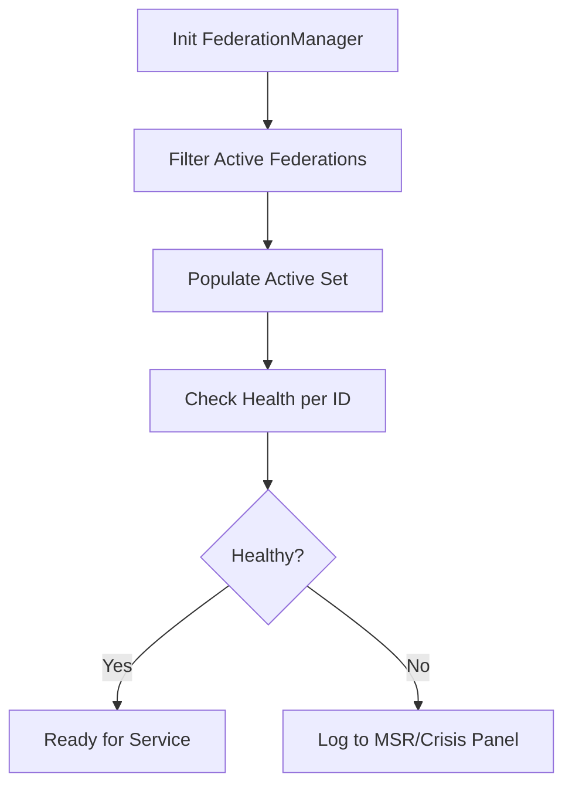
```mermaid
flowchart TD
    Start[Init FederationManager] --> Filter[Filter Active Federations]
    Filter --> Registry[Populate Active Set]
    Registry --> HealthCheck[Check Health per ID]
    HealthCheck --> Status{Healthy?}
    Status -- Yes --> Ready[Ready for Service]
    Status -- No --> Log[Log to MSR/Crisis Panel]
```
Sources: [src/systems/FederationSystem.ts:360-380](https://github.com/OsoPanda1/tamv-digital-nexus/blob/HEAD/src/systems/FederationSystem.ts#L360-L380), [supabase/functions/tamv-unified-api/index.ts:190-200](https://github.com/OsoPanda1/tamv-digital-nexus/blob/HEAD/supabase/functions/tamv-unified-api/index.ts#L190-L200)

## Primary Federation Modules

### Security and Governance
*   **ANUBIS**: Implements the DEKATEOTL 11-layer protection system, including post-quantum cryptography and anomaly detection.
*   **BOOKPI**: Acts as an immutable ledger for audit trails, legal evidence, and IPFS-based storage.
*   **CITEMESH DAO**: Provides decentralized governance with hybrid voting systems.

Sources: [src/systems/FederationSystem.ts:44-55](https://github.com/OsoPanda1/tamv-digital-nexus/blob/HEAD/src/systems/FederationSystem.ts#L44-L55), [src/systems/FederationSystem.ts:200-215](https://github.com/OsoPanda1/tamv-digital-nexus/blob/HEAD/src/systems/FederationSystem.ts#L200-L215), [README_TAMV_COMPLETO.md:110-125](https://github.com/OsoPanda1/tamv-digital-nexus/blob/HEAD/README_TAMV_COMPLETO.md#L110-L125)

### Economy and University
*   **MSR (Moneda Soberana Real)**: Manages sovereign currency following the 20/30/50 distribution rule.
*   **UTAMV**: The educational platform providing courses and certifications, depending on Isabella AI for personalized learning.

Sources: [src/systems/FederationSystem.ts:80-95](https://github.com/OsoPanda1/tamv-digital-nexus/blob/HEAD/src/systems/FederationSystem.ts#L80-L95), [src/systems/FederationSystem.ts:145-160](https://github.com/OsoPanda1/tamv-digital-nexus/blob/HEAD/src/systems/FederationSystem.ts#L145-L160)

## Integration with Unified API

The federations are exposed through a "Unified API" that serves as an Omni-Modus operating system. This allows the frontend to interact with multiple federation domains (Identity, Economy, Sentinel) through a single endpoint structure.

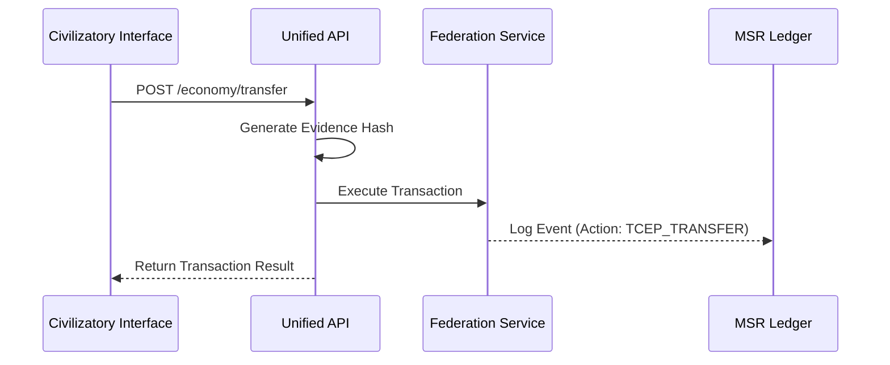
```mermaid
sequenceDiagram
    participant UI as Civilizatory Interface
    participant API as Unified API
    participant FED as Federation Service
    participant MSR as MSR Ledger
    UI->>API: POST /economy/transfer
    API->>API: Generate Evidence Hash
    API->>FED: Execute Transaction
    FED-->>MSR: Log Event (Action: TCEP_TRANSFER)
    API-->>UI: Return Transaction Result
```
Sources: [supabase/functions/tamv-unified-api/index.ts:1-25](https://github.com/OsoPanda1/tamv-digital-nexus/blob/HEAD/supabase/functions/tamv-unified-api/index.ts#L1-L25), [supabase/functions/tamv-unified-api/index.ts:115-135](https://github.com/OsoPanda1/tamv-digital-nexus/blob/HEAD/supabase/functions/tamv-unified-api/index.ts#L115-L135)

## Constitutional Quality Control (QC-TAMV-01)

The Federation System must adhere to strict architectural invariants. Violations of these laws (e.g., a Page directly initializing a Federation service) results in an "invalid technical state."

1.  **L7 - Controlled Initialization**: Global services must be initialized in `integrations/*` or `core/*`, never directly inside UI Pages.
2.  **L5 - Logic Separation**: Pages should only compose federation modules and not contain business logic or direct service side-effects.

Sources: [02_MODULOS/M05_IA_TAMVAI/INTERNO/QC-TAMV-01-v1.1.md:50-75](https://github.com/OsoPanda1/tamv-digital-nexus/blob/HEAD/02_MODULOS/M05_IA_TAMVAI/INTERNO/QC-TAMV-01-v1.1.md#L50-L75), [02_MODULOS/M05_IA_TAMVAI/INTERNO/QC-TAMV-01-v1.1.md:135-145](https://github.com/OsoPanda1/tamv-digital-nexus/blob/HEAD/02_MODULOS/M05_IA_TAMVAI/INTERNO/QC-TAMV-01-v1.1.md#L135-L145)

## Conclusion

The Federation System provides a scalable, quantum-ready framework for the TAMV MD-X4 ecosystem. By enforcing modularity through the `FederationManager` and constitutional laws, it ensures that diverse services—from 3D Dream Spaces to sovereign economic ledgers—can coexist and interact securely through a unified civilizatory interface.

### Custom Linting & Semantics

<details>
<summary>Relevant source files</summary>

The following files were used as context for generating this wiki page:

- [eslint-plugin-tamv/index.js](https://github.com/OsoPanda1/tamv-digital-nexus/blob/HEAD/eslint-plugin-tamv/index.js)
- [scripts/scan-semantics.ts](https://github.com/OsoPanda1/tamv-digital-nexus/blob/HEAD/scripts/scan-semantics.ts)
- [scripts/scan-semantics.js](https://github.com/OsoPanda1/tamv-digital-nexus/blob/HEAD/scripts/scan-semantics.js)
- [scripts/check-architecture.ts](https://github.com/OsoPanda1/tamv-digital-nexus/blob/HEAD/scripts/check-architecture.ts)
- [02_MODULOS/M05_IA_TAMVAI/INTERNO/QC-TAMV-01-v1.1.md](https://github.com/OsoPanda1/tamv-digital-nexus/blob/HEAD/02_MODULOS/M05_IA_TAMVAI/INTERNO/QC-TAMV-01-v1.1.md)
- [eslint.config.js](https://github.com/OsoPanda1/tamv-digital-nexus/blob/HEAD/eslint.config.js)
- [package.json](https://github.com/OsoPanda1/tamv-digital-nexus/blob/HEAD/package.json)
</details>

# Custom Linting & Semantics

The Custom Linting & Semantics system within the TAMV project serves as a "Constitutional Quality Control" framework (QC-TAMV-01). Its primary purpose is to enforce structural invariants, architectural boundaries, and ethical/legal semantic patterns across the codebase. This system ensures that the software maintains its "technical validity" by preventing non-negotiable architectural violations and ensuring that both human developers and Operational AIs adhere to the project's constitutional principles.

Sources: [02_MODULOS/M05_IA_TAMVAI/INTERNO/QC-TAMV-01-v1.1.md:1-25](https://github.com/OsoPanda1/tamv-digital-nexus/blob/HEAD/02_MODULOS/M05_IA_TAMVAI/INTERNO/QC-TAMV-01-v1.1.md#L1-L25), [eslint-plugin-tamv/index.js:1-7](https://github.com/OsoPanda1/tamv-digital-nexus/blob/HEAD/eslint-plugin-tamv/index.js#L1-L7)

## Architectural Shielding (QC-TAMV-01)

The project implements a multi-layered validation pipeline to protect the "Civilizatory Client" architecture. This is enforced through custom ESLint rules and a specialized architecture checker that validates the dependency graph against defined "Laws" (L1–L9).

### Invariant Laws and Enforcement
The system enforces several critical structural laws to ensure determinism and separation of responsibilities:

| Law | Definition | Enforcement Mechanism |
| :--- | :--- | :--- |
| **L1: Unique Root** | `createRoot` must only exist in `src/main.tsx`. | `tamv/no-reactdom-outside-main` |
| **L2: Unique Router** | `BrowserRouter` must only exist in `src/App.tsx`. | `tamv/no-router-outside-app` |
| **L3: Unique Layout** | `Layout.tsx` must be mounted only in `App.tsx`. | `tamv/no-layout-outside-app` |
| **L4: Route-Page Map** | Pages cannot import other pages. | `tamv/no-page-to-page-import` |
| **L6: Agnostic Modules** | Modules cannot import navigation (router) or pages. | `tamv/no-router-in-modules` |
| **L7: Controlled Init** | Services (Supabase/AI) must be initialized in specific layers. | `check:architecture` script |

Sources: [02_MODULOS/M05_IA_TAMVAI/INTERNO/QC-TAMV-01-v1.1.md:55-88](https://github.com/OsoPanda1/tamv-digital-nexus/blob/HEAD/02_MODULOS/M05_IA_TAMVAI/INTERNO/QC-TAMV-01-v1.1.md#L55-L88), [eslint-plugin-tamv/index.js:12-250](https://github.com/OsoPanda1/tamv-digital-nexus/blob/HEAD/eslint-plugin-tamv/index.js#L12-L250)

### Architecture Graph Validation
The `scripts/check-architecture.ts` utility performs static analysis on the source directory to build a dependency graph. It identifies violations that standard linters might miss, such as circular dependencies between pages or domain isolation breaches.

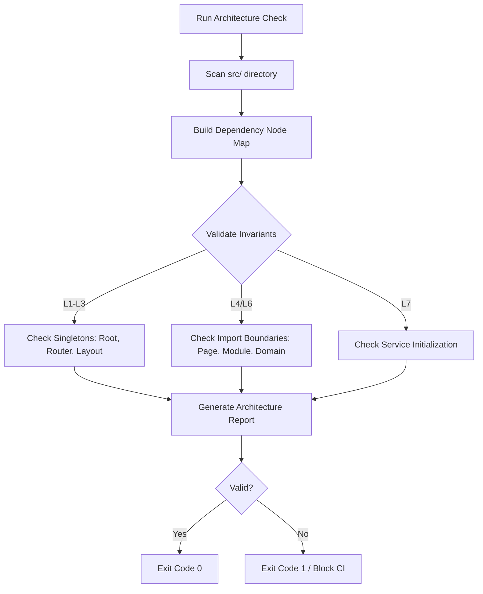
```mermaid
flowchart TD
    Start[Run Architecture Check] --> Scan[Scan src/ directory]
    Scan --> Build[Build Dependency Node Map]
    Build --> RuleCheck{Validate Invariants}
    RuleCheck -- L1-L3 --> RootCheck[Check Singletons: Root, Router, Layout]
    RuleCheck -- L4/L6 --> ImportCheck[Check Import Boundaries: Page, Module, Domain]
    RuleCheck -- L7 --> ServiceCheck[Check Service Initialization]
    RootCheck --> Report[Generate Architecture Report]
    ImportCheck --> Report
    ServiceCheck --> Report
    Report --> Status{Valid?}
    Status -- Yes --> Success[Exit Code 0]
    Status -- No --> Fail[Exit Code 1 / Block CI]
```
The architecture checker analyzes file types (page, module, domain, core, integration) and flags direct imports of Supabase within pages as warnings, suggesting they be moved to the integrations layer.

Sources: [scripts/check-architecture.ts:15-100](https://github.com/OsoPanda1/tamv-digital-nexus/blob/HEAD/scripts/check-architecture.ts#L15-L100), [scripts/check-architecture.ts:215-260](https://github.com/OsoPanda1/tamv-digital-nexus/blob/HEAD/scripts/check-architecture.ts#L215-L260)

## Semantic Scanning

The Constitutional Semantic Scanner (`scripts/scan-semantics.ts`) is designed to detect "intentions" rather than just keywords. It prevents the introduction of patterns that violate the constitutional framework, such as camouflaged DAO structures or cognitive manipulation designs.

### Protected Semantic Patterns
The scanner monitors for several categories of violations:

*   **DAO-related**: Governance tokens, community treasuries, and decentralized governance without a custodian.
*   **Economic Exploitation**: Hidden fees, predatory pricing, and automatic renewals without consent.
*   **Cognitive Manipulation**: Dark patterns, misleading UIs, and coercive designs.
*   **AI Sovereignty**: Autonomous AI decision-making or AI governance patterns.

Sources: [scripts/scan-semantics.ts:15-46](https://github.com/OsoPanda1/tamv-digital-nexus/blob/HEAD/scripts/scan-semantics.ts#L15-L46)

### Scanner Logic
The scanner traverses the repository (excluding `node_modules`, `dist`, etc.) and examines `.ts`, `.tsx`, `.js`, `.jsx`, and `.md` files. It allows for "historical" or "external" mentions if they are explicitly marked with `[HISTORICAL]`, `[EXTERNAL]`, or `[LEGACY]` tags.

Sources: [scripts/scan-semantics.js:55-75](https://github.com/OsoPanda1/tamv-digital-nexus/blob/HEAD/scripts/scan-semantics.js#L55-L75), [scripts/scan-semantics.ts:50-70](https://github.com/OsoPanda1/tamv-digital-nexus/blob/HEAD/scripts/scan-semantics.ts#L50-L70)

## ESLint Constitutional Plugin

The `eslint-plugin-tamv` implements the core rules defined in the QC-TAMV-01 document. It is integrated into the project's `eslint.config.js` and categorized under "Constitutional Quality Control."

### Core Custom Rules
*   **`no-dao`**: Prohibits the term "DAO" unless marked as legacy, requiring the use of "SCAO" (Sovereign Constitutional Autonomous Organization) instead.
*   **`no-hidden-economy`**: Detects economic functions (e.g., `processPayment`, `calculateFee`) that lack corresponding UI transparency markers like "tooltip" or "notification".
*   **`no-unaudited-ai`**: Mandates that AI-related imports (OpenAI, Anthropic, etc.) must be accompanied by logging or audit trail implementations.

Sources: [eslint-plugin-tamv/index.js:315-410](https://github.com/OsoPanda1/tamv-digital-nexus/blob/HEAD/eslint-plugin-tamv/index.js#L315-L410), [eslint.config.js:25-35](https://github.com/OsoPanda1/tamv-digital-nexus/blob/HEAD/eslint.config.js#L25-L35)

### Validation Sequence (CI/CD)
The project utilizes a strict "Shield" or "Deca-V" audit protocol that must pass before any deployment or merge into protected branches.

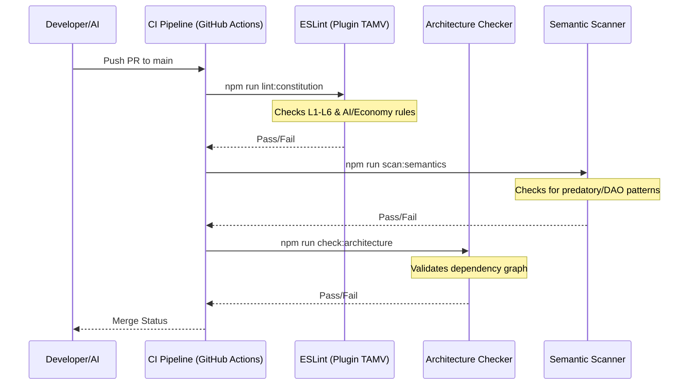
```mermaid
sequenceDiagram
    participant Dev as Developer/AI
    participant CI as CI Pipeline (GitHub Actions)
    participant Lint as ESLint (Plugin TAMV)
    participant Arch as Architecture Checker
    participant Sem as Semantic Scanner
    
    Dev->>CI: Push PR to main
    CI->>Lint: npm run lint:constitution
    Note over Lint: Checks L1-L6 & AI/Economy rules
    Lint-->>CI: Pass/Fail
    CI->>Sem: npm run scan:semantics
    Note over Sem: Checks for predatory/DAO patterns
    Sem-->>CI: Pass/Fail
    CI->>Arch: npm run check:architecture
    Note over Arch: Validates dependency graph
    Arch-->>CI: Pass/Fail
    CI-->>Dev: Merge Status
```
Sources: [02_MODULOS/M05_IA_TAMVAI/INTERNO/QC-TAMV-01-v1.1.md:145-160](https://github.com/OsoPanda1/tamv-digital-nexus/blob/HEAD/02_MODULOS/M05_IA_TAMVAI/INTERNO/QC-TAMV-01-v1.1.md#L145-L160), [package.json:7-20](https://github.com/OsoPanda1/tamv-digital-nexus/blob/HEAD/package.json#L7-L20)

## Conclusion
The Custom Linting & Semantics system is a cornerstone of the TAMV project's governance. By treating technical architecture as a "Constitution," the project ensures that its structural integrity and ethical boundaries are enforced programmatically. This automated governance applies equally to human contributors and operational AI agents, maintaining a predictable and traceable technical state.

Sources: [02_MODULOS/M05_IA_TAMVAI/INTERNO/QC-TAMV-01-v1.1.md:120-135](https://github.com/OsoPanda1/tamv-digital-nexus/blob/HEAD/02_MODULOS/M05_IA_TAMVAI/INTERNO/QC-TAMV-01-v1.1.md#L120-L135)


## Social & Content Modules

### Unified Social Feed

<details>
<summary>Relevant source files</summary>

The following files were used as context for generating this wiki page:

- [src/hooks/useSocialFeed.ts](https://github.com/OsoPanda1/tamv-digital-nexus/blob/HEAD/src/hooks/useSocialFeed.ts)
- [02_MODULOS/M02_SOCIAL/INTERNO/MANUAL-SOCIAL.md](https://github.com/OsoPanda1/tamv-digital-nexus/blob/HEAD/02_MODULOS/M02_SOCIAL/INTERNO/MANUAL-SOCIAL.md)
- [PLAN-TAMV-MODULAR.md](https://github.com/OsoPanda1/tamv-digital-nexus/blob/HEAD/PLAN-TAMV-MODULAR.md)
- [supabase/migrations/20251024005602_26440f5d-289f-4821-9cc0-7520dacde20f.sql](https://github.com/OsoPanda1/tamv-digital-nexus/blob/HEAD/supabase/migrations/20251024005602_26440f5d-289f-4821-9cc0-7520dacde20f.sql)
- [TASKS-TAMV-MODULAR.md](https://github.com/OsoPanda1/tamv-digital-nexus/blob/HEAD/TASKS-TAMV-MODULAR.md)
- [src/App.tsx](https://github.com/OsoPanda1/tamv-digital-nexus/blob/HEAD/src/App.tsx)
</details>

# Unified Social Feed

The **Unified Social Feed** is a core component of the TAMV MD-X4 ecosystem, residing within the **DM-X4-01 Social Cell** domain. It serves as the primary interface for social interaction, enabling users to view, create, and interact with dynamic content in real-time. The system is designed to provide a seamless flow of information by aggregating posts from the community while maintaining high performance and data integrity through Supabase integration.

Architecturally, the feed utilizes a paginated loading strategy combined with real-time subscriptions to ensure that new content is visible to users without manual refreshes. It integrates deeply with the project's security and profile systems, ensuring that post visibility adheres to user-defined privacy settings and that author information is accurately enriched for every post.

Sources: [PLAN-TAMV-MODULAR.md:23-25](https://github.com/OsoPanda1/tamv-digital-nexus/blob/HEAD/PLAN-TAMV-MODULAR.md#L23-L25), [02_MODULOS/M02_SOCIAL/INTERNO/MANUAL-SOCIAL.md:3-5](https://github.com/OsoPanda1/tamv-digital-nexus/blob/HEAD/02_MODULOS/M02_SOCIAL/INTERNO/MANUAL-SOCIAL.md#L3-L5), [src/hooks/useSocialFeed.ts:1-7](https://github.com/OsoPanda1/tamv-digital-nexus/blob/HEAD/src/hooks/useSocialFeed.ts#L1-L7)

## Architecture and Data Flow

The Unified Social Feed operates as a reactive system powered by the `useSocialFeed` hook. It manages data fetching from the Supabase `posts` table, enriches the data with user profiles, and listens for real-time `INSERT` events to update the UI instantly.

### Component Structure
The feed is composed of several high-level components and hooks:
*   **UnifiedSocialFeed**: The main container component that orchestrates the display of posts.
*   **SocialFeedPost**: The individual presentation component for a single post.
*   **CreatePostComposer**: The interface for generating new content.
*   **useSocialFeed Hook**: The logic engine handling pagination, enrichment, and real-time synchronization.

Sources: [PLAN-TAMV-MODULAR.md:27-28](https://github.com/OsoPanda1/tamv-digital-nexus/blob/HEAD/PLAN-TAMV-MODULAR.md#L27-L28), [02_MODULOS/M02_SOCIAL/INTERNO/MANUAL-SOCIAL.md:10-18](https://github.com/OsoPanda1/tamv-digital-nexus/blob/HEAD/02_MODULOS/M02_SOCIAL/INTERNO/MANUAL-SOCIAL.md#L10-L18)

### Data Flow Diagram
The following diagram illustrates how the `useSocialFeed` hook interacts with Supabase and the local UI state to provide a real-time experience.

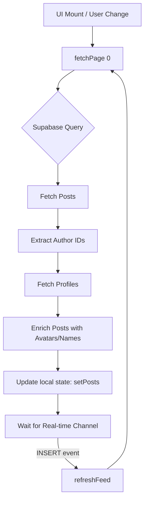
```mermaid
flowchart TD
    A[UI Mount / User Change] --> B[fetchPage 0]
    B --> C{Supabase Query}
    C --> D[Fetch Posts]
    D --> E[Extract Author IDs]
    E --> F[Fetch Profiles]
    F --> G[Enrich Posts with Avatars/Names]
    G --> H[Update local state: setPosts]
    H --> I[Wait for Real-time Channel]
    I -- "INSERT event" --> J[refreshFeed]
    J --> B
```
This diagram shows the sequence of initial loading, data enrichment, and the real-time update loop. 
Sources: [src/hooks/useSocialFeed.ts:47-97](https://github.com/OsoPanda1/tamv-digital-nexus/blob/HEAD/src/hooks/useSocialFeed.ts#L47-L97), [02_MODULOS/M02_SOCIAL/INTERNO/MANUAL-SOCIAL.md:100-110](https://github.com/OsoPanda1/tamv-digital-nexus/blob/HEAD/02_MODULOS/M02_SOCIAL/INTERNO/MANUAL-SOCIAL.md#L100-L110)

## Data Models

The social system relies on two primary tables in the Supabase schema: `posts` and `profiles`.

### Post Structure
The `posts` table stores the content and metadata for every interaction in the feed.

| Field | Type | Description |
|-------|------|-------------|
| `id` | UUID | Primary key, generated automatically. |
| `author_id` | UUID | Foreign key to the user who created the post. |
| `content` | TEXT | The main message of the post (up to 2000 characters). |
| `media_url` | TEXT | Optional link to images, video, or audio. |
| `media_type` | TEXT | Type of media: `text`, `image`, `video`, `audio`, or `live`. |
| `visibility` | TEXT | Controls privacy: `public`, `friends`, `private`, or `group`. |
| `likes_count`| INTEGER | Counter for user likes. |

Sources: [supabase/migrations/20251024005602_26440f5d-289f-4821-9cc0-7520dacde20f.sql:47-60](https://github.com/OsoPanda1/tamv-digital-nexus/blob/HEAD/supabase/migrations/20251024005602_26440f5d-289f-4821-9cc0-7520dacde20f.sql#L47-L60), [02_MODULOS/M02_SOCIAL/INTERNO/MANUAL-SOCIAL.md:47-50](https://github.com/OsoPanda1/tamv-digital-nexus/blob/HEAD/02_MODULOS/M02_SOCIAL/INTERNO/MANUAL-SOCIAL.md#L47-L50)

### Social Hook Interface (`useSocialFeed`)
The system provides a standardized interface for consuming social data through the `useSocialFeed` hook.

```typescript
// src/hooks/useSocialFeed.ts:31-37
export interface UseSocialFeedReturn {
  posts: SocialPost[];
  loading: boolean;
  hasMore: boolean;
  loadMore: () => void;
  refreshFeed: () => void;
}
```

## Real-time Implementation

The real-time functionality is implemented via Supabase Channels. The hook subscribes specifically to `INSERT` events on the `public.posts` table. When a new post is added to the database, the `refreshFeed()` function is triggered to reset the feed to page zero and pull the latest content.

### Subscription Sequence
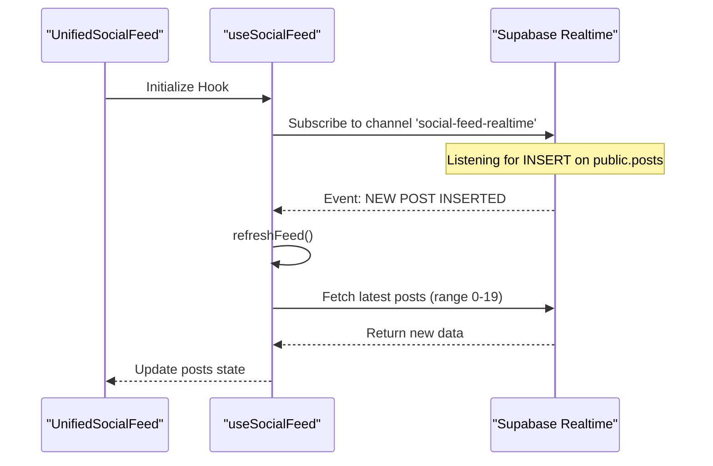
```mermaid
sequenceDiagram
    participant UI as "UnifiedSocialFeed"
    participant Hook as "useSocialFeed"
    participant DB as "Supabase Realtime"
    
    UI->>Hook: Initialize Hook
    Hook->>DB: Subscribe to channel 'social-feed-realtime'
    Note over DB: Listening for INSERT on public.posts
    DB-->>Hook: Event: NEW POST INSERTED
    Hook->>Hook: refreshFeed()
    Hook->>DB: Fetch latest posts (range 0-19)
    DB-->>Hook: Return new data
    Hook-->>UI: Update posts state
```
This sequence ensures that the feed remains "unified" and current across all connected clients simultaneously.
Sources: [src/hooks/useSocialFeed.ts:114-129](https://github.com/OsoPanda1/tamv-digital-nexus/blob/HEAD/src/hooks/useSocialFeed.ts#L114-L129), [02_MODULOS/M02_SOCIAL/INTERNO/MANUAL-SOCIAL.md:94-96](https://github.com/OsoPanda1/tamv-digital-nexus/blob/HEAD/02_MODULOS/M02_SOCIAL/INTERNO/MANUAL-SOCIAL.md#L94-L96)

## Quality Metrics and Governance

The Unified Social Feed is subject to strict performance and governance standards defined in the project's modular plan and social manual.

### Performance Targets
| Metric | Target | Description |
|--------|--------|-------------|
| Initial Feed Load | < 300-500ms | Time to render the first 20 posts. |
| Real-time Latency | < 500ms | Delay between DB insertion and UI update. |
| WebSocket RTT | < 150-200ms | Round-trip time for unified chat/social socket. |

Sources: [PLAN-TAMV-MODULAR.md:37-41](https://github.com/OsoPanda1/tamv-digital-nexus/blob/HEAD/PLAN-TAMV-MODULAR.md#L37-L41), [02_MODULOS/M02_SOCIAL/INTERNO/MANUAL-SOCIAL.md:120-126](https://github.com/OsoPanda1/tamv-digital-nexus/blob/HEAD/02_MODULOS/M02_SOCIAL/INTERNO/MANUAL-SOCIAL.md#L120-L126)

### Governance: DAO-Comunidad
The **DAO-Comunidad (Community DAO)** has the authority to define and adjust parameters related to the social feed, including:
*   Visibility policies (Public vs. Community).
*   Moderation parameters.
*   Real-time presence display settings.

However, the DAO is restricted from altering the monetization logic or the underlying technical contracts if they violate the QA/Architecture standards defined in `QC-TAMV-01`.

Sources: [PLAN-TAMV-MODULAR.md:43-47](https://github.com/OsoPanda1/tamv-digital-nexus/blob/HEAD/PLAN-TAMV-MODULAR.md#L43-L47), [02_MODULOS/M02_SOCIAL/INTERNO/MANUAL-SOCIAL.md:135-142](https://github.com/OsoPanda1/tamv-digital-nexus/blob/HEAD/02_MODULOS/M02_SOCIAL/INTERNO/MANUAL-SOCIAL.md#L135-L142)

## Implementation Status

As of the current development phase, the Unified Social Feed is in the following state:

*   **Logic (Hooks)**: Paginating and real-time logic implemented in `useSocialFeed`.
*   **UI Components**: `UnifiedSocialFeed` and `SocialFeedPost` existing but transitioning from dummy data to real queries.
*   **Integration**: Supabase RLS (Row Level Security) and basic migrations are active.

Sources: [PLAN-TAMV-MODULAR.md:23-28](https://github.com/OsoPanda1/tamv-digital-nexus/blob/HEAD/PLAN-TAMV-MODULAR.md#L23-L28), [TASKS-TAMV-MODULAR.md:16-25](https://github.com/OsoPanda1/tamv-digital-nexus/blob/HEAD/TASKS-TAMV-MODULAR.md#L16-L25)

The Unified Social Feed serves as the bedrock of community engagement within TAMV MD-X4, bridging static documentation and dynamic human interaction through its real-time, high-performance architecture.

### Content Sync Engine

<details>
<summary>Relevant source files</summary>

The following files were used as context for generating this wiki page:

- [02\_MODULOS/M06\_CONTENT/INTERNO/CONTENT-SYNC-SPEC.md](https://github.com/OsoPanda1/tamv-digital-nexus/blob/HEAD/02_MODULOS/M06_CONTENT/INTERNO/CONTENT-SYNC-SPEC.md)
- [supabase/functions/tamv-content-sync/index.ts](https://github.com/OsoPanda1/tamv-digital-nexus/blob/HEAD/supabase/functions/tamv-content-sync/index.ts)
- [PLAN-TAMV-MODULAR.md](https://github.com/OsoPanda1/tamv-digital-nexus/blob/HEAD/PLAN-TAMV-MODULAR.md)
- [supabase/functions/tamv-fusion-core/index.ts](https://github.com/OsoPanda1/tamv-digital-nexus/blob/HEAD/supabase/functions/tamv-fusion-core/index.ts)
- [TASKS-TAMV-MODULAR.md](https://github.com/OsoPanda1/tamv-digital-nexus/blob/HEAD/TASKS-TAMV-MODULAR.md)
</details>

# Content Sync Engine

The **Content Sync Engine** is the core system responsible for classifying, indexing, and synchronizing technical documentation and technical content across the TAMV ecosystem. It serves as a bridge between repository data, external blog content, and the internal documentation memory, making this information accessible to developers, the community, and AI agents such as **DigyTAMV**.

The system operates primarily as a Supabase Edge Function (`tamv-content-sync`) that aggregates data from GitHub repositories and the official TAMV blog. It ensures that the ecosystem's "technical memory" remains updated by scanning authorized paths, extracting metadata (frontmatter), and generating structured indices for search and AI navigation.

Sources: [02\_MODULOS/M06\_CONTENT/INTERNO/CONTENT-SYNC-SPEC.md:7-12](https://github.com/OsoPanda1/tamv-digital-nexus/blob/HEAD/02%5C_MODULOS/M06%5C_CONTENT/INTERNO/CONTENT-SYNC-SPEC.md#L7-L12), [supabase/functions/tamv-content-sync/index.ts:1-15](https://github.com/OsoPanda1/tamv-digital-nexus/blob/HEAD/supabase/functions/tamv-content-sync/index.ts#L1-L15)

## 1. System Architecture and Data Flow

The Content Sync Engine functions as a centralized orchestrator that pulls data from multiple external sources and processes it into a unified format for the TAMV ecosystem.

### Data Acquisition Flow
The engine targets specific GitHub repositories associated with the TAMV founder and ecosystem, as well as the TAMV Online Network blog.

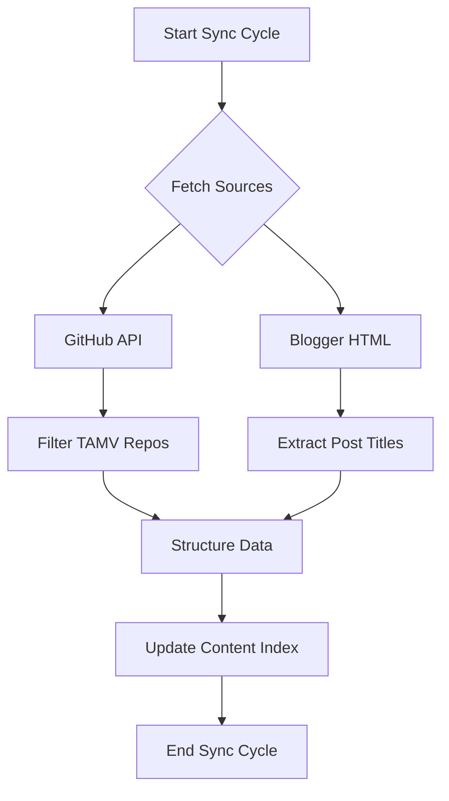
```mermaid
graph TD
    A[Start Sync Cycle] --> B{Fetch Sources}
    B --> C[GitHub API]
    B --> D[Blogger HTML]
    C --> E[Filter TAMV Repos]
    D --> F[Extract Post Titles]
    E --> G[Structure Data]
    F --> G
    G --> H[Update Content Index]
    H --> I[End Sync Cycle]
```
The synchronization cycle runs periodically (every 6 hours) or can be triggered via webhooks. It classifies findings into structured ecosystem data including repository metadata (languages, stars, topics) and recent blog posts.

Sources: [supabase/functions/tamv-content-sync/index.ts:71-125](https://github.com/OsoPanda1/tamv-digital-nexus/blob/HEAD/supabase/functions/tamv-content-sync/index.ts#L71-L125), [02\_MODULOS/M06\_CONTENT/INTERNO/CONTENT-SYNC-SPEC.md:78-83](https://github.com/OsoPanda1/tamv-digital-nexus/blob/HEAD/02%5C_MODULOS/M06%5C_CONTENT/INTERNO/CONTENT-SYNC-SPEC.md#L78-L83)

### Integration with Fusion Core
The `tamv-fusion-core` acts as a high-level orchestrator that invokes the `tamv-content-sync` function during its health check cycles.

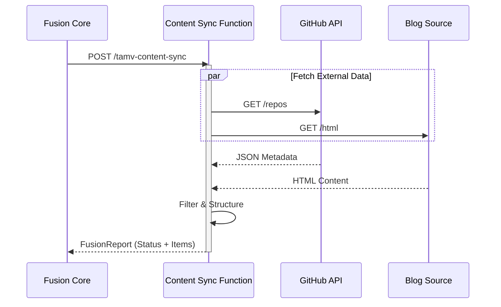
```mermaid
sequenceDiagram
    participant FC as Fusion Core
    participant CS as Content Sync Function
    participant GH as GitHub API
    participant BL as Blog Source
    
    FC->>CS: POST /tamv-content-sync
    activate CS
    par Fetch External Data
        CS->>GH: GET /repos
        CS->>BL: GET /html
    end
    GH-->>CS: JSON Metadata
    BL-->>CS: HTML Content
    CS->>CS: Filter & Structure
    CS-->>FC: FusionReport (Status + Items)
    deactivate CS
```
Sources: [supabase/functions/tamv-fusion-core/index.ts:88-110](https://github.com/OsoPanda1/tamv-digital-nexus/blob/HEAD/supabase/functions/tamv-fusion-core/index.ts#L88-L110)

## 2. Content Classification Logic

Every document processed by the engine is assigned metadata based on its type, module target, and maturity status. This classification is critical for the **DevHub** inventory and AI navigation.

### Document Metadata Categories

| Category | Values | Description |
| :--- | :--- | :--- |
| **Type** | `doc_tech`, `marketing`, `blueprint`, `legal`, `governance` | Defines the nature of the document. |
| **Module Target** | `core`, `ia`, `security`, `economy`, `xr`, `infra` | Maps the document to a specific TAMV domain (DM-X4-XX). |
| **Maturity** | `draft`, `validated`, `canon`, `deprecated` | Indicates the current state of document reliability. |

Sources: [02\_MODULOS/M06\_CONTENT/INTERNO/CONTENT-SYNC-SPEC.md:15-50](https://github.com/OsoPanda1/tamv-digital-nexus/blob/HEAD/02%5C_MODULOS/M06%5C_CONTENT/INTERNO/CONTENT-SYNC-SPEC.md#L15-L50)

### Indexing Process
The indexing workflow extracts specific attributes from files to populate the `content_index` table in Supabase:
1.  **Scan:** Locates `.md` files in authorized paths (e.g., `02_MODULOS/`, `docs/devhub/`).
2.  **Extraction:** Reads frontmatter to determine `status` and `module_target`.
3.  **Storage:** Updates the index to reflect path changes or new content.
4.  **Semantic Future:** Planned integration for generating embeddings for semantic search.

Sources: [02\_MODULOS/M06\_CONTENT/INTERNO/CONTENT-SYNC-SPEC.md:78-83](https://github.com/OsoPanda1/tamv-digital-nexus/blob/HEAD/02%5C_MODULOS/M06%5C_CONTENT/INTERNO/CONTENT-SYNC-SPEC.md#L78-L83)

## 3. Edge Function Specification: `tamv-content-sync`

The engine is exposed as a service-level API. It handles actions ranging from full synchronization to filtered searches.

### API Contract (Input)
```json
{
  "action": "sync | classify | index | search",
  "filters": {
    "type": "doc_tech | blueprint",
    "module_target": "ia | economy",
    "status": "draft | canon"
  },
  "query": "string (for search)",
  "userId": "uuid"
}
```
Sources: [02\_MODULOS/M06\_CONTENT/INTERNO/CONTENT-SYNC-SPEC.md:54-63](https://github.com/OsoPanda1/tamv-digital-nexus/blob/HEAD/02%5C_MODULOS/M06%5C_CONTENT/INTERNO/CONTENT-SYNC-SPEC.md#L54-L63)

### Implementation Details
The TypeScript implementation utilizes the Deno environment and the standard HTTP server to fetch and parse data.

```typescript
// Example of GitHub data filtering in tamv-content-sync
const tamvRepos = repos.filter((r: any) => 
  r.name?.toLowerCase().includes('tamv') || 
  r.name?.toLowerCase().includes('unify') || 
  r.name?.toLowerCase().includes('web-4')
);
```
Sources: [supabase/functions/tamv-content-sync/index.ts:90-95](https://github.com/OsoPanda1/tamv-digital-nexus/blob/HEAD/supabase/functions/tamv-content-sync/index.ts#L90-L95)

## 4. DigyTAMV and DevHub Integration

The Content Sync Engine serves as the backend for **DigyTAMV**, the "AI Memory" used by agents like Isabella and THE SOF. It organizes content into a "Civilizatory Client" inventory.

### DevHub Categories
Documentation is organized into five primary categories within the DevHub:
*   **APIs:** References for TAMV OS, AI, and XR.
*   **SDKs:** Examples and development kits (planned).
*   **Modules:** Documentation for specific civilizatory domains.
*   **Norms:** Constitutional rules like `QC-TAMV`.
*   **Blueprints:** Architecture Decision Records (ADRs) and design plans.

Sources: [02\_MODULOS/M06\_CONTENT/INTERNO/CONTENT-SYNC-SPEC.md:85-95](https://github.com/OsoPanda1/tamv-digital-nexus/blob/HEAD/02%5C_MODULOS/M06%5C_CONTENT/INTERNO/CONTENT-SYNC-SPEC.md#L85-L95), [PLAN-TAMV-MODULAR.md:113-119](https://github.com/OsoPanda1/tamv-digital-nexus/blob/HEAD/PLAN-TAMV-MODULAR.md#L113-L119)

## 5. Consistency and Verification

To maintain the integrity of the synchronized content, the system includes a verification script (`npm run check:docs-sync`). This script performs the following validations:
1.  Ensures all code-exposed endpoints have a corresponding DevHub entry.
2.  Identifies "orphan" documents that lack associated code logic.
3.  Enforces that all `doc_tech` types have a defined `module_target`.
4.  Flags documents with an empty or invalid maturity status.

Sources: [02\_MODULOS/M06\_CONTENT/INTERNO/CONTENT-SYNC-SPEC.md:120-130](https://github.com/OsoPanda1/tamv-digital-nexus/blob/HEAD/02%5C_MODULOS/M06%5C_CONTENT/INTERNO/CONTENT-SYNC-SPEC.md#L120-L130)

### Status of Implementation
| Task | Status | Source |
| :--- | :--- | :--- |
| GitHub/Blog Sync Logic | ✅ Implemented | [supabase/functions/tamv-content-sync/index.ts](https://github.com/OsoPanda1/tamv-digital-nexus/blob/HEAD/supabase/functions/tamv-content-sync/index.ts) |
| Document Classification | ⚠️ In Progress | [PLAN-TAMV-MODULAR.md:144](https://github.com/OsoPanda1/tamv-digital-nexus/blob/HEAD/PLAN-TAMV-MODULAR.md#L144) |
| Module Target Fields | ❌ Pending | [TASKS-TAMV-MODULAR.md:79](https://github.com/OsoPanda1/tamv-digital-nexus/blob/HEAD/TASKS-TAMV-MODULAR.md#L79) |
| DevHub Inventory | ⚠️ Partial | [02\_MODULOS/M06\_CONTENT/INTERNO/CONTENT-SYNC-SPEC.md:85](https://github.com/OsoPanda1/tamv-digital-nexus/blob/HEAD/02%5C_MODULOS/M06%5C_CONTENT/INTERNO/CONTENT-SYNC-SPEC.md#L85) |

## Conclusion
The Content Sync Engine is the foundational infrastructure for knowledge management within the TAMV MD-X4 ecosystem. By automating the aggregation of external data and enforcing strict classification for internal documentation, it enables a consistent "technical memory" that supports both human developers and autonomous AI agents.

### Crisis Management System

<details>
<summary>Relevant source files</summary>

The following files were used as context for generating this wiki page:

- [src/components/crisis/CrisisPanel.tsx](https://github.com/OsoPanda1/tamv-digital-nexus/blob/HEAD/src/components/crisis/CrisisPanel.tsx)
- [src/pages/Crisis.tsx](https://github.com/OsoPanda1/tamv-digital-nexus/blob/HEAD/src/pages/Crisis.tsx)
- [supabase/functions/tamv-fusion-core/index.ts](https://github.com/OsoPanda1/tamv-digital-nexus/blob/HEAD/supabase/functions/tamv-fusion-core/index.ts)
- [PLAN-TAMV-MODULAR.md](https://github.com/OsoPanda1/tamv-digital-nexus/blob/HEAD/PLAN-TAMV-MODULAR.md)
- [TASKS-TAMV-MODULAR.md](https://github.com/OsoPanda1/tamv-digital-nexus/blob/HEAD/TASKS-TAMV-MODULAR.md)
- [supabase/functions/tamv-unified-api/index.ts](https://github.com/OsoPanda1/tamv-digital-nexus/blob/HEAD/supabase/functions/tamv-unified-api/index.ts)
</details>

# Crisis Management System

## Introduction
The Crisis Management System within the TAMV MD-X4 ecosystem is a critical infrastructure component designed for automated detection, instant rollback, and auditable recovery of system state during incidents. It serves as a failsafe mechanism that ensures system integrity against fraud, data breaches, and general system failures. The system is deeply integrated with the [BookPI](#bookpi) compliance framework and the [Anubis Security](#anubis) sentinel, providing a triple rollback capability encompassing data, configuration, and application state.

Sources: [src/components/crisis/CrisisPanel.tsx:112-115](https://github.com/OsoPanda1/tamv-digital-nexus/blob/HEAD/src/components/crisis/CrisisPanel.tsx#L112-L115), [PLAN-TAMV-MODULAR.md:148-150](https://github.com/OsoPanda1/tamv-digital-nexus/blob/HEAD/PLAN-TAMV-MODULAR.md#L148-L150)

This system operates under the jurisdiction of the **DAO-Seguridad**, which defines which modules require execution within Trusted Execution Environments (TEE) and sets the frequency of security audits. It functions as a "Break Glass" protocol, transitioning the system into a controlled recovery mode when high-severity incidents are triggered.

Sources: [PLAN-TAMV-MODULAR.md:162-166](https://github.com/OsoPanda1/tamv-digital-nexus/blob/HEAD/PLAN-TAMV-MODULAR.md#L162-L166), [src/components/crisis/CrisisPanel.tsx:82-85](https://github.com/OsoPanda1/tamv-digital-nexus/blob/HEAD/src/components/crisis/CrisisPanel.tsx#L82-L85)

## Architecture and Components

The system architecture is divided into frontend reporting interfaces, backend edge functions for health monitoring, and database procedures for executing rollbacks.

### Frontend Management Interface
The primary user interface is the `CrisisPanel`, which allows authorized personnel to report incidents and monitor the recovery history.

- **Incident Reporting:** Users can manually trigger a crisis by selecting a type (e.g., fraud, breach), setting a severity level, and describing affected resources.
- **Crisis Logs:** A real-time history of incidents, displaying severity, execution status of rollbacks, and resolution status.

Sources: [src/components/crisis/CrisisPanel.tsx:24-43](https://github.com/OsoPanda1/tamv-digital-nexus/blob/HEAD/src/components/crisis/CrisisPanel.tsx#L24-L43), [src/components/crisis/CrisisPanel.tsx:142-146](https://github.com/OsoPanda1/tamv-digital-nexus/blob/HEAD/src/components/crisis/CrisisPanel.tsx#L142-L146)

### Automated Monitoring and Fusion Core
The `tamv-fusion-core` edge function serves as an automated orchestrator. It performs parallel health checks across critical routes and database tables.

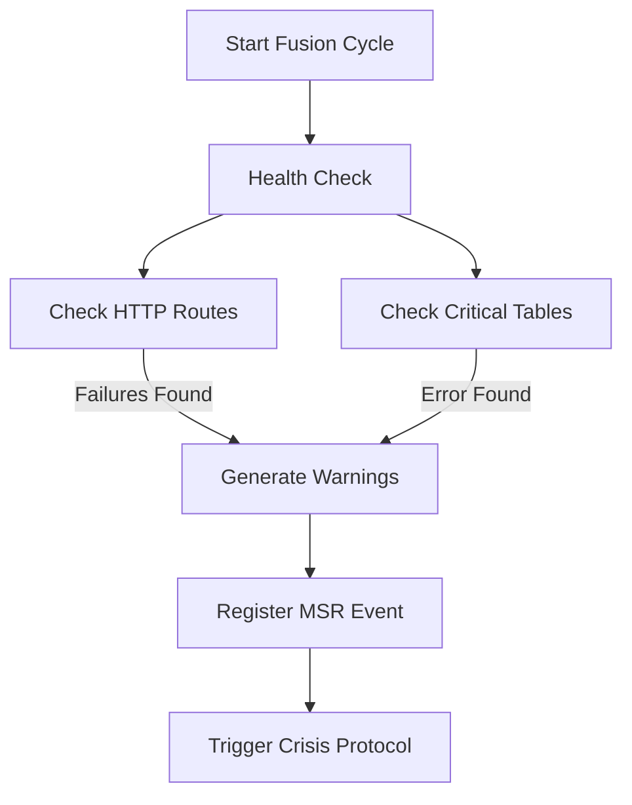
```mermaid
flowchart TD
    Start[Start Fusion Cycle] --> Health[Health Check]
    Health --> Routes[Check HTTP Routes]
    Health --> DB[Check Critical Tables]
    Routes -- Failures Found --> Warn[Generate Warnings]
    DB -- Error Found --> Warn
    Warn --> MSREvent[Register MSR Event]
    MSREvent --> Crisis[Trigger Crisis Protocol]
```
The Fusion Core checks critical tables such as `profiles`, `posts`, `crisis_logs`, and `tcep_wallets` to identify anomalies.
Sources: [supabase/functions/tamv-fusion-core/index.ts:1-75](https://github.com/OsoPanda1/tamv-digital-nexus/blob/HEAD/supabase/functions/tamv-fusion-core/index.ts#L1-L75)

### Recovery Protocol
The system follows a five-step recovery lifecycle:
1. **Detección Automática:** Anubis Sentinel detects anomalies.
2. **Freeze & Snapshot:** Immediate system freezing and state snapshot creation.
3. **Triple Rollback:** Reversion of data, configuration, and application state.
4. **Registro BookPI:** Legal evidence logging with hashing and DOI.
5. **Recovery & Audit:** Verified recovery and exportable audit logs.

Sources: [src/components/crisis/CrisisPanel.tsx:210-255](https://github.com/OsoPanda1/tamv-digital-nexus/blob/HEAD/src/components/crisis/CrisisPanel.tsx#L210-L255)

## Data Model and API Integration

The system utilizes specialized database tables and RPC (Remote Procedure Call) functions to manage state.

### Key Data Structures
| Field | Type | Description |
|-------|------|-------------|
| `crisis_type` | String | Type of incident (fraud, data_breach, system_failure, user_report) |
| `severity` | Number (1-10) | Impact level of the crisis |
| `description` | Text | Detailed account of the incident |
| `affected_resources` | Array | List of resources (e.g., transaction IDs, user IDs) impacted |
| `rollback_executed` | Boolean | Confirmation if the system reverted to a previous state |
| `resolved` | Boolean | Indicates if the crisis has been mitigated |

Sources: [src/components/crisis/CrisisPanel.tsx:24-30](https://github.com/OsoPanda1/tamv-digital-nexus/blob/HEAD/src/components/crisis/CrisisPanel.tsx#L24-L30), [src/components/crisis/CrisisPanel.tsx:173-180](https://github.com/OsoPanda1/tamv-digital-nexus/blob/HEAD/src/components/crisis/CrisisPanel.tsx#L173-L180)

### Crisis Rollback Logic
The core recovery logic is triggered via the `trigger_crisis_rollback` RPC function.

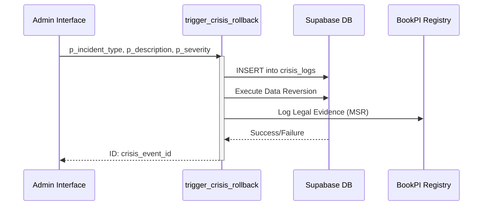
```mermaid
sequenceDiagram
    participant Admin as Admin Interface
    participant RPC as trigger_crisis_rollback
    participant DB as Supabase DB
    participant BookPI as BookPI Registry

    Admin->>RPC: p_incident_type, p_description, p_severity
    activate RPC
    RPC->>DB: INSERT into crisis_logs
    RPC->>DB: Execute Data Reversion
    RPC->>BookPI: Log Legal Evidence (MSR)
    DB-->>RPC: Success/Failure
    RPC-->>Admin: ID: crisis_event_id
    deactivate RPC
```
Sources: [src/components/crisis/CrisisPanel.tsx:75-85](https://github.com/OsoPanda1/tamv-digital-nexus/blob/HEAD/src/components/crisis/CrisisPanel.tsx#L75-L85), [supabase/functions/tamv-unified-api/index.ts:182-192](https://github.com/OsoPanda1/tamv-digital-nexus/blob/HEAD/supabase/functions/tamv-unified-api/index.ts#L182-L192)

## Incident Classification
The system categorizes incidents to determine the appropriate rollback response.

| Type | Label | Icon | Severity Priority |
|------|-------|------|-------------------|
| `fraud` | Fraude Detectado | AlertTriangle | Critical |
| `data_breach` | Brecha de Datos | Shield | Critical |
| `system_failure` | Fallo del Sistema | Activity | High |
| `user_report` | Reporte de Usuario | FileWarning | Medium/Low |

Sources: [src/components/crisis/CrisisPanel.tsx:24-29](https://github.com/OsoPanda1/tamv-digital-nexus/blob/HEAD/src/components/crisis/CrisisPanel.tsx#L24-L29)

## Maintenance and Auditing
The system requires continuous maintenance as outlined in the TAMV Modular Plan.
- **MSR Registry:** Every crisis event generates a SHA-256 evidence hash stored in `msr_events` for auditability.
- **Stress Testing:** The system is subjected to internal stress tests to measure UI performance under high-frequency event generation.
- **CI/CD Integration:** Architecture checks ensure no "hidden economy" logic exists without UI transparency, preventing unlogged financial crises.

Sources: [supabase/functions/tamv-fusion-core/index.ts:113-125](https://github.com/OsoPanda1/tamv-digital-nexus/blob/HEAD/supabase/functions/tamv-fusion-core/index.ts#L113-L125), [TASKS-TAMV-MODULAR.md:73-77](https://github.com/OsoPanda1/tamv-digital-nexus/blob/HEAD/TASKS-TAMV-MODULAR.md#L73-L77), [eslint-plugin-tamv/index.js:340-350](https://github.com/OsoPanda1/tamv-digital-nexus/blob/HEAD/eslint-plugin-tamv/index.js#L340-L350)

## Conclusion
The Crisis Management System is a cornerstone of the TAMV "Civilizatory" infrastructure, providing a robust defense-in-depth strategy. By combining automated monitoring via the Fusion Core with manual intervention capabilities and a mathematically verifiable audit trail via BookPI, it ensures that the ecosystem remains resilient and sovereign even under adverse conditions.

Sources: [README_TAMV_COMPLETO.md:144-150](https://github.com/OsoPanda1/tamv-digital-nexus/blob/HEAD/README_TAMV_COMPLETO.md#L144-L150), [PLAN-TAMV-MODULAR.md:10-20](https://github.com/OsoPanda1/tamv-digital-nexus/blob/HEAD/PLAN-TAMV-MODULAR.md#L10-L20)

### University & Education

<details>
<summary>Relevant source files</summary>

The following files were used as context for generating this wiki page:

- [src/systems/UniversitySystem.ts](https://github.com/OsoPanda1/tamv-digital-nexus/blob/HEAD/src/systems/UniversitySystem.ts)
- [src/systems/FederationSystem.ts](https://github.com/OsoPanda1/tamv-digital-nexus/blob/HEAD/src/systems/FederationSystem.ts)
- [README_TAMV_COMPLETO.md](https://github.com/OsoPanda1/tamv-digital-nexus/blob/HEAD/README_TAMV_COMPLETO.md)
- [src/App.tsx](https://github.com/OsoPanda1/tamv-digital-nexus/blob/HEAD/src/App.tsx)
- [E2E_CHECKLIST_TAMV.md](https://github.com/OsoPanda1/tamv-digital-nexus/blob/HEAD/E2E_CHECKLIST_TAMV.md)
- [supabase/functions/tamv-fusion-core/index.ts](https://github.com/OsoPanda1/tamv-digital-nexus/blob/HEAD/supabase/functions/tamv-fusion-core/index.ts)
</details>

# University & Education

The University system (UTAMV) is a core federation within the TAMV MD-X4™ ecosystem designed to provide a comprehensive education and certification platform. It offers a range of courses spanning fundamental concepts of the digital civilization to advanced technical subjects like quantum security and AI integration. The system is integrated with the broader ecosystem, utilizing [Isabella AI](#isabella-ai) for assistance and the [BookPI](#bookpi) system for access control and academic record-keeping.

As a "Civilizatory" educational entity, it provides both free and paid courses, issuing official certifications verified within the network. It serves as a primary onboarding mechanism for users to understand [Dream Spaces](#dream-spaces), [Quantum Core](#quantum-core), and the [Economy System](#economy).

Sources: [src/systems/FederationSystem.ts:161-178](https://github.com/OsoPanda1/tamv-digital-nexus/blob/HEAD/src/systems/FederationSystem.ts#L161-L178), [src/systems/UniversitySystem.ts:1-10](https://github.com/OsoPanda1/tamv-digital-nexus/blob/HEAD/src/systems/UniversitySystem.ts#L1-L10), [README_TAMV_COMPLETO.md:52-57](https://github.com/OsoPanda1/tamv-digital-nexus/blob/HEAD/README_TAMV_COMPLETO.md#L52-L57)

## Architecture and Core Systems

The University system is architected as a singleton manager (`UniversitySystem`) that orchestrates course delivery, student enrollment, and certification issuance. It operates as part of the "Education" category of federations.

### The UTAMV Federation
The `UTAMV` federation is defined with specific capabilities including course management and skill assessment. It maintains dependencies on other systems to function effectively.

```mermaid
flowchart TD
    UTAMV[UTAMV Federation] --> ISABELLA[Isabella AI]
    UTAMV -.-> CRYSTAL[Crystal Knowledge]
    ISABELLA --> QUANTUM[Quantum Core]
    CRYSTAL --> UTAMV
```
*Note: The UTAMV federation relies on Isabella AI for educational assistance, while Crystal Knowledge acts as its documentation and knowledge base sibling.*

Sources: [src/systems/FederationSystem.ts:161-178](https://github.com/OsoPanda1/tamv-digital-nexus/blob/HEAD/src/systems/FederationSystem.ts#L161-L178), [src/systems/FederationSystem.ts:180-197](https://github.com/OsoPanda1/tamv-digital-nexus/blob/HEAD/src/systems/FederationSystem.ts#L180-L197)

### Data Structures
The system uses a hierarchical data model to organize educational content:

| Entity | Description | Key Fields |
| :--- | :--- | :--- |
| **Course** | High-level educational unit | `id`, `level`, `category`, `modules`, `certificationIncluded` |
| **Module** | Logical grouping within a course | `id`, `lessons`, `quiz`, `order` |
| **Lesson** | Individual unit of learning | `type` (video/text/interactive), `content`, `resources` |
| **Enrollment** | User's progress in a course | `status`, `progress`, `completedLessons`, `quizResults` |
| **Certificate** | Proof of completion | `verificationUrl`, `issuedAt`, `ipfsHash` |

Sources: [src/systems/UniversitySystem.ts:7-115](https://github.com/OsoPanda1/tamv-digital-nexus/blob/HEAD/src/systems/UniversitySystem.ts#L7-L115)

## Course Management Logic

The `UniversitySystem` class manages the lifecycle of educational content and student progress. It implements methods for filtering courses by level (`beginner`, `intermediate`, `advanced`, `expert`) and category.

### Course Categories
Courses are categorized into specific civilizatory domains:
*   **Fundamentos**: Basics of the TAMV ecosystem.
*   **Desarrollo**: API and SDK development.
*   **IA**: Isabella AI integration and customization.
*   **Seguridad**: Post-quantum protection with DEKATEOTL.
*   **Audio**: 4D spatial audio design via KAOS.
*   **XR**: Co-creation in Dream Spaces.

Sources: [src/systems/UniversitySystem.ts:8-9](https://github.com/OsoPanda1/tamv-digital-nexus/blob/HEAD/src/systems/UniversitySystem.ts#L8-L9), [src/systems/UniversitySystem.ts:118-219](https://github.com/OsoPanda1/tamv-digital-nexus/blob/HEAD/src/systems/UniversitySystem.ts#L118-L219)

### Enrollment and Progress Flow
When a user interacts with the University, the system tracks their progress through a state machine that updates based on lesson completion and quiz results.

```mermaid
sequenceDiagram
    participant User
    participant Uni as UniversitySystem
    participant DB as LocalStorage/Supabase
    
    User->>Uni: enrollUser(userId, courseId)
    Uni->>DB: Store Enrollment Status: 'enrolled'
    User->>Uni: updateLessonProgress(lessonId)
    Uni->>Uni: Calculate % Progress
    Uni->>DB: Update Enrollment Status: 'in-progress'
    User->>Uni: submitQuizResult(score)
    alt Score >= passingScore
        Uni->>Uni: completeCourse()
        Uni->>DB: Generate Certificate
        Uni-->>User: Return Certificate URL
    else Score < passingScore
        Uni-->>User: Prompt Retake
    end
```
*Note: Progress is persisted and can trigger the generation of a certificate upon 100% completion.*

Sources: [src/systems/UniversitySystem.ts:285-350](https://github.com/OsoPanda1/tamv-digital-nexus/blob/HEAD/src/systems/UniversitySystem.ts#L285-L350), [src/systems/UniversitySystem.ts:375-400](https://github.com/OsoPanda1/tamv-digital-nexus/blob/HEAD/src/systems/UniversitySystem.ts#L375-L400)

## Certification and Verification

Certifications are a critical output of the University system. They are issued when a course includes `certificationIncluded: true` and the user reaches a 100% progress threshold.

*   **Generation**: The system creates a unique `Certificate` object containing a `verificationUrl`.
*   **Storage**: Certificates are tracked in a global map and persisted to `localStorage` or synced with the backend.
*   **Integrity**: The data model supports an `ipfsHash` for decentralized verification of academic credentials.

Sources: [src/systems/UniversitySystem.ts:102-113](https://github.com/OsoPanda1/tamv-digital-nexus/blob/HEAD/src/systems/UniversitySystem.ts#L102-L113), [src/systems/UniversitySystem.ts:382-416](https://github.com/OsoPanda1/tamv-digital-nexus/blob/HEAD/src/systems/UniversitySystem.ts#L382-L416)

## Integration with Ecosystem Functions

The University system is monitored and synced through the project's edge functions and maintenance scripts.

*   **Fusion Core**: The `tamv-fusion-core` edge function performs health checks on the `/university` route to ensure availability.
*   **Content Sync**: The `tamv-content-sync` function classifies documentation and course materials, ensuring they are searchable via the `DigyTAMV` memory system.
*   **Routing**: The application entry point (`App.tsx`) defines the `/university` route, which is protected and monitored alongside other core pages.

Sources: [supabase/functions/tamv-fusion-core/index.ts:35-43](https://github.com/OsoPanda1/tamv-digital-nexus/blob/HEAD/supabase/functions/tamv-fusion-core/index.ts#L35-L43), [src/App.tsx:98](https://github.com/OsoPanda1/tamv-digital-nexus/blob/HEAD/src/App.tsx#L98), [E2E_CHECKLIST_TAMV.md:14](https://github.com/OsoPanda1/tamv-digital-nexus/blob/HEAD/E2E_CHECKLIST_TAMV.md#L14)

## Technical Implementation Details

The system is implemented as a TypeScript class utilizing `Map` objects for efficient in-memory lookups before persisting to long-term storage.

```typescript
// src/systems/UniversitySystem.ts:233-241
export class UniversitySystem {
  private static instance: UniversitySystem;
  private courses: Map<string, Course> = new Map();
  private enrollments: Map<string, Enrollment> = new Map();
  private certificates: Map<string, Certificate> = new Map();
  private userProgress: Map<string, Map<string, Enrollment>> = new Map();
  // ...
}
```

### API and Access Points
While primarily managed via the `UniversitySystem` class in the frontend, the system is exposed through the following paths and endpoints:
*   **Route**: `/university` (Defined in `App.tsx`)
*   **Federation Endpoints**: `/api/utamv/courses`, `/api/utamv/certificates`
*   **Health Check Table**: `courses` (Monitored by `tamv-fusion-core`)

Sources: [src/systems/FederationSystem.ts:177](https://github.com/OsoPanda1/tamv-digital-nexus/blob/HEAD/src/systems/FederationSystem.ts#L177), [supabase/functions/tamv-fusion-core/index.ts:48](https://github.com/OsoPanda1/tamv-digital-nexus/blob/HEAD/supabase/functions/tamv-fusion-core/index.ts#L48), [src/App.tsx:98](https://github.com/OsoPanda1/tamv-digital-nexus/blob/HEAD/src/App.tsx#L98)

## Conclusion

The University & Education system serves as the intellectual backbone of the TAMV MD-X4™ ecosystem. By combining structured course content with real-time progress tracking and verified certifications, it ensures that participants are technically and philosophically equipped to navigate the civilizatory network. Its deep integration with security (Anubis), AI (Isabella), and economy (MSR) modules makes it a mandatory hub for user advancement and reputation building within the digital nexus.


## AI & Isabella System

### Isabella AI Core

<details>
<summary>Relevant source files</summary>

The following files were used as context for generating this wiki page:

- [02_MODULOS/M05_IA_TAMVAI/INTERNO/ISABELLA-PRIME-SPEC.md](https://github.com/OsoPanda1/tamv-digital-nexus/blob/HEAD/02_MODULOS/M05_IA_TAMVAI/INTERNO/ISABELLA-PRIME-SPEC.md)
- [supabase/functions/isabella-chat-enhanced/index.ts](https://github.com/OsoPanda1/tamv-digital-nexus/blob/HEAD/supabase/functions/isabella-chat-enhanced/index.ts)
- [supabase/functions/tamv-fusion-core/index.ts](https://github.com/OsoPanda1/tamv-digital-nexus/blob/HEAD/supabase/functions/tamv-fusion-core/index.ts)
- [PLAN-TAMV-MODULAR.md](https://github.com/OsoPanda1/tamv-digital-nexus/blob/HEAD/PLAN-TAMV-MODULAR.md)
- [README_TAMV_COMPLETO.md](https://github.com/OsoPanda1/tamv-digital-nexus/blob/HEAD/README_TAMV_COMPLETO.md)
- [TASKS-TAMV-MODULAR.md](https://github.com/OsoPanda1/tamv-digital-nexus/blob/HEAD/TASKS-TAMV-MODULAR.md)
</details>

# Isabella AI Core

Isabella AI Core is the multimodal emotional intelligence engine of the TAMV MD-X4™ ecosystem. It serves as a sophisticated bridge between the user and the project's complex digital domains, providing real-time empathetic interaction through advanced Large Language Models (LLM) and Text-to-Speech (TTS) synchronization. Designed with scientific principles of affective computing and clinical psychology, the core manages contextual memory, emotional analysis, and proactive notifications across the TAMV platform.

The system operates as a distributed architecture utilizing Supabase Edge Functions to handle streaming responses, emotional dimension tracking, and high-performance audio caching. It is integrated deeply into the [TAMV Fusion Core](#tamv-fusion-core) and [THE SOF Shadow Engine](#the-sof-shadow-engine) to provide domain-aware assistance.

Sources: [README_TAMV_COMPLETO.md:16-17](https://github.com/OsoPanda1/tamv-digital-nexus/blob/HEAD/README_TAMV_COMPLETO.md#L16-L17), [supabase/functions/isabella-chat-enhanced/index.ts:31-35](https://github.com/OsoPanda1/tamv-digital-nexus/blob/HEAD/supabase/functions/isabella-chat-enhanced/index.ts#L31-L35), [02_MODULOS/M05_IA_TAMVAI/INTERNO/ISABELLA-PRIME-SPEC.md:12-25](https://github.com/OsoPanda1/tamv-digital-nexus/blob/HEAD/02_MODULOS/M05_IA_TAMVAI/INTERNO/ISABELLA-PRIME-SPEC.md#L12-L25)

## Architectural Overview

The Isabella AI Core architecture is composed of three primary layers: the frontend hooks for user interaction, the Edge Functions for heavy processing (LLM and TTS), and the persistence layer for contextual memory and caching.

### Core Components and Flow

```mermaid
flowchart TD
    User([User Interface]) --> Hook[useIsabellaChatQuantum]
    Hook --> EdgeFn[isabella-chat-enhanced]
    EdgeFn --> LLM[Gemini 2.5 Flash]
    EdgeFn --> Emo[Emotional Analysis]
    
    Hook --> VoiceHook[useIsabellaVoice]
    VoiceHook --> TTSEdge[isabella-tts]
    
    TTSEdge --> CacheCheck{Cache Hit?}
    CacheCheck -- Yes --> Play[Play Cached Audio]
    CacheCheck -- No --> ElevenLabs[ElevenLabs API]
    ElevenLabs --> Store[Supabase Storage]
    Store --> Play
    
    subgraph Persistence
        DB[(PostgreSQL)]
        Vault[Bóveda de Mensajes]
        TTS_Cache[tts_cache Table]
    end
    
    EdgeFn -.-> Vault
    TTSEdge -.-> TTS_Cache
```
The diagram shows the interaction between frontend hooks, Edge Functions, and external AI providers.
Sources: [02_MODULOS/M05_IA_TAMVAI/INTERNO/ISABELLA-PRIME-SPEC.md:9-25](https://github.com/OsoPanda1/tamv-digital-nexus/blob/HEAD/02_MODULOS/M05_IA_TAMVAI/INTERNO/ISABELLA-PRIME-SPEC.md#L9-L25), [README_TAMV_COMPLETO.md:104-110](https://github.com/OsoPanda1/tamv-digital-nexus/blob/HEAD/README_TAMV_COMPLETO.md#L104-L110)

## LLM and Emotional Analysis

Isabella utilizes the `google/gemini-2.5-flash` model through the Lovable AI Gateway. The system prompt is specifically calibrated for "Neurociencia Afectiva" and "Computación Afectiva," ensuring responses are grammatically perfect and emotionally valid.

### Dimensional Emotional Tracking
The system tracks three key emotional dimensions during user interaction:
*   **Valencia**: Positive vs. Negative state.
*   **Arousal**: Level of activation (calm vs. excitement).
*   **Dominance**: Perception of control vs. helplessness.

Sources: [supabase/functions/isabella-chat-enhanced/index.ts:31-35, 78-83](https://github.com/OsoPanda1/tamv-digital-nexus/blob/HEAD/supabase/functions/isabella-chat-enhanced/index.ts#L31-L35)

### Response Protocols
Isabella follows a strict standard response format: `[Emotional Validation] + [Information/Response] + [Suggested Action/Empathetic Closure]`.
Sources: [supabase/functions/isabella-chat-enhanced/index.ts:98-100](https://github.com/OsoPanda1/tamv-digital-nexus/blob/HEAD/supabase/functions/isabella-chat-enhanced/index.ts#L98-L100)

## Audio and TTS Synchronization

The Isabella AI Core features a high-performance Text-to-Speech (TTS) pipeline that utilizes chunk-based synchronization to reduce latency.

### Phrase-Level Chunking
Instead of processing entire blocks of text, Isabella breaks responses into "chunks" based on specific punctuation marks (., !, ?, or commas after 50 characters). This allows the audio to begin playing as soon as the first sentence is processed.
Sources: [02_MODULOS/M05_IA_TAMVAI/INTERNO/ISABELLA-PRIME-SPEC.md:29-36](https://github.com/OsoPanda1/tamv-digital-nexus/blob/HEAD/02_MODULOS/M05_IA_TAMVAI/INTERNO/ISABELLA-PRIME-SPEC.md#L29-L36), [PLAN-TAMV-MODULAR.md:83-84](https://github.com/OsoPanda1/tamv-digital-nexus/blob/HEAD/PLAN-TAMV-MODULAR.md#L83-L84)

### TTS Cache System
To optimize costs and performance, the system maintains a `tts_cache` table using SHA256 hashes of the text and voice ID.

| Field | Type | Description |
| :--- | :--- | :--- |
| `cache_key` | TEXT (PK) | SHA256 hash of text + voice_id |
| `audio_url` | TEXT | Link to Supabase Storage |
| `char_count` | INT | Length of the text fragment |
| `use_count` | INT | Frequency of cache hits |

Sources: [02_MODULOS/M05_IA_TAMVAI/INTERNO/ISABELLA-PRIME-SPEC.md:58-69](https://github.com/OsoPanda1/tamv-digital-nexus/blob/HEAD/02_MODULOS/M05_IA_TAMVAI/INTERNO/ISABELLA-PRIME-SPEC.md#L58-L69)

## THE SOF (Shadow Engine) and Fusion Core

Isabella does not operate in isolation; she is orchestrated by "THE SOF" (Shadow Engine) and the "TAMV Fusion Core."

### Integration Roles
*   **THE SOF**: Acts as an orchestrator listening to Fusion Core events (posts, purchases, security alerts) and decides if Isabella should notify the user proactively.
*   **Fusion Core**: A global orchestrator (`supabase/functions/tamv-fusion-core/index.ts`) that manages health checks and content synchronization, feeding context into Isabella's memory.

```mermaid
sequenceDiagram
    participant FC as Fusion Core
    participant SOF as THE SOF
    participant ISA as Isabella AI
    participant User as User
    
    FC->>FC: Detect Security Alert
    FC->>SOF: Dispatch Fusion Event
    SOF->>ISA: Request Proactive Notification
    ISA->>ISA: Contextualize with Vault Memory
    ISA->>User: "I've detected a security event..."
```
The sequence shows proactive communication triggered by system events.
Sources: [02_MODULOS/M05_IA_TAMVAI/INTERNO/ISABELLA-PRIME-SPEC.md:112-118](https://github.com/OsoPanda1/tamv-digital-nexus/blob/HEAD/02_MODULOS/M05_IA_TAMVAI/INTERNO/ISABELLA-PRIME-SPEC.md#L112-L118), [supabase/functions/tamv-fusion-core/index.ts:1-15](https://github.com/OsoPanda1/tamv-digital-nexus/blob/HEAD/supabase/functions/tamv-fusion-core/index.ts#L1-L15)

## System Constraints and Performance Targets

The following parameters define the operational boundaries and success metrics for Isabella AI Core:

### Operational Limits
*   **Context Memory**: 4096 tokens.
*   **Vault Messages**: Only the last 50 messages are stored for privacy and efficiency.
*   **Retention**: Logs are proposed to be retained for 30 days.

Sources: [02_MODULOS/M05_IA_TAMVAI/INTERNO/ISABELLA-PRIME-SPEC.md:94-105](https://github.com/OsoPanda1/tamv-digital-nexus/blob/HEAD/02_MODULOS/M05_IA_TAMVAI/INTERNO/ISABELLA-PRIME-SPEC.md#L94-L105)

### Performance Targets
| Metric | Target | Measurement Method |
| :--- | :--- | :--- |
| P95 Response Time | < 4-5 seconds | Chat + Audio completion |
| P50 Response Time | < 2.5 seconds | Chat + Audio completion |
| Cache Hit Rate | > 60% | Produced vs. Cached calls |
| TTS Fallback Rate | < 5% | Failures resulting in text-only |

Sources: [02_MODULOS/M05_IA_TAMVAI/INTERNO/ISABELLA-PRIME-SPEC.md:83-89](https://github.com/OsoPanda1/tamv-digital-nexus/blob/HEAD/02_MODULOS/M05_IA_TAMVAI/INTERNO/ISABELLA-PRIME-SPEC.md#L83-L89), [PLAN-TAMV-MODULAR.md:98-102](https://github.com/OsoPanda1/tamv-digital-nexus/blob/HEAD/PLAN-TAMV-MODULAR.md#L98-L102)

## Error Handling and Fallbacks

Isabella is designed with high resilience. If the TTS synthesis fails or the ElevenLabs API times out (set at 6 seconds), the system automatically reverts to "text-only" mode. This ensures that the user interface never crashes and interaction continues even during external API failures.

Sources: [02_MODULOS/M05_IA_TAMVAI/INTERNO/ISABELLA-PRIME-SPEC.md:73-81](https://github.com/OsoPanda1/tamv-digital-nexus/blob/HEAD/02_MODULOS/M05_IA_TAMVAI/INTERNO/ISABELLA-PRIME-SPEC.md#L73-L81), [TASKS-TAMV-MODULAR.md:71-73](https://github.com/OsoPanda1/tamv-digital-nexus/blob/HEAD/TASKS-TAMV-MODULAR.md#L71-L73)

Isabella AI Core represents a fusion of empathetic human interaction and robust cloud-native architecture, serving as the primary interface for the TAMV MD-X4 ecosystem.

### AI Safety & Ethics Guardrails

<details>
<summary>Relevant source files</summary>

The following files were used as context for generating this wiki page:

- [src/lib/isabella/constitutionalGuard.ts](https://github.com/OsoPanda1/tamv-digital-nexus/blob/HEAD/src/lib/isabella/constitutionalGuard.ts)
- [src/lib/isabella/octupleFilter.ts](https://github.com/OsoPanda1/tamv-digital-nexus/blob/HEAD/src/lib/isabella/octupleFilter.ts)
- [02_MODULOS/M05_IA_TAMVAI/INTERNO/QC-TAMV-01-v1.1.md](https://github.com/OsoPanda1/tamv-digital-nexus/blob/HEAD/02_MODULOS/M05_IA_TAMVAI/INTERNO/QC-TAMV-01-v1.1.md)
- [eslint-plugin-tamv/index.js](https://github.com/OsoPanda1/tamv-digital-nexus/blob/HEAD/eslint-plugin-tamv/index.js)
- [scripts/scan-semantics.ts](https://github.com/OsoPanda1/tamv-digital-nexus/blob/HEAD/scripts/scan-semantics.ts)
- [PLAN-TAMV-MODULAR.md](https://github.com/OsoPanda1/tamv-digital-nexus/blob/HEAD/PLAN-TAMV-MODULAR.md)
</details>

# AI Safety & Ethics Guardrails

The **AI Safety & Ethics Guardrails** system within the TAMV Digital Nexus project is a multi-layered framework designed to ensure that artificial intelligence systems operate within a constitutional, ethical, and secure boundary. This system implements the **QC-TAMV-IA-01** specification, which enforces compliance with the Stewarded & Constitutional Autonomous Organization (SCAO) framework. It prevents AI-driven actions that could lead to economic exploitation, cognitive manipulation, or unauthorized autonomous governance.

The guardrails operate across multiple dimensions: real-time input/output filtering, semantic scanning of the codebase, and structural enforcement via linting rules. The primary objective is to maintain "Neutralidad de actor" (Actor Neutrality), ensuring that the same constitutional laws apply to both human developers and autonomous agents.
Sources: [02_MODULOS/M05_IA_TAMVAI/INTERNO/QC-TAMV-01-v1.1.md](https://github.com/OsoPanda1/tamv-digital-nexus/blob/HEAD/02_MODULOS/M05_IA_TAMVAI/INTERNO/QC-TAMV-01-v1.1.md), [src/lib/isabella/constitutionalGuard.ts:1-10](https://github.com/OsoPanda1/tamv-digital-nexus/blob/HEAD/src/lib/isabella/constitutionalGuard.ts#L1-L10), [PLAN-TAMV-MODULAR.md:104-109](https://github.com/OsoPanda1/tamv-digital-nexus/blob/HEAD/PLAN-TAMV-MODULAR.md#L104-L109)

## Constitutional Rules Engine

The core logic for identifying violations resides in the `ConstitutionalRulesEngine`. This engine uses regex patterns to detect intentions that conflict with the project's constitutional framework. It specifically targets patterns related to unauthorized DAO structures, hidden economic logic, and AI sovereignty.

### Violation Categories
The system categorizes constitutional threats into specific types:

| Violation Type | Description | Target Patterns |
| :--- | :--- | :--- |
| `DAO_PATTERN` | Prohibited decentralized governance without custodians. | "token-based voting", "decentralized governance" |
| `HIDDEN_ECONOMY` | Lack of transparency in economic transactions. | "hidden fee", "surprise charge" |
| `ECONOMIC_EXPLOITATION` | Predatory pricing or price discrimination. | "price discrimination", "predatory pricing" |
| `COGNITIVE_MANIPULATION` | Use of dark patterns or coercive UI design. | "dark pattern", "misleading UI" |
| `AI_SOVEREIGNTY` | AI systems making autonomous governance decisions. | "AI decides", "autonomous AI" |

Sources: [src/lib/isabella/constitutionalGuard.ts:18-62](https://github.com/OsoPanda1/tamv-digital-nexus/blob/HEAD/src/lib/isabella/constitutionalGuard.ts#L18-L62), [scripts/scan-semantics.ts:13-39](https://github.com/OsoPanda1/tamv-digital-nexus/blob/HEAD/scripts/scan-semantics.ts#L13-L39)

### Enforcement Logic
The engine allows for exceptions only if the code or input is explicitly marked with specific tags: `[HISTORICAL]`, `[EXTERNAL]`, or `[LEGACY]`. Without these markings, any match results in an immediate block of the action.

```mermaid
flowchart TD
    Start[Action Triggered] --> Extract[Stringify Action Metadata]
    Extract --> CheckPattern{Matches Rule Pattern?}
    CheckPattern -- No --> Execute[Execute Action]
    CheckPattern -- Yes --> CheckMarking{Has Valid Marking?}
    CheckMarking -- Yes --> Execute
    CheckMarking -- No --> Block[Block Action & Log Violation]
```
This diagram shows the decision flow used by the `ConstitutionalRulesEngine` to permit or block AI-driven operations.
Sources: [src/lib/isabella/constitutionalGuard.ts:65-83](https://github.com/OsoPanda1/tamv-digital-nexus/blob/HEAD/src/lib/isabella/constitutionalGuard.ts#L65-L83), [scripts/scan-semantics.ts:47-52](https://github.com/OsoPanda1/tamv-digital-nexus/blob/HEAD/scripts/scan-semantics.ts#L47-L52)

## Octuple Filter System

The `OctupleFilterSystem` provides an eight-layer defensive pipeline for AI interactions, primarily used by the Isabella AI module. Each layer evaluates a different aspect of the input or output to determine if it should be allowed, redirected, or blocked.

### The Eight Layers of Filtering
1.  **Sanitization:** Detects technical threats like HTML/JS injections, SQL injections, and prompt injections.
2.  **Semantic Classification:** Identifies the intent of the message (e.g., crisis, help, emotional).
3.  **Ethical Risk Detection:** Scans for violence, self-harm, sexual content, and discrimination.
4.  **Contextual Consistency:** Compares the current input against previous messages to detect contradictions.
5.  **Cognitive Coherence:** Monitors for "cognitive fragmentation" indicators like repetitive punctuation or incomplete sentences.
6.  **Legal Compliance:** Flags content requiring disclaimers (e.g., financial or medical advice).
7.  **Human Impact Assessment:** Evaluates potential negative psychological impacts like manipulation or dependency.
8.  **Flow Decision:** Consolidates results from all layers to render a final decision.

Sources: [src/lib/isabella/octupleFilter.ts:13-30](https://github.com/OsoPanda1/tamv-digital-nexus/blob/HEAD/src/lib/isabella/octupleFilter.ts#L13-L30), [src/lib/isabella/octupleFilter.ts:438-485](https://github.com/OsoPanda1/tamv-digital-nexus/blob/HEAD/src/lib/isabella/octupleFilter.ts#L438-L485)

### Filter Decision Logic
The system outputs a `FilterResult` which includes a decision, a confidence score, and specific reasons for the result.

```mermaid
sequenceDiagram
    participant U as User Input
    participant OF as OctupleFilterSystem
    participant L1 as Layer 1: Sanitization
    participant L3 as Layer 3: Ethical Risk
    participant L8 as Layer 8: Flow Decision
    participant DB as Isabella Filter Logs

    U->>OF: process(input)
    OF->>L1: sanitize()
    L1-->>OF: results
    Note over OF: Layers 2-7 processing...
    OF->>L3: detectRisks()
    L3-->>OF: maxSeverity
    OF->>L8: decide(all_results)
    L8-->>OF: FilterResult
    OF->>DB: Log(decision, confidence, reasons)
    OF-->>U: Final Decision (Allow/Block/Redirect)
```
This sequence diagram illustrates the processing flow through the filter layers and the final logging of the decision.
Sources: [src/lib/isabella/octupleFilter.ts:438-510](https://github.com/OsoPanda1/tamv-digital-nexus/blob/HEAD/src/lib/isabella/octupleFilter.ts#L438-L510)

## Static Analysis and Semantic Scanning

Guardrails are not limited to runtime; they are also enforced during development via custom ESLint rules and semantic scanners. This ensures the codebase itself remains constitutionally compliant.

### ESLint Constitutional Plugin (`eslint-plugin-tamv`)
The project uses a custom ESLint plugin to enforce architectural and ethical invariants.

*   **`tamv/no-dao`**: Blocks the use of "DAO" terminology in identifiers, literals, and templates unless marked as `[HISTORICAL]` or `[EXTERNAL]`.
*   **`tamv/no-hidden-economy`**: Detects economic functions (e.g., `processPayment`) that lack corresponding UI transparency indicators like modals or tooltips.
*   **`tamv/no-unaudited-ai`**: Prevents the import of AI libraries (OpenAI, Anthropic, etc.) if proper logging/audit mechanisms are not implemented in the same file.

Sources: [eslint-plugin-tamv/index.js:283-375](https://github.com/OsoPanda1/tamv-digital-nexus/blob/HEAD/eslint-plugin-tamv/index.js#L283-L375)

### Semantic Scanner (`scan-semantics.ts`)
A dedicated script scans the entire repository for "intentions" rather than just keywords. It looks for patterns like "decentralized governance without custodian" or "automatic renewal without consent." If violations are found, the script exits with an error code, effectively blocking the CI/CD pipeline.
Sources: [scripts/scan-semantics.ts:1-90](https://github.com/OsoPanda1/tamv-digital-nexus/blob/HEAD/scripts/scan-semantics.ts#L1-L90)

## Integration and CI/CD Pipeline

The AI Safety Guardrails are integrated into the mandatory deployment pipeline. Every Pull Request must pass the architectural and constitutional checks before being merged.

| Step | Action | Rule/Script |
| :--- | :--- | :--- |
| **Linting** | `npm run lint` | Enforces `tamv/no-dao`, `tamv/no-unaudited-ai`, etc. |
| **Semantic Scan** | `npm run scan:semantics` | Detects anti-constitutional patterns in code/markdown. |
| **Architecture** | `npm run check:architecture` | Validates structural invariants (QC-TAMV-01). |
| **Audit** | `npm run audit:deca-v` | Comprehensive 10-cycle integrity check. |

Sources: [02_MODULOS/M05_IA_TAMVAI/INTERNO/QC-TAMV-01-v1.1.md:150-160](https://github.com/OsoPanda1/tamv-digital-nexus/blob/HEAD/02_MODULOS/M05_IA_TAMVAI/INTERNO/QC-TAMV-01-v1.1.md#L150-L160), [README.md:37-45](https://github.com/OsoPanda1/tamv-digital-nexus/blob/HEAD/README.md#L37-L45)

## Conclusion

The AI Safety & Ethics Guardrails system represents a holistic approach to AI governance. By combining runtime filtering (`OctupleFilterSystem`), code-level restrictions (`eslint-plugin-tamv`), and semantic oversight (`ConstitutionalRulesEngine`), the TAMV Digital Nexus project creates a robust environment where AI agents are strictly subordinated to a human-led constitutional framework. This prevents the emergence of autonomous governance while ensuring all AI operations remain transparent, ethical, and secure.

### Voice & Emotional Analysis

<details>
<summary>Relevant source files</summary>

The following files were used as context for generating this wiki page:

- [src/hooks/useIsabellaEmotionalAnalysis.ts](https://github.com/OsoPanda1/tamv-digital-nexus/blob/HEAD/src/hooks/useIsabellaEmotionalAnalysis.ts)
- [src/systems/AudioSystem.ts](https://github.com/OsoPanda1/tamv-digital-nexus/blob/HEAD/src/systems/AudioSystem.ts)
- [supabase/functions/isabella-chat-enhanced/index.ts](https://github.com/OsoPanda1/tamv-digital-nexus/blob/HEAD/supabase/functions/isabella-chat-enhanced/index.ts)
- [02_MODULOS/M05_IA_TAMVAI/INTERNO/ISABELLA-PRIME-SPEC.md](https://github.com/OsoPanda1/tamv-digital-nexus/blob/HEAD/02_MODULOS/M05_IA_TAMVAI/INTERNO/ISABELLA-PRIME-SPEC.md)
- [PLAN-TAMV-MODULAR.md](https://github.com/OsoPanda1/tamv-digital-nexus/blob/HEAD/PLAN-TAMV-MODULAR.md)
- [TASKS-TAMV-MODULAR.md](https://github.com/OsoPanda1/tamv-digital-nexus/blob/HEAD/TASKS-TAMV-MODULAR.md)
</details>

# Voice & Emotional Analysis

The Voice & Emotional Analysis system within the TAMV MD-X4™ ecosystem is a core component of the Isabella AI assistant. It provides a multi-layered approach to human-computer interaction by combining real-time dimensional emotional analysis with sophisticated text-to-speech (TTS) and immersive audio synthesis. This system is designed to create a bridge between users and the platform's capabilities through empathetic, scientifically-grounded feedback and high-quality vocal responses.

The scope of this system includes the processing of user input to detect psychological states, the orchestration of LLM-generated responses via a phrase-level streaming pipeline, and the delivery of those responses through a low-latency audio engine. It integrates closely with other domains such as [Dream Spaces](#dream-spaces) and the [KAOS Audio System](#kaos-audio-system) to provide a unified sensory experience.
Sources: [supabase/functions/isabella-chat-enhanced/index.ts:31-104](https://github.com/OsoPanda1/tamv-digital-nexus/blob/HEAD/supabase/functions/isabella-chat-enhanced/index.ts#L31-L104), [PLAN-TAMV-MODULAR.md:73-81](https://github.com/OsoPanda1/tamv-digital-nexus/blob/HEAD/PLAN-TAMV-MODULAR.md#L73-L81)

## Emotional Analysis Architecture

The emotional detection logic is built upon Russell's Circumplex Model (1980), which maps affective states across three primary dimensions: Valence, Arousal, and Dominance. This allows the system to categorize user input into specific quadrants, such as "excited_alert" or "depressed_lethargic," to tailor Isabella's interventions.

### Dimensional Model Details
The system calculates these dimensions by scanning user text against validated dictionaries of emotional keywords based on the research of Ekman, Plutchik, and Russell.

| Dimension | Range | Description |
| :--- | :--- | :--- |
| **Valence** | -1.0 to +1.0 | Indicates whether the state is negative or positive. |
| **Arousal** | -1.0 to +1.0 | Indicates the level of activation (calm vs. excited). |
| **Dominance** | -1.0 to +1.0 | Indicates the sense of control vs. submission. |
| **Confidence** | 0.0 to 1.0 | Normalized score based on the number of keyword matches detected. |

Sources: [src/hooks/useIsabellaEmotionalAnalysis.ts:4-56](https://github.com/OsoPanda1/tamv-digital-nexus/blob/HEAD/src/hooks/useIsabellaEmotionalAnalysis.ts#L4-L56), [src/hooks/useIsabellaEmotionalAnalysis.ts:98-132](https://github.com/OsoPanda1/tamv-digital-nexus/blob/HEAD/src/hooks/useIsabellaEmotionalAnalysis.ts#L98-L132)

### Emotional Quadrants and Interventions
Based on the calculated Valence and Arousal, the system assigns a quadrant and recommends a specific clinical intervention strategy, such as grounding techniques for anxiety (Linehan, 1993) or behavioral activation for sadness (Beck, 1979).

```mermaid
flowchart TD
    UserText[User Input Text] --> Scanner[Keyword Scanner]
    Scanner --> Calc[Dimensional Calculator]
    Calc --> Mapping{Quadrant Mapping}
    Mapping -- "V > 0, A > 0" --> EA[Excited / Alert]
    Mapping -- "V > 0, A < 0" --> CR[Content / Relaxed]
    Mapping -- "V < 0, A > 0" --> SA[Stressed / Anxious]
    Mapping -- "V < 0, A < 0" --> DL[Depressed / Lethargic]
    Mapping -- "Neutral" --> N[Neutral]
    EA --> Recommendation[Generate Clinical Intervention]
    CR --> Recommendation
    SA --> Recommendation
    DL --> Recommendation
```
The diagram shows the flow from raw user text to the categorization of emotional states and the generation of a tailored response strategy.
Sources: [src/hooks/useIsabellaEmotionalAnalysis.ts:134-192](https://github.com/OsoPanda1/tamv-digital-nexus/blob/HEAD/src/hooks/useIsabellaEmotionalAnalysis.ts#L134-L192)

## Vocal Synthesis and Audio Pipeline

The "Isabella Prime" specification defines a robust pipeline for converting text responses into speech using a phrase-level synchronization protocol. This ensures that audio playback begins as soon as the first coherent "chunk" of text is generated by the LLM.

### Chunk-by-Phrase Streaming
Instead of waiting for an entire response, the system breaks text into chunks based on punctuation marks (., !, ?, or long commas). Each chunk is then processed independently through the TTS engine.
Sources: [02_MODULOS/M05_IA_TAMVAI/INTERNO/ISABELLA-PRIME-SPEC.md:25-36](https://github.com/OsoPanda1/tamv-digital-nexus/blob/HEAD/02_MODULOS/M05_IA_TAMVAI/INTERNO/ISABELLA-PRIME-SPEC.md#L25-L36)

### TTS Cache System
To minimize latency and API costs, the system utilizes a PostgreSQL-based cache (`tts_cache`). It stores audio URLs indexed by a SHA256 hash of the combined text and voice ID.

```mermaid
sequenceDiagram
    participant UI as "Isabella UI"
    participant Edge as "isabella-tts (Edge)"
    participant DB as "PostgreSQL Cache"
    participant EL as "ElevenLabs API"
    
    UI->>Edge: Request TTS for Chunk
    Edge->>DB: Check hash(text + voice_id)
    alt Cache Hit
        DB-->>Edge: Return audio_url
        Edge-->>UI: Immediate playback
    else Cache Miss
        Edge->>EL: Synthesize Speech
        EL-->>Edge: Audio Stream
        Edge->>DB: Store result in tts_cache
        Edge-->>UI: Stream audio to user
    end
```
This sequence diagram illustrates the low-latency fallback logic used to optimize vocal responses.
Sources: [02_MODULOS/M05_IA_TAMVAI/INTERNO/ISABELLA-PRIME-SPEC.md:46-77](https://github.com/OsoPanda1/tamv-digital-nexus/blob/HEAD/02_MODULOS/M05_IA_TAMVAI/INTERNO/ISABELLA-PRIME-SPEC.md#L46-L77)

## Immersive Audio Engine

The `ImmersiveAudioEngine` is a singleton class responsible for managing background tracks, spatial effects, and browser-native speech synthesis (Web Speech API) as a secondary layer to the high-fidelity Isabella TTS.

### Voice Profiles
The system supports multiple vocal "personalities" for Isabella, configured with varying rates, pitches, and acoustic effects like echo and reverb.

| Profile | Rate | Pitch | Echo | Reverb |
| :--- | :--- | :--- | :--- | :--- |
| **isabella-human** | 0.92 | 0.95 | 0.3 | 0.4 |
| **isabella-epic** | 0.85 | 0.88 | 0.5 | 0.6 |
| **isabella-calm** | 0.95 | 1.00 | 0.2 | 0.3 |
| **isabella-leader** | 0.88 | 0.90 | 0.4 | 0.5 |

Sources: [src/systems/AudioSystem.ts:74-106](https://github.com/OsoPanda1/tamv-digital-nexus/blob/HEAD/src/systems/AudioSystem.ts#L74-L106)

### Audio Node Structure
The engine uses the Web Audio API to create a sophisticated signal chain for vocal and ambient sounds.

```mermaid
graph TD
    Osc[Oscillators / Media Source] --> TG[Track Gain]
    TG --> MG[Master Gain]
    MG --> Delay[Delay/Echo Node]
    Delay --> FB[Feedback Loop]
    Delay --> Rev[Reverb/Convolver]
    Rev --> Dest[Audio Destination]
```
The diagram represents the audio processing chain where raw sounds are enhanced with spatial and temporal effects before output.
Sources: [src/systems/AudioSystem.ts:133-172](https://github.com/OsoPanda1/tamv-digital-nexus/blob/HEAD/src/systems/AudioSystem.ts#L133-L172)

## Operational Performance Targets

The system is held to strict performance and reliability standards defined in the modular plan and Isabella Prime specifications.

*   **P95 Latency:** The system aims for a response time (chat + audio) of under 4-5 seconds.
*   **Cache Hit Rate:** Target production cache efficiency is >60%.
*   **Fallback Logic:** If the high-fidelity TTS (ElevenLabs) fails within 8 seconds, the system falls back to text-only display or local Web Speech API synthesis to prevent UI crashes.
*   **TTS Fallback Rate:** Target failure rate is <5%.

Sources: [02_MODULOS/M05_IA_TAMVAI/INTERNO/ISABELLA-PRIME-SPEC.md:92-111](https://github.com/OsoPanda1/tamv-digital-nexus/blob/HEAD/02_MODULOS/M05_IA_TAMVAI/INTERNO/ISABELLA-PRIME-SPEC.md#L92-L111), [PLAN-TAMV-MODULAR.md:83-91](https://github.com/OsoPanda1/tamv-digital-nexus/blob/HEAD/PLAN-TAMV-MODULAR.md#L83-L91)

## Conclusion

The Voice & Emotional Analysis module is a sophisticated integration of affective computing and audio engineering. By utilizing a dimensional model for psychological analysis and a chunk-based caching system for vocal synthesis, TAMV MD-X4™ ensures that its primary AI assistant, Isabella, remains both technologically efficient and emotionally resonant with its users.


## XR & Metaverse Engine

### Hyper-Real Engine

<details>
<summary>Relevant source files</summary>

The following files were used as context for generating this wiki page:

- [src/components/effects/HyperRealEngine.tsx](https://github.com/OsoPanda1/tamv-digital-nexus/blob/HEAD/src/components/effects/HyperRealEngine.tsx)
- [02_MODULOS/M03_XR/INTERNO/XR-PERFORMANCE-GUIDELINES.md](https://github.com/OsoPanda1/tamv-digital-nexus/blob/HEAD/02_MODULOS/M03_XR/INTERNO/XR-PERFORMANCE-GUIDELINES.md)
- [PLAN-TAMV-MODULAR.md](https://github.com/OsoPanda1/tamv-digital-nexus/blob/HEAD/PLAN-TAMV-MODULAR.md)
- [TASKS-TAMV-MODULAR.md](https://github.com/OsoPanda1/tamv-digital-nexus/blob/HEAD/TASKS-TAMV-MODULAR.md)
- [README_TAMV_COMPLETO.md](https://github.com/OsoPanda1/tamv-digital-nexus/blob/HEAD/README_TAMV_COMPLETO.md)
- [src/App.tsx](https://github.com/OsoPanda1/tamv-digital-nexus/blob/HEAD/src/App.tsx)
</details>

# Hyper-Real Engine

The **Hyper-Real Engine** is a core rendering and visual effects module within the TAMV MD-X4 ecosystem, specifically designed to power immersive [DreamSpaces](#dream-spaces) and XR experiences. It leverages React Three Fiber and Three.js to provide high-fidelity 3D environments, including cinematic introductions with quantum particles and volumetric effects.

As part of the MD-X4 visual pipeline, the engine is responsible for maintaining visual integrity across different hardware tiers while providing sensory-rich interactions. It is closely integrated with the [KAOS Audio System](#kaos-audio-system) to provide audio-reactive environments and multisensorial feedback.

Sources: [PLAN-TAMV-MODULAR.md:82-84](https://github.com/OsoPanda1/tamv-digital-nexus/blob/HEAD/PLAN-TAMV-MODULAR.md#L82-L84), [README_TAMV_COMPLETO.md:32-40](https://github.com/OsoPanda1/tamv-digital-nexus/blob/HEAD/README_TAMV_COMPLETO.md#L32-L40)

## Architecture and Technical Stack

The engine is built on a modern 3D web stack that emphasizes performance and modularity. It serves as the primary rendering logic for the "DreamSpaces" domain.

*   **Core Frameworks:** React 18.3, Three.js, and @react-three/fiber.
*   **Optimization Layer:** Utilizes @react-three/drei for advanced helpers and performance optimizations like LOD (Level of Detail).
*   **State Management:** Integrated with Zustand for global quantum state persistence.
*   **Visual Pipeline:** Includes support for volumetric lighting, quantum particle systems, and holographic UI components.

Sources: [README_TAMV_COMPLETO.md:10-15](https://github.com/OsoPanda1/tamv-digital-nexus/blob/HEAD/README_TAMV_COMPLETO.md#L10-L15), [PLAN-TAMV-MODULAR.md:84-85](https://github.com/OsoPanda1/tamv-digital-nexus/blob/HEAD/PLAN-TAMV-MODULAR.md#L84-L85)

### Rendering Lifecycle and Data Flow

The engine follows a structured rendering flow where visual quality is dynamically adjusted based on the client's performance metrics.

```mermaid
graph TD
    A[App Initialization] --> B[Unified Background]
    B --> C[HyperRealEngine Core]
    C --> D{Performance Check}
    D -- High FPS --> E[Enable Shadows/High Particles]
    D -- Low FPS --> F[Trigger LOD/Throttling]
    E --> G[Final Render Frame]
    F --> G
    G --> H[Cleanup/Dispose Assets]
```
The diagram above illustrates the high-level rendering flow from initialization to asset disposal, including the performance-based quality adjustment loop.
Sources: [02_MODULOS/M03_XR/INTERNO/XR-PERFORMANCE-GUIDELINES.md:14-45](https://github.com/OsoPanda1/tamv-digital-nexus/blob/HEAD/02_MODULOS/M03_XR/INTERNO/XR-PERFORMANCE-GUIDELINES.md#L14-L45), [src/App.tsx:55-60](https://github.com/OsoPanda1/tamv-digital-nexus/blob/HEAD/src/App.tsx#L55-L60)

## Performance and Governance

To ensure a stable experience across mobile and desktop devices, the Hyper-Real Engine adheres to strict performance guidelines.

### Level of Detail (LOD) Configuration
The engine implements an automatic quality switching mechanism based on FPS thresholds. If the framerate drops below 45 FPS for 3 consecutive seconds, the engine lowers the quality level; conversely, it raises quality if performance is stable above 55 FPS.

| Metric | Target Minimum | Target Optimal |
| :--- | :--- | :--- |
| FPS (Medium Hardware) | 45 fps | 60 fps |
| Loading Time (XR Route) | < 2s (perceived) | < 1s |
| Three.js Memory Usage | < 200MB | < 100MB |
| Audio Latency | < 50ms | < 20ms |

Sources: [02_MODULOS/M03_XR/INTERNO/XR-PERFORMANCE-GUIDELINES.md:6-14](https://github.com/OsoPanda1/tamv-digital-nexus/blob/HEAD/02_MODULOS/M03_XR/INTERNO/XR-PERFORMANCE-GUIDELINES.md#L6-L14), [02_MODULOS/M03_XR/INTERNO/XR-PERFORMANCE-GUIDELINES.md:30-40](https://github.com/OsoPanda1/tamv-digital-nexus/blob/HEAD/02_MODULOS/M03_XR/INTERNO/XR-PERFORMANCE-GUIDELINES.md#L30-L40)

### Resource Management
The engine enforces a mandatory cleanup pattern for all 3D components to prevent memory leaks. Geometries, materials, and textures must be explicitly disposed of during the component unmount phase. Creating new Three.js objects within the `useFrame` render loop is strictly prohibited as an anti-pattern.

Sources: [02_MODULOS/M03_XR/INTERNO/XR-PERFORMANCE-GUIDELINES.md:47-65](https://github.com/OsoPanda1/tamv-digital-nexus/blob/HEAD/02_MODULOS/M03_XR/INTERNO/XR-PERFORMANCE-GUIDELINES.md#L47-L65)

## Sensory Integration

The engine is designed to be audio-reactive, but it implements throttling to ensure the FFT (Fast Fourier Transform) analysis does not degrade visual performance.

```mermaid
sequenceDiagram
    participant AS as AudioSystem
    participant HRE as HyperRealEngine
    participant R3F as RenderLoop
    
    R3F->>HRE: useFrame(clock)
    HRE->>HRE: Check Throttling (33ms)
    alt Time Elapsed > 33ms
        HRE->>AS: Request FFT Data
        AS-->>HRE: Return Frequency Spectrum
        HRE->>HRE: Update Mesh Uniforms
    else Skip Analysis
        HRE->>HRE: Maintain Previous State
    end
    HRE-->>R3F: Frame Ready
```
This sequence diagram shows the throttled communication between the audio system and the rendering engine to maintain high FPS during audio-reactive events.
Sources: [02_MODULOS/M03_XR/INTERNO/XR-PERFORMANCE-GUIDELINES.md:74-85](https://github.com/OsoPanda1/tamv-digital-nexus/blob/HEAD/02_MODULOS/M03_XR/INTERNO/XR-PERFORMANCE-GUIDELINES.md#L74-L85)

## Key Implementation Patterns

### Code Splitting
To optimize initial bundle size, all XR and Hyper-Real routes are loaded lazily. This is enforced by the `MSR-XR-01` rule, which requires the use of `React.lazy()` and `Suspense` for the Metaverse and DreamSpaces routes.

```typescript
// Required implementation pattern in App.tsx
const Metaverse = lazy(() => import('./pages/Metaverse'));
const DreamSpaces = lazy(() => import('./pages/DreamSpaces'));
```
Sources: [02_MODULOS/M03_XR/INTERNO/XR-PERFORMANCE-GUIDELINES.md:18-28](https://github.com/OsoPanda1/tamv-digital-nexus/blob/HEAD/02_MODULOS/M03_XR/INTERNO/XR-PERFORMANCE-GUIDELINES.md#L18-L28)

### Feature Availability
| Feature | Implementation Status | Path |
| :--- | :--- | :--- |
| InstancedMesh | Permitted (Particles) | `src/components/effects/` |
| Volumetric Shadows | Conditional (Quality-based) | `src/components/effects/` |
| Post-processing | Feature Flag Required | `src/components/effects/` |
| Audio Throttling | Mandatory (30fps max) | `src/systems/` |

Sources: [02_MODULOS/M03_XR/INTERNO/XR-PERFORMANCE-GUIDELINES.md:87-98](https://github.com/OsoPanda1/tamv-digital-nexus/blob/HEAD/02_MODULOS/M03_XR/INTERNO/XR-PERFORMANCE-GUIDELINES.md#L87-L98), [TASKS-TAMV-MODULAR.md:52-57](https://github.com/OsoPanda1/tamv-digital-nexus/blob/HEAD/TASKS-TAMV-MODULAR.md#L52-L57)

## Conclusion
The Hyper-Real Engine provides the visual foundation for the TAMV MD-X4 ecosystem's 3D and XR layers. By combining advanced Three.js rendering with strict performance governance and sensory integration, it enables high-fidelity experiences that remain accessible across various device categories. Future developments focus on further optimizing the audio-reactive throttling and expanding the library of "DreamSpaces" templates.

### DreamSpaces

<details>
<summary>Relevant source files</summary>

The following files were used as context for generating this wiki page:

- [src/pages/DreamSpaces.tsx](https://github.com/OsoPanda1/tamv-digital-nexus/blob/HEAD/src/pages/DreamSpaces.tsx)
- [src/components/dreamspaces/DreamSpaceViewer.tsx](https://github.com/OsoPanda1/tamv-digital-nexus/blob/HEAD/src/components/dreamspaces/DreamSpaceViewer.tsx)
- [src/systems/FederationSystem.ts](https://github.com/OsoPanda1/tamv-digital-nexus/blob/HEAD/src/systems/FederationSystem.ts)
- [supabase/migrations/20251024005602_26440f5d-289f-4821-9cc0-7520dacde20f.sql](https://github.com/OsoPanda1/tamv-digital-nexus/blob/HEAD/supabase/migrations/20251024005602_26440f5d-289f-4821-9cc0-7520dacde20f.sql)
- [02_MODULOS/M03_XR/INTERNO/XR-PERFORMANCE-GUIDELINES.md](https://github.com/OsoPanda1/tamv-digital-nexus/blob/HEAD/02_MODULOS/M03_XR/INTERNO/XR-PERFORMANCE-GUIDELINES.md)
- [PLAN-TAMV-MODULAR.md](https://github.com/OsoPanda1/tamv-digital-nexus/blob/HEAD/PLAN-TAMV-MODULAR.md)
</details>

# DreamSpaces

DreamSpaces is a core creative and immersive module within the TAMV MD-X4 ecosystem, providing 3D/VR environments for co-creation, meditation, and social interaction. It utilizes a combination of React Three Fiber, Three.js, and spatial audio to create multisensorial experiences integrated with the project's broader [FederationSystem](#federation-system) and quantum coherence metrics.

As a "Creative Federation," DreamSpaces facilitates multi-user collaboration in environments ranging from "Quantum" plazas to "Cosmic" observatories. Access to these spaces is governed by user roles (Public, Creator, Pro) and specific [Quantum Coherence](#quantum-canvas) requirements, ensuring that the immersive experience aligns with the user's standing within the civilizatory ecosystem.
Sources: [src/systems/FederationSystem.ts:182-197](https://github.com/OsoPanda1/tamv-digital-nexus/blob/HEAD/src/systems/FederationSystem.ts#L182-L197), [src/pages/DreamSpaces.tsx:50-100](https://github.com/OsoPanda1/tamv-digital-nexus/blob/HEAD/src/pages/DreamSpaces.tsx#L50-L100), [README_TAMV_COMPLETO.md:38-44](https://github.com/OsoPanda1/tamv-digital-nexus/blob/HEAD/README_TAMV_COMPLETO.md#L38-L44)

## System Architecture

The DreamSpaces architecture is built on a modular stack that separates the UI management, the 3D rendering engine, and the underlying data persistence layer.

### Core Components and Logic
The system uses `DreamSpaceViewer` as the primary rendering engine, which leverages `@react-three/fiber` and `@react-three/drei`. Key architectural elements include:

*   **FirstPersonController:** Manages movement using WASD/Arrow keys and synchronizes the binaural audio listener position with the camera.
*   **SpaceEnvironmentAdvanced:** A dynamic environment system that adjusts fog, lighting, and presets based on the space type (Quantum, Forest, Cosmic, Crystal).
*   **Avatar System:** Renders both local and remote participants as interactive 3D capsules with floating animations and dynamic name tags.
Sources: [src/components/dreamspaces/DreamSpaceViewer.tsx:103-157](https://github.com/OsoPanda1/tamv-digital-nexus/blob/HEAD/src/components/dreamspaces/DreamSpaceViewer.tsx#L103-L157), [src/components/dreamspaces/DreamSpaceViewer.tsx:210-230](https://github.com/OsoPanda1/tamv-digital-nexus/blob/HEAD/src/components/dreamspaces/DreamSpaceViewer.tsx#L210-L230), [src/components/dreamspaces/DreamSpaceViewer.tsx:14-63](https://github.com/OsoPanda1/tamv-digital-nexus/blob/HEAD/src/components/dreamspaces/DreamSpaceViewer.tsx#L14-L63)

### Logical Flow: Entering a Space
The following diagram illustrates the validation and entry sequence when a user attempts to join a DreamSpace.

```mermaid
sequenceDiagram
    participant U as User
    participant DS as DreamSpaces Page
    participant QS as useQuantumState
    participant BA as binauralAudio
    participant V as DreamSpaceViewer

    U->>DS: Click "Entrar al Espacio"
    DS->>QS: Check Auth & Coherence
    alt Coherence < Required
        QS-->>DS: Error: Insufficient Coherence
        DS-->>U: Show Error Toast
    else Coherence >= Required
        DS->>BA: Play Notification (celebration)
        DS->>QS: activateDreamSpace(id)
        DS->>V: Mount Viewer (Fullscreen)
        V-->>U: Render 3D Environment
    end
```
Sources: [src/pages/DreamSpaces.tsx:64-90](https://github.com/OsoPanda1/tamv-digital-nexus/blob/HEAD/src/pages/DreamSpaces.tsx#L64-L90)

## Data Model and Persistence

DreamSpaces data is persisted in Supabase via the `dream_spaces` table. This table tracks ownership, configuration, and current participant counts.

### Database Schema
| Field | Type | Constraints | Description |
|-------|------|-------------|-------------|
| `id` | UUID | PRIMARY KEY | Unique identifier for the space. |
| `owner_id` | UUID | NOT NULL | Reference to the profile of the creator. |
| `space_type` | TEXT | CHECK (personal, collaborative, event, gallery, concert) | The functional category of the space. |
| `theme` | TEXT | DEFAULT 'quantum' | Visual preset used by the environment. |
| `config` | JSONB | DEFAULT '{}' | Custom settings for the 3D scene. |
| `access_level` | TEXT | CHECK (public, friends, private, premium) | Governance rules for entry. |
Sources: [supabase/migrations/20251024005602_26440f5d-289f-4821-9cc0-7520dacde20f.sql:133-150](https://github.com/OsoPanda1/tamv-digital-nexus/blob/HEAD/supabase/migrations/20251024005602_26440f5d-289f-4821-9cc0-7520dacde20f.sql#L133-L150)

## Performance and Optimization

To maintain stability across devices, the system adheres to strict performance guidelines, targeting 60 FPS in optimal conditions.

### Optimization Strategies
*   **Code-Splitting:** Routes are loaded lazily to reduce initial bundle size.
*   **LOD (Level of Detail):** The system implements automatic quality adjustments based on active FPS thresholds.
*   **Resource Management:** Explicit disposal of Three.js geometries and materials in `useEffect` cleanup phases to prevent memory leaks.
*   **Audio Throttling:** FFT analysis for audio-reactive elements is limited to ~30fps to save CPU cycles.
Sources: [02_MODULOS/M03_XR/INTERNO/XR-PERFORMANCE-GUIDELINES.md:1-60](https://github.com/OsoPanda1/tamv-digital-nexus/blob/HEAD/02_MODULOS/M03_XR/INTERNO/XR-PERFORMANCE-GUIDELINES.md#L1-L60)

```mermaid
graph TD
    subgraph OptimizationLayer [Optimization Layer]
        A[FPS Monitor] --> B{Check Threshold}
        B -- < 45 FPS --> C[Lower Quality/LOD]
        B -- > 55 FPS --> D[Increase Quality/LOD]
    end
    
    subgraph ResourceLayer [Resource Management]
        E[useEffect Hook] --> F[Initialize Geometries]
        F --> G[Dispose on Unmount]
    end
    
    C --> H[Update Scene Config]
    D --> H
    G --> I[Clear GPU Memory]
```
Sources: [02_MODULOS/M03_XR/INTERNO/XR-PERFORMANCE-GUIDELINES.md:33-55](https://github.com/OsoPanda1/tamv-digital-nexus/blob/HEAD/02_MODULOS/M03_XR/INTERNO/XR-PERFORMANCE-GUIDELINES.md#L33-L55)

## Multisensorial Integration

DreamSpaces is heavily integrated with the **KAOS Audio System** to provide 4D spatial audio.

### Audio Features
*   **Binaural HRTF:** Implements Head-Related Transfer Function for immersive soundscapes that respond to the user's 3D position.
*   **Interactive Audio Sources:** Icosahedron meshes within the scene act as spatial audio triggers, such as playing binaural theta waves for relaxation.
*   **Haptic Sync:** Planned integration to synchronize audio pulses with visual effects and haptic feedback.
Sources: [src/components/dreamspaces/DreamSpaceViewer.tsx:185-208](https://github.com/OsoPanda1/tamv-digital-nexus/blob/HEAD/src/components/dreamspaces/DreamSpaceViewer.tsx#L185-L208), [src/systems/FederationSystem.ts:200-213](https://github.com/OsoPanda1/tamv-digital-nexus/blob/HEAD/src/systems/FederationSystem.ts#L200-L213), [src/pages/DreamSpaces.tsx:102-110](https://github.com/OsoPanda1/tamv-digital-nexus/blob/HEAD/src/pages/DreamSpaces.tsx#L102-L110)

## Governance

Governance of DreamSpaces is handled by the **DAO-Experiencia**, which has the authority to define visual and auditory intensity limits and accessibility standards. However, economic parameters such as access prices are restricted from DAO control and managed by the Economy System.
Sources: [PLAN-TAMV-MODULAR.md:120-128](https://github.com/OsoPanda1/tamv-digital-nexus/blob/HEAD/PLAN-TAMV-MODULAR.md#L120-L128), [02_MODULOS/M03_XR/INTERNO/XR-PERFORMANCE-GUIDELINES.md:85-93](https://github.com/OsoPanda1/tamv-digital-nexus/blob/HEAD/02_MODULOS/M03_XR/INTERNO/XR-PERFORMANCE-GUIDELINES.md#L85-L93)

### Feature Summary
| Component | Description | Source File |
|-----------|-------------|-------------|
| `DreamSpaceViewer` | Main Canvas and 3D orchestration | `DreamSpaceViewer.tsx` |
| `QuantumPortal` | Visual transition markers in 3D space | `DreamSpaceViewer.tsx` |
| `Avatar` | 3D representation of users with `MeshDistortMaterial` | `DreamSpaceViewer.tsx` |
| `useQuantumState` | Hook managing coherence and entry logic | `useQuantumState.ts` |
Sources: [src/components/dreamspaces/DreamSpaceViewer.tsx:14-101](https://github.com/OsoPanda1/tamv-digital-nexus/blob/HEAD/src/components/dreamspaces/DreamSpaceViewer.tsx#L14-L101), [src/pages/DreamSpaces.tsx:64-90](https://github.com/OsoPanda1/tamv-digital-nexus/blob/HEAD/src/pages/DreamSpaces.tsx#L64-L90)

DreamSpaces represents the "HyperReal" front of the TAMV ecosystem, merging high-performance 3D rendering with civilizatory governance and multisensorial feedback to create a unique digital environment.

### KAOS Audio System

<details>
<summary>Relevant source files</summary>

The following files were used as context for generating this wiki page:

- [src/systems/KAOSAudioSystem.ts](https://github.com/OsoPanda1/tamv-digital-nexus/blob/HEAD/src/systems/KAOSAudioSystem.ts)
- [supabase/functions/kaos-audio-system/index.ts](https://github.com/OsoPanda1/tamv-digital-nexus/blob/HEAD/supabase/functions/kaos-audio-system/index.ts)
- [src/systems/AudioSystem.ts](https://github.com/OsoPanda1/tamv-digital-nexus/blob/HEAD/src/systems/AudioSystem.ts)
- [README_TAMV_COMPLETO.md](https://github.com/OsoPanda1/tamv-digital-nexus/blob/HEAD/README_TAMV_COMPLETO.md)
- [PLAN-TAMV-MODULAR.md](https://github.com/OsoPanda1/tamv-digital-nexus/blob/HEAD/PLAN-TAMV-MODULAR.md)
- [TASKS-TAMV-MODULAR.md](https://github.com/OsoPanda1/tamv-digital-nexus/blob/HEAD/TASKS-TAMV-MODULAR.md)
</details>

# KAOS Audio System

The **KAOS Audio System** is an advanced 3D/4D spatial audio engine designed for the TAMV MD-X4 ecosystem. It provides immersive soundscapes, binaural beats, and reactive audio generation to enhance user experience within environments like [Dream Spaces](#dreamspaces) and the [Metaverse](#metaverse). The system integrates both client-side Web Audio API processing and server-side edge functions for atmospheric generation.

Sources: [src/systems/KAOSAudioSystem.ts:1-5](https://github.com/OsoPanda1/tamv-digital-nexus/blob/HEAD/src/systems/KAOSAudioSystem.ts#L1-L5), [README_TAMV_COMPLETO.md:46-50](https://github.com/OsoPanda1/tamv-digital-nexus/blob/HEAD/README_TAMV_COMPLETO.md#L46-L50), [supabase/functions/kaos-audio-system/index.ts:1-2](https://github.com/OsoPanda1/tamv-digital-nexus/blob/HEAD/supabase/functions/kaos-audio-system/index.ts#L1-L2)

## Core Architecture

The KAOS architecture is split between a high-performance client-side engine and a cloud-based generation core. The client engine handles real-time spatialization, binaural synthesis, and haptic feedback, while the Edge Functions manage complex configurations for atmospheres and reactive music logic.

### Client-Side Engine (`KAOSAudioSystem`)
The main engine utilizes the `AudioContext` to manage a complex graph of nodes including `GainNodes`, `PannerNodes`, and `OscillatorNodes`. It supports spatial 3D audio using HRTF (Head-Related Transfer Function) models to position sound in a 360-degree space.

```mermaid
graph TD
    subgraph "KAOS Client Engine"
        AC[AudioContext] --> MG[Master Gain]
        MG --> DST[Destination/Speakers]
        OSC[Oscillators] --> PN[Panner Node 3D]
        PN --> MG
        NS[Noise Source] --> NF[Biquad Filter]
        NF --> MG
    end
    subgraph "External Control"
        USER[User Interaction] --> AC
        CFG[Config Update] --> MG
    end
```
*The diagram illustrates the internal Web Audio node routing for the KAOS Client Engine.*
Sources: [src/systems/KAOSAudioSystem.ts:60-95](https://github.com/OsoPanda1/tamv-digital-nexus/blob/HEAD/src/systems/KAOSAudioSystem.ts#L60-L95), [src/systems/KAOSAudioSystem.ts:251-269](https://github.com/OsoPanda1/tamv-digital-nexus/blob/HEAD/src/systems/KAOSAudioSystem.ts#L251-L269)

## Functional Components

### 1. Binaural Beats and Presets
The system includes scientifically-backed binaural frequency presets designed to alter cognitive states such as focus (Gamma waves) or sleep (Delta waves). These are generated by creating a frequency offset between left and right audio channels.

| Preset | Base Freq (Hz) | Beat Freq (Hz) | Waveform | Purpose |
| :--- | :--- | :--- | :--- | :--- |
| Focus | 200 | 40 | Sine | Gamma waves for concentration |
| Relax | 180 | 10 | Sine | Alpha waves for relaxation |
| Meditate | 150 | 7 | Sine | Theta waves for deep meditation |
| Energy | 250 | 14 | Triangle | Beta waves for high alertness |
| Sleep | 140 | 4 | Sine | Delta waves for deep sleep |
| Creative | 160 | 7.83 | Sine | Schumann resonance |

Sources: [src/systems/KAOSAudioSystem.ts:31-40](https://github.com/OsoPanda1/tamv-digital-nexus/blob/HEAD/src/systems/KAOSAudioSystem.ts#L31-L40)

### 2. Spatial 3D/4D Audio
KAOS supports 3D positioning of sound sources. The engine calculates listener orientation and source positions using coordinates to provide a "Quantum" spatial depth.

```mermaid
sequenceDiagram
    participant App as UI / Page
    participant KAOS as KAOSAudioSystem
    participant Context as Web Audio API
    
    App->>KAOS: initialize()
    KAOS->>Context: create AudioContext
    App->>KAOS: setListenerPosition(x, y, z)
    KAOS->>Context: update listener coords
    App->>KAOS: playNotification('achievement', coords)
    KAOS->>Context: create PannerNode
    Context-->>App: Spatial Audio Output
```
*Sequence of initializing and triggering spatial audio events.*
Sources: [src/systems/KAOSAudioSystem.ts:114-142](https://github.com/OsoPanda1/tamv-digital-nexus/blob/HEAD/src/systems/KAOSAudioSystem.ts#L114-L142), [supabase/functions/kaos-audio-system/index.ts:91-103](https://github.com/OsoPanda1/tamv-digital-nexus/blob/HEAD/supabase/functions/kaos-audio-system/index.ts#L91-L103)

### 3. Atmospheric Generation
Through the `tamv-kaos-audio-system` edge function, the system generates complex soundscape configurations based on environmental parameters.

| Action | Parameters | Description |
| :--- | :--- | :--- |
| `generate_atmosphere` | `space_type`, `mood`, `intensity` | Configures base frequencies and reverb for specific spaces (e.g., concert, gallery). |
| `create_soundscape` | `elements`, `duration`, `evolution_rate` | Creates multi-layered organic soundscapes with randomized spatial positions. |
| `spatial_audio` | `listener_position`, `room_size` | Configures room reflection, absorption, and HRTF settings. |
| `reactive_music` | `emotion`, `energy_level` | Generates AI-driven reactive music scales and BPM based on user state. |

Sources: [supabase/functions/kaos-audio-system/index.ts:15-35](https://github.com/OsoPanda1/tamv-digital-nexus/blob/HEAD/supabase/functions/kaos-audio-system/index.ts#L15-L35), [supabase/functions/kaos-audio-system/index.ts:50-70](https://github.com/OsoPanda1/tamv-digital-nexus/blob/HEAD/supabase/functions/kaos-audio-system/index.ts#L50-L70)

## Implementation Details

### Environmental Soundscapes
Environments utilize specific noise types (Pink, Brown, White) and harmonic frequencies to simulate various settings.

```typescript
const ENVIRONMENT_SOUNDS: Record<AudioEnvironment, { frequencies: number[]; amplitudes: number[]; noiseType?: 'pink' | 'brown' | 'white' }> = {
  quantum: { frequencies: [432, 528, 639], amplitudes: [0.3, 0.2, 0.15], noiseType: 'pink' },
  forest: { frequencies: [220, 330, 440], amplitudes: [0.2, 0.15, 0.1], noiseType: 'pink' },
  cosmic: { frequencies: [136.1, 172.0, 246.0], amplitudes: [0.25, 0.2, 0.15], noiseType: 'brown' },
};
```
Sources: [src/systems/KAOSAudioSystem.ts:43-50](https://github.com/OsoPanda1/tamv-digital-nexus/blob/HEAD/src/systems/KAOSAudioSystem.ts#L43-L50)

### Audio Configuration (Master Settings)
The system state is managed through an `AudioConfig` object, allowing for dynamic updates to volume and quality levels.

| Field | Type | Default | Description |
| :--- | :--- | :--- | :--- |
| `masterVolume` | number | 0.8 | Global volume gain (0.0 to 1.0) |
| `spatialEnabled`| boolean | true | Toggles 3D HRTF processing |
| `binauralEnabled`| boolean | true | Toggles binaural beat synthesis |
| `hapticFeedback`| boolean | false | Toggles mobile vibration on notifications |
| `quality` | string | 'high' | Quality tier (low, medium, high, ultra) |

Sources: [src/systems/KAOSAudioSystem.ts:68-74](https://github.com/OsoPanda1/tamv-digital-nexus/blob/HEAD/src/systems/KAOSAudioSystem.ts#L68-L74)

## Summary of Integration
KAOS is a critical component for the "DreamSpaces" and "HyperReal" modules, ensuring that visual immersion is matched by high-fidelity audio. It employs a singleton pattern via `getKAOSInstance()` to ensure a consistent audio context across the application while providing hooks like `useAudio` for easy component integration.

Sources: [src/systems/KAOSAudioSystem.ts:378-385](https://github.com/OsoPanda1/tamv-digital-nexus/blob/HEAD/src/systems/KAOSAudioSystem.ts#L378-L385), [src/systems/AudioSystem.ts:315-330](https://github.com/OsoPanda1/tamv-digital-nexus/blob/HEAD/src/systems/AudioSystem.ts#L315-L330), [PLAN-TAMV-MODULAR.md:86-90](https://github.com/OsoPanda1/tamv-digital-nexus/blob/HEAD/PLAN-TAMV-MODULAR.md#L86-L90)


## Economy & Monetization

### Economic System

<details>
<summary>Relevant source files</summary>

The following files were used as context for generating this wiki page:

- [02_MODULOS/M04_ECONOMIA/INTERNO/MARKETPLACE-TAU-SPEC.md](https://github.com/OsoPanda1/tamv-digital-nexus/blob/HEAD/02_MODULOS/M04_ECONOMIA/INTERNO/MARKETPLACE-TAU-SPEC.md)
- [supabase/functions/tamv-unified-api/index.ts](https://github.com/OsoPanda1/tamv-digital-nexus/blob/HEAD/supabase/functions/tamv-unified-api/index.ts)
- [PLAN-TAMV-MODULAR.md](https://github.com/OsoPanda1/tamv-digital-nexus/blob/HEAD/PLAN-TAMV-MODULAR.md)
- [TASKS-TAMV-MODULAR.md](https://github.com/OsoPanda1/tamv-digital-nexus/blob/HEAD/TASKS-TAMV-MODULAR.md)
- [02_MODULOS/M06_CONTENT/INTERNO/CONTENT-SYNC-SPEC.md](https://github.com/OsoPanda1/tamv-digital-nexus/blob/HEAD/02_MODULOS/M06_CONTENT/INTERNO/CONTENT-SYNC-SPEC.md)
- [src/App.tsx](https://github.com/OsoPanda1/tamv-digital-nexus/blob/HEAD/src/App.tsx)
</details>

# Economic System

The Economic System (TCEP) of the TAMV MD-X4 ecosystem is a centralized financial infrastructure designed to manage digital assets, memberships, and marketplace transactions. It facilitates the flow of the TAU currency and credit transfers while maintaining strict integration with Stripe for external fiat-to-crypto conversions. The system is architected as a "non-money" governance model where Hybrid DAOs can influence product types but lack control over core economic parameters such as commissions, prices, or ledger logic.

Sources: [PLAN-TAMV-MODULAR.md:200-213](https://github.com/OsoPanda1/tamv-digital-nexus/blob/HEAD/PLAN-TAMV-MODULAR.md#L200-L213), [supabase/functions/tamv-unified-api/index.ts:117-158](https://github.com/OsoPanda1/tamv-digital-nexus/blob/HEAD/supabase/functions/tamv-unified-api/index.ts#L117-L158), [02_MODULOS/M04_ECONOMIA/INTERNO/MARKETPLACE-TAU-SPEC.md:1-10](https://github.com/OsoPanda1/tamv-digital-nexus/blob/HEAD/02_MODULOS/M04_ECONOMIA/INTERNO/MARKETPLACE-TAU-SPEC.md#L1-L10)

## Core Architecture and Components

The system operates through a unified API and specialized Edge Functions that handle identity-linked wallets, transaction ledgers, and external payment webhooks.

### Component Overview

| Component | Description |
|-----------|-------------|
| **TAU Ledger** | The primary database for tracking balances and movements of the TAU currency. |
| **TCEP Wallets** | User-specific digital wallets storing credit balances and membership tiers. |
| **Unified API** | Orchestrates economy endpoints like `/economy/wallet` and `/economy/transfer`. |
| **Stripe Gateway** | Manages fiat transactions for memberships and TAU purchases via `create-checkout`. |
| **MSR Registry** | Logs all economic events with cryptographic hashes for auditability. |

Sources: [PLAN-TAMV-MODULAR.md:267-272](https://github.com/OsoPanda1/tamv-digital-nexus/blob/HEAD/PLAN-TAMV-MODULAR.md#L267-L272), [supabase/functions/tamv-unified-api/index.ts:117-158](https://github.com/OsoPanda1/tamv-digital-nexus/blob/HEAD/supabase/functions/tamv-unified-api/index.ts#L117-L158), [02_MODULOS/M04_ECONOMIA/INTERNO/MARKETPLACE-TAU-SPEC.md:85-98](https://github.com/OsoPanda1/tamv-digital-nexus/blob/HEAD/02_MODULOS/M04_ECONOMIA/INTERNO/MARKETPLACE-TAU-SPEC.md#L85-L98)

### Economic Data Flow
The following diagram illustrates the relationship between the user interface, the unified API, and the underlying database/payment infrastructure.

```mermaid
flowchart TD
    User[User Interface] --> API[TAMV Unified API]
    API --> Wallet[tcep_wallets]
    API --> Tx[tcep_transactions]
    API --> MSR[msr_events]
    User --> Stripe[Stripe Checkout]
    Stripe --Webhook--> WebhookFn[stripe-webhook Fn]
    WebhookFn --> Wallet
    WebhookFn --> Tx
```
The diagram shows how the Unified API handles internal transfers while the Stripe Webhook Function processes external payments to update the TCEP Wallets and Transaction tables.
Sources: [02_MODULOS/M04_ECONOMIA/INTERNO/MARKETPLACE-TAU-SPEC.md:12-42](https://github.com/OsoPanda1/tamv-digital-nexus/blob/HEAD/02_MODULOS/M04_ECONOMIA/INTERNO/MARKETPLACE-TAU-SPEC.md#L12-L42), [supabase/functions/tamv-unified-api/index.ts:124-158](https://github.com/OsoPanda1/tamv-digital-nexus/blob/HEAD/supabase/functions/tamv-unified-api/index.ts#L124-L158)

## Transaction Logic and TAU Currency

The system supports several transaction types, including internal peer-to-peer transfers, membership subscriptions, and premium gift consumption.

### Internal Transfer Process
When a user initiates a transfer, the system validates the balance, generates a cryptographic hash of the transaction data for the MSR (MSR Registry), and updates the ledgers.

```mermaid
sequenceDiagram
    participant U as User
    participant API as Unified API
    participant DB as Supabase DB
    U->>API: POST /economy/transfer {to, amount}
    API->>DB: SELECT balance FROM tcep_wallets
    alt Sufficient Balance
        API->>DB: INSERT tcep_transactions
        API->>DB: INSERT msr_events (signed)
        DB-->>API: Success
        API-->>U: 201 Created (Transaction Object)
    else Insufficient Balance
        API-->>U: 400 Insufficient Balance
    end
```
Sources: [supabase/functions/tamv-unified-api/index.ts:124-150](https://github.com/OsoPanda1/tamv-digital-nexus/blob/HEAD/supabase/functions/tamv-unified-api/index.ts#L124-L150)

### Commission Structure
The system calculates commissions based on membership levels for specific transactions.

| Membership Level | Commission Rate |
|------------------|-----------------|
| Free             | 30%             |
| Premium          | 25%             |
| VIP              | 20%             |
| Elite            | 15%             |
| Celestial        | 10%             |
| Enterprise       | 8%              |

Sources: [supabase/functions/tamv-unified-api/index.ts:161-169](https://github.com/OsoPanda1/tamv-digital-nexus/blob/HEAD/supabase/functions/tamv-unified-api/index.ts#L161-L169)

## Marketplace Integration

The Marketplace handles the purchase of TAU and subscriptions through a secure Stripe-based workflow. It emphasizes idempotency and event queuing to ensure reliability.

### Stripe Webhook Workflow
To prevent duplicate processing, the system utilizes a `processed_stripe_events` table as an idempotency guard.

1.  **Verification**: Validates the Stripe signature using `STRIPE_WEBHOOK_SECRET`.
2.  **Idempotency Check**: Queries `processed_stripe_events` for the current `stripe_event_id`.
3.  **State Update**: Updates `tcep_wallets` (e.g., increments `balance_tau` or updates `membership_tier`).
4.  **Logging**: Records the transaction and the event ID to prevent re-processing.

Sources: [02_MODULOS/M04_ECONOMIA/INTERNO/MARKETPLACE-TAU-SPEC.md:44-70](https://github.com/OsoPanda1/tamv-digital-nexus/blob/HEAD/02_MODULOS/M04_ECONOMIA/INTERNO/MARKETPLACE-TAU-SPEC.md#L44-L70)

### Premium Gifts and Consumption
Gifts consumed within the platform involve a 10% platform commission. The flow is as follows:
-   **Step 1**: Frontend verifies `balance_tau >= gift.cost`.
-   **Step 2**: Transaction recorded with negative amount for sender.
-   **Step 3**: Wallet update for sender (`-cost`) and receiver (`+reward`).
-   **Step 4**: Realtime notification triggered to the recipient.

Sources: [02_MODULOS/M04_ECONOMIA/INTERNO/MARKETPLACE-TAU-SPEC.md:33-42](https://github.com/OsoPanda1/tamv-digital-nexus/blob/HEAD/02_MODULOS/M04_ECONOMIA/INTERNO/MARKETPLACE-TAU-SPEC.md#L33-L42)

## Governance and Restrictions

A critical design choice in the TAMV MD-X4 project is the isolation of the Economic System from DAO governance. While Hybrid DAOs (SCAOs) exist for quality assurance and community policy, they are constitutionally prohibited from modifying economic logic.

### Governance Boundaries
-   **DAOs Can**: Propose types of products permitted in the marketplace and vote on marketplace categories.
-   **DAOs Cannot**: Change commission rates, modify the TAU/MSR ledger, alter Stripe logic, or change membership pricing.
-   **Enforcement**: The `eslint-plugin-tamv` enforces the `no-hidden-economy` rule, requiring explicit UI transparency for any economic operations.

Sources: [PLAN-TAMV-MODULAR.md:209-213](https://github.com/OsoPanda1/tamv-digital-nexus/blob/HEAD/PLAN-TAMV-MODULAR.md#L209-L213), [02_MODULOS/M04_ECONOMIA/INTERNO/MARKETPLACE-TAU-SPEC.md:99-108](https://github.com/OsoPanda1/tamv-digital-nexus/blob/HEAD/02_MODULOS/M04_ECONOMIA/INTERNO/MARKETPLACE-TAU-SPEC.md#L99-L108), [eslint-plugin-tamv/index.js:338-369](https://github.com/OsoPanda1/tamv-digital-nexus/blob/HEAD/eslint-plugin-tamv/index.js#L338-L369)

## Fenix Fund
The Fenix Fund is a redistribution module within the economy, aimed at pooling and distributing resources according to specific cycles.

-   **Redistribution Rule**: 20/30/50.
-   **Total Pool Tracking**: Managed via the `/economy/fenix/status` endpoint.
-   **Status**: Active as of the current architectural cycle (2026-Q1).

Sources: [supabase/functions/tamv-unified-api/index.ts:219-230](https://github.com/OsoPanda1/tamv-digital-nexus/blob/HEAD/supabase/functions/tamv-unified-api/index.ts#L219-L230)

## Conclusion
The Economic System provides a robust and auditable foundation for the TAMV MD-X4 ecosystem. By combining high-performance Edge Functions with a strict separation between community governance and financial logic, the system ensures transactional integrity and platform stability. Key metrics, such as a <500ms webhook processing time and 100% ledger consistency, remain the primary targets for operational success.

Sources: [02_MODULOS/M04_ECONOMIA/INTERNO/MARKETPLACE-TAU-SPEC.md:90-98](https://github.com/OsoPanda1/tamv-digital-nexus/blob/HEAD/02_MODULOS/M04_ECONOMIA/INTERNO/MARKETPLACE-TAU-SPEC.md#L90-L98), [TASKS-TAMV-MODULAR.md:183-189](https://github.com/OsoPanda1/tamv-digital-nexus/blob/HEAD/TASKS-TAMV-MODULAR.md#L183-L189)

### Payments & Monetization

<details>
<summary>Relevant source files</summary>

The following files were used as context for generating this wiki page:

- [supabase/functions/create-checkout/index.ts](https://github.com/OsoPanda1/tamv-digital-nexus/blob/HEAD/supabase/functions/create-checkout/index.ts)
- [02_MODULOS/M04_ECONOMIA/INTERNO/MARKETPLACE-TAU-SPEC.md](https://github.com/OsoPanda1/tamv-digital-nexus/blob/HEAD/02_MODULOS/M04_ECONOMIA/INTERNO/MARKETPLACE-TAU-SPEC.md)
- [src/pages/Monetization.tsx](https://github.com/OsoPanda1/tamv-digital-nexus/blob/HEAD/src/pages/Monetization.tsx)
- [supabase/functions/tamv-unified-api/index.ts](https://github.com/OsoPanda1/tamv-digital-nexus/blob/HEAD/supabase/functions/tamv-unified-api/index.ts)
- [PLAN-TAMV-MODULAR.md](https://github.com/OsoPanda1/tamv-digital-nexus/blob/HEAD/PLAN-TAMV-MODULAR.md)
- [TASKS-TAMV-MODULAR.md](https://github.com/OsoPanda1/tamv-digital-nexus/blob/HEAD/TASKS-TAMV-MODULAR.md)
</details>

# Payments & Monetization

The **Payments & Monetization** system in the TAMV ecosystem manages the economic lifecycle of users, ranging from fiat currency transactions via Stripe to the internal circulation of **TAU credits**. This module is a critical component of the DM-X4-05 Economy domain, ensuring that subscriptions, one-time purchases, and peer-to-peer transfers are handled with strict idempotency and architectural isolation.

The system facilitates the conversion of external currency into TAU credits, which are used for premium features such as gifts, special access, and ecosystem services. It integrates directly with Supabase Edge Functions for secure payment processing and utilizes a unified API for internal wallet management.
Sources: [02_MODULOS/M04_ECONOMIA/INTERNO/MARKETPLACE-TAU-SPEC.md:1-5](https://github.com/OsoPanda1/tamv-digital-nexus/blob/HEAD/02_MODULOS/M04_ECONOMIA/INTERNO/MARKETPLACE-TAU-SPEC.md#L1-L5), [PLAN-TAMV-MODULAR.md:104-108](https://github.com/OsoPanda1/tamv-digital-nexus/blob/HEAD/PLAN-TAMV-MODULAR.md#L104-L108)

## Economic Architecture & TAU Credits

The economy is built around the **TCEP (Transversal Civilizatory Economy Protocol)**, which governs wallets and transactions. The primary internal currency is TAU. Users acquire TAU through the Marketplace via Stripe integrations or earn it through ecosystem participation.
Sources: [supabase/functions/tamv-unified-api/index.ts:108-112](https://github.com/OsoPanda1/tamv-digital-nexus/blob/HEAD/supabase/functions/tamv-unified-api/index.ts#L108-L112), [PLAN-TAMV-MODULAR.md:109-113](https://github.com/OsoPanda1/tamv-digital-nexus/blob/HEAD/PLAN-TAMV-MODULAR.md#L109-L113)

### Transaction Lifecycle

The flow of funds follows a strict path from external payment providers to the internal ledger.

```mermaid
sequenceDiagram
    participant User as User Interface
    participant EF as Edge Function (create-checkout)
    participant Stripe as Stripe API
    participant Webhook as Stripe Webhook
    participant DB as Supabase DB

    User->>EF: Request Checkout (priceId, credits)
    EF->>Stripe: Create Session (metadata: userId)
    Stripe-->>EF: Return Session URL
    EF-->>User: Redirect to Stripe
    User->>Stripe: Complete Payment
    Stripe->>Webhook: checkout.session.completed
    Webhook->>DB: Verify Idempotency
    Webhook->>DB: UPDATE tcep_wallets (credits)
    Webhook->>DB: INSERT processed_stripe_events
```
Sources: [02_MODULOS/M04_ECONOMIA/INTERNO/MARKETPLACE-TAU-SPEC.md:7-27](https://github.com/OsoPanda1/tamv-digital-nexus/blob/HEAD/02_MODULOS/M04_ECONOMIA/INTERNO/MARKETPLACE-TAU-SPEC.md#L7-L27), [supabase/functions/create-checkout/index.ts:101-140](https://github.com/OsoPanda1/tamv-digital-nexus/blob/HEAD/supabase/functions/create-checkout/index.ts#L101-L140)

## Payment Processing Integration

The system uses **Stripe** for both recurring subscriptions (memberships) and one-time credit purchases.

### Stripe Checkout Configuration
The `create-checkout` Edge Function acts as the secure bridge. It performs user verification, retrieves or creates a Stripe Customer ID associated with the user's profile, and generates a dynamic checkout session.
Sources: [supabase/functions/create-checkout/index.ts:15-85](https://github.com/OsoPanda1/tamv-digital-nexus/blob/HEAD/supabase/functions/create-checkout/index.ts#L15-L85)

| Parameter | Type | Description |
|-----------|------|-------------|
| `priceId` | string | The identifier for the product/package (e.g., price_starter, price_pro). |
| `credits` | number | The amount of TAU credits to be granted upon successful purchase. |
| `packageName` | string | Human-readable name of the package. |
| `userId` | uuid | The unique identifier of the user making the purchase. |
Sources: [supabase/functions/create-checkout/index.ts:60-65](https://github.com/OsoPanda1/tamv-digital-nexus/blob/HEAD/supabase/functions/create-checkout/index.ts#L60-L65)

### Tiered Pricing Structures
The system defines specific pricing tiers for TAU credit packages:
*   **Starter:** $4.99
*   **Popular:** $19.99
*   **Pro:** $49.99
*   **Elite:** $144.99
Sources: [supabase/functions/create-checkout/index.ts:109-115](https://github.com/OsoPanda1/tamv-digital-nexus/blob/HEAD/supabase/functions/create-checkout/index.ts#L109-L115)

## Internal Economy Management

Internal movements of TAU are handled via the `tamv-unified-api`. This includes peer-to-peer transfers, gift consumption, and commission calculations.

### Peer-to-Peer Transfers
Users can transfer TAU credits to other users. The system checks the sender's balance, generates a unique evidence hash for the transaction, and logs the event in the **MSR (Master System Registry)**.
Sources: [supabase/functions/tamv-unified-api/index.ts:117-142](https://github.com/OsoPanda1/tamv-digital-nexus/blob/HEAD/supabase/functions/tamv-unified-api/index.ts#L117-L142)

### Commission Logic
The platform applies variable commission rates based on the user's membership level. These rates are used for secondary transactions like marketplace sales or gift rewards.

| Membership Level | Commission Rate |
|------------------|-----------------|
| Free | 30% |
| Premium / Gold Plus | 10% |
| VIP | 20% |
| Elite / Gold | 12% - 15% |
| Celestial / Enterprise | 8% - 10% |
Sources: [supabase/functions/tamv-unified-api/index.ts:155-161](https://github.com/OsoPanda1/tamv-digital-nexus/blob/HEAD/supabase/functions/tamv-unified-api/index.ts#L155-L161)

## Idempotency and Reliability

To prevent duplicate processing of payments, the system implements a strict idempotency check for Stripe webhooks using a dedicated table `processed_stripe_events`.
Sources: [02_MODULOS/M04_ECONOMIA/INTERNO/MARKETPLACE-TAU-SPEC.md:46-52](https://github.com/OsoPanda1/tamv-digital-nexus/blob/HEAD/02_MODULOS/M04_ECONOMIA/INTERNO/MARKETPLACE-TAU-SPEC.md#L46-L52)

```mermaid
flowchart TD
    A[Webhook Received] --> B{Check DB for event_id}
    B -- Exists --> C[Ignore & Return 200]
    B -- New --> D[Process Wallet Update]
    D --> E[Record event_id in DB]
    E --> F[Complete Transaction]
```
Sources: [02_MODULOS/M04_ECONOMIA/INTERNO/MARKETPLACE-TAU-SPEC.md:54-66](https://github.com/OsoPanda1/tamv-digital-nexus/blob/HEAD/02_MODULOS/M04_ECONOMIA/INTERNO/MARKETPLACE-TAU-SPEC.md#L54-L66)

## Security and Governance Restrictions

The economic system is subject to "Hardening" and Constitutional restrictions defined in **QC-TAMV-01**. 
*   **DAO Exclusion:** DAOs (Decentralized Autonomous Organizations) are explicitly prohibited from modifying economic parameters such as commissions, TAU distribution algorithms, or membership prices.
*   **Auditability:** All economic logic must provide explicit UI transparency to avoid "Hidden Economy" violations.
Sources: [02_MODULOS/M04_ECONOMIA/INTERNO/MARKETPLACE-TAU-SPEC.md:79-88](https://github.com/OsoPanda1/tamv-digital-nexus/blob/HEAD/02_MODULOS/M04_ECONOMIA/INTERNO/MARKETPLACE-TAU-SPEC.md#L79-L88), [eslint-plugin-tamv/index.js:314-330](https://github.com/OsoPanda1/tamv-digital-nexus/blob/HEAD/eslint-plugin-tamv/index.js#L314-L330)

## Implementation Status

| Feature | Status | Target Metric |
|---------|--------|---------------|
| Stripe Webhook Idempotency | ✅ Implemented | 0% Duplicate Processing |
| TAU peer-to-peer Transfer | ✅ Implemented | Transaction < 500ms |
| Membership Tier Updates | ✅ Implemented | 100% Ledger Consistency |
| TEE Audit for Payments | ❌ Pending | Mandatory Attestation |
Sources: [PLAN-TAMV-MODULAR.md:162-175](https://github.com/OsoPanda1/tamv-digital-nexus/blob/HEAD/PLAN-TAMV-MODULAR.md#L162-L175), [02_MODULOS/M04_ECONOMIA/INTERNO/MARKETPLACE-TAU-SPEC.md:70-76](https://github.com/OsoPanda1/tamv-digital-nexus/blob/HEAD/02_MODULOS/M04_ECONOMIA/INTERNO/MARKETPLACE-TAU-SPEC.md#L70-L76)

The **Payments & Monetization** module provides the foundation for the TAMV digital economy by bridging fiat currency with the internal TAU credit system through secure, idempotent processing and strict architectural governance.


## Backend & Security

### Supabase Integration

<details>
<summary>Relevant source files</summary>

The following files were used as context for generating this wiki page:

- [src/integrations/supabase/client.ts](https://github.com/OsoPanda1/tamv-digital-nexus/blob/HEAD/src/integrations/supabase/client.ts)
- [supabase/functions/tamv-fusion-core/index.ts](https://github.com/OsoPanda1/tamv-digital-nexus/blob/HEAD/supabase/functions/tamv-fusion-core/index.ts)
- [supabase/functions/tamv-unified-api/index.ts](https://github.com/OsoPanda1/tamv-digital-nexus/blob/HEAD/supabase/functions/tamv-unified-api/index.ts)
- [supabase/functions/tamv-content-sync/index.ts](https://github.com/OsoPanda1/tamv-digital-nexus/blob/HEAD/supabase/functions/tamv-content-sync/index.ts)
- [DEPLOYMENT_GUIDE.md](https://github.com/OsoPanda1/tamv-digital-nexus/blob/HEAD/DEPLOYMENT_GUIDE.md)
- [02_MODULOS/M02_SOCIAL/INTERNO/MANUAL-SOCIAL.md](https://github.com/OsoPanda1/tamv-digital-nexus/blob/HEAD/02_MODULOS/M02_SOCIAL/INTERNO/MANUAL-SOCIAL.md)
</details>

# Supabase Integration

The Supabase integration within the TAMV Digital Nexus serves as the primary backend infrastructure, providing essential services such as a PostgreSQL database, Authentication (JWT), and a suite of Edge Functions for complex business logic. It acts as the "Civilizatory Operating System" core, managing identity, economy, and social interactions through a unified API and real-time synchronization mechanisms. Sources: [README_TAMV_COMPLETO.md](https://github.com/OsoPanda1/tamv-digital-nexus/blob/HEAD/README_TAMV_COMPLETO.md), [supabase/functions/tamv-unified-api/index.ts:1](https://github.com/OsoPanda1/tamv-digital-nexus/blob/HEAD/supabase/functions/tamv-unified-api/index.ts#L1)

## Core Architecture and Client Configuration

The system utilizes the `@supabase/supabase-js` library to interact with the backend. The client is initialized using environment variables (`VITE_SUPABASE_URL` and `VITE_SUPABASE_PUBLISHABLE_KEY`) and is configured with persistent local storage for authentication sessions. Sources: [src/integrations/supabase/client.ts:5-17](https://github.com/OsoPanda1/tamv-digital-nexus/blob/HEAD/src/integrations/supabase/client.ts#L5-L17)

### Connection Strategy
The frontend utilizes a singleton client instance, while Edge Functions create internal clients using service role keys for administrative tasks or anonymous keys for user-scoped requests. Sources: [supabase/functions/tamv-fusion-core/index.ts:16](https://github.com/OsoPanda1/tamv-digital-nexus/blob/HEAD/supabase/functions/tamv-fusion-core/index.ts#L16), [supabase/functions/tamv-unified-api/index.ts:26-30](https://github.com/OsoPanda1/tamv-digital-nexus/blob/HEAD/supabase/functions/tamv-unified-api/index.ts#L26-L30)

```mermaid
graph TD
    subgraph "Frontend Layer"
        Client[Supabase Client Singleton]
    end
    subgraph "Logic Layer (Edge Functions)"
        Fusion[TAMV Fusion Core]
        Unified[Unified API]
        Sync[Content Sync]
    end
    subgraph "Data Layer (Supabase)"
        DB[(PostgreSQL DB)]
        Auth[Auth Service]
        Realtime[Realtime Engine]
    end

    Client --> Auth
    Client --> DB
    Fusion --> DB
    Unified --> DB
    Sync --> DB
    Realtime -.-> Client
```
*This diagram illustrates the relationship between the client-side integration, serverless edge functions, and the core Supabase services.* Sources: [src/integrations/supabase/client.ts](https://github.com/OsoPanda1/tamv-digital-nexus/blob/HEAD/src/integrations/supabase/client.ts), [supabase/functions/tamv-unified-api/index.ts](https://github.com/OsoPanda1/tamv-digital-nexus/blob/HEAD/supabase/functions/tamv-unified-api/index.ts)

## Database Schema and Managed Tables

The PostgreSQL database is structured into several critical tables that support the ecosystem's domains. Security is enforced through Row Level Security (RLS), ensuring users can only access or modify data they own. Sources: [DEPLOYMENT_GUIDE.md:65-135](https://github.com/OsoPanda1/tamv-digital-nexus/blob/HEAD/DEPLOYMENT_GUIDE.md#L65-L135)

### Critical System Tables
| Table Name | Description | Key Fields |
| :--- | :--- | :--- |
| `profiles` | User identity and metadata | `user_id`, `role`, `id_nvida` |
| `posts` | Social feed content | `content`, `author_id`, `created_at` |
| `msr_events` | Immutable audit trail for system events | `action`, `payload`, `evidence_hash` |
| `tcep_wallets` | Economic balance and transactions | `user_id`, `balance_credits` |
| `dao_proposals` | Governance proposals and voting status | `title`, `votes_for`, `status` |

Sources: [supabase/functions/tamv-fusion-core/index.ts:55-58](https://github.com/OsoPanda1/tamv-digital-nexus/blob/HEAD/supabase/functions/tamv-fusion-core/index.ts#L55-L58), [supabase/functions/tamv-unified-api/index.ts:48-120](https://github.com/OsoPanda1/tamv-digital-nexus/blob/HEAD/supabase/functions/tamv-unified-api/index.ts#L48-L120)

## Edge Functions and API Orchestration

The integration features several specialized Edge Functions that handle complex cross-module workflows.

### 1. TAMV Unified API
This function acts as an "Omni-Modus" API gateway, exposing endpoints for identity, governance, economy, and security. It handles JWT authentication checks and logs every significant action into the `msr_events` audit table. Sources: [supabase/functions/tamv-unified-api/index.ts:1-200](https://github.com/OsoPanda1/tamv-digital-nexus/blob/HEAD/supabase/functions/tamv-unified-api/index.ts#L1-L200)

### 2. TAMV Fusion Core
An orchestrator responsible for system health checks and triggering content synchronization cycles. It monitors critical table availability and route status across the ecosystem. Sources: [supabase/functions/tamv-fusion-core/index.ts:1-10](https://github.com/OsoPanda1/tamv-digital-nexus/blob/HEAD/supabase/functions/tamv-fusion-core/index.ts#L1-L10)

### 3. Content Sync
A specialized service that aggregates data from external sources like GitHub and Blogger, structuring it into the `ecosystem_data` format for the internal DevHub. Sources: [supabase/functions/tamv-content-sync/index.ts:10-70](https://github.com/OsoPanda1/tamv-digital-nexus/blob/HEAD/supabase/functions/tamv-content-sync/index.ts#L10-L70)

## Real-time and Social Interaction

The integration leverages Supabase Realtime for the social feed and user presence. The `useSocialFeed` and `useUserPresence` hooks subscribe to changes in the `posts` table and the `tamv-presence` channel respectively. Sources: [02_MODULOS/M02_SOCIAL/INTERNO/MANUAL-SOCIAL.md:7-60](https://github.com/OsoPanda1/tamv-digital-nexus/blob/HEAD/02_MODULOS/M02_SOCIAL/INTERNO/MANUAL-SOCIAL.md#L7-L60)

```mermaid
sequenceDiagram
    participant User as "User Client"
    participant Realtime as "Supabase Realtime"
    participant DB as "PostgreSQL"
    
    User->>Realtime: Subscribe to 'posts' (INSERT)
    User->>Realtime: Join 'tamv-presence' channel
    
    Note over DB: New post created
    DB-->>Realtime: Row inserted
    Realtime-->>User: Broadcast new post
    
    Note over User: User goes offline
    User-xRealtime: Leave channel
    Realtime-->>User: Broadcast 'leave' event to others
```
*This sequence diagram shows the flow of real-time data for social updates and presence monitoring.* Sources: [02_MODULOS/M02_SOCIAL/INTERNO/MANUAL-SOCIAL.md:65-85](https://github.com/OsoPanda1/tamv-digital-nexus/blob/HEAD/02_MODULOS/M02_SOCIAL/INTERNO/MANUAL-SOCIAL.md#L65-L85)

## Security and Integrity Protocols

Security is implemented through a multi-layered approach:
*   **JWT Authentication**: All sensitive API endpoints verify the `Authorization` header. Sources: [supabase/functions/tamv-unified-api/index.ts:28-35](https://github.com/OsoPanda1/tamv-digital-nexus/blob/HEAD/supabase/functions/tamv-unified-api/index.ts#L28-L35)
*   **MSR Registry**: Critical actions (transfers, proposals) generate a SHA-256 `evidence_hash` recorded in the `msr_events` table for auditability. Sources: [supabase/functions/tamv-fusion-core/index.ts:98-110](https://github.com/OsoPanda1/tamv-digital-nexus/blob/HEAD/supabase/functions/tamv-fusion-core/index.ts#L98-L110), [supabase/functions/tamv-unified-api/index.ts:16-24](https://github.com/OsoPanda1/tamv-digital-nexus/blob/HEAD/supabase/functions/tamv-unified-api/index.ts#L16-L24)
*   **Row Level Security (RLS)**: Enforced at the database level to isolate user data. Sources: [DEPLOYMENT_GUIDE.md:144-148](https://github.com/OsoPanda1/tamv-digital-nexus/blob/HEAD/DEPLOYMENT_GUIDE.md#L144-L148)

## Conclusion
The Supabase integration provides the technical backbone for the TAMV Digital Nexus, enabling a sovereign digital environment. By combining real-time capabilities with structured Edge Functions and an immutable audit trail (MSR), the system ensures high availability, security, and traceability for all civilizatory modules.

### Edge Functions

<details>
<summary>Relevant source files</summary>

The following files were used as context for generating this wiki page:

- [supabase/functions/tamv-unified-api/index.ts](https://github.com/OsoPanda1/tamv-digital-nexus/blob/HEAD/supabase/functions/tamv-unified-api/index.ts)
- [supabase/functions/tamv-fusion-core/index.ts](https://github.com/OsoPanda1/tamv-digital-nexus/blob/HEAD/supabase/functions/tamv-fusion-core/index.ts)
- [supabase/functions/tamv-content-sync/index.ts](https://github.com/OsoPanda1/tamv-digital-nexus/blob/HEAD/supabase/functions/tamv-content-sync/index.ts)
- [02_MODULOS/M06_CONTENT/INTERNO/CONTENT-SYNC-SPEC.md](https://github.com/OsoPanda1/tamv-digital-nexus/blob/HEAD/02_MODULOS/M06_CONTENT/INTERNO/CONTENT-SYNC-SPEC.md)
- [README_TAMV_COMPLETO.md](https://github.com/OsoPanda1/tamv-digital-nexus/blob/HEAD/README_TAMV_COMPLETO.md)
- [DEPLOYMENT_GUIDE.md](https://github.com/OsoPanda1/tamv-digital-nexus/blob/HEAD/DEPLOYMENT_GUIDE.md)

</details>

# Edge Functions

Edge Functions in the TAMV MD-X4 ecosystem serve as the serverless backend layer, providing scalable, low-latency execution for critical system logic. These functions are deployed via Lovable Cloud and Supabase, handling diverse responsibilities including identity management, economic transactions, content synchronization, and system health orchestration.

The architecture follows a modular approach where each function encapsulates a specific domain of the "Omni-Modus Civilizatory Operating System." Key modules include the **Unified API** for cross-domain operations, **Fusion Core** for health monitoring, and specialized security functions like **Dekateotl Security** for post-quantum protection.
Sources: [README_TAMV_COMPLETO.md:14-22](https://github.com/OsoPanda1/tamv-digital-nexus/blob/HEAD/README_TAMV_COMPLETO.md#L14-L22), [supabase/functions/tamv-unified-api/index.ts:1-2](https://github.com/OsoPanda1/tamv-digital-nexus/blob/HEAD/supabase/functions/tamv-unified-api/index.ts#L1-L2)

## Core Orchestration: TAMV Fusion Core

The `tamv-fusion-core` acts as the primary orchestrator for the MD-X4 ecosystem. It is responsible for executing health checks across system routes, verifying database integrity, and triggering content synchronization cycles.

### Functional Components
- **Health Check**: Validates the availability of critical frontend routes (e.g., `/dashboard`, `/isabella`, `/economy`) and ensures critical database tables are accessible.
- **MSR Registry**: Every fusion cycle generates a report that is hashed and stored in the `msr_events` table for auditability.
- **Service Integration**: It programmatically calls other edge functions, such as `tamv-content-sync`, to maintain ecosystem state.

```mermaid
flowchart TD
    Start[Start Fusion Cycle] --> Health[Route & DB Health Check]
    Health --> Sync[Trigger Content Sync]
    Sync --> Report[Generate Fusion Report]
    Report --> Hash[Generate SHA-256 Hash]
    Hash --> MSR[Register MSR Event]
    MSR --> End[Cycle Complete]
```
The diagram shows the sequential phases of the TAMV Fusion Core cycle.
Sources: [supabase/functions/tamv-fusion-core/index.ts:1-125](https://github.com/OsoPanda1/tamv-digital-nexus/blob/HEAD/supabase/functions/tamv-fusion-core/index.ts#L1-L125)

## TAMV Unified API (Omni-Modus)

The Unified API is the central gateway for the Civilizatory Operating System. it handles requests across multiple domains using a path-based routing system.

### Domain Modules
The API is divided into several high-level modules:
- **Identity (ID-NVIDA)**: Manages user dignity scores and reputation levels.
- **Governance (CITEMESH)**: Handles DAO proposals, voting mechanisms, and role assignments.
- **Economy (TCEP)**: Processes transfers, calculates membership-based commissions, and manages the Fenix Fund.
- **Sentinel (Anubis)**: Provides status reports on threat levels and post-quantum cryptographic shields.

| Module | Endpoint | Method | Description |
|--------|----------|--------|-------------|
| Identity | `/id/me` | GET | Retrieves current user's identity data. |
| Economy | `/economy/transfer` | POST | Executes TCEP credit transfers between users. |
| Governance| `/dao/vote` | POST | Casts a vote on a specific proposal with logic for incrementing counts. |
| Sentinel | `/sentinel/status` | GET | Returns the status of active monitors (HORUS, QUETZALCOATL). |

Sources: [supabase/functions/tamv-unified-api/index.ts:43-200](https://github.com/OsoPanda1/tamv-digital-nexus/blob/HEAD/supabase/functions/tamv-unified-api/index.ts#L43-L200)

## Content Sync and DigyTAMV

The `tamv-content-sync` function is responsible for indexing and classifying technical documentation from GitHub repositories and external blogs into the Supabase `content_index`.

### Data Flow
1. **GitHub Ingestion**: Fetches repository data from configured sources like `tamv-universe-online` and `web-4-genesis`.
2. **Blog Extraction**: Scrapes post titles and snippets from the TAMV Online Network blog.
3. **Classification**: Assigns metadata such as `module_target` (core, ia, security, etc.) and maturity status (draft, validated, canon).

```mermaid
sequenceDiagram
    participant Function as "Content Sync Function"
    participant GitHub as "GitHub API"
    participant Blog as "TAMV Blog"
    participant DB as "Supabase DB"

    Function->>GitHub: GET /repos/OsoPanda1/...
    GitHub-->>Function: Repo Metadata
    Function->>Blog: GET tamvonlinenetwork.blogspot.com
    Blog-->>Function: HTML Content
    Note over Function: Filter & Structure Data
    Function->>DB: Upsert to content_index
    DB-->>Function: Success
```
This sequence diagram illustrates the parallel fetching and subsequent storage of ecosystem documentation.
Sources: [supabase/functions/tamv-content-sync/index.ts:10-100](https://github.com/OsoPanda1/tamv-digital-nexus/blob/HEAD/supabase/functions/tamv-content-sync/index.ts#L10-L100), [02_MODULOS/M06_CONTENT/INTERNO/CONTENT-SYNC-SPEC.md:40-65](https://github.com/OsoPanda1/tamv-digital-nexus/blob/HEAD/02_MODULOS/M06_CONTENT/INTERNO/CONTENT-SYNC-SPEC.md#L40-L65)

## Security and Authentication

Edge Functions utilize a multi-layered security approach. Every function includes CORS headers to restrict access and utilizes Supabase Auth for identity verification.

### Key Security Implementations
- **ID-NVIDA Validation**: Functions check for a valid `Authorization` header and retrieve the `userId` via `supabase.auth.getUser()`.
- **Evidence Hashing**: Significant actions (like transfers or DAO proposals) generate a SHA-256 hash of the payload, which is stored in the `msr_events` table to prevent tampering.
- **CORS Configuration**:
```typescript
const corsHeaders = {
  'Access-Control-Allow-Origin': '*',
  'Access-Control-Allow-Headers': 'authorization, x-client-info, apikey, content-type',
};
```
Sources: [supabase/functions/tamv-unified-api/index.ts:5-25](https://github.com/OsoPanda1/tamv-digital-nexus/blob/HEAD/supabase/functions/tamv-unified-api/index.ts#L5-L25), [supabase/functions/tamv-fusion-core/index.ts:8-12](https://github.com/OsoPanda1/tamv-digital-nexus/blob/HEAD/supabase/functions/tamv-fusion-core/index.ts#L8-L12), [DEPLOYMENT_GUIDE.md:162-167](https://github.com/OsoPanda1/tamv-digital-nexus/blob/HEAD/DEPLOYMENT_GUIDE.md#L162-L167)

## Summary

Edge Functions constitute the operational backbone of the TAMV MD-X4 ecosystem. By centralizing logic for identity, economy, and system health into serverless environments, the project ensures high availability and consistency. The integration with MSR (Modular Sovereign Registry) through evidence hashing ensures that every server-side operation is traceable and compliant with the system's constitutional quality controls.
Sources: [README_TAMV_COMPLETO.md:10-25](https://github.com/OsoPanda1/tamv-digital-nexus/blob/HEAD/README_TAMV_COMPLETO.md#L10-L25), [supabase/functions/tamv-fusion-core/index.ts:1-5](https://github.com/OsoPanda1/tamv-digital-nexus/blob/HEAD/supabase/functions/tamv-fusion-core/index.ts#L1-L5)

### Anubis Security System

<details>
<summary>Relevant source files</summary>

The following files were used as context for generating this wiki page:

- [src/systems/AnubisSecuritySystem.ts](https://github.com/OsoPanda1/tamv-digital-nexus/blob/HEAD/src/systems/AnubisSecuritySystem.ts)
- [SECURITY.md](https://github.com/OsoPanda1/tamv-digital-nexus/blob/HEAD/SECURITY.md)
- [README_TAMV_COMPLETO.md](https://github.com/OsoPanda1/tamv-digital-nexus/blob/HEAD/README_TAMV_COMPLETO.md)
- [DEPLOYMENT_GUIDE.md](https://github.com/OsoPanda1/tamv-digital-nexus/blob/HEAD/DEPLOYMENT_GUIDE.md)
- [supabase/functions/tamv-unified-api/index.ts](https://github.com/OsoPanda1/tamv-digital-nexus/blob/HEAD/supabase/functions/tamv-unified-api/index.ts)
- [TASKS-TAMV-MODULAR.md](https://github.com/OsoPanda1/tamv-digital-nexus/blob/HEAD/TASKS-TAMV-MODULAR.md)
</details>

# Anubis Security System

The Anubis Security System is a post-quantum security framework designed for the TAMV MD-X4™ ecosystem. It implements the DEKATEOTL 11-layer protection model, providing a comprehensive defense-in-depth strategy that spans from digital identity verification to self-healing system architectures. Within the project, it serves as the primary sentinel for monitoring threat levels, blocking malicious activities, and maintaining system health through continuous auditing and quantum-resistant encryption.

The system is integrated deeply into the TAMV OS, communicating with the [Unified API](#sentinel-module) to provide real-time status updates and automated scanning. It functions as a singleton service that manages user trust scores, reputation scores, and dignity scores while monitoring for behavioral anomalies and synthetic media clones.
Sources: [src/systems/AnubisSecuritySystem.ts:1-10](https://github.com/OsoPanda1/tamv-digital-nexus/blob/HEAD/src/systems/AnubisSecuritySystem.ts#L1-L10), [README_TAMV_COMPLETO.md:144-158](https://github.com/OsoPanda1/tamv-digital-nexus/blob/HEAD/README_TAMV_COMPLETO.md#L144-L158), [supabase/functions/tamv-unified-api/index.ts:175-186](https://github.com/OsoPanda1/tamv-digital-nexus/blob/HEAD/supabase/functions/tamv-unified-api/index.ts#L175-L186)

## DEKATEOTL 11-Layer Protection Model

The core of Anubis is the DEKATEOTL configuration, which consists of 11 distinct security layers. Each layer has specific sensitivity settings and operational goals ranging from identity analysis to distributed consensus.

### Layer Definitions

| Layer ID | Name | Description | Sensitivity |
| :--- | :--- | :--- | :--- |
| `identity` | ID-NVIDA Identity Analysis | Digital fingerprint verification and emotional profile matching | 0.9 |
| `behavior` | Behavioral Pattern Analysis | AI-powered user behavior monitoring and anomaly detection | 0.85 |
| `quantum-anomaly` | Quantum Anomaly Detection | Detection of quantum computing-based attack patterns | 0.95 |
| `post-quantum-crypto` | Post-Quantum Cryptography | Quantum-resistant encryption (CRYSTALS-Kyber, Dilithium) | 1.0 |
| `emotional-biometric` | Emotional Biometric | Unique emotional signature verification via EOCT analysis | 0.8 |
| `blockchain-reputation` | Blockchain Reputation | Immutable reputation tracking on distributed ledger | 0.75 |
| `identity-bifurcation` | Identity Bifurcation | Multi-factor identity verification preventing account splitting | 0.9 |
| `deepfake-detection` | Deepfake Detection | AI-powered detection of synthetic media and voice cloning | 0.95 |
| `continuous-audit` | Continuous Audit Trail | Real-time logging and audit of all system actions | 0.7 |
| `distributed-consensus` | Distributed Consensus | Multi-node verification for critical operations | 0.85 |
| `self-healing` | Self-Healing Architecture | Automatic threat mitigation and system recovery | 0.8 |

Sources: [src/systems/AnubisSecuritySystem.ts:67-124](https://github.com/OsoPanda1/tamv-digital-nexus/blob/HEAD/src/systems/AnubisSecuritySystem.ts#L67-L124), [README_TAMV_COMPLETO.md:144-156](https://github.com/OsoPanda1/tamv-digital-nexus/blob/HEAD/README_TAMV_COMPLETO.md#L144-L156)

### Operational Logic
The system maintains a continuous monitoring loop that triggers scans every 30 seconds. During a scan, each active layer evaluates potential threats based on its sensitivity threshold. If the probability of a threat exceeds the defined safety margin, a `SecurityEvent` is generated with a calculated severity level (Critical, High, Medium, Low, or None).
Sources: [src/systems/AnubisSecuritySystem.ts:153-193](https://github.com/OsoPanda1/tamv-digital-nexus/blob/HEAD/src/systems/AnubisSecuritySystem.ts#L153-L193)

## System Architecture and Components

Anubis is structured as a class-based singleton that coordinates between local state and persistent storage.

```mermaid
graph TD
    subgraph "Core Components"
        A[AnubisSecuritySystem Instance] --> B[SecurityMetrics]
        A --> C[SecurityEvent Logs]
        A --> D[UserSecurityProfiles]
    end
    
    subgraph "Execution Flow"
        E[Initialize] --> F[Start Monitoring]
        F --> G{30s Interval}
        G --> H[Run Security Scan]
        H --> I[Scan Layers]
        I --> J[Log Events]
        J --> K[Update System Health]
    end
    
    subgraph "Action Handlers"
        L[Block Threat] --> M[Resolve Event]
        N[Self-Healing] --> O[System Recovery]
    end
```
The diagram above illustrates the internal execution flow of the Anubis system, from initialization to continuous threat mitigation.
Sources: [src/systems/AnubisSecuritySystem.ts:133-150](https://github.com/OsoPanda1/tamv-digital-nexus/blob/HEAD/src/systems/AnubisSecuritySystem.ts#L133-L150), [src/systems/AnubisSecuritySystem.ts:251-285](https://github.com/OsoPanda1/tamv-digital-nexus/blob/HEAD/src/systems/AnubisSecuritySystem.ts#L251-L285)

### Data Structures

#### Security Metrics
Anubis tracks the real-time health of the ecosystem through several key indicators:
*   `threatsBlocked`: Total number of successfully mitigated threats.
*   `protectionLevel`: Percentage representing the current efficiency of active shields.
*   `systemHealth`: Overall health score affected by unresolved critical threats.
*   `quantumShield`: Status of post-quantum cryptographic defenses.
Sources: [src/systems/AnubisSecuritySystem.ts:40-48](https://github.com/OsoPanda1/tamv-digital-nexus/blob/HEAD/src/systems/AnubisSecuritySystem.ts#L40-L48)

#### User Security Profile
Each user in the TAMV ecosystem is assigned a profile that tracks their trustworthiness and risk:
*   `trustScore`: Base metric for user reliability.
*   `reputationScore`: Immutable score derived from blockchain activity.
*   `dignityScore`: Unique TAMV metric for civilizatory behavior.
*   `anomalies`: List of detected suspicious patterns associated with the user.
Sources: [src/systems/AnubisSecuritySystem.ts:50-60](https://github.com/OsoPanda1/tamv-digital-nexus/blob/HEAD/src/systems/AnubisSecuritySystem.ts#L50-L60)

## Threat Detection and Mitigation

Threat detection is handled through behavioral pattern matching and anomaly detection algorithms.

### Anomaly Detection Process
The system monitors user actions for specific suspicious patterns such as "rapid", "unusual", "bulk", or "automated" activity. If a user's `trustScore` falls below 30, the system increases the probability of flagging actions as anomalous.
Sources: [src/systems/AnubisSecuritySystem.ts:327-360](https://github.com/OsoPanda1/tamv-digital-nexus/blob/HEAD/src/systems/AnubisSecuritySystem.ts#L327-L360)

```mermaid
sequenceDiagram
    participant User as "User Actor"
    participant Anubis as "Anubis System"
    participant Log as "Audit Trail"
    
    User->>Anubis: Perform Action
    Anubis->>Anubis: detectAnomaly(profile, action)
    alt Anomaly Detected
        Anubis->>Log: logEvent('alert', 'behavior', 'medium')
        Anubis-->>User: verified: false, riskLevel: medium
    else Safe Action
        Anubis->>Anubis: increment verifiedActions
        Anubis-->>User: verified: true
    end
```
The sequence above details how user actions are intercepted and verified by the behavior analysis layer.
Sources: [src/systems/AnubisSecuritySystem.ts:327-353](https://github.com/OsoPanda1/tamv-digital-nexus/blob/HEAD/src/systems/AnubisSecuritySystem.ts#L327-L353)

### Mitigation Strategies
1.  **Blocking**: Immediate resolution of a threat event, incrementing the `threatsBlocked` metric.
2.  **Self-Healing**: An automated process that attempts to recover system state after a detected breach or corruption.
3.  **Audit Trail**: All actions are persisted to local storage and the [Unified API](#msr-module) via the MSR (Multiple Storage Registry).
Sources: [src/systems/AnubisSecuritySystem.ts:251-285](https://github.com/OsoPanda1/tamv-digital-nexus/blob/HEAD/src/systems/AnubisSecuritySystem.ts#L251-L285), [supabase/functions/tamv-unified-api/index.ts:161-173](https://github.com/OsoPanda1/tamv-digital-nexus/blob/HEAD/supabase/functions/tamv-unified-api/index.ts#L161-L173)

## API Integration

The Anubis system exposes its status through the `tamv-unified-api` Sentinel module. This allows external tools and dashboards to query the current threat landscape.

### Sentinel Endpoints

| Endpoint | Method | Description | Return Data |
| :--- | :--- | :--- | :--- |
| `/sentinel/status` | GET | Returns global system security status | Threat level, active shields, last scan time |
| `/msr/log` | POST | Logs a security event to the MSR | Event confirmation and evidence hash |

Sources: [supabase/functions/tamv-unified-api/index.ts:175-186](https://github.com/OsoPanda1/tamv-digital-nexus/blob/HEAD/supabase/functions/tamv-unified-api/index.ts#L175-L186), [supabase/functions/tamv-unified-api/index.ts:161-173](https://github.com/OsoPanda1/tamv-digital-nexus/blob/HEAD/supabase/functions/tamv-unified-api/index.ts#L161-L173)

## Database Schema (Supabase)

Security data is persisted in the `security_scans` and `msr_events` tables to ensure long-term auditability.

| Field | Type | Constraint | Description |
| :--- | :--- | :--- | :--- |
| `id` | UUID | PRIMARY KEY | Unique event identifier |
| `user_id` | UUID | REFERENCES auth.users | The user associated with the security event |
| `scan_type` | TEXT | NOT NULL | Type of scan performed |
| `threat_level` | TEXT | CHECK (none, low, medium, high, critical) | Severity of the detected threat |
| `threat_score` | INTEGER | - | Numerical risk assessment |
| `timestamp` | TIMESTAMPTZ | DEFAULT NOW() | When the event was recorded |

Sources: [DEPLOYMENT_GUIDE.md:112-124](https://github.com/OsoPanda1/tamv-digital-nexus/blob/HEAD/DEPLOYMENT_GUIDE.md#L112-L124)

## Conclusion

The Anubis Security System represents the defensive backbone of the TAMV MD-X4™ ecosystem. By implementing 11 layers of protection and maintaining a constant state of self-audit and automated healing, it ensures that civilizatory interaction remains secure against both traditional and post-quantum threats. Its integration with user reputation and dignity scores creates a security environment where behavior directly impacts accessibility and trust.
Sources: [src/systems/AnubisSecuritySystem.ts:377-393](https://github.com/OsoPanda1/tamv-digital-nexus/blob/HEAD/src/systems/AnubisSecuritySystem.ts#L377-L393), [TASKS-TAMV-MODULAR.md:104-108](https://github.com/OsoPanda1/tamv-digital-nexus/blob/HEAD/TASKS-TAMV-MODULAR.md#L104-L108)

### Authentication & Onboarding

<details>
<summary>Relevant source files</summary>

The following files were used as context for generating this wiki page:

- [src/pages/Auth.tsx](https://github.com/OsoPanda1/tamv-digital-nexus/blob/HEAD/src/pages/Auth.tsx)
- [src/App.tsx](https://github.com/OsoPanda1/tamv-digital-nexus/blob/HEAD/src/App.tsx)
- [supabase/functions/tamv-unified-api/index.ts](https://github.com/OsoPanda1/tamv-digital-nexus/blob/HEAD/supabase/functions/tamv-unified-api/index.ts)
- [E2E_CHECKLIST_TAMV.md](https://github.com/OsoPanda1/tamv-digital-nexus/blob/HEAD/E2E_CHECKLIST_TAMV.md)
- [DEPLOYMENT_GUIDE.md](https://github.com/OsoPanda1/tamv-digital-nexus/blob/HEAD/DEPLOYMENT_GUIDE.md)
- [PLAN-TAMV-MODULAR.md](https://github.com/OsoPanda1/tamv-digital-nexus/blob/HEAD/PLAN-TAMV-MODULAR.md)
</details>

# Authentication & Onboarding

Authentication and Onboarding serve as the gateway to the TAMV MD-X4™ ecosystem, ensuring secure access and structured entry for users into the digital civilization. The system leverages Supabase Auth for identity management and implements a modular onboarding flow that transitions new users from registration to a functional state within the dashboard and social feed.

The scope of this module covers user registration, login, and the initial setup of the user's digital identity (ID-NVIDA). It is closely integrated with the [Economy](#economy) and [Governance](#governance) systems, as successful onboarding often triggers the initialization of user profiles and wallets.

Sources: [E2E_CHECKLIST_TAMV.md:10-12](https://github.com/OsoPanda1/tamv-digital-nexus/blob/HEAD/E2E_CHECKLIST_TAMV.md#L10-L12), [README_TAMV_COMPLETO.md:14-15](https://github.com/OsoPanda1/tamv-digital-nexus/blob/HEAD/README_TAMV_COMPLETO.md#L14-L15)

## Authentication Architecture

The authentication system is built on a centralized provider (Supabase) using JWT for session management. The frontend routes all authentication requests through a dedicated `Auth.tsx` page, while the backend utilizes Edge Functions to validate identities.

### Core Authentication Flow
The system supports standard email/password registration and login. Upon successful authentication, the user is redirected to the onboarding flow or the main dashboard.

```mermaid
sequenceDiagram
    participant U as User Interface
    participant SA as Supabase Auth
    participant DB as PostgreSQL (Profiles)
    participant F as Unified API

    U->>SA: POST /auth/signup (Email/Pass)
    SA-->>U: JWT + Session
    U->>F: GET /id/me (with JWT)
    F->>DB: SELECT * FROM id_nvida
    DB-->>F: Profile Data
    F-->>U: Identity JSON
```
The diagram shows the interaction between the UI, Supabase Auth, and the Unified API to establish user identity.
Sources: [supabase/functions/tamv-unified-api/index.ts:38-43](https://github.com/OsoPanda1/tamv-digital-nexus/blob/HEAD/supabase/functions/tamv-unified-api/index.ts#L38-L43), [DEPLOYMENT_GUIDE.md:133-140](https://github.com/OsoPanda1/tamv-digital-nexus/blob/HEAD/DEPLOYMENT_GUIDE.md#L133-L140)

### Security Constraints
Authentication is governed by the Anubis Security system and the QC-TAMV-01 constitutional rules. These ensure that authentication logic is kept separate from business logic.

| Feature | Implementation | Description |
| :--- | :--- | :--- |
| Provider | Supabase Auth | Handles registration, login, and session persistence. |
| Token Type | JWT | Used for secure communication with Edge Functions. |
| Guarding | RouterGuard | Protects routes like `/dashboard` and `/profile`. |
| Session Expiry | 3600 seconds | Configurable JWT expiration for session security. |

Sources: [src/App.tsx:94-95](https://github.com/OsoPanda1/tamv-digital-nexus/blob/HEAD/src/App.tsx#L94-L95), [DEPLOYMENT_GUIDE.md:133-140](https://github.com/OsoPanda1/tamv-digital-nexus/blob/HEAD/DEPLOYMENT_GUIDE.md#L133-L140), [PLAN-TAMV-MODULAR.md:160-165](https://github.com/OsoPanda1/tamv-digital-nexus/blob/HEAD/PLAN-TAMV-MODULAR.md#L160-L165)

## Onboarding Process

The onboarding process is a multi-step sequence designed to initialize the user's environment. This includes creating a profile, setting up a digital wallet (TCEP), and establishing a presence in the social core.

### Onboarding Steps
1.  **Identity Creation**: Generation of the `id_nvida` record in the database.
2.  **Consent & Privacy**: Handling PI (Personal Information) consent forms.
3.  **Wallet Initialization**: Creating a `tcep_wallets` entry for TAU credit transactions.
4.  **Dashboard Redirection**: Finalizing the entry into the main ecosystem.

```mermaid
flowchart TD
    A[Registration] --> B{Existing Profile?}
    B -- No --> C[Onboarding Flow]
    B -- Yes --> D[Dashboard]
    C --> E[ID-NVIDA Setup]
    E --> F[TCEP Wallet Init]
    F --> G[PI Consent]
    G --> D
```
The flow represents the logic for new vs. returning users during the onboarding phase.
Sources: [E2E_CHECKLIST_TAMV.md:10-17](https://github.com/OsoPanda1/tamv-digital-nexus/blob/HEAD/E2E_CHECKLIST_TAMV.md#L10-L17), [PLAN-TAMV-MODULAR.md:120-125](https://github.com/OsoPanda1/tamv-digital-nexus/blob/HEAD/PLAN-TAMV-MODULAR.md#L120-L125)

### Data Structures
Onboarding populates several critical tables in the Supabase schema to ensure functional parity across modules.

| Table | Field | Type | Description |
| :--- | :--- | :--- | :--- |
| `profiles` | `role` | TEXT | User access level (public, creator, pro, admin). |
| `id_nvida` | `dignity_score` | INTEGER | Initial reputation metric assigned to users. |
| `tcep_wallets`| `balance_credits`| NUMERIC | Initial credit balance for the user wallet. |

Sources: [DEPLOYMENT_GUIDE.md:80-90](https://github.com/OsoPanda1/tamv-digital-nexus/blob/HEAD/DEPLOYMENT_GUIDE.md#L80-L90), [supabase/functions/tamv-unified-api/index.ts:45-48](https://github.com/OsoPanda1/tamv-digital-nexus/blob/HEAD/supabase/functions/tamv-unified-api/index.ts#L45-L48)

## Implementation Details

### API Endpoints
The `tamv-unified-api` handles identity-related requests through its Identity Module (ID-NVIDA).

*   **GET `/id/me`**: Retrieves the current user's full profile and NVIDA data.
*   **GET `/id/dignity`**: Returns specific reputation and trust level metrics.

Sources: [supabase/functions/tamv-unified-api/index.ts:38-48](https://github.com/OsoPanda1/tamv-digital-nexus/blob/HEAD/supabase/functions/tamv-unified-api/index.ts#L38-L48)

### Client-Side Integration
The `App.tsx` file defines the routes for authentication and onboarding, ensuring they are accessible globally within the `BrowserRouter`.

```typescript
// src/App.tsx:114-115
{/* Auth & Onboarding */}
<Route path="/auth" element={<Auth />} />
<Route path="/onboarding" element={<Onboarding />} />
```
Sources: [src/App.tsx:114-115](https://github.com/OsoPanda1/tamv-digital-nexus/blob/HEAD/src/App.tsx#L114-L115)

## Conclusion
Authentication and Onboarding in the TAMV ecosystem are not merely gatekeeping mechanisms but the foundational step for "Civilizatory" participation. By integrating identity (ID-NVIDA) with economic (TCEP) and governance (CITEMESH) readiness from the first login, the system ensures every user enters the digital nexus with a fully initialized state.


## DevOps & QA

### Deployment Guide

<details>
<summary>Relevant source files</summary>

The following files were used as context for generating this wiki page:

- [DEPLOYMENT\_GUIDE.md](https://github.com/OsoPanda1/tamv-digital-nexus/blob/HEAD/DEPLOYMENT_GUIDE.md)
- [README.md](https://github.com/OsoPanda1/tamv-digital-nexus/blob/HEAD/README.md)
- [README\_TAMV\_COMPLETO.md](https://github.com/OsoPanda1/tamv-digital-nexus/blob/HEAD/README_TAMV_COMPLETO.md)
- [PLAN-TAMV-MODULAR.md](https://github.com/OsoPanda1/tamv-digital-nexus/blob/HEAD/PLAN-TAMV-MODULAR.md)
- [MDX5\_OPERATIONAL_PROTOCOL.md](https://github.com/OsoPanda1/tamv-digital-nexus/blob/HEAD/MDX5_OPERATIONAL_PROTOCOL.md)
- [scripts/check-architecture.ts](https://github.com/OsoPanda1/tamv-digital-nexus/blob/HEAD/scripts/check-architecture.ts)
</details>

# Deployment Guide

The TAMV MD-X4™ ecosystem is a digital civilizatory infrastructure utilizing a modern stack composed of React, TypeScript, Vite, and Supabase. This guide outlines the mandatory procedures for deploying the frontend, backend services (Edge Functions), and database migrations to production environments, ensuring architectural integrity and quality through constitutional checks.

Sources: [README\_TAMV\_COMPLETO.md:1-6](https://github.com/OsoPanda1/tamv-digital-nexus/blob/HEAD/README%5C_TAMV%5C_COMPLETO.md#L1-L6), [DEPLOYMENT\_GUIDE.md:1-5](https://github.com/OsoPanda1/tamv-digital-nexus/blob/HEAD/DEPLOYMENT%5C_GUIDE.md#L1-L5)

## Pre-Deployment Requirements

Before initiating a deployment, the environment must meet specific software and cloud service prerequisites. The ecosystem primarily relies on **Lovable Cloud**, which provides integrated PostgreSQL, Supabase Auth, Edge Functions, and an AI Gateway.

Sources: [DEPLOYMENT\_GUIDE.md:7-19](https://github.com/OsoPanda1/tamv-digital-nexus/blob/HEAD/DEPLOYMENT%5C_GUIDE.md#L7-L19)

### Technical Prerequisites
| Category | Requirement | Source |
| :--- | :--- | :--- |
| **Node.js** | Version >= 18.0.0 | [DEPLOYMENT\_GUIDE.md:10](https://github.com/OsoPanda1/tamv-digital-nexus/blob/HEAD/DEPLOYMENT%5C_GUIDE.md#L10) |
| **npm** | Version >= 9.0.0 | [DEPLOYMENT\_GUIDE.md:11](https://github.com/OsoPanda1/tamv-digital-nexus/blob/HEAD/DEPLOYMENT%5C_GUIDE.md#L11) |
| **CI/CD** | GitHub Actions (Optional: Lovable) | [DEPLOYMENT\_GUIDE.md:13](https://github.com/OsoPanda1/tamv-digital-nexus/blob/HEAD/DEPLOYMENT%5C_GUIDE.md#L13) |
| **Database** | PostgreSQL via Supabase | [README\_TAMV\_COMPLETO.md:11](https://github.com/OsoPanda1/tamv-digital-nexus/blob/HEAD/README%5C_TAMV%5C_COMPLETO.md#L11) |

## Quality Gate: The Deca-V Protocol

Every deployment MUST pass the MD-X5 Operational Protocol, known as **Deca-V**. This protocol acts as a quality shield by executing a series of validation checks in repeated cycles (defaulting to 10) to prevent regressions in UI, 3D/XR, or Edge Functions.

Sources: [MDX5\_OPERATIONAL\_PROTOCOL.md:1-12](https://github.com/OsoPanda1/tamv-digital-nexus/blob/HEAD/MDX5%5C_OPERATIONAL%5C_PROTOCOL.md#L1-L12), [README.md:37-43](https://github.com/OsoPanda1/tamv-digital-nexus/blob/HEAD/README.md#L37-L43)

```mermaid
graph TD
    Start[Start Audit] --> Loop{Cycle < 10?}
    Loop -- Yes --> Lint[npm run lint]
    Lint --> TypeCheck[npm run typecheck]
    TypeCheck --> Test[npm run test]
    Test --> Build[npm run build]
    Build --> Architecture[Architecture Check]
    Architecture --> Next[Increment Cycle]
    Next --> Loop
    Loop -- No --> Success[Pass Quality Gate]
    
    Lint -- Fail --> Abort[Abort Deployment]
    TypeCheck -- Fail --> Abort
    Test -- Fail --> Abort
    Build -- Fail --> Abort
    Architecture -- Fail --> Abort
```
*The Deca-V flow ensures that the software is technically valid before release.*
Sources: [MDX5\_OPERATIONAL\_PROTOCOL.md:13-18](https://github.com/OsoPanda1/tamv-digital-nexus/blob/HEAD/MDX5%5C_OPERATIONAL%5C_PROTOCOL.md#L13-L18), [PLAN-TAMV-MODULAR.md:188-197](https://github.com/OsoPanda1/tamv-digital-nexus/blob/HEAD/PLAN-TAMV-MODULAR.md#L188-L197)

### Architectural Validation
The `scripts/check-architecture.ts` script is invoked during the CI/CD pipeline to enforce **QC-TAMV-01 v1.1** invariants. It builds a dependency graph and fails the build if violations are detected, such as:
- Page-to-page imports.
- Routing logic inside modular components.
- Direct Supabase imports within view layers (should be in integrations).

Sources: [scripts/check-architecture.ts:16-30](https://github.com/OsoPanda1/tamv-digital-nexus/blob/HEAD/scripts/check-architecture.ts#L16-L30), [PLAN-TAMV-MODULAR.md:18-24](https://github.com/OsoPanda1/tamv-digital-nexus/blob/HEAD/PLAN-TAMV-MODULAR.md#L18-L24)

## Deployment Strategies

### Option 1: Lovable Cloud (Automatic)
The default deployment path involves pushing code to the Lovable editor. Changes are automatically deployed to the managed infrastructure. Custom domains require CNAME records pointing to `cname.lovable.app`.

Sources: [DEPLOYMENT\_GUIDE.md:24-38](https://github.com/OsoPanda1/tamv-digital-nexus/blob/HEAD/DEPLOYMENT%5C_GUIDE.md#L24-L38)

### Option 2: Manual Vercel/Netlify Deploy
For manual deployments, a production build must be generated and environment variables configured.

```bash
# Production Build
npm run build

# Vercel Deployment
vercel --prod
```
Sources: [DEPLOYMENT\_GUIDE.md:43-58](https://github.com/OsoPanda1/tamv-digital-nexus/blob/HEAD/DEPLOYMENT%5C_GUIDE.md#L43-L58), [README\_TAMV\_COMPLETO.md:104](https://github.com/OsoPanda1/tamv-digital-nexus/blob/HEAD/README%5C_TAMV%5C_COMPLETO.md#L104)

## Database & Backend Configuration

### Core Tables
Deploying the database requires executing migrations for critical tables. The system utilizes Row Level Security (RLS) as a mandatory security layer for all entities.

| Table | Purpose | Security |
| :--- | :--- | :--- |
| `profiles` | User identity and roles | RLS Enabled |
| `analytics_events` | Behavioral tracking | User-filtered |
| `user_metrics` | Quantum coherence data | System-updated |
| `security_scans` | Threat level monitoring | Admin/System |

Sources: [DEPLOYMENT\_GUIDE.md:86-146](https://github.com/OsoPanda1/tamv-digital-nexus/blob/HEAD/DEPLOYMENT%5C_GUIDE.md#L86-L146)

### Edge Functions Deployment
The ecosystem utilizes specialized Edge Functions for AI and Security. These are located in `supabase/functions/` and must be deployed via the Supabase CLI or Lovable dashboard.
- `isabella-chat`: AI assistant logic.
- `tamv-content-sync`: Documentation indexing.
- `tamv-fusion-core`: System health and MSR registry.

Sources: [README\_TAMV\_COMPLETO.md:13-18](https://github.com/OsoPanda1/tamv-digital-nexus/blob/HEAD/README%5C_TAMV%5C_COMPLETO.md#L13-L18), [supabase/functions/tamv-fusion-core/index.ts:1-10](https://github.com/OsoPanda1/tamv-digital-nexus/blob/HEAD/supabase/functions/tamv-fusion-core/index.ts#L1-L10)

## Automated CI/CD Pipeline
The following sequence diagram illustrates the GitHub Actions workflow triggered by a push to the `main` branch.

```mermaid
sequenceDiagram
    participant Git as GitHub Repo
    participant CI as GitHub Actions
    participant QC as Quality Gate (Deca-V)
    participant Cloud as Vercel/Lovable
    
    Git->>CI: Push to main
    CI->>CI: Setup Node.js 18
    CI->>QC: npm run audit:deca-v
    activate QC
    Note over QC: Runs Lint, Typecheck, Test, Build
    QC-->>CI: Validation Success
    deactivate QC
    CI->>Cloud: Deploy Build Artifacts
    Cloud-->>CI: Deployment URL
    CI-->>Git: Status: Success
```
Sources: [DEPLOYMENT\_GUIDE.md:182-212](https://github.com/OsoPanda1/tamv-digital-nexus/blob/HEAD/DEPLOYMENT%5C_GUIDE.md#L182-L212), [README.md:118-120](https://github.com/OsoPanda1/tamv-digital-nexus/blob/HEAD/README.md#L118-L120)

## Post-Deployment Checklist
1. **Verification**: Confirm `login/signup` flows and Isabella AI responsiveness.
2. **Architecture**: Review `architecture-report.json` generated by the checker.
3. **Security**: Ensure RLS is active on all new tables via `ALTER TABLE ... ENABLE ROW LEVEL SECURITY`.
4. **Monitoring**: Check Edge Function logs for 404 or CORS errors.

Sources: [DEPLOYMENT\_GUIDE.md:215-228](https://github.com/OsoPanda1/tamv-digital-nexus/blob/HEAD/DEPLOYMENT%5C_GUIDE.md#L215-L228), [scripts/check-architecture.ts:285-288](https://github.com/OsoPanda1/tamv-digital-nexus/blob/HEAD/scripts/check-architecture.ts#L285-L288)

The successful deployment of the TAMV Digital Nexus ensures the convergence of 177 federated repositories into a single, unified, and secure operational core. Through the Deca-V protocol and constitutional QA checks, the system maintains high standards of architectural integrity and reliability.

Sources: [README.md:3-6](https://github.com/OsoPanda1/tamv-digital-nexus/blob/HEAD/README.md#L3-L6), [PLAN-TAMV-MODULAR.md:1-6](https://github.com/OsoPanda1/tamv-digital-nexus/blob/HEAD/PLAN-TAMV-MODULAR.md#L1-L6)

### Testing & Quality Assurance

<details>
<summary>Relevant source files</summary>

The following files were used as context for generating this wiki page:

- [E2E\_CHECKLIST\_TAMV.md](https://github.com/OsoPanda1/tamv-digital-nexus/blob/HEAD/E2E_CHECKLIST_TAMV.md)
- [02\_MODULOS/M01\_QC/INTERNO/TEE-AUDIT-RUNBOOK.md](https://github.com/OsoPanda1/tamv-digital-nexus/blob/HEAD/02_MODULOS/M01_QC/INTERNO/TEE-AUDIT-RUNBOOK.md)
- [02\_MODULOS/M05\_IA\_TAMVAI/INTERNO/QC-TAMV-01-v1.1.md](https://github.com/OsoPanda1/tamv-digital-nexus/blob/HEAD/02_MODULOS/M05_IA_TAMVAI/INTERNO/QC-TAMV-01-v1.1.md)
- [PLAN-TAMV-MODULAR.md](https://github.com/OsoPanda1/tamv-digital-nexus/blob/HEAD/PLAN-TAMV-MODULAR.md)
- [TASKS-TAMV-MODULAR.md](https://github.com/OsoPanda1/tamv-digital-nexus/blob/HEAD/TASKS-TAMV-MODULAR.md)
- [scripts/check-architecture.ts](https://github.com/OsoPanda1/tamv-digital-nexus/blob/HEAD/scripts/check-architecture.ts)
- [eslint-plugin-tamv/index.js](https://github.com/OsoPanda1/tamv-digital-nexus/blob/HEAD/eslint-plugin-tamv/index.js)
- [scripts/scan-semantics.ts](https://github.com/OsoPanda1/tamv-digital-nexus/blob/HEAD/scripts/scan-semantics.ts)
- [README.md](https://github.com/OsoPanda1/tamv-digital-nexus/blob/HEAD/README.md)
</details>

# Testing & Quality Assurance

The Testing & Quality Assurance (QA) system for the TAMV ecosystem is governed by the **QC-TAMV-01 Constitutional Quality Control System**. This framework establishes non-negotiable technical invariants, architectural laws, and automated governance mechanisms designed to ensure structural coherence, visual integrity, and technical traceability across the Civilizatory Client. The system operates on the principle of "Automatic Governance," where architecture is enforced through automated linting, static analysis, and CI/CD pipelines rather than human discipline alone.

Sources: [02_MODULOS/M05_IA_TAMVAI/INTERNO/QC-TAMV-01-v1.1.md:14-25](https://github.com/OsoPanda1/tamv-digital-nexus/blob/HEAD/02_MODULOS/M05_IA_TAMVAI/INTERNO/QC-TAMV-01-v1.1.md#L14-L25), [02_MODULOS/M05_IA_TAMVAI/INTERNO/QC-TAMV-01-v1.1.md:46-52](https://github.com/OsoPanda1/tamv-digital-nexus/blob/HEAD/02_MODULOS/M05_IA_TAMVAI/INTERNO/QC-TAMV-01-v1.1.md#L46-L52)

## Architectural Invariants (QC-TAMV-01)

The project enforces nine core "Invariant Laws" (L1–L9) that serve as verifiable axioms. Failure to comply with these laws renders the client technically invalid, regardless of whether the code compiles or functions.

### Constitutional Laws (L1–L9)

| Law | Name | Description | Target Files |
| :--- | :--- | :--- | :--- |
| **L1** | Root Unico | `ReactDOM.createRoot` must exist only in `src/main.tsx`. | `src/main.tsx` |
| **L2** | Router Unico | `BrowserRouter` must exist only in `src/App.tsx`. | `src/App.tsx` |
| **S3** | Layout Unico | `Layout.tsx` is mounted exactly once, exclusively in `App.tsx`. | `src/App.tsx` |
| **L4** | Route-Page Mapping | Each file in `src/pages/*` maps to one route; pages never import other pages. | `src/pages/*` |
| **L5** | Logic-Free Pages | Pages must not contain business logic, persistent side-effects, or global state. | `src/pages/*` |
| **L6** | Agnostic Modules | Modules in `src/modules/*` cannot import navigation or layout components. | `src/modules/*` |
| **L7** | Controlled Init | Global services (Supabase, AI) initialize once in dedicated layers. | `integrations/*` |
| **L8** | No View Overlap | Routes cannot render fragments of other routes simultaneously. | All Routes |
| **L9** | Audited Exceptions | All exceptions must be explicitly declared, documented, and blocked from production. | N/A |

Sources: [02_MODULOS/M05_IA_TAMVAI/INTERNO/QC-TAMV-01-v1.1.md:57-95](https://github.com/OsoPanda1/tamv-digital-nexus/blob/HEAD/02_MODULOS/M05_IA_TAMVAI/INTERNO/QC-TAMV-01-v1.1.md#L57-L95), [eslint-plugin-tamv/index.js:14-165](https://github.com/OsoPanda1/tamv-digital-nexus/blob/HEAD/eslint-plugin-tamv/index.js#L14-L165)

## Automated Quality Shield

The quality shield is implemented through a multi-layered validation stack executed via GitHub Actions and local scripts.

### 1. ESLint Constitutional Plugin (`eslint-plugin-tamv`)
This custom plugin blocks prohibited imports and structural violations. Key rules include:
*   `tamv/no-reactdom-outside-main`: Blocks root initialization outside the entry point.
*   `tamv/no-router-outside-app`: Prevents routing logic in individual modules.
*   `tamv/no-page-to-page-import`: Enforces flat page hierarchy.
*   `tamv/no-dao`: Prohibits DAO-related terminology in favor of constitutional terminology, unless marked as `[HISTORICAL]`.

Sources: [eslint-plugin-tamv/index.js:14-340](https://github.com/OsoPanda1/tamv-digital-nexus/blob/HEAD/eslint-plugin-tamv/index.js#L14-L340), [TASKS-TAMV-MODULAR.md:13-16](https://github.com/OsoPanda1/tamv-digital-nexus/blob/HEAD/TASKS-TAMV-MODULAR.md#L13-L16)

### 2. Architectural Dependency Analysis
The `scripts/check-architecture.ts` script constructs a dependency graph of pages, core components, modules, and domains. It detects violations such as:
*   Module-to-Router imports.
*   Page-to-Page imports.
*   Domain-to-Page imports.

The script outputs an `architecture-report.json` and exits with an error code if invariants are violated.

Sources: [scripts/check-architecture.ts:16-55](https://github.com/OsoPanda1/tamv-digital-nexus/blob/HEAD/scripts/check-architecture.ts#L16-L55), [scripts/check-architecture.ts:250-295](https://github.com/OsoPanda1/tamv-digital-nexus/blob/HEAD/scripts/check-architecture.ts#L250-L295)

### 3. Semantic Constitutional Scanning
The `scripts/scan-semantics.ts` scanner identifies code patterns that violate the constitutional framework, such as "dark patterns," "predatory pricing," or "AI sovereignty" (where AI makes decisions without human audit).

Sources: [scripts/scan-semantics.ts:16-46](https://github.com/OsoPanda1/tamv-digital-nexus/blob/HEAD/scripts/scan-semantics.ts#L16-L46)

### 4. Deca-V Operational Protocol
The "Escudo de Calidad MD-X5" (Deca-V) is an integral validation suite that runs 10 consecutive cycles of linting, type-checking, unit testing, and building to ensure environmental stability.

Sources: [README.md:37-53](https://github.com/OsoPanda1/tamv-digital-nexus/blob/HEAD/README.md#L37-L53)

## Verification Workflow

The following diagram illustrates the automated validation pipeline required for all Pull Requests (PRs) targeting protected branches.

```mermaid
flowchart TD
    PR[Pull Request Submitted] --> LINT[npm run lint]
    LINT --> TYPE[npm run check:typecheck]
    TYPE --> UNIT[npm run test:vitest]
    UNIT --> E2E[npm run test:e2e]
    E2E --> ARCH[npm run check:architecture]
    ARCH --> SEM[npm run scan:semantics]
    SEM --> STATUS{All Passed?}
    STATUS -- No --> BLOCK[Merge Blocked]
    STATUS -- Yes --> MERGE[Ready for Merge]
```
The pipeline ensures that no code enters the repository without meeting constitutional and structural standards.
Sources: [02_MODULOS/M05_IA_TAMVAI/INTERNO/QC-TAMV-01-v1.1.md:139-150](https://github.com/OsoPanda1/tamv-digital-nexus/blob/HEAD/02_MODULOS/M05_IA_TAMVAI/INTERNO/QC-TAMV-01-v1.1.md#L139-L150), [PLAN-TAMV-MODULAR.md:183-191](https://github.com/OsoPanda1/tamv-digital-nexus/blob/HEAD/PLAN-TAMV-MODULAR.md#L183-L191)

## End-to-End (E2E) Testing

The E2E suite, implemented via **Playwright**, focuses on critical user journeys and structural isolation.

### Priority E2E Checklist
*   **Authentication**: Real login flow with Supabase Auth.
*   **Social**: Dynamic post publishing and real-time feed updates.
*   **AI Interaction**: Usable chat responses from Isabella.
*   **Structural Integrity**: Verification that `/` does not show login components and `/login` does not show the global feed (`data-testid` validation).

Sources: [E2E_CHECKLIST_TAMV.md:8-16](https://github.com/OsoPanda1/tamv-digital-nexus/blob/HEAD/E2E_CHECKLIST_TAMV.md#L8-L16), [02_MODULOS/M05_IA_TAMVAI/INTERNO/QC-TAMV-01-v1.1.md:113-120](https://github.com/OsoPanda1/tamv-digital-nexus/blob/HEAD/02_MODULOS/M05_IA_TAMVAI/INTERNO/QC-TAMV-01-v1.1.md#L113-L120)

## Trusted Execution Environment (TEE) Auditing

For sensitive modules (Isabella AI, Stripe Economy, MSR Registry), the system implements a **TEE Audit Runbook**. This process ensures that critical code is executed in an isolated, verifiable environment.

### TEE Audit Process Flow

```mermaid
sequenceDiagram
    participant CI as CI/CD Pipeline
    participant TEE as TEE Runner (Docker)
    participant DOC as TEE Attestations
    CI->>CI: Generate Code Snapshot (Hash)
    CI->>TEE: Execute Tests in Isolated Env
    TEE-->>CI: Test Results + Evidence
    CI->>DOC: Publish Signed Attestation
    Note over CI, DOC: Audit blocks merge if Hash mismatch
```
This process provides a verifiable "Attestation" for every deployment of critical modules.
Sources: [02_MODULOS/M01_QC/INTERNO/TEE-AUDIT-RUNBOOK.md:19-45](https://github.com/OsoPanda1/tamv-digital-nexus/blob/HEAD/02_MODULOS/M01_QC/INTERNO/TEE-AUDIT-RUNBOOK.md#L19-L45)

### Critical TEE Modules

| Module | Justification |
| :--- | :--- |
| **Isabella LLM** | Processes personal data and conversations. |
| **Stripe / Economy** | Handles real transactions and wallets. |
| **MSR / BookPI** | Certifies academic credentials on blockchain. |
| **DEKATEOTL** | Core security system protecting the ecosystem. |

Sources: [02_MODULOS/M01_QC/INTERNO/TEE-AUDIT-RUNBOOK.md:10-17](https://github.com/OsoPanda1/tamv-digital-nexus/blob/HEAD/02_MODULOS/M01_QC/INTERNO/TEE-AUDIT-RUNBOOK.md#L10-L17)

## Technical Quality Metrics

The project tracks the following success metrics to determine the "Technical Validity" of the client:
*   **QA Coverage**: 100% compliance with QC-TAMV-01 rules (lint/architecture).
*   **Structural Health**: Zero page-to-page or module-to-router imports.
*   **Performance**: Initial feed load < 300-500ms; Isabella AI response (P95) < 4s.
*   **Security**: All critical modules must possess a valid, current TEE Attestation.

Sources: [TASKS-TAMV-MODULAR.md:126-135](https://github.com/OsoPanda1/tamv-digital-nexus/blob/HEAD/TASKS-TAMV-MODULAR.md#L126-L135), [PLAN-TAMV-MODULAR.md:46-55](https://github.com/OsoPanda1/tamv-digital-nexus/blob/HEAD/PLAN-TAMV-MODULAR.md#L46-L55)

Testing and Quality Assurance in TAMV is not merely a set of checks but a **Constitutional Guard** that ensures every modification respects the project's core architecture and ethical principles. By automating these "Laws," the system provides a robust framework that supports both human and AI contributors while maintaining system integrity.

### CLI Tools & Scripts

<details>
<summary>Relevant source files</summary>

The following files were used as context for generating this wiki page:

- [scripts/check-architecture.ts](https://github.com/OsoPanda1/tamv-digital-nexus/blob/HEAD/scripts/check-architecture.ts)
- [scripts/scan-semantics.js](https://github.com/OsoPanda1/tamv-digital-nexus/blob/HEAD/scripts/scan-semantics.js)
- [scripts/scan-semantics.ts](https://github.com/OsoPanda1/tamv-digital-nexus/blob/HEAD/scripts/scan-semantics.ts)
- [run-checks.sh](https://github.com/OsoPanda1/tamv-digital-nexus/blob/HEAD/run-checks.sh)
- [package.json](https://github.com/OsoPanda1/tamv-digital-nexus/blob/HEAD/package.json)
- [eslint-plugin-tamv/index.js](https://github.com/OsoPanda1/tamv-digital-nexus/blob/HEAD/eslint-plugin-tamv/index.js)
</details>

# CLI Tools & Scripts

The TAMV Digital Nexus project employs a specialized suite of CLI tools and scripts designed to enforce the "Constitutional Quality Control" (QC-TAMV-01) framework. These tools operate as automated guardians that ensure architectural integrity, semantic compliance with project values, and code quality through static analysis and dependency graphing.

These scripts are primarily located in the `scripts/` directory and are integrated into the development workflow via `package.json` scripts. They serve as mandatory gates for CI/CD pipelines, preventing any code that violates the project's constitutional "Laws" from being merged or deployed.

Sources: [package.json:7-24](https://github.com/OsoPanda1/tamv-digital-nexus/blob/HEAD/package.json#L7-L24), [scripts/check-architecture.ts:1-12](https://github.com/OsoPanda1/tamv-digital-nexus/blob/HEAD/scripts/check-architecture.ts#L1-L12), [eslint-plugin-tamv/index.js:1-7](https://github.com/OsoPanda1/tamv-digital-nexus/blob/HEAD/eslint-plugin-tamv/index.js#L1-L7)

## Quality Assurance & Orchestration

The project uses orchestration scripts to execute a sequence of validation steps. The `run-checks.sh` script acts as a unified entry point for local development, while the `ci` script in `package.json` handles the automated pipeline.

### Check Execution Flow
The following diagram illustrates the sequential execution of quality checks during a standard validation run.

```mermaid
flowchart TD
    Start[Start Checks] --> ConstLint[Constitutional Linting]
    ConstLint --> SemScan[Semantic Scanning]
    SemScan --> ESLint[Standard ESLint]
    ESLint --> TSCheck[TypeScript Typecheck]
    TSCheck --> UnitTests[Vitest Unit Tests]
    UnitTests --> ArchCheck[Architecture Invariants]
    ArchCheck --> End[Validation Complete]
```
The orchestration ensures that semantic and constitutional violations are caught early in the process before proceeding to more resource-intensive tests.
Sources: [run-checks.sh:1-26](https://github.com/OsoPanda1/tamv-digital-nexus/blob/HEAD/run-checks.sh#L1-L26), [package.json:20](https://github.com/OsoPanda1/tamv-digital-nexus/blob/HEAD/package.json#L20)

## Architectural Invariants (QC-TAMV-01)

The `scripts/check-architecture.ts` script is the primary tool for validating structural constraints defined in the TAMV constitution. It analyzes the project's dependency graph to detect violations of the "L-series" laws.

### Implementation of Constitutional Laws
The script implements several specific validators:

| Law | Name | Description | Severity |
|:---|:---|:---|:---|
| **L1** | Root Único | `ReactDOM.createRoot` is only allowed in `src/main.tsx`. | Error |
| **L2** | Router Único | `BrowserRouter` is only allowed in `src/App.tsx`. | Error |
| **L3** | Layout Único | `Layout` component import is restricted to `src/App.tsx`. | Error |
| **L4** | Route-Page | Prevents a page from importing another page. | Error |
| **L6** | Agnostic Modules | Modules in `src/modules/*` cannot import navigation or pages. | Error |
| **L7** | Controlled Init | Services (e.g., Supabase) should not be directly imported in pages. | Warning |

Sources: [scripts/check-architecture.ts:133-247](https://github.com/OsoPanda1/tamv-digital-nexus/blob/HEAD/scripts/check-architecture.ts#L133-L247), [eslint-plugin-tamv/index.js:12-160](https://github.com/OsoPanda1/tamv-digital-nexus/blob/HEAD/eslint-plugin-tamv/index.js#L12-L160)

### Dependency Analysis Logic
The architecture checker builds a graph of the `src/` directory by scanning files and extracting ES6 and dynamic imports using regex patterns.

```mermaid
flowchart TD
    Scan[Scan src/ Directory] --> Type[Identify Node Type: page, module, domain]
    Type --> Extract[Extract Imports via Regex]
    Extract --> Resolve[Resolve Path: @/ alias or relative]
    Resolve --> Validate[Run L1-L7 Rule Validators]
    Validate --> Report[Generate architecture-report.json]
```
Sources: [scripts/check-architecture.ts:60-128](https://github.com/OsoPanda1/tamv-digital-nexus/blob/HEAD/scripts/check-architecture.ts#L60-L128), [scripts/check-architecture.ts:311-325](https://github.com/OsoPanda1/tamv-digital-nexus/blob/HEAD/scripts/check-architecture.ts#L311-L325)

## Semantic & Constitutional Scanning

The `scripts/scan-semantics.ts` (and its JS equivalent) performs intentional analysis of the codebase. Unlike standard linting, it looks for specific terminology and patterns that violate the project's constitutional framework, such as unauthorized DAO structures or manipulative UI patterns.

### Restricted Semantic Patterns
The scanner identifies four primary categories of prohibited patterns:

*   **DAO-Related:** `governance token`, `community treasury`, `on-chain governance`.
*   **Economic Exploitation:** `hidden fee`, `predatory pricing`, `surprise charge`.
*   **Cognitive Manipulation:** `dark pattern`, `misleading UI`, `coercive design`.
*   **AI Sovereignty:** `AI decides`, `autonomous AI`, `AI governance`.

Citations: `[scripts/scan-semantics.ts:18-50](https://github.com/OsoPanda1/tamv-digital-nexus/blob/HEAD/scripts/scan-semantics.ts#L18-L50)`

### Exception Handling
The scanner allows for specific historical or external references if they are explicitly marked with `[HISTORICAL]`, `[EXTERNAL]`, or `[LEGACY]` tags.
Sources: [scripts/scan-semantics.ts:59-64](https://github.com/OsoPanda1/tamv-digital-nexus/blob/HEAD/scripts/scan-semantics.ts#L59-L64), [eslint-plugin-tamv/index.js:235-240](https://github.com/OsoPanda1/tamv-digital-nexus/blob/HEAD/eslint-plugin-tamv/index.js#L235-L240)

## ESLint Constitutional Plugin

The `eslint-plugin-tamv` directory contains a custom ESLint plugin that mirrors many of the architectural checks for real-time feedback in the IDE.

### Key Rules
```javascript
const plugin = {
  rules: {
    'no-reactdom-outside-main': noReactDOMOutsideMain, // L1
    'no-router-outside-app': noRouterOutsideApp,       // L2
    'no-layout-outside-app': noLayoutOutsideApp,       // L3
    'no-dao': noDao,                                   // Constitutional
    'no-hidden-economy': noHiddenEconomy               // Transparency
  }
};
```
Sources: [eslint-plugin-tamv/index.js:338-348](https://github.com/OsoPanda1/tamv-digital-nexus/blob/HEAD/eslint-plugin-tamv/index.js#L338-L348)

The `no-hidden-economy` rule is particularly unique; it triggers an error if economic functions (like `processPayment` or `calculateFee`) are detected in a file that lacks UI-related keywords (like `tooltip` or `modal`), enforcing transparency.
Sources: [eslint-plugin-tamv/index.js:274-307](https://github.com/OsoPanda1/tamv-digital-nexus/blob/HEAD/eslint-plugin-tamv/index.js#L274-L307)

## Command Summary Table

| Command | Script / Path | Purpose |
|:---|:---|:---|
| `npm run check:architecture` | `scripts/check-architecture.ts` | Validates L1-L7 architectural laws. |
| `npm run scan:semantics` | `scripts/scan-semantics.js` | Scans for prohibited constitutional patterns. |
| `npm run lint:constitution` | `eslint . --plugin tamv` | Runs the custom TAMV linter rules. |
| `npm run ci` | (Orchestration) | Runs constitutional lint, semantics, tests, and architecture. |
| `bash run-checks.sh` | `run-checks.sh` | Shell script for sequential local validation. |

Sources: [package.json:11-20](https://github.com/OsoPanda1/tamv-digital-nexus/blob/HEAD/package.json#L11-L20), [run-checks.sh:1-26](https://github.com/OsoPanda1/tamv-digital-nexus/blob/HEAD/run-checks.sh#L1-L26)

The suite of CLI tools and scripts in the TAMV project ensures that the software remains technically and ethically aligned with the project's core principles. By automating architectural and semantic checks, the system reduces the burden on human review and maintains a high level of structural rigor.
